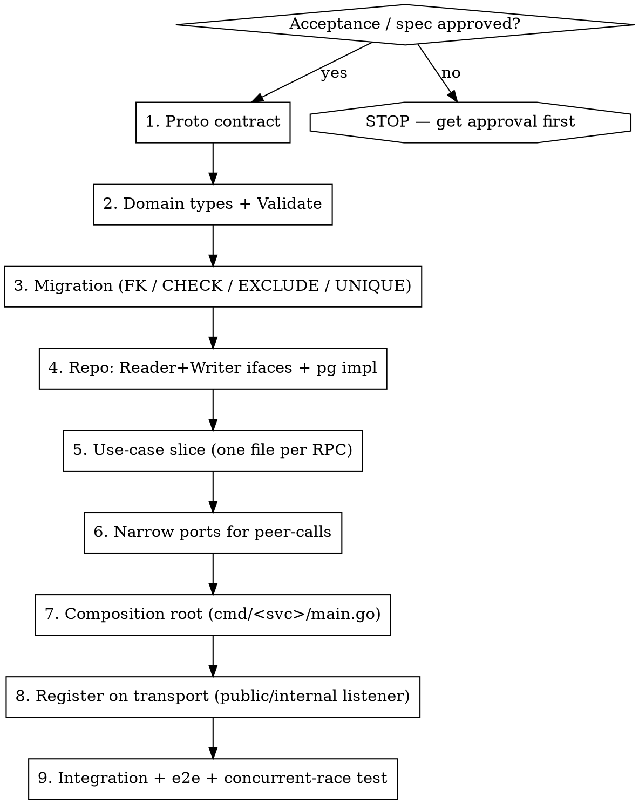

# Skill: godzila — Go API stylebook

A practical "how to write it" reference for backend Go APIs that follow this architectural style:

- **Clean Architecture** (`domain → use-case → adapter`).
- **CQRS Repository** with a hard Reader/Writer split.
- **Async LRO** envelope around every mutation (Operation pattern).
- **Atomic single Writer-TX** that holds DML + outbox-emit + commit.
- **Race-safety on the DB**, not in software.
- **Self-validating domain** with newtypes.
- **Sentinel-based error pipeline** (no string matching).
- **DTO registry** for domain ⇄ proto conversion.

The skill is intentionally **implementation-agnostic** — placeholders like `<resource>`, `Xxx`, `domain.Xxx`, `repo.XxxRecord`, `pb.Xxx`, `repo.ErrXxx`, `Prefix<X>` should be substituted to your project's names. Examples below assume gRPC + Postgres, but the same shape works for HTTP and other RDBMS.

### Use together with companion materials (when available)

`godzila` is the *practical "how to write it"* layer. It pairs with three other kinds of material — load them alongside `godzila` whenever the project provides them:

1. **A normative architectural regulation** (e.g. an `evgeniy`-style skill, an `ARCHITECTURE.md`, an ADR set) — the *"what is forbidden / required"* layer.
2. **A pattern vault / catalogue** with real code excerpts from the codebase — the *"how a concrete service implements each pattern"* reference, useful when adapting `godzila`'s placeholders to the project's actual types.
3. **A roster of specialist sub-agents** (`migration-writer`, `db-architect-reviewer`, `go-style-reviewer`, `proto-api-reviewer`, etc.) — delegate the narrow, well-bounded subtasks to them and keep `godzila` for the design / wiring.

Priority on conflict: **normative regulation > local CLAUDE.md > godzila**. `godzila` never overrides the project's own rules; it slots in *under* them. See §20 for the concrete cross-references this project uses.

---

## 0. When to apply

- Designing a new resource / a new RPC.
- Writing or refactoring a use-case.
- Writing a new DB migration.
- Adding a peer-service gRPC call.
- Refactoring an old fat `Service` into use-cases.
- Reviewing a PR that touches any of the above.

---

## 1. Cheat-sheet — must-know patterns

| # | Pattern | When | Anti-pattern |
|---|---|---|---|
| 1 | **Slice-per-RPC** — `handler.go` + one file per use-case (`create.go`, `update.go`, ...) | new RPC | fat `XxxService` with 10+ methods |
| 2 | **Thin handler**: parse → `useCase.Execute` → format | each RPC | business logic in transport |
| 3 | **CQRS Repository**: `repo.Reader(ctx)` / `repo.Writer(ctx)` | any DB work | single fat `Repository` w/ connection pool exposed |
| 4 | **Async LRO flow** — sync validate → create Operation → spawn worker that runs `doXxx` | every mutation | returning the resource synchronously from a mutation |
| 5 | **Atomic Writer-TX**: `defer w.Abort()` + DML + `Outbox.Emit` + `Commit` | every mutation | DML in one TX, outbox in another |
| 6 | **Atomic CAS** via single-statement `UPDATE ... WHERE expected RETURNING` | attach / detach / ownership change | software `Get → check → Update` (TOCTOU) |
| 7 | **xmin-OCC** snapshot+update for read-modify-write JSONB | merging structured fields under concurrency | mutex / extra version column |
| 8 | **DB-level invariants** (FK / CHECK / EXCLUDE / partial UNIQUE) | any reference / uniqueness / range invariant within the same DB | software-only refcheck |
| 9 | **UpdateMask discipline** — immutable→InvalidArgument, unknown→InvalidArgument, empty=full-PATCH with silent-ignore | every Update RPC | inline if-else over fields |
| 10 | **Domain newtypes + `Validate()`** with `multierr` | every field that carries semantics | raw `string`/`map[string]string` for name/desc/labels |
| 11 | **Sentinel errors + WrapPgErr + mapRepoErr + stripSentinel** | every repo + handler | `strings.Contains(err.Error(), ...)` |
| 12 | **Generic DTO registry** registered in `init()`; call sites use `Transfer(FromTo(...))` | new resource / new proto message | hand-written `toPb` without registration |
| 13 | **Single peer-client builder** + TTL+LRU decorator (positive + negative) | every new peer-call | bare `grpc.Dial` without retries / cache |
| 14 | **LISTEN/NOTIFY on a dedicated connection** (not pooled) + concurrency cap + catch-up loop | event streaming RPC | pooled connection for `LISTEN` |
| 15 | **Admin-RPC only on an internal listener**; interceptor rejects non-admin methods with `NotFound` | admin functionality | exposing admin RPC on the public listener |

---

## 2. End-to-end workflow for a new resource



Never start from the handler. Build bottom-up: **domain → migration → repo → use-case → handler**.

---

## 3. Canonical mutate use-case (template)

```go
// internal/.../api/<resource>/create.go
type CreateXxxUseCase struct {
    repo   Repository           // CQRS root: Reader(ctx) / Writer(ctx)
    peer   PeerClient           // narrow port for cross-service checks
    ops    OperationStore       // LRO persistence
}

func NewCreateXxxUseCase(r Repository, p PeerClient, o OperationStore) *CreateXxxUseCase {
    return &CreateXxxUseCase{repo: r, peer: p, ops: o}
}

// Execute — sync fast-fail validation + Operation envelope + spawn worker.
// Returns (op, nil) immediately; real work happens in the worker.
func (u *CreateXxxUseCase) Execute(ctx context.Context, in domain.Xxx) (*Operation, error) {
    // 3.1 SYNC validation — domain is self-validating
    if err := in.Validate(); err != nil {
        return nil, invalidArg(err)
    }
    // Race-free local prechecks (uniqueness in the *same* DB) — Reader TX.
    rd, err := u.repo.Reader(ctx)
    if err != nil { return nil, internalErr("open reader", err) }
    defer rd.Close()
    if existing, _ := rd.Xxxs().GetByName(ctx, in.OwnerID, in.Name); existing != nil {
        return nil, alreadyExists("Xxx with name %s exists", in.Name)
    }

    // 3.2 Pre-allocate the resource id and the Operation envelope
    resID := NewID(PrefixXxx)
    op, err := NewOperation(
        PrefixOperationXxx,
        fmt.Sprintf("Create xxx %s", in.Name),
        &pb.CreateXxxMetadata{XxxId: resID},
    )
    if err != nil { return nil, internalErr("create op", err) }
    if err := u.ops.Create(ctx, op); err != nil {
        return nil, internalErr("persist op", err)
    }

    // 3.3 Spawn worker — context MUST carry the caller's baggage
    //     (trace-id, request-id, logger fields). Do NOT use a bare
    //     context.Background() — it strips observability metadata.
    RunOperation(ctx, u.ops, op.ID, func(ctx context.Context) (*anypb.Any, error) {
        return u.doCreate(ctx, resID, in)
    })
    return &op, nil
}

// doCreate — atomic Writer-TX: peer-check + Insert + outbox-emit + Commit.
// Anything that can fail returns before Commit so defer w.Abort() rolls back.
func (u *CreateXxxUseCase) doCreate(ctx context.Context, id string, in domain.Xxx) (*anypb.Any, error) {
    in.ID = id

    // Peer existence check stays here (async path).
    // Race-prone sync prechecks (Exists-style) on the public path are removed:
    // rely on async + FK to surface NotFound through the Operation result.
    ok, err := u.peer.Exists(ctx, in.OwnerID)
    if err != nil { return nil, unavailable("peer check: %v", err) }
    if !ok       { return nil, notFound("Owner %s not found", in.OwnerID) }

    w, err := u.repo.Writer(ctx)
    if err != nil { return nil, internalErr("open writer", err) }
    defer w.Abort()                 // idempotent; safe on every return path

    rec, err := w.Xxxs().Insert(ctx, &in)
    if err != nil { return nil, mapRepoErr(err) }

    if err := w.Outbox().Emit(ctx, "Xxx", rec.ID, "CREATED", payloadOf(rec)); err != nil {
        return nil, internalErr("outbox emit", err)
    }
    if err := w.Commit(); err != nil { return nil, internalErr("commit", err) }

    return toAny(rec)               // DTO registry + anypb.New
}
```

What to verify line-by-line in review:

- `defer w.Abort()` precedes the first possible early return inside the TX.
- The outbox event lives in the **same** TX as the DML (atomicity guarantee).
- `mapRepoErr` catches the sentinel errors translated from SQLSTATEs (see §7).
- Race-prone synchronous peer-prechecks (`Exists`-style) are kept out of the sync path; rely on async + FK / CAS.

---

## 4. Canonical read use-case

```go
type GetXxxUseCase struct{ repo Repository }

func (u *GetXxxUseCase) Execute(ctx context.Context, id string) (*repo.XxxRecord, error) {
    if err := ValidateResourceID("xxx", PrefixXxx, id); err != nil {
        return nil, invalidArg(err)         // garbage id → InvalidArgument
    }
    rd, err := u.repo.Reader(ctx)
    if err != nil { return nil, internalErr("open reader", err) }
    defer rd.Close()
    rec, err := rd.Xxxs().Get(ctx, id)
    if err != nil { return nil, mapRepoErr(err) }
    return rec, nil
}
```

Rules:

- ID-shape validation is the **first** statement of any id-taking RPC. Garbage id → `InvalidArgument`; well-formed-but-missing → `NotFound` via `repo.Get`.
- Open the Reader-TX explicitly even when a single statement would do — it makes future routing to a read-replica a wiring change, not a rewrite.
- Filters and pagination go through reusable helpers (whitelisted fields, opaque cursor `(created_at, id)`).

---

## 5. UpdateMask discipline (non-negotiable)

| Case | Behaviour |
|---|---|
| mask empty | full-object PATCH; immutable values from body are silently ignored |
| mask contains unknown field | sync `InvalidArgument` |
| mask contains a **hard-immutable** field | sync `InvalidArgument`, message like `<field> is immutable after Xxx.Create` |
| mask contains a mutable field | validate + apply |
| mask contains a **soft-immutable** field | NOT an error (parity), but `applyXxxMask` does not copy it → no-op |

```go
func validateXxxUpdate(req *pb.UpdateXxxRequest) error {
    if req.UpdateMask != nil {
        if err := ValidateUpdateMask(req.UpdateMask, xxxKnownFields); err != nil {
            return invalidArg("update_mask: %v", err)         // unknown → InvalidArgument
        }
        for _, p := range req.UpdateMask.Paths {
            switch p {
            case "owner_id", "<other-immutable>":
                return invalidArg("%s is immutable after Xxx.Create", p)
            }
        }
    }
    return nil
}

func applyXxxMask(rec *repo.XxxRecord, req *pb.UpdateXxxRequest) *domain.Xxx {
    var inMask map[string]struct{}
    if req.UpdateMask != nil { inMask = setOf(req.UpdateMask.Paths) }
    n := rec.Xxx
    if _, ok := inMask["name"];        ok || req.UpdateMask == nil { n.Name = req.Name }
    if _, ok := inMask["description"]; ok || req.UpdateMask == nil { n.Description = req.Description }
    // immutable: never copied — not even on full-PATCH from body
    return &n
}
```

---

## 6. Race-safety — within-service invariants live in the DB

> Software `Get → check → Update` is a TOCTOU race. There is a class of incidents where two requests pass the software guard simultaneously, both run an unconditional `UPDATE`, and the second writer wins silently. **Every within-service invariant must be expressed in the DB.**

### 6.1 Atomic CAS for ownership / attach

```sql
UPDATE xxxs
   SET used_by = $new_owner, used_by_kind = $kind
 WHERE id = $1
   AND (used_by = '' OR used_by = $new_owner)   -- free OR already ours (idempotent)
RETURNING <cols>;
```

```go
// Returning 0 rows means "someone else owns it now" → FailedPrecondition.
if rows == 0 { return nil, repo.ErrFailedPrecondition }
```

A single-statement `UPDATE` on one row is protected by Postgres' row-level lock — parallel writers serialize and the second-attempt CAS sees the new value. No extra `UNIQUE` index is needed.

### 6.2 xmin-OCC for read-modify-write of JSONB

```sql
-- step 1: snapshot
SELECT rules, xmin::text FROM xxxs WHERE id = $1;
-- step 2: in-memory merge
-- step 3: CAS by xmin
UPDATE xxxs
   SET rules = $2, updated_at = now()
 WHERE id = $1 AND xmin::text = $3
RETURNING rules, xmin::text;
```

Zero overhead, no extra column. 0 rows → `FailedPrecondition` (conflict; client retries with the fresh xmin).

### 6.3 Partial UNIQUE

```sql
-- "name is unique per owner, but the empty name is allowed many times"
CREATE UNIQUE INDEX xxxs_owner_id_name_key
    ON xxxs (owner_id, name) WHERE name <> '';
```

### 6.4 EXCLUDE for range invariants

```sql
CREATE EXTENSION IF NOT EXISTS btree_gist;
ALTER TABLE ranges
  ADD CONSTRAINT ranges_no_overlap
  EXCLUDE USING gist (parent_id WITH =, span WITH &&);
-- SQLSTATE 23P01 → ErrInvalidArg / ErrFailedPrecondition (your call)
```

### 6.5 CHECK for cardinality / shape

```sql
ALTER TABLE xxxs
  ADD CONSTRAINT xxx_array_cardinality CHECK (jsonb_array_length(items) <= 1);
-- SQLSTATE 23514 → ErrInvalidArg
```

### 6.6 FK ON DELETE policy

| Policy | When to use |
|---|---|
| `RESTRICT` | parent cannot be deleted while children exist (default — explicit, safe) |
| `CASCADE` | child lives exactly as long as the parent (rare; e.g. owned sub-rows) |
| `SET NULL` | denormalised pointer that may dangle (e.g. `network.default_sg_id` → SG) |

### 6.7 SQLSTATE → sentinel mapping (single source of truth)

```go
func WrapPgErr(err error) error {
    var pgErr *pgconn.PgError
    if !errors.As(err, &pgErr) { return err }
    switch pgErr.Code {
    case "23503": return fmt.Errorf("%w: %s", ErrFailedPrecondition, pgErr.Message)  // FK violation
    case "23505": return fmt.Errorf("%w: %s", ErrAlreadyExists, pgErr.Message)       // UNIQUE
    case "23514": return fmt.Errorf("%w: %s", ErrInvalidArg, pgErr.Message)          // CHECK
    case "23P01": return fmt.Errorf("%w: %s", ErrInvalidArg, pgErr.Message)          // EXCLUDE
    }
    return err
}
```

---

## 7. Error mapping pipeline

```
repo SQL error (pgconn.PgError)
   → WrapPgErr           (SQLSTATE → repo.ErrXxx sentinel)
   → use-case bubbles up (errors.Is friendly; no message inspection)
   → handler.mapRepoErr  (sentinel → grpc/codes; stripSentinel for clean message)
   → wire format         (google.rpc.Status with stable, parity-safe text)
```

```go
func mapRepoErr(err error) error {
    switch {
    case errors.Is(err, repo.ErrNotFound):
        return status.Error(codes.NotFound, stripSentinel(err))
    case errors.Is(err, repo.ErrAlreadyExists):
        return status.Error(codes.AlreadyExists, stripSentinel(err))
    case errors.Is(err, repo.ErrFailedPrecondition):
        return status.Error(codes.FailedPrecondition, stripSentinel(err))
    case errors.Is(err, repo.ErrInvalidArg):
        return status.Error(codes.InvalidArgument, stripSentinel(err))
    default:
        return status.Error(codes.Internal, "internal database error")
    }
}
```

Rules:

- **Always `errors.Is`** — never `strings.Contains(err.Error(), ...)`. String matching breaks on wrap, i18n, and translations.
- The admin/internal listener uses a stricter mapper that *never* leaks the underlying message — generic `Internal` for anything unrecognised plus an audit tag.

---

## 8. Generic DTO registry

```go
// internal/dto/base.go
type Interface[F, T any] interface { Transfer(F) (T, error) }
type tag[_, _ any] struct{}

var transfersReg = map[reflect.Type]any{}

func RegTransfer[F, T any](impl Interface[F, T]) {
    transfersReg[reflect.TypeFor[tag[F, T]]()] = impl
}

// Closed type-set — compile-time gate over the allowed pairs.
type Transferrable interface {
    Perform() error
    *DTO[*repo.XxxRecord, *pb.Xxx] |
        *DTO[*repo.YyyRecord, *pb.Yyy] |
        *DTO[time.Time, *timestamppb.Timestamp]
}

func Transfer[V Transferrable](v V) error { return v.Perform() }
```

```go
// internal/dto/toproto/xxx.go
type xxx struct{}

func (xxx) toPb(rec *repo.XxxRecord) (*pb.Xxx, error) {
    return &pb.Xxx{
        Id:        rec.ID,
        Name:      string(rec.Name),
        CreatedAt: timestamppb.New(rec.CreatedAt.Truncate(time.Second)),
    }, nil
}

func init() { dto.RegTransfer(dto.Fn2Face(xxx{}.toPb)) }
```

```go
// Call site
import _ "<svc>/internal/dto/toproto"   // blank import registers all converters

var out *pb.Xxx
if err := dto.Transfer(dto.FromTo(rec, &out)); err != nil { ... }
```

Two layers of protection:

- **Compile-time:** the `Transferrable` union closes the set of allowed pairs; unknown pairs fail to compile.
- **Run-time:** `RegTransfer` registration via `init()` means a forgotten registration fails fast with a clear panic.

---

## 9. Peer-clients — single builder + TTL+LRU cache

```go
// internal/clients/builder.go
conn, err := clients.Build(ctx, clients.BuildOptions{
    Endpoint: cfg.Peer.Endpoint,
    TLS:      cfg.Peer.TLS.Enable,
    DNSLB:    cfg.Peer.DNSLB,        // dns:///<host> + round_robin for headless services
})
// Defaults: retries=3, dial-timeout=10s, keep-alive=30s, TLS MinVersion=1.2.
```

```go
// Decorate the raw client with a TTL+LRU cache.
folder := clients.NewCached(rawClient, clients.CacheConfig{
    PositiveTTL: 30 * time.Second,   // hot-path; tolerable to be slightly stale
    NegativeTTL: 5  * time.Second,   // short: a freshly-created resource must not be a 404 forever
    MaxSize:     10_000,
})
// Fail-open on Unavailable: errors are NOT cached.
```

Rules:

- One `clients.Build` for every outgoing peer connection. No bare `grpc.Dial`.
- TTL caches always cache the *positive* answer; cache the *negative* only briefly. Errors must not be cached.

---

## 10. Event streaming — LISTEN/NOTIFY on a dedicated connection

```go
func (h *WatchHandler) Watch(req *pb.WatchRequest, stream pb.WatchService_WatchServer) error {
    // 1) Per-stream concurrency cap (non-blocking acquire → ResourceExhausted).
    select {
    case h.slots <- struct{}{}:
        defer func() { <-h.slots }()
    default:
        return status.Error(codes.ResourceExhausted, "watch streams exhausted")
    }

    // 2) Dedicated connection — NOT from the pool. A pooled conn loses
    //    notifications when it is returned to the pool.
    connCtx, cancel := context.WithTimeout(stream.Context(), 2*time.Second)
    conn, err := pgx.Connect(connCtx, h.dsn)
    cancel()
    if err != nil { return status.Errorf(codes.Unavailable, "connect: %v", err) }
    defer conn.Close(stream.Context())

    if _, err := conn.Exec(stream.Context(), "LISTEN outbox"); err != nil { return err }
    defer func() { _, _ = conn.Exec(context.Background(), "UNLISTEN outbox") }()

    // 3) Catch-up loop in bounded batches (avoid OOM on cold start).
    cursor := req.FromSequenceNo
    for {
        batch := selectOutbox(cursor, /*limit*/ 100)
        cursor = stream(batch)
        if len(batch) < 100 { break }
    }

    // 4) Steady-state: WaitForNotification with a periodic re-poll fallback
    //    (NOTIFY is not 100% delivery-guaranteed under all PG versions).
    for {
        waitCtx, cancel := context.WithTimeout(stream.Context(), 30*time.Second)
        _, _ = conn.WaitForNotification(waitCtx); cancel()
        if err := stream.Context().Err(); err != nil { return nil }
        stream(selectOutboxSince(cursor))
    }
}
```

Forbidden: acquiring a pooled connection for `LISTEN`. Notifications are tied to the physical connection; pooling drops them when the conn is returned.

---

## 11. Domain layer — newtypes, builders, status enums

```go
// internal/domain/types.go
type (
    LabelKey      string
    LabelVal      string
    Labels        = dict.HDict[LabelKey, LabelVal]
    ResourceName  string                              // optionally a regex-validated newtype
    Description   string
)

var nameRe = regexp.MustCompile(`^[a-z]([-_a-z0-9]{0,61}[a-z0-9])?$`)

func (n ResourceName) Validate() error {
    if !nameRe.MatchString(string(n)) {
        return fmt.Errorf("name %q: %w", string(n), ErrInvalidArg)
    }
    return nil
}
```

```go
// internal/domain/xxx.go
type Xxx struct {
    ID, OwnerID  string
    Name         ResourceName
    Description  Description
    Labels       Labels
    // No CreatedAt — DB-managed; belongs to repo.XxxRecord wrapper.
}

func (x Xxx) Validate() error {
    return multierr.Combine(x.Name.Validate(), x.Description.Validate(), x.Labels.Validate())
}
```

```go
// internal/domain/xxx_builders.go
func NewDefaultChild(parent Xxx) ChildXxx {
    return ChildXxx{
        ID:       NewID(PrefixChild),
        ParentID: parent.ID,
        Name:     DefaultChildName(parent.ID),    // builder, not inline literal
        Status:   ChildStatusActive,              // const, not "ACTIVE"
        Rules:    NewDefaultChildRules(),         // builder, not inline literal
    }
}
```

Rules:

- No raw `string` for fields that carry semantics.
- No magic numbers; no inline status literals. Constants in a `status.go` and helpers in `builders.go`.
- `CreatedAt` is DB-managed; it lives on the **repo Record** wrapper, not on the domain entity.

---

## 12. Config — typed file + env override + enum modes

```yaml
# config.yaml
api-server:
  endpoint: tcp://0.0.0.0:9090
  internal-endpoint: tcp://0.0.0.0:9091
  graceful-shutdown: 10s
repository:
  postgres:
    url: postgres://...
    slave-url: ""              # empty → Reader-TX falls back to master
authn:
  mode: dev | production | production-strict
ext-api:
  peer-a: { endpoint: ..., tls: { enable: true }, dnslb: true }
```

```go
type Config struct {
    APIServer struct {
        Endpoint, InternalEndpoint string
        GracefulShutdown           time.Duration
    } `mapstructure:"api-server"`
    Repository struct {
        Postgres struct{ URL, SlaveURL string } `mapstructure:"postgres"`
    } `mapstructure:"repository"`
    AuthN struct{ Mode Mode } `mapstructure:"authn"`
}

type Mode int
const (
    ModeDev Mode = iota
    ModeProduction        // anonymous callers rejected
    ModeProductionStrict  // + TLS strictly validated
)
```

Rules:

- Defaults go to `config/defaults.go` (one place), not struct tags.
- Env binding goes through a library (`viper`, `koanf`, ...); do not annotate every field with envconfig tags.
- "Mode-like" flags are enums, not bools. `productionMode bool` reads worse and grows worse than `Mode`.

---

## 13. Testing pyramid

| Layer | Tool | What it proves |
|---|---|---|
| Unit (use-case) | in-memory `repomock` + deterministic operation wait (`AwaitOpDone`) | business logic; no DB needed |
| Integration (repo) | testcontainers Postgres | SQL side: FK / CHECK / EXCLUDE / UNIQUE / xmin / CAS-races (concurrent goroutines) |
| E2E (black-box) | API regression harness through the gateway | full RPC contract, error texts, parity |
| Load | k6 / ghz / equivalent | throughput, p99, error-rate against SLOs |

**A concurrent-race test is mandatory** for every CAS / partial-UNIQUE / EXCLUDE invariant:

```go
func TestXxx_OwnershipCAS_Race(t *testing.T) {
    // Two goroutines try to attach the same resource to two different owners.
    // Expect: exactly one success + one FailedPrecondition.
    var ok, fail atomic.Int32
    var wg sync.WaitGroup
    for i := 0; i < 2; i++ {
        wg.Add(1)
        go func(idx int) {
            defer wg.Done()
            _, err := writer.Xxxs().AttachTo(ctx, xxxID, owners[idx])
            if err == nil                                  { ok.Add(1) }
            if errors.Is(err, repo.ErrFailedPrecondition)  { fail.Add(1) }
        }(i)
    }
    wg.Wait()
    require.Equal(t, int32(1), ok.Load())
    require.Equal(t, int32(1), fail.Load())
}
```

Without this test, the CAS / UNIQUE / EXCLUDE invariant is **not verified** — unit tests do not exercise the race.

Project-wide rule: tests live in the same PR as the change they cover. "Tests follow-up" is allowed only when there is an explicit ticket reference; otherwise the PR is incomplete.

---

## 14. `cmd/` discipline — one binary per use-case

```
cmd/
├── <svc>/       # only `serve` — long-running API server
│   └── main.go
└── migrator/    # cobra-based: up | down | status | create
    └── main.go
```

Forbidden: `switch os.Args[1] { case "serve": ...; case "migrate": ... }` inside the main API binary. A new use-case is a new `cmd/<name>/`.

Use a parallel-execution helper (e.g. `corlib/parallel.ExecAbstract`) to run public + internal listeners + shutdown waiter. Failure isolation: if one fails, the others must stop too. A bare `go func() { srv.Serve(...) }()` is forbidden — it leaks orphan goroutines on partial failure.

---

## 15. Anti-patterns

| # | Anti-pattern | Why it is forbidden |
|---|---|---|
| AP-1 | A fat `XxxService` with 10+ methods | review blast-radius, hidden coupling, hard to mock per use-case |
| AP-2 | Domain validation logic inside the service / handler layer | domain must be self-validating; validation belongs to the type |
| AP-3 | Inline status / name literals (`Status: "ACTIVE"`, `"default-" + id[:8]`) | magic strings; no compiler help on rename |
| AP-4 | Magic numbers (`id[:8]`, `MaxRetries=3` inline) | constants in `domain/constants.go` |
| AP-5 | `Exists`-style sync prechecks against peer services on the public path | TOCTOU; extra hop. Rely on async + FK / CAS |
| AP-6 | `envconfig` struct tags as the primary config mechanism | use typed file + library binding |
| AP-7 | `go func() { srv.Serve(...) }()` with no error propagation | failure isolation lost; orphan goroutines |
| AP-8 | `bool productionMode` | enum (`Mode`) reads and extends better |
| AP-9 | Subcommand-mux inside the main API binary (`switch os.Args[1]`) | one binary per use-case |
| AP-10 | Raw `string` / `map[string]string` for fields that carry semantics | newtypes with `Validate()` |
| AP-11 | Hand-written `toPb` without DTO registry | loses the compile-time pair gate |
| AP-12 | `CreatedAt time.Time` in domain | DB-managed; belongs on the repo wrapper |
| AP-13 | Software `Get → check → Update` for within-service invariants | TOCTOU; use atomic CAS / partial UNIQUE / EXCLUDE |
| AP-14 | `strings.Contains(err.Error(), ...)` | use `errors.Is` against sentinels |
| AP-15 | Pooled connection for `LISTEN` | notifications lost on conn return; use a dedicated conn |
| AP-16 | DML in one TX + outbox in another | event/state divergence on partial failure |
| AP-17 | Mirror-tables of resources owned by another service | split-brain; call the owner instead, optionally cache |
| AP-18 | Test cases not registered in the suite's index (when the suite expects it) | hard-fail in CI; keeps the catalogue honest |
| AP-19 | Worker goroutine with `context.Background()` and no baggage | trace-id / request-id / slog attrs lost |
| AP-20 | Admin RPC exposed on the public listener | leaks admin surface; cross with the appropriate interceptor and a separate listener |

---

## 16. Red flags — stop and rethink

| Thought | Reality |
|---|---|
| "It is just CRUD, I can skip the use-case layer" | All CRUD goes through use-case + Operation. Consistency beats brevity. |
| "A sync precheck against a peer service will speed it up" | TOCTOU + extra hop. Use a positive TTL cache (~30s) and rely on async. |
| "I will use the pooled connection for `LISTEN`" | Notifications die when the conn returns to the pool. Use `pgx.Connect`. |
| "A software mutex defends against the race" | Multi-replica services do not share a mutex. Only the DB does. |
| "I will add the CHECK constraint later" | The DB is the last line of defence; bugs / admin SQL bypass app-level validation. |
| "Watch via SSE/WebSocket is fine" | Streaming Watch was retired; client polls List or the LRO `Get`. |
| "I will skip the e2e case — out of scope of this PR" | Forbidden by the project rule. Tests live in the same PR. |
| "`strings.Contains` is shorter than `errors.Is`" | Fragile under wrap/i18n. Only `errors.Is`. |
| "One Update RPC should handle every mutable thing" | Split endpoints when the OCC scope or audit semantics differ. |
| "An `interface{}` payload in outbox is heavy" | The payload is small (~hundreds of bytes); allocations are not the bottleneck. Atomicity is. |
| "I will just add it to the existing public service" | Admin functionality belongs on the internal listener behind the admin interceptor. |
| "I will retry the failed mutation outside the TX" | Either both DML and outbox happen, or neither. Retry the *whole* worker step. |

---

## 17. Discovery checklist (before any work)

- [ ] Spec / acceptance approved.
- [ ] Ticket created; branch matches the ticket id.
- [ ] Local trail (vault / ADR / RFC, whatever the project uses) is set up.
- [ ] Cross-repo dependency graph understood (merge order, build edges).
- [ ] Owner of every cross-domain reference is known.

## 18. Completion checklist (before requesting review)

- [ ] **Structure:** slice-per-RPC (`handler.go` + per-RPC files), no fat `Service`.
- [ ] **LRO:** every mutation goes through the Operation envelope.
- [ ] **TX atomicity:** `defer w.Abort()` + DML + `Outbox.Emit` + `Commit`.
- [ ] **DB invariants:** every within-service reference / uniqueness / range / cardinality has a DB-level constraint.
- [ ] **UpdateMask:** hard-immutable → `InvalidArgument`, unknown → `InvalidArgument`, soft-immutable silently ignored.
- [ ] **Domain:** newtypes with `Validate()`; no raw `string` for semantic fields.
- [ ] **Errors:** `errors.Is` against sentinels; no string matching; internal listener uses no-leak mapper.
- [ ] **DTO:** registered via `RegTransfer` in `init()`; call sites use `Transfer`.
- [ ] **Peer-clients:** built via the single builder; positive+negative TTL cache where applicable.
- [ ] **Listeners:** admin RPC only on internal listener; rejection interceptor in place.
- [ ] **Tests in the same PR:** integration (testcontainers) + e2e + a concurrent-race test for every CAS / partial-UNIQUE / EXCLUDE invariant.
- [ ] **Trail updated:** docs / ADR / vault entries reflect the change.

---

## 19. Substitution table

Replace these placeholders with your project's names before applying any snippet:

| Placeholder | Means |
|---|---|
| `<svc>` | service name (`my-svc`, `vpc`, `compute`, ...) |
| `<resource>` | resource name (`network`, `instance`, `order`, ...) |
| `Xxx`, `domain.Xxx` | domain type for the resource (`Network`, `Order`, ...) |
| `repo.XxxRecord` | repo wrapper carrying DB-managed fields (`CreatedAt`, ...) |
| `pb.Xxx` | generated proto type |
| `repo.ErrXxx` | sentinel errors (`ErrNotFound`, `ErrAlreadyExists`, ...) |
| `PrefixXxx` | resource id prefix (3-char Crockford-base32 or whatever scheme) |
| `Operation` / `OperationStore` | your LRO type + persistence port |
| `Repository` | CQRS root (`Reader(ctx)` / `Writer(ctx)` / `Close()`) |
| `OutboxEmitter` | outbox-writing port (`Emit(ctx, kind, id, event, payload)`) |
| `PeerClient` | narrow port for cross-service dependency |

---

## 20. Companion sources for this workspace

In *this* repository `godzila` is meant to be loaded **in a pair** with the materials below. If you are reusing the skill in a different project, substitute the equivalents that exist there (or skip the section).

### 20.1 Companion skill — normative regulation

- **`evgeniy`** — the *"what is required / what is forbidden"* layer. Where `godzila` shows templates, `evgeniy` defines the rules:
  - 48 architectural rules (A–L) extracted from a senior architect's PR review.
  - The 11-phase migration plan (newtypes → builders → use-cases → DTO → CQRS-Repository → config → migrator → parallel servers → grpc client-builder → context baggage → ER docs).
  - A review checklist applied to every PR.

  **Usage:** invoke `evgeniy` first on any refactor / new service / new resource / new domain type to confirm the design respects the rules; invoke `godzila` second for the concrete templates. On conflict, `evgeniy` wins.

### 20.2 Companion vault — pattern catalogue with real code

- **`obsidian/kacho/kacho-vpc/patterns/`** — 8 pattern files + a synthesis, with real code excerpts from `kacho-vpc`:
  - `SYNTHESIS.md` — deduplicated catalogue of unique cross-cutting patterns (the base from which this skill was distilled).
  - `api-network-subnet.md` — slice-per-RPC pilot (use-case structure as it actually looks on disk).
  - `api-address-nic.md` — IPAM cascade, atomic CAS for attach/detach, MAC retry-on-collision, cardinality CHECK.
  - `api-addresspool-sg.md` — 5-step cascade resolver with family-aware filter; OCC via `xmin` for split-endpoint Update.
  - `api-gw-rt-pe.md` — CRUD-only resources (parity-style, minimal business logic).
  - `domain-shared-config.md` — newtypes / builders / status enums / sentinel registry / viper-based config.
  - `repo-pg-cqrs.md` — Reader/Writer split, SQL templates, SQLSTATE → sentinel mapping, partial UNIQUE / EXCLUDE / FK contracts.
  - `clients-dto-handler.md` — `clients.Build`, cached peer-clients, generic DTO registry, tenant interceptor, `InternalWatch` LISTEN/NOTIFY.
  - `cmd-tests-sdk.md` — `cmd/migrator` (cobra), declarative newman cases, k6 scenarios, Makefile + Dockerfile.

  **Usage:** when `godzila` says "register the converter in `init()`" and you need to see exactly *how* it is done in this codebase, open the matching vault file. The vault is the bridge between this skill's placeholders and the actual project names.

### 20.3 Companion sub-agents — delegate narrow subtasks

When the work fits a specialist, delegate to them instead of doing it inline. Project-level agents (visible from any `project/<repo>/` via parent-walkup discovery):

- **Acceptance / planning:** `acceptance-author`, `acceptance-reviewer` — the gate to start coding (no implementation without an approved Given-When-Then doc).
- **Implementation:** `rpc-implementer` (end-to-end RPC), `service-scaffolder` (new repo), `migration-writer` (new goose migration), `api-gateway-registrar` (register a public RPC on the gateway).
- **Proto:** `proto-sync`, `proto-api-reviewer`.
- **Review:** `system-design-reviewer`, `db-architect-reviewer`, `go-style-reviewer`, `proto-api-reviewer`.
- **Tests:** `integration-tester`, `qa-test-engineer`.

VPC-specific agents (in the `kacho-vpc` repo): `vpc-yc-parity-auditor`, `vpc-cidr-specialist`, `vpc-outbox-watch-engineer`, `vpc-newman-author`, `vpc-load-testing`.

  **Usage:** when `godzila` says "write a new migration with FK / CHECK / EXCLUDE / partial UNIQUE", delegate to `migration-writer` and then to `db-architect-reviewer`; when it says "register the new RPC on the gateway", invoke `api-gateway-registrar`; when it says "write a concurrent-race test", let `integration-tester` produce the failing test first (TDD red phase).

### 20.4 Workspace-wide rules that always apply

- **Workspace `CLAUDE.md`** (kacho-workspace root) — bans #1–#11 (acceptance gate, no yandex/orm/cross-service-cascade, hard-delete, DB-only refs, tests in same PR, etc.) — these win over everything below.
- **Service `CLAUDE.md`** (e.g. `kacho-vpc/CLAUDE.md`) — service-specific conventions (id prefixes, hard-immutable fields, IPAM, NIC, migrations baseline). Wins over `godzila` on conflict.

### 20.5 Loading order in a fresh session

1. Workspace + service `CLAUDE.md` are loaded automatically via parent-walkup discovery.
2. Invoke `evgeniy` to refresh normative rules.
3. Invoke `godzila` to load templates.
4. Read the one or two vault files (1–3 KB narrow notes; see `obsidian/kacho/INDEX.md`) that match the resource you are touching.
5. Delegate the narrow steps to the specialist sub-agents listed in §20.3.

This pair-loading is the standard kachō-workspace flow — neither skill is meant to be used alone in this project.

---

**Bottom line.** This style trades a bit of boilerplate (slice-per-RPC, generic registries, explicit Reader/Writer split) for three properties that are extremely expensive to retrofit later:

1. **Atomic state changes** — DML and the matching event always land together.
2. **Race-safe within-service invariants** — protected by the DB itself, not by hopeful software guards.
3. **Mockable, testable, reviewable** business logic — one small file per RPC, narrow ports, no fat services.

If a shortcut tempts you to break any of those three, the cost surfaces later as a real incident. The patterns above are the cheapest known way to keep them.
