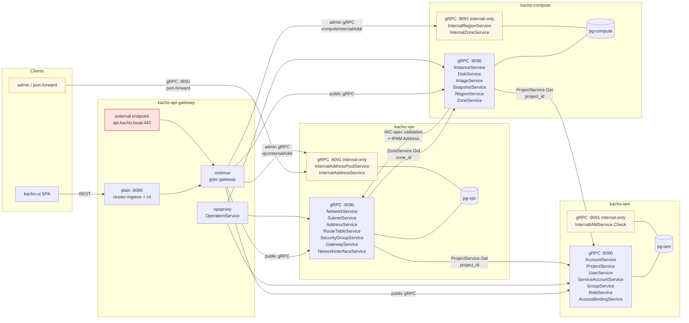

# 00 — Overview

## Что такое Kachō

Kachō — **собственная** облачная управляющая платформа (control plane) с
декларативным API. Это самостоятельный продукт со своей ресурсной моделью и
конвенциями Kachō; не клон и не реплика какого-либо стороннего облака. Платформа
принимает API, валидирует запросы, хранит state и возвращает `Operation`.
Реального data-plane (compute, storage, сеть поверх физических хостов) **нет** —
это исключительно управляющая часть.

Домены: **IAM** (Account / Project / User / ServiceAccount / Group / Role /
AccessBinding), **VPC** (Network / Subnet / SecurityGroup / RouteTable / Address /
Gateway / NetworkInterface), **Compute** (Instance / Disk / Image / Snapshot /
DiskType + Geography Region/Zone).

API — **плоские ресурсы** (flat message с domain-полями на верхнем уровне, без
вложенного envelope `spec`/`status`/`metadata`/`resourceVersion`/`generation`/
`finalizers`) + **асинхронные `Operation`** на каждой мутации. Чтения
(`Get`/`List`) синхронны; мутации (`Create`/`Update`/`Delete` и domain-действия)
возвращают `Operation`, клиент поллит `OperationService.Get(id)` до `done=true`.
Серверного Watch-стриминга нет (полл `List` 2–5 c или `Operation.Get` для in-flight).

Spec для отдельного data-plane проекта — `project/kacho-vpc-operator/`
(SRv6 + IPv6 underlay + dual-stack overlay + smartnic-eBPF) — на текущий
момент design-only, вне build-графа control plane.

## Цели

- **Чистый декларативный API**: единый предсказуемый паттерн на каждый ресурс —
  `Get`/`List` (sync) + `Create`/`Update`/`Delete` (async через `Operation`) +
  узкий набор domain-действий (`Start`/`Stop`/`AttachDisk`/`:addCidrBlocks`/…).
- **Минимум зависимостей**: Postgres, gRPC, kind для разработки. Никаких
  ORM, kafka, etcd, service-mesh.
- **Open architecture** — каждый домен в отдельном репозитории, можно
  развивать/выкатывать независимо (database-per-service, polyrepo).
- **Admin-extensible** — любые admin-операции делаются в `Internal*` сервисах
  (cluster-internal :9091) и не попадают на external endpoint.

## Состав репо (workspace)

| Репо | Тип | Состояние | Owns |
|---|---|---|---|
| `kacho-workspace` | meta | active | этот файл, общий CLAUDE.md, спеки, bootstrap |
| `kacho-proto` | proto | active | все .proto Kachō; сгенерированные Go-stubs commit'ятся в `gen/go/` |
| `kacho-corelib` | библиотека | active | ids, errors, config, observability, db pool, grpcsrv, operations, outbox, retry, shutdown, audit |
| `kacho-api-gateway` | edge | active | gRPC-proxy + grpc-gateway REST + cmux split + opsproxy |
| `kacho-iam` | сервис | active | Account, Project, User, ServiceAccount, Group, Role, AccessBinding + pg-iam |
| `kacho-vpc` | сервис | active | Network, Subnet, SecurityGroup, RouteTable, Address, Gateway, NetworkInterface, AddressPool + pg-vpc |
| `kacho-compute` | сервис | active | Instance, Disk, Image, Snapshot, DiskType + Geography (Region, Zone) + pg-compute |
| `kacho-nlb` | сервис | active | NetworkLoadBalancer, TargetGroup + pg-nlb |
| `kacho-deploy` | infra | active | kind config, helm umbrella, dev-up/down, reload-svc |
| `kacho-ui` | UI | active | Vite+React SPA control plane (generic Resource pages + admin IPAM pages) |
| `kacho-vpc-operator` | spec | spec-only | data-plane sibling VPC: SDN на гипервизорах (SRv6+IPv6+smartnic) |

`project/` — `gitignore`, каждый sibling-репо имеет собственный `.git/`.
`bootstrap.sh` клонирует sibling-репо в `project/`.

## Верхнеуровневая карта (mermaid)

## Что лежит за пределами текущего репо

- Реальный data-plane (eBPF/SRv6/smartnic) — design-only в
  `kacho-vpc-operator/docs/specs/`. Не запускается; вне build-графа.
- IAM/AuthN/AuthZ — реальная аутентификация (validated JWT/IAM-token) приходит с
  интеграцией IAM; в dev-mode всё работает как `anonymous` (full access).
- Биллинг, квоты, monitoring-стек, DNS, Object Storage, Managed Databases — out of scope.

## Иерархия владения

Account → Project. Все ресурсы доменов — project-level (`project_id` обязателен в
`Create`). IAM-сущности (Account / Project / User / ServiceAccount / Group / Role /
AccessBinding) — домен `kacho-iam`.

## Стек

- **Язык**: Go 1.25.
- **API**: gRPC + grpc-gateway (REST-фасад).
- **Proto**: buf (lint, breaking-change detection, code generation).
- **БД**: Postgres 16, `pgx/v5`, `sqlc` для типизированных запросов, `goose` для миграций.
- **Async**: per-service `operations`-таблица + worker (corelib `operations`) +
  транзакционный outbox с `LISTEN/NOTIFY` как wake-up signal.

## Куда идти дальше

- [01-services.md](01-services.md) — детали по каждому сервису.
- [02-data-flows.md](02-data-flows.md) — sequence-диаграммы реальных сценариев.
- [03-ipam.md](03-ipam.md) — IPAM (Region/Zone/AddressPool/аллокация).
