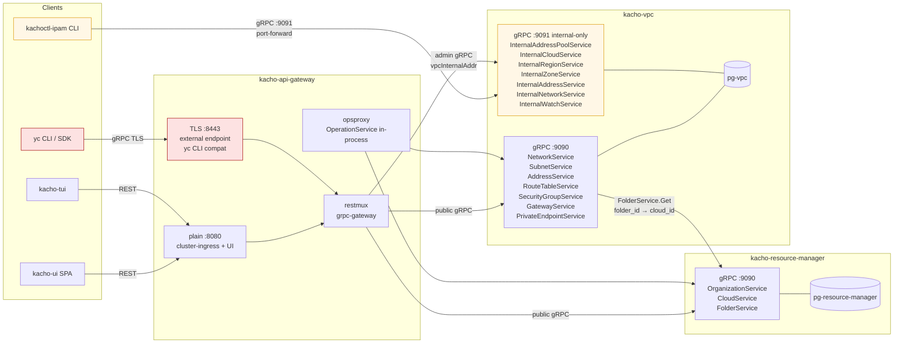

# 00 — Overview

## Что такое Kachō

Kachō — облачная управляющая платформа (control plane) для подмножества
доменов Yandex Cloud, реализованная по контракту **verbatim YC API**:
тот же proto, те же ошибки, те же status-коды, те же regex/тексты,
те же behavioural-семантики. Реального data-plane (compute, storage, сеть
поверх физических хостов) **нет** — это управляющая часть, которая принимает API,
валидирует, хранит state и возвращает Operations.

Spec для отдельного data-plane проекта — `project/kacho-vpc-implement/`
(SRv6 + IPv6 underlay + dual-stack overlay + smartnic-eBPF) — на текущий
момент design-only.

## Цели

- **Drop-in совместимость** с `yc` CLI и YC SDK для подмножества VPC + RM.
- **Минимум зависимостей**: Postgres, gRPC, kind для разработки. Никаких
  ORM, kafka, etcd, service-mesh.
- **Open architecture** — каждый домен в отдельном репозитории, можно
  развивать/выкатывать независимо.
- **Admin-extensible** — любые операции, которых нет в verbatim YC, делаются
  в `Internal*` сервисах и не попадают на external endpoint.

## Состав репо (workspace)

| Репо | Тип | Состояние | Owns |
|---|---|---|---|
| `kacho-workspace` | meta | active | этот файл, общий CLAUDE.md, спеки, bootstrap |
| `kacho-corelib` | библиотека | active | ids, errors, config, observability, db pool, grpcsrv, operations, retry, shutdown, audit |
| `kacho-proto` | proto | active | все .proto Kachō; generate Go-stubs commit'ятся в `gen/go/` |
| `kacho-resource-manager` | сервис | active | Organization, Cloud, Folder + pg-resource-manager |
| `kacho-vpc` | сервис | active | Network, Subnet, Address, RouteTable, SecurityGroup, Gateway, PrivateEndpoint **+** Region, Zone, AddressPool, CloudPoolSelector + pg-vpc |
| `kacho-api-gateway` | edge | active | gRPC-proxy + grpc-gateway REST + cmux split + opsproxy |
| `kacho-deploy` | infra | active | kind config, helm umbrella, dev-up/down, reload-svc |
| `kacho-ui` | UI | active | Vite+React SPA, ResourceListPage/DetailPage generic + custom IPAM admin pages |
| `kacho-tui` | UI | active | Go+tview terminal admin (k9s-style) |
| `kacho-test` | QA | active | Newman e2e (3-suite quota-aware) |
| `kacho-compute` | сервис | frozen | Instance/Disk/Image/Snapshot — план |
| `kacho-loadbalancer` | сервис | frozen | NLB/TargetGroup — план |
| `kacho-yc-shim` | adapter | frozen | YC compat-проксирование, если понадобится |
| `kacho-vpc-implement` | spec | spec-only | data-plane SDN на гипервизорах (SRv6+IPv6+smartnic) |

`project/` — `gitignore`, каждый sibling-репо имеет собственный `.git/`.
`bootstrap.sh` клонирует sibling-репо в `project/`.

## Верхнеуровневая карта (mermaid)

## Что лежит за пределами текущего репо

- Реальный data-plane (eBPF/SRv6/smartnic) — design-only в
  `kacho-vpc-implement/docs/specs/`. Не запускается.
- Compute / NLB домены — proto есть, имплементации нет (frozen).
- IAM/AuthN/AuthZ — `audit/` package в corelib скелет, реальной аутентификации
  нет, всё работает как `anonymous`.
- Биллинг, квоты, monitoring — out of scope.

## Куда идти дальше

- [01-services.md](01-services.md) — детали по каждому сервису.
- [03-ipam.md](03-ipam.md) — главная нетривиальная фича (Region/Zone/Pool/Cascade).
- [02-data-flows.md](02-data-flows.md) — sequence-диаграммы реальных сценариев.
