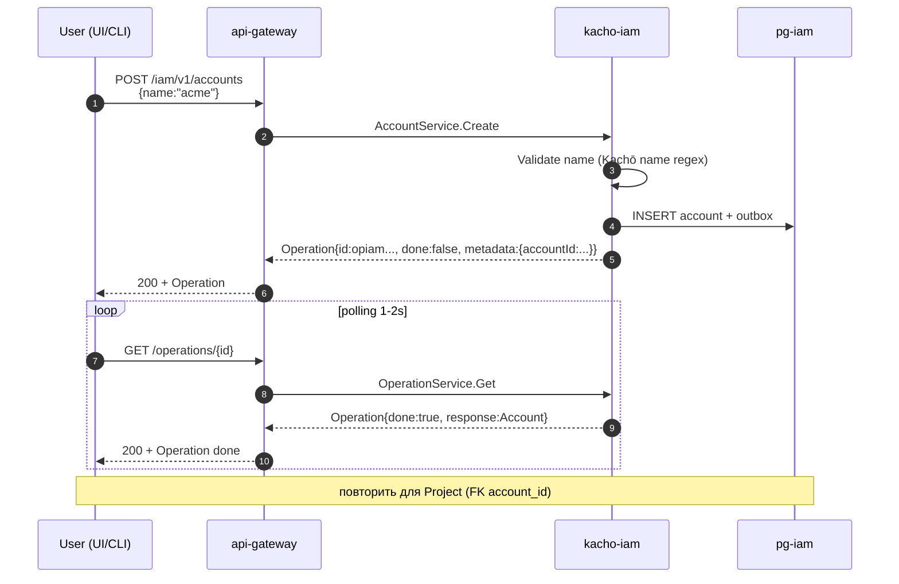
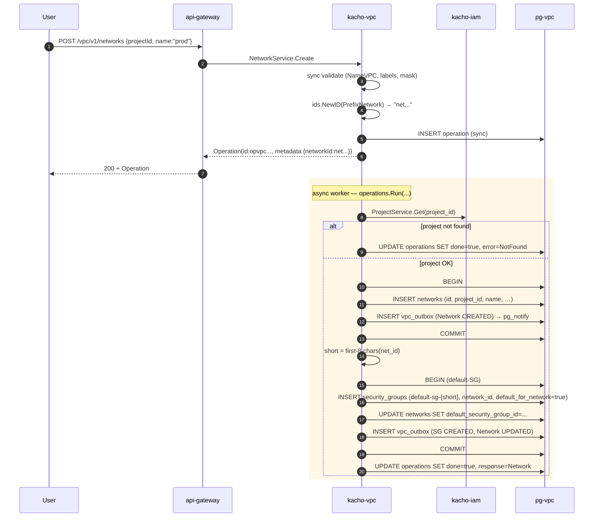
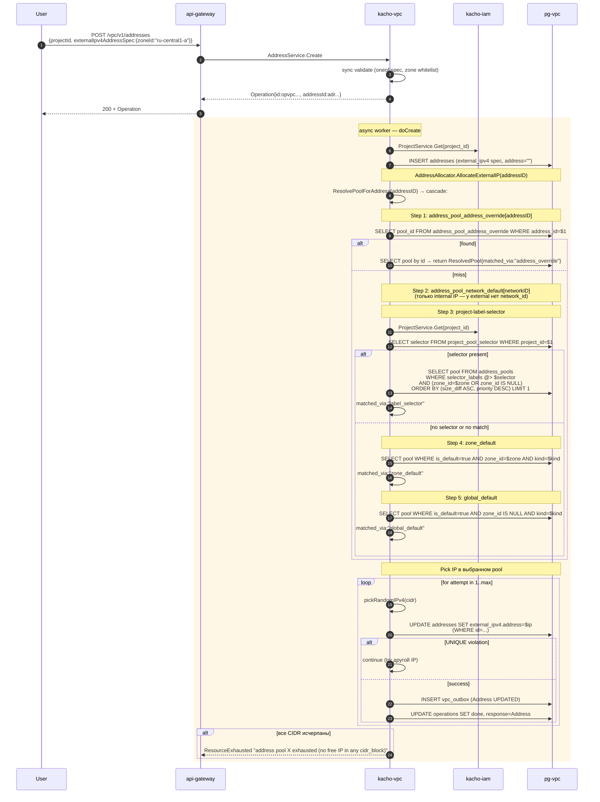
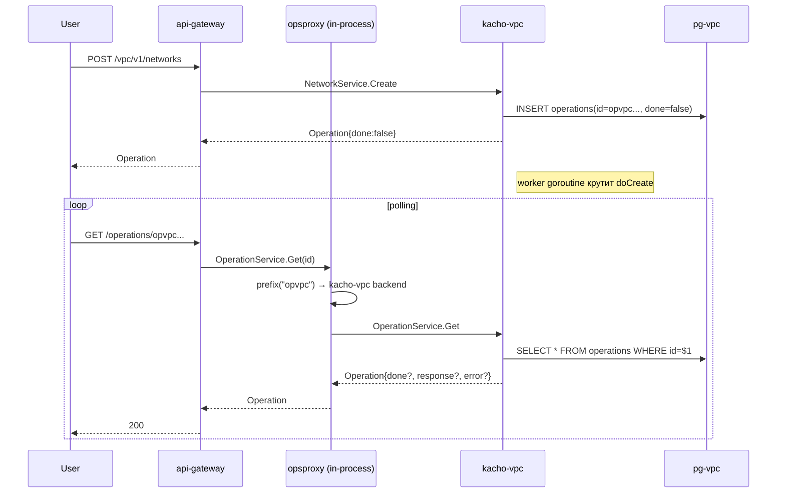
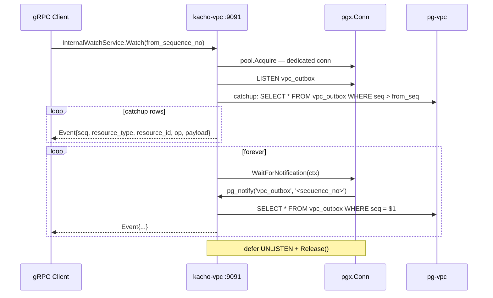
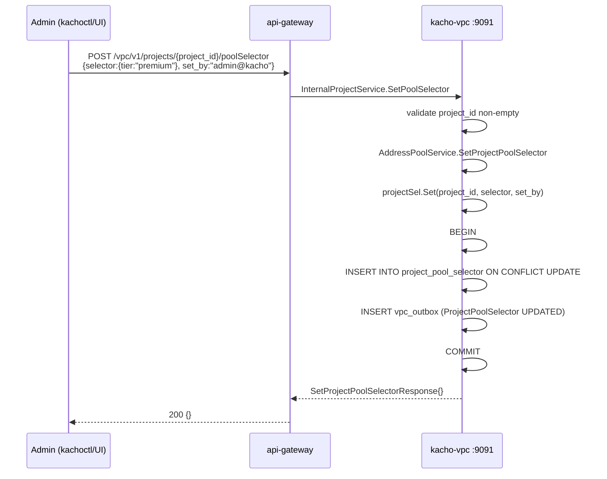

# 02 — Data Flows

Sequence-диаграммы ключевых сценариев. Все примеры — то, что **реально**
происходит в коде на момент написания (см. соответствующие service/repo).

## Содержание

1. [Setup: Account → Project](#1-setup-account--project)
2. [Network create + автогенерация default-SG](#2-network-create)
3. [External Address allocate с cascade](#3-external-address-allocate-с-cascade)
4. [Internal Address allocate из Subnet CIDR](#4-internal-address-allocate)
5. [Operations LRO polling](#5-operations-lro)
6. [InternalWatchService outbox stream](#6-internalwatchservice-outbox-stream)
7. [Admin: задать pool-selector на Project](#7-admin-задать-pool-selector-на-project)

## 1. Setup: Account → Project

Ключевые инварианты:
- `Project.UNIQUE(account_id, name)` — Create падает с `ALREADY_EXISTS`.
- `Project.account_id` иммутабельно через Update (immutable after Create).
- Malformed id → sync `InvalidArgument "invalid <res> id '<X>'"` первым стейтментом
  RPC; well-formed-но-нет → `NotFound` через `repo.Get`.

## 2. Network create

Особенности:
- **Inline default-SG creation** — раньше делал отдельный reconciler-loop, позже
  удалили, всё inline в worker'е операции.
- Error mapping: UNIQUE-violation `(project_id, name)` (миграция 0018) → `ALREADY_EXISTS`.

## 3. External Address allocate с cascade

Подробности cascade — в [03-ipam.md](03-ipam.md).

## 4. Internal Address allocate

То же что external, но:
- Нет `external_ipv4_spec`, есть `internal_ipv4_address_spec.subnet_id`.
- `AllocateInternalIP`: zone и pool не нужны — берётся CIDR из subnet.
- Step 2 cascade (`network_default`) активен — через `subnet.network_id`.
- UNIQUE на `(internal_subnet_id, address)` — `addresses_internal_subnet_ip_uniq` (computed-column на subnet_id, миграция 0006).

## 5. Operations LRO

`opsproxy` — in-process router в api-gateway, который смотрит на ID prefix
(`opvpc...` → vpc, `opiam...` → iam) и делегирует на нужный backend.
Это даёт **один** `OperationService` URL для клиента без знания о том, какой
backend выполнил мутацию. Watch-стриминга на публичной поверхности нет — клиент
поллит `OperationService.Get(id)` до `done=true` (и `List` 2–5 c для актуализации
коллекций).

## 6. InternalWatchService outbox stream

Только для server-to-server (UI/CLI не используют; на external TLS-endpoint не
маршрутизируется — internal mux :9091).

Тригер `vpc_outbox_notify_trg` на INSERT в `vpc_outbox` шлёт `pg_notify`. Это
internal-механизм журнала событий (транзакционный outbox), а не публичный Watch
RPC.

## 7. Admin: задать pool-selector на Project

После set'а **следующий** `AllocateExternalIP` для Address из этого project'а
будет использовать selector в cascade Step 3.

## Где смотреть детали

| Поток | Код |
|---|---|
| Network create + default-SG | `kacho-vpc/internal/service/network.go::doCreate` |
| Address allocate cascade | `kacho-vpc/internal/service/address_pool_service.go::resolveWithRunnerUp` |
| AllocateExternalIP retry loop | `kacho-vpc/internal/service/address_allocate.go::AllocateExternalIP` |
| Operations worker | `kacho-corelib/operations/run.go` |
| Outbox + LISTEN/NOTIFY | `kacho-vpc/internal/handler/internal_watch_handler.go` |
| ProjectClient.Get | `kacho-vpc/internal/clients/iam_client.go` |
