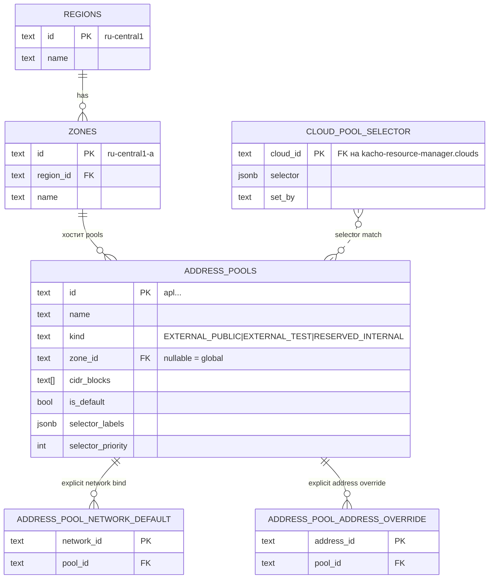
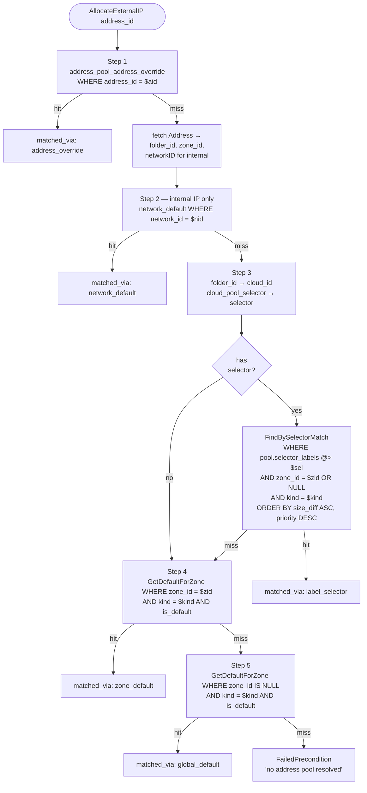

# 03 — IPAM Model

Главная нетривиальная фича. **Полностью kacho-only** — в YC такого
разделения регион/зона/пул на admin-уровне нет, всё внутри VPC API.

## Сущности



### Region

- **Глобальный admin-only ресурс**. Нет folder/cloud/org.
- PK: `id` (e.g. `ru-central1`).
- Seed: миграция 0019 → `ru-central1`.
- Управление: `InternalRegionService` + `kachoctl-ipam region {create|get|list|update|delete}`.
- FK: `zones.region_id` (RESTRICT) — нельзя удалить регион с зонами.

### Zone

- **Глобальный admin-only ресурс**.
- PK: `id` (e.g. `ru-central1-a`).
- FK: `region_id` REFERENCES regions(id) RESTRICT.
- Seed: миграция 0019 → `ru-central1-{a,b,d}`.
- UNIQUE: `(region_id, name) WHERE name <> ''` (миграция 0022).
- FK: `address_pools.zone_id` (RESTRICT) — нельзя удалить зону с пулами.

### AddressPool

- **Глобальный admin-only ресурс**, нет folder/cloud/org (миграция 0021
  убрала `folder_id`).
- PK: `id` (`apl...`).
- Поля:
  - `name`, `description`, `labels`.
  - `cidr_blocks TEXT[]` — IPv4 CIDR-блоки.
  - `kind` — enum (`EXTERNAL_PUBLIC | EXTERNAL_TEST | RESERVED_INTERNAL`).
  - `zone_id` — FK на zones, nullable. NULL = глобальный pool (fallback).
  - `is_default` — флаг для cascade Step 4/5.
  - `selector_labels JSONB`, `selector_priority INT` — для cascade Step 3.
- UNIQUE constraint: один `is_default=true` на `(COALESCE(zone_id, ''), kind)`
  (миграция 0020).
- UNIQUE: `(external_ipv4 ->> 'address_pool_id', external_ipv4 ->> 'address')`
  partial index на `addresses` (миграция 0015) — гарантия что один и тот же IP
  не выделится дважды в одном pool.

### CloudPoolSelector

- **kacho-only**. Хранится в `kacho-vpc.cloud_pool_selector` (миграция 0022).
- PK: `cloud_id` (foreign — указывает на `kacho-resource-manager.clouds`,
  но кросс-DB FK нет, валидация только на момент `Set` через `FolderClient`).
- Содержит `selector JSONB`, `set_by`, `set_at`.
- GIN индекс для `@>`-запросов (cascade resolve).
- Раньше был `network_pool_selector` — выпилили миграцией 0022, потому что
  external Address не имеет `network_id` и cascade не срабатывал.

### Bindings (explicit)

- `address_pool_network_default(network_id PK, pool_id)` — для cascade Step 2.
- `address_pool_address_override(address_id PK, pool_id)` — для cascade Step 1.

## Cascade resolve

Используется в `AddressAllocator.AllocateExternalIP` (kacho-vpc).
Вход: `address_id`. Выход: `pool_id` (или `ResourceExhausted/NotFound`).



## Match семантика

**Inverse-containment**: `network_selector ⊆ pool.selector_labels` (то есть
`pool` описывает **whitelist разрешённых labels**). Если у network есть label,
не упомянутый в pool → она **не** match'ается. Это safe-by-default —
"новая комбинация labels" уйдёт в default-pool, а не в премиум.

| pool.selector_labels | cloud-selector | match |
|---|---|---|
| `{tier:premium}` | `{tier:premium}` | ✅ |
| `{tier:premium}` | `{tier:premium, customer:acme}` | ❌ (customer не упомянут в pool) |
| `{tier:premium, customer:acme}` | `{tier:premium}` | ✅ (cloud ⊆ pool) |
| `{tier:premium, customer:acme}` | `{tier:premium, customer:acme, env:prod}` | ❌ (env не упомянут) |

`@>` в Postgres jsonb — точно эта семантика: `pool.labels @> $cloud_labels`
true когда `pool.labels` содержит **все** ключи `cloud_labels` с теми же
значениями.

## Tie-break при equal-specificity и equal-priority

ORDER BY:
1. `(size(pool.selector_labels) - size(cloud_selector)) ASC` — точнее лучше.
2. `selector_priority DESC` — выше = wins.

При equal-equal: **resolve order undefined** — Postgres вернёт первую row.
Используй `kachoctl ipam check` (или `InternalAddressPoolService.Check` RPC)
для обнаружения ambiguous конфигов.

## IP picker

`AddressAllocator.AllocateExternalIP` после resolve:

```go
for attempt := 0; attempt < allocateMaxAttempts; attempt++ {
    for _, cidr := range pool.CIDRBlocks {
        ip := pickRandomIPv4(cidr) // exclude .0/.255
        err := addrRepo.SetIPSpec(addressID, &ExternalIpv4Spec{
            Address:       ip,
            ZoneID:        zone,
            AddressPoolID: pool.ID,
        })
        if isUniqueViolation(err) {
            continue // try другой IP
        }
        return result, err
    }
}
return nil, status.Errorf(codes.ResourceExhausted,
    "address pool %s exhausted (no free IP in any cidr_block)", pool.ID)
```

`isUniqueViolation` распознаёт **обе** формы:
- raw pgErr (substring `SQLSTATE 23505` / `addresses_external_pool_ip_uniq`)
- обёртку `service.ErrAlreadyExists` (через `errors.Is`)

Это критично — без второй ветки `wrapPgErr` в `SetIPSpec` ломал retry-loop
и наружу шёл raw "already exists" вместо `ResourceExhausted`.

## Utilization (admin observability)

`InternalAddressPoolService.GetUtilization(pool_id)` возвращает:

```json
{
  "poolId": "apl...",
  "totalIps": "510",
  "usedIps": "127",
  "freeIps": "383",
  "usedPercent": 24,
  "cidrs": [
    {"cidr":"198.51.100.0/24", "total":254, "used":120},
    {"cidr":"203.0.113.0/24",  "total":254, "used":7}
  ]
}
```

- `total` per CIDR = `2^(32-bits) - 2` (исключая network/broadcast).
  Для /31 = 2 (RFC 3021), /32 = 1.
- `used` per CIDR — Postgres `address::inet << cidr` подсчёт.

REST: `GET /vpc/v1/addressPools/{pool_id}/utilization` (через apiGW).

## Две иерархии (важный момент)

```
КЛИЕНТСКАЯ                            СИСТЕМНАЯ
───────────                            ─────────
Organization                           (no parent)
   └─ Cloud                            Region (admin-managed)
        └─ Folder ◄──────┐                └─ Zone (admin-managed)
              └─ Network │                      └─ AddressPool (admin-managed)
                  └─ Subnet                          │
                       └─ Address (internal IPv4)    │
                                                     │
              └─ Address (external IPv4) ◄───────────┘
                  external_ipv4.address_pool_id

           └─ CloudPoolSelector ──┐
              (admin labels на     │ влияет
               клиентский Cloud)   ▼
                            cascade Step 3
```

- **Клиентская иерархия** — verbatim YC (RM + VPC).
- **Системная иерархия** — kacho-only, admin-managed. Pool/Region/Zone не
  принадлежат клиенту, но external Address клиента берёт IP оттуда.
- **Связь**: `Cloud` (клиентский) — точка пересечения, на ней висит
  admin-управляемый `CloudPoolSelector` для cascade routing.

## Управление через kachoctl-ipam

```bash
# Region/Zone — глобальный admin
kachoctl-ipam region create --id eu-west1 --name "Europe West 1"
kachoctl-ipam zone create --id eu-west1-a --region-id eu-west1 --name "EUW1-A"

# Pool — глобальный admin
kachoctl-ipam pool create \
  --kind EXTERNAL_PUBLIC \
  --zone-id ru-central1-a \
  --cidr 198.51.100.0/24 \
  --is-default \
  --name default-zone-a

# Pool со селектором (премиум-клиенты)
kachoctl-ipam pool create \
  --kind EXTERNAL_PUBLIC \
  --zone-id ru-central1-a \
  --cidr 203.0.113.0/24 \
  --selector tier=premium \
  --priority 100 \
  --name premium-pool

# Cloud-selector — admin привязывает Cloud к premium routing
kachoctl-ipam cloud set-pool-selector \
  --cloud b1g... --selector tier=premium

# Diagnostics
kachoctl-ipam ipam check                     # ambiguous configs
kachoctl-ipam ipam explain --address adr...  # какой pool выберется
```

## REST endpoints (admin)

Все на cluster-internal listener (port 8080), на TLS (8443) НЕ публикуются:

```
GET    /vpc/v1/regions
POST   /vpc/v1/regions
GET    /vpc/v1/regions/{region_id}
PATCH  /vpc/v1/regions/{region_id}
DELETE /vpc/v1/regions/{region_id}

GET    /vpc/v1/zones?regionId=
POST   /vpc/v1/zones
GET    /vpc/v1/zones/{zone_id}
PATCH  /vpc/v1/zones/{zone_id}
DELETE /vpc/v1/zones/{zone_id}

GET    /vpc/v1/addressPools?zoneId=&kind=
POST   /vpc/v1/addressPools
GET    /vpc/v1/addressPools/{pool_id}
PATCH  /vpc/v1/addressPools/{pool_id}
DELETE /vpc/v1/addressPools/{pool_id}
GET    /vpc/v1/addressPools/{pool_id}/utilization
GET    /vpc/v1/addressPools/{pool_id}/addresses?folderId=
GET    /vpc/v1/addressPools:check?zoneId=
GET    /vpc/v1/addressPools:explainResolution?addressId=&networkId=

POST   /vpc/v1/networks/{network_id}/addressPoolBinding   {poolId}
DELETE /vpc/v1/networks/{network_id}/addressPoolBinding
POST   /vpc/v1/addresses/{address_id}/addressPoolOverride {poolId}
DELETE /vpc/v1/addresses/{address_id}/addressPoolOverride

POST   /vpc/v1/clouds/{cloud_id}/poolSelector  {selector, set_by}
GET    /vpc/v1/clouds/{cloud_id}/poolSelector
DELETE /vpc/v1/clouds/{cloud_id}/poolSelector
```
