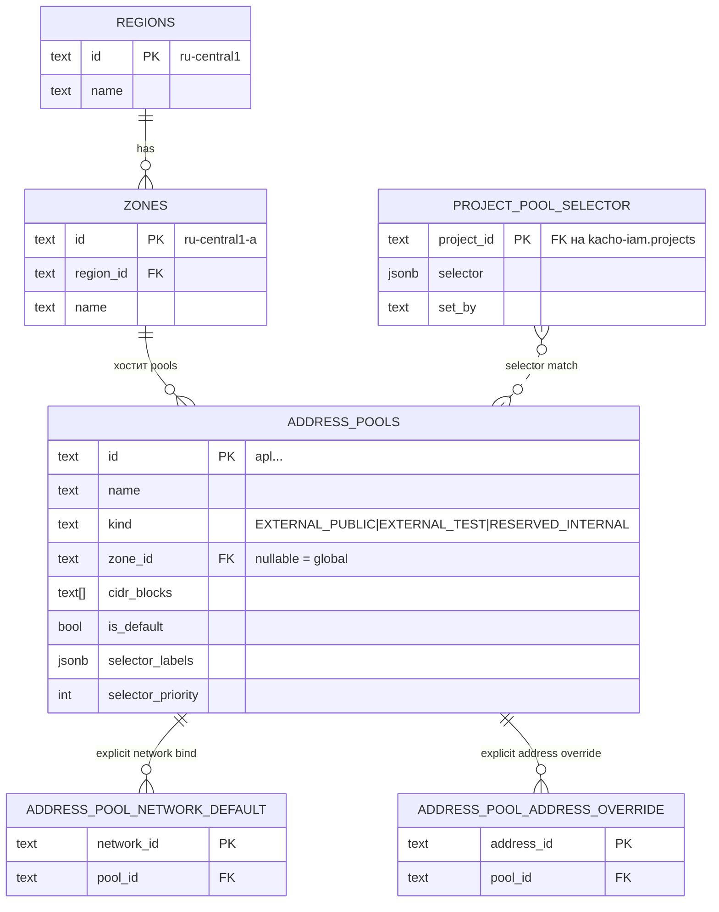

# 03 — IPAM Model

Главная нетривиальная фича Kachō VPC: admin-управляемая иерархия
**Region → Zone → AddressPool** для выделения внешних IP. Это собственная модель
Kachō — разделение region/zone/pool вынесено на admin-уровень (`Internal*`-API),
отдельно от tenant-facing VPC API.

## Сущности



> **Владение Geography.** `Region`/`Zone` — домен **kacho-compute** (Geography).
> kacho-vpc валидирует `zone_id` через `compute.v1.ZoneService.Get` и ссылается на
> зоны по id. ER-диаграмма выше показывает логические связи модели IPAM; физически
> `regions`/`zones` живут в БД kacho-compute, а `address_pools`/bindings/selector —
> в БД kacho-vpc (cross-DB FK нет, валидация по API владельца).

### Region

- **Глобальный admin-only ресурс** (Geography, домен kacho-compute). Нет project-привязки.
- PK: `id` (e.g. `ru-central1`).
- Seed: миграция compute → `ru-central1`.
- Управление: `InternalRegionService` (admin-only, :9091).
- FK: `zones.region_id` (RESTRICT) — нельзя удалить регион с зонами.

### Zone

- **Глобальный admin-only ресурс** (Geography, домен kacho-compute).
- PK: `id` (e.g. `ru-central1-a`).
- FK: `region_id` REFERENCES regions(id) RESTRICT.
- Seed: миграция compute → `ru-central1-{a,b,d}`.
- UNIQUE: `(region_id, name) WHERE name <> ''`.
- Ссылается в kacho-vpc через `address_pools.zone_id` (cross-DB, без FK) — пул в
  несуществующей зоне отклоняется на admin-create через `ZoneService.Get`.

### AddressPool

- **Глобальный admin-only ресурс** kacho-vpc, нет project-привязки (миграция 0021
  убрала прежнее owner-поле).
- PK: `id` (`apl...`).
- Поля:
  - `name`, `description`, `labels`.
  - `cidr_blocks TEXT[]` — IPv4 CIDR-блоки.
  - `kind` — enum (`EXTERNAL_PUBLIC | EXTERNAL_TEST | RESERVED_INTERNAL`).
  - `zone_id` — ссылка на zone (kacho-compute), nullable. NULL = глобальный pool (fallback).
  - `is_default` — флаг для cascade Step 4/5.
  - `selector_labels JSONB`, `selector_priority INT` — для cascade Step 3.
- UNIQUE constraint: один `is_default=true` на `(COALESCE(zone_id, ''), kind)`
  (миграция 0020).
- UNIQUE: `(external_ipv4 ->> 'address_pool_id', external_ipv4 ->> 'address')`
  partial index на `addresses` (миграция 0015) — гарантия что один и тот же IP
  не выделится дважды в одном pool.

AddressPool — admin-only (`Internal*`-сервис, :9091); на external endpoint не
публикуется.

### ProjectPoolSelector

- Admin-управляемая привязка label-селектора к клиентскому Project.
  Хранится в `kacho-vpc.project_pool_selector` (миграция 0022).
- PK: `project_id` (ссылается на `kacho-iam.projects` — кросс-DB FK нет, валидация
  только на момент `Set` через ProjectClient / `iam.v1.ProjectService.Get`).
- Содержит `selector JSONB`, `set_by`, `set_at`.
- GIN индекс для `@>`-запросов (cascade resolve).
- Раньше был `network_pool_selector` — выпилили миграцией 0022, потому что
  external Address не имеет `network_id` и cascade не срабатывал.

### Bindings (explicit)

- `address_pool_network_default(network_id PK, pool_id)` — для cascade Step 2.
- `address_pool_address_override(address_id PK, pool_id)` — для cascade Step 1.

## Cascade resolve

Используется в `AddressAllocator.AllocateExternalIP` (kacho-vpc).
Вход: `address_id`. Выход: `pool_id` (или `ResourceExhausted/NotFound`).


## Match семантика

**Inverse-containment**: `project_selector ⊆ pool.selector_labels` (то есть
`pool` описывает **whitelist разрешённых labels**). Если у проекта есть label,
не упомянутый в pool → он **не** match'ается. Это safe-by-default —
"новая комбинация labels" уйдёт в default-pool, а не в премиум.

| pool.selector_labels | project-selector | match |
|---|---|---|
| `{tier:premium}` | `{tier:premium}` | ✅ |
| `{tier:premium}` | `{tier:premium, customer:acme}` | ❌ (customer не упомянут в pool) |
| `{tier:premium, customer:acme}` | `{tier:premium}` | ✅ (project ⊆ pool) |
| `{tier:premium, customer:acme}` | `{tier:premium, customer:acme, env:prod}` | ❌ (env не упомянут) |

`@>` в Postgres jsonb — точно эта семантика: `pool.labels @> $project_labels`
true когда `pool.labels` содержит **все** ключи `project_labels` с теми же
значениями.

## Tie-break при equal-specificity и equal-priority

ORDER BY:
1. `(size(pool.selector_labels) - size(project_selector)) ASC` — точнее лучше.
2. `selector_priority DESC` — выше = wins.

При equal-equal: **resolve order undefined** — Postgres вернёт первую row.
Используй `InternalAddressPoolService.Check` RPC для обнаружения ambiguous конфигов.

## IP picker

`AddressAllocator.AllocateExternalIP` после resolve:

```go
for attempt := 0; attempt < allocateMaxAttempts; attempt++ {
    for _, cidr := range pool.CIDRBlocks {
        ip := pickRandomIPv4(cidr) // exclude .0/.255
        err := addrRepo.SetIPSpec(addressID, &ExternalIpv4Spec{
            Address:       ip,
            ZoneID:        zone,
            AddressPoolID: pool.ID,
        })
        if isUniqueViolation(err) {
            continue // try другой IP
        }
        return result, err
    }
}
return nil, status.Errorf(codes.ResourceExhausted,
    "address pool %s exhausted (no free IP in any cidr_block)", pool.ID)
```

`isUniqueViolation` распознаёт **обе** формы:
- raw pgErr (substring `SQLSTATE 23505` / `addresses_external_pool_ip_uniq`)
- обёртку `service.ErrAlreadyExists` (через `errors.Is`)

Это критично — без второй ветки `wrapPgErr` в `SetIPSpec` ломал retry-loop
и наружу шёл raw "already exists" вместо `ResourceExhausted`.

## Utilization (admin observability)

`InternalAddressPoolService.GetUtilization(pool_id)` возвращает:

```json
{
  "poolId": "apl...",
  "totalIps": "510",
  "usedIps": "127",
  "freeIps": "383",
  "usedPercent": 24,
  "cidrs": [
    {"cidr":"198.51.100.0/24", "total":254, "used":120},
    {"cidr":"203.0.113.0/24",  "total":254, "used":7}
  ]
}
```

- `total` per CIDR = `2^(32-bits) - 2` (исключая network/broadcast).
  Для /31 = 2 (RFC 3021), /32 = 1.
- `used` per CIDR — Postgres `address::inet << cidr` подсчёт.

REST: `GET /vpc/v1/addressPools/{pool_id}/utilization` (через apiGW, cluster-internal).

## Две иерархии (важный момент)

```
КЛИЕНТСКАЯ                            СИСТЕМНАЯ
───────────                            ─────────
Account                                (no parent)
   └─ Project ◄────────┐              Region (admin-managed)
        └─ Network     │                 └─ Zone (admin-managed)
            └─ Subnet  │                       └─ AddressPool (admin-managed)
                 └─ Address (internal IPv4)          │
                                                     │
        └─ Address (external IPv4) ◄─────────────────┘
            external_ipv4.address_pool_id

        └─ ProjectPoolSelector ──┐
           (admin labels на       │ влияет
            клиентский Project)    ▼
                            cascade Step 3
```

- **Клиентская иерархия** — IAM (Account → Project) + VPC. Все ресурсы доменов —
  project-level (`project_id`).
- **Системная иерархия** — admin-managed. Pool/Region/Zone не принадлежат клиенту,
  но external Address клиента берёт IP оттуда.
- **Связь**: `Project` (клиентский) — точка пересечения, на ней висит
  admin-управляемый `ProjectPoolSelector` для cascade routing.

## Управление через Internal admin-API

Region/Zone — Geography (домен kacho-compute), admin-only `Internal*`-сервисы;
AddressPool / bindings / project-selector — admin-only `Internal*`-сервисы kacho-vpc.
Примеры admin-операций (через cluster-internal endpoint):

```text
# Region/Zone — глобальный admin (Geography, kacho-compute)
Region.Create  id=eu-west1     name="Europe West 1"
Zone.Create    id=eu-west1-a   region_id=eu-west1  name="EUW1-A"

# Pool — глобальный admin (kacho-vpc)
AddressPool.Create
  kind=EXTERNAL_PUBLIC
  zone_id=ru-central1-a
  cidr_blocks=[198.51.100.0/24]
  is_default=true
  name=default-zone-a

# Pool со селектором (премиум-клиенты)
AddressPool.Create
  kind=EXTERNAL_PUBLIC
  zone_id=ru-central1-a
  cidr_blocks=[203.0.113.0/24]
  selector_labels={tier:premium}
  selector_priority=100
  name=premium-pool

# Project-selector — admin привязывает Project к premium routing
ProjectPoolSelector.Set  project_id=b1g...  selector={tier:premium}

# Diagnostics
InternalAddressPoolService.Check                       # ambiguous configs
InternalAddressPoolService.ExplainResolution address=adr...  # какой pool выберется
```

## REST endpoints (admin)

Все на cluster-internal listener (через api-gateway internal mux); на external
TLS-endpoint НЕ публикуются (`Internal*`-сервисы, ban #6):

```
GET    /vpc/v1/addressPools?zoneId=&kind=
POST   /vpc/v1/addressPools
GET    /vpc/v1/addressPools/{pool_id}
PATCH  /vpc/v1/addressPools/{pool_id}
DELETE /vpc/v1/addressPools/{pool_id}
GET    /vpc/v1/addressPools/{pool_id}/utilization
GET    /vpc/v1/addressPools/{pool_id}/addresses?projectId=
GET    /vpc/v1/addressPools:check?zoneId=
GET    /vpc/v1/addressPools:explainResolution?addressId=&networkId=

POST   /vpc/v1/networks/{network_id}/addressPoolBinding   {poolId}
DELETE /vpc/v1/networks/{network_id}/addressPoolBinding
POST   /vpc/v1/addresses/{address_id}/addressPoolOverride {poolId}
DELETE /vpc/v1/addresses/{address_id}/addressPoolOverride

POST   /vpc/v1/projects/{project_id}/poolSelector  {selector, set_by}
GET    /vpc/v1/projects/{project_id}/poolSelector
DELETE /vpc/v1/projects/{project_id}/poolSelector
```

Region/Zone admin REST (`/compute/v1/regions`, `/compute/v1/zones`) — домен
kacho-compute, также только на cluster-internal listener.
