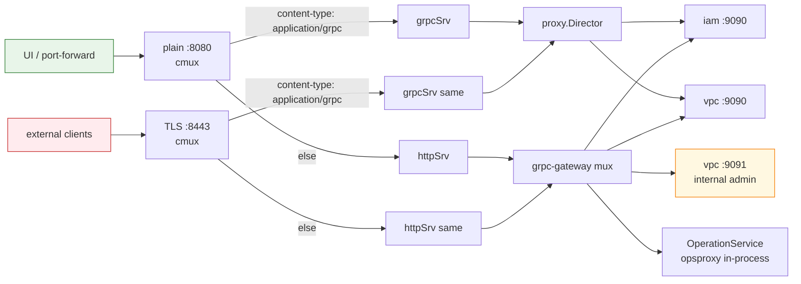

# 04 — API Gateway Routing

## Что делает api-gateway

- Принимает HTTP/REST и gRPC.
- Делит трафик через `cmux` на два внутренних listener'а: gRPC vs HTTP.
- HTTP/REST маршрутизирует через `grpc-gateway` (`runtime.ServeMux`) в
  backend gRPC сервисы.
- gRPC проксирует через `proxy.Director` (header-based routing).
- Дополнительно: in-process `OpsProxy` (один URL `/operations/{id}` на все
  backend operation-tables).

Stateless. Не имеет своей БД. Knows only об адресах backend gRPC сервисов
(env-vars).

## Двойной listener



Backend-сервисы слушают два порта: **public :9090** (ресурсный API, advertised
наружу) и **internal :9091** (`Internal*`-сервисы, cluster-internal). `Internal.*`
методы / `Internal*`-сервисы публикуются **только** на cluster-internal mux —
никогда на external TLS-listener.

**Текущая дырка**: оба listener'а используют **один и тот же** `httpSrv` mux,
в котором зарегистрированы и admin RPC. На production нужно повесить
middleware на TLS listener, который блокирует admin paths (см. workspace
CLAUDE.md §запрет 6 + `.claude/rules/security.md`).

## Backend разрешение (env-vars)

`internal/config/config.go`:
```
KACHO_API_GATEWAY_IAM_GRPC              default: iam.kacho.svc.cluster.local:9090
KACHO_API_GATEWAY_VPC_GRPC              default: vpc.kacho.svc.cluster.local:9090
KACHO_API_GATEWAY_VPC_INTERNAL_GRPC     default: vpc.kacho.svc.cluster.local:9091
```

`Config.BackendAddrs()` возвращает map → передаётся в `restmux.NewMux(addrs, conns)`.

## restmux: что куда

```go
// internal/restmux/mux.go (упрощённо)

// Public IAM — Account / Project
iampb.RegisterAccountServiceHandlerFromEndpoint → iamAddr
iampb.RegisterProjectServiceHandlerFromEndpoint → iamAddr

vpcpb.RegisterNetworkServiceHandlerFromEndpoint        → vpcAddr
vpcpb.RegisterSubnetServiceHandlerFromEndpoint         → vpcAddr
vpcpb.RegisterAddressServiceHandlerFromEndpoint        → vpcAddr
vpcpb.RegisterRouteTableServiceHandlerFromEndpoint     → vpcAddr
vpcpb.RegisterSecurityGroupServiceHandlerFromEndpoint  → vpcAddr
vpcpb.RegisterGatewayServiceHandlerFromEndpoint        → vpcAddr
vpcpb.RegisterNetworkInterfaceServiceHandlerFromEndpoint → vpcAddr

// Admin (kacho-only, Internal*) — на vpc-internal :9091
if vpcInternalAddr != "" {
    vpcpb.RegisterInternalRegionServiceHandlerFromEndpoint        → vpcInternalAddr
    vpcpb.RegisterInternalZoneServiceHandlerFromEndpoint          → vpcInternalAddr
    vpcpb.RegisterInternalAddressPoolServiceHandlerFromEndpoint   → vpcInternalAddr
}

// OperationService — in-process через OpsProxy (см. ниже)
operationpb.RegisterOperationServiceHandlerServer(mux, opsproxy.New(conns))
```

## OpsProxy

`internal/opsproxy/proxy.go` — реализует `OperationServiceServer` локально
в api-gateway. На входе `Get(operation_id)`:

1. Смотрит на prefix ID:
   - `opvpc...` → vpc backend
   - `opiam...` → iam backend
   - `opcom...` → compute backend
2. Делегирует на нужный backend gRPC `OperationService.Get`.
3. Возвращает Operation как есть.

Это позволяет иметь **один** path `/operations/{id}` независимо от того,
какой сервис создал операцию. Клиент поллит `OperationService.Get(id)` до
`done=true` (Watch-стриминга нет — для in-flight задач полл `Operation.Get`,
для списков ресурсов полл `List` каждые 2-5 c).

## JSON-marshalling

```go
runtime.NewServeMux(
  runtime.WithMarshalerOption(runtime.MIMEWildcard, &runtime.JSONPb{
    MarshalOptions: protojson.MarshalOptions{
      UseProtoNames:   false,        // camelCase
      EmitUnpopulated: true,         // явные `false`/`""`/`{}`
    },
    UnmarshalOptions: protojson.UnmarshalOptions{
      DiscardUnknown: true,           // ignore лишние поля
    },
  }),
)
```

`EmitUnpopulated: true` исторически ломалось из-за `BadRequest.field_violations[]` (Any) без зарегистрированного errdetails. Это починено в `cmd/api-gateway/main.go` через blank-import:

```go
_ "google.golang.org/genproto/googleapis/rpc/errdetails"
```

## Routing-таблица (полная, на текущий момент)

| Method | Path | Backend | Service |
|---|---|---|---|
| `*` | `/iam/v1/accounts*` | iamAddr | AccountService |
| `*` | `/iam/v1/projects*` | iamAddr | ProjectService |
| `*` | `/vpc/v1/networks*` | vpcAddr | NetworkService |
| `*` | `/vpc/v1/subnets*` | vpcAddr | SubnetService |
| `*` | `/vpc/v1/addresses*` | vpcAddr | AddressService |
| `*` | `/vpc/v1/routeTables*` | vpcAddr | RouteTableService |
| `*` | `/vpc/v1/securityGroups*` | vpcAddr | SecurityGroupService |
| `*` | `/vpc/v1/gateways*` | vpcAddr | GatewayService |
| `*` | `/vpc/v1/networkInterfaces*` | vpcAddr | NetworkInterfaceService |
| `GET` | `/operations/{id}` | opsproxy → vpcAddr/iamAddr/comAddr | OperationService |
| `GET/POST/PATCH/DELETE` | `/vpc/v1/regions*` | **vpcInternalAddr** | InternalRegionService (admin) |
| `GET/POST/PATCH/DELETE` | `/vpc/v1/zones*` | **vpcInternalAddr** | InternalZoneService (admin) |
| `GET/POST/PATCH/DELETE` | `/vpc/v1/addressPools*` | **vpcInternalAddr** | InternalAddressPoolService (admin) |
| `GET` | `/vpc/v1/addressPools/{id}/utilization` | **vpcInternalAddr** | (admin observability) |
| `GET` | `/vpc/v1/addressPools/{id}/addresses` | **vpcInternalAddr** | (admin observability) |
| `POST/DELETE` | `/vpc/v1/networks/{id}/addressPoolBinding` | **vpcInternalAddr** | InternalAddressPoolService (admin bindings) |
| `POST/DELETE` | `/vpc/v1/addresses/{id}/addressPoolOverride` | **vpcInternalAddr** | InternalAddressPoolService (admin bindings) |

**Bold** = admin-only (Internal*), не должны попадать на external TLS-listener
(см. CLAUDE.md запрет 6).

## Middleware chain

`internal/middleware/`:
- `request_id` — X-Request-ID или generate UUID.
- `recovery` — panic-handler.
- `access_log` — slog запись метода/пути/статуса/duration.
- `idempotency` — idempotency-key header.
- `auth_noop` — пока заглушка, пропускает всё как `anonymous`.

## Health

`/healthz`, `/readyz` — `internal/health/`. Не используют backend, всегда 200.
</content>
</invoke>
