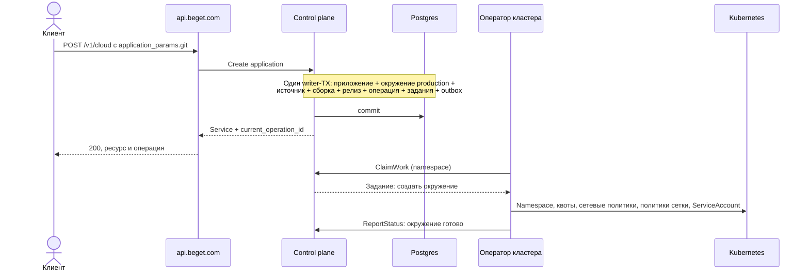
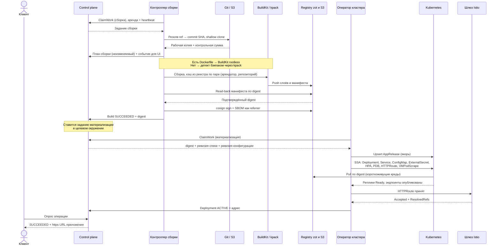

# Платформа приложений Beget — окружения, цепочка выкатки и границы POC

**Дата:** 2026-07-28
**Статус:** DESIGN, решения приняты
**Отношение к другим документам:** дополняет и в перечисленных местах **отменяет**
`docs/plans/beget-application-platform-product-draft.md` (см. §11 «Дельта к PM-черновику»).
**Следующий шаг:** acceptance-док Given-When-Then, затем реализация. Кодить до APPROVED нельзя.

> [!important] Требования, из которых выведены все решения ниже
> Максимально просто для пользователя · безопасно · производительно · практики 2026 ·
> продукт должен быть лучшим на рынке среди себе подобных.
> Там, где эти требования конфликтуют, приоритет: **безопасность → простота →
> производительность**. Каждый случай конфликта в тексте назван явно.

> [!warning] Часть решений этого документа пересмотрена после продуктового ревью (2026-07-28)
> Панель из пятнадцати критиков со сверкой по рынку и состязательной проверкой находок
> изменила двенадцать решений и расширила периметр первой поставки. Действующая редакция —
> `beget-application-platform/00-critique-and-decisions.md`. Пересмотренные места помечены
> по тексту ниже. Разделы без пометки остаются в силе.
>
> Крупнейшие изменения: продвижение артефакта и второе окружение входят в POC (иначе
> несущий критерий непроверяем) · путь секретов в Vault получает сегмент окружения (иначе
> «секреты не наследуются в непрод» нереализуемо) · техническая зона — отдельный домен
> второго уровня с заявкой в Public Suffix List и записью на приложение · версия рендера
> входит во вход чистой функции · прокси сетки становится явной строкой размера и бюджета ·
> периметр сборки резолвит и закрепляет адрес источника сам · в первую поставку входят
> привязка базы данных, пользовательские домены, фоновый обработчик, статика, CLI и
> интеграция с GitHub · минимальный платёж и включённая квота переезжают на проект.

---

## 0. Принятые решения одним списком

| № | Развилка | Решение | Главный довод |
|---|---|---|---|
| 1 | Окружения dev/stage/prod | `Environment` — первоклассная область **внутри** приложения. Модель с первого дня, по умолчанию ровно одно окружение `production`, в интерфейсе невидимо до явного добавления | Без окружений невозможно **продвижение артефакта**: в prod уезжает не тот образ, который тестировали |
| 2 | Конфигурация | Три уровня с непересекающимся владением: автоопределение → `beget.yaml` (форма кода) → API/UI (правда окружения) | Убирает войну приоритетов by construction, а не правилами разрешения конфликтов |
| 3 | Доставка намерения в кластер | Оператор кластера **тянет** задание из control plane, пишет якорный CR `AppRelease`, разворачивает дочерние объекты через Server-Side Apply | Control plane не хранит учётных данных ни к одному кластеру; соединение всегда исходящее из кластера |
| 4 | Маршрутизация | Gateway API `HTTPRoute`, Istio — реализация | Стандартный контракт, развязка от вендора сетки |
| 5 | Изоляция подов | PSS `baseline` + собственный жёсткий набор по умолчанию + **пространства имён пользователей** (`hostUsers: false`) | Чужой `Dockerfile` с `USER root` работает, но root в контейнере ≠ root на узле |
| 6 | Сборка | Отдельный периметр: свой namespace, свой пул узлов, rootless BuildKit / kpack, кэш на пару (арендатор, репозиторий) | `RUN` выполняет произвольный код клиента — это самое опасное место продукта |
| 7 | Происхождение артефакта | Подпись образа и SBOM — **в POC**; проверка подписи на допуске и сканирование — Phase 2 | Полдня работы, а даёт цепочку происхождения, которой у «простых» PaaS нет |
| 8 | Наблюдаемость | Арендатор VictoriaMetrics/VictoriaLogs = **аккаунт**, а не метка | Ошибка в фасаде запросов не может показать чужие данные: их нет в этом арендаторе |
| 9 | Автомасштабирование в POC | HPA по CPU — да (metrics-server, ноль работы). По памяти и по своим метрикам — позже | Дёшево и заметно; адаптер к VictoriaMetrics в POC не нужен |
| 10 | Публичный вход в POC | Wildcard-сертификат на технической зоне | Каждое приложение получает HTTPS мгновенно, без ACME на запрос |

---

## 1. Модель: приложение → окружения → компоненты → релизы

### 1.1 Иерархия

```
Beget Project                       ← существующий ресурс, не наш
└── CloudService = Application      ← единица тарификации, один service_id, один счёт
    ├── Environment: production     ← создаётся автоматически, по умолчанию единственное
    │   ├── Component: web          ← конфигурация окружения поверх общей формы
    │   │   ├── Deployment #16      ← неизменяемый релиз: digest + ревизия конфигурации
    │   │   └── Deployment #17 (ACTIVE)
    │   ├── Variables / Secrets
    │   └── DomainBinding
    └── Environment: staging        ← появляется только по явному действию клиента
        └── Component: web → Deployment #17 (ACTIVE, тот же digest, другая конфигурация)
```

### 1.2 Кто чем владеет

| Уровень | Владеет | Не владеет |
|---|---|---|
| `Application` | Идентичность, тариф, счёт, **форма компонентов** (какие есть, тип, порт, проба, команда), источник по умолчанию | Значениями переменных, доменами, числом реплик |
| `Environment` | Переменными и секретами, доменами, числом реплик и размером, необязательным переопределением ветки источника, историей релизов | Формой компонентов |
| `Component` | Описанием одного процесса | Своей конфигурацией в конкретном окружении |
| `Build` | Неизменяемым результатом сборки. **Окружения не знает** | Тем, куда его выкатили |
| `Deployment` | Одним релизом в одном окружении: digest + ревизия конфигурации | Изменением себя: правка = новый релиз |

**Форма компонентов общая для всех окружений — это инвариант, а не упрощение.**
Как только staging разрешено иметь другой набор компонентов и другие порты, продвижение
теряет смысл, и клиент получил два отдельных приложения, только запутаннее. Различаться
могут переменные, секреты, домены, число реплик, размер и ветка источника. Кому нужна
принципиально другая форма — заводит второе приложение, и это правильный ответ, а не
недоработка.

### 1.3 Продвижение артефакта

```
POST /v1/cloud/application/{service_id}/deployment:promote
     { from_environment: "staging", to_environment: "production" }
```

Создаётся **новый** `Deployment` в целевом окружении с **тем же digest** и ревизией
конфигурации целевого окружения. Пересборки нет. Это главная причина, по которой
окружения вообще существуют, и главное отличие от модели «отдельное приложение на
каждое окружение», в которой то же самое невозможно в принципе.

Откат — частный случай того же механизма: новый `Deployment` на digest предыдущего
успешного релиза того же окружения. История не переписывается никогда.

### 1.4 Инварианты на уровне БД, а не проверками в коде

| Инвариант | Механизм |
|---|---|
| Один активный раскат на пару (компонент, окружение) | `UNIQUE (component_id, environment_id) WHERE status IN ('QUEUED','DEPLOYING')` |
| Имя компонента уникально в приложении | `UNIQUE (application_id, name)` |
| Имя окружения уникально в приложении | `UNIQUE (application_id, name)` |
| FQDN уникален среди живых привязок | `UNIQUE (fqdn) WHERE status <> 'DELETED'` |
| Повторный запрос с тем же ключом идемпотентности | `UNIQUE (project_id, idempotency_key)` + возврат той же операции |
| Ресурс, релиз, операция, задание и события — одной транзакцией | Один writer-TX + transactional outbox |

### 1.5 Совместимость публичного контракта

`environment_id` — **всегда необязательный** параметр. Отсутствует → окружение приложения
по умолчанию (изначально `production`; клиент может переназначить, какое считается
основным). Он не становится обязательным никогда — иначе включение мультиокружений
позже оказалось бы ломающим изменением.

`service_id` остаётся один. Окружение **не является** вторым биллинговым уровнем:
один `CloudService` — один тариф — один счёт, окружения делят включённую квоту.
Непрод получает потолок доли квоты и низкий `PriorityClass`, чтобы dev не вытеснял prod.

Секреты **не наследуются** с уровня приложения в непрод по умолчанию — обычные
переменные наследуются, секреты требуют явного действия. Наследование секретов «за
компанию» — классический способ увезти боевой ключ в dev-окружение, куда пускают
подрядчиков.

Preview-окружения перестают быть «отдельным приложением с TTL» и становятся эфемерным
окружением с TTL — почти бесплатно, когда модель уже есть.

---

## 2. Определение конфигурации

### 2.1 Три уровня, непересекающееся владение

| Уровень | Владеет | Почему именно он |
|---|---|---|
| **Автоопределение** (ноль файлов) | Всем, что выводится из репозитория | Путь по умолчанию: клиент не отвечает ни на один вопрос |
| **`beget.yaml`** (опционален) | Формой кода: компоненты, чем собирать, команда, порт, проба, размер, диапазон масштабирования | Меняется вместе с кодом → живёт с кодом, ревьюится в PR |
| **API / UI** | Правдой окружения: переменные, секреты, домены, реплики, окружения | Меняется без кода, содержит секреты → в git не место |

Пересечение ровно одно: несекретные переменные. Манифест задаёт **значения по
умолчанию**, значение из API всегда выигрывает, секрет в манифесте отвергается
валидацией с внятной ошибкой (`SECRET_IN_MANIFEST`).

### 2.2 Автоопределение

1. Есть `Dockerfile` в контексте → BuildKit. Порт из `EXPOSE`, команда из `CMD`/`ENTRYPOINT`.
2. Нет `Dockerfile` → Cloud Native Buildpacks через kpack. Детект по маркерам: `go.mod`,
   `package.json`, `pyproject.toml`/`requirements.txt`, `composer.json`, `Gemfile`,
   `pom.xml`/`build.gradle`, `*.csproj`. Команда — из `Procfile`, иначе из launch-процесса
   бэкпака.
3. Порт — **контракт `PORT`**: платформа всегда прокидывает переменную. Никакого угадывания
   слушающего сокета.
4. Проба по умолчанию — TCP на порт плюс щедрый `startupProbe`. HTTP-проба только если
   объявлена: угадывать `GET /` нельзя, для API 404 на корне — норма.
5. Размер — t-shirt (`small`), не милликоры. Реплики — 1, HPA выключен, пока не задан `max`.

### 2.3 Манифест

```yaml
version: 1
components:
  web:
    type: web                         # web | worker | cron (worker/cron — после POC)
    build: { dockerfile: Dockerfile } # пусто → buildpacks
    run: ./server                     # опционально
    port: 8080                        # опционально
    health: { path: /healthz }        # опционально, по умолчанию TCP
    size: small                       # nano|micro|small|medium|large
    scale: { min: 1, max: 3 }         # max задан → включается HPA по CPU
    env: { NODE_ENV: production }     # только несекретные значения по умолчанию
```

Ни одного упоминания Kubernetes. Все поля кроме `type` имеют значения по умолчанию.
`Procfile` поддерживается — он бесплатен и даёт совместимость с экосистемой.

### 2.4 Три механики, которые делают «мало тумблеров» продуктом, а не лозунгом

- **План сборки показывается до сборки.** Экран «Go 1.24, сборка buildpack'ом, запуск
  `./server`, порт 8080, размер small», кнопка «поехали» и ссылка «поправить». Платформа
  не спрашивает — она сообщает, что решила.
- **Кнопка «выгрузить в `beget.yaml`».** Автоопределённое материализуется в файл по
  требованию. Ноль конфигурации по умолчанию, полный контроль когда понадобился.
- **Ошибка — часть продукта.** Не таймаут через пять минут, а стабильный код, человеческое
  объяснение и что сделать. Таксономия — §6.5.

---

## 3. Приземление в Kubernetes

### 3.1 Механизм: тянущий оператор + якорный CR + Server-Side Apply

Control plane хранит намерение в Postgres и **никуда не ходит сам**. Оператор рантайм-кластера
приходит за работой (`ClaimWork`, `FOR UPDATE SKIP LOCKED`, аренда с heartbeat),
материализует задание как якорный CR `AppRelease` в namespace арендатора и разворачивает
его в дочерние объекты через Server-Side Apply с фиксированным `fieldManager` и
`ownerReferences` на якорь.

| Свойство | Как достигается |
|---|---|
| Control plane не носит ключи от кластеров | Соединение всегда исходящее из кластера, аутентификация mTLS/SPIFFE. Скомпрометированный кластер может забрать только свои задания |
| Коррекция дрейфа | Оператор смотрит за дочерними объектами по watch и приводит их обратно к якорю. Ручная правка `kubectl edit` откатывается |
| Удаление | Снос якоря → сборка мусора Kubernetes по `ownerReferences`. Никакого списка «что мы там создали» в нашей БД |
| Поддержка видит правду | `kubectl get appreleases -A` показывает, что именно мы просили |
| Расхождение версий | Поле `specVersion` в CR; незнакомую версию оператор **не разворачивает** и выставляет condition — отказ виден, а не молчалив |

**Рендер обязан быть чистой функцией:** `(digest артефакта, ревизия спеки компонента,
ревизия конфигурации окружения, **версия рендера**) → набор объектов`. Одинаковый вход даёт
побайтово одинаковый выход. Без этого коррекция дрейфа неотличима от «мы каждый раз рендерим
по-разному».

> [!warning] Исправлено после ревью: версия рендера — четвёртый аргумент, не скрытый вход
> В первой редакции аргументов было три, а код рендера жил в операторе. Тогда апгрейд
> оператора **веером перекатывает весь флот**: скрытый вход меняется чаще всех явных.
> Версию ставит control plane и пинит в якорном CR; изменение, задевающее шаблон пода,
> применяется при следующем естественном релизе либо в окно обслуживания с ограничением
> скорости. Коррекция дрейфа сверяет объекты с **зафиксированной** версией, а не с текущей
> версией кода оператора.
>
> Там же: коррекция дрейфа — канал отката **чужой** правки, а не канал доставки **нашей**.
> Для каждого объекта перечисляются поля, которыми владеет чужой контроллер — число реплик
> при включённом автомасштабировании, аннотации внедрения сетки, статусные поля маршрута,
> содержимое секрета от ESO — и они исключаются из применяемого патча. Иначе оператор
> вернёт одну реплику приложению, которое автомасштабирование только что вырастило под
> нагрузкой: ошибки ровно на пике при зелёных журналах оператора.

Почему не GitOps: git становится жёсткой рантайм-зависимостью и узким местом на тысячах
арендаторов (постоянная запись в репозиторий, задержка синка вместо секунд, болезненное
удаление, неудобные секреты). Почему не прямой apply из control plane: он потребовал бы
хранить права уровня админа на все кластеры в одном месте.

### 3.2 Инвентарь объектов

Namespace — на пару **(приложение, окружение)**, имя по идентификаторам:
`app-<serviceId>-<envId>`. Переименование приложения не двигает namespace.

**На namespace, один раз при создании окружения:**

| Объект | Зачем |
|---|---|
| Метки `account-id`/`project-id`/`service-id`/`environment-id` | Единственный источник арендной принадлежности для метрик, логов и биллинга |
| `pod-security.kubernetes.io/enforce: baseline` | Базовый профиль (см. §4 про `restricted` и пространства имён пользователей) |
| `ResourceQuota` + `LimitRange` | Потолок окружения и значения по умолчанию на контейнер. В POC `persistentvolumeclaims: 0`, `services.loadbalancers: 0` |
| `NetworkPolicy` default-deny вход и выход | Разрешено: вход только со шлюза, DNS, выход только через egress-шлюз. Отдельно закрыты `169.254.169.254` и приватные диапазоны |
| `PeerAuthentication: STRICT` + `AuthorizationPolicy` | mTLS в сетке; east-west между арендаторами запрещён |
| `Sidecar` (ограничение области конфигурации) | Без него каждый сайдкар получает эндпоинты всего кластера — на масштабе это память и время сходимости |
| `PriorityClass` по классу окружения | prod вытесняет preview, не наоборот |

**На компонент:**

| Объект | Существенные детали |
|---|---|
| `Deployment` | Образ **строго по digest**; свой ServiceAccount без автомонтирования токена; `hostUsers: false`; `allowPrivilegeEscalation: false`, `capabilities.drop: [ALL]`, `seccompProfile: RuntimeDefault`; ресурсы из t-shirt-размера; `topologySpreadConstraints`; `progressDeadlineSeconds`; `revisionHistoryLimit`; аннотация **`checksum/config`** |
| `Service` | ClusterIP |
| `ConfigMap` | Несекретные переменные |
| `ExternalSecret` → `Secret` | Секреты из Vault, `refreshPolicy: Periodic`, namespace-scoped `SecretStore` |
| `HorizontalPodAutoscaler` v2 | Только если задан `scale.max`; в POC — по CPU через metrics-server |
| `PodDisruptionBudget` | Если реплик ≥ 2 |
| `HTTPRoute` (Gateway API) | Для web-компонента; Istio — реализация шлюза |
| `VMPodScrape` | Съём метрик |
| `Certificate` (cert-manager) | Только пользовательские домены; технический покрыт wildcard |

> **Про `checksum/config` — это не косметика.** У нас уже был случай, когда настройки
> приезжали через `envFrom` без чексуммы: правка конфигурации не меняла шаблон пода, под
> не перекатывался, процесс продолжал жить со старым окружением — а проверка посадки при
> этом рапортовала успех. Хеш конфигурации в шаблоне пода обязателен для **каждого**
> компонента, и гейт обязан проверять живой процесс, а не содержимое ConfigMap.

### 3.3 Что считается успешной выкаткой

По условиям Kubernetes, а не по таймеру:

1. `observedGeneration == generation` — контроллер увидел нашу ревизию;
2. `availableReplicas >= желаемого`;
3. `Progressing` в состоянии `NewReplicaSetAvailable`;
4. эндпоинты опубликованы;
5. `HTTPRoute` принят шлюзом (`Accepted` + `ResolvedRefs`);
6. для пользовательского домена — сертификат `Ready`.

`ProgressDeadlineExceeded` переводит релиз в `FAILED`. Операция не висит бесконечно
никогда — это отдельное требование к каждому ожиданию в системе.

---

## 4. Тенантирование: шесть слоёв

1. **Namespace** на (приложение, окружение). Не на приложение: иначе шумный dev ест квоту prod и делит с ним сетевую политику.
2. **Квоты и лимиты** — потолок окружения, значения по умолчанию на контейнер, отсутствие `PersistentVolumeClaim` и `LoadBalancer` в POC.
3. **Сеть** — default-deny на вход и выход, управляемый egress-шлюз, закрытые metadata-эндпоинт и приватные диапазоны.
4. **Сетка** — mTLS STRICT, запрет cross-namespace, ограниченная область конфигурации сайдкара.
5. **Узлы** — выделенный пул для тенантских нагрузок с taint. Мы запускаем **чужой код на общем ядре**; namespace от этого не защищает.
6. **Сборка** — отдельный периметр, см. §4.2.

### 4.1 Пространства имён пользователей — ответ на конфликт «просто против безопасно»

Профиль `restricted` требует `runAsNonRoot`. Большая часть реальных клиентских
`Dockerfile` работает от root. Прямолинейное включение `restricted` означало бы, что
продукт отвергает половину входящих репозиториев — это провал требования «просто».

Решение: **`hostUsers: false`** — root в контейнере отображается на непривилегированный
uid на узле. Клиентский образ работает как есть, при этом:

- `allowPrivilegeEscalation: false`;
- `capabilities.drop: [ALL]`;
- `seccompProfile: RuntimeDefault`;
- `readOnlyRootFilesystem` там, где приложение это переносит (определяется на старте, не спрашивается);
- никаких `hostPath`, `hostNetwork`, `hostPID`, `hostIPC`.

> [!warning] Формулировка исправлена после ревью
> Прежний текст утверждал, что «применяется весь набор `restricted`, кроме одного контроля,
> заменённого более сильным механизмом ядра». Это неверно и вводило в заблуждение.
> Пространства имён пользователей решают **другую** задачу: они убирают эскалацию до
> привилегий узла, но **не сокращают поверхность системных вызовов**. Побег через уязвимость
> ядра остаётся межарендной компрометацией. Это осознанный размен (песочница — другой
> продукт и другие недели), и он записан как размен, а не как эквивалентная замена.
> Песочница на пуле **сборки**, где недоверие максимально, а бюджет 40–90 с терпит
> замедление, — следующий шаг.

По факту применяются все контроли `restricted`, кроме `runAsNonRoot`; вместо него работает
механизм ядра, закрывающий эскалацию, но не сужающий набор доступных системных вызовов.

**Предусловие честно:** нужны Kubernetes ≥ 1.33 и containerd ≥ 2.0 с включённой поддержкой.
Если на целевом кластере этого нет — откат на `restricted` с `runAsNonRoot` и явной
диагностической ошибкой для root-образов (`IMAGE_RUNS_AS_ROOT` с объяснением, как
поправить). Молчаливого понижения безопасности быть не должно.

### 4.2 Сборка — самый опасный периметр продукта

`RUN` в `Dockerfile` выполняет произвольный код клиента на нашем железе. Требования:

- отдельный namespace и отдельный пул узлов с taint;
- rootless BuildKit / kpack, эфемерный ServiceAccount на сборку;
- нет доступа к сети control plane и к metadata-эндпоинту;
- push-права ровно на один репозиторий, короткоживущие;
- жёсткие таймаут, квота CPU/RAM/эфемерного диска и максимальный размер исходников;
- **кэш на пару (арендатор, репозиторий) и никогда общий** — общий кэш между арендаторами даёт отравление и переход границы.

---

## 5. Полная цепочка

### 5.1 Создание приложения

Один запрос создаёт приложение, окружение `production`, источник и первый релиз. Это и
есть «тупо поднять приклад»: обязательное поле ровно одно — ссылка на репозиторий.



Namespace создаётся сразу, а не лениво при первой выкатке: это дёшево и убирает
несколько секунд из времени первого деплоя.

### 5.2 Первый деплой — основная цепочка



Ключевые свойства цепочки:

- **Сборка не знает про окружения** — она принадлежит приложению и ревизии исходников.
  Материализация принадлежит окружению. Отсюда бесплатно получается продвижение.
- **`SUCCEEDED` у сборки — только после read-back манифеста по digest.** Успешное
  завершение процесса сборки без подтверждённого чтения обратно успехом не считается.
- **Нигде нет синхронного вызова из control plane в контроллеры** — только выборка
  заданий и отчёт о статусе. Значит нет рантайм-цикла и не нужен брокер.
- **Падение воркера не создаёт новую операцию**: аренда истекает, задание возвращается
  в очередь, та же операция продолжается.

### 5.3 Справедливость очереди сборок

Ограничение параллельных сборок на аккаунт вшито в выборку задания, а не в код воркера:
клейм упорядочен по `(приоритет, время постановки)` и не берёт задание, если у этого
аккаунта уже занят его потолок. Один арендатор не может выесть весь флот сборки —
это требование производительности, которое нельзя выразить «на software-уровне»
без гонки.

### 5.4 Повторный деплой, продвижение и откат

| Действие | Что происходит | Пересборка | Скачивание образа |
|---|---|---|---|
| Повторный деплой (новый commit) | Новая сборка → новый digest → новый релиз | Да, тёплый кэш | Только новые слои |
| Продвижение stage → prod | Новый релиз в целевом окружении с **тем же** digest | Нет | Обычно нет |
| Откат | Новый релиз на digest предыдущего успешного | Нет | Обычно нет, слои на узле |

История не переписывается ни в одном из случаев. Предыдущий релиз получает статус
`SUPERSEDED`, а не удаляется. Сборщик мусора реестра **не удаляет digest**, на который
ссылается достижимый для отката релиз; глубина отката — последние 10 успешных релизов
на пару (компонент, окружение).

### 5.5 Ветки отказов — таксономия

Каждый отказ терминален или повторяем **явно**, несёт стабильный код, человеческое
объяснение и следующее действие. Это то место, где большинство PaaS проваливаются, и
где дёшево быть лучшим.

| Код | Когда | Что видит клиент | Терминальность |
|---|---|---|---|
| `SOURCE_UNREACHABLE` | Репозиторий недоступен, ветка не найдена | Что именно не резолвится и как дать доступ | Терминально |
| `SOURCE_NOT_RECOGNIZED` | Нет `Dockerfile`, ни один бэкпак не подошёл | Что искали, что нашли, как объявить явно | Терминально |
| `BUILD_FAILED` | Ненулевой код сборки | Стадия, последние строки лога сборки, ссылка на полный лог | Терминально |
| `BUILD_TIMEOUT` / `BUILD_QUOTA` | Превышены время или ресурсы | Какой лимит и текущий тариф | Терминально |
| `REGISTRY_UNAVAILABLE` | Push/read-back не прошёл | — | Повтор с отступом, затем терминально |
| `IMAGE_PULL_FAILED` | Кластер не смог скачать образ | Digest и причина | Повтор, затем терминально |
| `APP_CRASHED` | Контейнер падает, есть перезапуски | Код выхода + **хвост логов контейнера** | Терминально, предыдущий релиз остаётся ACTIVE |
| `APP_NOT_LISTENING` | Контейнер жив, перезапусков нет, проба не проходит | «Запущен, но за 60 с никто не слушает 8080; слушайте `$PORT` или укажите `port:`» | Терминально |
| `IMAGE_RUNS_AS_ROOT` | Только на кластере без пространств имён пользователей | Как поправить образ | Терминально |
| `QUOTA_EXCEEDED` / `CAPACITY_UNAVAILABLE` | Не хватает квоты или ёмкости | Что именно кончилось | Терминально, **поды в Pending не оставляем никогда** |
| `SECRET_IN_MANIFEST` | Секрет положили в `beget.yaml` | Какой ключ и куда его перенести | Терминально |

Различение `APP_CRASHED` и `APP_NOT_LISTENING` — принципиальное. Это два совершенно
разных действия клиента, и слить их в один «деплой не удался» значит отправить человека
разбираться самостоятельно.

---

## 6. Бюджет времени и целевые показатели

Цифры — целевые, они входят в критерии приёмки POC и обязаны измеряться, а не
декларироваться.

> [!warning] Пересмотрено после ревью: цель публикуется по когортам, в бюджете не хватало двух строк
> Единая цифра «90 секунд» выведена на Go/Node-«приветмире», тогда как массовая когорта
> хостера — PHP и Node с холодным `composer install` / `npm ci`, а это минуты. Публиковать
> показатель, систематически красный на самой массовой когорте, хуже, чем не публиковать —
> тем более что публикация замеров заявлена как преимущество. Цель задаётся **по когортам
> определения** (Dockerfile / Go / Node / Python / PHP), общий показатель — взвешенный по
> измеренному распределению первой сотни репозиториев.
>
> В таблице ниже не хватает двух строк, и обе значимы: **готовность прокси сетки** (под
> запущен ≠ прокси получил конфигурацию; без нативных sidecar-контейнеров приложение
> стартует раньше прокси и первые соединения падают) и **построение состава плюс подпись**
> (строка «3–8 с» посчитана на Go-бинаре; для `node_modules` и `vendor` это десятки секунд).
> Обе добавляются при пересчёте бюджета.

| Стадия | Холодный старт | Тёплый кэш |
|---|---|---|
| Резолв ref + клон | 1–3 с | 1–2 с |
| Детект и план | < 1 с | < 1 с |
| Сборка (небольшое Go/Node-приложение) | 40–90 с | 10–25 с |
| Push + read-back + подпись | 3–8 с | 2–5 с |
| Материализация (SSA) | < 1 с | < 1 с |
| Скачивание образа | 5–15 с | 0–3 с |
| Старт пода и готовность | 3–15 с | 3–15 с |
| Программирование маршрута | 1–3 с | 1–3 с |

**Целевые значения:**

| Сценарий | Цель p50 | Цель p95 |
|---|---|---|
| Первый деплой (холодный) | ≤ 90 с | ≤ 180 с |
| Повторный деплой | ≤ 35 с | ≤ 70 с |
| Продвижение между окружениями | ≤ 20 с | ≤ 45 с |
| Откат | ≤ 15 с | ≤ 30 с |

Как эти цифры достигаются:

- **Кэш сборки в реестре**, а не на диске воркера — воркеры остаются одноразовыми.
- **Прогретый пул узлов**: образы BuildKit и типовые run-образы бэкпаков заранее
  скачаны на узлы. Это убирает самую скучную часть холодного старта.
- **Реестр рядом** с пулами сборки и рантайма, S3 как backend, локальный кэш блобов.
- **Пин по digest + `imagePullPolicy: IfNotPresent`** — повторная выкатка того же digest
  не качает ничего.
- **Откат не собирает и обычно не качает** — слои уже на узлах.

---

## 7. Метрики и логи

### 7.1 Изоляция — структурная, а не по метке

Арендатор VictoriaMetrics и VictoriaLogs — **аккаунт Beget** (`accountID`), проект —
`projectID`. Внутри арендатора данные разделяются метками приложения, окружения,
компонента и релиза.

Почему так, а не метками с фильтром в фасаде: при разделении метками единственное, что
стоит между арендаторами, — правильность построения запроса. Одна ошибка в фасаде
показывает чужие данные. При разделении арендаторами чужих данных в этом арендаторе
физически нет. Цена — платформенные сводные запросы идут в отдельный служебный
арендатор; это приемлемо.

### 7.2 Сбор

- **Метрики:** vmagent снимает kubelet/cAdvisor, kube-state-metrics и метрики
  Istio-прокси. Арендные метки берутся из меток пода, которые ставит **оператор**;
  `honor_labels: false`, любые метки в зарезервированном пространстве имён, пришедшие
  от нагрузки, отбрасываются на relabeling. **Нагрузка не может подделать свою
  принадлежность** — это требование, а не пожелание.
- **Логи:** DaemonSet-сборщик → VictoriaLogs, поля потока = те же арендные метки плюс
  компонент, релиз и реплика. Срок хранения — по тарифу.
- **Свои метрики приложения — не в POC.** Это главный источник взрыва кардинальности.
  В Phase 3 — по явному включению, с жёстким потолком числа рядов на компонент и внятной
  ошибкой при превышении.
- **Трассировка** — сетка умеет отдавать в VictoriaTraces, выключено по умолчанию (стоимость).

### 7.3 Что клиент получает без единой настройки

Панель золотых сигналов: запросов в секунду, задержка p50/p95/p99, доля 5xx (из метрик
прокси), CPU и память (из cAdvisor), число реплик и перезапусков (из kube-state).
Ничего настраивать не нужно — данные уже собраны, потому что нагрузка стоит в сетке.
Это заметное отличие от «простых» PaaS, где наблюдаемость либо платная, либо её нет.

Сырой PromQL/MetricsQL и LogsQL наружу не отдаются никогда. Фасад строит запрос сам по
ограниченному набору параметров: диапазон времени, окружение, компонент, релиз, реплика,
подстрока, уровень, курсор. Живой хвост логов — по SSE.

---

## 8. Границы POC

**Одно проверяемое утверждение:** *вставил ссылку на репозиторий — получил живой
HTTPS-адрес, не ответив ни на один вопрос* (время — по когорте определения, см. §6).

> [!warning] Периметр пересмотрен после ревью
> **Входит дополнительно к перечисленному ниже:** второе окружение и продвижение артефакта
> (иначе несущий критерий §8.3 п. 4 непроверяем by construction) · общий вебхук с проверкой
> подписи и устранением дублей, то есть автоматический деплой на push (иначе после первого
> деплоя цикл «запушил — посмотрел» не существует, и это уже не PaaS, а сборочный сервис с
> ручным запуском).
>
> **Первая поставка** (продаваемый продукт, отличать от POC) дополнительно включает:
> привязку базы данных Beget к окружению · пользовательские домены · фоновый обработчик ·
> статику и SPA · CLI · интеграцию с GitHub как приложением. Решение владельца 2026-07-28,
> обоснование по каждому пункту — `beget-application-platform/00-critique-and-decisions.md` §3.
>
> **Убирается:** режим выделенного балансировщика из публичного контракта (объявлен, но не
> читается — это принято-и-проигнорировано) · кнопка «поехали» как блокирующий шаг (план
> появляется потоком в первые секунды сборки) · непрерывная коррекция дрейфа по watch
> (заменяется периодической сверкой с ограничением скорости).

### 8.1 Входит

| Область | Состав |
|---|---|
| Источник | Публичный git; приватный git по deploy-ключу; загрузка архива |
| Определение | Автодетект (`Dockerfile` → BuildKit, иначе бэкпаки), парсер `beget.yaml`, `Procfile`, показ плана сборки |
| Сборка | rootless BuildKit, kpack, кэш в реестре, отдельный периметр, подпись и SBOM |
| Реестр | zot + S3, адресация по digest, короткоживущие креды, сборка мусора с защитой отката |
| Control plane | Приложение, окружение (одно, `production`), компонент, источник, сборка, релиз, операция; Postgres, выборка заданий с арендой, outbox |
| Оператор | CRD `AppRelease`, Server-Side Apply, коррекция дрейфа, отчёт о статусе |
| Тенантирование | Namespace на (приложение, окружение), сетевые политики, квоты, сетка, выделенный пул узлов, пространства имён пользователей |
| Вход | Istio + Gateway API, wildcard-сертификат на реальной зоне → мгновенный HTTPS |
| Конфигурация | Переменные и секреты через Vault + ESO, `checksum/config` |
| Наблюдаемость | Метрики и логи с разделением по арендаторам, панель золотых сигналов, фасад запросов |
| Масштабирование | Фиксированные реплики; HPA по CPU через metrics-server |
| Жизненный цикл | Повторный деплой, откат, удаление |
| Диагностика | Полная таксономия ошибок §5.5 с хвостом логов |

### 8.2 Не входит — и это сказано явно

Пользовательские домены и ACME на запрос · выделенный NLB · компоненты worker и cron ·
тома и приложения с состоянием · биллинг и метеринг (пайплайн запускается в теневом
режиме, счета не выставляются) · мультиокружения в интерфейсе (модель есть, окружение
одно) · статические сайты и SPA · preview-окружения · песочница gVisor/Kata · свои
метрики приложения · трассировка · проверка подписи на допуске и сканирование
уязвимостей · фасад `api.beget.com` и генерация SDK.

Отдельно про статические сайты: это половина рынка, и они — ближайший кандидат после
POC. В POC они не входят сознательно: другой рантайм и другая модель тарификации
(раздача, CDN), они размывают фокус демонстрации.

### 8.3 Что делает продукт лучшим на рынке — проверяемые критерии

1. От ссылки на репозиторий до HTTPS — **один запрос**, обязательное поле ровно одно.
2. План сборки **показывается**, а не спрашивается.
3. Ошибка несёт код, причину, хвост логов и следующее действие. `APP_CRASHED` и
   `APP_NOT_LISTENING` различимы.
4. **Продвижение артефакта** между окружениями: в prod уезжает ровно тот образ, который
   проверяли. У большинства «простых» PaaS этого нет.
5. Панель золотых сигналов без единой настройки.
6. Изоляция арендаторов структурная на всех слоях, **включая сборку и наблюдаемость**.
7. Происхождение артефакта: каждый образ подписан, состав приложен.
8. Показатели времени выкатки **опубликованы и измеряются**, а не заявлены.

Каждый пункт — строка в acceptance-доке, а не лозунг в презентации.

---

## 9. Что осталось решить на этапе acceptance

Это не «на потом» в смысле техдолга — это вопросы, ответ на которые не меняет
архитектуру и требует цифр или внешних договорённостей:

- Конкретные значения t-shirt-размеров и их отображение в тариф.
- Потолок доли квоты для непрода и число окружений на тариф.
- Сроки хранения: логи, история релизов, глубина отката, слои в реестре.
- Целевые узлы: версии Kubernetes и containerd на площадке (от этого зависит §4.1).
- Зона технического домена и владелец wildcard-сертификата.
- Потолок параллельных сборок на аккаунт (§5.3) — подбирается по замеру.

---

## 10. Порядок работ

| Шаг | Содержание | Гейт |
|---|---|---|
| 1 | Acceptance-док Given-When-Then по §8.3 (каждый критерий — сценарий) | APPROVED обязателен до кода |
| 2 | Контракты: внутренние ресурсы, операции, CRD `AppRelease`, схема БД с инвариантами §1.4 | Ревью схемы и распределённых аспектов |
| 3 | Control plane + выборка заданий + операции | Тесты идут первыми |
| 4 | Контроллер сборки: источник → детект → сборка → реестр → подпись | Read-back обязателен |
| 5 | Оператор: CRD, Server-Side Apply, статус, дрейф | Проверка на воспроизведённом дрейфе |
| 6 | Тенантирование и вход, wildcard-HTTPS | Негативные проверки изоляции |
| 7 | Наблюдаемость и фасад запросов | Проверка, что чужие данные недостижимы |
| 8 | Замер показателей §6 | Цифры публикуются |

Гейты «проверено на воспроизведённом дефекте» — не формальность. Проверка, которая
никогда не была красной, не является проверкой: у нас уже был случай, когда гейт посадки
рапортовал успех, потому что читал конфигурацию вместо живого процесса.

---

## 11. Дельта к PM-черновику

`docs/plans/beget-application-platform-product-draft.md` в следующих местах **отменяется**
настоящим документом:

| Место | Было | Стало |
|---|---|---|
| §1.4, инвариант 1 | Одно приложение = одно окружение | Приложение содержит окружения; форма компонентов общая, конфигурация — на окружение |
| §1.4, инвариант 4 | Один активный релиз на компонент | Один активный релиз на пару (компонент, окружение) |
| §1.4, инвариант 5 | Откат создаёт релиз из старого артефакта | Дополнено: продвижение — тот же механизм между окружениями |
| §6.1 | Окружения — отдельные приложения; preview — приложение с TTL | Окружения первоклассны; preview — эфемерное окружение с TTL |
| §6, таблица ресурсов | Нет `Environment` | Добавлен `Environment`; `Component`/`Deployment`/`Variable`/`Domain` получают область окружения |
| §7.3 | Пути без окружения | `environment_id` — всегда необязательный параметр, по умолчанию основное окружение |
| §9.3 | Namespace на приложение | Namespace на (приложение, окружение) |
| §10.4 | Istio `VirtualService` | Gateway API `HTTPRoute`, Istio — реализация |
| §10.6 | Разделение метками | Арендатор = аккаунт в VictoriaMetrics/VictoriaLogs |
| §13, п. 4 | PSS не уточнён | PSS `baseline` + жёсткий набор по умолчанию + пространства имён пользователей |
| §14 | Оборванная строка | Исправлена |
| §15, Phase 0 | Окружений нет | Модель окружений входит в заморозку контракта |
| §15, Phase 3 | Preview — отдельные приложения; подпись и SBOM | Preview — эфемерные окружения; подпись и SBOM переехали в POC |

Хирургические правки в сам черновик внесены там, где он **прямо противоречит**
принятому. Остальной текст черновика (публичный контракт, биллинг, фазы) остаётся в
силе и приводится в соответствие на этапе acceptance, чтобы не переписывать 1100 строк
до утверждения модели.

> [!note] Рыночные ориентиры
> Утверждения о том, как устроены окружения у Vercel, Railway, Render и Heroku,
> приведены по состоянию знаний на момент написания и **подлежат перепроверке по
> первоисточникам** до того, как документ уйдёт за пределы команды. Архитектурные
> решения выше от этих ориентиров не зависят — они выведены из требования
> «продвижение артефакта», а не из копирования конкурентов.
