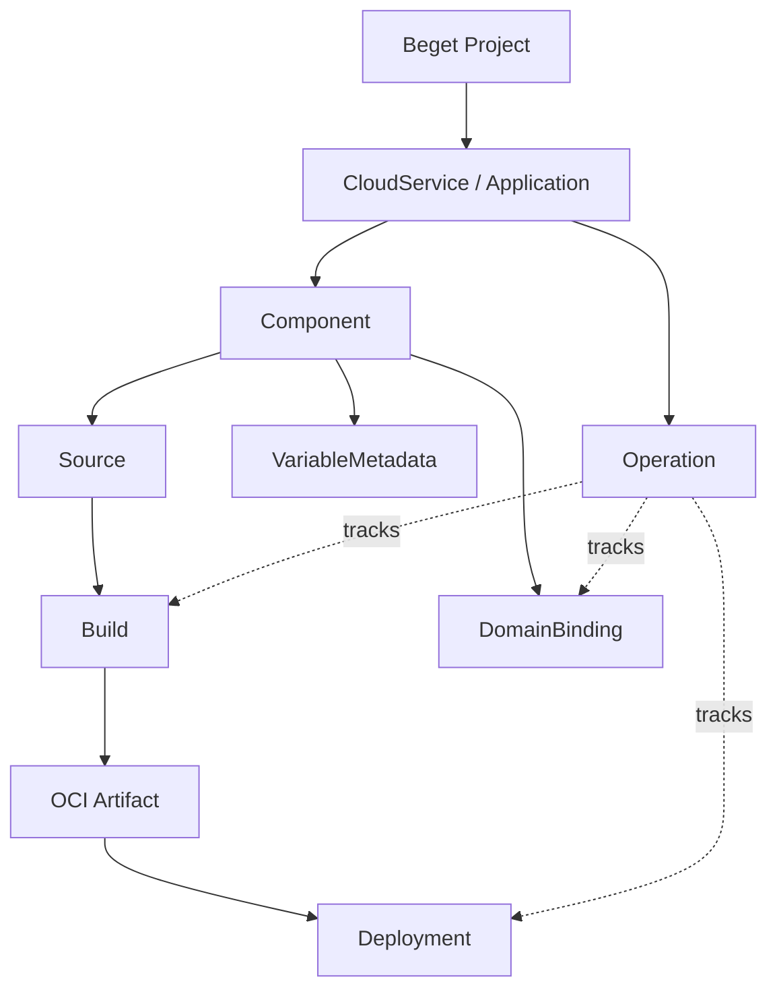
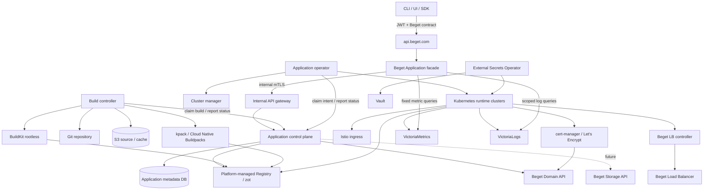
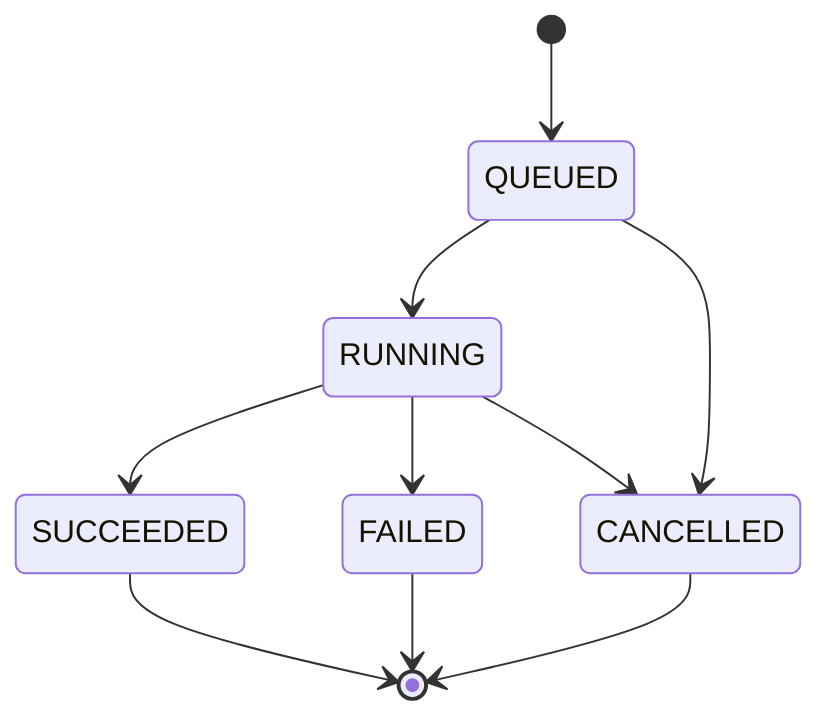
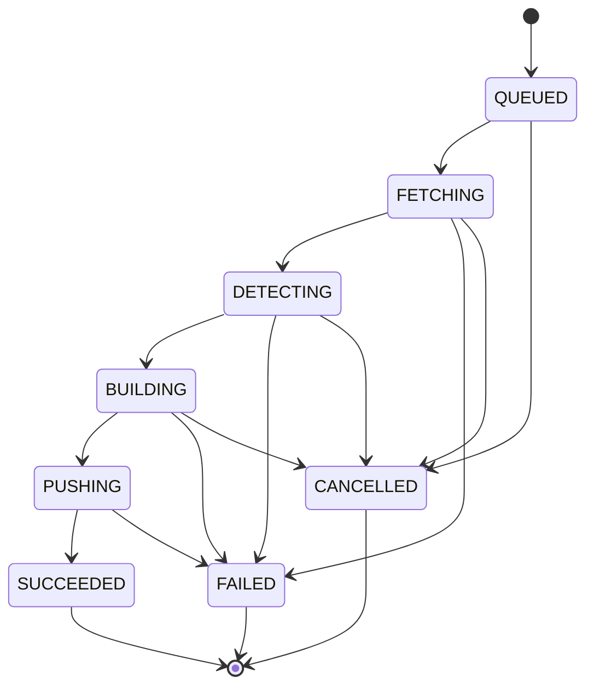
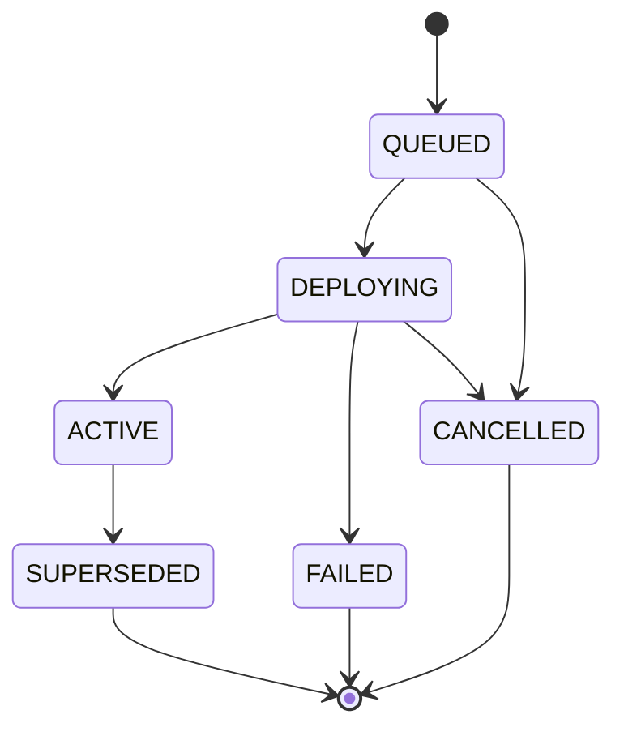
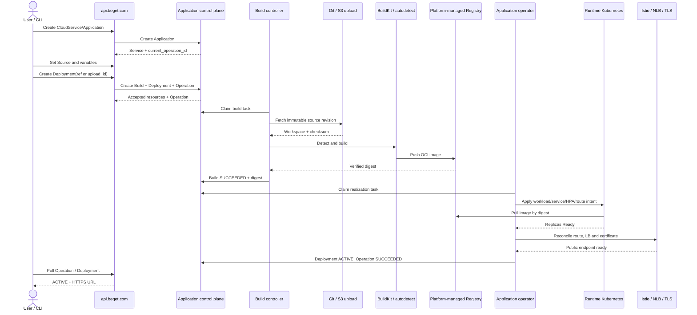

# PM Draft — Платформа приложений Beget

**Дата:** 2026-07-07
**Статус:** DRAFT, discovery
**Владельцы:** Product / Cloud Platform
**Внутренний домен:** Application Platform
**Публичный API:** additive extension `beget.cloud.v1.cloud` на `https://api.beget.com`

> [!important] Главный критерий концепта
> Продукт обязан выглядеть для клиента как штатная часть публичного Cloud API Beget:
> тот же JWT, проекты, UUID, `CloudService`, фильтрация, SDK и модель ошибок. Детали
> внутреннего control plane не должны попадать во внешний wire-контракт.

## 0. Резюме

Платформа приложений Beget принимает исходный код из Git или tarball, определяет способ
сборки, создает OCI-образ, публикует его в собственный Registry, развертывает приложение,
подключает домен и TLS, отдает логи/метрики и позволяет откатить релиз без
самостоятельного управления Kubernetes.

Продукт реализуется полностью на Kubernetes-стеке. Платформа управляет кластерами,
размещением и автоскейлингом; Istio реализует L7-маршрутизацию; внешний L4-трафик
получает Beget Load Balancer через Kubernetes `Service` с `type: LoadBalancer`;
VictoriaMetrics и VictoriaLogs служат источниками метрик и логов; cert-manager
получает и обновляет сертификаты Let's Encrypt; домены управляются через Beget API.
OCI-артефакты хранятся в собственном управляемом Registry поверх zot/S3. Постоянные диски
подключаются после стабилизации нового Storage API.

Внешний и внутренний контракты разделены:

| Слой | Назначение | Контракт |
|---|---|---|
| Beget public facade | Стабильный клиентский API и SDK | `api.beget.com`, Bearer JWT, UUID v4, snake_case, `offset/limit/filter/sort`, `oneof result` |
| Application control plane | Каноническая доменная модель и оркестрация | flat resources, project scope, internal `Operation`, cursor pagination, gRPC/REST |
| Kubernetes realization | Желаемое и наблюдаемое состояние workloads | controller/reconciler, Deployment/Job/Service/HPA, Istio, cert-manager |

Такое разделение позволяет встроить продукт в существующий API без breaking changes и
независимо развивать внутреннюю реализацию.

## 1. Нотация и бизнес-смысл ресурсов

Этот раздел задает язык продукта. Имена с заглавной буквы и в monospace обозначают
публичные или внутренние API resources. Kubernetes-объекты всегда называются с
указанием API, например Kubernetes `apps/v1 Deployment`.

### 1.1 Почему важно различать ресурсы

Слова «сервис», «сборка», «деплой» и «релиз» описывают разные бизнес-состояния. Если
объединить их в один объект, невозможно отдельно ответить на вопросы:

- какой исходный код собирался;
- получился ли воспроизводимый образ;
- какая конфигурация запущена сейчас;
- почему публикация не завершилась;
- на какую версию выполнять rollback;
- за какой объект считать стоимость и квоту.

### 1.2 Словарь ресурсов

| Термин | Что это | Какую бизнес-задачу решает | Не путать с |
|---|---|---|---|
| Beget `Project` | Существующий контейнер ресурсов аккаунта | Совместный доступ, группировка и биллинг нескольких cloud services | Kubernetes Namespace |
| `CloudService` | Существующий корневой тип услуги Beget | Показывает Application в общем каталоге `/v1/cloud`, связывает тариф, регион и Project | Компонент приложения; Kubernetes Service |
| `Application` | Product-specific проекция одного `CloudService` | Изолирует deployable environment, квоту, домены, секреты и lifecycle | Beget Project |
| `Component` | Самостоятельно собираемая и запускаемая часть Application | Позволяет независимо развертывать web-процесс, а позже worker/cron | `CloudService`; Kubernetes Service |
| `Source` | Зафиксированная настройка источника Component | Определяет, откуда воспроизводимо получить код: Git repo/ref/context или tarball upload | Build |
| `Build` | Один запуск source -> OCI artifact | Отделяет ошибки clone/detect/compile/push от ошибок runtime rollout; дает build logs и повторное использование artifact | Deployment |
| `Artifact` | Immutable OCI image по digest | Гарантирует, что rollout и rollback запускают ровно собранные байты, а не mutable tag | Registry repository/tag |
| `Deployment` | Одна попытка активировать Artifact + config revision для Component | Хранит историю rollout, health gate, failure stage и точку rollback | Kubernetes `apps/v1 Deployment` |
| Release | Бизнес-термин: Deployment, успешно ставший `ACTIVE` | Обозначает версию, реально принимающую traffic | Отдельный API resource: в MVP его нет |
| `Operation` | Унифицированное длительное действие новых Cloud API | Дает единый polling/cancel/error contract всем продуктам, которые разрабатываются нашей командой | `Deployment`: Operation описывает процесс, Deployment — результат rollout |
| `VariableMetadata` | Ключ конфигурации и признак secret | Позволяет управлять runtime config без раскрытия секретного значения | Kubernetes ConfigMap/Secret |
| `DomainBinding` | Привязка FQDN к WEB Component | Показывает DNS verification, route и certificate status как один клиентский объект | DNS record или Certificate по отдельности |
| `Replica` | Read-only проекция одного runtime instance | Дает пользователю health/restart diagnostics без раскрытия node/pod internals | Kubernetes Pod |
| `RuntimeCluster` | Internal-only кластер размещения | Управляет capacity, Kubernetes version, upgrades и node autoscaling | Публичный клиентский ресурс |

В UI `Component` может называться «Сервис приложения». В API используется `component`,
потому что `service` уже занят корневым Beget `CloudService`, а в data plane существует
Kubernetes `Service`.

### 1.3 Иерархия

### 1.4 Инварианты модели

1. Один `Application` соответствует одному Beget `CloudService` и одному deployable
   environment.
2. `Build` immutable: source revision, builder, build plan, logs и artifact digest после
   завершения не меняются.
3. `Deployment` immutable: artifact digest и config revision не меняются; изменение
   создает новый Deployment.
4. Один Component имеет не более одного `ACTIVE` Deployment.
5. Rollback создает новый Deployment на основе старого Artifact/config revision, а не
   меняет историю.
6. `Operation` не является source of truth ресурса: после завершения состояние читается
   из Application/Component/Build/Deployment/DomainBinding.
7. Kubernetes resources — детали реализации и не являются публичными идентификаторами.

## 2. Контекст публичного API Beget

На дату draft источником истины является официальный
[`LTD-Beget/cloud`](https://github.com/LTD-Beget/cloud/blob/master/proto/v1/cloud.proto).
Из него генерируются публичные SDK, включая
[`openapi-cloud-php` v1.6.9](https://github.com/LTD-Beget/openapi-cloud-php/tree/v1.6.9).

Существующий контракт задает следующие обязательные ограничения совместимости:

| Аспект | Текущий публичный контракт | Требование к платформе приложений |
|---|---|---|
| Edge | `https://api.beget.com` | Не создавать отдельный публичный endpoint |
| AuthN | Bearer JWT через `/v1/auth` | Использовать тот же токен и account context |
| Каталог услуг | `CloudService` и `GET /v1/cloud` | Приложение отображается как обычный cloud service |
| Создание | `POST /v1/cloud` + `configuration_id` + product params | Добавить `application_params` без изменения существующих полей |
| Проекты | UUID v4 `project_id` | Использовать существующий Beget Project, не вводить второй публичный Project |
| Идентификаторы | UUID v4 | Не показывать внутренние ID во внешнем API |
| JSON/proto | snake_case | Сохранить имена полей публичного API |
| Списки | `offset`, `limit`, `filter`, `sort`, `view` | Поддержать существующую семантику и whitelist полей |
| Ответы | resource/`oneof result` + domain error enum | Не отдавать наружу implementation-specific error envelope |
| Async | Ресурс с переходным status или доменный Order/Restore | Ввести общий Operation для всех новых Cloud API нашей разработки, сохранив resource status |
| SDK | OpenAPI-генерация из proto | Обновлять PHP/Python/Go SDK в том же release flow |

### 2.1 Additive extension `cloud.proto`

Публичный контракт расширяется без изменения существующих field numbers:

1. Добавляется `proto/v1/application.proto`, package
   `beget.cloud.v1.application`.
2. Добавляется общий `proto/v1/operation.proto`, package
   `beget.cloud.v1.operation`; его используют Application и все последующие Cloud API,
   которые разрабатываются нашей командой.
3. В `cloud.CreateRequest.params` добавляется `application_params`.
4. В `cloud.CreateResponse.result` добавляется `application_error`.
5. В `cloud.Service.entity` добавляется `application.Application application`.
6. В `cloud.Service.Type` и `cloud.ServiceConfiguration.Type` добавляется
   `APPLICATION` с новым enum number.
7. В `cloud.ServiceConfiguration.configuration` добавляется
   `application.ApplicationConfiguration`.
8. Whitelist фильтра `CloudService.getList` расширяется полями
   `application.status`, `application.runtime`, `application.default_domain`.
9. `application.Application` получает `current_operation_id`; в
   `cloud.RemoveResponse.Success` добавляется optional `operation_id` для async cleanup
   Application. Существующие клиенты игнорируют новые поля.

После изменения обязательны `buf lint`, `buf breaking` и генерация всех официальных
SDK. Старый клиент продолжает читать общие поля `CloudService` и игнорирует неизвестный
`application` oneof case.

### 2.2 Внешний и внутренний идентификаторы

Публичный `service_id` — UUID v4 и одновременно идентификатор приложения в Beget API.
Внутренние ресурсы могут использовать собственные типизированные ID. Таблица соответствий
принадлежит application facade и не видна клиенту.

| Публичный ресурс | Внутренний ресурс | Правило |
|---|---|---|
| `service_id` | `Application.id` | 1:1, immutable mapping |
| `component_id` UUID | `Component.id` | 1:1 в пределах Application |
| `build_id` UUID | `Build.id` | 1:1, immutable |
| `deployment_id` UUID | `Deployment.id` | 1:1, immutable |
| `domain_id` UUID | `DomainBinding.id` | 1:1 |
| `operation_id` UUID | Внутренний `Operation.id` | 1:1 immutable mapping в общем Cloud Operation namespace |

Нельзя кодировать внутренний ID в UUID, вычислять его из UUID или возвращать оба ID в
публичном ответе. Маппинг создается атомарно с ресурсом и защищается UNIQUE/FK.

Публичный Beget `project_id` имеет формат UUID v4, а внутренний слой авторизации может
использовать собственный Project ID. Их соответствие должно принадлежать единому
account/project identity bridge на edge/IAM-слое. Он является authoritative owner
mapping; Application facade только читает соответствие и не создает локальную копию.
Контракт identity bridge входит в обязательный результат Phase 0.

### 2.3 Совместимость семантики

| Beget facade | Application control plane |
|---|---|
| JWT account context | validated principal + project-scoped IAM check |
| UUID v4 | typed internal resource ID |
| snake_case JSON | camelCase REST / snake_case proto |
| `offset/limit/sort/filter` | cursor pagination и whitelist filter |
| `oneof result` error | canonical gRPC status |
| Cloud `Operation` + resource status | internal `Operation` state/result |
| coarse `CloudService.status` | detailed application/component/deployment status |
| `created_at` RFC3339 string | protobuf Timestamp truncated to seconds |

Для `offset > 0` facade не должен последовательно проматывать cursor pages. В
application control plane нужен отдельный internal compatibility RPC для Beget facade с
offset-pagination и сортировкой. Он доступен только на internal listener и не становится
вторым публичным List-контрактом.

### 2.4 Асинхронные вызовы Beget

Проверка актуальных официальных proto показывает два публичных паттерна:

1. **Мутация ресурса возвращает ресурс.** Cloud `create` и
   `changeConfiguration` возвращают `Service`; VPS `createVps`, `startVps`, `stopVps`,
   `rebootVps`, `removeVps` и `reinstall` возвращают `VpsInfo`. В ответе уже есть
   переходный status (`CREATING`, `STARTING`, `STOPPING`, `RESTARTING`, `REMOVING`,
   `RECONFIGURING`, `REINSTALLING`). Клиент опрашивает `get`, `getList`, `getInfo` или
   `getStatuses` до конечного состояния.
2. **Длительная предметная операция возвращает job resource.** Восстановление backup
   возвращает `OrderInfo`/`MysqlRestoreOrder`/`PostgresqlRestoreOrder`; восстановление
   snapshot возвращает `Restore`. У job есть собственные `id`, `status`, даты и
   endpoint истории/списка.

Источники: [`cloud.proto`](https://github.com/LTD-Beget/cloud/blob/master/proto/v1/cloud.proto),
[`vps/manage.proto`](https://github.com/LTD-Beget/vps/blob/master/proto/v1/manage.proto),
[`vps/backup.proto`](https://github.com/LTD-Beget/vps/blob/master/proto/v1/backup.proto),
[`vps/snapshot.proto`](https://github.com/LTD-Beget/vps/blob/master/proto/v1/snapshot.proto).

**Вывод исследования:** в рассмотренных публичных контрактах Beget нет универсального
`Operation`. Для платформы приложений одного resource status недостаточно: один deploy
проходит source fetch, detect, build, push, rollout, route и certificate stages, а
клиенту нужен единый error/cancel/polling contract.

**Решение:** добавить общий `beget.cloud.v1.operation.Operation` для Application и всех
следующих Cloud API, которые разрабатываются нашей командой. Legacy API не мигрируют
принудительно: их существующая async-семантика сохраняется для обратной совместимости.
Новые API и новые тяжелые мутации используют общий Operation с первого релиза.

| Поле | Назначение |
|---|---|
| `id` | UUID v4 публичной операции |
| `project_id`, `service_id` | Владелец и optional CloudService scope |
| `resource_type`, `resource_id` | Qualified тип и ID ресурса, например `application.deployment` |
| `action` | Stable qualified action, например `application.deploy` или `cloud_service.delete` |
| `status` | `QUEUED`, `RUNNING`, `SUCCEEDED`, `FAILED`, `CANCELLED` |
| `stage` | Product-qualified stage, например `application.build.push`; не общий enum |
| `progress_percent` | Best-effort прогресс; не используется для определения успеха |
| `created_at`, `updated_at`, `finished_at` | RFC3339 timestamps |
| `error` | Qualified product error code + безопасное message и optional typed details |
| `result_resource_type`, `result_resource_id` | Ссылка на итоговый ресурс после `SUCCEEDED` |

Heavy mutation response использует Beget-форму `oneof result`. Успешно принятый запрос
возвращает `Accepted { resource, operation }`; domain validation возвращает typed
`Error`. Ресурсный status остается доступен через `Get/List`, а детальный процесс —
через общий Operation API:

- `GET /v1/cloud/operation?project_id=...&service_id=...`;
- `GET /v1/cloud/operation/{operation_id}`;
- `POST /v1/cloud/operation/{operation_id}/cancel`.

## 3. Пользователь и ценность

### 3.1 Основные пользователи

| Пользователь | Задача |
|---|---|
| Разработчик | Развернуть контейнер и получить HTTPS endpoint без настройки Kubernetes |
| Команда продукта | Разделить web/worker-компоненты, окружения, секреты и релизы |
| DevOps/SRE | Настроить health checks, ресурсы, автоскейлинг, логи и метрики |
| Владелец аккаунта | Видеть приложение в существующем проекте Beget, управлять доступом и стоимостью |

### 3.2 Целевой пользовательский путь

1. Клиент создает Application через существующий `POST /v1/cloud`.
2. Клиент создает WEB Component и задает Source: Git repository/ref или tarball upload.
3. Клиент задает обычные переменные и write-only secrets.
4. Клиент запускает Deployment и получает Build, Deployment и Operation.
5. Платформа получает source snapshot, выбирает builder, собирает и пушит OCI digest.
6. Платформа создает workload, health checks и внутренний service.
7. Для публичного Component создаются Istio route и `Service type=LoadBalancer`.
8. Клиент получает технический домен и автоматически выпущенный TLS-сертификат.
9. Клиент подключает свой домен, смотрит build/runtime logs, метрики и автоскейлинг.
10. При неудачном релизе клиент откатывается на предыдущий успешный Deployment.

## 4. Принципы продукта

1. **Beget-native.** Один аккаунт, JWT, Project, API endpoint, SDK, биллинг и UI.
2. **API-first.** Любое действие UI доступно через публичный API.
3. **Declarative realization.** БД хранит intent; контроллер доводит Kubernetes до
   желаемого состояния и публикует observed state.
4. **Immutable deployments.** Образ и конфигурация Deployment после создания не
   меняются; новый релиз создает новый Deployment.
5. **Secure by default.** Изоляция по Project/Application, network policy, mesh mTLS,
   write-only secrets, закрытые internal endpoints.
6. **Operational clarity.** Ошибка показывает стадию, стабильный код и безопасное
   сообщение; зависший resource/job имеет timeout и диагностируемое состояние.
7. **No Kubernetes leakage.** В публичном API нет namespace, pod UID, node, cluster,
   Istio resource name и других деталей реализации.

## 5. Scope

### 5.1 MVP

| Capability | MVP contract |
|---|---|
| Application | Создание как `CloudService`, Project binding, name/description, region, status, price projection |
| Component | Один тип `WEB`: command/args, `$PORT`, CPU/RAM, replicas, health checks |
| Source | Git repository + ref/context, SSH deploy key или HTTPS token reference, webhook HMAC secret; либо tarball upload через presigned S3 URL |
| Detection | `Dockerfile` имеет приоритет; без него Cloud Native Buildpacks autodetect через kpack |
| Build | Rootless/daemonless Kubernetes build, build logs, cache, immutable OCI digest |
| Registry | Собственный управляемый Registry на zot/S3; tenant namespace и short-lived credentials |
| Configuration | Env variables и write-only secrets в Vault через External Secrets Operator; новая config revision |
| Deployment | Build + config revision, rolling rollout, readiness gate, история, rollback |
| Networking | Internal service discovery; public HTTP/HTTPS через Istio |
| Load balancer | Shared ingress NLB по умолчанию или dedicated NLB для Application; оба через `Service type=LoadBalancer` |
| Domains | Технический домен и custom domain, интеграция с Beget domains/DNS |
| TLS | cert-manager + Let's Encrypt, автоматическое обновление |
| Autoscaling | Fixed replicas и HPA по CPU/RAM с `min_replicas`/`max_replicas` |
| Metrics | CPU, RAM, network, request rate, latency, errors, replicas из VictoriaMetrics |
| Logs | stdout/stderr из VictoriaLogs, фильтр по Component/Deployment/replica/time |
| Async state | Единый Cloud `Operation` для всех новых API нашей разработки + resource statuses и диагностируемые stages |
| IAM | Project-scoped permissions, list filtering, existence hiding |

### 5.2 Следующие этапы

| Capability | Условие включения |
|---|---|
| Persistent Volume | Только после APPROVED Storage API и CSI contract |
| Worker/Cron/Private Component | После стабилизации WEB lifecycle и quota model |
| Private-only ingress | После интеграции VPC/private LB |
| Scale-to-zero | После подтверждения cold-start SLO и биллинга |
| Custom autoscaling metrics | После ограничения metric catalog и cardinality budget |
| Preview environments | После стабилизации Application/Deployment lifecycle |
| Supply-chain policy | Trivy gate, SBOM, signing/provenance после базовой build pipeline |
| Git provider integrations | OAuth apps, PR previews и provider-specific webhook UX после generic Git |
| Multi-region traffic | Отдельный продуктовый и архитектурный этап |

### 5.3 Не входит в MVP

- публичный Kubernetes API и kubeconfig;
- произвольные Helm charts, Kubernetes manifests, CRD и admission policy клиента;
- пользовательская конфигурация Istio/Envoy;
- прямой доступ клиента к VictoriaMetrics или VictoriaLogs API;
- stateful workload до готовности Storage API;
- worker/cron/batch workload;
- обязательный GitOps/Argo CD слой: realization выполняет application operator;
- собственный Registry control plane на базе zot/S3;
- multi-region active-active и глобальный traffic manager;
- GPU и batch scheduling;
- managed databases как часть Application lifecycle: они остаются самостоятельными
  CloudService и подключаются через credentials/connection binding.

## 6. Публичная ресурсная модель

Application не дублирует `CloudService`: внешний `service_id` и есть корень
приложения. Вложенные ресурсы принадлежат ему и не перемещаются между Application.

| Ресурс | Назначение | Ключевые поля |
|---|---|---|
| `Application` | Product-specific проекция `CloudService` | `service_id`, `runtime`, `status`, `default_domain`, `load_balancer_mode`, `active_deployment_count` |
| `Component` | Отдельно развертываемый процесс | `id`, `name`, `type`, `command`, `port`, resources, replicas, autoscaling, health checks, status |
| `Source` | Настройка получения исходников | `type`, Git `repository/ref/context` или `upload_id`, credential reference |
| `Build` | Неизменяемый запуск сборки | `id`, `component_id`, source revision, builder, status, timings, artifact digest, failure |
| `Artifact` | Read-only OCI projection | registry/repository, digest, size, created_at, source/build references |
| `Deployment` | Неизменяемая попытка rollout | `id`, `component_id`, `build_id`, `image_digest`, config revision, status, timings, failure |
| `DomainBinding` | Связь FQDN с WEB Component | `id`, `component_id`, `fqdn`, `status`, `certificate_status`, `verification` |
| `VariableMetadata` | Безопасная проекция config key | `key`, `is_secret`, `updated_at`; значение secret никогда не возвращается |
| `Operation` | Унифицированное состояние heavy mutation | `id`, resource reference, action, status, stage, progress, timestamps, error |
| `Volume` | Постоянный том | Зарезервировано до Storage API; в MVP отсутствует |

### 6.1 Окружения

В MVP один Application `CloudService` является одним deployable environment. Для
`development`, `staging` и `production` клиент создает отдельные Application в одном
Beget Project. Это сохраняет независимые billing/quota, domains, secrets и lifecycle и
не вводит второй уровень между существующим Project и `CloudService`.

First-class `Environment` в MVP не вводится. Preview environments после MVP создаются
как отдельные временные Application с TTL, собственными quota/secrets/domains и ссылкой
на исходную Application. Это сохраняет совместимость с `CloudService` и не добавляет
вложенный billing scope.

### 6.2 Статусы

`CloudService.status` остается coarse-проекцией для совместимости. Детальное состояние
живет в `application.Application`.

| Internal Application | Public `CloudService.status` | Public Application status |
|---|---|---|
| `PROVISIONING` | `CREATING` | `PROVISIONING` |
| `ACTIVE` | `RUNNING` | `ACTIVE` |
| `DEGRADED` | `RUNNING` | `DEGRADED` |
| `SUSPENDED` | `SUSPENDED` | `SUSPENDED` |
| `FAILED` | `STOPPED` | `FAILED` |
| `DELETING` | `STOPPED` до удаления из списка | `DELETING` |

Build: `QUEUED`, `FETCHING`, `DETECTING`, `BUILDING`, `PUSHING`, `SUCCEEDED`,
`FAILED`, `CANCELLED`.

Deployment: `QUEUED`, `DEPLOYING`, `ACTIVE`, `FAILED`, `CANCELLED`, `SUPERSEDED`.

Operation: `QUEUED`, `RUNNING`, `SUCCEEDED`, `FAILED`, `CANCELLED`; детальная стадия
повторяет текущий шаг Build/Deployment/Domain lifecycle.

Component: `PROVISIONING`, `ACTIVE`, `UPDATING`, `DEGRADED`, `FAILED`, `DELETING`.
DomainBinding: `VERIFYING`, `PROVISIONING`, `ACTIVE`, `DEGRADED`, `FAILED`,
`DELETING`.

## 7. Публичный API

### 7.1 Общие CloudService методы

| Метод | Path | Изменение |
|---|---|---|
| `CloudService.create` | `POST /v1/cloud` | Новый `application_params`; возвращает Service со status `CREATING` |
| `CloudService.get` | `GET /v1/cloud/{service_id}` | Новый `application` case в `Service.entity` |
| `CloudService.getList` | `GET /v1/cloud` | Application входит в общий список и фильтры |
| `CloudService.update` | `PATCH /v1/cloud/{service_id}` | Обновляет display name/description как у других услуг |
| `CloudService.remove` | `DELETE /v1/cloud/{service_id}` | Сохраняет текущий `RemoveResponse.Success`; cleanup выполняется внутренне |
| `CloudService.bindProject` | `PUT /v1/cloud/{service_id}/project` | Перемещение разрешено только без активного Deployment/Volume |

`CloudService.create/remove/bindProject` сохраняют текущую форму ответа. Create и
bindProject возвращают `Service`; `application.current_operation_id` указывает на
общий Cloud Operation. Для Application delete поле
`RemoveResponse.Success.operation_id` заполняется новым UUID. Внутренний ID в
публичный ответ не входит.

### 7.2 Общий Operation API

Этот контракт обязателен для Application и других новых Cloud API, которые
разрабатываются нашей командой. `resource_type` и `action` расширяются аддитивно;
product-specific stage/error enums остаются в своих proto packages.

| Service/RPC | HTTP path | Результат |
|---|---|---|
| `OperationService.getList` | `GET /v1/cloud/operation` | Список с фильтрами `project_id`, `service_id`, `resource_type`, `status`, `created_at` |
| `OperationService.get` | `GET /v1/cloud/operation/{operation_id}` | Operation status/stage/error/result reference |
| `OperationService.cancel` | `POST /v1/cloud/operation/{operation_id}/cancel` | Operation; `FAILED_PRECONDITION`, если отмена уже невозможна |

### 7.3 Product-specific методы

| Service/RPC | HTTP path | Результат |
|---|---|---|
| `ApplicationService.get` | `GET /v1/cloud/application/{service_id}` | Полная Application projection |
| `ApplicationService.update` | `PATCH /v1/cloud/application/{service_id}` | Accepted: Application + Operation; меняет `load_balancer_mode` и runtime policy |
| `ComponentService.getList` | `GET /v1/cloud/application/{service_id}/component` | Список Component |
| `ComponentService.create` | `POST /v1/cloud/application/{service_id}/component` | Accepted: Component + Operation |
| `ComponentService.get` | `GET /v1/cloud/application/{service_id}/component/{component_id}` | Component |
| `ComponentService.update` | `PATCH /v1/cloud/application/{service_id}/component/{component_id}` | Accepted: Component + Operation |
| `ComponentService.remove` | `DELETE /v1/cloud/application/{service_id}/component/{component_id}` | Accepted: Component + Operation |
| `SourceService.set` | `PUT /v1/cloud/application/{service_id}/component/{component_id}/source` | Source metadata; credential value не возвращается |
| `UploadService.create` | `POST /v1/cloud/application/{service_id}/upload` | `upload_id` + presigned S3 URL + expiry |
| `BuildService.getList` | `GET /v1/cloud/application/{service_id}/build` | История Build |
| `BuildService.get` | `GET /v1/cloud/application/{service_id}/build/{build_id}` | Build + artifact projection |
| `BuildService.getLog` | `GET /v1/cloud/application/{service_id}/build/{build_id}/log` | Cursor/SSE build log |
| `DeploymentService.getList` | `GET /v1/cloud/application/{service_id}/deployment` | История Deployment |
| `DeploymentService.create` | `POST /v1/cloud/application/{service_id}/deployment` | Accepted: Build + Deployment + Operation |
| `DeploymentService.get` | `GET /v1/cloud/application/{service_id}/deployment/{deployment_id}` | Deployment |
| `DeploymentService.rollback` | `POST /v1/cloud/application/{service_id}/deployment/{deployment_id}/rollback` | Accepted: новый Deployment + Operation |
| `DeploymentService.cancel` | `POST /v1/cloud/application/{service_id}/deployment/{deployment_id}/cancel` | Deployment + Operation |
| `VariableService.getList` | `GET /v1/cloud/application/{service_id}/variable` | Metadata без secret values |
| `VariableService.set` | `PUT /v1/cloud/application/{service_id}/variable` | Обновленная VariableMetadata/config revision |
| `VariableService.remove` | `DELETE /v1/cloud/application/{service_id}/variable/{key}` | `Success` |
| `DomainService.getList` | `GET /v1/cloud/application/{service_id}/domain` | Список DomainBinding |
| `DomainService.create` | `POST /v1/cloud/application/{service_id}/domain` | Accepted: DomainBinding + Operation |
| `DomainService.get` | `GET /v1/cloud/application/{service_id}/domain/{domain_id}` | DomainBinding |
| `DomainService.remove` | `DELETE /v1/cloud/application/{service_id}/domain/{domain_id}` | Accepted: DomainBinding + Operation |
| `LogService.get` | `GET /v1/cloud/application/{service_id}/log` | Cursor page логов |
| `UsageService.get` | `GET /v1/cloud/application/{service_id}/usage` | Usage по vCPU/RAM/build/egress, included quota и forecast |
| `BudgetService.get` | `GET /v1/cloud/application/{service_id}/budget` | Soft/hard limits и текущий utilization |
| `BudgetService.update` | `PUT /v1/cloud/application/{service_id}/budget` | Обновленный budget policy |

Статистические методы сохраняют сложившийся Beget pattern:

- `GET /v1/cloud/application/{service_id}/statistic/cpu`;
- `GET /v1/cloud/application/{service_id}/statistic/memory`;
- `GET /v1/cloud/application/{service_id}/statistic/network`;
- `GET /v1/cloud/application/{service_id}/statistic/request`;
- `GET /v1/cloud/application/{service_id}/statistic/latency`;
- `GET /v1/cloud/application/{service_id}/statistic/replica`.

Все методы принимают Bearer JWT и проверяют доступ к `project_id`/`service_id`.
Невозможность увидеть ресурс возвращается как 404, а не раскрывающий существование 403.

### 7.4 Polling contract

| Mutation | Основной poll endpoint | Успех | Ошибка/окончание удаления |
|---|---|---|---|
| Application create | `OperationService.get`; затем `CloudService.get` | Operation `SUCCEEDED`, Application `ACTIVE` | Operation/Application `FAILED` |
| Application remove | `OperationService.get`; затем `CloudService.get` | Operation `SUCCEEDED`, resource 404 | Operation `FAILED` |
| Component create/update | `OperationService.get`; затем `ComponentService.get` | Operation `SUCCEEDED`, Component `ACTIVE` | `FAILED` |
| Component remove | `OperationService.get`; затем `ComponentService.get` | Operation `SUCCEEDED`, resource 404 | Operation `FAILED` |
| Deploy/rollback | `OperationService.get`; `DeploymentService.get` | Operation `SUCCEEDED`, Deployment `ACTIVE` | `FAILED`/`CANCELLED` |
| Domain create | `OperationService.get`; `DomainService.get` | Operation `SUCCEEDED`, Domain `ACTIVE` | `FAILED`/`DEGRADED` |
| Domain remove | `OperationService.get`; затем `DomainService.get` | Operation `SUCCEEDED`, resource 404 | Operation `FAILED` |

Рекомендуемый polling interval — 2-5 секунд с exponential backoff и jitter. Public
Watch/streaming status API в MVP отсутствует.

## 8. Внутренний API платформы

Внутренний API является реализационной деталью Application Platform и недоступен
клиентам напрямую. Его package, имена сервисов и схема хранения утверждаются на этапе
технического проектирования и не являются частью публичного контракта Beget.

| Resource service | Sync reads | Async mutations |
|---|---|---|
| `ApplicationService` | `Get`, `List` | `Create`, `Update`, `Delete`, `Move` |
| `ComponentService` | `Get`, `List` | `Create`, `Update`, `Delete`, `Scale` |
| `SourceService` | `Get` | `Set`, `Delete` |
| `BuildService` | `Get`, `List`, `GetLog` | `Create`, `Cancel` |
| `DeploymentService` | `Get`, `List` | `Create`, `Rollback`, `Cancel` |
| `DomainBindingService` | `Get`, `List` | `Create`, `Delete`, `RetryCertificate` |
| `VariableService` | `ListMetadata` | `Set`, `Delete` |
| `OperationService` | `Get` | `Cancel`, где операция поддерживает отмену |

Внутренние мутации возвращают `Operation`. Resources плоские, `project_id` immutable,
`Update` использует `FieldMask`, списки используют opaque cursor `(created_at, id)`.
Exact ID prefixes утверждаются после общего collision audit только после APPROVED
acceptance.

Это исключительно internal contract. Для совместимости с Beget resource-status pattern
синхронная часть mutation одной Writer transaction сохраняет:

- resource/job intent-row с переходным status;
- internal Operation;
- UUID mapping;
- durable realization task;
- необходимые outbox events.

Build и Kubernetes realization выполняются асинхронно. Поэтому сразу после mutation
facade может прочитать ресурс по pre-allocated ID и вернуть его без race с worker.
Public Cloud Operation маппится 1:1 на internal Operation, но получает отдельный
UUID и Beget-shaped error/status projection. Клиент Beget никогда не опрашивает
внутренний `OperationService` напрямую.

## 9. Архитектура

### 9.1 Компоненты

| Компонент | Ответственность |
|---|---|
| Beget Application facade | Внешний proto, UUID mapping, pagination/error/status translation, JWT context, OpenAPI SDK contract |
| Application control plane | Domain state, operations, IAM, placement intent, rollout state machine, cross-service orchestration |
| Build controller | Claim Build tasks, fetch immutable source, detect builder, run isolated build, push digest, report status/logs |
| Cluster manager | Internal inventory кластеров/node pools, upgrades, health, capacity и cluster autoscaling |
| Application operator | Pull realization tasks, placement через Cluster manager, применение в Kubernetes, status feedback и drift correction |
| Platform-managed Registry | Собственный tenant OCI control plane поверх zot/S3: IAM-authz, repository/tag projection и pull/push plane |
| Vault + External Secrets Operator | Source of truth secret values и доставка scoped Kubernetes Secret в runtime namespace |
| Beget LB controller | Реализация `Service type=LoadBalancer` через Beget NLB service |
| Observability query facade | Tenant-scoped и ограниченные запросы к VictoriaMetrics/VictoriaLogs |

### 9.2 Граница control plane / data plane

Application control plane не хранит Kubernetes manifests как публичную модель. Он хранит
нормализованный intent и revision. Operator генерирует Kubernetes resources и может
изменять их форму без изменения публичного API.

Публичный API никогда не возвращает:

- имя runtime cluster, namespace, node и pod UID;
- внутренний Service/Deployment/ReplicaSet name;
- Istio Gateway/VirtualService details;
- NLB provider annotations и cloud-controller state;
- VictoriaMetrics tenant ID и VictoriaLogs query credentials.

### 9.3 Cluster management

Кластеры являются internal-only ресурсами платформы. MVP использует shared
multi-tenant runtime clusters; базовая граница арендатора — отдельный namespace на
Application. На каждый namespace обязательны ResourceQuota, LimitRange, Pod Security,
NetworkPolicy, отдельные service accounts и Istio authorization policy. Dedicated
runtime cluster не входит в MVP: повышенная сетевая изоляция достигается namespace и
policy boundaries, а dedicated compute может появиться позднее как отдельный тариф.
Kubernetes определяет namespace как механизм изоляции групп namespaced resources и
scope для ResourceQuota: [Namespaces](https://kubernetes.io/docs/concepts/overview/working-with-objects/namespaces/).

Cluster manager отвечает за:

- регистрацию и health кластеров;
- версию Kubernetes и плановые обновления;
- placement по region/capacity/taints;
- node pool autoscaling по pending pods и резерву capacity;
- drain/eviction при обслуживании;
- запрет размещения при недостаточной capacity вместо бесконечного pending.

## 10. Реализация Kubernetes

### 10.1 Workloads

| Component type | Kubernetes realization |
|---|---|
| `WEB` | Deployment + ClusterIP Service + readiness/liveness/startup probes |
| `WORKER` | Deployment без public Service, после MVP |
| `CRON` | CronJob, после MVP |

Каждая Deployment revision pin-ит OCI digest. Использование mutable tag допускается
только на входе: перед rollout платформа резолвит tag в digest и сохраняет digest в
Deployment.

### 10.2 Source, detection и build

Source фиксируется до старта Build:

- Git: repository URL, resolved commit SHA, context directory и credential reference;
- upload: immutable `upload_id`, checksum и S3 object version;
- prebuilt image может быть отдельным bypass-path после MVP, но не заменяет build flow.

Generic Git authentication в MVP поддерживает ровно три механизма:

1. SSH deploy key для read-only clone; платформа генерирует или принимает ключ, private
   key хранится в Vault, а API возвращает только public key и fingerprint.
2. HTTPS access token reference для Git-серверов без deploy keys; token передается
   write-only, хранится в Vault и не попадает в Source/Build/logs.
3. Webhook HMAC secret для проверки push event; событие принимается только после
   signature verification и дедуплицируется по provider event ID + commit SHA.

Provider OAuth Apps, автоматическая установка deploy key и pull-request UX идут после
MVP. Source всегда резолвится в immutable commit SHA до старта Build.

Builder выбирается детерминированно:

1. Если в context есть `Dockerfile`, используется **BuildKit rootless**. Он выбран как
   перспективный стандарт: проект активно развивается, поддерживает rootless execution,
   registry/inline cache, OCI output и provenance. Исходный Kaniko архивирован 3 июня
   2025 года и в продукт не закладывается. Источники:
   [BuildKit](https://github.com/moby/buildkit),
   [Kaniko archive](https://github.com/GoogleContainerTools/kaniko).
2. Если `Dockerfile` отсутствует, используется **Cloud Native Buildpacks через kpack**.
   CNB lifecycle выполняет стандартные analyze/detect/restore/build/export phases, а
   kpack дает Kubernetes-native Build/Builder resources и rebuild при обновлении
   builder/run image. Nixpacks в MVP не используется. Источники:
   [CNB lifecycle](https://buildpacks.io/docs/for-platform-operators/concepts/lifecycle/),
   [kpack](https://github.com/buildpacks-community/kpack).
3. Выбранный builder, версия builder image и сформированный build plan записываются в
   Build и не меняются после старта.

Build выполняется в отдельном namespace/node pool без runtime secrets и без privileged.
NetworkPolicy разрешает только source endpoint, S3 cache, registry push и log sink.
Timeout, CPU/RAM/ephemeral-storage quota и максимальный размер source обязательны.

### 10.3 Registry

Платформа развивает **собственный управляемый Registry** на базе zot с
S3-compatible blob backend. Собственный Registry API отвечает за
tenant repositories, short-lived credentials, quotas, retention, garbage collection и
аудит; zot остается OCI Distribution data plane. zot поддерживает fine-grained authz и
S3 storage: [authn/authz](https://zotregistry.dev/v2.1.15/articles/authn-authz/),
[storage](https://zotregistry.dev/v2.0.0/articles/storage/).

Build controller получает short-lived push credential на конкретный repository.
Runtime получает short-lived pull credential только на конкретный digest/repository.
Каноническая ссылка Artifact — digest; tag используется для навигации и не участвует в
идентичности Deployment. Retention/GC не удаляет digest, пока на него ссылается
Deployment, доступный для rollback.

### 10.4 L7 и NLB

Istio управляет HTTP/HTTPS routing, retries/timeouts и backend health. Публичный вход
создается через `Service type=LoadBalancer`; Beget LB controller заказывает и
сопровождает NLB в Beget. Application control plane не вызывает NLB API напрямую и не
дублирует lifecycle load balancer.

Публичный API поддерживает два режима `load_balancer_mode`:

- `SHARED` по умолчанию: Application использует общий ingress NLB runtime-кластера;
  это дешевле и быстрее при создании;
- `DEDICATED`: для Application создается отдельный Istio ingress Service с
  `type: LoadBalancer` и отдельный Beget NLB; режим тарифицируется отдельно и нужен для
  выделенного IP, независимых лимитов и более сильной сетевой изоляции.

Переключение режима является асинхронной Operation. Старый endpoint удаляется только
после готовности нового, чтобы не создавать простой и billable orphan.

### 10.5 Autoscaling

Workload autoscaling использует HPA v2. CPU/RAM metrics поступают через совместимый
metrics adapter из VictoriaMetrics. Public contract содержит:

- `enabled`;
- `min_replicas`;
- `max_replicas`;
- target CPU и/или memory utilization;
- stabilization window с platform defaults.

Scale-to-zero в MVP выключен. Cluster autoscaling отделен от HPA и принадлежит Cluster
manager. Платформа должна выдерживать burst HPA без размещения pod сверх заявленных
requests.

После MVP scale-to-zero реализуется отдельным request/event-driven контуром с activator
и KEDA, а не обычным CPU HPA: входящий запрос должен разбудить Component до передачи
traffic. Функция включается явно и только после фиксации cold-start SLO, idle timeout и
billing semantics. KEDA поддерживает event-driven scaling и scale-to-zero:
[KEDA](https://keda.sh/).

### 10.6 Логи и метрики

Workload пишет stdout/stderr. Агент кластера добавляет trusted labels:
`account_id`, `project_id`, `application_id`, `component_id`, `deployment_id`,
`replica`; workload не может подменить их.

VictoriaLogs доступен только через scoped query facade. Query language наружу не
экспортируется. Public API разрешает time range, component/deployment, stream,
substring, limit и cursor.

VictoriaMetrics аналогично отдает фиксированный каталог агрегатов. Произвольный
PromQL/MetricsQL в публичном MVP отсутствует из-за isolation и cardinality risk.

### 10.7 Домены и сертификаты

При создании WEB Component платформа выделяет технический FQDN в управляемой зоне.
Custom domain проходит ownership check:

1. Для домена под управлением Beget facade проверяет account ownership и создает/меняет
   DNS record через Beget Domain API.
2. Для внешнего домена клиент получает verification target и самостоятельно меняет DNS.
3. После подтверждения DNS operator создает Istio route и Certificate.
4. cert-manager выполняет ACME challenge и обновляет secret до истечения сертификата.
5. DomainBinding становится `ACTIVE` только когда DNS, route и certificate готовы.

Wildcard технической зоны использует DNS-01. Custom domain использует HTTP-01. Для
Beget-managed domains DNS-01 становится основным режимом после появления в Cloud Domain
API атомарных методов create/delete ACME challenge record; до этого используется
HTTP-01 без прямого обращения к legacy hosting API.

Owner contract для доменов — отдельный authenticated Cloud Domain API. Он проверяет
владение доменом в account context, создает/изменяет DNS records идемпотентно и
возвращает operation/status. Application хранит только `domain_id`, verification target
и наблюдаемый статус; прямой вызов legacy hosting API из core запрещен.

### 10.8 Storage

Volume API не публикуется в MVP. Stateful workloads входят в Phase 4 только после
появления versioned Storage API и CSI contract. Заранее фиксируются интеграционные
требования:

- Storage остается владельцем disk/volume lifecycle;
- Application хранит ссылку по ID без cross-service FK;
- attach/detach идемпотентны и выполняются через CSI;
- удаление Application не удаляет persistent volume без явной retention policy;
- zone/access mode/resize валидируются через Storage API;
- при недоступности Storage мутация fail-closed, работающие pods не демонтируются.

### 10.9 Инструменты MVP

| Зона | Решение | Обоснование |
|---|---|---|
| API/control plane | Go, ports-and-adapters architecture | Изолирует публичный Beget facade от доменной модели и инфраструктурных адаптеров |
| State/queue | PostgreSQL durable tasks + `FOR UPDATE SKIP LOCKED` + outbox | Уже используемый паттерн; без нового брокера/workflow dependency |
| Source upload/cache | Beget S3-compatible storage | Presigned upload, immutable object version, build cache |
| Dockerfile build | BuildKit rootless | Активно развивается; daemonless/rootless build, registry cache, OCI output и provenance |
| Autodetect | kpack + Cloud Native Buildpacks | Стандартный detect/build lifecycle, Kubernetes-native reconciliation и rebuild базовых слоев |
| Registry | Собственный Registry control plane + zot + S3 | OCI-compatible data plane  |
| Secrets | Vault + External Secrets Operator | Secret value вне application DB, scoped delivery в namespace |
| Runtime realization | Application operator | Drift correction и observed status без прямого apply из API handler |
| L7 | Istio | Existing platform choice, HTTP routing и mesh mTLS |
| L4 | Beget LB controller + `Service type=LoadBalancer` | Использует управляемую услугу NLB Beget |
| TLS | cert-manager + Let's Encrypt | ACME issuance и renewal |
| Metrics/logs | VictoriaMetrics + VictoriaLogs | Existing observability stack и tenant-scoped projections |

Оркестрация MVP строится на PostgreSQL durable tasks, transactional outbox, lease/claim
через `FOR UPDATE SKIP LOCKED` и идемпотентных handlers. Temporal, Argo CD и собственные
orchestration CRD не входят в архитектуру MVP; CRD kpack используются только внутри
buildpack execution plane. Решение пересматривается только по
измеренному пределу модели: невозможность обеспечить требуемые retries, visibility,
throughput или длительность workflow без существенного усложнения кода.

## 11. Lifecycle и reconciliation

Каждая внутренняя heavy mutation одной Writer transaction фиксирует intent, Operation,
durable task и необходимые outbox events. Build controller забирает build tasks,
Application operator — realization tasks. Оба используют internal `ClaimWork` с
`FOR UPDATE SKIP LOCKED` и возвращают observed status через `ReportStatus`.
Application control plane не вызывает контроллеры синхронно, поэтому runtime-цикл
отсутствует и брокер не требуется. Operation завершается только по наблюдаемому
результату.

### 11.1 Operation state machine

Operation status унифицирован, а `stage` доменно специфичен. Повтор task после crash не
создает новую Operation: worker claim lease истекает, task возвращается в очередь и
продолжает ту же операцию.

### 11.2 Build state machine

`SUCCEEDED` требует подтвержденный OCI digest в Registry. Успешное завершение builder
process без успешного push/manifest read-back не считается успешным Build.

### 11.3 Deployment state machine

ACTIVE означает одновременно:

- нужное число replicas Ready;
- readiness probe успешна;
- Service endpoints опубликованы;
- для public WEB route принят Istio;
- если domain входит в Deployment gate, сертификат готов.

Rollback создает новый Deployment на основе предыдущей revision. Он не меняет старую
запись и не переключает traffic на ресурс со статусом FAILED.

### 11.4 Идемпотентность и конкуренция

- Один Component имеет не более одного active rollout; ограничение выражается partial
  UNIQUE/CAS в metadata database.
- Повтор public mutation с тем же idempotency key возвращает тот же resource/job;
  внутри он связан с той же Operation.
- Новая Deployment либо отклоняется при active rollout, либо supersede выполняется
  отдельным явным действием; silent last-writer-wins запрещен.
- Domain FQDN глобально уникален среди активных binding.
- Component name уникален в Application.
- DML, Operation и outbox event коммитятся одной Writer transaction.

### 11.5 Юзерфлоу: source -> build -> deploy -> URL

Если Build завершается `FAILED`, Kubernetes realization не запускается. Если rollout
завершается `FAILED`, успешный предыдущий Deployment остается `ACTIVE`; автоматический
rollback не скрывает ошибку новой версии.

## 12. Cross-service ownership

| Ресурс/функция | Владелец | Application responsibility |
|---|---|---|
| Account/Project/AuthZ | IAM / Beget account | Проверить доступ, хранить только reference |
| Git source | Внешний Git provider | Хранить URL/ref/context и credential reference; фиксировать resolved commit SHA |
| Tarball/cache | Beget S3 | Выдать presigned upload, проверить checksum/version и retention |
| OCI blobs/tags | Platform-managed Registry | Резолв digest и получить short-lived pull credential |
| Secret values | Vault | Хранить только metadata/reference; доставка через External Secrets Operator |
| Region | Geography | Проверить доступность region для runtime placement |
| NLB | Beget Load Balancer | Создать Kubernetes Service intent; lifecycle ведет LB controller |
| DNS/domain | Beget Domain API | Создать DomainBinding и вызвать owner API |
| Certificate | cert-manager + ACME | Хранить customer-facing status, не private key |
| Persistent storage | будущий Storage service | Хранить reference и mount intent |
| Metrics/logs | VictoriaMetrics/VictoriaLogs | Ограничить tenant query и отдать product projection |

Новый runtime graph не должен образовывать циклы. Предлагаемые зависимости:

- Application control plane использует IAM, Registry, Geography, Domain API и в будущем
  Storage API только через их внутренние контракты;
- Build controller получает задания и возвращает статусы через Application control
  plane, читает source из Git/S3 и пушит образ в Registry;
- Application operator получает intent и возвращает observed status через Application
  control plane, а placement/capacity запрашивает у Cluster manager;
- External Secrets Operator читает scoped secrets из Vault;
- Beget LB controller управляет NLB по Kubernetes `Service type=LoadBalancer`.

После APPROVED зависимости фиксируются в архитектурной документации и проверяются на
отсутствие циклов.

## 13. Security

1. Edge валидирует Beget JWT; facade передает проверенный principal, account и project
   context по mTLS.
2. Каждый public/internal RPC проходит AuthN и per-RPC AuthZ; internal listener не
   считается доверенным.
3. List фильтруется по доступным Application/Component, а denied Get скрывает
   существование ресурса.
4. Namespace не является security boundary сам по себе: обязательны NetworkPolicy,
   Pod Security, ResourceQuota, service account per Application и Istio mTLS.
5. Vault — source of truth secret values. Канонический logical path:
   `kv/cloud/projects/{project_id}/applications/{service_id}/components/{component_id}`.
   Application DB хранит только key metadata, version и Vault reference; secret никогда
   не возвращается после записи и не попадает в Operation, audit event, build/runtime
   logs или Kubernetes labels.
6. Registry pull credential короткоживущий и scope-limited на конкретный repository/digest.
7. Build workloads запускаются в отдельном security pool без runtime secrets и доступа
   к control-plane network; push credential ограничен одним repository.
8. ESO использует Kubernetes auth, отдельный ServiceAccount и namespace-scoped
   `SecretStore`; static Vault token и общий `ClusterSecretStore` для tenant secrets
   запрещены. `ExternalSecret` использует `refreshPolicy: Periodic`, interval 5 минут и
   owner policy. Изменение secret hash запускает rolling Deployment, чтобы обновились
   env values. Возможности refresh policy описаны в
   [ESO API](https://external-secrets.io/latest/api/externalsecret/).
9. Сетевой default: ingress разрешен только через Istio и явно объявленные private
   bindings; межарендный east-west traffic запрещен. Интернет-egress идет через
   управляемый egress gateway, который блокирует control-plane, metadata endpoints и
   приватные диапазоны. В MVP интернет-egress разрешен по умолчанию через этот gateway;
   тарифные allow/deny rules добавляются без прямого выхода pod в сеть.

## 14. Billing, quotas и limits

Application входит в общий каталог конфигураций `GET /v1/cloud/configuration`.
`configuration_id` определяет допустимый aggregate CPU/RAM, количество Component,
replicas, domains и retention. `CloudService.price_day/price_month` остается общей
ценовой проекцией.

Принята **hybrid billing model**: тариф задает минимальный месячный платеж, включенную
квоту и feature limits; сверх включенного объема тарифицируются выделенные vCPU-seconds,
RAM GiB-seconds, build minutes и network egress. После появления Volume добавляется
GiB-month. Эта модель соответствует elastic nature PaaS и сохраняет предсказуемый
минимальный тариф. Как ориентир рынка 2026 Railway также использует base subscription +
resource usage: [Railway pricing](https://docs.railway.com/pricing).

MVP запускает тот же metering pipeline в shadow mode, но счет выставляет по тарифу до
прохождения billing reconciliation. Public beta включает usage projection, прогноз до
конца периода, soft budget alerts и optional hard budget. Scale выше quota или
недоступной capacity возвращает стабильную quota/capacity error, а не оставляет pods в
Pending. Dedicated NLB, дополнительные build minutes и расширенная log retention
учитываются отдельными line items.
l failure и cross-service authz failure.

## 15. Этапы разработки

### Phase 0 — Contract freeze

- зафиксировать additive API extension к `LTD-Beget/cloud` и публичный slug
  `application`;
- добавить общий `beget.cloud.v1.operation.Operation` и typed
  `Accepted { resource, operation }` responses для новых Cloud API нашей разработки;
- зафиксировать Git deploy key/token reference/webhook HMAC и tarball upload contracts;
- зафиксировать hybrid billing, namespace tenancy, shared/dedicated NLB modes,
  Vault/ESO layout и Cloud Domain owner API;
- сгенерировать SDK и пройти backward-compatibility check до начала реализации.

### Phase 1 — Runtime foundation

- application domain и внутренние API-контракты;
- metadata DB, operations, IAM и facade mapping;
- Source/Upload/Build API и общий public Cloud Operation;
- Build controller, Git/tarball fetch, BuildKit rootless, kpack/CNB, cache и logs;
- собственный Registry на zot/S3: push/read-back/pull по digest;
- Cluster manager и Application operator;
- shared multi-tenant placement, namespace-per-Application, WEB Component и fixed replicas;
- Vault/ESO variables/secrets, probes, internal networking;
- VictoriaMetrics/VictoriaLogs ingestion.

### Phase 2 — Public MVP

- Istio L7;
- Beget LB controller, shared/dedicated NLB и `Service type=LoadBalancer`;
- technical/custom domains;
- cert-manager + Let's Encrypt;
- HPA CPU/RAM;
- public logs/statistics facade;
- rollback и delete reconciliation;
- UI и generated SDK.

### Phase 3 — Developer workflow

- provider-specific Git OAuth/webhook integrations;
- vulnerability policy, SBOM, signing и provenance;
- preview environments, worker и cron workload;
- request-driven scale-to-zero через activator/KEDA;
- canary/blue-green rollout policies.

### Phase 4 — Stateful and GA

- Storage API + CSI + Volume lifecycle;
- backup/restore contract;
- disaster recovery, upgrade/rollback drills;
- load/stress/soak/chaos gates;
- GA SLO, limits, support playbooks и Terraform resources.
