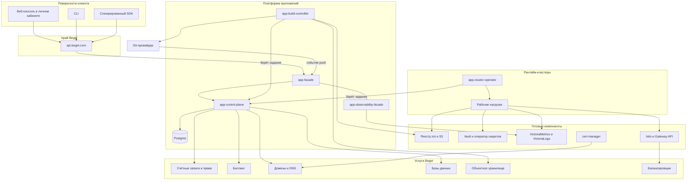

# 13. Блоки архитектуры и оценка трудозатрат

Какие сервисы и интерфейсы нужно построить, как они связаны, и сколько это стоит в
человекочасах. Разделение на сервисы выведено из трёх причин и только из них: **разный
периметр безопасности**, **разный профиль нагрузки и масштабирования**, **разное место
исполнения**. Всё, что не подпадает ни под одну, остаётся модулем внутри существующего
сервиса — см. §6.

---

## 1. Карта блоков



Стрелки от `app-build-controller` и `app-cluster-operator` к ядру направлены **к ядру**: они
приходят за работой сами. Control plane не инициирует ни одного соединения внутрь кластера и
не хранит учётных данных к нему.

---

## 2. Бэкенды

Пять запускаемых сервисов. Меньше нельзя — каждое разделение обосновано. Больше не нужно:
дробление на микросервисы ради дробления даёт распределённые транзакции там, где хватало
одной.

### 2.1 `app-facade`

**Что делает.** Держит публичный контракт: принимает запросы существующего Cloud API Beget,
проверяет токен, переводит внешние идентификаторы во внутренние и обратно, отображает
внутренние состояния во внешние, переводит постраничную выборку по смещению в курсорную,
приводит ошибки к форме Beget. На **отдельном листенере** принимает события Git-провайдера.

**Почему отдельный.** У него другой цикл выпуска, чем у ядра: контракт заморожен и тянет за
собой генерацию SDK, тогда как ядро меняется свободно. И другая аутентификация: снаружи —
токен Beget, от провайдера — подпись события.

**Почему приём событий — листенер, а не отдельный сервис.** Тот же код и то же развёртывание,
но свой порт, свои ограничения частоты и свой профиль отказа: шторм событий от провайдера не
должен вытеснять обычные запросы. Отдельный сервис ради этого — лишний бинарь и лишний
конвейер выпуска.

**Состояния не хранит.** Тонкий по определению: вся логика — отображение.

### 2.2 `app-control-plane`

**Что делает.** Доменное ядро: ресурсы, машины состояний, операции, права, очередь заданий с
арендой, исходящая очередь, размещение и реестр кластеров, реконсайлеры, подрезка истории,
агрегация потребления, выдача коротких учётных данных к реестру.

**Почему монолит, а не набор сервисов.** Всё перечисленное коммитится **одной транзакцией**
записи: ресурс, операция, задание и события. Разнести это по сервисам значит завести
распределённую транзакцию там, где достаточно одной локальной, — цена, которую нечем оправдать.

**Хранилище.** Postgres, единственный источник намерения.

**Модули внутри** (не сервисы): домен и сценарии · очередь и аренда · размещение и профили
кластеров · реконсайлеры и сборщики мусора · агрегация потребления и бюджет · выдача токенов
реестра · журнал действий.

### 2.3 `app-build-controller`

**Что делает.** Берёт задания сборки, получает исходники, определяет способ сборки, собирает,
публикует образ, читает манифест обратно, подписывает, прикладывает состав, отдаёт журнал.

**Почему обязательно отдельный — это требование безопасности, а не вкусовщина.** Здесь
выполняется произвольный код клиента. Он живёт в своём пространстве имён, на своём пуле узлов,
без доступа к сети ядра, с эфемерной служебной учётной записью. Слить его с ядром значит
поместить чужой код в тот же периметр, что и права и секреты всех клиентов.

**Профиль нагрузки** тоже другой: процессор и диск против памяти и соединений, и
масштабируется он по длине очереди сборок, а не по числу запросов.

### 2.4 `app-cluster-operator`

**Что делает.** Живёт **в каждом рантайм-кластере**. Приходит за заданиями материализации,
пишет якорный объект, разворачивает из него дочерние ресурсы, следит за дрейфом, возвращает
наблюдаемое состояние, публикует профиль возможностей кластера.

**Почему отдельный.** Место исполнения: он по определению внутри кластера, а не рядом с ядром.
Из этого же следует направление доверия — соединение исходящее, и скомпрометированный кластер
может забрать только свои задания.

### 2.5 `app-observability-facade`

**Что делает.** Единственный, кто имеет сетевой доступ к хранилищам метрик и журналов. Строит
запросы сам по ограниченному набору параметров, отдаёт страницы и поток, считает отброшенные
строки.

**Почему отдельный.** Периметр: хранилища наблюдаемости обязаны быть недостижимы из
пространства имён арендатора и из периметра сборки, и достижимы ровно из одного места. Плюс
другой профиль нагрузки — долгие соединения потока против коротких запросов.

### 2.6 Сводно

| Сервис | Состояние | Масштабируется по | Периметр |
|---|---|---|---|
| `app-facade` | нет | числу запросов | Публичный |
| `app-control-plane` | Postgres | числу операций и заданий | Внутренний, доверенный |
| `app-build-controller` | нет, рабочая копия эфемерна | длине очереди сборок | **Недоверенный**, свой пул узлов |
| `app-cluster-operator` | нет, состояние в кластере | по кластеру, один на кластер | Внутри рантайм-кластера |
| `app-observability-facade` | нет | числу запросов и потоков | Единственный доступ к хранилищам |

---

## 3. Готовые компоненты

Не наш код, но наша ответственность за настройку, обновление и восстановление.

| Компонент | Роль | Что пишем сами |
|---|---|---|
| Реестр образов | Хранение и раздача артефактов | Выдача коротких учётных данных, квоты, сборка мусора, зеркало на кластер |
| Хранилище секретов и оператор внешних секретов | Значения секретов и доставка в пространство имён | Раскладка путей, шаблоны прав, событийное обновление |
| Хранилища метрик и журналов | Приём и хранение | Разделение арендаторов, прокси проверки подлинности, предагрегация служебного арендатора |
| Сетка и шлюз | Маршрутизация, взаимная аутентификация, метрики ребра | Профили, политики, режим (§ `08` §5) |
| Менеджер сертификатов | Выпуск и продление | Порядок подтверждения владения, обработка отказов |
| Сборщики образов | Сборка из описания и из бэкпаков | Периметр, кэш, план сборки, подпись, состав |

---

## 4. Фронтенды

### 4.1 Веб-консоль — раздел существующего личного кабинета

**Не отдельный продукт с отдельным входом.** Услуга обязана выглядеть штатной частью Beget:
тот же вход, тот же выбор проекта, те же права. Технически — модуль внутри существующего
кабинета, использующий сгенерированный SDK.

| Экран | Содержание |
|---|---|
| Список приложений | В общем каталоге услуг и отдельной вкладкой; состояние, адрес, потребление |
| Создание приложения | Один обязательный шаг — репозиторий; выбор из списка при установленной интеграции; план сборки появляется потоком с источником каждого значения |
| Обзор приложения | Состояние, адрес, компоненты, последние релизы, ключевые сигналы |
| Компонент | Форма, размер, масштабирование, пробы, команды запуска и релиза, переопределения окружения |
| Релизы | История, различение классов отказа, откат, продвижение между окружениями |
| Журналы | Фильтры, курсор, живой хвост, счётчик отброшенных строк, отдельно журнал команды релиза |
| Метрики | Панель ключевых сигналов без настройки |
| Переменные и секреты | Области, признак секретности, происхождение значения |
| Привязки услуг | Выбор базы данных проекта, состояние, ротация |
| Домены | Технический и пользовательские, подтверждение владения, состояние сертификата |
| Окружения | Появляется только при добавлении второго; уровень, доля квоты, ветка |
| Источник и интеграция | Установка приложения провайдера, ключ доступа, состояние доступа |
| Потребление и бюджет | Счётчик в рублях, прогноз, остаток до потолка, режим ограничения, оценка до деплоя |
| Настройки приложения | Имя, регион, удаление, перенос в другой проект |

**Три экрана несут непропорционально много ценности** и заслуживают отдельного внимания:
создание приложения (первые пять минут), релизы с различением отказов (то, ради чего продукт
удерживает), потребление и бюджет (клин, `12` §3).

### 4.2 CLI

Тонкая обёртка над сгенерированным SDK: выкатка, хвост журнала, переменные, откат, статус,
продвижение. Контракт не расширяет — всё, что умеет CLI, доступно и через API.

Проверяется первым той аудиторией, которая пришла из терминала, и стоит недорого именно
потому, что не изобретает собственный контракт.

### 4.3 Страница статуса

Живёт **вне обслуживаемого периметра** — на независимом хостинге, не в наших кластерах.
Иначе она ляжет вместе с платформой ровно тогда, когда нужна. Проверяется учением: выключаем
кластер, страница обязана работать.

### 4.4 Статус в pull request

Не фронтенд в обычном смысле, но поверхность продукта: результат сборки и адрес предпросмотра
возвращаются в запрос на слияние через интеграцию с провайдером.

---

## 5. Связи

| Ребро | Протокол | Синхронность | При недоступности |
|---|---|---|---|
| Клиент → край Beget → `app-facade` | HTTPS, токен Beget | синхронно | Обычная ошибка края |
| `app-facade` → `app-control-plane` | Внутренний вызов, взаимная аутентификация | синхронно | Отказ запроса |
| `app-facade` → `app-observability-facade` | То же | синхронно, поток для хвоста | Журналы недоступны, остальное работает |
| Git-провайдер → `app-facade` | HTTPS, подпись события | синхронно, ответ быстрый и без деталей | Провайдер повторит |
| `app-build-controller` → `app-control-plane` | Взятие задания и отчёт | опрос, исходящее | Сборки не стартуют, идущие доводятся |
| `app-cluster-operator` → `app-control-plane` | То же | опрос, **исходящее из кластера** | Кластер работает, новые релизы не приезжают |
| `app-build-controller` → Git и объектное хранилище | HTTPS, SSH | синхронно | Отказ сборки с различением класса |
| `app-build-controller` → реестр | HTTPS | синхронно | Повтор, затем терминальный отказ |
| Рабочая нагрузка → реестр | HTTPS | на старте пода | Отказ запуска. **Зависимость пути запуска**, зеркало обязательно |
| Оператор секретов → хранилище секретов | HTTPS, из кластера | по событию | Работающие поды не трогаются |
| `app-control-plane` → учётные записи и права | Внутренний вызов | синхронно | Отказ мутации |
| `app-control-plane` → биллинг | Внутренний вызов | асинхронно | Копится, не теряется |
| `app-control-plane` → домены и DNS | Внутренний вызов | асинхронно | Домен в ожидании |
| `app-control-plane` → базы данных Beget | Внутренний вызов | на пути привязки | Отказ привязки, рантайм не трогается |
| `app-observability-facade` → хранилища | Внутренний вызов через прокси проверки подлинности | синхронно | Наблюдаемость недоступна |

**Циклов нет.** Ни одна вызываемая часть не вызывает вызывающую обратно; исполнители только
тянут и отчитываются; услуги Beget про платформу не знают.

---

## 6. Что сознательно НЕ выделено в отдельный сервис

Разделение стоит денег: свой конвейер, своё развёртывание, свой мониторинг, свои отказы на
границе. Ниже — то, что казалось кандидатом и им не является.

| Кандидат | Почему остаётся модулем |
|---|---|
| Менеджер кластеров | Читается и пишется в тех же транзакциях, что размещение. Отдельный сервис завёл бы распределённую транзакцию на пустом месте |
| Служба операций | Операции создаются той же транзакцией, что ресурс. Отдельный сервис делает это невозможным |
| Приём событий провайдера | Тот же код, что фасад; нужны свой порт и свои ограничения частоты, а не свой бинарь |
| Выдача токенов реестра | Требует знания прав, которое уже есть в ядре. Отдельный сервис пришлось бы наделять теми же правами |
| Метеринг | Пишет в ту же базу, читает наблюдаемость через фасад. Отдельный — лишняя граница |
| Реконсайлеры и сборщики мусора | Работают с тем же состоянием; выносятся в отдельный процесс того же образа, если понадобится изоляция шума |

Правило на будущее: выделять в сервис тогда, когда появляется **третья** причина —
безопасность, нагрузка или место исполнения. Не «чтобы было чище».

---

## 7. Оценка трудозатрат

### 7.1 Как считалось

Три независимые оценки разными методами — декомпозиция снизу вверх по артефактам
спецификации, оценка сверху вниз по аналогии с сопоставимыми системами, пессимистичный
разбор по этапам плана, — затем сведение с разбором расхождений.

Итоги разошлись втрое: **8 300 / 15 600 / 20 600 часов**. Это не три мнения об объёме, а
**одна шкала и три структуры**: на тринадцати блоках разработки первая оценка даёт медиану
0,42 от второй с разбросом 0,38–0,49, то есть систематический множитель, а не разное
прочтение спецификации. Плюс три структурных пробела: у первой и второй отсутствует шаг ноль,
у третьей — инфраструктура готовых компонентов и фасад, хотя её же допущения их обещают.

Ни один блок не сошёлся у всех трёх в пределах полутора раз. Сошлось другое, и это
существеннее: ранг крупнейших блоков, критический путь, календарный пол, доля дисциплины
гейтов в сумме и перечень главных рисков.

### 7.2 Счётные основания

Сведение пересчитало счётчики по самим документам — часть чисел, на которых стояли оценки,
оказалась неверной.

| Счётчик | Факт |
|---|---|
| Публичные методы (`03` §2) | **73** — 30 асинхронных, 43 синхронных, оси статистики отдельно |
| Таблицы (`07` §2) | **20** |
| Инварианты уровня БД (`07` §3) | **16** |
| Коды отказа (`04` §7) | **64** |
| Сценарии отклонений (`05`) | **79** |
| Объекты пространства имён (`08` §2) | **10** |
| Условия успешной выкатки (`08` §8) | **8** |
| Сигналы дежурному (`10` §7) | **13** |
| Контроли безопасности (`09` §11) | **9** |

Две ошибки счёта меняли ответ: таблиц двадцать, а не четырнадцать — оценка снизу занижала
схему на треть; кодов шестьдесят четыре, а не девяносто — пессимистичная оценка завышала
самый дорогой блок валидаций в полтора раза.

### 7.3 Принятая база по блокам

| # | Блок | Часы | Уверенность |
|---|---|---:|---|
| 1 | Шаг ноль: стендовые проверки и два прототипа | 300 | MEDIUM |
| 2 | Публичный контракт, генерация SDK, гейт совместимости | 400 | HIGH |
| 3 | Схема данных, инварианты, конкурентные тесты, каркас миграций | 500 | HIGH |
| 4 | Очередь заданий и исходящая очередь | 400 | MEDIUM |
| 5 | Ядро control plane: ресурсы, машины состояний, операции, права, журнал действий | 2 600 | MEDIUM |
| 6 | Контроллер сборки с периметром безопасности и ловушками | 1 300 | MEDIUM |
| 7 | Оператор кластера и рендер трёх типов компонента | 1 100 | MEDIUM |
| 8 | Вход, адреса, домены, исходящий трафик | 500 | MEDIUM |
| 9 | Реестр: сборка мусора, короткие учётные данные, зеркало | 400 | MEDIUM |
| 10 | Конфигурация, секреты, привязка базы, команда релиза | 600 | MEDIUM |
| 11 | Наблюдаемость, разделение арендаторов, метеринг, бюджет | 1 000 | MEDIUM |
| 12 | Интеграция с GitHub, автовыкатка, CLI | 600 | MEDIUM |
| 13 | Веб-консоль: 14 экранов | 800 | LOW |
| 14 | Инфраструктура платформы, конвейеры, стенды | 800 | MEDIUM |
| 15 | Эксплуатационная готовность: обслуживание, подрезка, каскад удаления, восстановление | 700 | MEDIUM |
| 16 | Замеры и подбор чисел | 300 | LOW |
| 17 | 79 сценариев, ловушки, нагрузка | 900 | MEDIUM |
| 18 | Приёмочные документы и восемь постоянных гейтов | 500 | HIGH |
| | **База** | **13 700** | |
| | Координация 15% | 2 100 | |
| | Резерв 35% | 5 500 | |
| | **Итого, базовый сценарий** | **≈ 21 300** | |

> [!warning] Исправлено 2026-07-29: база 13 700, а не 12 600
> Сведение первой панели объявило в шапке базу 12 600 ч, тогда как её собственная таблица блоков
> суммируется в **13 700**. Числа блоков обоснованы поимённо, шапка — одно число, поэтому
> авторитетна таблица. Итог пересчитан: 13 700 × 1,15 × 1,35 ≈ **21 300 ч**. Полоса и
> инженеро-месяцы приведены пропорционально. К эффекту ИИ (§8) поправка отношения не имеет.

**Ставки, на которых стоит база:** полный асинхронный метод 16 ч · синхронное чтение 7 ч ·
таблица 5 ч · инвариант с конкурентным тестом 6 ч · код отказа 2 ч · сценарий 6 ч плюс
стабилизация · экран 45–70 ч · приёмочный документ 15 ч с циклом утверждения.

Ставка «16 часов на асинхронный метод» кажется высокой ровно до тех пор, пока не посмотреть,
что спецификация требует **вокруг** метода: код отказа достигается естественным путём и
сверяется дословно, каждый спорный путь несёт конкурентный тест, ресурс с операцией,
заданиями, событиями и записью в журнал коммитятся одной транзакцией, а ответ на чужой ресурс
обязан побайтово совпадать с ответом на несуществующий.

Резерв 35% — переход к вероятной, а не оптимистичной оценке: третий раунд ревью уже по коду,
доводка одной-двух когорт бэкпаков, один опоздавший внешний блокер. Он **не** покрывает смену
периметра и отрицательный исход стендовых проверок — это отдельный сценарий.

### 7.4 Три сценария

Различаются не множителем, а перечнем допущений.

| | Оптимистичный | Базовый | Пессимистичный |
|---|---|---|---|
| **Часы** | **15 700** | **21 300** | **28 800** |
| Инженеро-месяцев | ≈ 112 | ≈ 152 | ≈ 206 |
| Парк узлов | однороден, предусловия подтверждены к концу Э1 | то же | предусловия не выполнены: вторая ветка рендера и двойные сценарии, **+800** |
| Режим сетки | проходит проверку с первого раза | со второй, отладка заложена | не проходит: прокси в поде, пересчёт плотности, **пересмотр тарифа по выданным клиентам**, **+900** |
| Внешние блокеры | разрешены вовремя, обходные пути не строятся, **−400** | один опаздывает, обходной путь строится | квота на проект не переносится: метеринг и тариф переделываются после публикации контракта, **+500** |
| Бэкпаки | вендорский сборщик покрывает когорты | доводка одной-двух | расхождение вдвое на PHP или Node, **+700** |
| Фронтенд | по готовым макетам | как заложено | чужой релизный поезд удваивает блок, **+400** |
| Команда | есть 1–2 человека с боевым опытом операторов, бэкпаков, сетки | собрана, опыта в классе нет | добор в середине, уход ключевого |
| Резерв | 5% | 35% | 45% |

**Сужение периметра до того, с чем выходили сопоставимые продукты** — без подписи и состава
образа, без бюджета с энфорсментом, без продвижения артефакта, одно окружение, без
структурного разделения арендаторов в наблюдаемости — снимает **около трети**. Это отдельное
продуктовое решение, а не сценарий, и оно противоречит принципу «каждая фаза production-complete»
(`11` §1).

### 7.5 Календарь и критический путь

При 140 продуктивных часах на человека в месяц.

| Состав | Загрузка | Базовый сценарий |
|---|---|---|
| 6–7 инженеров | ~85% | 25–28 мес — объём не проходит |
| **9–10 инженеров** | ~78% | **17–19 мес — рекомендуемый состав** |
| 13–14 инженеров | ~65% | 15–16 мес — два месяца за +40% бюджета |
| любой | — | **не ниже 14 мес: пол критического пути** |

**Состав на 9–10 человек:** лид и архитектор · 3 бэкенда на ядро и фасад · 1,5 на контроллер
сборки · 2 на оператор и рендер · 1 фронтенд · 1 на CLI, SDK и фасад наблюдаемости ·
1 инженер эксплуатации.

**Критический путь, численностью не сжимается:**

```
Э1 заморозка контракта 1,5 мес → Э2 ядро 3,5 → Э4 оператор и рендер 3
  → Э5 вход и адреса 1,5 → Э6 конфигурация и привязки 1,5
  → Э8 цикл разработчика 1,5 → Э10 замеры 1 → хвост Э9: учения 1
```

Итого ≈ 14,5 мес плюс 1,5–2 мес выхода команды на производительность в незнакомом классе задач.

**Параллелится:** сборка · наблюдаемость (откладывать нельзя) · фронтенд после заморозки
контракта · инфраструктура и стендовые проверки с нулевого месяца · внешние блокеры чужим сроком.

**Не параллелится ничем:** заморозка контракта гейтит всё; ядро — одна схема и одна транзакция
записи, полезно грузить максимум трёх; замеры требуют работающего сквозного пути и реальных
репозиториев; учения по восстановлению не могут закончиться раньше замеров.

> [!important] Демонстрация «репозиторий → HTTPS» на одном приложении — месяц 6–7, около 30% бюджета
> Между ней и поставкой лежат периметр сборки с доказанными ловушками, эксплуатационная
> готовность и замеры. Именно этой цифрой обычно обещают весь продукт — и именно поэтому
> сроки срывают.

### 7.6 Что в оценку не входит

| Не входит | Оценка | Комментарий |
|---|---|---|
| **Пользовательская документация** | 250–300 ч | Быстрый старт, справочник манифеста, когорты бэкпаков, справочник 64 кодов отказа, справочник CLI. Ни одна из трёх оценок её не посчитала — а без неё «понятная причина отказа» существует только в API |
| Страница статуса вне периметра | 80 ч | Включая учение выключением кластера |
| Обучение первой линии поддержки | 100–150 ч | Служебное представление строится в Э9, люди по нему — нет |
| Снятие обходных путей по внешним блокерам | 600–900 ч | Отдельная поставка с миграцией; перенесено в эксплуатацию первого года |
| Работы чужих команд Beget | — | Биллинг, IAM, домены, базы данных, сеть, обновление парка. От нас — постановка требований, интеграция, приёмка |
| Дизайн интерфейса | — | Макеты и дизайн-система приходят готовыми |
| Всё вне периметра первой поставки | — | Расписание, диски, окружения на pull request, масштабирование в ноль, свои метрики, трассировка, сканирование, каталог, второй провайдер, второй регион, песочница сборки |
| Найм и ввод людей | — | Ввод нового человека в середине блока стоит дороже, чем экономит |

### 7.7 Эксплуатация первого года

| Статья | ч/год |
|---|---:|
| Дежурство: разбор 13 сигналов и инцидентов | 900 |
| Обновления платформенных компонентов | 900 |
| Вторая линия: эскалации и диагностика | 500 |
| Багфиксы и закрытие долга по обратной связи | 1 200 |
| Снятие обходных путей по внешним блокерам | 700 |
| Учения по восстановлению, ежеквартально по каждому хранилищу | 200 |
| Ёмкость, себестоимость, пересчёт тарифа по замерам | 200 |
| Поддержание пользовательской документации | 200 |
| **Итого** | **≈ 4 800 ч/год ≈ 3,4 FTE** |

Развитие продукта в эти часы не входит — это отдельный бюджет.

Отдельно и не в часах: чек-лист запуска требует назвать число людей в ротации дежурства. Для
круглосуточного покрытия это **не менее шести названных человек**, иначе продукт нельзя
продавать при полностью готовом коде.

### 7.8 Пять факторов, каждый сдвигает оценку больше чем на 15%

| # | Фактор | Сдвиг | Когда станет известно |
|---|---|---|---|
| 1 | **Планка «production-complete» против периметра, с которым выходили сопоставимые продукты** | **−30%** при сужении | **Сейчас.** Продуктовое решение владельца, не инженерное |
| 2 | **Дисциплина гейтов** — приёмка до кода, красный тест до кода, гейт на воспроизведённом дефекте, дословная сверка сообщений, конкурентный тест на каждый спорный путь | **−25…30% сейчас, +40% позже** | **Сейчас.** Обманчиво вниз: первый кандидат на сокращение при отставании, и ровно эти проценты — причина, по которой оценка не удваивается |
| 3 | **Однородность парка и доступность пространств имён пользователей** | **+15…20%** и **+3–6 мес** | **Конец Э1, месяц 2.** Это вторая ветка изоляции, а не задержка |
| 4 | **Опыт команды в этом классе** — операторы на Server-Side Apply, бэкпаки, режим сетки | **±15%** | **При найме, до старта.** Самая дешёвая доступная оптимизация |
| 5 | **Внешние блокеры биллинга, IAM и доменов** | **+15%** плюс ломающее изменение контракта | **По чужим срокам.** Требовать владельца и дату к концу Э1 |

**Ниже порога по часам, но дороже всех по последствиям:** режим сетки сдвигает трудозатраты
примерно на 10%, но отрицательный исход означает **пересмотр цены массовых размеров по уже
выданным клиентам** и постоянный налог на эксплуатацию — каждое обновление сетки становится
веерным перекатом всего флота. Это случай, когда бюджетный риск и деловой расходятся, и
решать надо по второму: проверка обязана быть сделана до этапа Э4 и до публикации тарифа.

---

## 8. Переоценка с ускорением ИИ-ассистентами

**Дата:** 2026-07-29. Метод тот же: три независимые переоценки с разных позиций — по типам
труда, скептическая, практическая — плюс отдельная разведка фактических замеров.
Три позиции сошлись в узкой полосе (множители 0,78 / 0,87 / 0,80 к работе), чего в первой
панели не было и близко.

> [!warning] О фактической базе
> Количественные основания собраны агентами-исследователями и **мной независимо не
> перепроверены**. Из процитированного я уверенно опознаю два источника: контролируемый
> эксперимент METR 2025 (опытные разработчики в зрелых репозиториях оказались **медленнее** с
> ИИ, будучи уверенными в обратном) и эксперимент Peng и соавторов 2023 (существенное
> ускорение на синтетической задаче с нуля). Остальные ссылки перед выносом документа за
> пределы команды подлежат проверке по первоисточникам. **Структурные выводы от конкретных
> процентов не зависят** — они выведены из состава работ, а не из чужих цифр.

### 8.1 Ответ одной строкой

**Часы: 21 300 → ≈ 19 000 (−11%).** Сама работа дешевеет примерно на пятую часть (множитель
0,82), но новые статьи и поднятый резерв съедают половину выигрыша.

**Календарь: 17–19 → 15,5–17,5 мес.** Пол критического пути 14,5 → 12,9 мес.

Это разные ответы, и путать их нельзя: **критический путь состоит преимущественно из того,
что не ускоряется вовсе.**

### 8.2 По блокам

| # | Блок | Было | Множ. | Стало |
|---|---|---:|---:|---:|
| 1 | Шаг ноль: стендовые проверки и прототипы | 300 | 0,90 | 270 |
| 2 | Публичный контракт, генерация SDK | 400 | 0,80 | 320 |
| 3 | Схема данных, инварианты, конкурентные тесты | 500 | 0,90 | 450 |
| 4 | Очередь заданий и исходящая очередь | 400 | **1,00** | 400 |
| 5 | Ядро control plane | 2 600 | 0,75 | 1 950 |
| 6 | Контроллер сборки с периметром безопасности | 1 300 | 0,88 | 1 140 |
| 7 | Оператор кластера и рендер | 1 100 | 0,95 | 1 050 |
| 8 | Вход, адреса, домены, исходящий трафик | 500 | 0,90 | 450 |
| 9 | Реестр | 400 | 0,85 | 340 |
| 10 | Конфигурация, секреты, привязка базы, команда релиза | 600 | 0,85 | 510 |
| 11 | Наблюдаемость, метеринг, бюджет | 1 000 | 0,76 | 760 |
| 12 | Интеграция с GitHub, автовыкатка, CLI | 600 | **0,68** | 410 |
| 13 | Веб-консоль: 14 экранов | 800 | **0,65** | 520 |
| 14 | Инфраструктура платформы, конвейеры | 800 | 0,85 | 680 |
| 15 | Эксплуатационная готовность | 700 | 0,88 | 620 |
| 16 | Замеры и подбор чисел | 300 | 0,95 | 290 |
| 17 | 79 сценариев, ловушки, нагрузка | 900 | 0,78 | 700 |
| 18 | Приёмочные документы и восемь гейтов | 500 | 0,75 | 380 |
| | **Работа** | **13 700** | **0,82** | **11 240** |
| | Новые статьи (§8.4) | — | | +730 |
| | **База** | | | **11 970** |
| | Координация 15% | | | 1 800 |
| | Резерв **38%** | | | 5 200 |
| | **Итого** | **21 300** | **0,89** | **≈ 19 000** |

**Где сидит экономия.** Четыре блока — ядро, наблюдаемость, консоль, цикл разработчика —
дают 1 360 из 2 460 сэкономленных часов. Четыре блока, определяющих, существует ли продукт
вообще, — очередь, оператор, контроллер сборки, конфигурация — вместе экономят 300 часов на
3 400.

**Это и есть форма ответа: ускоряется повторяющееся, не ускоряется несущее.**

Правило, из которого выведены все множители: ИИ выигрывает там, где есть дешёвый объективный
оракул корректности — компилятор, схема, набор тестов, живое состояние кластера, — и
проигрывает там, где корректность определяется инвариантом, которого в коде не написано.
**Этот проект по составу работ смещён во вторую сторону сильнее среднего.**

### 8.3 Три блока, где ответ контринтуитивен

**Очередь заданий — множитель ровно 1,00.** Аренда, справедливость, порядок по `seq`,
предикат «нет недоставленного предшественника», идемпотентность. Модель воспроизводит наиболее
вероятную **форму** такого кода, а не **гарантию**, и написанный ею тест зелен и на верном
предикате, и на сломанном. Работа смещается с написания на опровержение, а команда без опыта
в классе не отличает верный предикат от правдоподобного. Экономия на написании съедается
стоимостью отбраковки ровно в ноль.

**Оператор кластера — 0,95, худший из крупных блоков.** Три измеренные слабости совпадают:
чужая версионированная схема (наши целевые версии новее большей части обучающих корпусов),
идемпотентный цикл при eventual consistency, отладка на живом кластере. Экономия только на
шаблонах рендера.

**Ядро — 0,75, но условно.** Это единственный блок, где расхождение позиций решало исход всей
оценки. «73 метода» в исходной постановке — длинногоризонтная мультифайловая работа, где
измеренная доля успеха падает вчетверо. Но постановка **изменяема**: первый ресурс доводится
руками как эталон, остальные штампуются по узору, соответствие всех 73 контракту проверяется
механически. **Без этой реструктуризации честный множитель здесь 0,90, и весь итог
возвращается к 20 500.**

### 8.4 Что ИИ добавляет к трудозатратам

| Новая статья | Часы | Природа |
|---|---:|---|
| **Оснастка и контекст-инженерия** | 400 | Машиночитаемый контракт как источник заглушек, реестра валидаций, каталога кодов, SDK и conformance-набора; эталоны — ресурс, миграция, конкурентный тест, экран, сценарий, ловушка; схемная валидация чужих CRD и чартов в конвейере. **Не оплачено — множители блоков 5, 11, 12, 13, 17 не наступают вовсе** |
| **Провал первых двух месяцев** | 250 | Кривая освоения приходится ровно на звено, которое гейтит всё |
| **Собственный замер эффекта** | 80 | Базовая линия до, поблочный факт после. Без него «мы стали быстрее» — не данные, а ощущение, и именно на нём построена ошибка METR |
| Отбраковка и опровержение | внутри множителей 4, 6, 7, 10 | Отладка чужого правдоподобного кода дороже отладки своего |
| Ёмкость ревью | внутри множителей + 0,5 ставки | Соотношение «написание против ревью» сдвигается примерно с 70:30 к 45:55 |
| Расширение гейтов на выход ИИ | внутри блока 18 | Гейт на тавтологический тест, гейт на несуществующие поля чужой схемы, потолок размера изменения |
| Долг сложности | в эксплуатацию | §8.7 |

**Резерв поднят с 35% до 38%**, а не снижен. Довод «меньше рутинных ошибок» перевешивается
тремя: доля изменений, требующих отладки уже после прохождения всех проверок; рост переделки;
и разброс замеренных эффектов от заметного замедления до заметного ускорения **в зависимости
от режима работы, а не от инструмента**. Резерв по-прежнему не покрывает смену периметра и
отрицательный исход стендовых проверок — на них ИИ не влияет никак.

### 8.5 Почему календарь сжимается меньше часов

| Звено критического пути | Было | Стало | Что мешает |
|---|---:|---:|---|
| Э1 заморозка контракта | 1,5 | 1,35 | Три решения и цикл утверждения не автором |
| Э2 ядро | 3,5 | 2,9 | Лучшее звено, но «одна схема и одна транзакция, максимум трое» |
| Э4 оператор и рендер | 3,0 | 2,9 | Чужая схема, отладка связки сетки |
| Э5 вход и адреса | 1,5 | 1,4 | ACME, DNS, чужие таймауты |
| Э6 конфигурация и привязки | 1,5 | 1,3 | Ротация на стороне базы |
| Э8 цикл разработчика | 1,5 | 1,1 | Лучшее звено пути |
| Э10 замеры | 1,0 | 0,95 | Физическое время прогонов |
| Хвост Э9 учения | 1,0 | 0,95 | Восстановление занимает столько, сколько занимает |
| **Пол пути** | **14,5** | **12,9** | |

Пять причин: на пути стоят звенья с **худшими** множителями · пять внешних блокеров идут по
чужим календарям и не сжимаются вообще · выход команды на производительность в незнакомом
классе остаётся (ускоряется чтение, не суждение) · ёмкость ревью не параллелится численностью ·
прогоны и учения — календарное время машины и стенда.

| Вариант | Состав | Срок |
|---|---|---|
| Тот же состав быстрее | 9–10 | **15,5–17,5 мес**, требует явно выделенной ёмкости ревью |
| Меньше людей столько же | 8–9 | 17–19 мес, экономия берётся деньгами |
| **Рекомендуемый гибрид** | **9** | **16–17 мес**, одна ставка перепрофилирована |

**Перепрофилированная ставка — инженер оснастки и conformance.** Именно она создаёт множитель
0,75 в блоке ядра; без неё блок стоит 0,90. Доля сеньоров растёт примерно с 40% до 55%.

**Набор джуниоров «под ИИ» — ошибка.** Краткосрочный прирост у младших наибольший, но на
незнакомом материале он не проявляется, зато усвоение падает; а через год кто-то должен
принять на сопровождение оператор с выросшей сложностью.

### 8.6 Что не ускоряется вообще

Планировать по исходным цифрам независимо от любого решения об ИИ.

Цикл утверждения приёмочного документа · пять внешних блокеров · замеры по когортам и память
пода · учения по восстановлению · обновление узла под нагрузкой и веерный перекат · раскат и
наблюдение на стенде · **доказательство гейта на воспроизведённом дефекте** · **формулировка
гарантии** (порядок в разделе очереди, аренда, идемпотентность, атомарная смена владения,
когерентность размещения, скрытие существования — ИИ пишет харнесс и перебирает случаи,
гарантию формулирует человек) · три решения этапа Э1 · выход команды на производительность ·
ревью и утверждение · число людей в ротации дежурства.

### 8.7 Как меняется риск

Гейты этого проекта спроектированы против **человеческой** ошибки: человек ошибается редко и
заметно. Сгенерированный код ошибается **правдоподобно и массово** — компилируется, проходит
тесты, выглядит экспертно. Три класса проходят поверхностную проверку насквозь:

| Класс | Что у нас на линии огня |
|---|---|
| **Форма без механики** | Порядок в разделе очереди, аренда, идемпотентность команды релиза, инварианты со сменой владения |
| **Тавтологический оракул** — тест фиксирует текущее поведение вместо намерения | 79 сценариев, 64 дословных сообщения, ловушки периметра |
| **Инвариант против счастливого пути** | Скрытие существования, разделение арендаторов, сегмент окружения в секретах, периметр сборки |

Это ровно тот класс, который у нас уже зафиксирован как определяющий — **проверки с формой,
но без содержания**. ИИ производит такие артефакты особенно убедительно, потому что форма —
это то, что он воспроизводит лучше всего.

**Дополнительный контроль:** пин версий и схемная валидация чужих CRD и чартов в конвейере ·
выборочное доказательство красноты — не менее одного утверждения на сценарий прогоняется
против инъецированного дефекта · авторизация и изоляция арендаторов ревьюятся человеком
всегда, ИИ-ревьюер не засчитывается · конкурентный тест обязан быть **межпартийным**,
внутрибатчевый зелен на сломанном предикате · потолок размера изменения и запрет
«генератор кода равен генератору теста».

**Ранний признак деградации, самый дешёвый:** падение доли рефакторинга в изменениях. Если
рефакторинг исчезает из потока, долг сложности накапливается, а не растворяется.

### 8.8 Эксплуатация первого года

| Статья | Было | С ИИ |
|---|---:|---:|
| Дежурство: разбор сигналов и инцидентов | 900 | 780 |
| Обновления платформенных компонентов | 900 | 900 |
| Вторая линия | 500 | 440 |
| Багфиксы и закрытие долга | 1 200 | **1 450** |
| Снятие обходных путей | 700 | 660 |
| Учения по восстановлению | 200 | 200 |
| Ёмкость и пересчёт тарифа | 200 | 190 |
| Пользовательская документация | 200 | 150 |
| **Итого** | **4 800** | **≈ 4 770** |

**Эксплуатация не дешевеет.** Разбор состояния и объяснение ускоряются, но багфиксы дорожают:
сопровождает человек, который этого не писал, а сложность кода выросла. Экономия в разработке
частично перекладывается в первый год эксплуатации.

### 8.9 Условия, без которых выигрыша не будет

1. **Восемь постоянных гейтов сохраняются полностью.** Приёмка до кода закрывает крупнейшую
   фракцию отказов — неверную интерпретацию требования; красный тест до кода делает
   тавтологический тест невозможным по построению; инвариант конструкцией базы заменяет
   проверку, которую модель напишет с гонкой; дословная сверка ловит «почти правильно».
   Перечень наших гейтов совпадает с перечнем объективных оракулов, который эмпирика выводит
   как условие положительного эффекта, и совпадение не случайно.
2. **Контракт заморожен и машиночитаем до масштабирования генерации.**
3. **Эталоны написаны руками сильнейшим инженером и закоммичены до тиража.**
4. **Пять блоков переструктурированы**, иначе их выигрыш недоступен: ядро — «эталон плюс
   генератор плюс conformance» вместо «73 метода»; оператор — шаблоны отделены от семантики
   цикла; наблюдаемость — вокруг машиночитаемого реестра сигналов; консоль — списочные экраны
   отделены от экранов со сложным состоянием; сценарии — перечисление матрицы отделено от
   написания утверждений.
5. **Ёмкость ревью выделена явно**, иначе часы упадут, а календарь вырастет.
6. **Чужие версионированные схемы пинятся и валидируются в конвейере.**
7. **1–2 человека с боевым опытом операторов, бэкпаков и режима сетки.** Этот фактор с ИИ
   **усиливается**: без них модель ускоряет производство правдоподобного кода в среде, где его
   некому опровергнуть.
8. **Агент не получает права записи в кластер** — только чтение состояния, журналов и метрик.

### 8.10 Когда эта переоценка окажется вымыслом

Если гейты сократят «раз уж ИИ ускоряет» — множители на гейтовых блоках были посчитаны **при
сохранённых гейтах**, и без них оценка не улучшается, а ухудшается с задержкой. Если оснастку
на 400 часов не оплатят — выигрыш блоков 5, 11, 12, 13, 17 не наступит вовсе, и итог вернётся
к 20 500. Если команду наберут младше в расчёте на ИИ. И если никто не будет мерить
собственный эффект — тогда через полгода не будет ни данных, ни возможности заметить, что
ускорения нет.
