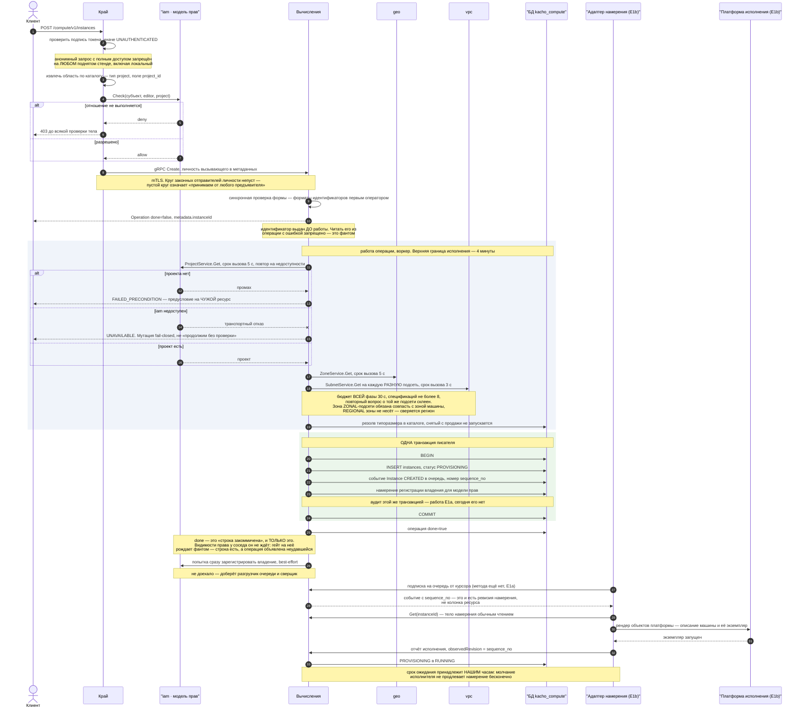
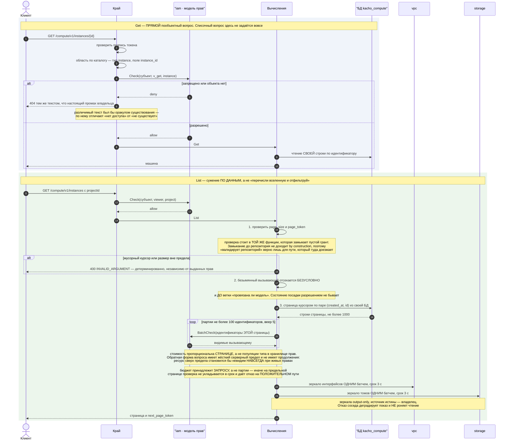
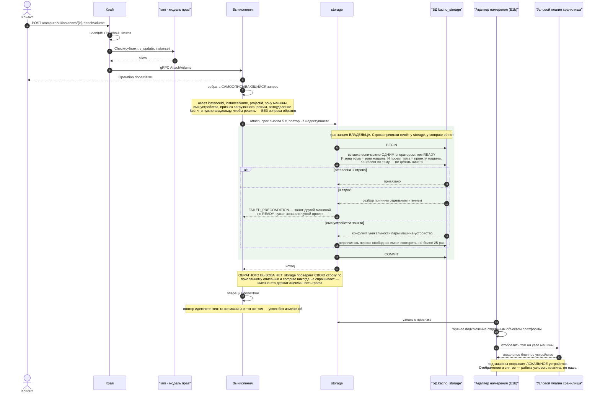
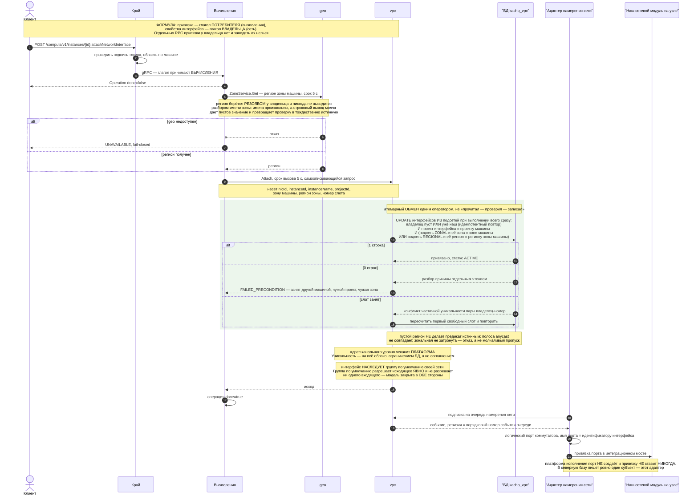
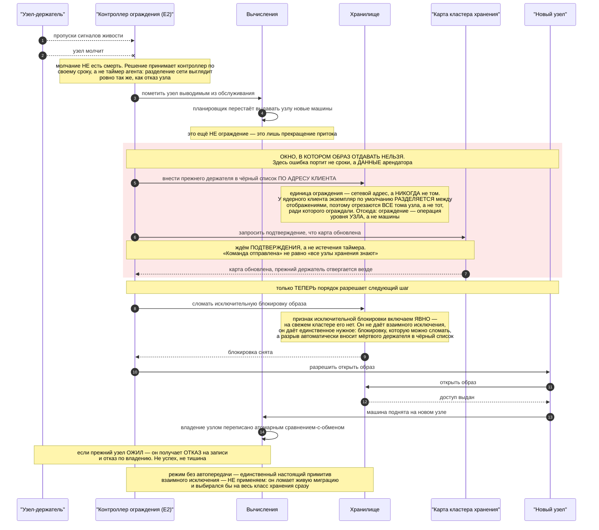
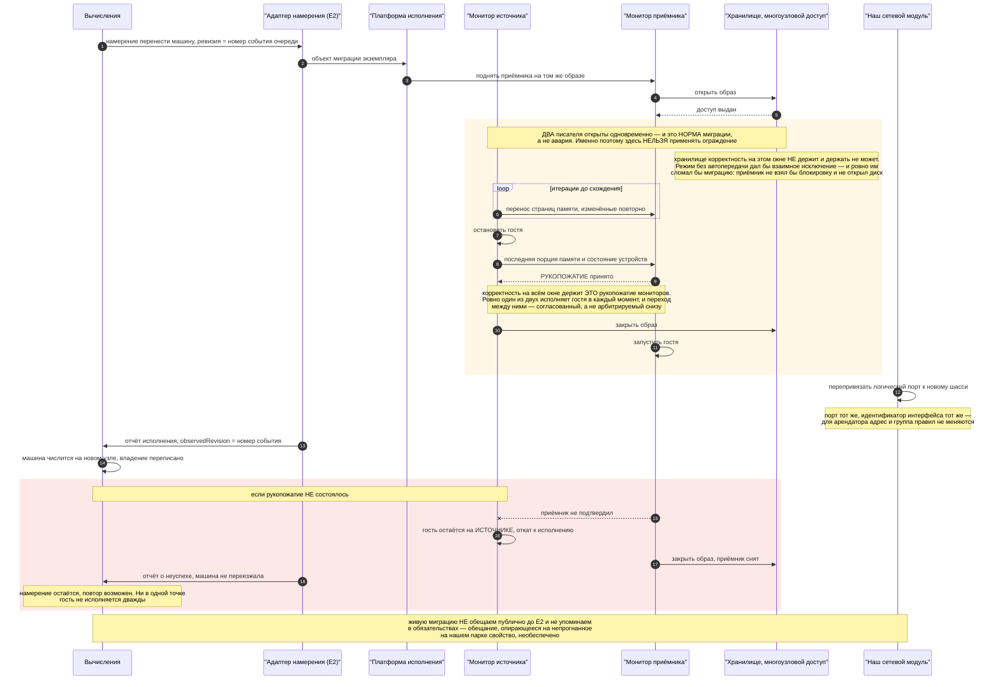
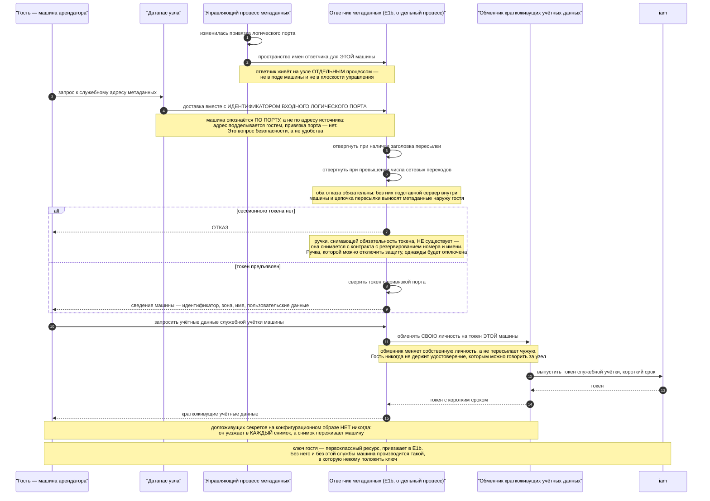
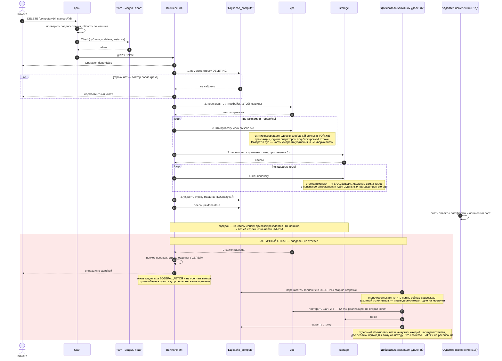

# Вычисления (compute): документ на реализацию

**Ревизия дерева:** `64ab0e65`. **Координаты** — относительно монорепо продукта (`project/kacho`).
Внешние факты сняты 2026-08-13 с веток по умолчанию.

Решения и их обоснование — `compute-production-api-plan.md` (§10 первая враждебная проверка,
§11 конкурентоспособность и финальные решения, §12 факты, проверенные первоисточником).
Плоскость данных — `compute-dataplane-architecture.md`. Список работ волнами —
`compute-module-delta.md`.

## Как читать

| § | Раздел | Кому |
|---|---|---|
| 1 | Перечень методов | интегратор, ревьюер контракта |
| 2 | Структура JSON | интегратор, автор клиента |
| 3 | Структура БД | реализатор, ревьюер миграций |
| 4 | Границы, валидации, тексты ошибок | реализатор, автор приёмки |
| 5 | Диаграммы бизнес-процессов | все |
| 6 | Пометки интеграции с плоскостью данных | реализатор адаптера, оператор |
| 7 | Синхронизация с сетью | оба домена — **читать до начала работ** |

**Целевой вид, а не описание дерева.** Всё, что помечено «есть», приземлено на указанной ревизии;
остальное вводится этим планом. Сегодня из 23 методов машины семь отвечают отказом «не
реализовано» (`handler/declared_but_absent.go:75-112`), а граф состояний замкнут — `RUNNING` и
`STOPPED` недостижимы by construction (`instance.go:366` / `:653` / `:659` / `:665`).

---

# §1. Перечень методов

Три поверхности. Публичная — арендатор через край; операторская — только внутренний слушатель
(ban #6); интеграция — путь плоскости данных.

## §1.1. Публичная поверхность арендатора (`:9090`, REST через край)

| Метод | Путь | Форма | Право | Примечание |
|---|---|---|---|---|
| `InstanceService.Get` | `GET /compute/v1/instances/{instanceId}` | синхронный | `compute.instances.get`<br/>v_get @ compute_instance(instanceId) · acr≥1 | Есть, не меняется: instance_service.proto:26-35. Форма ответа — целевой Instance §2 (7 выходных полей без писателя и hardware_generation сняты; предикат: writers-перепись по 7 именам в services/compute/internal — 0 в каждом, protoconv.go:56-105). |
| `InstanceService.List` | `GET /compute/v1/instances` | синхронный | `compute.instanceses.list`<br/>viewer @ project(projectId) · acr≥1 | Есть: instance_service.proto:38-55. Отношение — читательский ярус НА проекте, не v_list проекта (собственное обоснование в комментарии :41-48). Курсор (created_at,id); pageSize 0→50, 1..1000, вне — отказ (pkg/validate/validate.go:85-87). Токен права машинно искажён (instanceses) — исправление вместе… |
| `InstanceService.Create` | `POST /compute/v1/instances` | через операцию | `compute.instances.create`<br/>editor @ project(projectId) · acr≥1 | Есть: instance_service.proto:59-75. Обязательных шесть: projectId · zoneId · instanceKind · machineTypeId · bootSource · subnetId, причём шестое живёт ВНУТРИ networkInterfaceSpecs (instance_service.proto:1192-1197), а не на верхнем уровне. Снимаются: useDefaultNetwork (:633), assignExternalAddress (… |
| `InstanceService.Update` | `PATCH /compute/v1/instances/{instanceId}` | через операцию | `compute.instances.update`<br/>v_update @ compute_instance(instanceId) · acr≥1 | Есть: instance_service.proto:78-94. Известный набор маски теряет maintenancePolicy/maintenanceGracePeriod/networkSettings/serialPortSettings (:579-595 на Create, :700-716 на Update) вместе со снятием этих полей. guestAccessKeyIds в маску НЕ входит — смена ключей идёт своим глаголом со ступенчатой пр… |
| `InstanceService.Delete` | `DELETE /compute/v1/instances/{instanceId}` | через операцию | `compute.instances.delete`<br/>v_delete @ compute_instance(instanceId) · acr≥1 | Есть: instance_service.proto:97-110. Каскада через границу сервиса нет: том у storage, интерфейс у сети; autoDelete снимает ТОЛЬКО то, что помечено при подключении. Компенсация саги (очередь на инициаторе + подметальщик у владельца) — E2, план работ стр. 41. |
| `InstanceService.Start` | `POST /compute/v1/instances/{instanceId}:start` | через операцию | `compute.instances.start`<br/>v_update @ compute_instance(instanceId) · acr≥1 | Есть: instance_service.proto:162-176, но НЕДОСТИЖИМ сегодня: требует STOPPED (instance.go:653), а Create кладёт PROVISIONING (:366) и исходящий переход оттуда один — DELETING. Достижимым делает отчёт агента (третья поверхность): PROVISIONING→RUNNING производит он, не мы. Единственный не-тестовый выз… |
| `InstanceService.Stop` | `POST /compute/v1/instances/{instanceId}:stop` | через операцию | `compute.instances.stop`<br/>v_update @ compute_instance(instanceId) · acr≥1 | Есть: instance_service.proto:146-159; требует RUNNING (instance.go:659) — та же недостижимость до открытия графа. Отказ по несовпадению состояния — FAILED_PRECONDITION, то есть HTTP 400, а НЕ 412 (api-conventions §таблица края; 412 краем не производится ни для одного кода). |
| `InstanceService.Restart` | `POST /compute/v1/instances/{instanceId}:restart` | через операцию | `compute.instances.restart`<br/>v_update @ compute_instance(instanceId) · acr≥1 | Есть: instance_service.proto:178-192; требует RUNNING→RUNNING (instance.go:665). |
| `InstanceService.AttachVolume` | `POST /compute/v1/instances/{instanceId}:attachVolume` | через операцию | `compute.instance_volumes.attachVolume`<br/>v_update @ compute_instance(instanceId) · acr≥1 | Сегодня AttachDisk (instance_service.proto:194-212, путь :attachDisk, токен compute.instance_disks.attachDisk). Переименование принято (план §10.1 реш. 5, радиус 45 отслеживаемых файлов, семь осей). Предмет — том storage (vol-), диска у вычислений нет с раскола; выходные зеркала переезжают тем же ло… |
| `InstanceService.DetachVolume` | `POST /compute/v1/instances/{instanceId}:detachVolume` | через операцию | `compute.instance_volumes.detachVolume`<br/>v_update @ compute_instance(instanceId) · acr≥1 | Сегодня DetachDisk: instance_service.proto:213-235. Отсоединение по volumeId ЛИБО по deviceName — взаимоисключающе (oneof exactly_one, :864-873); форма сохраняется. |
| `InstanceService.AttachNetworkInterface` | `POST /compute/v1/instances/{instanceId}:attachNetworkInterface` | через операцию | `compute.instance_network_interfaces.attachNetworkInterface`<br/>v_update @ compute_instance(instanceId) · acr≥1 | НЕ снимается, и это исправление проекта: у сети глагол привязки живёт ТОЛЬКО на внутреннем слушателе (vpc/v1/internal_network_interface_service.proto:39,52), публичного пути у арендатора нет и не будет — иначе цикл. Формула, чтобы асимметрия не завелась снова: привязка — глагол потребителя, свойства… |
| `InstanceService.DetachNetworkInterface` | `POST /compute/v1/instances/{instanceId}:detachNetworkInterface` | через операцию | `compute.instance_network_interfaces.detachNetworkInterface`<br/>v_update @ compute_instance(instanceId) · acr≥1 | Есть: instance_service.proto:259-276. Снимается ТОЛЬКО привязка, сам интерфейс (ресурс сети) не удаляется. По nicId либо по номеру слота, взаимоисключающе (:937-945). |
| `InstanceService.ListOperations` | `GET /compute/v1/instances/{instanceId}/operations` | синхронный | `compute.instance_operationses.listOperations`<br/>v_list @ compute_instance(instanceId) · acr≥1 | Есть: instance_service.proto:335-344. Токен машинно искажён (operationses) — правится вместе с list. |
| `InstanceService.GetDiagnosticOutput` | `GET /compute/v1/instances/{instanceId}:diagnosticOutput` | синхронный | `compute.instance_diagnostic_outputs.getDiagnosticOutput`<br/>console @ compute_instance(instanceId) · acr≥2 | E1b, вместе с производителем. Сегодня GetSerialPortOutput (instance_service.proto:132-141) возвращает СИНТЕТИЧЕСКИЙ текст из обработчика — проба обязана краснеть на нём. Имя глагола нейтрально: одно на оба вида нагрузки, «серийный порт» — свойство одного из них. Отношение меняется с v_get на console… |
| `InstanceService.SetGuestAccessKeys` | `POST /compute/v1/instances/{instanceId}:setGuestAccessKeys` | через операцию | `compute.instance_guest_access_keys.setGuestAccessKeys`<br/>ssh @ compute_instance(instanceId) · acr≥2 | НОВЫЙ, E1b. Отдельный глагол, а не поле маски Update: смена набора ключей — изменение позиции безопасности, и у неё своя ступень. Отношение ssh объявлено в модели (fga_model.fga:518, `[user with mfa_fresh, service_account] or admin`) и производителя не имеет — тот же предикат даёт 0. На Create ключи… |
| `InstanceService.ListMaintenanceEvents` | `GET /compute/v1/instances/{instanceId}/maintenanceEvents` | синхронный | `compute.instance_maintenance_events.listMaintenanceEvents`<br/>v_get @ compute_instance(instanceId) · acr≥1 | НОВЫЙ, E1b. Требование обещания доступности: событие обслуживания обязано быть ДОСТУПНО АВТОМАТИЗАЦИИ (план §11.2). Без него арендатору нечем вывести машину из-под нагрузки заранее, и обещание 99,5 % необеспечено. Инструмент «вызвать событие» при этом уезжает оператору (см. вторую поверхность) — чит… |
| `MachineTypeService.Get` | `GET /compute/v1/machineTypes/{machineTypeId}` | синхронный | `compute.machineTypes.get`<br/>viewer @ cluster(*) · acr≥1 | Есть: machine_type_service.proto:22-31. Отношение выполнимо подстановочным кортежем — то есть означает «аутентифицирован», и это ЗАКОННО ровно потому, что каталог типоразмеров глобален и его обязан читать каждый арендатор перед запуском (паритет с каталогом geo). Целевой состав теряет ускорители: fa… |
| `MachineTypeService.List` | `GET /compute/v1/machineTypes` | синхронный | `compute.machineTypes.list`<br/>viewer @ cluster(*) · acr≥1 | Есть: machine_type_service.proto:34-43. Белый список фильтра — name/family/minGpus (:58-65); minGpus уходит вместе с ускорителями. |
| `GuestAccessKeyService.Create` | `POST /compute/v1/guestAccessKeys` | через операцию | `compute.guestAccessKeys.create`<br/>editor @ project(projectId) · acr≥1 | НОВЫЙ РЕСУРС, E1b, префикс gak-. Сегодня ключа нет: sshPublicKeys отвергается синхронно с причиной «класть некуда» (instance_service.proto:619-625) — службы метаданных и агента в госте не существует. Ресурс несёт ТОЛЬКО открытый материал; закрытой половины у нас нет никогда. Заводит работу у соседей… |
| `GuestAccessKeyService.Get` | `GET /compute/v1/guestAccessKeys/{guestAccessKeyId}` | синхронный | `compute.guestAccessKeys.get`<br/>v_get @ compute_guest_access_key(guestAccessKeyId) · acr≥1 | НОВЫЙ, E1b. Скрытие существования обязано быть байт-идентично настоящему промаху владельца — строка типа в карте края заводится ВМЕСТЕ с ресурсом, иначе непокрытый тип отвечает своей, отличимой формой и становится оракулом существования. |
| `GuestAccessKeyService.List` | `GET /compute/v1/guestAccessKeys` | синхронный | `compute.guestAccessKeys.list`<br/>viewer @ project(projectId) · acr≥1 | НОВЫЙ, E1b. Проверка формата pageToken/pageSize стоит в ТОЙ ЖЕ функции, которая замыкается на пустом гранте, — иначе мусорный курсор при нулевых правах даёт 200 с пустой страницей вместо 400. Держит это обходчик дерева internal/repohygiene TestEmptyPageNeverPrecedesPaginationValidation, а не пообъек… |
| `GuestAccessKeyService.Update` | `PATCH /compute/v1/guestAccessKeys/{guestAccessKeyId}` | через операцию | `compute.guestAccessKeys.update`<br/>v_update @ compute_guest_access_key(guestAccessKeyId) · acr≥1 | НОВЫЙ, E1b. Изменяемы name/description/labels. Материал ключа, алгоритм и гостевая учётка — НЕИЗМЕНЯЕМЫ после создания: подмена материала под тем же id молча сменила бы того, кто входит в машину, при неизменной привязке. Отказ конвенционным тоном «<поле> is immutable after GuestAccessKey.Create», пр… |
| `GuestAccessKeyService.Delete` | `DELETE /compute/v1/guestAccessKeys/{guestAccessKeyId}` | через операцию | `compute.guestAccessKeys.delete`<br/>v_delete @ compute_guest_access_key(guestAccessKeyId) · acr≥1 | НОВЫЙ, E1b. Удаление ключа, привязанного к живой машине, отвергается с ПЕРЕЧИСЛЕНИЕМ машин — арендатор видит радиус до, а не после (та же форма, что у отказа на непустой сети у соседа). Иначе снятие доступа выглядит исполненным, пока ответчик метаданных ещё отдаёт ключ. |

## §1.2. Операторская поверхность (`:9091`, только внутренний слушатель)

| Метод | Путь | Форма | Право | Примечание |
|---|---|---|---|---|
| `InternalMachineTypeService.Create` | `POST /compute/v1/internal/machineTypes` | через операцию | `compute.machineTypes.create`<br/>system_admin @ cluster(*) · acr≥1 | Есть: internal_machine_type_service.proto:28-41. На внешний слушатель не выходит никогда (ban #6); в публичном списке проксирования его нет — предикат: 25 ключей compute в gateway/internal/allowlist/list.go, из них 23 InstanceService и 2 MachineTypeService, ни одного Internal*. |
| `InternalMachineTypeService.Update` | `PATCH /compute/v1/internal/machineTypes/{machineTypeId}` | через операцию | `compute.machineTypes.update`<br/>system_admin @ cluster(*) · acr≥1 | Есть: internal_machine_type_service.proto:42-55. name неизменяем после создания (:98-99). |
| `InternalMachineTypeService.Delete` | `DELETE /compute/v1/internal/machineTypes/{machineTypeId}` | через операцию | `compute.machineTypes.delete`<br/>system_admin @ cluster(*) · acr≥1 | Есть: internal_machine_type_service.proto:56-69. |
| `InternalInstanceService.Get` | `GET /compute/v1/internal/instances/{instanceId}` | синхронный | `compute.internal_instances.get`<br/>system_viewer @ cluster(*) · acr≥1 | НОВЫЙ, E1b. Инфра-проекция машины — узел размещения, идентификатор домена у исполнителя, раскладка по ядрам и памяти, состояние миграции, поколение оборудования, топология шин, инвентарь ускорителей, ёмкость и переподписка узла, окно обслуживания узла, ограждение, НАБЛЮДАЕМОЕ состояние и узел-владел… |
| `InternalInstanceService.List` | `GET /compute/v1/internal/instances` | синхронный | `compute.internal_instances.list`<br/>system_viewer @ cluster(*) · acr≥1 | НОВЫЙ, E1b. Сужение по узлу и по состоянию — то, ради чего оператор сюда приходит. Край внутреннего мультиплексора печатает только заполненное (EmitUnpopulated=false, restmux/strict_enum.go:75-85), в отличие от публичного. |
| `InternalNodeService.Create` | `POST /compute/v1/internal/nodes` | через операцию | `compute.internal_nodes.create`<br/>system_admin @ cluster(*) · acr≥1 | НОВЫЙ РЕСУРС, E1b, префикс nod-. Инвентарь узлов приезжает НОВОЙ миграцией — 0006_drop_hypervisors.sql не трогаем (ban #5). Узел — не арендаторский ресурс: публичной проекции нет ни у одного его поля. Заводит работу у соседей: nod в pkg/ids/ids.go:323-347 и тип compute_node в модели прав. |
| `InternalNodeService.Update` | `PATCH /compute/v1/internal/nodes/{nodeId}` | через операцию | `compute.internal_nodes.update`<br/>system_admin @ cluster(*) · acr≥1 | НОВЫЙ, E1b. Оператор правит объявленную ёмкость и признак приёма нагрузки. Уменьшать объявленную ёмкость вправе и узел (см. ReportNodeCapacity), увеличивать — только оператор: авторитет наблюдаемого односторонний. |
| `InternalNodeService.Delete` | `DELETE /compute/v1/internal/nodes/{nodeId}` | через операцию | `compute.internal_nodes.delete`<br/>system_admin @ cluster(*) · acr≥1 | НОВЫЙ, E1b. Удаление узла с непустым набором машин отвергается перечислением машин. |
| `InternalNodeService.Get` | `GET /compute/v1/internal/nodes/{nodeId}` | синхронный | `compute.internal_nodes.get`<br/>system_viewer @ cluster(*) · acr≥1 | НОВЫЙ, E1b. |
| `InternalNodeService.List` | `GET /compute/v1/internal/nodes` | синхронный | `compute.internal_nodes.list`<br/>system_viewer @ cluster(*) · acr≥1 | НОВЫЙ, E1b. |
| `InternalMaintenanceService.SimulateMaintenanceEvent` | `POST /compute/v1/internal/instances/{instanceId}:simulateMaintenanceEvent` | через операцию | `compute.instance_maintenance_events.simulateMaintenanceEvent`<br/>system_admin @ cluster(*) · acr≥1 | ПЕРЕЕЗЖАЕТ с публичной поверхности: сегодня instance_service.proto:369-388, v_update @ compute_instance, и он выставлен арендатору. Вызвать событие обслуживания — инструмент оператора; арендатору полагается его ЧИТАТЬ (см. ListMaintenanceEvents). Разделение обязано быть сделано в одном изменении: пе… |
| `InternalFencingService.FenceNode` | `POST /compute/v1/internal/nodes/{nodeId}:fence` | через операцию | `compute.internal_nodes.fence`<br/>system_admin @ cluster(*) · acr≥2 | E2, назван здесь ради полноты поверхности. Ограждение — операция уровня УЗЛА, не машины: единица ограждения у хранилища — сетевой адрес клиента, а у ядерного клиента экземпляр по умолчанию разделяется между отображениями, поэтому чёрный список отрезает ВСЕ тома узла. Порядок из трёх шагов нормативен… |

## §1.3. Интеграция с плоскостью данных

| Метод | Путь | Форма | Право | Примечание |
|---|---|---|---|---|
| `InternalWatchService.Watch` | `только адаптер намерения` | поток (подписка) | `compute.instances.watch`<br/>scope_filtered = true · acr≥1 | ЕСТЬ и остаётся каналом доставки намерения: internal_watch_service.proto:20-28, чтение compute_outbox по sequence_no с возобновлением (:31-37). Новый метод доставки заводить НЕ надо — надо сузить этот. Две правки: (1) состав события — сегодня payload несёт ПОЛНОЕ состояние доменного объекта структур… |
| `InternalNodeOwnershipService.ClaimInstance` | `только узловой агент` | синхронный (осознанное исключение из «мутации через операцию») | `compute.internal_nodes.claim`<br/>v_claim @ compute_node(nodeId) · acr≥1 | НОВЫЙ, E1b. Durable-владение узлом атомарным сравнением-с-обменом: агент, не владеющий записью, получает ОТКАЗ, а не успех. Закрывает все четыре пути к двум писателям — ручное восстановление, повтор после разделения сети, перезапуск агента, повторная операция; довод «нет автопереноса ⇒ нет двух писа… |
| `InternalNodeOwnershipService.ReleaseInstance` | `только узловой агент` | синхронный (то же исключение) | `compute.internal_nodes.claim`<br/>v_claim @ compute_node(nodeId) · acr≥1 | НОВЫЙ, E1b. Идемпотентно: освобождение уже освобождённого — успех, не ошибка. Освобождение чужой записи — отказ, а не тишина. |
| `InternalRealizationService.ReportInstanceRealization` | `только узловой агент` | синхронный (то же исключение) | `compute.internal_instances.report`<br/>v_report @ compute_node(nodeId) · acr≥1 | НОВЫЙ, E1b — тот самый входящий метод под ВЫДЕЛЕННЫМ отношением-писателем, и он же открывает граф: PROVISIONING→RUNNING производит отчёт агента. Ревизия намерения — ПОРЯДКОВЫЙ НОМЕР СОБЫТИЯ ОЧЕРЕДИ (sequence_no того же compute_outbox, internal_watch_service.proto:37,43), не колонка ресурса и не сист… |
| `InternalNodeService.ReportNodeCapacity` | `только узловой агент` | синхронный (то же исключение) | `compute.internal_nodes.report`<br/>v_report @ compute_node(nodeId) · acr≥1 | НОВЫЙ, E1b. Узел вправе только УМЕНЬШАТЬ заявленную ёмкость — попытка увеличить отвергается, а не применяется молча. Плотность считать по измеренному, а не по расчётному: служебные процессы на машину дают порядка 220 МиБ и не амортизируются. |
| `InternalGuestTokenService.IssueGuestToken` | `обменник рядом с ответчиком метаданных` | синхронный (то же исключение) | `compute.internal_instances.issueGuestToken`<br/>v_issue_guest_token @ compute_node(nodeId) · acr≥1 | НОВЫЙ, E1b. Обменник меняет СВОЮ личность на краткоживущий токен КОНКРЕТНОЙ машины. Долгоживущих секретов на конфигурационном образе нет никогда — он уезжает в каждый снимок. Это не олицетворение: токен узок по предмету и по сроку. |
| `Ответчик метаданных: PUT /guest/v1/session-token` | `гостевая поверхность, НЕ gRPC и НЕ на :9090/:9091` | синхронный | `нет записи каталога прав: вызывающий — гость, не принципал платформы; личность даёт привязка порта`<br/>— | НОВЫЙ, E1b. Машина опознаётся по ВХОДНОМУ ЛОГИЧЕСКОМУ ПОРТУ, а не по адресу источника: адрес подделываем гостем, привязка порта — нет. Ответчик — отдельный процесс на узле, не в поде машины и не в плоскости управления. |
| `Ответчик метаданных: GET /guest/v1/metadata/{path}` | `гостевая поверхность, НЕ gRPC и НЕ на :9090/:9091` | синхронный | `сессионный токен ОБЯЗАТЕЛЕН by construction; отказ на заголовке пересылки; ограничение числа сетевых переходов`<br/>— | НОВЫЙ, E1b. Отдаёт действующий набор ключей гостя и user_data — здесь user_data впервые получает читателя. Ручки, снимающей обязательность токена, НЕ СУЩЕСТВУЕТ: metadata_token_required (instance.proto:514) снимается с резервированием номера и имени, а не получает новое умолчание — ручку, которой мо… |

---

# §2. Структура JSON

Форма REST — camelCase (конвенция продукта). Мутации возвращают операцию; чтения синхронны.
Показаны **целевые** поля: снятое §1 плана работ здесь отсутствует.


## Создать машину — запрос (шесть обязательных полей) и ответ (операция, done=false)

**Запрос**

```json
{
  "call": "POST /compute/v1/instances",
  "headers": {
    "Idempotency-Key": "b7c1f0a2-4e83-4a1d-9b6e-2f5d8c3a1e77"
  },
  "body": {
    "projectId": "prj-2k9m4x7bn3vz8qwr1",
    "zoneId": "ru-central1-a",
    "instanceKind": "VM",
    "machineTypeId": "mt-6h2k9m4bx7vz3qwr8",
    "bootSource": {
      "storageImage": {
        "imageId": "img-4h8n2p6rt9wk3mxz7",
        "digest": "sha256:5f8e2c1d94ab7360f2e5c8d1a6b3947e0c5d2f81a49b7e63c0d5a8f217b4e9c36"
      }
    },
    "networkInterfaceSpecs": [
      {
        "subnetId": "sub-4h8n2p6rt9wk3mxz7"
      }
    ],
    "name": "app-a-01",
    "labels": {
      "env": "prod",
      "tier": "app"
    },
    "guestAccessKeyIds": [
      "gak-2m9k4x7bn3vz8qwr1"
    ],
    "vmSpec": {
      "userData": "#cloud-config\npackage_update: true\n"
    }
  }
}
```

**Ответ**

```json
{
  "id": "epd7f3k2m9qx8vb4nzc1",
  "description": "Create instance",
  "createdAt": "2026-08-13T09:14:03Z",
  "createdBy": "usr-8m3k2x9bn7vz4qwr6",
  "modifiedAt": "2026-08-13T09:14:03Z",
  "done": false,
  "metadata": {
    "@type": "type.googleapis.com/kacho.cloud.compute.v1.CreateInstanceMetadata",
    "instanceId": "ins-5k9m2x7bn4vz8qwr1"
  },
  "principalType": "USER",
  "principalId": "usr-8m3k2x9bn7vz4qwr6",
  "principalDisplayName": "platform-operator"
}
```


## Что в этом запросе НЕ стоит и почему — шесть обязательных, седьмого нет (пояснение к примеру выше)

**Запрос**

```json
{
  "шесть обязательных": {
    "projectId": "верхний уровень",
    "zoneId": "верхний уровень",
    "instanceKind": "верхний уровень, сильный первый дискриминатор, неизменяем",
    "machineTypeId": "верхний уровень, единственный канал размера",
    "bootSource": "верхний уровень, единственный вход ОС",
    "subnetId": "ВНУТРИ networkInterfaceSpecs — instance_service.proto:1192-1197; на верхнем уровне обязательных пять, шестое здесь"
  },
  "снято и в запросе не появляется": {
    "useDefaultNetwork": "instance_service.proto:633 — у умолчания нет производителя: подсети по умолчанию в сети не существует",
    "assignExternalAddress": "instance_service.proto:637 — выделения адреса ноль, поле не персистится и не эхается",
    "acknowledgeUnreachable": "instance_service.proto:641 — снимается В ПАРЕ с полем выше и с самим стражем (instance.go:309-313); половинчатое снятие запрещено"
  },
  "остаётся объявленным, но отвергается по имени": {
    "sshPublicKeys": "instance_service.proto:619-625 — снятие превратило бы названный отказ в молчаливый 200: край выбрасывает неизвестные ключи тела (restmux/strict_enum.go:70). Ключи задаются через guestAccessKeyIds",
    "networkInterfaceSpecs.primaryV4AddressSpec / .primaryV6AddressSpec / .index / .nicId": "instance_service.proto:1199-1216 — читаются ровно два поля спецификации, остальные четыре отвергаются по имени"
  },
  "опущено намеренно": {
    "securityGroupIds": "не задано ⇒ интерфейс НАСЛЕДУЕТ группу по умолчанию своей сети. Группа по умолчанию несёт явное разрешение исходящего и НИ ОДНОГО входящего — то есть машина без явных правил недоступна снаружи, и это ожидаемое поведение, а не дефект. Пустой массив НЕ равен опущенному полю: он отвергается на обоих путях, создании и правке",
    "macAddress": "на входе его нет вовсе: адрес канального уровня чеканит платформа, уникальность держится на всё облако, арендатору обещана неизменяемость на всю жизнь интерфейса"
  }
}
```

**Ответ**

```json
{
  "почему ответ — операция, а не ресурс": "мутация возвращает Operation с done=false; клиент опрашивает OperationService.Get(id) до done=true. done означает «предмет мутации закоммичен» и ТОЛЬКО это — видимости побочных эффектов у соседей он не ждёт",
  "порядок для интегратора и для фикстуры": "дождаться done → ПРОВЕРИТЬ отсутствие error → и только потом брать instanceId. Идентификатор в metadata выдаётся при заведении операции, поэтому он присутствует и на done=true С ОШИБКОЙ; обратный порядок даёт фантомную машину, которая выглядит как задержка материализации",
  "формат идентификатора операции": "epd + 17 знаков — слитная форма (pkg/ids/ids.go:119, PrefixOperationCompute = PrefixInstance); по ней край маршрутизирует Operation.Get в вычисления. У самой машины форма другая, с дефисом: ins- (pkg/ids/ids.go:302)",
  "повтор с тем же Idempotency-Key": "даёт ТУ ЖЕ операцию, а не вторую машину. Канал — общий заголовок края (gateway/internal/middleware/idempotency.go:252), поля в контракте вычислений не заводится. Два ограничения механизма названы как заявка в платформу: память одного экземпляра и только один транспорт",
  "сокращение примеров": "публичный край печатает и пустые поля (EmitUnpopulated=true, restmux/strict_enum.go:63-73). В примерах пустые опущены ради читаемости — это сокращение примера, а не форма ответа"
}
```


## Прочитать машину — полный ответ целевого вида: зеркала тома и интерфейса, статус и его причина

**Запрос**

```json
{
  "call": "GET /compute/v1/instances/ins-5k9m2x7bn4vz8qwr1"
}
```

**Ответ**

```json
{
  "id": "ins-5k9m2x7bn4vz8qwr1",
  "projectId": "prj-2k9m4x7bn3vz8qwr1",
  "createdAt": "2026-08-13T09:14:03Z",
  "name": "app-a-01",
  "description": "Узел приложения",
  "labels": {
    "env": "prod",
    "tier": "app"
  },
  "zoneId": "ru-central1-a",
  "status": "RUNNING",
  "statusReason": "machineTypeId change takes effect on next boot",
  "fqdn": "app-a-01.ru-central1-a.internal",
  "instanceKind": "VM",
  "machineTypeId": "mt-6h2k9m4bx7vz3qwr8",
  "effectiveResources": {
    "vCpu": 4,
    "memoryMib": "8192"
  },
  "cpuGuaranteePercent": 100,
  "bootSource": {
    "imageKind": "STORAGE_IMAGE",
    "storageImage": {
      "imageId": "img-4h8n2p6rt9wk3mxz7",
      "digest": "sha256:5f8e2c1d94ab7360f2e5c8d1a6b3947e0c5d2f81a49b7e63c0d5a8f217b4e9c36"
    },
    "displayName": "ubuntu-24-04-lts",
    "materializedVolume": {
      "volumeId": "vol-9m4k2x8bn3vz7qwr1",
      "sizeBytes": "21474836480",
      "sizeGib": "20",
      "volumeTypeId": "vt-3n7k9m2bx5vz8qwr4"
    }
  },
  "serviceAccount": {
    "type": "iam.service_account",
    "id": "sva-7m3k9x2bn8vz4qwr6",
    "name": "app-runner"
  },
  "guestAccessKeyIds": [
    "gak-2m9k4x7bn3vz8qwr1"
  ],
  "placementGroupId": "",
  "maintenancePromise": "RESTART_ALLOWED",
  "bootVolume": {
    "mode": "READ_WRITE",
    "deviceName": "boot",
    "autoDelete": true,
    "volumeId": "vol-9m4k2x8bn3vz7qwr1"
  },
  "secondaryVolumes": [
    {
      "mode": "READ_WRITE",
      "deviceName": "data0",
      "autoDelete": false,
      "volumeId": "vol-5k8m2x9bn7vz3qwr6"
    }
  ],
  "networkInterfaces": [
    {
      "index": "0",
      "macAddress": "0a:5c:11:3e:9d:42",
      "subnetId": "sub-4h8n2p6rt9wk3mxz7",
      "primaryV4Address": {
        "address": "10.0.1.42",
        "oneToOneNat": {
          "address": "203.0.113.17",
          "ipVersion": "IPV4"
        }
      },
      "securityGroupIds": [
        "sgr-5m8k2x9bn4vz7qwr3"
      ],
      "nicId": "nic-7m3k9x2bn8vz4qwr6"
    }
  ],
  "vmSpec": {
    "userData": "#cloud-config\npackage_update: true\n",
    "metadataOptions": {
      "metadataEndpoint": "ENABLED"
    }
  },
  "metadata": {}
}
```


## Что в этом ответе изменилось против дерева — и одно поле, которое живёт по истекающему основанию (пояснение к примеру выше)

**Запрос**

```json
{
  "снято с публичной проекции — семь выходных полей без единого писателя": {
    "координата": "protoconv/protoconv.go:56-105 — конвертер domain→контракт; предикат: перепись писателей по семи именам в services/compute/internal без тестов даёт 0 у КАЖДОГО",
    "имена": ["filesystems", "localDisks", "networkSettings", "serialPortSettings", "maintenancePolicy", "maintenanceGracePeriod", "hardwareGeneration"],
    "почему это хуже обычного мусора": "вход по ним уже отвергается — то есть контракт говорил «не приму» и одновременно «отдам», а отдавал пустоту"
  },
  "снято дополнительно": {
    "hardwareGeneration": "instance.proto:11,129 — несёт топологию шин; это инфра-чувствительные данные, им место только на внутреннем слушателе",
    "localDisks → PhysicalLocalDisk → KMSKey": "instance.proto:118,343-346 — цепочка снимается целиком; deviceName документирован как серийный номер устройства в госте",
    "CRASHED = 9": "instance.proto:76-77 — состояние обещает автоматический перезапуск, которого не делает никто; производителей ноль",
    "gpus / gpuType / family = GPU": "machine_type.proto:32,87,90 — уходят из effectiveResources вместе с ускорителями"
  },
  "переименовано": {
    "bootDisk → bootVolume, secondaryDisks → secondaryVolumes": "instance.proto:114-115. Предмет — том storage, диска у вычислений нет с раскола; зеркала переезжают тем же ломающим окном, что и глагол AttachDisk→AttachVolume, иначе глагол и его результат называют разные вещи"
  },
  "новое": {
    "guestAccessKeyIds": "ссылки по неизменяемому id на ресурс ключа гостя (E1b)",
    "maintenancePromise": "заменяет словарь СПОСОБОВ словарём ОБЕЩАНИЙ. Сегодня maintenance.proto:11-15 несёт RESTART и MIGRATE — оба называют способ, а не обещание, поэтому смена исполнителя ломала бы автоматизацию арендатора. Значений два: RESTART_ALLOWED (допускается перезапуск) и WORK_PRESERVED (работа сохраняется). В E1b значение постоянно — RESTART_ALLOWED; живой миграции нет и она не обещается. Форма пишется целевой сразу ровно затем, чтобы в E2 сменилось УМОЛЧАНИЕ, а не контракт"
  },
  "выведено сервером, на входе отвергается": {
    "bootSource.imageKind": "вид выводится из того, какая ветвь заполнена; клиентское значение отвергается синхронно. Иначе одно и то же выразимо двумя способами, и они разойдутся"
  }
}
```

**Ответ**

```json
{
  "metadata: {} — поле, которое живёт по ИСТЕКАЮЩЕМУ основанию": {
    "что с ним": "метод UpdateMetadata снимается целиком (instance_service.proto:113-129); свободная карта metadata остаётся объявленной и ОТВЕРГАЕТСЯ на входе",
    "почему не снимаем сразу": "край выбрасывает неизвестные ключи тела (DiscardUnknown, restmux/strict_enum.go:70) — снятие превратило бы названный отказ в молчаливый 200",
    "чем это неприятно и признано таковым": "вход отвергается всегда ⇒ на выходе поле всегда {} ⇒ оно того же класса, что семь снятых выше. Разница ровно одна: у тех не было причины оставаться, у этого причина есть и она ВНЕШНЯЯ",
    "предикат снятия": "край начал отвергать неизвестные ключи тела — поле снимается с резервированием номера и имени. Предикат внешний и проверяемый, поэтому исключение истекает само, а не по чьей-то памяти",
    "бюджет размера": "0025_instance_metadata_budget.sql переезжает на замену, а не теряется"
  },
  "placementGroupId: пустая строка": {
    "что это": "непрозрачный слаг, проходной в E1a/E1b: ресурса группы размещения и таблицы под неё нет (instance.proto:154-155)",
    "когда станет ресурсом": "E2 — первоклассный ресурс с якорем размещения (зональный либо региональный, взаимоисключающе, закреплено проверкой БД), когерентность ВНУТРИ атомарного обмена привязки, скрытие существования строкой типа в карте края"
  },
  "старшинство статуса": {
    "публично": "одно ПРОИЗВОДНОЕ status + statusReason (instance.proto:159). Двух колонок на публичной проекции не заводим — это был бы второй источник истины",
    "наблюдаемое": "только на внутреннем слушателе, пишет узловой агент. При расхождении намерения и наблюдаемого верх берёт наблюдаемое, и это записано, а не подразумевается",
    "statusReason в примере": "класс отложенной правки: размер меняется только на остановленной машине, поэтому смена на работающей помечается как вступающая в силу при следующем запуске (instance.go:529, repo/instance_repo.go:196-198)"
  }
}
```


## Список машин — ответ с курсором (элементы сокращены до опорных полей; на проводе каждый несёт полную форму из примера «прочитать машину»)

**Запрос**

```json
{
  "call": "GET /compute/v1/instances?projectId=prj-2k9m4x7bn3vz8qwr1&pageSize=2"
}
```

**Ответ**

```json
{
  "instances": [
    {
      "id": "ins-5k9m2x7bn4vz8qwr1",
      "projectId": "prj-2k9m4x7bn3vz8qwr1",
      "createdAt": "2026-08-13T09:14:03Z",
      "name": "app-a-01",
      "zoneId": "ru-central1-a",
      "status": "RUNNING",
      "statusReason": "",
      "instanceKind": "VM",
      "machineTypeId": "mt-6h2k9m4bx7vz3qwr8",
      "effectiveResources": {
        "vCpu": 4,
        "memoryMib": "8192"
      }
    },
    {
      "id": "ins-8m3k2x9bn7vz4qwr6",
      "projectId": "prj-2k9m4x7bn3vz8qwr1",
      "createdAt": "2026-08-13T09:14:07Z",
      "name": "app-a-02",
      "zoneId": "ru-central1-b",
      "status": "PROVISIONING",
      "statusReason": "awaiting node agent report",
      "instanceKind": "VM",
      "machineTypeId": "mt-6h2k9m4bx7vz3qwr8",
      "effectiveResources": {
        "vCpu": 4,
        "memoryMib": "8192"
      }
    }
  ],
  "nextPageToken": "eyJjcmVhdGVkX2F0IjoiMjAyNi0wOC0xM1QwOToxNDowN1oiLCJpZCI6Imlucy04bTNrMng5Ym43dno0cXdyNiJ9"
}
```


## Правила страницы и то, чего курсор НЕ обещает (пояснение к списку выше)

**Запрос**

```json
{
  "порядок": "(createdAt, id) по возрастанию — он же содержимое курсора",
  "pageSize": "не задан → 50; допустимо 1..1000; вне диапазона — ОТКАЗ, а не усечение (pkg/validate/validate.go:85-87)",
  "pageToken": "непрозрачная строка. В примере это base64 от {created_at,id} — показан раскрываемым только чтобы пример был проверяем; клиент не вправе его разбирать и не вправе конструировать",
  "почему нет order_by": "поле было и снято: instance_service.proto:497-508. Оно принималось, проверялось по длине и НЕ ЧИТАЛОСЬ ничем, а объявленное умолчание не описывало и тот порядок, который выдавал запрос. Честнее прочего в этой истории то, что исполнить его как объявлено было нельзя: страница идёт курсором по (created_at,id), поэтому выбранный вызывающим порядок оставляет курсор описывающим позицию в порядке, которого больше нет",
  "фильтр": "белый список. Сегодняшний комментарий (:484-491) перечисляет platform_id и host_id — оба сняты с ресурса, оба неприменимы; строка правится вместе со снятиями"
}
```

**Ответ**

```json
{
  "порядок проверок в списке — не косметика": {
    "правило": "формат pageToken и pageSize проверяется ДО замыкания на пустом гранте",
    "иначе": "вызывающий без выданных прав получает 200 с пустой страницей на мусорный курсор вместо 400 — то есть ответ на один и тот же некорректный ввод зависит от того, что этому вызывающему выдано",
    "где именно": "проверка обязана стоять в ТОЙ ЖЕ функции, которая замыкается: «валидирует репозиторий» верно ровно для того пути, который до репозитория доходит, а замыкание до него не доходит by construction",
    "чем держится": "обходчик дерева internal/repohygiene TestEmptyPageNeverPrecedesPaginationValidation (listpaginationorder_test.go:94) — он требует свойство от кода, которого ещё нет. Пообъектных проб TestListPaginationFormatCheckedBeforeIdentityShortCircuit у вычислений сегодня 0 (у сети 7, у домена доступа 6) — поэтому свойство держит гейт, а не перечень проб",
    "чего проба на саму функцию проверки НЕ доказывает": "ничего о порядке: она зовёт проверку без вызывающего и без замыкания и остаётся зелёной при любом"
  },
  "известный размен, который документируется, а не скрывается": "nextPageToken может кодировать строку, недоступную вызывающему (идентификатор и время; содержимое всё равно закрыто) — это цена курсорной семантики, при которой ни одна строка не пропускается",
  "фильтрация — «страница → проверка страницы»": "список читает страницу курсором из своей БД и спрашивает права на идентификаторы ЭТОЙ страницы партиями. Обратный порядок («перечисли разрешённое → отфильтруй») упирается в жёсткий серверный предел без продолжения, и ресурсы сверх предела становятся владельцу невидимы навсегда при живых правах"
}
```


## Привязать том — запрос и ответ

**Запрос**

```json
{
  "call": "POST /compute/v1/instances/ins-5k9m2x7bn4vz8qwr1:attachVolume",
  "body": {
    "attachedVolumeSpec": {
      "volumeId": "vol-5k8m2x9bn7vz3qwr6",
      "mode": "READ_WRITE",
      "deviceName": "data0",
      "autoDelete": false
    }
  }
}
```

**Ответ**

```json
{
  "id": "epd4h8n2p6rt9wk3mxz7",
  "description": "Attach volume to instance",
  "createdAt": "2026-08-13T09:20:11Z",
  "createdBy": "usr-8m3k2x9bn7vz4qwr6",
  "modifiedAt": "2026-08-13T09:20:11Z",
  "done": false,
  "metadata": {
    "@type": "type.googleapis.com/kacho.cloud.compute.v1.AttachInstanceVolumeMetadata",
    "instanceId": "ins-5k9m2x7bn4vz8qwr1",
    "volumeId": "vol-5k8m2x9bn7vz3qwr6"
  },
  "principalType": "USER",
  "principalId": "usr-8m3k2x9bn7vz4qwr6",
  "principalDisplayName": "platform-operator"
}
```


## Кто владеет привязкой тома и почему вычисления не пишут строку у себя (пояснение к примеру выше)

**Запрос**

```json
{
  "инициатор": "вычисления; полезная нагрузка самоописывающаяся — несёт идентификатор машины, её зону, проект и имя",
  "владелец привязки": "хранение: таблица привязок живёт у него, и оно же валидирует СВОЮ строку одним атомарным вставочным сравнением-с-обменом",
  "почему так, а не зеркалом у нас": "иначе владельцев типа становится два. Хранение НИКОГДА не зовёт вычисления обратно — ацикличность держится по построению; на машине остаётся read-only зеркало с мягкой деградацией при повисшей ссылке",
  "что уже есть в дереве": "instance.go:701-716 — синхронная фаза (проверка формы идентификаторов первым стейтментом), затем асинхронный исполнитель: локальный шлюз состояния (RUNNING либо STOPPED) → вызов хранения, отказоустойчиво закрытый на недоступности, идемпотентный повтор, когерентность зоны и проекта на стороне владельца",
  "переименование": "глагол и его метаданные едут вместе: AttachInstanceDiskMetadata → AttachInstanceVolumeMetadata (instance_service.proto:848-854), путь :attachDisk → :attachVolume, токен права compute.instance_disks.attachDisk → compute.instance_volumes.attachVolume"
}
```

**Ответ**

```json
{
  "когерентность размещения — обязательна и проверяется у владельца": "машина и том обязаны быть в одной зоне; текст отказа — часть контракта: «<A> is in zone %s, <B> zone is %s» → FAILED_PRECONDITION, то есть HTTP 400",
  "почему это не проверка «прочитал → сравнил» у нас": "внутрисервисный инвариант выражается конструкцией БД внутри самого обмена, а не программной проверкой до записи: две параллельные привязки прошли бы мягкий шлюз и обе сделали безусловную запись",
  "проба, без которой не принимается": "integration на контейнерах с КОНКУРЕНТНЫМИ горутинами на спорный путь: ровно одна транзакция проходит, остальные получают ожидаемый признак. Гонка не ловится модульным тестом",
  "смена токена права": "строка права живёт ЗНАЧЕНИЕМ в посеве домена доступа — если на старый токен есть выданные привязки, нужна миграция селекторов ролей. Это работа, а не побочный эффект переименования"
}
```


## Привязать интерфейс — запрос и ответ

**Запрос**

```json
{
  "call": "POST /compute/v1/instances/ins-5k9m2x7bn4vz8qwr1:attachNetworkInterface",
  "body": {
    "attachedNicSpec": {
      "nicId": "nic-7m3k9x2bn8vz4qwr6",
      "index": 1
    }
  }
}
```

**Ответ**

```json
{
  "id": "epd9m4k2x8bn3vz7qwr1",
  "description": "Attach network interface to instance",
  "createdAt": "2026-08-13T09:22:40Z",
  "createdBy": "usr-8m3k2x9bn7vz4qwr6",
  "modifiedAt": "2026-08-13T09:22:40Z",
  "done": false,
  "metadata": {
    "@type": "type.googleapis.com/kacho.cloud.compute.v1.AttachInstanceNetworkInterfaceMetadata",
    "instanceId": "ins-5k9m2x7bn4vz8qwr1",
    "nicId": "nic-7m3k9x2bn8vz4qwr6"
  },
  "principalType": "USER",
  "principalId": "usr-8m3k2x9bn7vz4qwr6",
  "principalDisplayName": "platform-operator"
}
```


## Почему этот метод остаётся публичным, хотя семь соседних снимаются (пояснение к примеру выше)

**Запрос**

```json
{
  "формула": "привязка — глагол ПОТРЕБИТЕЛЯ, свойства — глагол ВЛАДЕЛЬЦА",
  "почему снятие уничтожило бы возможность, а не передало её": "у сети глагол привязки живёт ТОЛЬКО на внутреннем слушателе (vpc/v1/internal_network_interface_service.proto:39,52). Публичного пути у арендатора нет и не будет — иначе цикл между доменами. Снять здесь значило бы не «пользуйтесь путём владельца», а «пути нет ни у кого»",
  "чем это отличается от семи снимаемых": "у AddOneToOneNat, RemoveOneToOneNat и UpdateNetworkInterface путь у владельца ЕСТЬ и он публичен (правка интерфейса в домене сети); у привязок доступа предмет принадлежит домену доступа. Там снятие передаёт возможность, здесь — отняло бы",
  "index": "необязателен: не задан — сервер атомарно берёт первый свободный слот (instance_service.proto:895-897). На входе это число, а в зеркале ответа index — СТРОКА (instance.proto:374). Расхождение типов реально и правится этим же ломающим окном",
  "чем держится, что метод не снимут заодно": "handler/instance_create_unsupported_fields_test.go закрепляет текст отказа, который называет ИМЕННО этот метод (instance_service.proto:1213-1216): удаление метода роняет пробу. Плюс новая проба на класс: у каждой пары «потребитель/владелец» глагол привязки существует ровно у одного"
}
```

**Ответ**

```json
{
  "старая форма привязки снята и её номера закрыты": "instance_service.proto:903-904 — прежде интерфейс создавался прямо здесь из подсети, адреса и групп; номера 2..6 и имена в reserved. Осталась ссылка на СУЩЕСТВУЮЩИЙ интерфейс по идентификатору",
  "кто источник истины": "домен сети. На машине — read-only зеркало (адрес, группы, привязка к плоскости данных); зональную когерентность энфорсит владелец, региональные подсети из зональной проверки исключены by construction",
  "адрес канального уровня": "чеканит платформа, уникальность держится на всё облако; арендатору обещана неизменяемость на всю жизнь интерфейса, и обещание держится лишь при одном распорядителе. В зеркале машины это наблюдаемое поле, не вход",
  "группы правил при привязке": "интерфейс, созданный без явных групп, наследует группу по умолчанию своей сети. Сеть БЕЗ группы по умолчанию — законное состояние, достижимое прямым действием арендатора; создание машины в такой сети ОТВЕРГАЕТСЯ синхронно с названной причиной, потому что молча выдать интерфейс без единого правила значит вернуть ровно тот дефект, который чинится"
}
```


## Ключ доступа гостя — создать и прочитать (новый ресурс E1b)

**Запрос**

```json
{
  "call": "POST /compute/v1/guestAccessKeys",
  "body": {
    "projectId": "prj-2k9m4x7bn3vz8qwr1",
    "name": "ops-duty",
    "description": "Ключ дежурной смены",
    "labels": {
      "team": "ops"
    },
    "algorithm": "ED25519",
    "publicKey": "ssh-ed25519 AAAAC3NzaC1lZDI1NTE5AAAAIB3n7Qk2xVpL9sT4hR8wZmC1dF6bJ0eY5aX2uN7gK4vQ",
    "guestUser": "kacho"
  }
}
```

**Ответ**

```json
{
  "createResponse": {
    "id": "epd2m9k4x7bn3vz8qwr1",
    "description": "Create guest access key",
    "createdAt": "2026-08-13T09:12:44Z",
    "createdBy": "usr-8m3k2x9bn7vz4qwr6",
    "modifiedAt": "2026-08-13T09:12:44Z",
    "done": false,
    "metadata": {
      "@type": "type.googleapis.com/kacho.cloud.compute.v1.CreateGuestAccessKeyMetadata",
      "guestAccessKeyId": "gak-2m9k4x7bn3vz8qwr1"
    },
    "principalType": "USER",
    "principalId": "usr-8m3k2x9bn7vz4qwr6",
    "principalDisplayName": "platform-operator"
  },
  "getResponse": {
    "id": "gak-2m9k4x7bn3vz8qwr1",
    "projectId": "prj-2k9m4x7bn3vz8qwr1",
    "createdAt": "2026-08-13T09:12:44Z",
    "name": "ops-duty",
    "description": "Ключ дежурной смены",
    "labels": {
      "team": "ops"
    },
    "algorithm": "ED25519",
    "publicKey": "ssh-ed25519 AAAAC3NzaC1lZDI1NTE5AAAAIB3n7Qk2xVpL9sT4hR8wZmC1dF6bJ0eY5aX2uN7gK4vQ",
    "fingerprint": "SHA256:7c9d41af2b6e08135d7a4c92ef0b3a6d5482c1794fb0e63a2d8c5b17e94f0a3c",
    "guestUser": "kacho"
  }
}
```


## Ключ гостя: что ресурс НЕ хранит, чем меняется набор на машине и как он снимается (пояснение к примеру выше)

**Запрос**

```json
{
  "что заменяет": "поле ssh_public_keys, которое сегодня отвергается синхронно с причиной «класть некуда» (instance_service.proto:619-625): службы метаданных и агента в госте не существует ни в одном слое",
  "почему ресурс, а не поле": "ключ переживает машину, выдаётся многим машинам и отзывается один раз. Полем это выразимо только копированием материала в каждую машину, после чего отзыв перестаёт быть одним действием",
  "адресация": "по неизменяемому id gak-; name — косметическая метка, уникальная в проекте, меняется свободно и НИКОГДА не участвует в адресации",
  "чего у нас нет и не появится": "закрытой половины ключа. Ресурс несёт только открытый материал; отпечаток выводит сервер",
  "неизменяемо после создания": ["publicKey", "algorithm", "guestUser"],
  "почему именно они": "подмена материала под тем же id молча сменила бы того, кто входит в машину, при неизменной привязке — то есть отзыв выглядел бы исполненным, а доступ переехал бы к другому",
  "работа, которую ресурс создаёт у соседей": {
    "pkg/ids/ids.go:323-347": "gak в перечень дефисных префиксов, иначе маршрутизатор отвергнет корректно сгенерированный идентификатор",
    "модель прав": "тип compute_guest_access_key: сегодня из типов вычислений в модели есть ровно один — compute_instance (fga_model.fga:511-523)",
    "карта скрытия существования на крае": "строка типа заводится ВМЕСТЕ с ресурсом; непокрытый тип отвечает своей, отличимой формой, и по ней отличают «нет доступа» от «не существует»"
  }
}
```

**Ответ**

```json
{
  "как набор ключей попадает на машину": {
    "при создании машины": "поле guestAccessKeyIds в теле Create — машины ещё нет, спросить права на неё нельзя by construction, и создатель ей владеет",
    "после создания": "отдельный глагол InstanceService.SetGuestAccessKeys, а НЕ поле маски Update",
    "почему отдельный глагол": "смена набора ключей — изменение позиции безопасности, и у неё своя ступень проверки. Отношение ssh для этого уже объявлено в модели (fga_model.fga:518, `[user with mfa_fresh, service_account] or admin`) и ПРОИЗВОДИТЕЛЯ НЕ ИМЕЕТ: предикат `required_relation) = \"ssh\"` по всему дереву контрактов даёт 0, как и `= \"console\"`. То есть в модели давно лежат два отношения под ровно эти два предмета, и ни одно не спрошено ни одним методом",
    "ступень": "required_acr_min = 2. Сегодня в 11 файлах контрактов вычислений это значение встречается 0 раз — ступени в домене нет вовсе"
  },
  "когда новый набор увидит гость": "это свойство ОТВЕТЧИКА метаданных, и оно объявляется вместе с ним (E1b). Ответчик читает действующий набор, поэтому перезапуск машины не требуется; точное окно называется тогда, когда у него появится производитель, а не раньше",
  "удаление ключа": "привязанный к живой машине отвергается с ПЕРЕЧИСЛЕНИЕМ машин — арендатор видит радиус до, а не после. Молчаливое удаление выглядело бы исполненным отзывом, пока ответчик ещё отдаёт ключ",
  "чем держится": "сквозная проба: ключ, заданный на создании, работает при входе в машину. Без неё «ресурс есть» неотличимо от «ресурс есть и никуда не доезжает» — ровно тот класс, который этот план и вычищает"
}
```


## Отчёт агента о наблюдаемом состоянии — внутренний запрос и ответ (:9091, узловой агент)

**Запрос**

```json
{
  "call": "POST /compute/v1/internal/instances/ins-5k9m2x7bn4vz8qwr1:reportRealization",
  "listener": ":9091, внутренний мультиплексор — на внешний слушатель не выходит никогда",
  "body": {
    "instanceId": "ins-5k9m2x7bn4vz8qwr1",
    "nodeId": "nod-3k7m9x2bn8vz4qwr6",
    "observedSequenceNo": "184312",
    "realizationState": "REALIZED",
    "observedState": "RUNNING",
    "reason": "",
    "observedAt": "2026-08-13T09:14:21Z"
  }
}
```

**Ответ**

```json
{
  "outcome": "APPLIED",
  "acknowledgedSequenceNo": "184312",
  "instanceStatus": "RUNNING",
  "ownedByNodeId": "nod-3k7m9x2bn8vz4qwr6"
}
```


## Отчёт агента: ревизия, закрытые наборы и три исхода, которые нельзя схлопнуть (пояснение к примеру выше)

**Запрос**

```json
{
  "observedSequenceNo — что это и чем НЕ является": {
    "это": "порядковый номер СОБЫТИЯ ОЧЕРЕДИ доставки, монотонный в пределах ресурса. Механизм уже есть: очередь вычислений читается по sequence_no с возобновлением (internal_watch_service.proto:37,43)",
    "не колонка ресурса": "монотонная колонка на ресурсе — это поколение под другим именем, запрещённое конвенцией на плоском ресурсе, и оно требует правки КАЖДОЙ мутации",
    "не системный столбец версии строки": "он не монотонен глобально, обнуляется и наружу не выставляется",
    "почему именно доставленное": "подтверждение обязано относиться к тому, что исполнителю ДОСТАВИЛИ. К моменту отчёта строка уже могла уйти вперёд, и привязка к ней сделала бы «применено» верным утверждением о неверном предмете",
    "это то же решение, что у соседнего домена": "расхождение здесь означало бы два разных смысла слова «ревизия» на одной плоскости данных"
  },
  "realizationState — закрытый набор": ["REALIZING", "REALIZED", "DIVERGED", "FAILED"],
  "почему PENDING в этом наборе нет": "PENDING — НАШЕ состояние, не наблюдение агента; агент его не производит никогда. И у него есть СРОК по нашим часам: по истечении — терминальное с токеном APPLY_DEADLINE_EXCEEDED, иначе «ожидает применения» неотличимо от «применяется сейчас», а такое молчание не поймает ни один мониторинг",
  "observedState — закрытый набор": ["STARTING", "RUNNING", "STOPPING", "STOPPED", "TERMINATED_UNEXPECTEDLY"],
  "почему нет значения UNKNOWN": "это корзина «прочее» под другим именем. Не наблюдаешь — не отчитывайся; молчание закрывает наш срок, а не значение перечисления",
  "почему TERMINATED_UNEXPECTEDLY, а не CRASHED": "CRASHED снимается с публичного перечисления (instance.proto:76-77) не потому, что такого не бывает, а потому что его комментарий ОБЕЩАЕТ автоматический перезапуск, которого не делает никто. Наблюдаемое имя констатирует факт и не обещает ничего; публично оно выводится в ERROR со своей причиной",
  "reason — машинный токен, а не проза": "закрытый словарь, согласованный с плоскостью данных. «Не тот адрес» (404/405, не-JSON, разметка вместо ответа) — это НАСТРОЙКА, а не сбой: свой токен, громко, никогда тихим предупреждением. Отказ в правах от владельца — НЕ повторяемый: повтор идентичного запроса не пройдёт никогда, и классификация его как временного вешает партицию очереди на всё окно повторов"
}
```

**Ответ**

```json
{
  "три исхода отчёта, и схлопывать их нельзя": {
    "APPLIED": "номер больше последнего подтверждённого — состояние применяется",
    "IGNORED_STALE": "номер МЕНЬШЕ последнего подтверждённого — отбрасывается как устаревший. Это гонка доставки, а не ошибка, и ответ обязан отличать её от применения: иначе «принято» и «выброшено» выглядят одинаково",
    "отказ (не значение outcome, а ошибка)": "неизвестный номер — отвергается; чужая машина — FAILED_PRECONDITION с указанием фактического владельца в ownedByNodeId"
  },
  "почему ответ синхронный, а не операция": "осознанное исключение из «мутации возвращают операцию», названное явно: приТязание на владение, чей исход приезжает позже, примитивом взаимного исключения быть не может. То же для ClaimInstance/ReleaseInstance и отчёта о ёмкости",
  "ownedByNodeId — зачем он в ответе": "проигравший агент видит победителя без второго вызова. Это и есть наблюдаемая сторона durable-владения: агент, не владеющий записью, получает ОТКАЗ, а не успех",
  "воспроизведение, без которого свойство не принимается": "два ensure(RUNNING) на одну машину с разных узлов при разорванной связи — второй ОБЯЗАН получить отказ. Если оба подключились к образу, durable-владения мало и ограждение обязательно уже в E1b, а не в E2",
  "почему область прав — узел, а не машина": "так агент может говорить только за СЕБЯ. Вопрос «этот ли узел владеет этой машиной» решает колонка владельца — то есть инвариант данных на уровне БД, а не самодельная проверка в коде поверх работающей модели прав",
  "форма внутреннего ответа": "внутренний край печатает только заполненное (EmitUnpopulated=false, restmux/strict_enum.go:75-85) — в отличие от публичного, который печатает и пустые поля"
}
```


## Ошибка: полный конверт с кодом, сообщением и деталями — токен причины полосы peer-validate

**Запрос**

```json
{
  "call": "POST /compute/v1/instances",
  "body": {
    "projectId": "prj-2k9m4x7bn3vz8qwr1",
    "zoneId": "ru-central1-z",
    "instanceKind": "VM",
    "machineTypeId": "mt-6h2k9m4bx7vz3qwr8",
    "bootSource": {
      "storageImage": {
        "imageId": "img-4h8n2p6rt9wk3mxz7",
        "digest": "sha256:5f8e2c1d94ab7360f2e5c8d1a6b3947e0c5d2f81a49b7e63c0d5a8f217b4e9c36"
      }
    },
    "networkInterfaceSpecs": [
      {
        "subnetId": "sub-4h8n2p6rt9wk3mxz7"
      }
    ]
  }
}
```

**Ответ**

```json
{
  "httpStatus": 400,
  "body": {
    "code": 9,
    "message": "Zone ru-central1-z not found",
    "details": [
      {
        "@type": "type.googleapis.com/google.rpc.ErrorInfo",
        "reason": "PEER_RESOURCE_MISSING",
        "domain": "compute.kacho.cloud",
        "metadata": {
          "resource_type": "geo.zone",
          "resource_id": "ru-central1-z"
        }
      }
    ]
  }
}
```


## Ошибка: конверт отказа по полю — нарушение «принято-и-проигнорировано» отвечает названным полем, а не молчанием

**Запрос**

```json
{
  "call": "POST /compute/v1/instances",
  "body": {
    "projectId": "prj-2k9m4x7bn3vz8qwr1",
    "zoneId": "ru-central1-a",
    "instanceKind": "VM",
    "machineTypeId": "mt-6h2k9m4bx7vz3qwr8",
    "bootSource": {
      "storageImage": {
        "imageId": "img-4h8n2p6rt9wk3mxz7",
        "digest": "sha256:5f8e2c1d94ab7360f2e5c8d1a6b3947e0c5d2f81a49b7e63c0d5a8f217b4e9c36"
      }
    },
    "networkInterfaceSpecs": [
      {
        "subnetId": "sub-4h8n2p6rt9wk3mxz7",
        "index": "0"
      }
    ],
    "sshPublicKeys": [
      "ssh-ed25519 AAAAC3NzaC1lZDI1NTE5AAAAIB3n7Qk2xVpL9sT4hR8wZmC1dF6bJ0eY5aX2uN7gK4vQ"
    ]
  }
}
```

**Ответ**

```json
{
  "httpStatus": 400,
  "body": {
    "code": 3,
    "message": "sshPublicKeys is not accepted: guest keys are a first-class resource, reference them by id in guestAccessKeyIds",
    "details": [
      {
        "@type": "type.googleapis.com/google.rpc.BadRequest",
        "fieldViolations": [
          {
            "field": "ssh_public_keys",
            "description": "sshPublicKeys is not accepted: guest keys are a first-class resource, reference them by id in guestAccessKeyIds"
          },
          {
            "field": "network_interface_specs.index",
            "description": "index is assigned by the server; accepting a chosen one promises a choice that does not exist"
          }
        ]
      }
    ]
  }
}
```


## Как читать конверт ошибки: пара «статус + токен», отображение кодов и почему 412 не бывает (пояснение к двум примерам выше)

**Запрос**

```json
{
  "форма": "gRPC status.Error(code, message) → через край {code, message, details[]}; code в теле — ЧИСЛОВОЙ код gRPC (9 = FAILED_PRECONDITION, 3 = INVALID_ARGUMENT), не HTTP-статус",
  "отображение кода на HTTP — механическое": "край не несёт своего отображения ошибок: мультиплексор собирается БЕЗ собственного обработчика, статус выбирает библиотека",
  "FAILED_PRECONDITION — это 400, а НЕ 412": "совпадение имён обманчиво: 412 про условные заголовки запроса, а не про состояние ресурса. 412 краем не производится НИ ДЛЯ ОДНОГО кода — значит у кейса, ожидающего 412, нет производителя, а у толерантности oneOf([400,412]) нет предмета",
  "кейс утверждает ПАРУ": "HTTP-статус И токен причины. Один без другого либо не отличает валидацию от состояния (400 приходит и от INVALID_ARGUMENT, и от FAILED_PRECONDITION, и от OUT_OF_RANGE), либо не заметит смену отображения на крае"
}
```

**Ответ**

```json
{
  "пять полос отказа — закрытый набор (pkg/errors/reason.go:55-89)": {
    "INVALID_RESOURCE_ID": "INVALID_ARGUMENT — malformed СВОЙ идентификатор, первым стейтментом метода",
    "RESOURCE_NOT_FOUND": "NOT_FOUND — свой идентификатор корректен, строки в своей БД нет",
    "PEER_RESOURCE_MISSING": "FAILED_PRECONDITION — чужой идентификатор не существует у владельца. Не NOT_FOUND: потребитель здесь не «не нашёл своё», а «предусловие на ЧУЖОЙ ресурс не выполнено»",
    "PEER_RESOURCE_STATE": "FAILED_PRECONDITION — чужой ресурс есть, состояние не позволяет",
    "PEER_UNAVAILABLE": "UNAVAILABLE — владелец недоступен; для мутаций закрыто, непроверяемое предусловие не считается выполненным"
  },
  "кто производит эти токены у вычислений": "источник отказа назван ОДИН раз на сервис — serviceerr/maperr.go:108-112, отсюда domain = compute.kacho.cloud. Промах зоны собирается одним конструктором на обе ветви (:117-125): две ветви, собиравшие ответ каждая сама, — это то, как один сервис начинает отвечать двумя кодами на один текст",
  "почему клиент ключуется на токен, а не на прозу": "тон сообщений стабилен и является частью контракта, но не парсибелен. Токен машинный; регрессия обязана утверждать И токен, И код",
  "чего в INTERNAL не бывает никогда": "эха текста ошибки драйвера БД: незамапленная ошибка несёт координаты соединения наружу. Дефолтная ветвь любого отображения — фиксированный непрозрачный текст, и проба обязана утверждать СООБЩЕНИЕ, а не только код",
  "почему отказ по полю называет поле": "поле публичного запроса, на которое сервис не смотрит, не может быть принято молча. Исходов ровно три: реализовать · отвергать явно, синхронно, с именем поля · снять с контракта с резервированием номера И имени. Молча принять и выбросить — не исход: вызывающий получает успех и уверен, что его параметр применён",
  "имена полей в деталях — в форме контракта": "ssh_public_keys, network_interface_specs.index — то есть так, как они объявлены, а не как выглядят в camelCase тела. Это существующее поведение (serviceerr/validate.go:14-25), и его стоит либо сохранить осознанно, либо привести к camelCase одним изменением — но не оставить разъезжаться"
}
```

---

# §3. Структура БД

Схема `kacho_compute`. Ниже — **целевое** состояние. Within-service инварианты выражены
конструкцией БД, а не проверкой в коде (ban #10): проверка «прочитал → решил → записал» гонку не
держит. Применённые миграции не редактируются (ban #5) — только новые.

## §3.1. Состав таблиц

| Таблица | Назначение | Ключевые ограничения |
|---|---|---|
| `instances` | Машина — главная тенантная таблица сервиса и единственная, куда пишет арендатор. Итоговый состав — 27 колонок (0001:134-165 минус 20 снятых 0016:43-63, плюс 3 из 0014:12-16, 13 из  | PK (id) · FK machine_type_id → machine_types(id) ON DELETE RESTRICT, NULLable ради FK-абельности (0017:25-35) + индекс ссылающейся стороны instances_machine_type_idx (0017:31) · частичный UNIQUE instances_project_name_uniq (projec |
| `instance_network_interfaces` | × СНИМАЕТСЯ (0032). Зеркало интерфейса, чей владелец — сеть. Мёртвое: SQL-стейтментов против этой таблицы в прод-коде НОЛЬ — предикат `grep -rn instance_network_interfaces --includ | PK (instance_id, idx) · FK instance_id → instances(id) ON DELETE CASCADE (0001:173) · частичный индекс instance_nic_subnet_idx WHERE subnet_id<>'' (0001:186). Колонки после 0002:11-12 (primary_v4_address_id), 0005:12-13 (nic_id) и |
| `machine_types` | Каталог типоразмеров — единственный канал определения размера машины (0015:14-27). Административный CRUD на :9091, публичное чтение. Целиком проекция намерения оператора; наблюдаем | PK (id) · UNIQUE machine_types_name_uniq (name) безусловный, каталог кластерный, не проектный (0015:33) · CHECK family BETWEEN 0 AND 4, v_cpu>=0, memory_mib>=0, gpus>=0, status BETWEEN 0 AND 3 (0015:18-24) · индексы machine_types_ |
| `operations` | Долгоживущие операции — общая таблица фундамента, включённая в базовую линию сервиса (0001:13-31). Проекция намерения: что control plane пообещал сделать и чем это кончилось. | PK (id) · индексы operations_resource_idx, operations_done_idx, operations_created_at_idx (0001:29-31) · principal_type/principal_id/principal_display_name NOT NULL DEFAULT (0008:18-21) · account_id NULLable + частичный индекс ope |
| `compute_outbox` | Очередь доменных событий, и с 0028 — НОСИТЕЛЬ РЕВИЗИИ НАМЕРЕНИЯ. По решению соседнего домена ревизия, которую подтверждает исполнитель, — порядковый номер события очереди, а НЕ кол | PK (sequence_no BIGSERIAL) · триггер compute_outbox_notify_trg → pg_notify('compute_outbox', sequence_no) (0001:229-239) · индексы compute_outbox_seq_idx и compute_outbox_kind_idx (0001:219-220). × compute_outbox_seq_idx снимается |
| `compute_watch_cursors` | × СНИМАЕТСЯ (0032). Курсоры подписчиков (0001:222-226). Мертва абсолютно: предикат `grep -rn compute_watch_cursors --include=*.go --include=*.sql .` вне создающей миграции даёт 0 п | PK (subscriber_id). Ожидание строк при дропе — 0 (ни одна миграция цепочки в неё не пишет). |
| `compute_fga_register_outbox` | Очередь намерений регистрации/снятия прав у владельца (0010:26-38). Эталон дисциплины очереди в этом сервисе, и новые очереди делаются по нему, а не по compute_outbox. | PK (id BIGSERIAL) · CHECK event_type IN ('fga.register','fga.unregister') (0010:36-37) · РОВНО ДВА частичных индекса над sent_at IS NULL: compute_fga_register_outbox_partition_head_idx (resource_id, id) (0018:56-58) и compute_fga_ |
| `compute_project_usage` | + 0030 (E1a). Книга учёта потребления проекта: сколько машин, ядер и памяти он занял и чем ограничен. Заводится не «для отчётности», а потому что после открытия графа состояний (E1 | PK (project_id) · CHECK instances_used>=0, vcpu_used>=0, memory_mib_used>=0 — заслон от двойного возврата · CHECK compute_project_usage_instances_limit_check (instances_used <= instances_limit) — ИМЯ ограничения становится частью  |
| `compute_audit_events` | + 0031 (E1a). Очередь аудита, пишется в ТОЙ ЖЕ транзакции, что мутация (§8 шаг 3). Сегодня аудита нет вовсе: единственное вхождение слова в миграциях — номер тикета в комментарии 0 | PK (id BIGSERIAL) · CHECK outcome IN ('ACCEPTED','REJECTED','FAILED') · CHECK octet_length(payload::text) <= 65536 — бюджет по образцу 0025 · ОДИН частичный индекс (attempt_count, id) WHERE sent_at IS NULL: события аудита коммутат |
| `compute_nodes` | + 0033 (E1b). Инвентарь узлов. Заводится НОВОЙ миграцией — 0006_drop_hypervisors.sql не трогается (ban #5), и это записано решением §11.1. Инфра-чувствительна целиком: живёт только | PK (id) · UNIQUE (id, zone_id) — не новый инвариант, а ключ-ЦЕЛЬ для составного внешнего ключа привязки; уникальность следует из PK, но Postgres требует объявленного ограничения · CHECK admin_state IN ('READY','CORDONED','DRAINING |
| `instance_node_bindings` | + 0034 (E1b). DURABLE-ВЛАДЕНИЕ УЗЛОМ: одна строка — одна машина, и она же ответ на вопрос «кто вправе писать в её образ». Отдельная таблица, а не колонки в instances, по двум причи | PK (instance_id) — ровно один держатель на машину, инвариант выражен ключом, а не проверкой · СОСТАВНОЙ FK (instance_id, zone_id) → instances(id, zone_id) ON DELETE CASCADE и СОСТАВНОЙ FK (node_id, zone_id) → compute_nodes(id, zon |
| `guest_ssh_keys` | + 0035 (E1b). Ключ доступа гостя первоклассным ресурсом (§11.4). Без него E1b по своему же определению производит машину, в которую некому положить ключ. Приватного ключа в таблице | PK (id, префикс дефисной формы) · частичный UNIQUE (project_id, name) WHERE name<>'' — паритет с машиной · UNIQUE (project_id, fingerprint) — один и тот же ключ дважды в проекте это дубль, а не два ресурса · CHECK algorithm в закр |
| `instance_guest_keys` | + 0035 (E1b). Связь машины и ключей. Отдельная таблица, а не массив в JSONB, ради настоящих внешних ключей: удалить ключ, пока он привязан, нельзя. | PK (instance_id, key_id) · FK instance_id → instances(id) ON DELETE CASCADE · FK key_id → guest_ssh_keys(id) ON DELETE RESTRICT + индекс (key_id) на ссылающейся стороне, иначе каждое удаление ключа вырождается в полный проход табл |
| `placement_groups` | + 0036 (E2). Группа размещения. Сегодня instances.placement_group_id — непрозрачная строка без владельца (0016:32, комментарий 0016:11-12 честно называет её passthrough). Заводится | PK (id) · UNIQUE (id, zone_id) — цель составного FK · частичный UNIQUE (project_id, name) WHERE name<>'' · CHECK policy IN ('SPREAD_NODE') — в наборе ОДНО значение намеренно: разнесение по разделам этим ключом не выражается, и вво |
| `compute_node_fences` | + 0037 (E2). Ограждение узла. Здесь единственное место всего плана, где ошибка портит не сроки, а данные арендатора, поэтому порядок из трёх шагов записан ОГРАНИЧЕНИЯМИ, а не реком | PK (id) · FK node_id → compute_nodes(id) ON DELETE RESTRICT · CHECK (blacklist_confirmed_at IS NULL OR blacklist_confirmed_at >= requested_at) — подтверждение не может предшествовать запросу · CHECK (released_at IS NULL OR (blackl |

## §3.2. Целевой DDL

```sql
-- =============================================================================
-- §3. ЦЕЛЕВОЙ DDL kacho_compute
--
-- Ревизия дерева: 64ab0e65 (миграции сервиса байт-в-байт совпадают с ccc6918e:
-- `git diff --stat 64ab0e65 HEAD -- services/compute/internal/migrations/` пусто).
-- Разметка: `есть` — приземлено; `+NNNN` — вводится новой миграцией; `×NNNN` — снимается.
-- Стейтменты объявлены НЕКВАЛИФИЦИРОВАННО — как вся цепочка (0012:14-16); имя схемы
-- по конвенции продукта — kacho_compute.
--
-- ИТОГ ПО ЦЕПОЧКЕ (предикат: только Up-секции, `awk '/goose Up/{u=1} /goose Down/{u=0} u'`):
--   миграций 27 · живых таблиц 7 · DROP TABLE в Up-секциях 9 (поимённо:
--   hypervisor_node_index_free, hypervisors, zones, regions, attached_disks,
--   disks, images, snapshots, disk_types) · внешних ключей 2 · ограничений
--   исключения 0 (предикат `grep 'EXCLUDE USING'` = 0; контроль: слово EXCLUDE
--   встречается 3 раза и все три — EXCLUDED в UPSERT либо проза) · ограничений-
--   проверок 13 (ручной счёт; сырой `grep -c 'CHECK ('` даёт 14 — одно вхождение
--   в КОММЕНТАРИИ 0015:12, ровно тот класс, когда проверка читает текст, а не код).
-- =============================================================================


-- =============================================================================
-- ЧАСТЬ A. ИТОГОВЫЙ СОСТАВ НА 64ab0e65 — семь таблиц, как их видит база после 0027
-- =============================================================================

-- ---------------------------------------------------------------------------
-- A.1 operations `есть` (0001:13-31 · 0008:18-21 · 0012:27-32)
-- ---------------------------------------------------------------------------
CREATE TABLE operations (
  id                     TEXT        PRIMARY KEY,
  description            TEXT        NOT NULL,
  created_at             TIMESTAMPTZ NOT NULL DEFAULT now(),
  created_by             TEXT        NOT NULL DEFAULT 'anonymous',
  modified_at            TIMESTAMPTZ NOT NULL DEFAULT now(),
  done                   BOOLEAN     NOT NULL DEFAULT false,
  metadata_type          TEXT,
  metadata_data          BYTEA,
  resource_id            TEXT,
  error_code             INT,
  error_message          TEXT,
  error_details          BYTEA,
  response_type          TEXT,
  response_data          BYTEA,
  principal_type         TEXT        NOT NULL DEFAULT 'system',
  principal_id           TEXT        NOT NULL DEFAULT 'bootstrap',
  principal_display_name TEXT        NOT NULL DEFAULT 'System',
  account_id             TEXT        NULL          -- у compute всегда NULL (0012:18-21)
);
CREATE INDEX operations_resource_idx   ON operations (resource_id);
CREATE INDEX operations_done_idx       ON operations (done);
CREATE INDEX operations_created_at_idx ON operations (created_at);
CREATE INDEX operations_account_id_idx ON operations (account_id, created_at, id)
  WHERE account_id IS NOT NULL;

-- ---------------------------------------------------------------------------
-- A.2 machine_types `есть` (0015:14-39)
-- ---------------------------------------------------------------------------
CREATE TABLE machine_types (
  id              TEXT        PRIMARY KEY,
  name            TEXT        NOT NULL,
  description     TEXT        NOT NULL DEFAULT '',
  family          INTEGER     NOT NULL DEFAULT 0 CHECK (family BETWEEN 0 AND 4),
  v_cpu           INTEGER     NOT NULL DEFAULT 0 CHECK (v_cpu >= 0),
  memory_mib      BIGINT      NOT NULL DEFAULT 0 CHECK (memory_mib >= 0),
  gpus            INTEGER     NOT NULL DEFAULT 0 CHECK (gpus >= 0),
  gpu_type        TEXT        NOT NULL DEFAULT '',
  available_zones TEXT[]      NOT NULL DEFAULT '{}',
  status          INTEGER     NOT NULL DEFAULT 1 CHECK (status BETWEEN 0 AND 3),
  labels          JSONB       NOT NULL DEFAULT '{}'::jsonb,
  created_at      TIMESTAMPTZ NOT NULL DEFAULT now()
);
CREATE UNIQUE INDEX machine_types_name_uniq       ON machine_types (name);
CREATE INDEX        machine_types_family_idx      ON machine_types (family);
CREATE INDEX        machine_types_created_at_idx  ON machine_types (created_at, id);

-- ---------------------------------------------------------------------------
-- A.3 instances `есть` — 27 колонок (0001:134-169 · 0009:19 · 0014 · 0016 · 0017 · 0025 · 0027)
-- ---------------------------------------------------------------------------
CREATE TABLE instances (
  id                    TEXT        PRIMARY KEY,
  project_id            TEXT        NOT NULL,                         -- 0009:19, было folder_id
  created_at            TIMESTAMPTZ NOT NULL DEFAULT now(),
  name                  TEXT        NOT NULL DEFAULT '',
  description           TEXT        NOT NULL DEFAULT '',
  labels                JSONB       NOT NULL DEFAULT '{}'::jsonb,
  zone_id               TEXT        NOT NULL,                         -- неизменяемо КОДОМ (instance.go:564)
  status                TEXT        NOT NULL DEFAULT 'PROVISIONING',  -- голый TEXT: словаря в базе НЕТ
  metadata              JSONB       NOT NULL DEFAULT '{}'::jsonb,
  service_account_id    TEXT        NOT NULL DEFAULT '',
  hostname              TEXT        NOT NULL DEFAULT '',
  fqdn                  TEXT        NOT NULL DEFAULT '',
  cpu_guarantee_percent INTEGER     NOT NULL DEFAULT 0 CHECK (cpu_guarantee_percent BETWEEN 0 AND 100),
  status_reason         TEXT        NOT NULL DEFAULT '',
  instance_kind         INTEGER     NOT NULL DEFAULT 0 CHECK (instance_kind BETWEEN 0 AND 2),
  machine_type_id       TEXT        NULL,                             -- NULLable ради FK (0017:21-24)
  eff_vcpu              INTEGER     NOT NULL DEFAULT 0 CHECK (eff_vcpu >= 0),
  eff_memory_mib        BIGINT      NOT NULL DEFAULT 0 CHECK (eff_memory_mib >= 0),
  eff_gpus              INTEGER     NOT NULL DEFAULT 0 CHECK (eff_gpus >= 0),
  eff_gpu_type          TEXT        NOT NULL DEFAULT '',
  bs_type               TEXT        NOT NULL DEFAULT '',
  bs_id                 TEXT        NOT NULL DEFAULT '',
  bs_image_kind         INTEGER     NOT NULL DEFAULT 0 CHECK (bs_image_kind BETWEEN 0 AND 2),
  placement_group_id    TEXT        NOT NULL DEFAULT '',              -- владельца НЕТ до 0036
  vm_spec               JSONB,
  container_spec        JSONB,
  deleting_since        TIMESTAMPTZ,                                  -- NULL = «в удаление не входила» (0027:27-30)
  CONSTRAINT instances_metadata_budget_check CHECK (octet_length(metadata::text) <= 262144),
  CONSTRAINT instances_machine_type_id_fkey
    FOREIGN KEY (machine_type_id) REFERENCES machine_types (id) ON DELETE RESTRICT
);
CREATE INDEX        instances_project_idx        ON instances (project_id);
CREATE INDEX        instances_created_at_idx     ON instances (created_at);
CREATE INDEX        instances_zone_idx           ON instances (zone_id);
CREATE UNIQUE INDEX instances_project_name_uniq  ON instances (project_id, name) WHERE name <> '';
CREATE INDEX        instances_machine_type_idx   ON instances (machine_type_id);
CREATE INDEX        instances_project_cursor_idx ON instances (project_id, created_at, id);
CREATE INDEX        instances_deleting_since_idx ON instances (deleting_since) WHERE status = 'DELETING';

-- ---------------------------------------------------------------------------
-- A.4 instance_network_interfaces `есть`, × снимается 0032 (0001:172-186 · 0002 · 0005 · 0023)
-- ---------------------------------------------------------------------------
CREATE TABLE instance_network_interfaces (
  instance_id           TEXT NOT NULL REFERENCES instances (id) ON DELETE CASCADE,
  idx                   TEXT NOT NULL,
  mac_address           TEXT NOT NULL DEFAULT '',   -- второй дом факта, которым распоряжается сеть
  subnet_id             TEXT NOT NULL DEFAULT '',
  primary_v4_address    TEXT NOT NULL DEFAULT '',
  primary_v4_nat        JSONB,
  primary_v6_address    TEXT NOT NULL DEFAULT '',
  primary_v6_nat        JSONB,
  security_group_ids    JSONB NOT NULL DEFAULT '[]'::jsonb,
  primary_v4_address_id TEXT NOT NULL DEFAULT '',   -- 0002:11-12
  nic_id                TEXT NOT NULL DEFAULT '',   -- 0005:12-13
  PRIMARY KEY (instance_id, idx)
);
CREATE INDEX instance_nic_subnet_idx ON instance_network_interfaces (subnet_id) WHERE subnet_id <> '';

-- ---------------------------------------------------------------------------
-- A.5 compute_outbox `есть` (0001:210-239)
-- ---------------------------------------------------------------------------
CREATE TABLE compute_outbox (
  sequence_no   BIGSERIAL   PRIMARY KEY,   -- + 0028: ЭТО и есть ревизия намерения
  resource_kind TEXT        NOT NULL,
  resource_id   TEXT        NOT NULL,
  event_type    TEXT        NOT NULL,
  payload       JSONB       NOT NULL DEFAULT '{}'::jsonb,
  created_at    TIMESTAMPTZ NOT NULL DEFAULT now(),
  processed_at  TIMESTAMPTZ                -- × 0032: писателей ноль
);
CREATE INDEX compute_outbox_seq_idx  ON compute_outbox (sequence_no);              -- × 0032: копия индекса PK
CREATE INDEX compute_outbox_kind_idx ON compute_outbox (resource_kind, sequence_no);

CREATE FUNCTION compute_outbox_notify() RETURNS trigger LANGUAGE plpgsql AS $$
BEGIN PERFORM pg_notify('compute_outbox', NEW.sequence_no::text); RETURN NEW; END;
$$;
CREATE TRIGGER compute_outbox_notify_trg AFTER INSERT ON compute_outbox
  FOR EACH ROW EXECUTE FUNCTION compute_outbox_notify();

-- ---------------------------------------------------------------------------
-- A.6 compute_watch_cursors `есть`, × снимается 0032 (0001:222-226)
-- ---------------------------------------------------------------------------
CREATE TABLE compute_watch_cursors (
  subscriber_id    TEXT        PRIMARY KEY,
  last_sequence_no BIGINT      NOT NULL DEFAULT 0,
  updated_at       TIMESTAMPTZ NOT NULL DEFAULT now()
);

-- ---------------------------------------------------------------------------
-- A.7 compute_fga_register_outbox `есть` (0010:26-60 · 0018 · 0019 · 0020 · 0024)
-- ---------------------------------------------------------------------------
CREATE TABLE compute_fga_register_outbox (
  id            BIGSERIAL   PRIMARY KEY,
  event_type    TEXT        NOT NULL,
  resource_kind TEXT        NOT NULL,
  resource_id   TEXT        NOT NULL,
  payload       JSONB       NOT NULL DEFAULT '{}'::jsonb,
  created_at    TIMESTAMPTZ NOT NULL DEFAULT now(),
  sent_at       TIMESTAMPTZ,
  last_error    TEXT,
  attempt_count INTEGER     NOT NULL DEFAULT 0,
  CONSTRAINT compute_fga_register_outbox_event_type_check
    CHECK (event_type IN ('fga.register', 'fga.unregister'))
);
CREATE INDEX compute_fga_register_outbox_partition_head_idx
  ON compute_fga_register_outbox (resource_id, id)   WHERE sent_at IS NULL;
CREATE INDEX compute_fga_register_outbox_claim_order_idx
  ON compute_fga_register_outbox (attempt_count, id) WHERE sent_at IS NULL;
ALTER TABLE compute_fga_register_outbox SET (
  autovacuum_analyze_scale_factor = 0.0, autovacuum_analyze_threshold = 1000,
  autovacuum_vacuum_scale_factor  = 0.0, autovacuum_vacuum_threshold  = 1000);

CREATE FUNCTION compute_fga_register_outbox_notify() RETURNS trigger LANGUAGE plpgsql AS $$
BEGIN PERFORM pg_notify('compute_fga_register_outbox', NEW.id::text); RETURN NEW; END;
$$;
CREATE TRIGGER compute_fga_register_outbox_notify_trg
  AFTER INSERT ON compute_fga_register_outbox
  FOR EACH ROW EXECUTE FUNCTION compute_fga_register_outbox_notify();


-- =============================================================================
-- ЧАСТЬ B. ДЕЛЬТА ПЛАНА. Применённые миграции НЕ ТРОГАЮТСЯ (ban #5).
-- =============================================================================

-- ---------------------------------------------------------------------------
-- +0028 (E1a) НАБЛЮДАЕМОЕ СОСТОЯНИЕ — ОТДЕЛЬНЫЕ КОЛОНКИ, НЕ ОДНА
--
-- status остаётся ПРОЕКЦИЕЙ НАМЕРЕНИЯ (чего хочет control plane).
-- observed_* — НАБЛЮДАЕМЫЙ ФАКТ ОТ УЗЛА. Слить их в одну колонку значит потерять
-- различие «мы велели» и «оно работает» — а весь смысл E1b именно в нём.
-- observed_seq — порядковый номер события compute_outbox, по решению соседнего
-- домена; СОБСТВЕННОЙ ревизии намерения у ресурса не заводится.
-- ---------------------------------------------------------------------------
ALTER TABLE instances
  ADD COLUMN observed_status TEXT,          -- NULL = отчёта не было (образец 0027:27-30)
  ADD COLUMN observed_seq    BIGINT,        -- ватерлиния, а НЕ ссылка → FK не ставится
  ADD COLUMN observed_at     TIMESTAMPTZ,
  ADD COLUMN observed_reason TEXT NOT NULL DEFAULT '';

ALTER TABLE instances
  ADD CONSTRAINT instances_observed_triple_check
    CHECK (num_nonnulls(observed_status, observed_seq, observed_at) IN (0, 3)),
  ADD CONSTRAINT instances_observed_status_check
    CHECK (observed_status IS NULL OR observed_status IN ('RUNNING', 'STOPPED', 'ERROR')),
  ADD CONSTRAINT instances_observed_seq_check
    CHECK (observed_seq IS NULL OR observed_seq > 0),
  ADD CONSTRAINT instances_observed_reason_check
    CHECK (observed_reason = '' OR observed_status IS NOT NULL);

-- ---------------------------------------------------------------------------
-- +0029 (E1a) ЗАКРЫТЫЕ СЛОВАРИ НАМЕРЕНИЯ
-- Предусловие применения, измеряемое НА КАЖДОМ поднятом стенде, а не выводимое:
--   SELECT DISTINCT status FROM instances;  SELECT DISTINCT bs_type FROM instances;
-- NOT VALID + VALIDATE — чтобы длинная проверка не держала запись на живой базе.
-- ---------------------------------------------------------------------------
ALTER TABLE instances
  ADD CONSTRAINT instances_status_check CHECK (status IN (
    'PROVISIONING','STARTING','RUNNING','STOPPING','STOPPED',
    'RESTARTING','UPDATING','ERROR','DELETING')) NOT VALID;
ALTER TABLE instances VALIDATE CONSTRAINT instances_status_check;
-- Девять имён, не одиннадцать: STATUS_UNSPECIFIED производителя не имеет,
-- CRASHED снимается тем же изменением (обещал автоматический перезапуск,
-- которого нет). Набор в domain/instance.go:27-37 и этот CHECK — два места об
-- одном предмете, поэтому меняются ОДНИМ PR и держатся пробой равенства
-- множеств; тот же приём, что записан у бюджета карты данных (0025:23-25).

ALTER TABLE instances
  ADD CONSTRAINT instances_kind_payload_check CHECK (
       (instance_kind = 0 AND vm_spec IS NULL AND container_spec IS NULL)
    OR (instance_kind = 1 AND container_spec IS NULL)
    OR (instance_kind = 2 AND vm_spec IS NULL)) NOT VALID;
ALTER TABLE instances VALIDATE CONSTRAINT instances_kind_payload_check;

ALTER TABLE instances
  ADD CONSTRAINT instances_boot_source_pair_check
    CHECK ((bs_type = '' AND bs_id = '') OR (bs_type <> '' AND bs_id <> '')) NOT VALID,
  ADD CONSTRAINT instances_boot_source_type_check
    CHECK (bs_type IN ('', 'storage.image', 'registry.image')) NOT VALID;
ALTER TABLE instances VALIDATE CONSTRAINT instances_boot_source_pair_check;
ALTER TABLE instances VALIDATE CONSTRAINT instances_boot_source_type_check;
-- Словарь взят из живого кода (instance.go:46-47), а не из плана: если E1a
-- сужает грамматику до одного источника, CHECK сужается ТЕМ ЖЕ изменением.

-- ---------------------------------------------------------------------------
-- +0030 (E1a) СЧЁТЧИК ПОТРЕБЛЕНИЯ
-- ---------------------------------------------------------------------------
CREATE TABLE compute_project_usage (
  project_id       TEXT        PRIMARY KEY,
  instances_used   INTEGER     NOT NULL DEFAULT 0 CHECK (instances_used   >= 0),
  vcpu_used        INTEGER     NOT NULL DEFAULT 0 CHECK (vcpu_used        >= 0),
  memory_mib_used  BIGINT      NOT NULL DEFAULT 0 CHECK (memory_mib_used  >= 0),
  instances_limit  INTEGER     NOT NULL DEFAULT 50 CHECK (instances_limit >= 0),
  vcpu_limit       INTEGER     NULL,      -- NULL = не ограничено; механизм жив, значение не задано
  memory_mib_limit BIGINT      NULL,
  updated_at       TIMESTAMPTZ NOT NULL DEFAULT now(),
  CONSTRAINT compute_project_usage_instances_limit_check
    CHECK (instances_used <= instances_limit),
  CONSTRAINT compute_project_usage_vcpu_limit_check
    CHECK (vcpu_limit IS NULL OR vcpu_used <= vcpu_limit),
  CONSTRAINT compute_project_usage_memory_limit_check
    CHECK (memory_mib_limit IS NULL OR memory_mib_used <= memory_mib_limit)
);

-- Обратное заполнение: предел не может задним числом сделать существующий проект
-- нарушителем, иначе миграция не применится на стенде, где машин больше умолчания.
INSERT INTO compute_project_usage
      (project_id, instances_used, vcpu_used, memory_mib_used, instances_limit)
SELECT project_id, count(*), COALESCE(sum(eff_vcpu),0), COALESCE(sum(eff_memory_mib),0),
       GREATEST(50, count(*))
  FROM instances GROUP BY project_id
ON CONFLICT (project_id) DO NOTHING;

ALTER TABLE instances
  ADD CONSTRAINT instances_project_usage_fkey
    FOREIGN KEY (project_id) REFERENCES compute_project_usage (project_id) ON DELETE RESTRICT;
-- Машина не существует без строки учёта своего проекта, и строку учёта не удалить,
-- пока есть машины. Обходной путь вставки ломается ГРОМКО (23503), а не тихо.

-- ---------------------------------------------------------------------------
-- +0031 (E1a) АУДИТ-ОЧЕРЕДЬ
-- ---------------------------------------------------------------------------
CREATE TABLE compute_audit_events (
  id             BIGSERIAL   PRIMARY KEY,
  occurred_at    TIMESTAMPTZ NOT NULL DEFAULT now(),
  operation_id   TEXT,                       -- КОРРЕЛЯЦИЯ, не ссылка: см. отклонение ниже
  project_id     TEXT        NOT NULL,
  resource_kind  TEXT        NOT NULL,
  resource_id    TEXT        NOT NULL,
  verb           TEXT        NOT NULL,
  outcome        TEXT        NOT NULL CHECK (outcome IN ('ACCEPTED','REJECTED','FAILED')),
  reason_token   TEXT        NOT NULL DEFAULT '',   -- машинный токен, не проза
  actor_type     TEXT        NOT NULL,
  actor_id       TEXT        NOT NULL,              -- идентификатор, НЕ почта: ПДн в аудит не едут
  on_behalf_type TEXT        NOT NULL DEFAULT '',
  on_behalf_id   TEXT        NOT NULL DEFAULT '',   -- «пишем обоих», иначе теряется ответственность
  request_digest TEXT        NOT NULL DEFAULT '',   -- дайджест тела, не тело
  payload        JSONB       NOT NULL DEFAULT '{}'::jsonb,
  sent_at        TIMESTAMPTZ,
  attempt_count  INTEGER     NOT NULL DEFAULT 0,
  last_error     TEXT,
  CONSTRAINT compute_audit_events_payload_budget_check
    CHECK (octet_length(payload::text) <= 65536),
  CONSTRAINT compute_audit_events_behalf_pair_check
    CHECK ((on_behalf_type = '') = (on_behalf_id = ''))
);
-- РОВНО ОДИН частичный индекс над строками ожидания: события аудита коммутативны
-- (у приёмника только вставки), ключа партиции у клейма нет — значит второй индекс
-- был бы приманкой планировщика ровно того класса, что снят 0024:43-45.
CREATE INDEX compute_audit_events_claim_order_idx
  ON compute_audit_events (attempt_count, id) WHERE sent_at IS NULL;
ALTER TABLE compute_audit_events SET (
  autovacuum_analyze_scale_factor = 0.0, autovacuum_analyze_threshold = 1000,
  autovacuum_vacuum_scale_factor  = 0.0, autovacuum_vacuum_threshold  = 1000);

CREATE FUNCTION compute_audit_events_append_only() RETURNS trigger LANGUAGE plpgsql AS $$
BEGIN
  IF TG_OP = 'DELETE' THEN
    IF OLD.sent_at IS NULL OR OLD.occurred_at > now() - INTERVAL '400 days' THEN
      RAISE EXCEPTION 'audit row % is not deletable: undelivered or inside the 400-day retention', OLD.id
        USING ERRCODE = 'P0001';
    END IF;
    RETURN OLD;
  END IF;
  RAISE EXCEPTION 'audit row % is append-only: identity, actor and outcome are immutable', OLD.id
    USING ERRCODE = 'P0001';
END;
$$;
-- Срок хранения вписан в САМО ограничение, а не в чужой планировщик: «сколько
-- храним» не должно иметь двух разных ответов в двух местах.
CREATE TRIGGER compute_audit_events_no_delete
  BEFORE DELETE ON compute_audit_events
  FOR EACH ROW EXECUTE FUNCTION compute_audit_events_append_only();
CREATE TRIGGER compute_audit_events_no_rewrite
  BEFORE UPDATE OF occurred_at, operation_id, project_id, resource_kind, resource_id,
                   verb, outcome, reason_token, actor_type, actor_id,
                   on_behalf_type, on_behalf_id, request_digest, payload
  ON compute_audit_events
  FOR EACH ROW EXECUTE FUNCTION compute_audit_events_append_only();
-- Дренажу оставлены ровно sent_at / attempt_count / last_error — их в списке OF нет.
--
-- ОТКЛОНЕНИЕ, ОБЪЯВЛЕННОЕ ЯВНО: operation_id без внешнего ключа, хотя правило
-- требует FK для ссылки внутри своей БД. Основание: у operations срока хранения
-- сегодня нет (предикат — поиск DELETE/retention/prune по pkg/operations и
-- services/compute даёт пусто), но он появится, и FK связал бы срок жизни
-- ДОКАЗАТЕЛЬСТВА со сроком жизни рабочей таблицы. Держит отклонение проба, а не
-- абзац: удаление строки операции не удаляет и не обнуляет строку аудита —
-- производитель входа у пробы есть, она сама эту строку удаляет.

-- ---------------------------------------------------------------------------
-- ×0032 (E1a) СНЯТИЕ МЁРТВОГО. Двигает счёт стража: 9 → 11
-- (services/compute/internal/migrations/dropguard_integration_test.go:50).
-- В dropguard.json — две записи kind=retire, expect_rows=0; страж читает ТОЛЬКО
-- DROP TABLE (internal/dropguard/inventory.go:112), поэтому снятие колонки и
-- индекса ниже его предмета сегодня не касаются — до расширения стража на колонку.
-- ПРЕДУСЛОВИЕ: прямой счёт строк обеих таблиц НА КАЖДОМ поднятом стенде. Страж
-- переигрывает цепочку в пустой Postgres и отвечает про цепочку, а не про стенд.
-- ---------------------------------------------------------------------------
DROP TABLE IF EXISTS instance_network_interfaces;
DROP TABLE IF EXISTS compute_watch_cursors;
DROP INDEX IF EXISTS compute_outbox_seq_idx;
ALTER TABLE compute_outbox DROP COLUMN processed_at;

-- ---------------------------------------------------------------------------
-- +0033 (E1b) ИНВЕНТАРЬ УЗЛОВ. 0006_drop_hypervisors.sql НЕ трогается (ban #5).
-- ---------------------------------------------------------------------------
CREATE TABLE compute_nodes (
  id                     TEXT        PRIMARY KEY,        -- дефисная форма, префикс 'nod-'
  zone_id                TEXT        NOT NULL,           -- владелец зоны — соседний домен, FK нет
  name                   TEXT        NOT NULL DEFAULT '',
  admin_state            TEXT        NOT NULL DEFAULT 'READY'   -- НАМЕРЕНИЕ ОПЕРАТОРА
                         CHECK (admin_state IN ('READY','CORDONED','DRAINING')),
  observed_state         TEXT                                    -- НАБЛЮДЕНИЕ, NULL = не отчитывался
                         CHECK (observed_state IS NULL OR observed_state IN ('UP','SILENT','DOWN','FENCED')),
  capacity_vcpu          INTEGER     NOT NULL DEFAULT 0 CHECK (capacity_vcpu >= 0),
  capacity_memory_mib    BIGINT      NOT NULL DEFAULT 0 CHECK (capacity_memory_mib >= 0),
  allocatable_vcpu       INTEGER     NOT NULL DEFAULT 0 CHECK (allocatable_vcpu >= 0),
  allocatable_memory_mib BIGINT      NOT NULL DEFAULT 0 CHECK (allocatable_memory_mib >= 0),
  heartbeat_at           TIMESTAMPTZ,
  created_at             TIMESTAMPTZ NOT NULL DEFAULT now(),
  CONSTRAINT compute_nodes_allocatable_le_capacity_check
    CHECK (allocatable_vcpu <= capacity_vcpu AND allocatable_memory_mib <= capacity_memory_mib),
  CONSTRAINT compute_nodes_zone_key UNIQUE (id, zone_id)   -- цель составного FK, не новый инвариант
);
CREATE INDEX compute_nodes_zone_idx   ON compute_nodes (zone_id);
CREATE INDEX compute_nodes_silent_idx ON compute_nodes (heartbeat_at) WHERE admin_state = 'READY';

-- ---------------------------------------------------------------------------
-- +0034 (E1b) DURABLE-ВЛАДЕНИЕ УЗЛОМ + КОГЕРЕНТНОСТЬ РАЗМЕЩЕНИЯ СТРУКТУРНО
-- ---------------------------------------------------------------------------
ALTER TABLE instances ADD CONSTRAINT instances_zone_key UNIQUE (id, zone_id);

CREATE TABLE instance_node_bindings (
  instance_id      TEXT        PRIMARY KEY,     -- один держатель на машину — КЛЮЧОМ, не проверкой
  zone_id          TEXT        NOT NULL,
  node_id          TEXT        NOT NULL,
  epoch            BIGINT      NOT NULL DEFAULT 1 CHECK (epoch > 0),
  lease_until      TIMESTAMPTZ NOT NULL,
  bound_at         TIMESTAMPTZ NOT NULL DEFAULT now(),
  fence_epoch_seen BIGINT      NOT NULL DEFAULT 0 CHECK (fence_epoch_seen >= 0),
  CONSTRAINT instance_node_bindings_instance_fkey
    FOREIGN KEY (instance_id, zone_id) REFERENCES instances (id, zone_id) ON DELETE CASCADE,
  CONSTRAINT instance_node_bindings_node_fkey
    FOREIGN KEY (node_id, zone_id) REFERENCES compute_nodes (id, zone_id) ON DELETE RESTRICT
);
-- Два СОСТАВНЫХ внешних ключа вместе означают: зона машины = зона привязки = зона узла.
-- Когерентность размещения перестаёт быть проверкой в коде и становится свойством схемы.
CREATE INDEX instance_node_bindings_node_idx   ON instance_node_bindings (node_id);
CREATE INDEX instance_node_bindings_expiry_idx ON instance_node_bindings (lease_until);
CREATE INDEX instances_observed_stale_idx      ON instances (observed_at) WHERE observed_status IS NOT NULL;

-- ---------------------------------------------------------------------------
-- +0035 (E1b) КЛЮЧ ДОСТУПА ГОСТЯ
-- ---------------------------------------------------------------------------
CREATE TABLE guest_ssh_keys (
  id          TEXT        PRIMARY KEY,          -- дефисная форма, префикс 'gsk-'
  project_id  TEXT        NOT NULL,
  created_at  TIMESTAMPTZ NOT NULL DEFAULT now(),
  name        TEXT        NOT NULL DEFAULT '',
  description TEXT        NOT NULL DEFAULT '',
  labels      JSONB       NOT NULL DEFAULT '{}'::jsonb,
  algorithm   TEXT        NOT NULL CHECK (algorithm IN (
                'ssh-ed25519','ecdsa-sha2-nistp256','ecdsa-sha2-nistp384',
                'rsa-sha2-256','rsa-sha2-512')),
  public_key  TEXT        NOT NULL,
  fingerprint TEXT        NOT NULL,
  CONSTRAINT guest_ssh_keys_public_key_budget_check
    CHECK (octet_length(public_key) BETWEEN 32 AND 16384),
  CONSTRAINT guest_ssh_keys_not_a_private_key_check
    CHECK (public_key NOT LIKE '%PRIVATE KEY%'),   -- узко и честно: ловит форму заголовка
  CONSTRAINT guest_ssh_keys_fingerprint_shape_check
    CHECK (fingerprint ~ '^SHA256:[A-Za-z0-9+/]{43}$')
);
-- Колонки под приватный ключ здесь НЕТ, и это сказано вслух: колонка, которой не
-- должно быть, заводится молча.
CREATE UNIQUE INDEX guest_ssh_keys_project_name_uniq ON guest_ssh_keys (project_id, name) WHERE name <> '';
CREATE UNIQUE INDEX guest_ssh_keys_project_fp_uniq   ON guest_ssh_keys (project_id, fingerprint);
CREATE INDEX        guest_ssh_keys_cursor_idx        ON guest_ssh_keys (project_id, created_at, id);

CREATE TABLE instance_guest_keys (
  instance_id TEXT        NOT NULL REFERENCES instances (id)      ON DELETE CASCADE,
  key_id      TEXT        NOT NULL REFERENCES guest_ssh_keys (id) ON DELETE RESTRICT,
  key_slot    SMALLINT    NOT NULL CHECK (key_slot BETWEEN 0 AND 31),
  attached_at TIMESTAMPTZ NOT NULL DEFAULT now(),
  PRIMARY KEY (instance_id, key_id),
  UNIQUE (instance_id, key_slot)   -- потолок 32 ключа НА МАШИНУ — по построению
);
CREATE INDEX instance_guest_keys_key_idx ON instance_guest_keys (key_id);
-- Индекс ссылающейся стороны обязателен: без него каждое удаление ключа
-- вырождается в полный проход — ровно причина индекса из 0017:29-31.

-- ---------------------------------------------------------------------------
-- +0036 (E2) ГРУППА РАЗМЕЩЕНИЯ. Перевод ссылки в FK — приёмом 0017:25-35.
-- ---------------------------------------------------------------------------
CREATE TABLE placement_groups (
  id          TEXT        PRIMARY KEY,          -- дефисная форма, префикс 'plg-'
  project_id  TEXT        NOT NULL,
  zone_id     TEXT        NOT NULL,
  created_at  TIMESTAMPTZ NOT NULL DEFAULT now(),
  name        TEXT        NOT NULL DEFAULT '',
  description TEXT        NOT NULL DEFAULT '',
  labels      JSONB       NOT NULL DEFAULT '{}'::jsonb,
  policy      TEXT        NOT NULL CHECK (policy IN ('SPREAD_NODE')),
  CONSTRAINT placement_groups_zone_key UNIQUE (id, zone_id)
);
-- В наборе политик ОДНО значение намеренно: разнесение по разделам ключом ниже
-- не выражается, и вводить его словарём раньше ключа значит объявить возможность,
-- у которой нет предмета.
CREATE UNIQUE INDEX placement_groups_project_name_uniq ON placement_groups (project_id, name) WHERE name <> '';
CREATE INDEX        placement_groups_cursor_idx        ON placement_groups (project_id, created_at, id);

ALTER TABLE instances ALTER COLUMN placement_group_id DROP DEFAULT;
ALTER TABLE instances ALTER COLUMN placement_group_id DROP NOT NULL;
UPDATE instances SET placement_group_id = NULL WHERE placement_group_id = '';
CREATE INDEX instances_placement_group_idx ON instances (placement_group_id);
ALTER TABLE instances
  ADD CONSTRAINT instances_placement_group_fkey
    FOREIGN KEY (placement_group_id, zone_id) REFERENCES placement_groups (id, zone_id)
    ON DELETE RESTRICT;
-- Семантика MATCH SIMPLE (умолчание) здесь несущая: NULL в первой колонке делает
-- ограничение выполненным, поэтому машина без группы проходит. MATCH FULL сломал бы это.

ALTER TABLE instances ADD CONSTRAINT instances_placement_group_key UNIQUE (id, placement_group_id);
ALTER TABLE instance_node_bindings ADD COLUMN placement_group_id TEXT;
ALTER TABLE instance_node_bindings
  ADD CONSTRAINT instance_node_bindings_group_matches_instance_fkey
    FOREIGN KEY (instance_id, placement_group_id) REFERENCES instances (id, placement_group_id);
CREATE UNIQUE INDEX instance_node_bindings_spread_uniq
  ON instance_node_bindings (placement_group_id, node_id) WHERE placement_group_id IS NOT NULL;
-- Анти-аффинность как НАРУШЕНИЕ УНИКАЛЬНОСТИ: «обещание группы обязано иметь
-- детерминированный отказ при невыполнимости» перестаёт зависеть от планировщика.
-- Смена группы у машины с живой привязкой отвергается самим FK (NO ACTION на
-- обновление родителя) — и это правильно: перенос между группами есть
-- переразмещение, а не правка ярлыка.

-- ---------------------------------------------------------------------------
-- +0037 (E2) ОГРАЖДЕНИЕ УЗЛА — ПОРЯДОК ИЗ ТРЁХ ШАГОВ ОГРАНИЧЕНИЯМИ
-- ---------------------------------------------------------------------------
CREATE TABLE compute_node_fences (
  id                     TEXT        PRIMARY KEY,       -- дефисная форма, префикс 'fnc-'
  node_id                TEXT        NOT NULL REFERENCES compute_nodes (id) ON DELETE RESTRICT,
  requested_at           TIMESTAMPTZ NOT NULL DEFAULT now(),   -- шаг 1: занести в чёрный список
  blacklist_confirmed_at TIMESTAMPTZ,                          -- шаг 2: подтверждение карты хранилища
  released_at            TIMESTAMPTZ,
  requested_by           TEXT        NOT NULL,
  reason_token           TEXT        NOT NULL,
  CONSTRAINT compute_node_fences_confirm_after_request_check
    CHECK (blacklist_confirmed_at IS NULL OR blacklist_confirmed_at >= requested_at),
  CONSTRAINT compute_node_fences_release_needs_confirm_check
    CHECK (released_at IS NULL
           OR (blacklist_confirmed_at IS NOT NULL AND released_at >= blacklist_confirmed_at))
);
CREATE UNIQUE INDEX compute_node_fences_open_uniq
  ON compute_node_fences (node_id) WHERE released_at IS NULL;
-- Шаг 3 (отдать образ другому узлу) — НЕ колонка, а условие внутри обмена привязки
-- ниже. Единица ограждения — УЗЕЛ, не том: у ядерного клиента один адрес
-- обслуживает все тома узла, поэтому машины в этой таблице нет вовсе.


-- =============================================================================
-- ЧАСТЬ C. НЕСУЩИЕ СТЕЙТМЕНТЫ. Не DDL, но инварианты держатся ими, а не кодом
-- вокруг них. Приведены целиком, потому что «атомарно» без текста стейтмента —
-- это заявление, а не свойство.
-- =============================================================================

-- C.1 СОЗДАНИЕ СО СПИСАНИЕМ — ОДИН стейтмент (заменяет INSERT из instance_repo.go:150-151)
WITH claim AS (
    INSERT INTO compute_project_usage AS u (project_id, instances_used, vcpu_used, memory_mib_used)
    VALUES ($2, 1, $17, $18)
    ON CONFLICT (project_id) DO UPDATE
       SET instances_used  = u.instances_used  + 1,
           vcpu_used       = u.vcpu_used       + EXCLUDED.vcpu_used,
           memory_mib_used = u.memory_mib_used + EXCLUDED.memory_mib_used,
           updated_at      = now()
    RETURNING project_id
)
INSERT INTO instances (id, project_id, /* … остальные 24 колонки … */ eff_vcpu, eff_memory_mib)
SELECT $1, claim.project_id, /* … */ $17, $18 FROM claim
RETURNING id, project_id /* … instanceSelectCols … */;
-- Превышение предела приходит нарушением 23514 с ИМЕНЕМ ограничения
-- compute_project_usage_instances_limit_check → отображатель обязан стать
-- constraint-aware и дать RESOURCE_EXHAUSTED, а не общий INVALID_ARGUMENT, куда
-- сегодня едут все 23514 разом (0025:30).
-- ЛОВУШКА, названная явно: наивная форма «CTE ensure + CTE claim» НЕ работает —
-- вставка одной CTE не видна другой в том же снимке, и списание уйдёт в никуда.
-- Поэтому создание-или-списание сделано ОДНИМ upsert'ом.

-- C.2 УДАЛЕНИЕ С ВОЗВРАТОМ (заменяет DELETE из instance_repo.go:492)
WITH ledger AS (
    SELECT project_id FROM compute_project_usage
     WHERE project_id = (SELECT project_id FROM instances WHERE id = $1)
     FOR UPDATE
), gone AS (
    DELETE FROM instances WHERE id = $1 AND EXISTS (SELECT 1 FROM ledger)
    RETURNING project_id, eff_vcpu, eff_memory_mib
)
UPDATE compute_project_usage u
   SET instances_used  = u.instances_used  - 1,
       vcpu_used       = u.vcpu_used       - gone.eff_vcpu,
       memory_mib_used = u.memory_mib_used - gone.eff_memory_mib,
       updated_at      = now()
  FROM gone WHERE u.project_id = gone.project_id
RETURNING gone.project_id;
-- Порядок блокировок ОДИН И ТОТ ЖЕ на всех трёх путях: сначала строка учёта,
-- затем строка машины. Разный порядок даёт взаимную блокировку 40P01 под
-- конкуренцией, и держится это конкурентной пробой (создание ∥ изменение размера ∥
-- удаление в одном проекте), а не соглашением.
-- Повторное удаление безопасно by construction: gone пуста → списания нет.

-- C.3 ИЗМЕНЕНИЕ РАЗМЕРА С ПЕРЕСЧЁТОМ — третий путь, который забывают чаще всего
WITH ledger AS (
    SELECT project_id FROM compute_project_usage
     WHERE project_id = (SELECT project_id FROM instances WHERE id = $1) FOR UPDATE
), before AS (
    SELECT id, project_id, eff_vcpu, eff_memory_mib FROM instances WHERE id = $1 FOR UPDATE
), upd AS (
    UPDATE instances i
       SET eff_vcpu = $2, eff_memory_mib = $3, machine_type_id = NULLIF($4, '')
      FROM before b, ledger
     WHERE i.id = b.id AND i.status = 'STOPPED'
    RETURNING i.project_id,
              $2::int    - b.eff_vcpu       AS d_vcpu,
              $3::bigint - b.eff_memory_mib AS d_mem
)
UPDATE compute_project_usage u
   SET vcpu_used = u.vcpu_used + upd.d_vcpu,
       memory_mib_used = u.memory_mib_used + upd.d_mem,
       updated_at = now()
  FROM upd WHERE u.project_id = upd.project_id;

-- C.4 АТОМАРНЫЙ ОБМЕН ВЛАДЕНИЕМ УЗЛОМ (E1b)
INSERT INTO instance_node_bindings AS b (instance_id, zone_id, node_id, epoch, lease_until)
SELECT i.id, i.zone_id, $2, 1, now() + $3::interval
  FROM instances i
 WHERE i.id = $1 AND i.status <> 'DELETING'
ON CONFLICT (instance_id) DO UPDATE
   SET node_id     = EXCLUDED.node_id,
       epoch       = b.epoch + 1,
       lease_until = EXCLUDED.lease_until,
       bound_at    = CASE WHEN b.node_id = EXCLUDED.node_id THEN b.bound_at ELSE now() END
 WHERE b.node_id = EXCLUDED.node_id          -- продление СВОЕЙ аренды: идемпотентно
    OR b.lease_until < now()                 -- аренда истекла: перехват законен
    OR EXISTS (SELECT 1 FROM compute_node_fences f                 -- ШАГ 3 ограждения
                WHERE f.node_id = b.node_id
                  AND f.blacklist_confirmed_at IS NOT NULL         -- подтверждение ПОЛУЧЕНО
                  AND f.released_at IS NULL)
RETURNING b.instance_id, b.node_id, b.epoch, b.lease_until;
-- 0 строк → у машины ЖИВАЯ аренда на другом узле, и он не ограждён → FAILED_PRECONDITION.
-- Именно это делает второй ensure(RUNNING) с другого узла при разорванной связи
-- ОТКАЗОМ, а не успехом. Когерентность зоны в предикате НЕ проверяется — её держат
-- два составных внешних ключа, и 23503 остаётся заслоном, который не обойти.

-- C.5 ОТЧЁТ УЗЛА О НАБЛЮДАЕМОМ — аренда и монотонность в ОДНОМ снимке
WITH lease AS (
    SELECT 1 FROM instance_node_bindings
     WHERE instance_id = $1 AND node_id = $2 AND lease_until > now()
), applied AS (
    UPDATE instances i
       SET observed_status = $3, observed_seq = $4, observed_at = now(), observed_reason = $5
     WHERE i.id = $1
       AND EXISTS (SELECT 1 FROM lease)
       AND $4::bigint >= COALESCE(i.observed_seq, 0)
    RETURNING 1
)
SELECT (SELECT count(*) FROM lease) AS has_lease, (SELECT count(*) FROM applied) AS applied;
-- Два факта на ОДНОМ снимке, поэтому не бывает ответа, где «аренды нет» и «ревизия
-- устарела» приходят из разных моментов, — тот же урок, что записан у предпроверки
-- привязки (instance_repo.go:316-325). has_lease = 0 → отчёт о ЧУЖОЙ машине,
-- отвергается; has_lease = 1, applied = 0 → отчёт устарел, это успех и no-op.

-- C.6 ОТЧЁТ УЗЛА О ЁМКОСТИ — «только уменьшать» формой стейтмента, а не проверкой
UPDATE compute_nodes
   SET allocatable_vcpu       = LEAST(allocatable_vcpu, $2),
       allocatable_memory_mib = LEAST(allocatable_memory_mib, $3),
       observed_state         = $4,
       heartbeat_at           = now()
 WHERE id = $1;
-- Повышение ёмкости — ОТДЕЛЬНЫЙ операторский стейтмент: это другой писатель,
-- и смешивать их значило бы отдать узлу право расширять собственный лимит.
```

## §3.3. Новые миграции по порядку

1. 0028 — наблюдаемое состояние машины (E1a): четыре колонки observed_status/observed_seq/observed_at/observed_reason; тройной CHECK «пришли вместе или не пришли вовсе» (num_nonnulls IN (0,3)); закрытый набор наблюдаемых значений; observed_seq — ватерлиния по compute_outbox.sequence_no, поэтому внешнего ключа НЕ получает (предмет FK — существование ресурса; у порядкового номера события предмет другой, монотонность, и держится он предикатом внутри отчёта C.5). Своей ревизии намерения на ресурсе не заводится — решение соседнего домена.
2. 0029 — закрытые словари намерения (E1a): CHECK на девять имён status (одиннадцати не будет: STATUS_UNSPECIFIED без производителя, CRASHED снимается тем же изменением); CHECK на взаимоисключающую пару instance_kind ↔ vm_spec/container_spec; CHECK на парность и словарь bs_type/bs_id. Форма ADD ... NOT VALID + VALIDATE, чтобы проверка не держала запись. Предусловие, измеряемое на КАЖДОМ стенде: SELECT DISTINCT status и SELECT DISTINCT bs_type. Словарь живёт в двух местах (domain/instance.go:27-37 и база) — значит меняется одним PR и держится пробой равенства множеств, как записано у бюджета карты данных (0025:23-25).
3. 0030 — счётчик потребления проекта (E1a): таблица compute_project_usage; CHECK на неотрицательность трёх счётчиков; CHECK предела числа машин с ИМЕНЕМ, которое становится частью контракта (по нему отображатель отличает переполнение → RESOURCE_EXHAUSTED от прочих 23514 → INVALID_ARGUMENT); пределы по ядрам и памяти с NULL = «не ограничено», чтобы механизм был жив с первого дня; обратное заполнение с GREATEST(умолчание, фактический счёт), иначе миграция не применится там, где машин больше умолчания; FK instances.project_id → compute_project_usage(project_id) ON DELETE RESTRICT — машины без строки учёта не существует, обходной путь вставки ломается громко.
4. 0031 — аудит-очередь (E1a): таблица compute_audit_events, пишется в той же транзакции, что мутация; актор И тот, от чьего имени действуют, — обе пары колонок; дайджест запроса вместо тела; бюджет полезной нагрузки; РОВНО ОДИН частичный индекс (attempt_count, id) WHERE sent_at IS NULL, потому что события коммутативны и ключа партиции у клейма нет — второй индекс был бы приманкой планировщика класса 0024; настройки автоочистки как в 0020; триггеры «только дозапись»: удаление разрешено лишь доставленной строке старше срока хранения, вписанного в само ограничение, правка неизменяемых колонок запрещена, дренажу оставлены sent_at/attempt_count/last_error. operation_id без FK — объявленное отклонение с записью в docs/architecture и пробой «удаление операции не трогает аудит».
5. 0032 — снятие мёртвого (E1a): DROP TABLE instance_network_interfaces (SQL-стейтментов в прод-коде ноль — два оставшихся упоминания суть комментарии domain/instance.go:112 и repo/instance_repo.go:499; источник истины для интерфейса код называет прямо — instance_nic.go:102; колонка mac_address здесь была вторым домом факта, которым по решению 8.2 распоряжается сеть) · DROP TABLE compute_watch_cursors (0 упоминаний во всём дереве вне создающей миграции; по контракту §7 позицию держит подписчик, а не мы) · DROP INDEX compute_outbox_seq_idx (точная копия индекса первичного ключа) · ALTER TABLE compute_outbox DROP COLUMN processed_at (писателей ноль). ДВИГАЕТ СЧЁТ СТРАЖА 9 → 11 в dropguard_integration_test.go:50 тем же изменением, плюс две записи в dropguard.json (kind=retire, expect_rows=0). Страж читает только DROP TABLE (internal/dropguard/inventory.go:112), поэтому снятая колонка и индекс его предмета сегодня не касаются; когда предмет расширят с таблицы на колонку (§11.3), эта миграция обязана получить и объявление колонки, иначе «9 → 11» перестанет покрывать колонки молча. ПРЕДУСЛОВИЕ: прямой счёт строк обеих таблиц на каждом поднятом стенде — страж отвечает про переигранную цепочку, а не про живую базу.
6. 0033 — инвентарь узлов (E1b): таблица compute_nodes новой миграцией, 0006_drop_hypervisors.sql не трогается (ban #5); admin_state и observed_state — ДВЕ колонки, намерение оператора и наблюдение, а не одна; NULL у наблюдаемого значит «ещё не отчитывался» (образец 0027:27-30); CHECK allocatable <= capacity; UNIQUE (id, zone_id) как цель составного внешнего ключа; частичный индекс по отметке живости под выборку молчащих; zone_id внешним ключом не закрывается — владелец зоны в соседнем домене.
7. 0034 — durable-владение узлом и структурная когерентность размещения (E1b): UNIQUE (id, zone_id) на instances как цель ключа; таблица instance_node_bindings с PK по машине (один держатель — ключом, а не проверкой), арендой, монотонной эпохой и ДВУМЯ составными внешними ключами, которые делают совпадение зоны машины, привязки и узла свойством схемы; атомарный обмен — вставка с разрешением конфликта и условием на DO UPDATE (C.4), 0 строк = живая аренда на другом узле; перехват у живого держателя разрешён только при ПОДТВЕРЖДЁННОМ ограждении; индекс просроченных аренд и индекс устаревших наблюдений.
8. 0035 — ключ доступа гостя (E1b): guest_ssh_keys с закрытым словарём алгоритмов, бюджетом длины, проверкой формы отпечатка, узкой защитой от вставки приватного ключа и БЕЗ колонки под приватный ключ вовсе; частичный UNIQUE (project_id, name) и UNIQUE (project_id, fingerprint); курсорный индекс с первого дня (урок 0026). Связь instance_guest_keys: FK на машину CASCADE, FK на ключ RESTRICT, индекс ссылающейся стороны (причина — 0017:29-31), и потолок в 32 ключа, выраженный слотом с CHECK и UNIQUE (instance_id, key_slot), а не подсчётом в коде.
9. 0036 — группа размещения (E2): placement_groups с одним значением политики намеренно (разнесение по разделам этим ключом не выражается — вводить его словарём раньше ключа значит объявить возможность без предмета); перевод instances.placement_group_id из непрозрачной строки в составной FK (placement_group_id, zone_id) → placement_groups(id, zone_id) приёмом 0017:25-35, с MATCH SIMPLE как несущей семантикой; анти-аффинность частичным UNIQUE (placement_group_id, node_id) в таблице привязок — детерминированный отказ при невыполнимом обещании становится нарушением уникальности, а не решением планировщика; смена группы у машины с живой привязкой отвергается самим FK.
10. 0037 — ограждение узла (E2): compute_node_fences, где НОРМАТИВНЫЙ порядок из трёх шагов записан ограничениями, а не рекомендацией: подтверждение не раньше запроса, снятие не раньше подтверждения, не больше одного открытого ограждения на узел (частичный UNIQUE WHERE released_at IS NULL). Третий шаг — отдача образа другому узлу — не колонка, а условие внутри обмена привязки (C.4). Единица ограждения — узел, а не том, поэтому машины в таблице нет: у ядерного клиента один адрес обслуживает все тома узла.

**Страж дропов.** `migrations/dropguard_integration_test.go:50` держит жёсткий счёт (`DropsInChain != 9` роняет прогон с текстом «дроп, появившийся без сдвига этого числа, — дроп, на который никто не смотрел»). Каждый новый дроп двигает число и приносит запись с ожидаемым числом строк — «переносить нечего» доказывается миграцией в момент применения, а не директивой (решение §11.3 плана).

---

# §4. Границы, валидации, тексты ошибок

## §4.1. Числовые пределы

| Предмет | Значение | Где энфорсится |
|---|---|---|
| ПИН РЕВИЗИИ (читать первым). Все координаты ниже относятся к `64ab0e65`. Рабочий checkout стоит на `ccc6918e` — это ДРУГ | Предикат совпадения: `git diff --stat 64ab0e65 HEAD -- services/compute` → 2 файла, оба `d | — |
| Длина имени машины | ≤ 63 (пустое имя допустимо) | Константа `MaxNameLen` — `pkg/validate/validate.go:75`; шаблон `^([a-z]([-_a-z0-9]{0,61}[a-z0-9])?)?$` — `validate.go:60`; вызов `corevalidate.NameCompute` на Create — `services/compute/internal/apps/ |
| Длина описания | ≤ 256 (считаются РУНЫ, не байты) | `MaxDescriptionLen` — `pkg/validate/validate.go:77`; `utf8.RuneCountInString` — `validate.go:150`; вызовы — `instance.go:238` (Create), `instance.go:590` (Update). Объявление — `instance_service.proto |
| Число меток | ≤ 64 пар | `MaxLabels` — `pkg/validate/validate.go:79`; проверка — `validate.go:160`; вызовы — `instance.go:241`, `instance.go:594` |
| Длина ключа метки / значения метки | ключ 1..63 по `^[a-z][-_./\\@a-z0-9]{0,62}$`; значение ≤ 63 | `MaxLabelKeyLen`/`MaxLabelValueLen` — `pkg/validate/validate.go:81` и `:83`; regex — `validate.go:71`; проверка — `validate.go:166` и `:171` |
| Число сетевых интерфейсов в запросе создания | ≤ 8 | `MaxNetworkInterfaceSpecsPerInstance` — `services/compute/internal/domain/constants.go:42`; проверка — `instance.go:279`, СИНХРОННО, до фазы обращений к соседу. Обоснование числа и места записано у ко |
| Число вторичных томов в запросе создания | ≤ 8 | `MaxSecondaryVolumeSpecsPerInstance` — `constants.go:45`; проверка — `instance.go:291`. Единственный предел домена, у которого объявление контракта (`(size) = "<=8"`, `instance_service.proto:629`) и п |
| Число ключей свободной карты данных (`metadata`) | ≤ 64 | `MaxInstanceMetadataKeys` — `constants.go:75`; проверка — `constants.go:92`; вызовы — `instance.go:248` (Create) и `instance.go:637` (UpdateMetadata) |
| Длина ключа свободной карты данных | ≤ 128 байт | `MaxInstanceMetadataKeyLen` — `constants.go:77`; проверка — `constants.go:98` |
| Суммарный размер свободной карты данных | ≤ 262144 байт (256 КиБ) | ДВА уровня, и это намеренно. Дельта — синхронно: `MaxInstanceMetadataBytes` `constants.go:80`, проверка `constants.go:104`. ИТОГ СЛИЯНИЯ — на уровне БД: `CHECK (octet_length(metadata::text) <= 262144) |
| ДОЛГ: синхронная оценка размера карты ОПТИМИСТИЧНЕЕ проверки БД — два предиката об одном бюджете, из которых расходятся  | Накладные на пару в синхронной оценке — 6 байт (`metadataPairOverhead`, `constants.go:115` | Исход сегодня: запрос проходит синхронную проверку и падает на записи — отказом БД, у которого нет ни имени поля, ни текста (см. запись про голый сигнал ниже). Что сделать: считать синхронно ту же вел |
| Размер страницы списка | не задан (0) → 50; допустимо 1..1000; вне диапазона — ОТКАЗ, не обрезка | `MaxPageSize`/`DefaultPageSize` — `pkg/validate/validate.go:85` и `:87`; проверка — `validate.go:192-202`; синхронный страж домена — `services/compute/internal/apps/kacho/api/instance/pagination_valid |
| Гарантированная доля процессора | 0..100 (0 = без гарантии) | `MaxCPUGuaranteePercent` — `services/compute/internal/domain/instance.go:12`; предикат — `domain/instance.go:19`; вызовы — `instance.go:251` (Create), `instance.go:598` (Update), `domain/instance.go:2 |
| Бюджет ВСЕЙ фазы резолва подсетей интерфейсов | 30 s на фазу (не на вызов) | `nicPlacementBudget` — `instance.go:1143`; применение — `instance.go:1176`. Обоснование записано (`instance.go:1165-1175`): дедлайн одного вызова ограничивает один хоп, а не их последовательность; 8 р |
| Уникальность имени машины | в границах проекта, только для непустого имени | Частичный уникальный индекс `instances_project_name_uniq ON instances (project_id, name) WHERE name <> ''` — заведён как `instances_folder_name_uniq` в `migrations/0001_initial.sql:169`, переименован  |
| ДОЛГ: пять полей несут объявленный предел длины, и НИ ОДНО его не проверяет | `project_id` ≤50 (`instance_service.proto:537-541`) · `zone_id` ≤50 (`:559-563`) · `servic | НИГДЕ. `corevalidate.ResourceID` длину не смотрит вовсе — она сверяет только префикс и явно объявляет себя family-agnostic (`pkg/validate/validate.go:455-473`). Backstop'а на уровне БД тоже нет: все п |
| ДОЛГ: `hostname` — объявленный шаблон без исполнителя, и значение уходит в доменное имя машины | Объявление `(pattern) = "/[a-z]([-_a-z0-9]{0,61}[a-z0-9])?"` — `instance_service.proto:573 | НИГДЕ. Значение попадает в `fqdn()` — `instance.go:1121-1126`, где к нему безусловно приклеивается суффикс, — и в колонку `TEXT` (`migrations/0001_initial.sql:151-152`). Это худший из пяти предыдущих  |
| ПРИЧИНА всего класса «объявлено и не проверяется»: у семейства объявлений НЕТ ни одного читателя в рантайме | 111 объявлений (`(length)` 51 · `(required)` 32 · `(value)` 11 · `(pattern)` 8 · `(map_key | Читателя нет: ни генератора проверок, ни проверяющего интерсептора — `grep -rn 'protoc-gen-validate\/protovalidate\/ValidateAll()' services/compute/internal gateway/internal / grep -v _test.go` → пуст |
| ДОЛГ: у размера вторичного тома нет ВЕРХНЕЙ границы | Проверяется только `> 0` — `instance.go:296-300` | Верхней границы нет ни в домене вычислений, ни в объявлении (`instance_service.proto:650`). Отсев произойдёт у владельца блочного хранения, то есть уже после того, как запрос оплачен обращением к сосе |
| ДОЛГ: числа групп безопасности на интерфейс домен вычислений не ограничивает | 0 проверок. `SecurityGroupIDs` только принимается и передаётся: `instance.go:87` (поле), ` | Нигде в домене вычислений. У соседа предел объявлен (≤16 групп на интерфейс — `vpc-nlb-production-module-plan.md` §3.3), значит сверх него запрос отвергнет владелец — снова после оплаты обращением. Си |
| ДОЛГ (E1b): предела числа машин на проект нет | 0. Решение §11.5 плана относит его к E1b и требует списания ТЕМ ЖЕ стейтментом, что вставл | Пока граф замкнут, `Create` делает строку; с появлением исполнителя тот же `Create` делает машины на общем железе. Гейт выхода этапа назван в плане и требует конкурентных горутин: при пределе N и 2N о |
| ДОЛГ (E1b): «длина ключа доступа» — у предела сегодня НЕТ ПРЕДМЕТА, и это честный ответ, а не пропуск | Поле `ssh_public_keys` (`instance_service.proto:625`) не принимается вовсе — отвергается с | Ключ гостя как ресурс не существует, доставлять его некуда (ни службы метаданных, ни агента в госте). Предел заводится ВМЕСТЕ с ресурсом ключа в E1b — и тогда он нужен по трём осям сразу: длина одного |

## §4.2. Валидация полей

Порядок обязателен: **формат идентификатора первым стейтментом** → обязательность →
неизменяемое в правке **до** маски → маска → значения. Валидация пагинации — **до**
короткого замыкания пустого гранта, и в **той же функции**, которая замыкает.

| Поле | Правило | Исход |
|---|---|---|
| `ПОРЯДОК ПРОВЕРОК СОЗДАНИЯ — нормативная последовательность целиком` | Непринимаемые поля (транспорт, первым стейтментом) → обязательность → дискриминатор вида → взаимное исключение спецификаций → формат ссылок → структура и кратность списков → стражи. Чистая часть вынес | Все отказы этой фазы — СИНХРОННЫЕ, до создания строки операции. Это несущее свойство: отказ, выданный внутри операции, стоит строки в общей таблице операций и читается клиентом как |
| `(шаг 0) Непринимаемые поля запроса создания — 8 классов` | Отвергаются ПЕРВЫМ стейтментом обработчика, до конвертации и до любой другой проверки: `network_settings`, `filesystem_specs`, `local_disk_specs`, `maintenance_policy`, `maintenance_grace_period`, `se | `INVALID_ARGUMENT`; имена полей — в `google.rpc.BadRequest.field_violations`, текст сообщения общий и полей не называет (`instance_handler.go:120-123`). Живёт в транспортном слое н |
| ``project_id`` | Обязательно, непустое | `INVALID_ARGUMENT`, `"project_id required"` — `instance.go:207-209`. ⚠ Длина ≤50 объявлена и не проверяется (см. долг в пределах) |
| ``zone_id`` | Обязательно, непустое | `INVALID_ARGUMENT`, `"zone_id required"` — `instance.go:210-212`. ⚠ Длина ≤50 объявлена и не проверяется |
| ``instance_kind`` | Обязателен и должен быть значением словаря — сильный первый дискриминатор | `INVALID_ARGUMENT`, `"instanceKind is required"` — `instance.go:214-216`. Стоит ДО проверок спецификаций намеренно: без него взаимное исключение ниже не о чем спрашивать |
| ``vm_spec` / `container_spec` (взаимное исключение)` | Ровно одна спецификация, соответствующая виду. Вид VM — спецификация контейнера запрещена; вид CONTAINER — спецификация машины запрещена | `INVALID_ARGUMENT`, `"containerSpec is not allowed when instanceKind is VM"` / `"vmSpec is not allowed when instanceKind is CONTAINER"` — `instance.go:217-226` |
| ``machine_type_id`` | Обязателен — единственный канал задания размера. Синхронно проверяется ТОЛЬКО непустота; резолв (слаг типоразмера ИЛИ устойчивое имя) идёт в асинхронной фазе | `INVALID_ARGUMENT`, `"machineTypeId is required"` — `instance.go:228-230`. Резолв — `instance.go:398-423`: неизвестный → `FAILED_PRECONDITION` `"machine type %s not found"` (`:404` |
| ``boot_source` — грамматика источника загрузки` | Четыре проверки в фиксированном порядке (`instance.go:1074-1094`): (1) вид и идентификатор оба пусты → поле обязательно; (2) вид ∈ {`storage.image`, `registry.image`} (константы `instance.go:46-47`);  | Все четыре → `INVALID_ARGUMENT`. ⚠ ДВА долга в одной функции. Первый: текст четвёртой проверки отправляет вызывающего к каталогу образов (`instance.go:1091`) — предмета с таким име |
| ``name`` | Шаблон `^([a-z]([-_a-z0-9]{0,61}[a-z0-9])?)?$`, длина 0..63, пустое допустимо | `INVALID_ARGUMENT` с нарушением поля — `instance.go:235-237` → `pkg/validate/validate.go:126-133`. Текст называет сам шаблон целиком |
| ``description`` | ≤ 256 рун | `INVALID_ARGUMENT`, `"description length exceeds 256 chars"` — `instance.go:238-240` → `validate.go:150-155` |
| ``labels`` | ≤ 64 пар; ключ 1..63 по шаблону; значение ≤ 63 | `INVALID_ARGUMENT`; нарушение адресуется ключом (`labels.<ключ>`) — `instance.go:241-243` → `validate.go:159-178` |
| ``metadata` (свободная карта данных)` | ≤ 64 ключей; ключ ≤ 128 байт; сумма ≤ 262144 байт | `INVALID_ARGUMENT` с именем поля и причиной, несущей и предел, и фактическое значение — `instance.go:248-250` → `domain/constants.go:91-109`. Единственное место в домене, где отказ |
| ``cpu_guarantee_percent`` | 0..100 | `INVALID_ARGUMENT`, `"cpuGuaranteePercent must be between 0 and 100"` — `instance.go:251-253` |
| ``service_account_id`` | Если непусто — формат идентификатора. Существование НЕ проверяется на этом этапе | `INVALID_ARGUMENT`, `"invalid service account id '<X>'"` — `instance.go:255-260` (метка ресурса `saResource` = `"service account"`, `instance.go:39`). ⚠ Проверка family-agnostic по |
| ``placement_group_id`` | Если непусто — формат идентификатора; сквозной проброс, существование и когерентность — позже | `INVALID_ARGUMENT`, `"invalid placement group id '<X>'"` — `instance.go:262-266` (метка `plgResource`, `instance.go:38`) |
| `Присутствие сетевой спецификации` | Сегодня: список интерфейсов ЛИБО признак сети по умолчанию — одно обязательно (`instance.go:268-272`) | ⚠ ДВА расхождения. По коду: `FAILED_PRECONDITION` с длинным текстом-инструкцией — но отсутствие обязательного поля запроса это ВАЛИДАЦИЯ, а не состояние ресурса, и по конвенции ей  |
| `Кратность списка интерфейсов` | ≤ 8, СИНХРОННО, до единого обращения к соседу | `INVALID_ARGUMENT` с пределом и фактом — `instance.go:279-283`. Место проверки несущее, а не косметическое: сверх предела запрос не должен стоить ни одного внешнего вызова (обоснов |
| ``network_interface_specs[].subnet_id`` | Обязателен на каждом элементе | `INVALID_ARGUMENT`, `"networkInterfaceSpecs[].subnetId is required"` — `instance.go:284-288`. Имя поля в отказе — путь без индекса элемента: номер элемента к причине не относится ( |
| `Кратность и размер вторичных томов` | ≤ 8 элементов; размер каждого > 0 ГиБ | `INVALID_ARGUMENT` — `instance.go:291-295` и `:296-300`. ⚠ Верхней границы размера нет |
| `Страж достижимости` | Вид VM без запрошенного внешнего адреса и без явного подтверждения — отказ. Вид CONTAINER освобождён | `FAILED_PRECONDITION`, `"VM will be RUNNING but unreachable (no external address); set acknowledgeUnreachable:true to proceed"` — `instance.go:309-313`. Здесь же — образец класса,  |
| `(асинхронная фаза) Существование проекта` | Запрос к владельцу на пути создания, до записи | `checkProject` — `instance.go:335` → `project_check.go:28-36`. ⚠ Полоса выбрана НЕ по конвенции: отсутствие чужого ресурса даёт `NOT_FOUND`, тогда как by-lane split требует `FAILED |
| `(асинхронная фаза) Существование зоны` | Резолв у владельца географии, fail-closed | `instance.go:338-340` → `MapZoneRefErr` (`serviceerr/maperr.go:90-106`). Промах → `FAILED_PRECONDITION` `"Zone %s not found"` + признак полосы; недоступность → `UNAVAILABLE` с непр |
| `(асинхронная фаза) Когерентность размещения интерфейсов` | Зона подсети каждого интерфейса = зона машины. Региональная (эникаст) подсеть из зональной проверки исключена по построению — у неё зоны нет; для неё сверяется регион, и регион зоны берётся РЕЗОЛВОМ у | `instance.go:344` → `checkNicSpecPlacement` (`instance.go:1158-1222`). Несовпадение зоны → `FAILED_PRECONDITION` `"NetworkInterface subnet is in zone %s, instance zone is %s"` (`:1 |
| `ПОРЯДОК ПРОВЕРОК ПРАВКИ — неизменяемое ДО маски` | (0) непринимаемые поля — первым стейтментом обработчика; (1) идентификатор обязателен; (2) формат идентификатора; (3) переключатель неизменяемых полей; (4) известный набор маски; (5) значения ПРИМЕНЯЕ | `instance.go:462-483` и `validateInstanceUpdate` (`instance.go:555-616`). Пункт (3) стоит перед (4) НЕ по вкусу: известный набор неизменяемых полей не содержит, поэтому проверка ма |
| `Неизменяемые поля в правке` | `instance_kind`, `zone_id`, `boot_source` — неизменяемы после создания; в известный набор маски не входят | `INVALID_ARGUMENT` конвенционным тоном — `instance.go:561-573`. Здесь же образец правки текста, который сам стал ложью: прежняя редакция отправляла вызывающего к операции переустан |
| `Известный набор маски правки` | Ровно 8 имён: `name`, `description`, `labels`, `service_account_id`, `machine_type_id`, `cpu_guarantee_percent`, `placement_group_id`, `vm_spec` (`instance.go:432-436`) | Неизвестное имя → `INVALID_ARGUMENT` `"unknown field in update_mask: <имя>"` — `instance.go:575-577` → `validate.go:301-310` |
| `Пустая маска — правка объекта целиком` | Применяется ТОЛЬКО набор, изменяемый на работающей машине: `name`, `description`, `labels`, `service_account_id` (`instance.go:448`). Поля, требующие остановки, и поля следующей загрузки по пустой мас | Один и тот же список питает и применение, и проверку — `instanceUpdatedFields` (`instance.go:452-457`) зовётся в обоих местах (`instance.go:493` и `:583`). Причина названа у объявл |
| `Страж состояния для размера и размещения` | Маска, задевающая `machine_type_id` / `cpu_guarantee_percent` / `placement_group_id` (`instance.go:439-441`), требует остановленной машины. Проверяется СИНХРОННО, до создания операции | `FAILED_PRECONDITION`, `"instance must be STOPPED to change sizing or placement"` — `instance.go:475-483`. Сегодня это отказ ВСЕГДА: граф состояний замкнут, остановленного состояни |
| `ПАГИНАЦИЯ ДО КОРОТКОГО ЗАМЫКАНИЯ — как это устроено здесь` | Размер страницы и курсор проверяются ПЕРВЫМ стейтментом обработчика списка, до чего бы то ни было связанного с правами | `instance_handler.go:70-73` → `pagination_validate.go:32-41`; сужение по правам идёт ПОСЛЕ, на прочитанной странице (`instance_handler.go:79-84`). Домен вычислений при этом НЕ пере |
| `⚠ ДОЛГ пагинации: страж стоит на ОДНОМ списке из трёх` | Предикат: `grep -rn 'ValidateListPagination' services/compute --include='*.go' / grep -v _test.go` → одно место вызова, `instance_handler.go:71` | Список типоразмеров (`machine_type_handler.go:44-61`) и список операций машины (`instance_handler.go:531-547`) его не зовут — они уходят в хранилище, которое проверяет само. Сегодн |
| `СИНХРОНИЗАЦИЯ С СЕТЬЮ (1) — умолчание безопасности закрыто в обе сторо` | Интерфейс НАСЛЕДУЕТ группу по умолчанию своей сети; группа по умолчанию несёт явное разрешение исходящего и НИ ОДНОГО входящего. Сеть БЕЗ группы по умолчанию — законное достижимое состояние, и наследо | ЦЕЛЕВОЕ и обязательное: создание машины в сети без группы по умолчанию ОТВЕРГАЕТСЯ синхронно с названной причиной. Молча выдать интерфейс без единого правила значит вернуть ровно т |
| `СИНХРОНИЗАЦИЯ С СЕТЬЮ (2) — адрес канального уровня чеканит платформа` | Адрес канального уровня назначаем МЫ, уникальность — на всё облако. Значение остаётся ВЫХОДНЫМ на всей публичной поверхности | Клиентский вход с этим полем обязан отвергаться так же, как уже отвергаются запрошенный адрес и номер слота интерфейса (`instance_handler.go:176-195`) — то есть по классу «выходное |
| `СИНХРОНИЗАЦИЯ С СЕТЬЮ (3) — ревизия намерения не является колонкой рес` | Ревизия для подтверждения исполнителем — порядковый номер события очереди, а не поле машины | Следствие для валидации: поля ревизии в публичном запросе НЕТ и заводить его нельзя; отчёт исполнителя ссылается на номер события. Клиентское значение ревизии — вход, у которого не |
| `СИНХРОНИЗАЦИЯ С СЕТЬЮ (4) — каскад удаления сети машину не трогает` | При удалении сети каскадом уходят только два системных дочерних объекта, созданных самой системой. Машина в их число не входит | Следствие: ссылка машины на исчезнувшую подсеть — висячая, и домен вычислений обязан переживать её деградацией, а не паникой. Образец уже есть на пути чтения: зеркала интерфейсов и |

## §4.3. Нормативные тексты ошибок

Тексты — **часть контракта**; меняются осознанно. Скрытие существования обязано быть
**побайтово равно** настоящему промаху, иначе текст сам становится способом узнать,
что объект есть.

| Ситуация | Код | Текст |
|---|---|---|
| Машины нет — собственная полоса прямого чтения | `NOT_FOUND` | ``"Instance %s not found"` — производится в 6 местах хранилища: `services/compute/internal/repo/instance_repo.go:255`, `:297`, `:372`, `:404`, `:495`, ` |
| Машина есть, но доступа к ней нет — скрытие существования | `NOT_FOUND` | ``"Instance %s not found"` — `gateway/internal/middleware/permission_denied_response.go:172`. Байт-идентичность настоящему промаху ПРОВЕРЕНА, а не пред` |
| Неверный формат идентификатора машины | `INVALID_ARGUMENT` | ``"invalid instance id '<X>'"` — собирается в `pkg/validate/validate.go:473`, метка ресурса `insResource = "instance"` (`instance.go:36`). Стоит ПЕРВЫМ` |
| Состояние машины не позволяет — жизненный цикл | `FAILED_PRECONDITION` | ``"Instance is not stopped"` (запуск — `instance.go:653-654`) · `"Instance is not running"` (останов `:659-660`, перезапуск `:665-666`) · `"Instance is` |
| Состояние машины не позволяет — правка размера и размещения | `FAILED_PRECONDITION` | ``"instance must be STOPPED to change sizing or placement"` — `instance.go:481`. Синхронно, до создания операции` |
| Ссылка на чужую подсеть — нет её или нет доступа. СКРЫТИЕ СУЩЕСТВОВАНИЯ: текст дословно как настоящий промах | `FAILED_PRECONDITION` | ``"Subnet %s not found"` — `instance.go:1230` (`mapSubnetRefErr`). Обе причины — «нет» и «не твоя» — дают ОДИН ответ; замысел записан у функции (`insta` |
| Ссылка на чужую зону — нет её | `FAILED_PRECONDITION` | ``"Zone %s not found"` — `serviceerr/maperr.go:119`. Единственный конструктор на обе ветки промаха (`maperr.go:116-120`): прежде код был `INVALID_ARGUM` |
| Ссылка на чужой проект — нет его | `NOT_FOUND ⚠ РАСХОЖДЕНИЕ ПОЛОСЫ` | ``"Project %s not found"` — `project_check.go:34`. Тон верный, код — нет: это полоса проверки у соседа, и по конвенции ей полагается `FAILED_PRECONDITI` |
| Ссылка на образ или том — сегодня НЕ производится ни одного отказа этого класса | `— (нет производителя)` | `⚠ ДОЛГ, названный отдельно, чтобы «не нашли» не читалось как «нет проблемы». Источник загрузки принимается и НЕ резолвится ни у одного владельца: клие` |
| Ссылка на чужую группу безопасности | `— (нет производителя)` | `⚠ ДОЛГ. Домен вычислений группы не резолвит вовсе (перепись — `instance.go:87`, `instance_handler.go:623`, `instance_nic.go:190`: приём и передача, ни` |
| Сосед недоступен — мутация fail-closed | `UNAVAILABLE` | `Четыре текста, все непрозрачные, ни один не эхает ошибку соседа: `"project check: upstream project service unavailable"` (`project_check.go:31`) · `"z` |
| Отказ платформы исполнения и любой неклассифицированный отказ — наружу фиксированный текст, без утечки | `INTERNAL` | ``"internal database error"` — `serviceerr/maperr.go:51` (классифицированный внутренний) и `:54` (защитная ветка для необёрнутого отказа хранилища); `"` |
| ⚠ ДОЛГ: имя занято — отказ БЕЗ текста | `ALREADY_EXISTS` | `На провод уходит `"already exists"` — голая сигнальная строка (`services/compute/internal/ports/errors.go:26`). Механика: нарушение уникальности отобр` |
| ⚠ ДОЛГ: нарушение бюджета на уровне БД — отказ БЕЗ имени поля | `INVALID_ARGUMENT` | `На провод уходит `"invalid argument"` — голая сигнальная строка (`ports/errors.go:28`), тем же путём: нарушение проверки БД → сигнал без сообщения (`r` |
| Ресурс занят — нарушение внешнего ключа | `FAILED_PRECONDITION` | ``"The instance <id> is being used"` — `repo/unique.go:89-91` (вид ресурса приводится к нижнему регистру). Единственная из четырёх ветвей классификатор` |
| Несовпадение размещения | `FAILED_PRECONDITION` | `Зона: `"NetworkInterface subnet is in zone %s, instance zone is %s"` — `instance.go:1217-1218`. Регион: `"NetworkInterface subnet must be in the same ` |
| Неизменяемое поле в правке | `INVALID_ARGUMENT` | ``"instanceKind is immutable after Instance.Create"` (`instance.go:562`) · `"zoneId is immutable after Instance.Create"` (`:564`) · `"bootSource is imm` |
| Типоразмер | `FAILED_PRECONDITION` | ``"machine type %s not found"` (`instance.go:404` — по слагу, `:415` — по устойчивому имени) · `"machine type %s is retired and cannot be used on Creat` |
| Пагинация | `INVALID_ARGUMENT` | ``"page_token is invalid"` — `pagination_validate.go:39` · `"page_size must be in [0..1000] (0 means default)"` — `pkg/validate/validate.go:195`. Разме` |
| Непринимаемое поле | `INVALID_ARGUMENT` | `Сообщение общее, поля названы в деталях. Тексты нарушений называют ПРИЧИНУ, а не только факт: `"networkInterfaceSpecs[].primaryV4AddressSpec is not su` |

## §4.4. Отображение кода на HTTP

## Отображение кода на HTTP — таблица КРАЯ, а не догадка кейса

**Сверено с `api-conventions.md` и подтверждено по дереву на пине `64ab0e65`.** Край СВОЕГО отображения не несёт: `runtime.NewServeMux` собирается без обработчика ошибок — `gateway/internal/restmux/mux.go:395-399` (публичный слушатель) и `:400-404` (внутренний). Предикат: `grep -n 'WithErrorHandler' gateway/internal/restmux/mux.go` → **пусто**; у обоих слушателей ровно три опции, и ни одна не про ошибки. Значит статус выбирает библиотека (`runtime.HTTPStatusFromCode`), отображение детерминировано и от сервиса не зависит.

| Код | HTTP | Код | HTTP |
|---|---:|---|---:|
| `OK` | 200 | `RESOURCE_EXHAUSTED` | 429 |
| `INVALID_ARGUMENT` | **400** | `FAILED_PRECONDITION` | **400** |
| `OUT_OF_RANGE` | 400 | `ABORTED` | 409 |
| `NOT_FOUND` | 404 | `ALREADY_EXISTS` | 409 |
| `PERMISSION_DENIED` | 403 | `UNIMPLEMENTED` | 501 |
| `UNAUTHENTICATED` | 401 | `UNAVAILABLE` | 503 |
| `DEADLINE_EXCEEDED` | 504 | `INTERNAL`/`UNKNOWN`/`DATA_LOSS` | 500 |
| `CANCELED` | 499 | | |

**`FAILED_PRECONDITION` — это 400, а НЕ 412.** Совпадение имён обманчиво: 412 относится к условным заголовкам запроса, а не к состоянию ресурса. **412 не производится краем ни для одного кода** — значит у кейса, ожидающего 412, нет производителя, а у толерантности `oneOf([400, 412])` нет предмета: она перечисляет исход, которого не бывает.

**Что это значит для домена вычислений практически.** Три РАЗНЫЕ по смыслу линии сходятся в один HTTP-статус 400:
- неверный формат или значение поля → `INVALID_ARGUMENT` → 400;
- состояние машины не позволяет («не остановлена», «не запущена») → `FAILED_PRECONDITION` → 400;
- чужой ресурс не резолвится (подсеть, зона, типоразмер) → `FAILED_PRECONDITION` → 400.

Поэтому **кейс утверждает ПАРУ** — HTTP-статус и `code` из `google.rpc.Status`. Только HTTP — не отличит валидацию от состояния; только код — не заметит смены отображения на крае. Правка этой таблицы = правка контракта: заведёт край свой обработчик ошибок — таблица обязана переехать за ним тем же изменением.

**Задокументированное послабление ровно одно и оно про ПОРЯДОК, а не про неопределённость отображения:** край гейтит права ДО проверки в сервисе, поэтому отрицательный кейс на несуществующий или неадресуемый идентификатор обязан принимать `403|400|404` — это разные ЛИНИИ, у каждой свой производитель, а не разные статусы одной линии. Оборачивать этим положительные кейсы и кейсы отказа доступа запрещено: там повтор маскирует реальный отказ.

---

## Токены причины в деталях — машинное различение полос

Клиент различает полосы **машинно**, по `google.rpc.ErrorInfo.reason` в `details`, и **никогда не разбором прозы**: тон сообщения стабилен, но не предназначен для разбора. Сборка — `pkg/errors/reason.go:132-157`: код берётся у полосы, проза у вызывающего, `domain` = `"<сервис>.kacho.cloud"` (`reason.go:149`), метаданные — `resource_type` и `resource_id`. Две детали конструкции, которые стоит знать: пустой идентификатор в метаданные **не едет пустой строкой** (`reason.go:111-114`, `:143-145`) — ключ с пустым значением читался бы как «идентификатор известен и пуст», то есть сообщал бы ровно то, что скрытие и должно было закрыть; необъявленная полоса отдаёт `INTERNAL` без деталей (`reason.go:130-136`) — отказ без полосы не вправе притвориться полосой контракта. Детали на HTTP-статус не влияют (край отображает по КОДУ), поэтому постановка признака ничего не ломает у существующего клиента.

| `reason` | Код | Полоса | Производители в домене вычислений |
|---|---|---|---|
| `INVALID_RESOURCE_ID` | `INVALID_ARGUMENT` | формат собственного идентификатора | **0** ⚠ |
| `RESOURCE_NOT_FOUND` | `NOT_FOUND` | прямое чтение своей БД | **0** ⚠ |
| `PEER_RESOURCE_MISSING` | `FAILED_PRECONDITION` | чужого ресурса нет у владельца | **1** — `serviceerr/maperr.go:117` (только зона) |
| `PEER_RESOURCE_STATE` | `FAILED_PRECONDITION` | чужой ресурс есть, состояние не позволяет | **0** ⚠ |
| `PEER_UNAVAILABLE` | `UNAVAILABLE` | владелец недоступен | **1** — `serviceerr/maperr.go:103` (только зона) |

### ⚠ Находка, которую нельзя оставить в примечании: у ТРЁХ из пяти токенов нет производителя НИ В ОДНОМ сервисе

Замер по всему дереву, не по одному сервису. Предикат: `grep -rn "kerrors\.<Токен>\.Errf\|coreerrors\.<Токен>\.Errf" --include='*.go' services/ pkg/ gateway/ | grep -v _test.go`. Объём осмотренного назван, чтобы «ноль находок» было отличимо от «ноль прочитанного»: **1361** не-тестовый файл Go (`find services pkg gateway -name '*.go' ! -name '*_test.go' | wc -l`).

- `INVALID_RESOURCE_ID` — **0** мест вызова;
- `RESOURCE_NOT_FOUND` — **0**; независимая проверка литералом: `grep -rn 'RESOURCE_NOT_FOUND' --include='*.go' services/ pkg/ gateway/ | grep -v _test.go` находит **одну** строку — собственное объявление токена (`pkg/errors/reason.go:62`);
- `PEER_RESOURCE_STATE` — **0**;
- `PEER_RESOURCE_MISSING` — 5 мест вызова, `PEER_UNAVAILABLE` — 2 (положительный контроль: предикат срабатывать умеет).

**Отсюда два следствия, и второе дороже первого.**

Первое, про домен вычислений: машинное различение полос здесь есть только у зоны. Все остальные отказы — формат идентификатора, промах собственного чтения, промах подсети, промах проекта, промах типоразмера — приезжают клиенту **без токена**, и отличить их он может только разбором прозы, то есть ровно тем способом, который контракт запрещает. Токен ставится **в паре с кодом**, и регрессия обязана утверждать **оба**: проба, проверяющая только код, останется зелёной на снятом токене.

Второе, про корпус правил: `api-conventions.md` §by-lane code-split утверждает, что расщепление энфорсится **на обеих сторонах**, и называет соседний домен производителем `RESOURCE_NOT_FOUND`. На пине `64ab0e65` **у этого утверждения ноль производителей во всём дереве**. Это не придирка к формулировке: правило загружается в каждую сессию, поэтому неверная координата отсюда читается чаще любой другой, и следующий, кто пойдёт «сделать как у соседа», не найдёт образца. Правило и дерево — два места об одном предмете, из которых верно одно; чинить надо дерево (токены поставить), а не правило.

### Что домен вычислений обязан эмитировать в целевом виде

| Ситуация | Код | `reason` | Где ставить |
|---|---|---|---|
| Неверный формат идентификатора машины | `INVALID_ARGUMENT` | `INVALID_RESOURCE_ID` | `pkg/validate/validate.go:473` — один источник на всю платформу, поэтому правка закрывает класс, а не экземпляр |
| Машины нет в своей БД | `NOT_FOUND` | `RESOURCE_NOT_FOUND` | `serviceerr/maperr.go:42-43` |
| Нет чужой зоны | `FAILED_PRECONDITION` | `PEER_RESOURCE_MISSING` | **есть** — `maperr.go:117` |
| Нет чужой подсети | `FAILED_PRECONDITION` | `PEER_RESOURCE_MISSING` | `instance.go:1230` |
| Нет чужого проекта | `FAILED_PRECONDITION` | `PEER_RESOURCE_MISSING` | `project_check.go:34` — **вместе со сменой кода с `NOT_FOUND`**, это ломающее изменение и идёт своим заходом |
| Типоразмер выведен из эксплуатации | `FAILED_PRECONDITION` | `PEER_RESOURCE_STATE` | `instance.go:420` — единственный кандидат на этот токен в домене: ресурс ЕСТЬ, состояние не позволяет |
| Владелец недоступен | `UNAVAILABLE` | `PEER_UNAVAILABLE` | зона **есть** (`maperr.go:103`); добавить подсети (`instance.go:1232`), проекту (`project_check.go:31`), интерфейсу (`instance_nic.go:212`, `:219`) |

**Граница, которую нельзя перейти:** у ответа, скрывающего существование, токен обязан быть **тем же**, что у настоящего промаха, и метаданные — теми же. Различимый токен вернул бы через деталь ровно то, что закрыто в тексте, и обошёл бы байт-идентичность, купленную дословным копированием формата владельца.

---

# §5. Диаграммы бизнес-процессов

Каждая показывает аутентификацию и авторизацию, кросс-сервисные вызовы с их сроками и поведением
при отказе, транзакционные границы и точки интеграции с плоскостью данных.


## §5.1. Создать машину — полный путь от клиента до RUNNING



ЧТО ЕСТЬ В ДЕРЕВЕ (ревизия 64ab0e65, читано `git show 64ab0e65:<путь>`):
• Запись каталога прав — `gateway/internal/middleware/embed/permission_catalog.json:33-41`: `permission compute.instances.create`, `required_relation editor`, `scope_extractor {object_type: project, from_request_field: project_id}`, `required_acr_min 1`.
• Извлечение области — `gateway/internal/middleware/resource_extractor.go:81` (`ExtractFromProto`); на нечитаемой области — `ScopeConflict` (:109), а не молчаливый wildcard.
• Проверка токена fail-closed — `gateway/internal/middleware/auth.go:323,333-339`: нет Bearer → `Unauthenticated`, «НИКОГДА не понижается до anonymous».
• Синхронная часть/операция — `services/compute/.../api/instance/instance.go:318` (`Create`), тело работы :334 (`doCreate`).
• Порядок peer-проверок в `doCreate`: проект :335, зона :338, размещение интерфейсов :344, типоразмер :350.
• СРОКИ ВЫЗОВОВ — константы, не догадка: iam 5 с `clients/iam_client.go:49`; geo 5 с `clients/geo_client.go:29`; vpc-подсеть 3 с `clients/vpc_subnet_client.go:24`. Каждая попытка, включая повтор, несёт собственный `context.WithTimeout` — иначе живой-но-не-отвечающий сосед держал бы слот воркера до срока операции.
• Бюджет фазы 30 с — `instance.go:1143` (`nicPlacementBudget`); предел 8 спецификаций — `internal/domain/constants.go:42`; склейка повторного вопроса о той же подсети — `instance.go:1184-1190`.
• Срок операции 4 минуты — `pkg/operations/worker.go:78` (`defaultOpTimeout`).
• ТРАНЗАКЦИЯ — `services/compute/internal/repo/instance_repo.go`: `Begin` :144, `INSERT` :152-155, событие очереди :156 (`emitCompute`), намерение регистрации владения :161, `Commit` :165. Все четыре в одной транзакции — событие не после коммита.
• Ревизия намерения = `sequence_no BIGSERIAL PK` очереди — `pkg/outbox/emit.go:32`; триггер шлёт `pg_notify(канал, sequence_no)` :44. Это ТОТ ЖЕ механизм, что принят сетевым доменом (порядковый номер события, не колонка ресурса) — расхождения нет.
• Запрет гейтить `done` на видимость права — соблюдён, комментарий `instance.go:323-325`.

ЧЕГО В ДЕРЕВЕ НЕТ И ПОМЕЧЕНО НА ДИАГРАММЕ:
• Аудит в той же транзакции — работа E1a (`compute-production-api-plan.md` §11.5). Предикат: `git ls-tree -r --name-only 64ab0e65 -- services/compute/ | grep -i audit` даёт 5 файлов, и все пять — оснастка гейта фильтрации списков (`tools/audit-list-filter.sh`, `tools/auditlistfilter/…`), ни одного журнала действий. Контроль предиката: тот же счёт по `services/iam/` даёт 35.
• Подписка адаптера на очередь и отчётный RPC исполнителя — E1a/E1b, помечены на диаграмме скобкой.
• Переход PROVISIONING→RUNNING по отчёту — E1b; сегодня PROVISIONING — покоящийся статус (`instance.go:363-365`).

СИНХРОНИЗАЦИЯ С СЕТЬЮ: ревизия намерения — порядковый номер события очереди, как решено в соседнем домене. Диаграмма именно так и подписывает `observedRevision`.


## §5.2. Прочитать и список — сужение по данным, а не перечисление вселенной



ЧТО ЕСТЬ В ДЕРЕВЕ (64ab0e65):
• Сужение — ЕДИНСТВЕННАЯ реализация `pkg/listnarrow`, объявлена таковой в `pkg/listnarrow/doc.go:4`. Партия ≤100 — `pkg/listnarrow/narrower.go:25` (`MaxBatchSize = 100`, контрактный предел приёмной стороны: >100 → `InvalidArgument`). Веер — :40 (`DefaultParallelism = 5`).
• Бюджет запроса, а не партии — `narrower.go:73-82`: `Timeout` — срок ОДНОГО запроса, `OverallTimeout` — бюджет ВСЕЙ операции, выводится из глубины волн и срока вызова (:155, `deriveOverallTimeout`), а не задаётся независимой ручкой.
• Почему не обратная форма вопроса — `doc.go:11-21` называет механику: у перечисления разрешённого жёсткий серверный предел, поля размера в запросе нет, предел действует на ТИП В ХРАНИЛИЩЕ, а не на арендатора. Это ровно запрет из `security.md` §AuthN/AuthZ.
• Безымянный вызывающий отвергается безусловно и ДО ветки «провязана ли модель» — `doc.go:27-31`; «модель не провязана» → отказ, никогда не сквозной проход (:32-34).
• Порядок «формат до замыкания» — `services/compute/.../api/instance/pagination_validate.go:32` (`ValidateListPagination`), обоснование в шапке :15-30: репозиторий остаётся авторитетным запасным рубежом, но 400 становится детерминированным независимо от выданных прав.
• Зеркала одним батчем — `instance.go:188-200` (`List`, «ОДНИМ batched-вызовом каждый, не N+1»), срок best-effort чтения 3 с — `instance.go:978` (`mirrorReadTimeout`), деградация на ЛЮБОЙ ошибке :969-977.

ЧИСЛО С ПРЕДИКАТОМ — ГДЕ ЭТО ПРОВЕРЕНО ПООБЪЕКТНО: пробу `TestListPaginationFormatCheckedBeforeIdentityShortCircuit` несут vpc — 7 файлов, iam — 6; у compute, geo, storage, nlb, registry — 0 (замер корпуса правил на `main`, здесь не перемерялся). Свойство дерева держит НЕ этот перечень, а AST-гейт `internal/repohygiene` `TestEmptyPageNeverPrecedesPaginationValidation` (`listpaginationorder_test.go:94`) — он требует свойство от кода, которого ещё нет. Для §5 это значит: у compute пообъектной пробы нет, и в разделе работ она должна быть названа.

ОГОВОРКА, КОТОРУЮ НЕЛЬЗЯ ПОТЕРЯТЬ: `next_page_token` может кодировать строку, недоступную вызывающему (идентификатор и отметка времени; содержимое всё равно закрыто) — известная цена курсорной семантики, при которой ни одна строка не пропускается. Документировать, а не скрывать.


## §5.3. Привязать том — инициируют вычисления, владеет и исполняет хранилище



ЧТО ЕСТЬ В ДЕРЕВЕ (64ab0e65):
• Глагол у потребителя — `services/compute/.../api/instance/instance.go:699` (`AttachDisk`); вызов соседа :723. Срок вызова 5 с — `services/compute/internal/clients/storage_client.go:26` (`defaultVolumeCallTimeout`), собственный `WithTimeout` на каждую попытку :67.
• Компьют привязку локально НЕ пишет — заявлено и выполняется: `instance.go:697-698` («storage — владелец привязки, ацикличность»), `instance.go:123-124` («НОЛЬ локального attach-state»).
• АТОМАРНЫЙ CAS у владельца — `services/storage/internal/repo/pg/volume_repo.go:529-536` (`attachCASSQL`): `INSERT … SELECT … FROM volumes v WHERE v.id=$1 AND v.state='READY' AND v.zone_id=$5 AND v.project_id=$4 ON CONFLICT (volume_id) DO NOTHING`. Зональная и проектная когерентность проверяются ВНУТРИ того же оператора — не программной проверкой перед записью (это была бы гонка, ban #10).
• 0 строк → разбор причины, а не общий отказ: `volume_repo.go:594` (`disambiguateAttach`).
• Предел повторов авто-имени 25 — `volume_repo.go:539` (`maxAutoDeviceAttempts`), пространство sdb..sdz.
• Ацикличность — утверждение проверяемо: `git grep -c computev1 64ab0e65 -- services/storage/` даёт 0 импортов контракта вычислений в хранилище. Комментарий `volume_repo.go:547` («Никаких contact'ов с compute») коду соответствует.
• Ребро зафиксировано в `polyrepo.md` §runtime-edges как несущее ребро раскола блочного хранения.

ЧЕГО НЕТ (помечено на диаграмме как E1b): адаптер намерения, горячее подключение объектом платформы, узловой плагин. Предикат: `git grep -lni 'kubevirt\|hotplug' 64ab0e65 -- services/compute/` → 0 файлов.

ЗАЧЕМ ЭТА ДИАГРАММА В ДОКУМЕНТЕ НА РЕАЛИЗАЦИЮ: она фиксирует, что исполнитель НЕ должен заводить у вычислений таблицу привязок «для удобства» — раскол уже завершён (`data-integrity.md` карта владельцев; таблица `attached_disks` дропнута миграциями 0013/0021/0022). Возврат локальной копии вернул бы двух владельцев одного типа.


## §5.4. Привязать интерфейс — глагол потребителя, атомарный обмен у владельца



ЧТО ЕСТЬ В ДЕРЕВЕ (64ab0e65):
• ФОРМУЛА подтверждается кодом владельца: `services/vpc/.../api/networkinterface/handler.go:29` и `iface.go:8` — «RPC AttachToInstance / DetachFromInstance отсутствуют» на публичной поверхности сети. Глагол принимает потребитель (`instance.go`), исполняет владелец внутренним методом `services/vpc/internal/handler/internal_network_interface_handler.go:56`.
• АТОМАРНЫЙ ОБМЕН — `services/vpc/internal/repo/kacho/pg/network_interface.go:317-338`: один `UPDATE network_interfaces ni … FROM subnets s` с условиями «свободен ИЛИ уже наш» (:327), проект (:328), и обе полосы размещения (:334-337). Обоснование в шапке :296-307.
• ПУСТОЙ РЕГИОН НЕ ДЕЛАЕТ ПРЕДИКАТ ИСТИННЫМ — явное условие `$7 <> ''` (:336) плюс комментарий :331-333. Это прямое противоядие дефекту класса «строковая деривация региона»: удалённая `regionFromZone` (`data-integrity.md` §Placement-coherence) молча возвращала пустую строку и превращала проверку в no-op.
• Срок вызова 5 с — `services/compute/internal/clients/vpc_nic_client.go:26`.
• АДРЕС КАНАЛЬНОГО УРОВНЯ ЧЕКАНИМ МЫ — `services/vpc/internal/repo/kacho/pg/network_interface.go:188-190` («аллоцирует use-case через macutil.GenerateMAC», «Cloud-wide UNIQUE»); ограничение — `services/vpc/internal/migrations/0001_initial.sql:492` (`CREATE UNIQUE INDEX network_interfaces_mac_address_key`), комментарий :453. Совпадает с решением соседнего домена.

РАСХОЖДЕНИЕ, КОТОРОЕ ИСПОЛНИТЕЛЬ ОБЯЗАН ВИДЕТЬ (иначе реализует несуществующее):
• Диаграмма рисует ЦЕЛЕВУЮ посадку безопасности. Сегодня группа по умолчанию разрешает `ANY` из `0.0.0.0/0` в ОБЕ стороны — `services/vpc/internal/domain/security_group_builders.go:29-33` (два правила, ingress и egress). Решение владельца (§8.1 плана сети, §10.2 плана вычислений) инвертирует входящий на запрет.
• Наследование группы по умолчанию интерфейсом сегодня НЕ реализовано: подстановок 0, интерфейс без явного набора получает ПУСТОЙ набор (замер плана сети §4.2, контроль предиката — поле читается в 19 местах, значит предикат не слеп).
• Следствие для порядка работ: чинить наследование БЕЗ смены правил группы по умолчанию значит раздать открытую машину каждому, кто не назвал групп. Две правки идут ОДНИМ изменением.

СИНХРОНИЗАЦИЯ С СЕТЬЮ — все четыре решения соседнего домена отражены: закрытая в обе стороны модель, наследование группы по умолчанию, чеканка адреса канального уровня нами, ревизия = порядковый номер события очереди.


## §5.5. Отказ узла и ограждение — порядок из трёх шагов и окно, в котором отдавать нельзя



ЭТА ДИАГРАММА — ЦЕЛИКОМ ЦЕЛЕВОЕ СОСТОЯНИЕ (E2), И ЭТО НАДО ЧИТАТЬ ПРЯМО. В дереве 64ab0e65 ограждения нет ни в одном виде. Предикат: `git grep -lni 'fencing|blocklist|blacklist' 64ab0e65 -- services/compute/` → 0 файлов. Контроль предиката в обратную сторону: тот же поиск по всему дереву находит совпадения в других доменах, значит поиск не слеп. Ни одной координаты `file:line` в этой диаграмме нет и быть не может — её источник нормативный, а не измерительный: `compute-dataplane-architecture.md` §4 (порядок из трёх шагов объявлен НОРМОЙ, а не рекомендацией) и §3 (контроллер ограждения — наш новый компонент, один из пяти).

ЧТО ЗДЕСЬ НЕСУЩЕЕ И ПОЧЕМУ ИМЕННО ТАК:
• ПОРЯДОК НЕПЕРЕСТАВИМ. Отдать образ до подтверждения обновления карты — это и есть окно расщепления НА ДАННЫХ арендатора. Это единственное место всего плана, где ошибка портит не сроки, а данные (§4 «Порядок, который нельзя переставить»).
• ЖДЁМ ПОДТВЕРЖДЕНИЯ, А НЕ ТАЙМЕРА. Замена подтверждения таймаутом — ровно тот класс «форма проверки без содержания»: шаг присутствует, выглядит исполненным и не гарантирует ничего.
• ЕДИНИЦА ОГРАЖДЕНИЯ — АДРЕС, НЕ ТОМ, и это меняет радиус: у ядерного клиента экземпляр по умолчанию разделяется между отображениями, поэтому внесение адреса в чёрный список отрезает ВСЕ тома узла (§4 «Две особенности, которые меняют радиус»). Следствие для контракта: ограждение — операция уровня УЗЛА, а обещание доступности обязано учитывать время до ПОДТВЕРЖДЁННОГО ограждения.
• ПРИЗНАК ИСКЛЮЧИТЕЛЬНОЙ БЛОКИРОВКИ ВКЛЮЧАЕМ ЯВНО: поставляемые описания классов хранения несут действующей строкой только базовый набор, вариант с блокировкой закомментирован — на свежем кластере блокировки нет вообще. Включаем НЕ ради взаимного исключения (его он не даёт), а ради единственного, что он даёт: блокировки, которую можно сломать, с автоматическим внесением мёртвого держателя в чёрный список.
• РЕЖИМ БЕЗ АВТОПЕРЕДАЧИ НЕ ПРИМЕНЯЕМ — он единственный настоящий примитив взаимного исключения и ровно поэтому ломает живую миграцию (см. §5.6).

ЧТО ЗАКРЫВАЕТ ОКНО ДО E2 — durable-владение узлом (§10.2 плана): колонка узла-владельца, заполняемая атомарным сравнением-с-обменом; агент, не владеющий записью, получает ОТКАЗ, а не успех. Дешевле ограждения, работает без примитива хранилища и закрывает четыре пути (ручное восстановление, повтор после разделения сети, перезапуск агента, повторная операция). Ограждение остаётся обязательным для АВТОМАТИЧЕСКОГО переноса.

ПРОБА, БЕЗ КОТОРОЙ РАЗДЕЛ НЕ СДАЁТСЯ (§11.5, гейт выхода E1b): два `ensure(RUNNING)` на одну машину с разных узлов при разорванной связи — второй ОБЯЗАН получить отказ. Если оба подключились к образу, durable-владения недостаточно и ограждение переезжает в E1b.


## §5.6. Живая миграция — корректность держит рукопожатие мониторов, а не хранилище



ЭТА ДИАГРАММА — ЦЕЛИКОМ ЦЕЛЕВОЕ СОСТОЯНИЕ (E2). Предикат отсутствия: `git grep -lni 'livemigrat|live_migrat' 64ab0e65 -- services/compute/` → 0 файлов. Источник нормативный: `compute-dataplane-architecture.md` §0 («способность мигрировать и защита от двух писателей взаимно исключены») и §4; состав этапов — `compute-production-api-plan.md` §11.5.

ОГОВОРКА, РАДИ КОТОРОЙ ДИАГРАММА И НУЖНА (она же — самая упускаемая вещь всего раздела):
НА ВРЕМЯ МИГРАЦИИ ОБРАЗ ОТКРЫТ ДВУМЯ ПИСАТЕЛЯМИ, И ЭТО НОРМА. Из этого следуют три вещи, которые исполнитель обязан не перепутать:
1. Хранилище здесь корректность НЕ держит. Единственный примитив, который дал бы взаимное исключение — режим без автопередачи — ровно им и ломает миграцию: целевой узел не возьмёт блокировку и не откроет диск. Поэтому его не применяем (§4 «Что включаем и что не включаем»).
2. Корректность держит РУКОПОЖАТИЕ МОНИТОРОВ: ровно один из двух исполняет гостя в каждый момент, переход согласованный, а не арбитрируемый снизу.
3. ОГРАЖДЕНИЕ ЗДЕСЬ ПРИМЕНЯТЬ НЕЛЬЗЯ. Оно предназначено узлу, который МОЛЧИТ (§5.5). Наложенное на исправную миграцию, оно отрезало бы источник до рукопожатия — то есть потеряло бы гостя ровно тем механизмом, который написан ради сохранности данных. Два сценария выглядят похоже (два открытых писателя) и различаются одним: в §5.5 узел не отвечает, здесь оба здоровы и разговаривают.

ЧТО ЭТО ЗНАЧИТ ДЛЯ ОБЕЩАНИЯ АРЕНДАТОРУ (§11.2): продаём 99,5 % на экземпляр в календарный месяц с возмещением 10/30/100 % по порогам 99,5/99,0/95,0. Живую миграцию НЕ обещаем и НЕ упоминаем — ни как имеющуюся, ни как планируемую. Планка поднимается до 99,9 % только после того, как многоузловое хранилище приземлилось и миграция прогнана НА НАШЕМ парке — форма контракта при этом не меняется, ради чего она и пишется целевой сразу.

НЕЗАКРЫТЫЙ ВОПРОС, НАЗВАННЫЙ ЧЕСТНО (§7 архитектуры плоскости данных): путь «виртуальный адаптер поверх представителя» для машин первоисточником НЕ подтверждён, а от него зависит, останется ли миграция прозрачной для гостя. Пока не подтверждён — обещание миграции формулируется с оговоркой о снятии и обратной вставке устройства. Это не риск «на будущее», это оговорка, которая обязана стоять в тексте обещания.


## §5.7. Запрос гостя к службе метаданных — опознание по входному порту, обмен на краткоживущие учётные данные



ЭТА ДИАГРАММА — ЦЕЛЕВОЕ СОСТОЯНИЕ (E1b). Службы метаданных в дереве НЕТ. Источник нормативный: `compute-dataplane-architecture.md` §6 и §3 (ответчик, управляющий процесс и обменник — три из пяти наших новых компонентов плоскости данных), решения — `compute-production-api-plan.md` §11.4.

ЕДИНСТВЕННАЯ КООРДИНАТА, КОТОРАЯ ЗДЕСЬ ЕСТЬ, И ОНА ПРО СНЯТИЕ: `proto/kacho/cloud/compute/v1/instance.proto:514` — `bool metadata_token_required = 8`. Это РУЧКА, СНИМАЮЩАЯ ЗАЩИТУ, и §11.4 предписывает снять её с контракта с резервированием номера И имени, а не дать ей новое умолчание. Обоснование прямое: ручка, которой можно отключить защиту, однажды будет отключена. Пока поле стоит в контракте и читателя не имеет, оно попадает под запрет «принято-и-проигнорировано» (`api-conventions.md`): вызывающий получает успех и уверен, что параметр применён.

ПОЧЕМУ ОПОЗНАНИЕ ПО ПОРТУ, А НЕ ПО АДРЕСУ — это не удобство, а граница доверия: адрес источника подделывается гостем изнутри машины, привязка логического порта — нет. Опознание по адресу означало бы, что любой гость на узле может представиться соседом и получить ЕГО учётные данные. Отсюда же требование, чтобы ответчик был ОТДЕЛЬНЫМ процессом на узле, а не частью пода машины.

ТРИ ОБЯЗАТЕЛЬНЫХ ОТКАЗА, ВСЕ ТРИ ВМЕСТЕ (§6): сессионный токен, отказ на заголовке пересылки, ограничение числа сетевых переходов. Любые два без третьего дают контроль, который обходится: без отказа на пересылке подставной сервер внутри машины выносит метаданные наружу гостя.

ОБМЕННИК МЕНЯЕТ СВОЮ ЛИЧНОСТЬ, А НЕ ПЕРЕСЫЛАЕТ ЧУЖУЮ — это тот же запрет, что в `security.md` §«Авторизация живёт в МОДЕЛИ»: олицетворение как «машина держит токен человека» запрещено, потому что такой токен действует ВЕЗДЕ, а не на нужной операции.

ДОЛГОЖИВУЩИХ СЕКРЕТОВ НА КОНФИГУРАЦИОННОМ ОБРАЗЕ НЕТ НИКОГДА — он уезжает в каждый снимок, а снимок переживает машину и копируется. Это и есть причина, по которой учётные данные обязаны быть краткоживущими и выдаваться по запросу, а не класться при создании.

ПОЧЕМУ ЭТО НЕ «ПОТОМ»: §11.0 назвал пять разрывов, каждый достаточный, чтобы закончить встречу с покупателем. Первый — «нечем войти в машину»: ключа гостя нет, службы метаданных нет, `ssh_public_keys` отвергается (поле объявлено в `proto/kacho/cloud/compute/v1/instance_service.proto:625` и :734). Без этой диаграммы E1b по своему же определению производит машину, в которую некому положить ключ.


## §5.8. Удалить машину — освобождение тома, интерфейса, адреса и возобновляемая сага



ЧТО ЕСТЬ В ДЕРЕВЕ (64ab0e65):
• Порядок саги — `services/compute/.../api/instance/instance.go:826` (`Delete`): гейт в DELETING :836, общая часть :847 (`releaseAndDelete`, тело :861). Шаги: интерфейсы :862-871, тома :873-883, строка ПОСЛЕДНЕЙ :884.
• Почему строка последней — `instance.go:857-859`: «списки привязок резолвятся ПО машине, и без её строки не останется ничего, по чему их можно найти. Отказ владельца поэтому обязан оставить строку на месте, а не проглотиться».
• Одна реализация на два вызывающих — `instance.go:843-846`: «две копии шагов саги разъехались бы ровно там, где расхождение не наблюдаемо — на пути после краха».
• ДОБИВАТЕЛЬ существует — `instance.go:928` (`FinishStuckDeletes`), обоснование :906-927: разрешитель осиротевших операций рабочую функцию не перезапускает, поэтому без добивателя машина оставалась бы в DELETING навсегда, а её интерфейсы и тома — занятыми у владельцев, которые о случившемся не узнают. Наблюдаемое следствие названо: занятый том не присоединить, занятый интерфейс удерживает адрес из ограниченного пула, и ошибок при этом нет НИ У КОГО.
• Идемпотентность и многорепличность без блокировки — `instance.go:919-926`.

ПОПРАВКА К ПОСТАНОВКЕ ЗАДАЧИ, И ОНА СУЩЕСТВЕННАЯ. В задании компенсация описана как «очередь на инициаторе». ТАКОЙ ОЧЕРЕДИ У ВЫЧИСЛЕНИЙ НЕТ, и дерево говорит это само: `services/compute/internal/repo/instance_repo.go:338-347` — перемеренный 2026-08-07 абзац, дословно: «Прежняя редакция отсылала к компенсации инициатора (compensation-outbox) и sweeper'у владельца привязки. Ни того, ни другого в дереве НЕТ». Проверено заново на 64ab0e65: `git grep -l compensation_outbox 64ab0e65` даёт 10 файлов, из них под `services/compute/` — только этот комментарий; остальные принадлежат iam и относятся к ДРУГОМУ предмету (компенсация регистрации провайдера, `services/iam/internal/clients/provider_compensation_outbox.go`, миграции 0079/0080). Sweeper'а, реклеймящего отвязанные ресурсы, у vpc и storage — 0 файлов.
Поэтому диаграмма рисует то, что закрывает остаток НА САМОМ ДЕЛЕ: возобновляемую сагу с добивателем. Нарисовать несуществующую очередь означало бы ровно тот дефект, от которого предостерегает сам комментарий — назвать механизм существующим и спровоцировать работу по нему.
• Компенсация саги в форме очереди на инициаторе остаётся ЗАПЛАНИРОВАННОЙ (E2, `compute-production-api-plan.md` §11.5, «компенсация саги»). Норма — `data-integrity.md` §B12.

ВОЗВРАТ АДРЕСА В ПУЛ (`data-integrity.md` §B17) — часть контракта удаления, а не уборка потом: без него пул исчерпывается под параллельной нагрузкой, и исчерпание выглядит как дефект выдачи. У сети это исполняется в той же транзакции (`vpc-nlb-production-module-plan.md` §4.7).

ИЗВЕСТНОЕ ПОСЛАБЛЕНИЕ, КОТОРОЕ НАДО ВИДЕТЬ: при несконфигурированных клиентах соседей (`instance.go:820-825`) пустые списки означают, что привязки НЕ освобождаются — освобождение гарантировано только при реальных клиентах. На развёрнутом стенде это состояние запрещено (ban #16), но в приёмке оно обязано быть названо, иначе «удаление освобождает» проверяется в посадке, где освобождать нечего.

---

# §6. Пометки интеграции с плоскостью данных

Полная архитектура — `compute-dataplane-architecture.md`. Здесь только то, что обязан знать
реализатор контракта, чтобы не завести второй механизм.

| Предмет | Кто исполняет | Что обязан знать контракт |
|---|---|---|
| Порт машины в сети арендатора | **наш** узловой модуль | платформа исполнения порт **не создаёт** и привязку **не ставит** никогда |
| Ограждение узла | хранилище, инициируем **мы** | порядок из трёх шагов нормативен; исключительная блокировка единственного писателя **не гарантирует** |
| Наблюдаемое состояние | узловой агент | приходит отчётом на внутренний слушатель, публично — одно производное поле |
| Ревизия подтверждения | адаптер намерения | **номер события доставки**, не колонка ресурса и не «поколение» (решение сети 1.3) |
| Адрес канального уровня | **сеть** чеканит | вычисления его не выдумывают, а получают |
| Живая миграция | платформа | на время переноса корректность держит рукопожатие мониторов, **не** хранилище |
| Служба метаданных | узел, отдельный процесс | опознание по **входному логическому порту**, не по адресу источника |

---

# §7. Синхронизация с архитектурой сети

**Читать до начала работ.** Разбор нашёл восемь мест, где документы двух доменов расходятся об
одном предмете. Ниже — разрешение каждого; работа, идущая в чужой домен, названа явно.

## §7.1. Точки стыковки

| Предмет | Решение сети | Что обязаны вычисления |
|---|---|---|
| Умолчание безопасности и наследование группы по умолчанию | Модель закрыта в обе стороны; засеянная группа по умолчанию несёт ЯВНОЕ разрешение исходящего и НИ ОДНОГО входящего; интерфейс НАСЛЕДУЕТ группу по умолчанию своей сети — `docs/plans/vpc-nlb-production-module-plan.md:957-963` (§8.1 | ОБЯЗАНЫ: передать владельцу список групп из спеки как есть, включая ПУСТОЙ, и позволить смыслу пустого определяться у владельца. Тракт уже есть: поле `security_group_ids` спеки (`proto/kacho/cloud/compute/v1/instance_service.proto:1206`), use-case (`services/c |
| Адрес канального уровня — чеканит сеть, доносят вычисления | MAC чеканим мы (платформа), уникальность на всё облако, поле остаётся публичным и неизменяемым на всю жизнь интерфейса; у сетевой команды запрашивается делегированный ПРЕФИКС — `vpc-nlb-production-module-plan.md:983-997` (§8.2), ` | Тракт до описания машины УЖЕ СУЩЕСТВУЕТ целиком, и работа вычислений — не сломать его и продлить на один шаг. Что есть: чеканка — `services/vpc/internal/apps/kacho/api/networkinterface/create.go:225` через `services/vpc/internal/apps/kacho/shared/macutil/mac.g |
| Ревизия намерения — порядковый номер события очереди, второй механики не заводить | Решение 1.3 (`vpc-module-delta.md:108-132`): ревизия, к которой привязывается подтверждение исполнителя, — `event_id` события ДОСТАВКИ, монотонный в пределах `resource_id`. Не колонка ресурса (это `generation` под другим именем, з | Использовать ТУ ЖЕ механику, и она у вычислений уже приземлена — изобретать нечего: `proto/kacho/cloud/compute/v1/internal_watch_service.proto:20-27` (`Watch(kinds, from_sequence_no) → stream Event`), носитель — `int64 sequence_no = 1` (:43), источник — `compu |
| Состав события: белый список полей, а не дамп домена | Событие ТОНКОЕ намеренно — только идентификаторы и вид операции; тело читается обычным `Get` (`vpc-nlb-production-module-plan.md:363-376`, `:633-646`). Проекционный слой с белым списком ОБЯЗАТЕЛЕН, потому что сегодняшний сборщик — | У вычислений тот же дефект стоит НЕ в плане, а уже НА КОНТРАКТЕ, и это делает работу срочнее, а не проще: `Event.payload` объявлен «полным состоянием ресурса» типом `google.protobuf.Struct` (`internal_watch_service.proto:50-52`) и собирается тем же дампом (`se |
| Каскад при удалении сети — вычислениям не нужна ни одна строка кода | Решение 1.1 (`vpc-module-delta.md:46-86`, отменяет директиву того же дня): каскад ОСТАЁТСЯ ровно на двух системных дочерних, созданных самой системой (таблица маршрутизации и группа безопасности по умолчанию), в той же транзакции. | Ничего не реализовывать и ни на что не подписываться: путь каскада до интерфейса машины закрыт ПО ПОСТРОЕНИЮ цепочкой из двух отказов — удаление сети роняется при живой подсети (`services/vpc/internal/apps/kacho/api/network/delete.go:186-194`, плюс не-системна |
| Профиль возможностей исполнителя и предусловие изоляции (задача 42) — распространяется, и двумя измерениями | Профиль возможностей объявляется КОНФИГУРАЦИЕЙ (домены маршрутизации, отслеживание состояния соединения, отслеживание для IPv6, инкапсуляция), производственный boot-guard ОТКАЗЫВАЕТ В СТАРТЕ при расхождении объявленного с обещанны | Распространяется, и вычисления обязаны читать ТОТ ЖЕ объявленный профиль, а не завести свою копию. Основание не формальное: пересечение адресов между арендаторами — свойство ЕДИНОГО датаплейна узла, а машины двух арендаторов садятся на один узел, поэтому гейт  |
| Зарезервированные префиксы — вычисления подают запись, а не заводят свой список | Перечень префиксов платформы и фабрики задаётся конфигурацией; ПУСТОЙ список означает отказ в старте, а не «ограничений нет»; состав обязан включать служебный, underlay, МЕТАДАННЫЕ, link-local и общий операторский диапазон (`vpc-n | Назвать адрес своего ответчика метаданных как ВХОД этого перечня — и это единственная доля вычислений здесь. Сегодня адреса нет в дереве ни в каком виде: предикат `git grep -rn '169\.254' 64ab0e65 -- services proto deploy` даёт 6 совпадений, ВСЕ в домене балан |
| Предел одновременных соединений на интерфейс — 10 000 | Одно число для всех сетей, зон и семейств адресов, публикуется постоянной и исполняется как предел; получено делением безопасной посадки таблицы состояний узла (≈1 000 000 записей) на плотность 64 интерфейса на узел ≈15 600 с окру | Знать три вещи. (1) Делитель этого числа — ПЛОТНОСТЬ ВЫЧИСЛЕНИЙ, и её сеть зафиксировала за них (см. конфликт). (2) Предел применяется к ОБОИМ семействам, потому что отслеживание состояния для IPv6 идёт процессором (`vpc-nlb-dataplane-architecture.md:788-802`, |
| Пол-обязательство по размеру кадра — 1400, доставляется в гостя вычислениями | Публикуется ОДНО постоянное число 1400, одинаковое для всех сетей и зон; измеренное значение не публикуется никогда — оно отпечаток инкапсуляции (`vpc-nlb-dataplane-architecture.md:634-649`, §7.6; задача 44 — `vpc-module-delta.md: | Доставить это число в гостя и не изобрести второго источника. Сегодня гость не получает размер кадра ниоткуда: предикат `git grep -rni '\bmtu\b' 64ab0e65 -- services proto / wc -l` → **0**. Канал доставки один и он приезжает в E1b — служба метаданных (`compute |
| Правка и снятие правила: подмену делает адаптер сети, обрыв соединений — предмет обещания вычислений | Публичный контракт правки правил привязанной группы ОСТАЁТСЯ как есть, подмену (создать новую группу, переключить привязку атомарно, снять старую) делает адаптер намерения и делает её СРАЗУ на промежуточном решении, чтобы поведени | В подмене не участвовать вовсе: привязка группы — свойство интерфейса у владельца, машина при подмене не пересоздаётся и не перезапускается. Но обрыв соединений обязан попасть в ТЕКСТ ОБЕЩАНИЯ ДОСТУПНОСТИ вычислений: продаётся 99,5 % на экземпляр в календарный |
| Единственный писатель в северную базу и южный контракт | Южный контракт — северная база OVN и ТОЛЬКО она; на собственную VPC-абстракцию вендора не планируем, потому что она объявлена не рекомендованной к производству и её модель беднее нашей (`vpc-nlb-dataplane-architecture.md:729-740`  | Держать «плагин кластера обязан быть не-OVN» как СЛЕДСТВИЕ этого решения, а не как отдельный выбор со своим обоснованием. Расхождения по существу между документами НЕТ, и это надо сказать прямо: документ сети нигде не назначает писателем плагин кластера — он п |

## §7.2. Противоречия и их разрешение


### 1. Вычисления заводят проверку и загрузочного стража на состояние, которое сеть тем же этапом СНИМАЕТ: «сеть без группы безопасности по умолчанию».

**Доказательство.** Вычисления требуют двух работ: (а) создание машины в сети без группы по умолчанию «отвергается синхронно с названной причиной» и (б) «отказ в старте vpc при выключенном inline-умолчании (сегодня предупреждение и старт)» — `docs/plans/compute-production-api-plan.md:355-361` и перечень работ `:399`. Сеть снимает ОБА производителя этого состояния задачей 16, идущей ПЕРВОЙ внутри тройки 16+3+4: поле запроса `create_default_security_group = 5` (`proto/kacho/cloud/vpc/v1/network_service.proto:276`, номер проверен) уходит в `reserved`, ручка оператора снимается из `services/vpc/internal/apps/kacho/config/config.go:413`, `config/load.go:106`, `services/vpc/deploy/values.yaml:141`, `services/vpc/depl

**Разрешение.** Работу (б) снять из плана вычислений целиком: она в чужом домене, и её предмет исчезает вместе с ручкой — страж, отказывающий по несуществующей настройке, это гейт без производителя входа. Работу (а) не писать: после задачи 16 вход неконструируем, и приёмка на него была бы сценарием, который нельзя поставить. Взамен — одна строка ПОРЯДКА в плане вычислений: создание интерфейсов из спеки не открывается, пока тройка 16+3+4 не села; предикат проверяемый — `create_default_security_group` стоит в `reserved` и `DefaultSGInline` отсутствует в конфигурации. Если устойчивость к сети без группы по умолчанию всё же нужна как защита в глубину, она обязана быть fail-closed ветвью НА ПУТИ СОЗДАНИЯ ИНТЕРФЕЙСА У ВЛАДЕЛЬЦА, а не проверкой в вычислениях: иначе прямой путь создания интерфейса остаётся открытым — ровно тот довод, которым вычисления сами обосновали починку у владельца (`compute-production-ap


### 2. Одна и та же величина названа у вычислений «поколением», а сеть это имя прямо отвергла.

**Доказательство.** Контракт узлового агента вычислений: «`ensure(желаемое состояние)` — идемпотентно по `(ресурс, поколение)`» (`compute-production-api-plan.md:264`) и «идемпотентно по паре ресурс + поколение» (`compute-dataplane-architecture.md:243`). Решение сети 1.3: ревизия — `event_id` события доставки, а «монотонная колонка ресурса — это `generation` под другим именем, запрещённый конвенцией на плоском ресурсе, и требует правки КАЖДОЙ мутации» (`vpc-module-delta.md:108-131`). Плоская форма ресурса без `generation` — норма продукта (`.claude/rules/api-conventions.md`, §«Форма ресурса»). Носитель у вычислений уже есть и он того же рода, что у сети: `int64 sequence_no` (`proto/kacho/cloud/compute/v1/interna

**Разрешение.** Заменить «поколение» на «номер события доставки» в обоих местах документов вычислений и принимать отчёт агента по `sequence_no`. Правила те же, что у сети, и переписывать их не надо: меньший номер — молча отбрасывается как устаревший, неизвестный — отвергается, номер на публичную поверхность не выходит. Ничего нового не заводится; заводится ровно обратное — снимается вторая механика, у которой не было бы ни одного своего свойства, кроме имени.


### 3. Один предмет — «номер события доставки» — назван и типизирован тремя разными способами на трёх поверхностях, а у сети его файла ещё нет вовсе, при том что чужой контракт на него ссылается.

**Доказательство.** Балансировщик: `string event_id = 1` и `string resume_from_event_id = 2` (`proto/kacho/cloud/loadbalancer/v1/internal_resource_lifecycle_service.proto:32,36`). Вычисления: `int64 sequence_no = 1` и `int64 from_sequence_no = 2` (`proto/kacho/cloud/compute/v1/internal_watch_service.proto:37,43`). Сеть: формы нет — предикат `git ls-tree -r --name-only 64ab0e65 proto/kacho/cloud/vpc/v1/ | grep lifecycle` даёт **пусто**, тогда как комментарий контракта балансировщика отсылает к этому файлу как к существующему: «Аналогично vpc — см. vpc/v1/internal_resource_lifecycle_service.proto» (`internal_resource_lifecycle_service.proto:15`). Плюс расходится и форма прав: у балансировщика — `required_relation

**Разрешение.** Выбрать форму ДО того, как сеть заведёт свой файл, и посадить её одним изменением на все три домена: подписка и отчёт читаются ОДНИМ адаптерным кодом, и вторая форма станет постоянной в день, когда первый адаптер её прочитает. Цена смены у вычислений измерима и невелика — ломающее изменение внутреннего слушателя, публичной поверхности не касается (метод в публичном списке не стоит: все упоминания в `gateway/internal/allowlist/list.go` — строки 21, 307, 359 — комментарии). Форму прав свести туда же и проверить отдельно, что выбранное отношение не выполняется подстановочным кортежем (`.claude/rules/security.md`, §«Отношение, выполнимое подстановочным знаком»): для внутренней подписки исполнителя «аутентифицирован» — не то же, что «авторизован». Висячую ссылку в комментарии балансировщика убрать тем же изменением: сегодня она утверждает существование файла, которого нет.


### 4. Модель порта: сеть запрещает veth «с самого начала», вычисления ставят вторичное подключение в мост и сами называют путь поверх представителя неподтверждённым.

**Доказательство.** Сеть, Правило 5: «Порт с самого начала — VF с representor, а не veth. Разгрузка живёт на SR-IOV с режимом коммутации на карте; если промежуточное решение поставит veth, переезд станет сменой модели порта, а не настройки», плотность планируется от «до 126 VF на порт» (`vpc-nlb-dataplane-architecture.md:447-450`). Вычисления: арендаторская сеть приходит вторичным подключением, «порт в интеграционном мосте, идентификатор интерфейса = имя нашего логического порта» (`compute-dataplane-architecture.md:115`, компонент — `:129`), а «путь „виртуальный адаптер поверх представителя“ для машин первичным источником НЕ подтверждён — от него зависит, останется ли живая миграция прозрачной для гостя» (`:230

**Разрешение.** Это не спор, а невыбранное решение с ценой у обоих, и оно обязано перестать быть невидимым: признак модели порта вносится в ТОТ ЖЕ профиль возможностей (задача 42) отдельной записью, а гейт посадки роняет стенд, когда объявленная профилем модель не совпадает с той, которую фактически ставит узловой модуль вычислений. До подтверждения пути поверх представителя ЗАМЕРОМ НА НАШЕМ СТЕНДЕ живая миграция не обещается (у вычислений она и так не обещается и не упоминается — `compute-production-api-plan.md:488`), а veth допускается только как ЯВНО объявленное отступление с предикатом снятия. Молчаливое отступление здесь дороже обычного: оно обнаружится в момент переезда, когда цена уже уплачена.


### 5. Плотность интерфейсов на узел зафиксирована сетью ЗА вычисления и стала делителем числа, которое нельзя уменьшать никогда.

**Доказательство.** Сеть: «Плотность интерфейсов на узел я ФИКСИРУЮ ЗДЕСЬ, потому что иначе делить не на что: 64 — защитимое плановое число для продукта, ориентированного на машины, а не на контейнеры. 1 000 000 / 64 ≈ 15 600; округляю вниз до 10 000» и «число при этом НЕ УМЕНЬШАЕТСЯ НИКОГДА — уменьшение опубликованного предела ломает того, кто на нём построил» (`vpc-module-delta.md:141-144`, `:153-155`). Вычисления числа машин на узел не фиксируют вовсе; их единственная опорная величина — ≈220 МиБ служебных процессов на машину, не амортизируемых по узлу, с примером «сто машин на узле — сто экземпляров демона, ≈22 ГиБ» (`compute-production-api-plan.md:595-604`; то же в контракте потребления — `compute-dataplane

**Разрешение.** Плотность — число ВЫЧИСЛЕНИЙ, и оно обязано быть названо в их плане; решение сети 1.4 обязано на него сослаться, а не задать своё. Порядок: вычисления называют плановую плотность машин на узел И среднее число арендаторских интерфейсов на машину (у машины их до восьми по `domain.MaxNetworkInterfaceSpecsPerInstance`, `services/compute/internal/apps/kacho/api/instance/instance.go:279`) → сеть пересчитывает делитель → постоянная публикуется. До этого предел НЕ публикуется: опубликованное число уменьшать нельзя, поэтому ошибиться в нём можно ровно один раз. Отдельно свести с потолком модели порта: «до 126 VF на порт» (Правило 5) и «64 интерфейса на узел» (решение 1.4) — два числа об одной величине, из которых сегодня ни одно не выведено из плана вычислений.


### 6. Событие доставки у сети несёт только идентификаторы, у вычислений — полное состояние ресурса, и это уже записано в приземлённый контракт.

**Доказательство.** Сеть: «Событие несёт ТОЛЬКО идентификаторы и вид операции», «Белый список, а не дамп» — с прямым указанием на дефект сборщика `helpers.DomainToMap` = `json.Marshal` целой структуры (`vpc-module-delta.md:654-660`; `vpc-nlb-production-module-plan.md:643-646`; координата сборщика — `services/vpc/internal/repo/helpers/outbox.go:37-47`). Вычисления: «Полное состояние ресурса в момент события… JSON-репрезентация domain-объекта», тип `google.protobuf.Struct` (`proto/kacho/cloud/compute/v1/internal_watch_service.proto:50-52`), сборщик — тот же дамп (`services/compute/internal/repo/outbox.go:122`, `instancePayload` → `domainToMap`). Разница в стадии: у сети это план, у вычислений — контракт, который 

**Разрешение.** Одно правило на оба домена, и у вычислений оно исполняется ПЕРВЫМ, потому что там уже есть что править: событие несёт идентификаторы и вид операции, тело читается обычным `Get` под личностью подписчика. `payload` снимается с резервированием номера, белый список приезжает ДО инфра-колонок E1b (узел размещения, раскладка по ядрам — `compute-production-api-plan.md:207-211`). Обратный порядок недопустим не по вкусу, а по наблюдаемости: инфра-поле, добавленное в домен после дампа, утекает подписчику в тот же коммит, ничего не меняя ни в форме ответа, ни в объёме — то есть утечка приезжает молча и её нечем заметить.


### 7. Два места одного домена по-разному решают, называть ли в отказе идентификаторы чужих объектов, и второе место — про интерфейсы машин.

**Доказательство.** Задача 9 сети: отказ на непустой сети перечисляет мешающее по видам и числам, «идентификаторы НЕ печатать: перечисление количеств не является координатой, а перечисление идентификаторов чужих объектов ею становится» (`vpc-module-delta.md:291-293`). Отказ на непустой подсети уже сегодня печатает список интерфейсов: «subnet %s has %d network interface(s) (%s); delete them first» (`services/vpc/internal/apps/kacho/api/subnet/delete.go:100`). Предмет второго текста — ровно те интерфейсы, которыми машина держится за подсеть.

**Разрешение.** Свести оба места к одному правилу в домене сети (виды и числа), а не оставлять решение, действующее для родителя и не действующее для его же ребёнка. Доля вычислений — одна строка приёмки: текст отказа при разборе сети и подсети НЕ является координатой машин арендатора, и на него нельзя опираться как на способ узнать, что где размещено.


### 8. Документы двух доменов пришпилены к РАЗНЫМ ревизиям продукта, и это делает любое перекрёстное число непроверяемым без пересчёта.

**Доказательство.** Планы сети и балансировщика пинятся к `PRO-Robotech/kacho@aa6fa15f` (`vpc-nlb-production-module-plan.md:3-8`, `vpc-module-delta.md:3-6`, `vpc-nlb-dataplane-architecture.md:3-6`), планы вычислений — к `64ab0e65` (`compute-production-api-plan.md:5`, `compute-dataplane-architecture.md:3`). Замер: `git rev-list 64ab0e65..aa6fa15f --count` → **11**, обратный счёт → **0**, то есть ревизия вычислений строго старше на 11 коммитов и является предком. Сами документы сети это уже ловили однажды в другой форме: «106 — от `64ab0e65`; от `aa6fa15f` — 117» (`vpc-module-delta.md:863`).

**Разрешение.** Пин обоих семейств свести к одной ревизии в момент, когда планы сходятся в общий состав работ, и перемерить перекрёстные числа именно на ней. Все утверждения о дереве, приведённые в этом разборе, перемерены мной на `64ab0e65` (ревизии плана вычислений) и с координатами сети сошлись там, где проверялись: наследования группы 0 при контроле 19; состав группы по умолчанию — открыт в обе стороны, только v4; сборщик события — дамп в обоих доменах; цепочка отказов сеть→подсеть→интерфейс. Расхождений между двумя ревизиями по этим предметам не обнаружено — но это установлено проверкой, а не выведено из близости ревизий.


## §7.3. Совместная работа — что landing одним изменением

- ОДНИМ изменением: форма подписки и отчёта на три домена — имя и тип номера события доставки, состав события (идентификаторы и вид операции, белый список вместо дампа), форма прав служебной учётки исполнителя. Сеть заводит свой файл, балансировщик правит приземлённый (`proto/kacho/cloud/loadbalancer/v1/internal_resource_lifecycle_service.proto`), вычисления правят приземлённый (`proto/kacho/cloud/c
- ОДНИМ изменением (в домене сети) плюс правка плана вычислений тем же заходом: тройка 16+3+4 — снять поле `create_default_security_group` и ручку `network.default-sg-inline`, реализовать наследование группы по умолчанию, привести состав засеянной группы к «явное исходящее, ни одного входящего» — и одновременно снять из плана вычислений проверку «сеть без группы по умолчанию» и требование к загрузоч
- ОДИН объявляемый артефакт на оба домена: профиль возможностей исполнителя (пересечение адресов между арендаторами · отслеживание состояния соединения · отслеживание для IPv6 · инкапсуляция · МОДЕЛЬ ПОРТА · плагин сети кластера не-OVN), читаемый ОБОИМИ гейтами посадки из одного источника, с отказом в старте при расхождении объявленного и обещанного контрактом. Раздельно нельзя: два профиля разойдут
- ОДНО решение с заданным порядком: плановая плотность машин на узел и среднее число арендаторских интерфейсов на машину называются вычислениями → сеть пересчитывает делитель → предел соединений на интерфейс публикуется постоянной. Раздельно нельзя, потому что опубликованное число нельзя уменьшать никогда: ошибиться в нём можно ровно один раз. Сюда же — сведение двух чисел об одной величине: «64 инт
- ОДНИМ изменением: адрес ответчика метаданных вычислений входит в перечень зарезервированных префиксов сети тем же изменением, которым заводится сам ответчик. Раздельно нельзя в обе стороны: ответчик, чей адрес не защищён от арендаторского супернета, — служба, которую можно подменить (а её сессионный токен обязателен по построению), а перечень, заведённый без его адреса, объявляет себя полным и рон
- РАЗДЕЛЬНО ПО ВРЕМЕНИ, но НЕ по источнику: пол-обязательство по размеру кадра (константа 1400 публикуется сетью, этап E2) и его доставка в гостя службой метаданных (вычисления, E1b). Число живёт в ОДНОМ месте, и у вычислений оно читается, а не переписывается; измеренное значение пути в гостя не попадает и на публичную поверхность не выходит никогда.
- РАЗДЕЛЬНО: адрес канального уровня. Тракт от чеканки до публичной проекции машины существует целиком, поэтому доля вычислений — вставить MAC в описание машины у исполнителя и запретить исполнителю чеканить свой — не требует ни строки в домене сети. Делегированный префикс, когда придёт, — изменение только сети, аддитивное и только для новых интерфейсов (старые неизменяемы по обещанию арендатору).
- РАЗДЕЛЬНО, пока вычисления не создают интерфейсы: каскад удаления сети. Доля вычислений — одна фраза контракта («удаление машины интерфейсы не удаляет, только отвязывает») и одна строка приёмки на порядок разбора. Условие превращения в совместное изменение названо заранее: как только E1b начнёт создавать интерфейсы из спеки, у них появится создатель, который не арендатор, и решение о владельце их 
- РАЗДЕЛЬНО, но со взаимными ссылками: «снятие или правка правила обрывает установленные соединения» записывается сетью в контракт групп (задача 43) и вычислениями — в текст обещания доступности (обрыв по правке правил арендатором не является нарушением 99,5 %). Каждая правка обязана назвать вторую: иначе арендатор прочитает ровно одну половину и узнает вторую в инциденте.
- РАЗДЕЛЬНО, у вычислений первым: снятие дампа домена с события `compute_outbox` и введение белого списка полей — ДО появления инфра-колонок E1b (узел размещения, идентификатор домена у исполнителя, раскладка по ядрам). Тем же изменением истекает словарь видов события: контракт объявляет четыре вида, эмитент в дереве один.
- РАЗДЕЛЬНО, решение фиксируется на стороне сети: запрет второго писателя в северную базу обязан быть записан В ДОКУМЕНТЕ СЕТИ (признак профиля возможностей + утверждение §7.12), а не только в документе вычислений. Сегодня запрет держится документом того домена, который его не исполняет, и его обоснование — свойство чужого южного контракта.
