# kacho-storage — план продакшн-модуля: целевой API

**Статус:** сведён с деревом. Пометки описывают **дерево ветки**, а не намерение.
**Ревизия, по которой сверено:** монорепо **`db7146fb`** (ветка `release/storage-production-api`),
точка ветвления — `bfaf239b` (`git merge-base`). Прежняя редакция сверялась с `64ab0e65` и
писалась как план будущего; после того как ветка доставила бо́льшую часть объявленного,
отношение «добавляется» перестало отвечать на единственный вопрос, ради которого пометки
заводились: **стои́т это в дереве или нет**.

**Сверялось по закоммиченному дереву** (`git grep <sha>`), а не по рабочей копии: в момент
сверки в ней лежали незакоммиченные правки соседнего исполнителя, и число, снятое с диска,
не принадлежало бы ни одной ревизии.
**Первый бэкенд:** Ceph RBD (Tentacle 20.2).
**Координаты кода** в этом документе — относительно монорепо продукта (`project/kacho`), сам документ живёт в воркспейсе.

## Легенда пометок

Каждый элемент помечен отношением к **дереву ветки**. Документ, который этого не
различает, читается как утверждение о коде и становится ложью в первый же день.

| Знак | Значение |
|---|---|
| **`есть`** | стои́т в дереве ветки; стояло и до неё |
| **`+`** | **доставлено этой веткой** — стои́т в дереве, до ветки не было |
| **`×`** | снято с контракта этой веткой; номер и имя зарезервированы — проверено в дереве |
| **`~`** | стои́т в дереве в изменённой относительно базы форме |
| **`нет`** | объявлено планом, в дереве **отсутствует**; причина названа рядом |

> [!important] Почему заведён знак `нет`
> Прежний набор из четырёх знаков описывал **намерение** («добавляется этим планом») и
> потому не мог отличить доставленное от недоставленного: после ветки все `+` читались
> одинаково, независимо от того, есть предмет в дереве или его нет. Пятый знак закрывает
> ровно этот разрыв, и его наличие проверяемо: перепись §12 называет каждое вхождение
> `нет` поимённо, поэтому «ноль пропусков» отличимо от «пропуски не искали».

## Что доставлено — числами (перепись 2026-08-13)

| Величина | Число | Предикат |
|---|---:|---|
| Пометок в тексте | **122** | в обратных кавычках 112 (`есть` 31 · `+` 45 · `×` 3 · `~` 8 · `нет` 25 — считая и эту строку, и легенду) плюс 10 в SQL-комментариях §8 |
| Коммитов ветки | **28** | `git log --oneline bfaf239b..db7146fb` |
| Изменённых файлов вне `ui-future/` | **247** | `git diff --name-only bfaf239b..db7146fb \| grep -vc '^ui-future/'` |
| Миграций storage добавлено | **9** | `0014`…`0022` (всего файлов миграций — 22) |
| Тестовых функций в `services/storage` | **442** | `git grep -c '^func Test' db7146fb -- 'services/storage/**/*_test.go'` |
| из них добавлено веткой | **133** | `git diff bfaf239b..db7146fb -- 'services/storage/**/*_test.go' \| grep -c '^+func Test'` |
| Записей каталога прав storage | **41** | `gateway/internal/middleware/embed/permission_catalog.json` |
| Случаев контрактной суиты адаптера | **47** | `grep -c 'name:' services/storage/internal/blockbackend/contract/cases.go` |

Полный перечень **недоставленного** — §12. Он не «остаток на потом»: каждый пункт назван
предметом и причиной, потому что необъявленный пропуск неотличим от забытого.

## Как читать по ролям

| Роль | Разделы |
|---|---|
| **Владелец** | §1 границы и решения · §11 открытые вопросы · §12 что не доставлено · §10 фазы |
| **Заказчик услуги (арендатор)** | §3 публичные методы · §5 валидация и ошибки · §6.1 состояния |
| **Администратор услуги** | §4 internal-методы · §7.5 что просим у команды Ceph · §9 безопасность · §10 эксплуатация |
| **Интегратор бэкенда** | §7 контракт адаптера · §6 сценарии · §8 схема БД |

---

# 1. Границы и решения

## 1.1. Что модуль делает

Владеет блочным хранением как **control plane**: жизненный цикл тома, снимка, образа,
каталог классов, авторитетное состояние привязок, когерентность размещения, квотирование
намерения. Плоскость данных **не наша** — её предоставляет внешний SDS.

## 1.2. Чего модуль не делает — и это не долг

| Не делает | Кто делает |
|---|---|
| Перенос, репликацию, восстановление, скраб блоков | бэкенд (Ceph) |
| Отображение тома на узле (map/unmap) | узловой агент плоскости данных — **отдельный компонент, в этом плане не проектируется** |
| Резервные копии | отдельный домен. Снимок в том же кластере — **не** резервная копия |
| Ключи шифрования арендатора | отдельный домен ключей |
| Лимиты/квоты как ресурс | платформенный домен. Storage **энфорсит** и отдаёт потребление чтением |
| Файловое и объектное хранение | другие домены |

## 1.3. Несущие решения

| Решение | Почему |
|---|---|
| **Ресурсов четыре, состав не меняется** | Volume · Snapshot · Image · DiskType. Каждый: один владелец, самостоятельный жизненный цикл, внешняя адресация по неизменяемому `id` |
| **Класс несёт политику, том — размер, зону и класс** | Ручек арендатора три. Числа производительности живут **формулой** в классе, а не константой: IOPS обычно функция размера, константа лжёт на краях диапазона |
| **Политика фиксируется ссылкой на НЕИЗМЕНЯЕМУЮ ревизию привязки** | Правка класса создаёт новую ревизию; старая живёт, пока на неё ссылаются. Правка справочника не может задним числом изменить свойства созданного тома |
| **Операция фиксирует намерение и возвращается** | `Operation.done` = «намерение закоммичено», как и требуют конвенции. Провижининг доводит сверщик. Снимает конфликт с 4-минутным потолком исполнителя операций и сохраняет верным контракт разрешителя осиротевших операций |
| **Желаемое отдельно от наблюдаемого** | Две колонки, а не одна. Дрейф между нашей строкой и бэкендом становится **находимым**, а не невидимым |
| **Класс тома изменяем — но отдельным глаголом** | Смена типа диска на месте — норма рынка. Объявить класс пожизненным значит заложить дефект, снятие которого потом = миграция по каждому тому |
| **Имя объекта у бэкенда = префикс установки + наш `id`** | Идемпотентность повтора by construction. Префикс — чтобы два развёртывания на одном кластере не усыновили объекты друг друга |
| **Способности публичны на классе** | Иначе арендатор узнаёт об отсутствии снимков отказом, уже написав код: ловушка наименьшего общего знаменателя переезжает в прод |
| **Каталог классов не сеется** | Класс — регистрация того, что реально даёт провайдер. Пустой каталог — законное состояние: пока класс не зарегистрирован, том не создаётся |

---

# 2. Ресурсы и связи

## 2.1. Карта

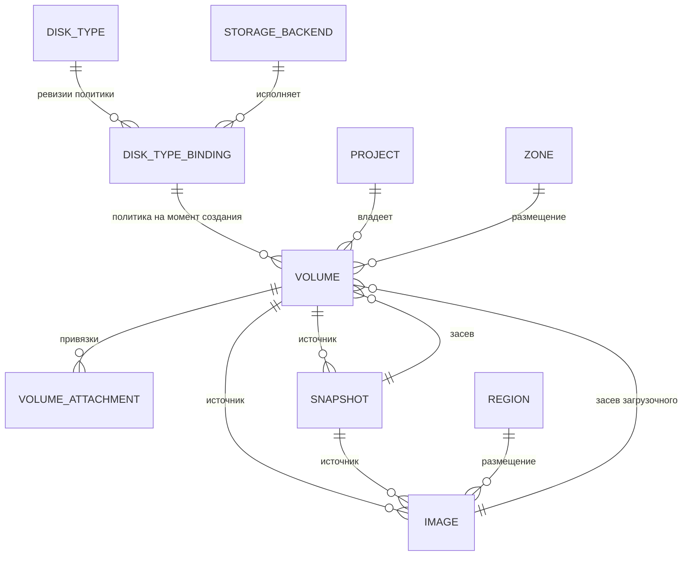

`PROJECT` — kacho-iam, `ZONE`/`REGION` — kacho-geo: ссылки TEXT без FK, валидируются
peer-вызовом владельца на пути запроса, fail-closed.

## 2.2. Владение и адресация

| Ресурс | Видимость | Префикс id | Размещение | Владелец |
|---|---|---|---|---|
| **Volume** `есть` | публичный | `vol` (legacy-форма) | ZONAL | storage |
| **Snapshot** `есть` | публичный | `snp` | ZONAL `+` (`snapshots.zone_id`, миграция 0014; поле 10 контракта) | storage |
| **Image** `есть` | публичный | `img` | REGIONAL (anycast) | storage |
| **DiskType** `есть` | публичный read + internal CRUD | admin-слаг | глобальный, скоупится `zone_ids` | storage |
| **StorageBackend** `+` | **только** internal | `sb-` (hyphen-канон) | привязан к зонам | storage |
| **DiskTypeBinding** `+` | **только** internal | `dtb-` | (класс × зона) | storage |
| **VolumeAttachment** `есть` | под-запись тома | своего id нет | наследует | storage |
| **Operation** `есть` | публичный | `sop` | — | corelib |

Новые префиксы `sb-`/`dtb-` обязаны попасть в `ids.KnownHyphenPrefixes()`, иначе роутер
идентификаторов их не классифицирует. **`нет`: не попали.** `pkg/ids/` ветка не трогала
(`git log bfaf239b..db7146fb -- pkg/ids/` — ноль коммитов), в списке `hyphenFormPrefixes`
(`pkg/ids/ids.go`) значений `sb`/`dtb` нет. Константы `domain.PrefixStorageBackend` /
`domain.PrefixDiskTypeBinding` в дереве стоят и их godoc это требование называет — то есть
требование объявлено ровно там, где его не выполнили.

Сегодня это ничего не роняет **по построению**, и стоит сказать почему, иначе следующий
читатель решит, что пункт декоративен: оба ресурса живут только на внутреннем листенере, а
`corevalidate.ResourceID` на их путях не вызывается вовсе (перепись:
`grep -rn corevalidate services/storage/internal/{handler/internal_backend.go,apps/kacho/api/storagebackend,apps/kacho/api/disktypebinding}`
— ноль вхождений). Пункт становится действующим в тот день, когда кто-нибудь прогонит
`sb-…` через роутер, — и тогда он отвергнет id, произведённый нашим же генератором.

## 2.3. Целостность связей

| Связь | Механизм | Поведение при удалении цели |
|---|---|---|
| `volumes.disk_type_id → disk_types` | FK RESTRICT `есть` | класс с томами не удаляется |
| `volumes.binding_id → disk_type_bindings` `+` | FK RESTRICT | ревизия живёт, пока на неё ссылаются |
| `disk_type_bindings.backend_id → storage_backends` `+` | FK RESTRICT | бэкенд с привязками не удаляется |
| `volumes.source_snapshot_id → snapshots` | FK SET NULL `есть` | происхождение очищается, данные живут |
| `volumes.source_image_id → images` | FK SET NULL `есть` | то же |
| `snapshots.source_volume_id → volumes` | FK SET NULL `есть` | снимок переживает том |
| `images.source_*` | FK SET NULL `есть` | образ переживает источник |
| `volume_attachments.volume_id → volumes` | FK RESTRICT `есть` | привязанный том не удаляется |
| `project_id`, `zone_id`, `region_id`, `instance_id` | TEXT без FK `есть` | cross-service: peer-валидация на пути запроса |

**Важное следствие для клонов.** Если бэкенд объявил зависимость клона от родителя
(`clone_keeps_parent = true`), `SET NULL` на источнике перестаёт быть безобидным: наша
строка теряет связь, а у бэкенда родитель продолжает занимать место. Тогда удаление
источника переводится в **`FAILED_PRECONDITION`** до тех пор, пока дети не отвязаны
(`flatten`). Это поведение **выводится из способности**, а не выбирается нами — см. §7.4.

---

# 3. Публичные методы

## 3.1. Сводка

| Сервис | RPC | REST | Sync/Async | Отношение | Scope |
|---|---|---|---|---|---|
| VolumeService | `Get` `есть` | `GET /storage/v1/volumes/{volumeId}` | sync | `v_get` | `{storage_volume, volume_id}` |
| | `List` `есть` | `GET /storage/v1/volumes` | sync | `viewer` | `{project, project_id}` + пообъектное сужение |
| | `Create` `есть` | `POST /storage/v1/volumes` | async | `editor` | `{project, project_id}` |
| | `Update` `есть` | `PATCH /storage/v1/volumes/{volumeId}` | async | `v_update` | `{storage_volume, volume_id}` |
| | `Delete` `есть` | `DELETE /storage/v1/volumes/{volumeId}` | async | `v_delete` | `{storage_volume, volume_id}` |
| | `ListOperations` `есть` | `GET /storage/v1/volumes/{volumeId}/operations` | sync | `v_list` | `{storage_volume, volume_id}` |
| | **`ChangeDiskType`** `+` | `POST /storage/v1/volumes/{volumeId}:changeDiskType` | async | `v_update` | `{storage_volume, volume_id}` |
| SnapshotService | `Get`/`List`/`Create`/`Update`/`Delete` `есть` | `/storage/v1/snapshots…` | sync/async | как у тома | `{storage_snapshot, snapshot_id}` / `{project,…}` |
| | **`ListOperations`** `+` | `GET /storage/v1/snapshots/{snapshotId}/operations` | sync | `v_list` | `{storage_snapshot, snapshot_id}` |
| | **`Copy`** `+` | `POST /storage/v1/snapshots/{snapshotId}:copy` | async | `editor` @ `project` (из `projectId` тела) | `{project, project_id}` |
| ImageService | `Get`/`List`/`Create`/`Update`/`Delete`/`ListOperations` `есть` | `/storage/v1/images…` | sync/async | как у тома | `{storage_image, image_id}` |
| | **`Copy`** `+` | `POST /storage/v1/images/{imageId}:copy` | async | как у снимка | `{project, project_id}` |
| DiskTypeService | `Get`/`List` `есть` | `/storage/v1/diskTypes…` | sync | `viewer` @ `cluster` | глобальный каталог |

Все семь строк сверены с деревом в **двух** местах, а не в одном: контракт
(`proto/kacho/cloud/storage/v1/*.proto`) и запись каталога прав
(`gateway/internal/middleware/embed/permission_catalog.json`, 41 запись домена storage).
Метод, объявленный контрактом и не имеющий записи каталога, отвечал бы отказом на каждый
вызов — то есть «доставлен» по одному месту и мёртв по второму.

**Почему `ChangeDiskType` — отдельный глагол, а не поле в `Update`.** Это перемещение
данных, а не правка поля: оно длится, может отказать на половине и меняет физическое
расположение. В `update_mask` `diskTypeId` не входит **никогда** — попытка даёт
`INVALID_ARGUMENT "disk_type_id is immutable after Volume.Create"` (перечень неизменяемых
полей — `services/storage/internal/apps/kacho/api/volume/volume.go`, ветка до
`validate.UpdateMask`), а глагол называется явно.

> [!warning] Три новых глагола доставлены БЕЗ единой пробы
> `ChangeDiskType`, `Snapshot.Copy` и `Image.Copy` провязаны от контракта до репозитория,
> но **ни одна проба дерева их не зовёт**. Предикат, прогнанный по всему монорепо (вне
> `ui-future/`): `grep -rni 'changedisktype' --include=*_test.go --include=*.py` → **0**;
> то же для `Copy(` в тестах storage → **0**. Это нарушение ban #12 (падающий тест до кода),
> и оно не косметическое: глагол, который никто не зовёт, отличим от неработающего только
> прогоном на стенде. Сценарии приёмки STOR-P-41/47/56 остаются **без исполнителя** —
> см. §12 и перепись приёмки.

## 3.2. Volume — поля

| Поле | Тип | Вход | Изменяемость | Валидация |
|---|---|---|---|---|
| `id` | string | — | output, immutable | `vol` + crockford |
| `projectId` | string | Create | immutable | required, ≤50, peer-validate → iam |
| `createdAt`/`updatedAt` | timestamp | — | output | усечены до секунд |
| `name` | string | Create/Update | mutable | `\|[a-z]([-_a-z0-9]{0,61}[a-z0-9])?`, `UNIQUE(project,name) WHERE name<>''` |
| `description` | string | Create/Update | mutable | ≤256 |
| `labels` | map | Create/Update | mutable (replace) | ≤64 пар, ключ 1-63 |
| `zoneId` | string | Create | **immutable** | required, ≤50, peer-validate → geo |
| `diskTypeId` | string | Create | **только `:changeDiskType`** `~` | required, класс `ACTIVE`, предлагается в зоне |
| `sizeBytes` | int64 | Create/Update | **увеличение только** | `>0`; границы класса — `нет` на `Create` (см. ниже), min/max держит только `:changeDiskType` |
| `blockSize` | int64 | — | — | **`×` снят**, `reserved 11, "block_size"` |
| `sourceSnapshotId` | string | Create | immutable | взаимоисключение с `sourceImageId` |
| `sourceImageId` | string | Create | immutable | то же |
| `status` | enum | — | output | см. §6.1 |
| **`statusReason`** `+` | enum | — | output | закрытый словарь **наших полос** |
| **`usedBytes`** `+` | int64 | — | output | наблюдённое; **не показывается**, если бэкенд его не сообщил |
| `attachments[]` | repeated | — | output | производное из `volume_attachments` |
| `usedBy[]` | repeated | — | output | обобщённая проекция привязок |

**Инфра-полей на публичном Volume нет и не будет:** координата бэкенда, пул, namespace,
имя объекта, ревизия привязки — **только** internal-проекция. Держится гейтом
`services/storage/internal/protoconv/protoconv_projection_test.go`, и он **расширен со
значений** `+`: `TestValueGateGoesRedOnALeak` подставляет инфра-значение в ответ и требует
красного, `TestProjectionGateHasItsSubject` утверждает, что у гейта есть предмет (иначе
«ноль находок» означало бы «ноль прочитанного»), а `TestVolumePublicProjectionNoInfra` /
`TestSnapshotPublicProjectionNoInfra` / `TestImagePublicProjectionNoInfra` держат три
публичные проекции поимённо. Канал, ради которого расширение делалось, закрыт **у
источника**: ярус класса переведён из свободной строки в закрытое перечисление
(`DiskType.PerformanceTier`, `disk_type.proto`), а прежнее поле снято вместе с номером и
именем (`reserved 5; reserved "performance_tier"`).

> [!note] Границы размера класса на `Create` — `нет`, и это не описка в таблице выше
> Стейтмент создания тома (`services/storage/internal/repo/pg/volume_repo.go`,
> `volumeInsertCoherentSQL`) **читает** `d.min_size_bytes, d.max_size_bytes,
> d.size_step_bytes` в подзапросе `dt`, но предикат вставки на них не смотрит: он требует
> `dt.offered`, `dt.lifecycle = 'ACTIVE'`, готовности источника и запаса квоты — и всё.
> Доменный метод `domain.DiskType.ValidateVolumeSize`, который эти границы проверяет, в
> непробном дереве **не вызывается ни разу** (предикат: `grep -rn '\.ValidateVolumeSize('
> --include=*.go services/storage/ | grep -v _test` → ноль). Его юнит
> `TestDiskTypeLimits_ValidateVolumeSize` зелёный и останется зелёным при любом поведении
> `Create`: он зовёт проверку напрямую, без вызывающего, — ровно тот класс «заголовок шире
> тела», который `testing.md` §«Гейт на класс» называет вакуумным утверждением.
>
> Что при этом **работает**: `:changeDiskType` границы min/max держит
> (`volume_repo.go`, отдельный `SELECT lifecycle, min_size_bytes, max_size_bytes`), а БД
> держит согласованность самих границ (`disk_types_size_bounds_*` в миграции 0016). Кратность
> шагу (`size_step_bytes`) не энфорсится нигде.

### Create — запрос

```json
POST /storage/v1/volumes
{
  "projectId": "prj-4kq2n8xr1vm0d3c7f",
  "name": "pg-data-01",
  "description": "primary database volume",
  "labels": { "env": "prod", "app": "postgres" },
  "zoneId": "ru-central1-a",
  "diskTypeId": "block-balanced",
  "sizeBytes": 107374182400
}
```

### Create — ответ (Operation, `done=false`)

```json
{
  "id": "sop0h2k9r4tf8m1qwzxc",
  "description": "Create volume vol0a7b3c9d2e5f8g1hj",
  "createdAt": "2026-08-12T09:14:22Z",
  "done": false,
  "metadata": {
    "@type": "type.googleapis.com/kacho.cloud.storage.v1.CreateVolumeMetadata",
    "volumeId": "vol0a7b3c9d2e5f8g1hj"
  },
  "principalType": "user",
  "principalId": "usr-9m2k4p7q1z8x3c5vw"
}
```

> **Читать `metadata.volumeId` можно только при `done=true` И отсутствии `error`.**
> Идентификатор выделяется при **приёме** операции, поэтому на отказавшей операции он
> указывает на несуществующий ресурс.

### Get — ответ

```json
{
  "id": "vol0a7b3c9d2e5f8g1hj",
  "projectId": "prj-4kq2n8xr1vm0d3c7f",
  "createdAt": "2026-08-12T09:14:22Z",
  "updatedAt": "2026-08-12T09:14:25Z",
  "name": "pg-data-01",
  "labels": { "env": "prod", "app": "postgres" },
  "zoneId": "ru-central1-a",
  "diskTypeId": "block-balanced",
  "sizeBytes": 107374182400,
  "usedBytes": 12884901888,
  "status": "IN_USE",
  "attachments": [
    {
      "instanceId": "ins-3f7k9m2p5r8t1w4yz",
      "instanceName": "db-primary",
      "deviceName": "sdb",
      "isBoot": false,
      "mode": "READ_WRITE",
      "autoDelete": false,
      "attachedAt": "2026-08-12T09:20:03Z"
    }
  ],
  "usedBy": [
    { "referrer": { "type": "compute.instance", "id": "ins-3f7k9m2p5r8t1w4yz", "name": "db-primary" },
      "type": "USED_BY", "owned": false }
  ]
}
```

### Отказ провижининга — том в ERROR

```json
{
  "id": "vol0a7b3c9d2e5f8g1hj",
  "status": "ERROR",
  "statusReason": "BACKEND_CAPACITY_EXHAUSTED",
  "sizeBytes": 107374182400
}
```

`statusReason` — **закрытый словарь наших полос**, не таксономия бэкенда:
`BACKEND_UNAVAILABLE` · `BACKEND_REJECTED` · `BACKEND_CAPACITY_EXHAUSTED` ·
`SOURCE_NOT_READY` · `PRECONDITION_FAILED` · `INTERNAL_ERROR`. Значений, называющих физику
(`POOL_FULL`, `REPLICA_DEGRADED`, `OSD_DOWN`), в словаре нет и быть не может.

Последнее значение называется **`INTERNAL_ERROR`**, а не `INTERNAL`: так оно объявлено и в
контракте (`proto/kacho/cloud/storage/v1/status_reason.proto`, значение 6), и в ограничении
БД (`*_status_reason_known`, миграция 0017). Прежняя редакция плана писала `INTERNAL` —
разница в одно слово, но именно ею документ перестаёт быть проверяемым: значение перечисления
сверяется дословно, а не по смыслу.

### ChangeDiskType

```json
POST /storage/v1/volumes/vol0a7b3c9d2e5f8g1hj:changeDiskType
{ "diskTypeId": "block-fast" }
```

Возвращает `Operation`. Том переходит в `MIGRATING` (значение 6 перечисления
`Volume.Status`), по завершении — `AVAILABLE`/`IN_USE` с новым `diskTypeId`. Целевой класс
обязан быть `ACTIVE` и предлагаться **в той же зоне**: смена зоны глаголом не делается
(`zoneId` неизменяем; перенос — через `Snapshot:copy`). Переезд выражен **расхождением
ревизий** (`desired_binding_id` ≠ `binding_id`, миграция 0020), а не третьим значением
колонки состояния. Пробы у глагола нет — см. предупреждение в §3.1.

## 3.3. Snapshot — что меняется

Все шесть пунктов **доставлены**; правая колонка называет, чем именно, — иначе «доставлено»
неотличимо от «объявлено».

| Поле | Статус | Чем доставлено |
|---|---|---|
| **`zoneId`** `+` | output-only, immutable | Поле 10 контракта + колонка `snapshots.zone_id` (0014, с обратной засыпкой из тома-источника). Закрывает тождественно-истинную когерентность при `source_volume_id IS NULL`: `TestSnapshotKeepsOwnZoneAfterSourceVolumeDeleted` |
| **`updatedAt`** `+` | output-only | Поле 11 контракта; колонка была и до ветки |
| **`statusReason`** `+` | output-only | Поле 12 контракта + колонка (0017); `TestSnapshotStatusReasonRoundTrip` |
| **`usedBy[]`** `+` | output-only | Поле 13 контракта; `TestSnapshotSeededVolumesAreListed` + `TestSnapshotListSeedsWithoutPerRowQuery` (перечень одним запросом, а не по строке) |
| **`ListOperations`** `+` | RPC | Контракт + запись каталога прав (`v_list` @ `storage_snapshot`) |
| **`Copy`** `+` | RPC | Контракт + маршрут + use-case + репозиторий (`snapshot_repo.go`, происхождение копии — миграция 0021). **Пробы нет** — §3.1 |

> [!important] Права `Copy`: `editor@project`, а не чтение источника
> Первая редакция плана гейтила копирование чтением источника — «кто вправе
> читать, тот вправе снять копию». Это неверно, и разница не косметическая:
> копия есть НОВЫЙ ресурс (квота, имя, деньги), а роль наблюдателя материализует
> чтение на каждый объект проекта. Такой гейт отдал бы наблюдателю право
> неограниченно порождать ресурсы — повышение привилегии из чтения в запись,
> неотличимое в дифе от обычной строки каталога.
>
> Пообъектного «создать» в платформе нет by construction: этот вопрос всегда
> задают РОДИТЕЛЮ. Отсюда обязательный `projectId` в теле обоих запросов — он и
> есть объект вопроса, — и сверка его с проектом источника тоном промаха: чужая
> строка обязана быть неотличима от отсутствующей.

```json
POST /storage/v1/snapshots/snp5t8y2v4j7q1p3a6bc:copy
{ "projectId": "prj-4kq2n8xr1vm0d3c7f", "targetZoneId": "ru-central1-b", "name": "pg-data-01-backup-b" }
```

Создаёт **новый** снимок в целевой зоне (`CREATING` → `READY`), исходный не трогает.
`projectId` и `targetZoneId` — **оба обязательны** (`(required) = true` в
`snapshot_service.proto`, поля 6 и 2): первый и есть объект вопроса о правах, второй —
предмет самого глагола. Прежняя редакция показывала тело без `projectId` — то есть
иллюстрировала запрос, который сервис отвергнет.

## 3.4. Image — что меняется

`statusReason` `+` (поле 16), `usedBy[]` `+` (поле 17), `Copy` `+` (между регионами;
`projectId` и `targetRegionId` обязательны — `image_service.proto`, поля 6 и 2).
`digest` — **открытый вопрос владельцу**, см. §11: в контракте образа его по-прежнему нет.
`Format {STANDARD}` не меняется: внешние форматы к нам не приезжают (см. §4.5).

## 3.5. DiskType — целевая форма

```json
{
  "id": "block-balanced",
  "name": "Balanced",
  "description": "General-purpose durable volume",
  "tier": "BALANCED",
  "zoneIds": ["ru-central1-a", "ru-central1-b"],
  "lifecycle": "ACTIVE",
  "capabilities": {
    "snapshots": true,
    "cloneFromSnapshot": true,
    "cloneFromImage": true,
    "onlineGrow": true,
    "multiAttach": false,
    "encryptionAtRest": true
  },
  "limits": {
    "minSizeBytes": 1073741824,
    "maxSizeBytes": 17592186044416,
    "sizeStepBytes": 1073741824
  }
}
```

| Элемент | Статус | Правило и чем доставлено |
|---|---|---|
| `tier` | `~` | **закрытый словарь** `PERFORMANCE_TIER_UNSPECIFIED`/`CAPACITY`/`BALANCED`/`FAST`/`SINGLE`/`IO_MAX` (поле 6). Прежнее `performanceTier` снято вместе с номером и именем (`reserved 5`) — **и номер, и имя**, потому что на проводе сменился тип. Держат: `TestDiskTypeTier_ClosedDictionary` (домен), `disk_types_tier_known` (0016, БД), `TestDiskTypePolicyHeldByDBInvariants` (отрицание в паре с законным близнецом) |
| `lifecycle` `+` | | Поле 7, закрытый словарь. `ACTIVE` → создание разрешено; `DEPRECATED` → существующие живут, новые нет; `RETIRED` → удаление при нуле томов. Меняется **отдельным глаголом** `SetLifecycle`, а не маской: пустая маска у `Update` означала бы возврат выведенного класса в обращение правкой описания |
| `capabilities` `+` | | Поле 8, output-only: **пересечение** действующих ревизий привязки (`bool_and` в `disk_type_repo.go`), на вход не принимается. `TestDiskTypeCapabilitiesIntersectActiveBindings` + `TestDiskTypeCapabilitiesReadWithoutPerRowQuery` |
| `limits` `+` | | Поле 9 + колонки (0016). **В контракте есть, на `Create` не энфорсятся** — см. врезку в §3.2 |
| `performance` | **`нет`** | Блока в контракте нет, и это **решение, а не пропуск**: числа производительности живут на ревизии привязки (`BindingQoS`, :9091) и публикуются только там. Класс обязан переживать смену бэкенда, а число, которого никто не держит, — обещание без исполнителя (§11, вопрос 5). Убран и из примера выше, чтобы пример не обещал поле, которого нет |
| `Update` | `~` | Переведён на `update_mask`: не названное маской не пишется. `TestUpdateAdminAppliesOnlyMaskedFields` · `TestUpdateAdminEmptyMaskPatchesAllMutable` · `TestUpdateAdminRejectsUnknownMaskField` · `TestUpdateAdminRejectsImmutableMaskField` · `TestDiskTypeUpdateAppliesOnlyNamedFields` (репозиторий) |

**Каталог глобален** (`viewer` @ `cluster`) — его читает любой аутентифицированный
арендатор. Следствие, названное вслух: выделенного класса «для одного арендатора»
не существует, все классы видны всем.

---

# 4. Internal-методы (`:9091`, mTLS, не на external)

## 4.1. Сводка

| Сервис | RPC | Назначение | Отношение |
|---|---|---|---|
| `InternalDiskTypeService` `есть` | `Create`/`Update`/`Delete` | админ-каталог классов | `system_admin` @ `cluster` |
| | **`SetLifecycle`** `+` | вывод класса из обращения | `system_admin` |
| **`InternalStorageBackendService`** `+` | `Create`/`Get`/`List`/`Update`/`Delete` | регистрация бэкендов | `system_admin` |
| **`InternalDiskTypeBindingService`** `+` | `Create`/`Get`/`List` — **без `Supersede`** | ревизии привязки класса к бэкенду | `system_admin` |
| `InternalVolumeService` `есть` | `Attach`/`Detach`/`ListAttachments` | сага привязки от compute | `editor` @ `storage_volume`, `ListAttachments` — `scope_filtered` |
| | `GetInternal` **`нет`** | инфра-проекция тома — по-прежнему `UNIMPLEMENTED` | `viewer` @ `storage_volume` |
| `InternalImageService` `есть` | `GetInternal` `~` | инфра-проекция образа — **заполнена** | `viewer` @ `storage_image` |
| | **`Register`** `+` | регистрация образа, внесённого провайдером | `system_admin` |
| `InternalUsageService` | **`нет`** | потребление проекта для оператора | — |

Строки таблицы сверены с каталогом прав: у каждого названного RPC запись есть, и ни одна
запись каталога не осталась без строки здесь (41 запись домена storage, из них 18 —
внутренние службы).

**`Supersede` глаголом не существует, и это решение.** Вытеснение — **следствие** создания
новой ревизии на ту же пару (класс, зона), а не самостоятельное действие: `Register`
выполняет `UPDATE … status='SUPERSEDED'` и `INSERT` **двумя операторами в одной
транзакции**. Отдельный глагол означал бы состояние «прежняя вытеснена, новой нет» — пара
без действующей ревизии, то есть класс, переставший обслуживаться молча. Свойство держат
`TestDiskTypeBindingRepoHasNoMutatingPath` (у репозитория нет изменяющего пути вовсе) и
`TestDiskTypeBinding_HasNoMutatingMethods` (у доменного типа — тоже).

**`GetInternal` тома — `нет`, и это надо читать буквально.** `VolumeRepo.GetInternal`
возвращает `ErrUnimplemented`, сообщение `VolumeInternal` несёт `reserved 2 to 15` и ни
одного инфра-поля, файл `internal_volume_service.proto` веткой не тронут. Контрактный ответ
закреплён пробой `TestVolumeGetInternalUnimplemented` — то есть это **объявленное**
отсутствие, а не забытая ветка. Асимметрия с образом при этом реальна: у образа
`ImageInternal` заполнен (`binding_id`, `backend_object`, `observed_state`, `observed_at`,
`status_reason`) и репозиторий его отдаёт. Целевая форма тома — §4.6.

Все internal-RPC — **синхронные**: у админ-справочника нет длящейся работы, оборачивать её
в операцию значило бы заставлять администратора поллить готовое. `Image.Register` в дереве
тоже синхронен и возвращает `Image`.

> [!warning] Регистрация бэкенда и ревизии привязки через API отвергается — id не назначается
> Ни хендлер, ни use-case, ни репозиторий **не присваивают `id`** ни бэкенду, ни ревизии
> привязки: перепись присваиваний по обоим путям
> (`handler/internal_backend.go`, `apps/kacho/api/storagebackend/`,
> `apps/kacho/api/disktypebinding/`, `repo/pg/storage_backend_repo.go`,
> `repo/pg/disk_type_binding_repo.go`) даёт **ноль**, при том что
> `domain.StorageBackend.Validate` и `domain.DiskTypeBinding.Validate` требуют непустой `id`
> первой же строкой. `ids.NewHyphenID` в непробном дереве storage не вызывается ни разу.
>
> Почему это не заметили: интеграционные пробы обоих ресурсов присваивают `id` **сами** и
> зовут репозиторий напрямую, минуя хендлер и use-case, а посев стенда
> (`deploy/scripts/storage-catalog.sql`) идёт SQL-ом мимо API. То есть путь проверен по
> частям, каждая из которых верна, и не проверен целиком — ровно там, где он и разорван.
>
> Следствие для приёмки: STOR-P-10 назван покрытым, но его исполнитель проверяет **не ту
> полосу**, которую сценарий описывает («админ создаёт `StorageBackend`»). Это записано в
> перечне §12 и в переписи исполнителей приёмки, а не оставлено на память.

## 4.2. StorageBackend

```json
POST /storage/v1/storageBackends        (internal mux)
{
  "name": "ceph-central-1",
  "kind": "CEPH_RBD",
  "zoneIds": ["ru-central1-a", "ru-central1-b", "ru-central1-c"],
  "endpoint": "cfg://ceph/central-1",
  "credentialsRef": "vault://kacho/storage/ceph-central-1",
  "status": "ACTIVE"
}
```

| Поле | Правило |
|---|---|
| `kind` | закрытый enum: `CEPH_RBD`, далее по мере адаптеров |
| `endpoint` | **непрозрачная координата**, разрешается конфигурацией процесса. В API не кладём ни monitor-адреса, ни пулы |
| `credentialsRef` | **ссылка**, не значение. Секрет никогда не проходит через API и не хранится в БД |
| `status` | `ACTIVE` / `DRAINING` (новые привязки нельзя) / `DISABLED` |

## 4.3. DiskTypeBinding — ревизия политики

```json
POST /storage/v1/diskTypeBindings        (internal mux)
{
  "diskTypeId": "block-balanced",
  "zoneId": "ru-central1-a",
  "backendId": "sb-7k2m9p4r1t8w3y6zb",
  "locator": { "pool": "kacho-block-balanced", "namespaceTemplate": "prj-{projectId}" },
  "capabilities": { "snapshots": true, "cloneFromSnapshot": true, "cloneKeepsParent": true,
                    "onlineGrow": true, "multiAttach": false, "encryptionAtRest": true,
                    "trashTtlSeconds": 86400 },
  "qos": { "baselineIops": 3000, "iopsPerGib": 30, "maxIops": 80000,
           "baselineThroughputMibps": 125, "throughputPerGibMibps": 0.5, "maxThroughputMibps": 1000 }
}
```

**Ревизии append-only.** `Create` новой привязки на ту же пару (класс, зона) автоматически
переводит прежнюю в `SUPERSEDED`; строки **никогда не редактируются и не удаляются**, пока
на них ссылается хоть один том. Отсюда: правка класса не может ретроактивно изменить
свойства уже созданных ресурсов — том ссылается на **неизменяемую** строку. Доставлено:
`disk_type_bindings` + два частичных уникальных индекса (0015), `Register` двумя операторами
в одной транзакции, номер ревизии считается **внутри вставки**. Держат
`TestDiskTypeBindingRegisterSupersedesPrevious` (прежняя строка не изменена ни в одном поле),
`TestDiskTypeBindingRegisterConcurrentExactlyOneWins` и
`TestDiskTypeBindingRegisterRaceHoldsUnderAnyInterleaving` (конкуренция),
`TestDiskTypeBindingReferencedRevisionIsNotDeletable` (FK RESTRICT).

`locator` и `capabilities` — инфра-чувствительные, живут **только** здесь и в
`GetInternal`. На публичный `DiskType` из этой записи проецируются лишь `capabilities`
(булевы, без имён пулов) — **пересечением** действующих ревизий. `qos` наружу не
проецируется вовсе: блока `performance` на публичном классе `нет` (§3.5), поэтому оговорка
«только если бэкенд их энфорсит» относится сегодня к пустому множеству.

`trashTtlSeconds` в теле выше — не описка: он часть `BindingCapabilities` контракта
(поле 7) и колонки `trash_ttl_seconds` (0015), но на публичный класс не выходит — он
называет устройство плоскости данных, а не доступное арендатору действие.

## 4.4. Attach / Detach — что меняется

Контракт `есть` и остаётся: payload самоописывающийся (`instanceId`/`instanceName`/
`instanceZoneId`/`projectId`), storage валидирует **свою** строку и **никогда не зовёт
compute** — ацикличность держится по построению.

Изменено одно `~`, и оно **доставлено**: PK `volume_attachments` переведён с `volume_id` на
**`(volume_id, instance_id)`** (миграция 0018), а инвариант «один привязанный инстанс»
переехал в предикат CAS, читающий способность привязки. Форма стейтмента в дереве
(`services/storage/internal/repo/pg/volume_repo.go`):

```sql
INSERT INTO volume_attachments (...)
SELECT ...
  FROM volumes v
  LEFT JOIN disk_type_bindings b ON b.id = v.binding_id
 WHERE v.id = $1 AND v.state = 'READY' AND v.zone_id = $5 AND v.project_id = $4
   AND (COALESCE(b.cap_multi_attach, false)
        OR NOT EXISTS (SELECT 1 FROM volume_attachments a WHERE a.volume_id = $1))
ON CONFLICT (volume_id, instance_id) DO NOTHING
RETURNING volume_id;
```

Три отличия от прежней редакции — не стиль, а читаемость намерения:
**`v.state`**, а не `v.desired_state` (колонка не переименовывалась — §8.1);
**`LEFT JOIN` + `COALESCE(…, false)`**, а не внутреннее соединение — том без ревизии
привязки обязан вести себя как «множественная привязка не объявлена», а не выпадать из
предиката вовсе (внутреннее соединение отвергало бы его молча, и отказ назвал бы не ту
причину); **`cap_multi_attach`** — имя колонки 0015.

Смена PK — миграция на живой таблице, поэтому сделана **сейчас**, а не когда понадобится
множественная привязка. Разбор нулевого исхода даёт **три разных текста** (занятость, зона,
проект) — `TestAttachZoneProjectMismatch`, `TestAttachDoubleRace`.

## 4.5. Image.Register — как образ попадает в облако

Единственный путь. Блоб-конвейера у нас нет и не проектируется: образ вносит в хранилище
команда провайдера вне облака, облако **регистрирует handle**.

Доставлено `+` — но **gRPC-only, без REST-маршрута**, и это разница, которую надо назвать:
`InternalImageService` не объявляет `google.api.http` ни у одного RPC, поэтому пути
`/storage/v1/images:register` **не существует** ни на публичном, ни на внутреннем
мультиплексоре. Вызов идёт напрямую в `kacho.cloud.storage.v1.InternalImageService/Register`
на `:9091` под mTLS; запись каталога прав — `system_admin` @ `cluster`.

Тело запроса (`RegisterImageRequest`): обязательные `projectId`, `regionId`,
`backendObject`; плюс `name`, `description`, `labels`, `sizeBytes > 0`, `minDiskBytes > 0`.
**`digest` в контракте нет** — он остаётся открытым вопросом владельцу (§11, вопрос 1), и
показывать его в примере значило бы обещать поле, которого запрос не примет.

`backendObject` — **единственное** место контракта, где имя объекта приходит извне: на всех
прочих путях адаптер выводит его сам из префикса установки и нашего `id`. Здесь выводить не
из чего — объект внесён до того, как у облака появилась строка. Держат
`TestImageRegisterKeepsSuppliedObjectName` (принятое имя сохраняется) и
`TestImageCreateDerivesBackendObject` (на обычном создании — выводится, не принимается) —
пара, без которой первое утверждение зеленело бы на реализации, принимающей имя всюду.

Без этого метода **на чистой установке VM не запускается**: единственный источник ОС для
VM — `storage.image`, а публичный `Image.Create` создаёт образ только из тома или снимка,
которых на чистой установке нет.

## 4.6. GetInternal — инфра-проекция

**Образ — доставлено `~`.** `ImageInternal` несёт `image`, `bindingId`, `backendObject`,
`observedState` (`OBSERVED_STATE_UNSPECIFIED`/`ABSENT`/`READY`), `observedAt`,
`statusReason`; `ImageRepo.GetInternal` его отдаёт.

**Том — `нет`.** `VolumeRepo.GetInternal` возвращает `ErrUnimplemented` → `UNIMPLEMENTED`,
`VolumeInternal` держит `reserved 2 to 15` и одно поле `volume`. Целевая форма ниже —
**намерение**, а не дерево, и помечена как таковая, чтобы её не прочли как описание ответа:

```json
{
  "volume": { "...публичная проекция..." },
  "bindingId": "dtb-2n5q8s1v4x7z0b3ef",
  "bindingRevision": 3,
  "backendId": "sb-7k2m9p4r1t8w3y6zb",
  "backendObject": "kc7f-vol0a7b3c9d2e5f8g1hj",
  "backendNamespace": "prj-4kq2n8xr1vm0d3c7f",
  "desiredState": "READY",
  "observedState": "READY",
  "observedAt": "2026-08-12T09:31:00Z",
  "observedSizeBytes": 107374182400,
  "parentObject": "kc7f-img-ubuntu-2404-20260812@base"
}
```

> [!note] Данные под эту форму в БД уже лежат — не хватает только проекции
> Миграции 0017/0019/0020 завели у тома `binding_id`, `desired_binding_id`,
> `backend_object`, `backend_namespace`, `observed_state`, `observed_at`,
> `observed_size_bytes`, `used_bytes`, `status_reason`. То есть недоставленная часть —
> контракт и чтение, а не модель данных: `reserved 2 to 15` придётся заполнять именами
> полей, которые уже существуют колонками. Сказано это затем, чтобы объём остатка не
> оценивали заново по одному слову «UNIMPLEMENTED».

---

# 5. Валидация: границы и ограничения

## 5.1. Общие

| Предмет | Правило |
|---|---|
| Формат id | malformed → **первым стейтментом RPC** sync `INVALID_ARGUMENT "invalid <res> id '<X>'"`. Well-formed-но-нет → `NOT_FOUND` |
| Пагинация | `pageSize` 0→50, max 1000, вне диапазона — **отвергается**, не clamp'ится; `pageToken` opaque base64 `{created_at,id}`, мусор → `INVALID_ARGUMENT` |
| **Порядок** | валидация формата и пагинации — **ДО** сужения по правам, в **той же функции**, которая замыкается на пустом гранте |
| `filter` | whitelist, текущая фаза — `name=` |
| `update_mask` | unknown → `INVALID_ARGUMENT`; immutable → `"<field> is immutable after <R>.Create"` **до** проверки unknown; пустая маска → full-object PATCH mutable-полей |
| Timestamps | усечение до секунд во **всех** ответах, включая под-записи |
| Ошибка бэкенда | **никогда** не эхается: неклассифицированный ответ → фиксированный `internal error` |

## 5.2. Числовые границы

| Поле | Граница | Отказ |
|---|---|---|
| `sizeBytes` | `>0`; `>= diskType.limits.minSizeBytes`; `<= maxSizeBytes`; кратно `sizeStepBytes` `+` | `INVALID_ARGUMENT` |
| `sizeBytes` при Update | строго больше текущего | `Volume size can only be increased` |
| `sizeBytes` из образа | `>= image.minDiskBytes` | `Volume size %d is less than image min_disk_bytes %d` |
| `name` | ≤63, `^[a-z]([-a-z0-9]{0,61}[a-z0-9])?$`, пусто допустимо | `Illegal argument name` |
| `description` | ≤256 | `INVALID_ARGUMENT` |
| `labels` | ≤64 пар, ключ 1-63, значение ≤63 | `INVALID_ARGUMENT` |
| `pageSize` | 0..1000 | `INVALID_ARGUMENT` |

## 5.3. Нормативные тексты ошибок

Тексты — **часть контракта**, меняются только осознанно. Таблица приземлённых (`есть`)
воспроизводится из приёмки CS-1; доставленные веткой помечены `+`, **непроизводимые ни одной
веткой прод-кода — `нет`**. Каждая строка сверена предикатом «текст встречается в непробном
дереве `services/storage/`», поэтому «есть в таблице» перестало означать «кто-то так
задумывал».

| Текст | Код | Триггер |
|---|---|---|
| `invalid volume id '<X>'` | `INVALID_ARGUMENT` | malformed id первым стейтментом |
| `Volume <id> not found` | `NOT_FOUND` | well-formed-но-нет |
| `Illegal argument name` / `Illegal argument size_bytes` | `INVALID_ARGUMENT` | domain-validate |
| `unknown zone id '<X>'` | `INVALID_ARGUMENT` | peer geo вернул miss |
| `Project <id> not found` | `FAILED_PRECONDITION` | peer iam вернул miss |
| `volume with name <n> already exists in project` | `ALREADY_EXISTS` | partial UNIQUE |
| `Volume size can only be increased` | `INVALID_ARGUMENT` | размер-CAS |
| `<field> is immutable after Volume.Create` | `INVALID_ARGUMENT` | immutable в маске |
| `Volume <id> is in use` | `FAILED_PRECONDITION` | Delete привязанного / Attach занятого |
| `DiskType <id> is not offered in zone <zone>` | `FAILED_PRECONDITION` | класс не предлагается в зоне |
| `Volume and Instance must be in the same zone` | `FAILED_PRECONDITION` | zone-coherence в attach-CAS |
| `Volume and Instance must be in the same project` | `FAILED_PRECONDITION` | project-coherence — **отдельный** текст |
| `Volume and Image must be in the same region` | `FAILED_PRECONDITION` | зона тома ∉ регион образа |
| `Volume <id> is not ready` | `FAILED_PRECONDITION` | снимок с не-READY тома |
| `permission denied` | `PERMISSION_DENIED` | фикс. opaque, существование цели не раскрывается |
| `internal error` | `INTERNAL` | дефолт-ветка, никогда не эхает pgx/SQL |
| **`DiskType <id> is not accepting new volumes`** `+` | `FAILED_PRECONDITION` | класс `DEPRECATED`/`RETIRED` при `Volume.Create` |
| **`DiskType <id> not found`** `+` | `FAILED_PRECONDITION` (в полосе создания тома) / `NOT_FOUND` (прямое чтение каталога) | класс не зарегистрирован. Полосы **разные**: у каталога это own-read, у создания тома — предусловие |
| **`DiskType <id> has no active binding in zone <zone>`** `+` | `FAILED_PRECONDITION` | класс объявлен и предлагается в зоне, но действующей ревизии привязки нет — исполнять некому. **Отдельный** текст от «не предлагается в зоне»: тот отправил бы администратора править каталог, тогда как чинить надо привязку |
| **`Snapshot <id> is not ready`** `+` | `FAILED_PRECONDITION` | засев из не-READY снимка |
| **`Image <id> is not ready`** `+` | `FAILED_PRECONDITION` | засев из не-READY образа |
| **`storage quota exceeded for project <id>`** `+` | `RESOURCE_EXHAUSTED` | наш лимит (`KACHO_STORAGE_PROJECT_PROVISIONED_BYTES_LIMIT`, 0 — предела нет) |
| **`Volume <id> is not in a state that allows changing disk type`** `+` | `FAILED_PRECONDITION` | `ChangeDiskType` не из `AVAILABLE`/`IN_USE` |
| **`DiskType <id> does not support <capability>`** **`нет`** | `FAILED_PRECONDITION` | Текст объявлен (`domain.DiskType.RequireCapability`), но метод **не вызывается ни разу** в непробном дереве (предикат: `grep -rn '\.RequireCapability(' --include=*.go services/storage/ \| grep -v _test` → 0). Способности класса публикуются, но **ни одну операцию не гейтят** — §7.4 сегодня описывает намерение |
| **`backend capacity exhausted`** **`нет`** | `RESOURCE_EXHAUSTED` | Наружу такого сообщения не производит никто. Исчерпание у бэкенда доезжает до арендатора **только** через `statusReason = BACKEND_CAPACITY_EXHAUSTED` на ресурсе (полоса исхода `capacity_exhausted` в `blockbackend/outcome.go`), синхронного отказа с этим текстом нет |
| **`Volume <id> has dependent clones`** **`нет`** | `FAILED_PRECONDITION` | Текста в дереве нет. `cloneKeepsParent` читается ровно в одном месте — сверщик выставляет `Detached` по отрицанию способности (`reconciler/loop.go`); удаление источника с живыми клонами ничем не удерживается |

## 5.4. gRPC → HTTP

Край не несёт своего отображения — статус выбирает grpc-gateway. `FAILED_PRECONDITION` —
это **400**, а не 412; 412 краем не производится ни для одного кода, поэтому кейс,
ожидающий 412, не имеет производителя.

| Код | HTTP | Код | HTTP |
|---|---:|---|---:|
| `OK` | 200 | `ALREADY_EXISTS` | 409 |
| `INVALID_ARGUMENT` | 400 | `RESOURCE_EXHAUSTED` | 429 |
| `FAILED_PRECONDITION` | **400** | `UNIMPLEMENTED` | 501 |
| `NOT_FOUND` | 404 | `UNAVAILABLE` | 503 |
| `PERMISSION_DENIED` | 403 | `INTERNAL` | 500 |
| `UNAUTHENTICATED` | 401 | | |

---

# 6. Бизнес-логика

## 6.1. Состояния

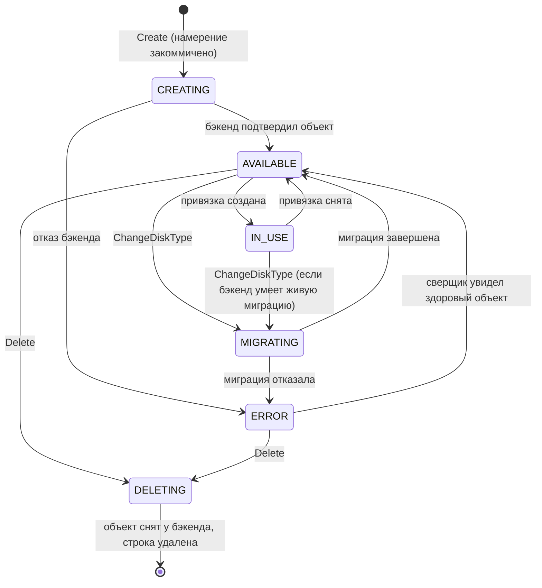

**`AVAILABLE`/`IN_USE` выводятся из наличия привязки** — отдельной колонкой не хранятся.
`CREATING`/`MIGRATING`/`DELETING`/`ERROR` — из пары «желаемое ≠ наблюдённое».

> **Что означает `IN_USE` — решение, которое надо принять до кода.** Сегодня контракт
> утверждает, что статус «не может разойтись с состоянием привязки». С появлением узлового
> агента появляются два разных факта: «привязка объявлена в control plane» и «устройство
> отображено на узле». `IN_USE` означает **первое**; утверждение о невозможности дрейфа
> относится к нему же и остаётся верным. Второе — предмет compute, не наш.

## 6.2. Полоса авторизации — одна на всех путях

Ниже она показана **развёрнуто один раз**; в сценариях §6.3–6.8 она присутствует
сжатым блоком `authN+authZ`. Пропуск этого блока в диаграмме означал бы, что проверки
нет, — поэтому он есть в каждом сценарии без исключения.

### Публичная поверхность (`:9090` через край)

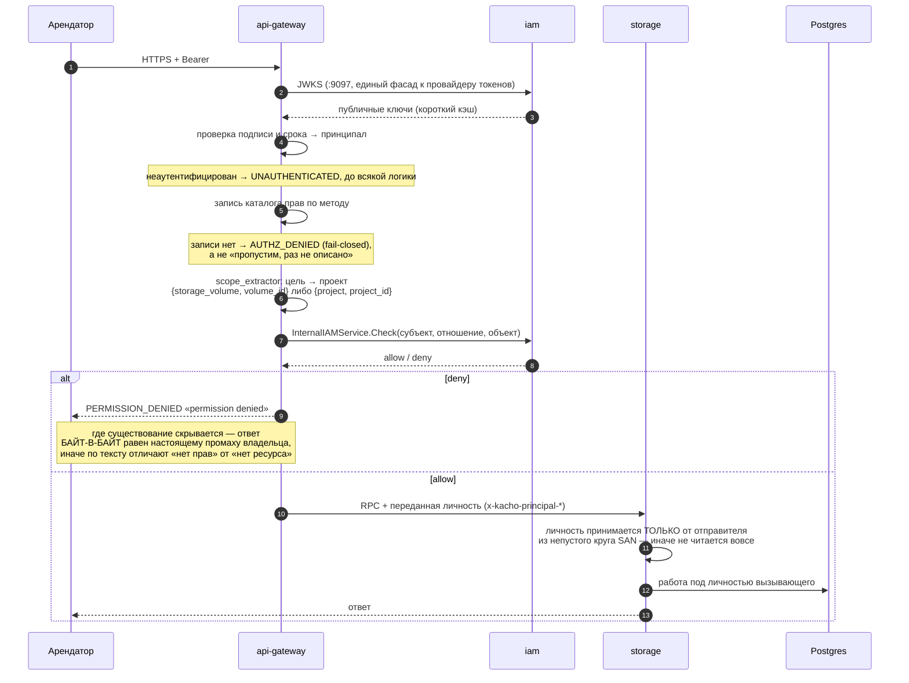

**Почему круг отправителей обязателен и непуст.** Проверенный сертификат доказывает, что
пир предъявил сертификат нашего центра, и **ничего** не говорит о том, за кого ему
позволено говорить. Пустой круг означает «не сужаем», а не «запрещаем»: переданную личность
примет любой проверенный пир. Боевой страж старта отказывает в старте при пустом круге.

### Список — сужение по данным, а не одним вопросом

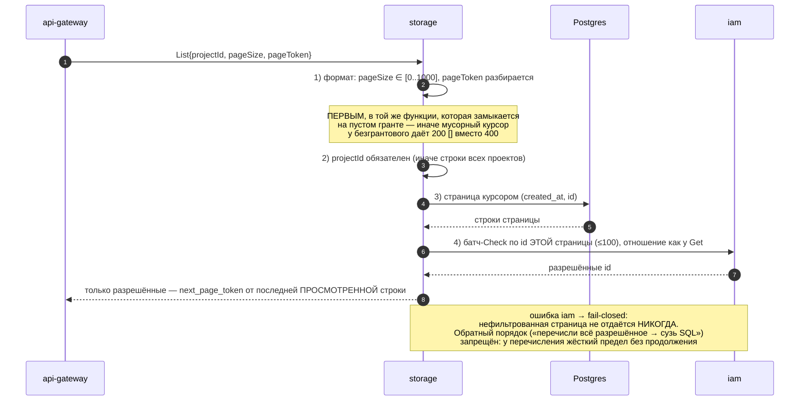

### Внутренний листенер (`:9091`)

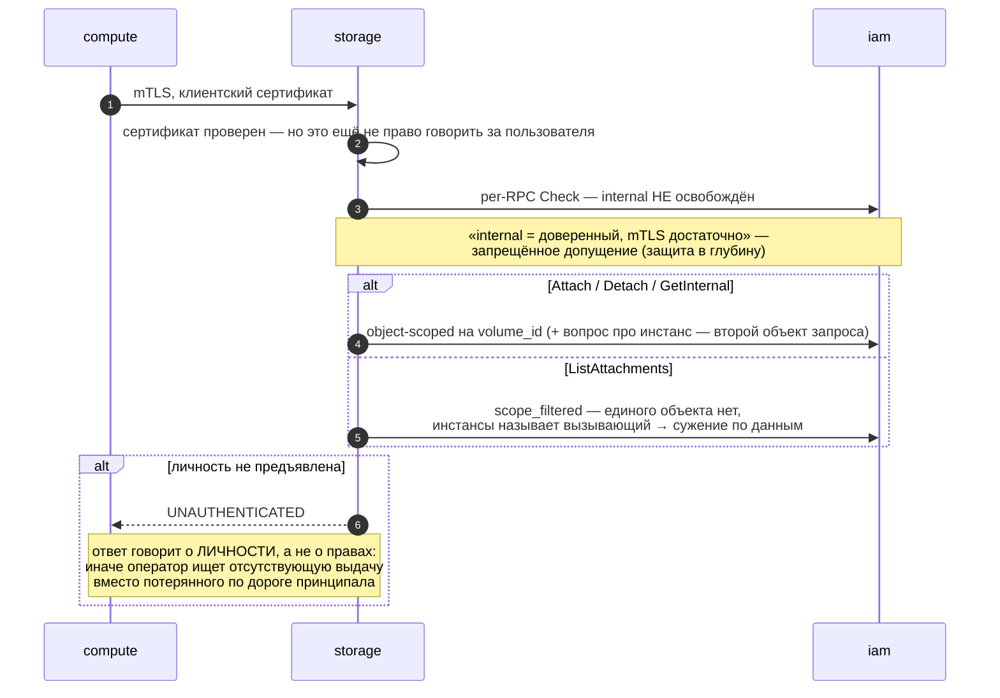

### Фоновые исполнители

Сверщик и исполнитель операций **не принимают решения о доступе** — они исполняют уже
авторизованное намерение. Отсюда три правила:

| Правило | Почему |
|---|---|
| К бэкенду фоновый исполнитель ходит под **личностью сервиса** | Бэкенд про наших принципалов не знает и знать не должен |
| Инициатор берётся из строки операции (`principalType`/`principalId`) | Асинхронное продолжение несёт личность **инициатора**, захваченную в момент запроса |
| Аудит пишет **обоих** — актора и того, от чьего имени | Иначе теряется ответственность: «сервис удалил том» не отвечает на вопрос, кто это заказал |

Повышения прав в фоне не происходит: намерение уже прошло проверку на пути запроса, и
сверщик не может создать то, чего арендатор не заказывал.

## 6.3. Создание тома

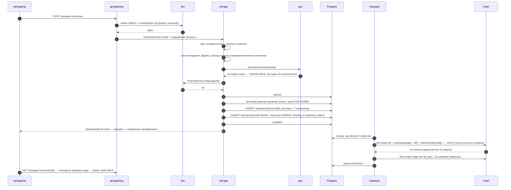

**Почему операция завершается до похода в Ceph.** Функция операции исполняется под потолком
в 4 минуты, а разрешитель осиротевших операций через 5 минут признаёт строку завершённой,
читая **нашу** БД. Если бы провижининг шёл внутри функции, толстое выделение дольше четырёх
минут дало бы арендатору **ложное «готово»** при отсутствующем объекте. Поэтому предмет
операции — намерение, а исход провижининга несёт `status` ресурса.

## 6.4. Создание тома из образа (клон)

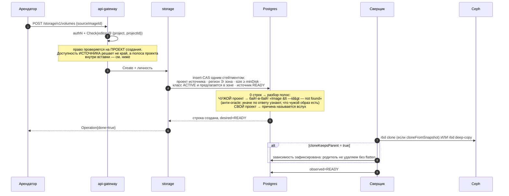

## 6.5. Удаление тома

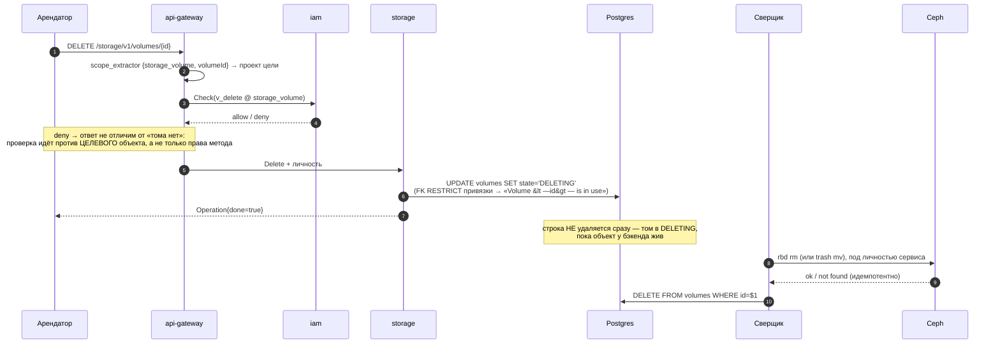

**Почему строка живёт до подтверждения.** Крах между снятием строки и снятием объекта
оставил бы **ёмкость, о которой в системе не осталось записи**, — а отвечает за неё чужая
команда, и найти утечку нечем.

> [!warning] Полоса удаления **`нет`**: у состояния `DELETING` нет производителя на пути запроса
> Диаграмма выше описывает намерение. В дереве `VolumeRepo.Delete` выполняет **немедленный
> `DELETE FROM volumes … RETURNING project_id`** в одной транзакции с намерением снять
> owner-tuple; шага «пометить `DELETING`» нет ни в use-case, ни в репозитории. То же у
> снимка и образа.
>
> **Вторая половина при этом доставлена и работает**: сверщик умеет ровно то, что нарисовано
> — сначала снимает объект, потом забывает строку, и это закреплено
> `TestCycle_DeletionRemovesTheObjectBeforeTheRow`. Но состояние `DELETING` в этой пробе
> проставляется **сырым SQL**, потому что из API его получить нельзя.
>
> Следствие, названное прямо: сегодня удаление тома снимает строку и **оставляет объект у
> бэкенда** — то есть даёт ровно ту утечку ёмкости, ради предотвращения которой полоса и
> проектировалась. Находит её только обход утечек, который by construction ничего не удаляет
> (§6.8). Пока плоскости данных нет, цена нулевая; она становится ненулевой в тот день, когда
> появляется кластер, — то есть раньше, чем кто-нибудь перечитает этот раздел.
>
> Сценарий приёмки STOR-P-28 покрыт наполовину: сверщиковую половину исполняет названная
> проба, полосу запроса — никто.

## 6.6. Смена класса

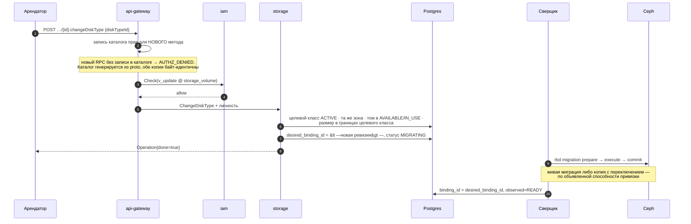

## 6.7. Привязка тома к машине (внутренний путь)

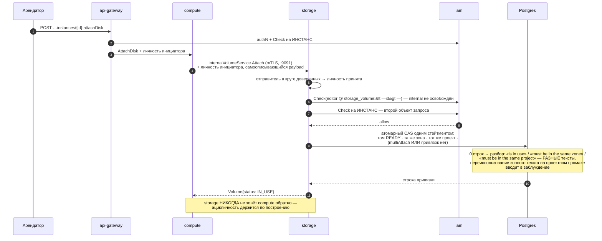

## 6.8. Сверка дрейфа — обе оси

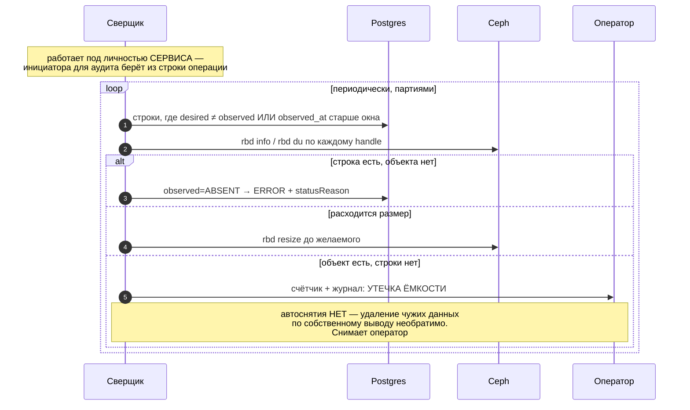

## 6.9. Правила, действующие на всех путях

| Правило | Формулировка |
|---|---|
| **AuthN и authZ — на каждом RPC обоих листенеров** | Внутренний периметр не доверенный. Отсутствие записи в каталоге прав — отказ, а не пропуск |
| **Личность принимается только от доверенного отправителя** | Непустой круг SAN + боевой страж старта, отказывающий при пустом |
| **Отказ не раскрывает существование** | Там, где существование скрывается, текст **байт-в-байт** равен настоящему промаху владельца |
| **Безымянный вызывающий → `UNAUTHENTICATED`** | Ответ о личности, а не о правах |
| **Список сужается по данным** | Страница курсором → батч-вопрос про её id; ошибка модели прав → fail-closed |
| **Порядок проверок** | форма → пагинация → права → БД → бэкенд. Формат проверяется **в той же функции**, которая замыкается на пустом гранте |
| **Идемпотентность** | Имя объекта детерминировано (`<installPrefix>-<id>`); адаптер имя **выводит**, никогда не принимает из запроса |
| **Fail-closed** | Недоступность geo / iam / бэкенда на мутации → `UNAVAILABLE`, мутация не выполняется |
| **Отказ в правах не временный** | Повтор идентичного запроса не пройдёт; трактовать как transient значит вечно держать голову очереди |
| **Неклассифицированный ответ бэкенда** | Состояние «не смог классифицировать», терминально, наружу фиксированный `INTERNAL` |
| **Фон не решает о доступе** | Исполняет уже авторизованное намерение; аудит пишет актора и инициатора |
| **Сроки** | Каждый вызов несёт свой срок; сумма срока и повторов **строго внутри** бюджета операции |


# 7. Контракт интеграции с бэкендом

## 7.1. Порт адаптера

**Доставлено `+` целиком.** Порт — `services/storage/internal/blockbackend/port.go`
(интерфейс `Backend`: `Kind`, `Capabilities` и десять глаголов ниже); реализаций **две** —
Ceph-адаптер `internal/clients/cephrbd/` и дублёр `internal/blockbackend/fake/`; провязка —
`cmd/storage/backend_factories.go` + `internal/clients/backend_opener.go`, `switch` по виду
бэкенда в одном месте, как и объявлено. Что порт достижим **только** сверщиком, держит
отдельный гейт `TestBackendPortIsReachableOnlyFromTheReconciler`: без него порт со временем
прорастает в полосу запроса, и мутация арендатора начинает ждать кластер.

| Глагол | Вход | Семантика | Идемпотентность |
|---|---|---|---|
| `CreateVolume` | handle, размер, локатор, QoS | создать объект | по имени: существует с тем же размером → успех |
| `DeleteVolume` | handle | снять объект | отсутствует → успех |
| `ResizeVolume` | handle, новый размер | увеличить | размер уже ≥ → успех |
| `CreateSnapshot` | handle тома, handle снимка | снять снимок | существует → успех |
| `DeleteSnapshot` | handle | снять снимок | отсутствует → успех |
| `CloneVolume` | handle источника, handle цели, режим | клон либо полная копия — **по способности** | цель существует → успех |
| `CopySnapshot` | handle источника, целевой локатор | перенос между локаторами | цель существует → успех |
| `MigrateVolume` | handle, целевой локатор | смена локатора | по фазам, каждая идемпотентна |
| `Observe` | handle | `{exists, sizeBytes, usedBytes, state, parent}` | чтение |
| `ListObjects` | локатор, курсор | перечисление для сверки | чтение |

`Capabilities()` — **константы адаптера**, не протокол.

**Чего в порту нет намеренно:** привязки тома к машине. Отображение устройства — работа
узлового агента, у которого своя граница доверия и свои учётные данные к бэкенду. Втащив
её в адаптер, control plane отрастил бы ногу в плоскость данных.

**Контрактная суита — 47 случаев** (`internal/blockbackend/contract/cases.go`), и она
устроена так, чтобы «прогнали» было отличимо от «прогнали не всё»: `assertEveryVerbCovered`
требует случай на каждый глагол порта, `Report.WriteCensus` печатает, какая реализация
проверялась и сколько случаев исполнено, а пропуски считаются по причине
(`countReason`).

> [!warning] Суита гоняется против ОДНОЙ реализации из двух
> `contract.Run` вызывается ровно в одном месте дерева — `internal/blockbackend/fake/fake_test.go`
> (`TestFakeSatisfiesBackendContract`). Против Ceph-адаптера она **не исполняется**.
> Ceph-адаптер покрыт своими 12 пробами (`internal/clients/cephrbd/adapter_test.go`) с
> подставленным исполнителем команд — они проверяют, что́ именно сказано инструменту и как
> разобран его ответ, но **не тот же** набор утверждений, что суита.
>
> Почему это существенно: смысл INV-P6 («дублёр не снисходительнее настоящего») в том, чтобы
> **одна и та же** суита получила один и тот же ответ от обеих реализаций. Сегодня равенство
> держит одна точечная проба — `TestValidateRef_NoMoreLenientThanTheDouble`, — то есть
> свойство утверждается об одном срезе, а не о наборе. Сценарий STOR-P-58 в этой части
> **без исполнителя**.

## 7.2. Отображение понятий на Ceph

| Kachō | Ceph RBD |
|---|---|
| `Volume` | образ RBD в пуле/namespace |
| `backendObject` | `<installPrefix>-<volumeId>` |
| namespace | RBD namespace = функция `projectId` — **единица изоляции арендатора** |
| `DiskTypeBinding.locator.pool` | пул (для EC — плюс data-pool) |
| `Snapshot` | снимок RBD |
| `Image` | образ RBD в пуле образов, родитель клонов |
| Volume из Image/Snapshot | `rbd clone` (v2) либо `rbd deep-copy` — по способности |
| `sizeBytes` ↔ `usedBytes` | `rbd info` ↔ `rbd du` |
| Resize | `rbd resize` |
| `ChangeDiskType` | `rbd migration prepare/execute/commit` |
| Delete | `rbd rm` либо `rbd trash mv` |
| QoS | `rbd config image set rbd_qos_*` |
| `cloneKeepsParent` | clone v2: родитель уходит в trash и освобождается после flatten детей |

## 7.3. Классификация отказов бэкенда

**Доставлено `+`.** Закрытый набор из восьми полос — `blockbackend/outcome.go`, нулевое
значение `OutcomeUnclassified` означает «не классифицировано», терминально, наружу
фиксированный `INTERNAL`. Корзины «прочее» нет by construction: `Valid()` очерчивает
диапазон, `Retryable()` объявляет повторяемой **ровно одну** полосу.

| Полоса дерева | Исход | Повторяем? | `statusReason` |
|---|---|---|---|
| `OutcomeUnavailable` | недоступен / таймаут | **да, единственная** | `BACKEND_UNAVAILABLE` |
| `OutcomeCapacityExhausted` | нет места | нет | `BACKEND_CAPACITY_EXHAUSTED` |
| `OutcomeDenied` | отказано в правах | **нет** | `BACKEND_REJECTED` |
| `OutcomeNotFound` | объекта нет (при удалении — успех) | — | — |
| `OutcomeConflict` | объект есть, параметры расходятся | нет | `BACKEND_REJECTED` |
| `OutcomeRejected` | отказ по существу запроса | нет | `BACKEND_REJECTED` |
| `OutcomeMisconfigured` | не тот эндпоинт / не тот формат — **настройка** | нет | `BACKEND_REJECTED` |
| `OutcomeUnclassified` | не классифицирован | нет | `INTERNAL_ERROR` |

«Не тот эндпоинт» — это **настройка**, а не сбой: мягкий проход по ней превратил бы
постоянную неправильную конфигурацию в штатный режим, при котором контроль присутствует и
не отказал ни разу за всю жизнь. Поэтому у неё **своя** полоса, а не общая с отказом:
`TestObserve_WrongOutputFormatIsMisconfiguration` и
`TestRun_ToolMissingIsMisconfigurationNotUnavailable` — обе про то, что настройку нельзя
списать на временную недоступность. Закрытость набора держат
`TestOutcome_ClosedSetWithoutCatchAll` и `TestOutcomeOf_AbsentClassificationIsNotAnAssumption`,
классификацию адаптера — `TestClassify_ClosedSetWithPairedControls`, а
`TestError_CarriesBackendTextForOperatorNotForTenant` держит границу: текст бэкенда живёт в
журнале оператора и **не** доезжает до арендатора.

## 7.4. Способности и их следствия

> [!warning] Этот раздел описывает НАМЕРЕНИЕ: ни одно следствие не энфорсится
> Способности класса **вычисляются и публикуются** (пересечение действующих ревизий, §3.5), а
> дублёр их **соблюдает** (`fake` отказывает на `snapshots=false` и т. п., и это проверено
> контрактной суитой). Но у самих операций storage проверки нет: `RequireCapability` не
> вызывается ни разу (§5.3), а `CloneKeepsParent` читается только сверщиком — для отметки
> `Detached`. То есть арендатор видит `snapshots: false` и всё равно получает попытку снять
> снимок, которая отвергнется **бэкендом**, а не нами и не тем текстом.
>
> Таблица оставлена как контракт роста, а не удалена: она называет, какой отказ обязан
> появиться у каждой способности, и без неё следующая реализация изобретёт свой тон.

| Способность | Если `false` — целевое поведение | Сегодня |
|---|---|---|
| `snapshots` | `Snapshot.Create` → `FAILED_PRECONDITION "DiskType <id> does not support snapshots"` | `нет` |
| `cloneFromSnapshot` / `cloneFromImage` | засев тома из источника отвергается тем же тоном | `нет` |
| `onlineGrow` | `Update{sizeBytes}` требует отсутствия привязок | `нет` |
| `multiAttach` | вторая привязка → `Volume <id> is in use` | **`есть`** — единственная энфорсящаяся: предикат attach-CAS читает `cap_multi_attach` (§4.4) |
| `encryptionAtRest` | класс не публикует шифрование | **`есть`** — публикация идёт пересечением ревизий |
| `cloneKeepsParent` = `true` | удаление источника с живыми детьми → `Volume <id> has dependent clones` | `нет` |
| `trashTtlSeconds` > 0 | ёмкость освобождается отложенно — учитывается в потреблении проекта | `нет` (потребления проекта нет вовсе — §12) |

## 7.5. Что просим у команды Ceph — до кода

Ответы на эти вопросы **блокируют** решения выше и не выводятся нами.

| Вопрос | Что от него зависит |
|---|---|
| Идемпотентен ли create/delete по нашему имени объекта | вся дисциплина повторов |
| Зависим ли клон от родителя (clone v2 / flatten) | семантика удаления источника, §7.4 |
| Как сообщается исчерпание места | `RESOURCE_EXHAUSTED` против `INTERNAL` |
| Есть ли trash и с каким TTL | учёт ёмкости, окно реклейма |
| Единица изоляции арендатора (namespace/пул) и кто её создаёт | §7.2, §9.3 |
| Пределы: размер, число объектов, скорость создания | границы класса |
| SLA на длительность создания | бюджет срока вызова |
| Область и ротация учётных данных | §9.4 |
| Сигнал деградации — есть или опрашиваем сами | наблюдаемость |

---

# 8. Структура БД

Схема `kacho_storage`. Ниже — состояние **после ветки**; изменения относительно базы
помечены. Всё, что показано, применено миграциями `0014`…`0022` — **кроме одного места,
названного врезкой ниже**.

## 8.1. Таблицы

```sql
-- storage_backends  (+)  — зарегистрированный бэкенд
CREATE TABLE storage_backends (
    id              text PRIMARY KEY,                      -- 'sb-<crockford>'
    name            text NOT NULL,
    kind            text NOT NULL,                         -- CEPH_RBD | …
    zone_ids        jsonb NOT NULL DEFAULT '[]'::jsonb,
    endpoint        text NOT NULL,                         -- непрозрачная координата
    credentials_ref text NOT NULL,                         -- ССЫЛКА, не секрет
    status          text NOT NULL DEFAULT 'ACTIVE',
    created_at      timestamptz NOT NULL DEFAULT now(),
    updated_at      timestamptz NOT NULL DEFAULT now(),
    CONSTRAINT storage_backends_kind_check   CHECK (kind IN ('CEPH_RBD')),
    CONSTRAINT storage_backends_status_check CHECK (status IN ('ACTIVE','DRAINING','DISABLED')),
    CONSTRAINT storage_backends_zone_ids_arr CHECK (jsonb_typeof(zone_ids) = 'array')
);
CREATE UNIQUE INDEX storage_backends_name_uniq ON storage_backends (name);

-- disk_type_bindings  (+)  — НЕИЗМЕНЯЕМАЯ ревизия политики
CREATE TABLE disk_type_bindings (
    id            text PRIMARY KEY,                        -- 'dtb-<crockford>'
    disk_type_id  text NOT NULL REFERENCES disk_types(id)      ON DELETE RESTRICT,
    zone_id       text NOT NULL,
    backend_id    text NOT NULL REFERENCES storage_backends(id) ON DELETE RESTRICT,
    revision      int  NOT NULL,
    locator       jsonb NOT NULL,                          -- пул, шаблон namespace
    capabilities  jsonb NOT NULL,
    qos           jsonb NOT NULL DEFAULT '{}'::jsonb,
    status        text NOT NULL DEFAULT 'ACTIVE',
    created_at    timestamptz NOT NULL DEFAULT now(),
    CONSTRAINT dtb_status_check CHECK (status IN ('ACTIVE','SUPERSEDED')),
    CONSTRAINT dtb_revision_pos CHECK (revision > 0)
);
-- ровно одна действующая ревизия на (класс, зона)
CREATE UNIQUE INDEX dtb_active_uniq ON disk_type_bindings (disk_type_id, zone_id)
    WHERE status = 'ACTIVE';
CREATE UNIQUE INDEX dtb_revision_uniq ON disk_type_bindings (disk_type_id, zone_id, revision);
```

**Ревизии не редактируются и не удаляются.** Отсюда: ссылка тома на ревизию эквивалентна
копии политики, но нормализована — джойн не может «уехать», потому что цель неизменяема.

```sql
-- disk_types  (~)  — 0016
ALTER TABLE disk_types ADD COLUMN lifecycle       text NOT NULL DEFAULT 'ACTIVE';
ALTER TABLE disk_types ADD COLUMN min_size_bytes  bigint NOT NULL DEFAULT 0;
ALTER TABLE disk_types ADD COLUMN max_size_bytes  bigint NOT NULL DEFAULT 0;
ALTER TABLE disk_types ADD COLUMN size_step_bytes bigint NOT NULL DEFAULT 0;
-- имена ограничений в дереве — `*_known`, не `*_check`
ALTER TABLE disk_types ADD CONSTRAINT disk_types_lifecycle_known
    CHECK (lifecycle IN ('ACTIVE','DEPRECATED','RETIRED'));
ALTER TABLE disk_types ADD CONSTRAINT disk_types_tier_known
    CHECK (performance_tier IN ('','CAPACITY','BALANCED','FAST','SINGLE','IO_MAX'));
-- сверх плана: сами границы обязаны быть согласованы, иначе класс объявляет
-- невыполнимое условие и отказ приходит не оттуда, откуда ждут
ALTER TABLE disk_types ADD CONSTRAINT disk_types_size_bounds_not_negative CHECK (…);
ALTER TABLE disk_types ADD CONSTRAINT disk_types_size_bounds_ordered      CHECK (…);
ALTER TABLE disk_types ADD CONSTRAINT disk_types_size_bounds_on_step      CHECK (…);

-- volumes  (~)  — 0017 (+ 0020, 0022)
ALTER TABLE volumes ADD COLUMN binding_id          text REFERENCES disk_type_bindings(id) ON DELETE RESTRICT;
ALTER TABLE volumes ADD COLUMN desired_binding_id  text REFERENCES disk_type_bindings(id) ON DELETE RESTRICT;
ALTER TABLE volumes ADD COLUMN backend_object      text;
ALTER TABLE volumes ADD COLUMN backend_namespace   text NOT NULL DEFAULT '';
ALTER TABLE volumes ADD COLUMN observed_state      text NOT NULL DEFAULT 'ABSENT';
ALTER TABLE volumes ADD COLUMN observed_at         timestamptz;
ALTER TABLE volumes ADD COLUMN observed_size_bytes bigint;
ALTER TABLE volumes ADD COLUMN used_bytes          bigint;
ALTER TABLE volumes ADD COLUMN status_reason       text NOT NULL DEFAULT '';
ALTER TABLE volumes ADD CONSTRAINT volumes_observed_state_known
    CHECK (observed_state IN ('ABSENT','READY','ERROR','UNKNOWN'));
ALTER TABLE volumes ADD CONSTRAINT volumes_status_reason_known
    CHECK (status_reason IN ('','BACKEND_UNAVAILABLE','BACKEND_REJECTED',
                             'BACKEND_CAPACITY_EXHAUSTED','SOURCE_NOT_READY',
                             'PRECONDITION_FAILED','INTERNAL_ERROR'));
-- 0022: предикат уникальности исключает НЕПРИСВОЕННОЕ имя (пустая строка). 0017
-- объявил его как `IS NOT NULL` на колонке, которая NOT NULL DEFAULT '' — предикат
-- был тождественно истинен, и ВТОРОЙ ресурс без присвоенного имени падал
-- уникальностью: форма проверки была, содержания не было
CREATE UNIQUE INDEX volumes_backend_object_uniq
    ON volumes (backend_object) WHERE backend_object <> '';
-- рабочий список сверщика: не очередь, а частичный индекс по расхождению.
-- 0020 переопределяет его, добавив расхождение РЕВИЗИЙ (переезд класса)
CREATE INDEX volumes_drift_idx ON volumes (updated_at)
 WHERE state <> observed_state
    OR (desired_binding_id IS NOT NULL AND desired_binding_id IS DISTINCT FROM binding_id);

-- snapshots  (~)  — 0014 (зона), 0017, 0019 (пространство арендатора), 0021 (происхождение копии)
ALTER TABLE snapshots ADD COLUMN zone_id           text NOT NULL DEFAULT '';   -- (+) собственный якорь
ALTER TABLE snapshots ADD COLUMN binding_id        text REFERENCES disk_type_bindings(id) ON DELETE RESTRICT;
ALTER TABLE snapshots ADD COLUMN backend_object    text;
ALTER TABLE snapshots ADD COLUMN backend_namespace text NOT NULL DEFAULT '';
ALTER TABLE snapshots ADD COLUMN observed_state    text NOT NULL DEFAULT 'ABSENT';
ALTER TABLE snapshots ADD COLUMN observed_at       timestamptz;
ALTER TABLE snapshots ADD COLUMN status_reason     text NOT NULL DEFAULT '';
ALTER TABLE snapshots ADD COLUMN source_snapshot_id text;                      -- (+) 0021: копия помнит оригинал
ALTER TABLE snapshots ADD CONSTRAINT snapshots_source_at_most_one CHECK (…);

-- images  (~)  — 0017, 0019, 0021.  digest НЕ добавлен: решение владельца не принято (§11)
ALTER TABLE images ADD COLUMN binding_id        text REFERENCES disk_type_bindings(id) ON DELETE RESTRICT;
ALTER TABLE images ADD COLUMN backend_object    text;
ALTER TABLE images ADD COLUMN backend_namespace text NOT NULL DEFAULT '';
ALTER TABLE images ADD COLUMN observed_state    text NOT NULL DEFAULT 'ABSENT';
ALTER TABLE images ADD COLUMN observed_at       timestamptz;
ALTER TABLE images ADD COLUMN status_reason     text NOT NULL DEFAULT '';
ALTER TABLE images ADD COLUMN source_image_id   text;                          -- (+) 0021

-- volume_attachments  (~)  — 0018: PK меняется, инвариант переезжает в предикат CAS
ALTER TABLE volume_attachments DROP CONSTRAINT volume_attachments_pkey;
ALTER TABLE volume_attachments ADD PRIMARY KEY (volume_id, instance_id);
-- сохраняются: UNIQUE(instance_id, device_name); EXCLUDE (instance_id WITH =) WHERE is_boot
```

> [!warning] `state` → `desired_state` — **`нет`**: колонка не переименована
> Прежняя редакция показывала `ALTER TABLE volumes RENAME COLUMN state TO desired_state` и
> объясняла, почему это идёт expand→contract. **Ни того, ни другого в дереве нет**: во всех
> девяти миграциях ветки нет ни одного `RENAME`, а прод-код читает `v.state` (attach-CAS,
> §4.4; разбор нулевого исхода; частичный индекс расхождения).
>
> Желаемое и наблюдаемое **разделены** — 0017 завела `observed_state` рядом, — то есть
> несущее решение §1.3 доставлено. Не доставлена только **вторая половина**: старое имя
> продолжает означать «желаемое», и это надо прочитать вслух, потому что колонка `state`
> рядом с колонкой `observed_state` читается как «состояние» против «наблюдаемого
> состояния», а не как «желаемое» против «наблюдаемого». Пока переименования нет, каждый
> новый запрос — место, где эти два прочтения могут разойтись.
>
> Оговорка про expand→contract остаётся нормой на день, когда переименование будут делать:
> одношаговый `RENAME` даёт окно, в котором прежние поды читают колонку, которой уже нет.

## 8.2. Что остаётся без изменений

`operations` (corelib), `fga_register_outbox` + его дренаж, partial `UNIQUE(project_id,
name) WHERE name<>''` на трёх ресурсах, FK-набор происхождения, курсорные индексы
`(created_at, id)`.

**Очередь намерений не заводится.** Её роль исполняет таблица `operations` (строка
коммитится до работы) плюс частичный индекс расхождения. Отдельный outbox уже
существовал, не имел потребителя и был снят — и урок оттуда прямой: очередь вводится в
той же миграции, что и её потребитель.

## 8.3. Миграции — что применено

Планировалось семь, применено **девять**; порядок и состав разошлись с планом, и таблица
приведена к дереву. Расхождение не косметическое: план ставил снятие посева и словарь яруса
в разные миграции, а дерево свело их в одну — снимать посев отдельно от нормализации яруса
означало бы оставить окно, в котором ограничение словаря уже стоит, а значения старого
формата ещё живут.

| № | Файл | Содержание | Может ли упасть на живом стенде |
|---|---|---|---|
| 0014 | `snapshot_zone_anchor` | `snapshots.zone_id` + обратная засыпка из `source_volume_id`, частичный индекс | нет |
| 0015 | `storage_backends_and_bindings` | обе таблицы, два частичных уникальных индекса, индекс по бэкенду | нет |
| 0016 | `disk_type_policy` | **снятие посева** (условный `DELETE … AND NOT EXISTS (… volumes …)`) + `lifecycle`, границы, нормализация и словарь яруса | безусловный `DELETE` упёрся бы в FK RESTRICT и уронил старт; нормализующий `UPDATE` идёт **до** ограничения — в той же миграции |
| 0017 | `resource_binding_and_observed` | `binding_id`/`desired_binding_id`/`backend_object`/наблюдаемые колонки/`status_reason`/`used_bytes` на трёх ресурсах | нет |
| 0018 | `volume_attachments_multi` | PK → `(volume_id, instance_id)` | нет |
| 0019 | `snapshot_image_backend_namespace` | `backend_namespace` у снимка и образа — координата достраивается **своей** колонкой, а не через источник, который обнуляется | нет |
| 0020 | `volume_migration_drift` | переопределение `volumes_drift_idx`: переезд класса виден сверщику как расхождение ревизий | нет |
| 0021 | `copy_provenance` | `source_snapshot_id` / `source_image_id` — происхождение **копии** | нет |
| 0022 | `backend_object_uniq_excludes_unassigned` | починка тождественно-истинного предиката уникальности из 0017 | нет |

Применённые миграции не редактируются — 0022 это и иллюстрирует: дефект предиката из 0017
закрыт **новой** миграцией, а не правкой прежней. Переименование колонки состояния, когда
до него дойдёт очередь, пойдёт тем же порядком (см. врезку в §8.1).

---

# 9. Безопасность

## 9.1. Правила, одинаковые для обоих листенеров

AuthN — mTLS (service→service) либо TLS+JWT (user→край). AuthZ — per-RPC `Check` на
**каждом** RPC обоих листенеров. «Internal = доверенный, mTLS достаточно» — запрещённое
допущение.

## 9.2. Что никогда не выходит на публичную поверхность

Координата бэкенда · пул · namespace · имя объекта · ревизия привязки · родитель клона ·
любые числа инфраструктуры. Держится гейтом проекции, и гейт **расширен со значений** `+`
(`TestValueGateGoesRedOnALeak` — подстановка инфра-значения в ответ обязана краснеть;
`TestProjectionGateHasItsSubject` — у гейта есть предмет). Канал, о котором предупреждала
прежняя редакция, закрыт **у источника**: ярус класса больше не свободная строка, а закрытое
перечисление, прежнее поле снято вместе с номером и именем.

Словарь `statusReason` — часть той же границы: значения называют **наши полосы**, а не
физику (`BACKEND_UNAVAILABLE` … `INTERNAL_ERROR`, §3.2), и словарь держит ограничение БД, а
не соглашение.

## 9.3. Изоляция арендаторов

Единица изоляции — **namespace, выводимый из `projectId`**. Без неё все арендаторы класса
делят одно пространство имён у бэкенда, и любая ошибка в правах на стороне провайдера
становится межарендной. Шаблон namespace живёт в `locator` привязки — то есть в
internal-проекции.

Имя объекта **вычислимо** арендатором (он видит `id` тома). Следствия: авторизация нигде не
опирается на неугадываемость имени; адаптер имя **выводит**, не принимает; префикс
установки обязателен, иначе два развёртывания на одном кластере усыновят объекты друг
друга.

## 9.4. Учётные данные и отказ старта

**Доставлено `+`.** Ручки плоскости данных — свои, `default:""`, адрес **не выводится** из
чужого адреса. В боевом режиме `Config.Validate()` **отказывает в старте**, если: бэкенд не
объявлен вовсе; объявлен, а префикс установки пуст или неверной формы; пуст каталог ссылок
на учётные данные; неположителен срок вызова; неположителен такт сверщика. Все шесть
измерений и **их совместный** отказ держит
`services/storage/internal/config/blockbackend_guard_test.go` — десять проб, включая
`TestBootGuard_AllProblemsReportedInOneRun` (перечень печатается целиком за один прогон, а
не по одной проблеме за перезапуск) и `TestBootGuard_DevModeDoesNotRequireBackendKnobs`
(положительный контроль: без него отрицание зеленело бы на страже, отвергающем всё).

Перечень измерений стража обязан оставаться полным — измерение, которое композиционный
корень настраивает, а страж не проверяет, и есть тот класс, которым в него попадали дыры
раньше. Пообъектный сужатель списка проверяется отдельной парой
(`TestValidate_productionRefusesListFilterFailOpen` + `TestValidate_failOpenGuardIsArmedByTheScopeFilteredMarks`),
а каждое провязанное ребро к соседу — `TestEveryDialledPeerEdgeIsHeldByTheBootGuard`.

Секрет проходит **ссылкой** (`credentialsRef`), в БД и в API не попадает: форму ссылки
держит `domain.CredentialsRef.Validate` (проба — `storage_backend_test.go`, приёмка
STOR-P-12).

## 9.5. Аудит

Провайдер про наши принципалы не знает — значит «кто заказал операцию» способны записать
только мы. Аудит пишет актора и того, от чьего имени действие совершено.

**Сегодня — `нет`.** Строка операции инициатора несёт (`operations.Owner` =
`PrincipalType`/`PrincipalID`, corelib), и владение операцией энфорсится на чтении
(`TestListOperations_ReturnsOnlyCallerOwnRows`, `TestOperationGet_AnonymousContextGetsNotFound`).
Но **сверщик её не читает**: перепись по `services/storage/internal/reconciler/` даёт ноль
упоминаний принципала или инициатора. То есть к бэкенду фоновый исполнитель ходит под
личностью сервиса — как и требуется, — а вот «от чьего имени» в его записях не появляется, и
на вопрос «кто заказал это удаление» журнал сверщика не отвечает. Сценарий STOR-P-30 покрыт
только первой половиной.

---

# 10. Фазы и гейты

| Фаза | Содержание | Гейт выхода | Состояние |
|---|---|---|---|
| **Ф0. Контракт и модель данных, без бэкенда** | Всё, что не требует Ceph: снятие посева · `zoneId` снимка · наблюдаемые колонки · `binding`/`backend_object` · `statusReason` · предикаты готовности источника и состояния при ресайзе · паритет снимка · снятие `blockSize` · `lifecycle` и `update_mask` класса · словарь яруса · `capabilities` · PK привязок · расширение гейта проекции на значения · **фейковый адаптер в памяти + контрактная суита** | Пустой каталог — законное состояние в старте, гейте посадки и e2e. Вся Ф0 проверяется без Ceph | **доставлена**, кроме границ размера на `Create` (§3.2) и способностей как гейта (§7.4) |
| **Ф1. Ceph** | Порт + адаптер · ручки и страж старта · классификатор отказов · namespace по проекту · `Image.Register` · сверщик обеих осей · e2e на живом кластере | `values.prod` реально поднимается; сверщик находит внесённый вручную дрейф в обе стороны; ни одна операция не держит исполнителя дольше секунд | **доставлена без последнего пункта**: e2e на живом кластере не гонялось (кластера нет), гейт «операция не держит исполнителя» не написан |
| **Ф2. Второй бэкенд** | Второй адаптер за тем же портом | Публичный контракт не изменился ни на байт | не начата — и это по плану |
| **Ф3. Исполнители объявленной формы** | per-volume производительность · множественная привязка · шифрование · `ChangeDiskType` живой миграцией · `Copy` | каждый пункт входит, когда бэкенд объявил способность | **контракт `ChangeDiskType`/`Copy` заведён вперёд исполнителя** — см. ниже |

**Гейт, отличающий целевой вид от MVP:** ни один пункт Ф1–Ф3 не требует **ломающего**
изменения публичного контракта. Требует — значит это не рост, а недоделанная форма, и его
место в Ф0. Этот гейт **держится**: `ChangeDiskType` и оба `Copy` объявлены сейчас именно
затем, чтобы завтра их не пришлось вводить сменой формы; множественная привязка получила
свой ключ и предикат сейчас, а не «когда понадобится».

> [!note] Цена того же решения, названная честно
> Объявить контракт вперёд исполнителя — правильно, но у этого есть плата, и она уже
> наступила: три глагола Ф3 (`ChangeDiskType`, `Snapshot.Copy`, `Image.Copy`) стоят в
> публичном контракте, провязаны до репозитория и **не имеют ни одной пробы** (§3.1).
> Арендатор их видит, край их маршрутизирует, каталог прав их пропускает — а что они
> делают на самом деле, дерево не утверждает нигде.
>
> Это не аргумент против раннего контракта: без него ввод глагола был бы ломающим
> изменением. Это аргумент за то, что **объявление формы и её проба — один шаг, а не два**.

---

# 11. Открытые вопросы владельцу

Все пять **остаются открытыми**: ветка ни одного из них не закрывала, и ни один не решён
молча кодом. Правая колонка теперь называет и то, что об этом сегодня в дереве, — иначе
«открыт» неотличимо от «забыт».

| № | Вопрос | Почему нельзя решить без вас | В дереве сегодня |
|---|---|---|---|
| 1 | **`digest` у Image** — добавить у storage или снять обещание у compute? | Два места об одном предмете: `BootSource` публично обещает `img-…@sha256:…` и `resolvedDigest`, storage не публикует ничего. У RBD-образа естественного контентного дайджеста нет — придумать его, чтобы закрыть чужой комментарий, значит завести факт без источника | поля нет ни в контракте образа, ни в `RegisterImageRequest`, ни колонкой |
| 2 | **Владелец квот** | Лимиты нужны каждому сервису. Заведём здесь — заведут все и разойдутся. Предлагаю: лимит — платформенный домен, storage энфорсит и отдаёт потребление чтением | **энфорсмент заведён**: `KACHO_STORAGE_PROJECT_PROVISIONED_BYTES_LIMIT` (0 — предела нет) проверяется внутри стейтмента создания. **Чтение потребления — нет**: `InternalUsageService` не существует, то есть вторая половина предложения не исполнена |
| 3 | **Семантика `IN_USE`** | «привязка объявлена» против «устройство отображено на узле». Предлагаю первое; второе — предмет compute | принято первое: `AVAILABLE`/`IN_USE` выводятся из наличия строки привязки, отдельной колонкой не хранятся |
| 4 | **Владелец узлового агента** | Компонента нет ни в дереве, ни в перечне. Без него том создаётся, но в гостевой ОС не появляется — сквозной сценарий не закрывается этим планом | компонента по-прежнему нет; порт бэкенда привязку намеренно не содержит (§7.1) |
| 5 | **Публиковать ли `performance` до энфорсмента** | Предлагаю нет: число, которого никто не держит, — обещание без исполнителя | предложение **исполнено**: блока нет на публичном классе, числа живут на ревизии привязки (:9091) |

---

# 12. Что НЕ доставлено — перечень с причинами

Перечень заведён затем, чтобы «доставлено» имело границу. Каждая строка — предмет, признак
(чем установлено) и почему это не «мелочь». Строки упорядочены по тому, насколько дорого
обходится незнание о них, а не по разделам.

| № | Предмет | Признак в дереве | Почему это важно |
|---|---|---|---|
| 1 | **Регистрация бэкенда и ревизии привязки через API отвергается**: `id` не назначается ни на одном шаге | ноль присваиваний `ID` по обоим путям; `Validate()` требует непустой `id` первой строкой | Единственный объявленный способ завести плоскость данных — административный RPC — не работает. Стенд поднимается только потому, что посев идёт SQL-ом мимо API (§4.1) |
| 2 | **Три глагола без единой пробы**: `ChangeDiskType`, `Snapshot.Copy`, `Image.Copy` | `grep -rni changedisktype --include=*_test.go --include=*.py` → 0; то же для `Copy(` | Нарушение ban #12. Глагол в публичном контракте, о котором дерево не утверждает ничего |
| 3 | **У состояния `DELETING` нет производителя на пути запроса**: `Delete` снимает строку немедленно | `VolumeRepo.Delete` — `DELETE FROM volumes … RETURNING`; ни одного `SET state='DELETING'` в непробном дереве | Удаление тома оставит объект у бэкенда, как только кластер появится. Сверщик обратную полосу умеет — но состояние, с которого она начинается, никем не выставляется (§6.5) |
| 4 | **Границы размера класса не энфорсятся на `Volume.Create`** | предикат вставки читает `min/max/step` и не смотрит на них; `ValidateVolumeSize` — 0 прод-вызовов | Класс объявляет границы арендатору, и они не действуют. Юнит на метод при этом зелёный — «заголовок шире тела» (§3.2) |
| 5 | **Способности класса не гейтят ни одной операции** | `RequireCapability` — 0 прод-вызовов; `CloneKeepsParent` читается только сверщиком | Публикация способностей заводилась ровно затем, чтобы арендатор узнавал об отказе **до** вызова. Сегодня он узнаёт от бэкенда и не тем текстом (§7.4) |
| 6 | **`GetInternal` тома — `UNIMPLEMENTED`** | `VolumeRepo.GetInternal` → `ErrUnimplemented`; `VolumeInternal` = `reserved 2 to 15` | Оператору нечем посмотреть, где лежит том и что о нём видно, — при том что у образа это есть, а колонки у тома заведены (§4.6) |
| 7 | **`InternalUsageService` / `GetProjectUsage` не существует** | ноль вхождений в `proto/` и `services/storage/` | Квота энфорсится, но посмотреть потребление проекта нечем: отказ «предел исчерпан» приходит без способа узнать, сколько занято (§11, вопрос 2) |
| 8 | **Префиксы `sb-`/`dtb-` не внесены в `ids.KnownHyphenPrefixes()`** | `pkg/ids/` веткой не тронут; в `hyphenFormPrefixes` этих значений нет | Сегодня безвредно (роутер на этих путях не зовётся), но требование объявлено там же, где не выполнено, — §2.2 |
| 9 | **Контрактная суита адаптера гоняется против одной реализации из двух** | `contract.Run` вызывается один раз — из проб дублёра | INV-P6 утверждает равенство дублёра и настоящего; сегодня его держит одна точечная проба, а не суита (§7.1) |
| 10 | **Колонка `state` не переименована в `desired_state`** | ноль `RENAME` во всех девяти миграциях | Разделение желаемого и наблюдаемого доставлено, но имя старой колонки продолжает читаться как «состояние», а не «желаемое» (§8.1) |
| 11 | **Аудит не пишет инициатора фоновой работы** | ноль упоминаний принципала в `internal/reconciler/` | «Кто заказал это удаление» журнал сверщика не отвечает (§9.5) |
| 12 | **`backend capacity exhausted` и `Volume <id> has dependent clones` не производятся** | текстов нет в непробном дереве | Две строки нормативной таблицы ошибок были обещанием, а не контрактом (§5.3) |
| 13 | **Блок `performance` на публичном классе отсутствует** | поля нет в `disk_type.proto` | **Не дефект**: исполнение предложения из §11, вопрос 5. Внесено в перечень, чтобы отсутствие не приняли за пропуск |

**Как этим пользоваться.** Строки 1–5 меняют наблюдаемое поведение продукта и потому идут
первыми; 6–9 — про наблюдаемость и про то, чем свойство удержано; 10–12 — про то, что
документ обещал больше, чем дерево делает; 13 — про решение, а не про долг. Ни одна строка
не помечена маркером отложенной работы **в коде** — гейт `TestNoDeferredWorkInTheTree`
остаётся зелёным, и это осознанно: место такого перечня — здесь, где у него есть предмет и
причина, а не в исходнике, где за ним никто не отвечает.
