# kacho-storage — план продакшн-модуля: целевой API

**Статус:** план целевого вида. **Не** описание дерева.
**Ревизия дерева, относительно которой писалось:** `64ab0e65`.
**Первый бэкенд:** Ceph RBD (Tentacle 20.2).
**Координаты кода** в этом документе — относительно монорепо продукта (`project/kacho`), сам документ живёт в воркспейсе.

## Легенда пометок

Каждый элемент помечен отношением к текущему дереву. Документ, который этого не
различает, читается как утверждение о коде и становится ложью в первый же день.

| Знак | Значение |
|---|---|
| **`есть`** | приземлено в дереве на `64ab0e65` |
| **`+`** | добавляется этим планом |
| **`×`** | снимается этим планом (ломающее изменение, номер и имя резервируются) |
| **`~`** | существует, но меняет форму/семантику |

## Как читать по ролям

| Роль | Разделы |
|---|---|
| **Владелец** | §1 границы и решения · §11 открытые вопросы · §10 фазы |
| **Заказчик услуги (арендатор)** | §3 публичные методы · §5 валидация и ошибки · §6.1 состояния |
| **Администратор услуги** | §4 internal-методы · §7.5 что просим у команды Ceph · §9 безопасность · §10 эксплуатация |
| **Интегратор бэкенда** | §7 контракт адаптера · §6 сценарии · §8 схема БД |

---

# 1. Границы и решения

## 1.1. Что модуль делает

Владеет блочным хранением как **control plane**: жизненный цикл тома, снимка, образа,
каталог классов, авторитетное состояние привязок, когерентность размещения, квотирование
намерения. Плоскость данных **не наша** — её предоставляет внешний SDS.

## 1.2. Чего модуль не делает — и это не долг

| Не делает | Кто делает |
|---|---|
| Перенос, репликацию, восстановление, скраб блоков | бэкенд (Ceph) |
| Отображение тома на узле (map/unmap) | узловой агент плоскости данных — **отдельный компонент, в этом плане не проектируется** |
| Резервные копии | отдельный домен. Снимок в том же кластере — **не** резервная копия |
| Ключи шифрования арендатора | отдельный домен ключей |
| Лимиты/квоты как ресурс | платформенный домен. Storage **энфорсит** и отдаёт потребление чтением |
| Файловое и объектное хранение | другие домены |

## 1.3. Несущие решения

| Решение | Почему |
|---|---|
| **Ресурсов четыре, состав не меняется** | Volume · Snapshot · Image · DiskType. Каждый: один владелец, самостоятельный жизненный цикл, внешняя адресация по неизменяемому `id` |
| **Класс несёт политику, том — размер, зону и класс** | Ручек арендатора три. Числа производительности живут **формулой** в классе, а не константой: IOPS обычно функция размера, константа лжёт на краях диапазона |
| **Политика фиксируется ссылкой на НЕИЗМЕНЯЕМУЮ ревизию привязки** | Правка класса создаёт новую ревизию; старая живёт, пока на неё ссылаются. Правка справочника не может задним числом изменить свойства созданного тома |
| **Операция фиксирует намерение и возвращается** | `Operation.done` = «намерение закоммичено», как и требуют конвенции. Провижининг доводит сверщик. Снимает конфликт с 4-минутным потолком исполнителя операций и сохраняет верным контракт разрешителя осиротевших операций |
| **Желаемое отдельно от наблюдаемого** | Две колонки, а не одна. Дрейф между нашей строкой и бэкендом становится **находимым**, а не невидимым |
| **Класс тома изменяем — но отдельным глаголом** | Смена типа диска на месте — норма рынка. Объявить класс пожизненным значит заложить дефект, снятие которого потом = миграция по каждому тому |
| **Имя объекта у бэкенда = префикс установки + наш `id`** | Идемпотентность повтора by construction. Префикс — чтобы два развёртывания на одном кластере не усыновили объекты друг друга |
| **Способности публичны на классе** | Иначе арендатор узнаёт об отсутствии снимков отказом, уже написав код: ловушка наименьшего общего знаменателя переезжает в прод |
| **Каталог классов не сеется** | Класс — регистрация того, что реально даёт провайдер. Пустой каталог — законное состояние: пока класс не зарегистрирован, том не создаётся |

---

# 2. Ресурсы и связи

## 2.1. Карта

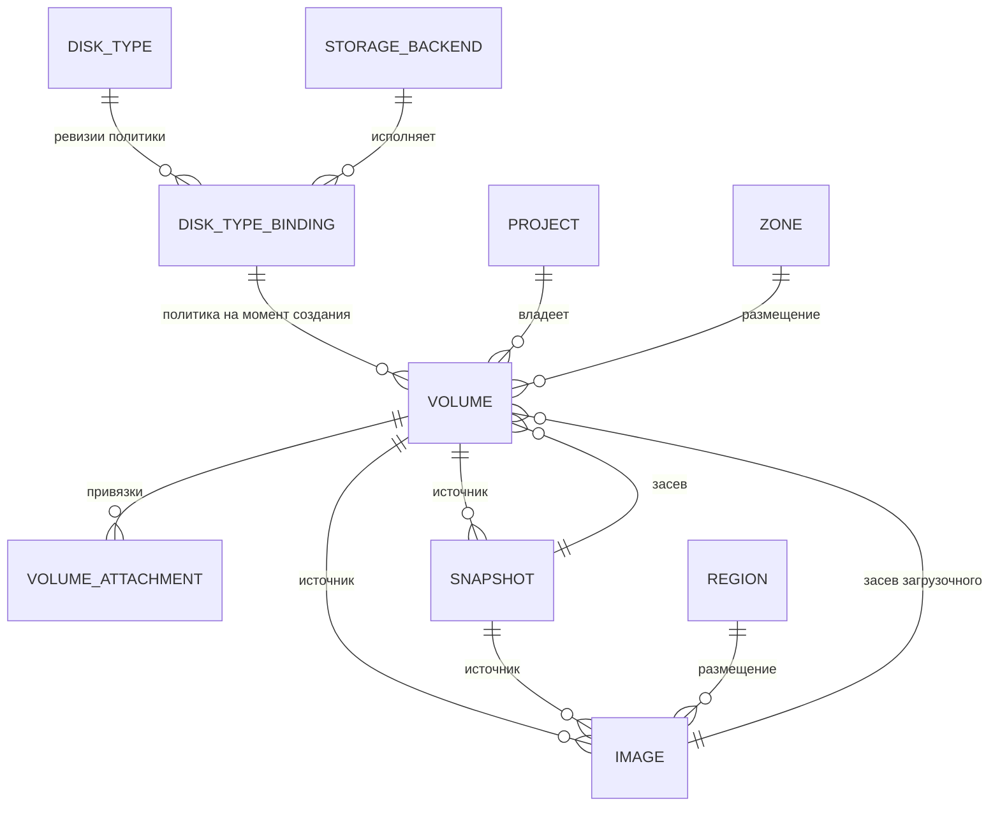

`PROJECT` — kacho-iam, `ZONE`/`REGION` — kacho-geo: ссылки TEXT без FK, валидируются
peer-вызовом владельца на пути запроса, fail-closed.

## 2.2. Владение и адресация

| Ресурс | Видимость | Префикс id | Размещение | Владелец |
|---|---|---|---|---|
| **Volume** `есть` | публичный | `vol` (legacy-форма) | ZONAL | storage |
| **Snapshot** `есть` | публичный | `snp` | ZONAL `+` (сегодня размещения не несёт) | storage |
| **Image** `есть` | публичный | `img` | REGIONAL (anycast) | storage |
| **DiskType** `есть` | публичный read + internal CRUD | admin-слаг | глобальный, скоупится `zone_ids` | storage |
| **StorageBackend** `+` | **только** internal | `sb-` (hyphen-канон) | привязан к зонам | storage |
| **DiskTypeBinding** `+` | **только** internal | `dtb-` | (класс × зона) | storage |
| **VolumeAttachment** `есть` | под-запись тома | своего id нет | наследует | storage |
| **Operation** `есть` | публичный | `sop` | — | corelib |

Новые префиксы `sb-`/`dtb-` обязаны попасть в `ids.KnownHyphenPrefixes()`, иначе роутер
идентификаторов их не классифицирует.

## 2.3. Целостность связей

| Связь | Механизм | Поведение при удалении цели |
|---|---|---|
| `volumes.disk_type_id → disk_types` | FK RESTRICT `есть` | класс с томами не удаляется |
| `volumes.binding_id → disk_type_bindings` `+` | FK RESTRICT | ревизия живёт, пока на неё ссылаются |
| `disk_type_bindings.backend_id → storage_backends` `+` | FK RESTRICT | бэкенд с привязками не удаляется |
| `volumes.source_snapshot_id → snapshots` | FK SET NULL `есть` | происхождение очищается, данные живут |
| `volumes.source_image_id → images` | FK SET NULL `есть` | то же |
| `snapshots.source_volume_id → volumes` | FK SET NULL `есть` | снимок переживает том |
| `images.source_*` | FK SET NULL `есть` | образ переживает источник |
| `volume_attachments.volume_id → volumes` | FK RESTRICT `есть` | привязанный том не удаляется |
| `project_id`, `zone_id`, `region_id`, `instance_id` | TEXT без FK `есть` | cross-service: peer-валидация на пути запроса |

**Важное следствие для клонов.** Если бэкенд объявил зависимость клона от родителя
(`clone_keeps_parent = true`), `SET NULL` на источнике перестаёт быть безобидным: наша
строка теряет связь, а у бэкенда родитель продолжает занимать место. Тогда удаление
источника переводится в **`FAILED_PRECONDITION`** до тех пор, пока дети не отвязаны
(`flatten`). Это поведение **выводится из способности**, а не выбирается нами — см. §7.4.

---

# 3. Публичные методы

## 3.1. Сводка

| Сервис | RPC | REST | Sync/Async | Отношение | Scope |
|---|---|---|---|---|---|
| VolumeService | `Get` `есть` | `GET /storage/v1/volumes/{volumeId}` | sync | `v_get` | `{storage_volume, volume_id}` |
| | `List` `есть` | `GET /storage/v1/volumes` | sync | `viewer` | `{project, project_id}` + пообъектное сужение |
| | `Create` `есть` | `POST /storage/v1/volumes` | async | `editor` | `{project, project_id}` |
| | `Update` `есть` | `PATCH /storage/v1/volumes/{volumeId}` | async | `v_update` | `{storage_volume, volume_id}` |
| | `Delete` `есть` | `DELETE /storage/v1/volumes/{volumeId}` | async | `v_delete` | `{storage_volume, volume_id}` |
| | `ListOperations` `есть` | `GET /storage/v1/volumes/{volumeId}/operations` | sync | `v_list` | `{storage_volume, volume_id}` |
| | **`ChangeDiskType`** `+` | `POST /storage/v1/volumes/{volumeId}:changeDiskType` | async | `v_update` | `{storage_volume, volume_id}` |
| SnapshotService | `Get`/`List`/`Create`/`Update`/`Delete` `есть` | `/storage/v1/snapshots…` | sync/async | как у тома | `{storage_snapshot, snapshot_id}` / `{project,…}` |
| | **`ListOperations`** `+` | `GET /storage/v1/snapshots/{snapshotId}/operations` | sync | `v_list` | `{storage_snapshot, snapshot_id}` |
| | **`Copy`** `+` | `POST /storage/v1/snapshots/{snapshotId}:copy` | async | `editor` @ `project` (из `projectId` тела) | `{project, project_id}` |
| ImageService | `Get`/`List`/`Create`/`Update`/`Delete`/`ListOperations` `есть` | `/storage/v1/images…` | sync/async | как у тома | `{storage_image, image_id}` |
| | **`Copy`** `+` | `POST /storage/v1/images/{imageId}:copy` | async | как у снимка | `{project, project_id}` |
| DiskTypeService | `Get`/`List` `есть` | `/storage/v1/diskTypes…` | sync | `viewer` @ `cluster` | глобальный каталог |

**Почему `ChangeDiskType` — отдельный глагол, а не поле в `Update`.** Это перемещение
данных, а не правка поля: оно длится, может отказать на половине и меняет физическое
расположение. В `update_mask` `diskTypeId` не входит **никогда** — попытка даёт
`INVALID_ARGUMENT "disk_type_id is immutable after Volume.Create"`, а глагол называется
явно.

## 3.2. Volume — поля

| Поле | Тип | Вход | Изменяемость | Валидация |
|---|---|---|---|---|
| `id` | string | — | output, immutable | `vol` + crockford |
| `projectId` | string | Create | immutable | required, ≤50, peer-validate → iam |
| `createdAt`/`updatedAt` | timestamp | — | output | усечены до секунд |
| `name` | string | Create/Update | mutable | `\|[a-z]([-_a-z0-9]{0,61}[a-z0-9])?`, `UNIQUE(project,name) WHERE name<>''` |
| `description` | string | Create/Update | mutable | ≤256 |
| `labels` | map | Create/Update | mutable (replace) | ≤64 пар, ключ 1-63 |
| `zoneId` | string | Create | **immutable** | required, ≤50, peer-validate → geo |
| `diskTypeId` | string | Create | **только `:changeDiskType`** `~` | required, класс `ACTIVE`, предлагается в зоне |
| `sizeBytes` | int64 | Create/Update | **увеличение только** | `>0`, в границах класса `+` |
| `blockSize` | int64 | — | — | **`×` снят**, `reserved 11, "block_size"` |
| `sourceSnapshotId` | string | Create | immutable | взаимоисключение с `sourceImageId` |
| `sourceImageId` | string | Create | immutable | то же |
| `status` | enum | — | output | см. §6.1 |
| **`statusReason`** `+` | enum | — | output | закрытый словарь **наших полос** |
| **`usedBytes`** `+` | int64 | — | output | наблюдённое; **не показывается**, если бэкенд его не сообщил |
| `attachments[]` | repeated | — | output | производное из `volume_attachments` |
| `usedBy[]` | repeated | — | output | обобщённая проекция привязок |

**Инфра-полей на публичном Volume нет и не будет:** координата бэкенда, пул, namespace,
имя объекта, ревизия привязки — **только** internal-проекция. Держится гейтом
`services/storage/internal/protoconv/protoconv_projection_test.go` (`есть`), который надо
расширить со **значений** — сегодня он читает только имена полей, а `performance_tier`
свободная строка, через которую `"nvme-fast"` проходит насквозь `+`.

### Create — запрос

```json
POST /storage/v1/volumes
{
  "projectId": "prj-4kq2n8xr1vm0d3c7f",
  "name": "pg-data-01",
  "description": "primary database volume",
  "labels": { "env": "prod", "app": "postgres" },
  "zoneId": "ru-central1-a",
  "diskTypeId": "block-balanced",
  "sizeBytes": 107374182400
}
```

### Create — ответ (Operation, `done=false`)

```json
{
  "id": "sop0h2k9r4tf8m1qwzxc",
  "description": "Create volume vol0a7b3c9d2e5f8g1hj",
  "createdAt": "2026-08-12T09:14:22Z",
  "done": false,
  "metadata": {
    "@type": "type.googleapis.com/kacho.cloud.storage.v1.CreateVolumeMetadata",
    "volumeId": "vol0a7b3c9d2e5f8g1hj"
  },
  "principalType": "user",
  "principalId": "usr-9m2k4p7q1z8x3c5vw"
}
```

> **Читать `metadata.volumeId` можно только при `done=true` И отсутствии `error`.**
> Идентификатор выделяется при **приёме** операции, поэтому на отказавшей операции он
> указывает на несуществующий ресурс.

### Get — ответ

```json
{
  "id": "vol0a7b3c9d2e5f8g1hj",
  "projectId": "prj-4kq2n8xr1vm0d3c7f",
  "createdAt": "2026-08-12T09:14:22Z",
  "updatedAt": "2026-08-12T09:14:25Z",
  "name": "pg-data-01",
  "labels": { "env": "prod", "app": "postgres" },
  "zoneId": "ru-central1-a",
  "diskTypeId": "block-balanced",
  "sizeBytes": 107374182400,
  "usedBytes": 12884901888,
  "status": "IN_USE",
  "attachments": [
    {
      "instanceId": "ins-3f7k9m2p5r8t1w4yz",
      "instanceName": "db-primary",
      "deviceName": "sdb",
      "isBoot": false,
      "mode": "READ_WRITE",
      "autoDelete": false,
      "attachedAt": "2026-08-12T09:20:03Z"
    }
  ],
  "usedBy": [
    { "referrer": { "type": "compute.instance", "id": "ins-3f7k9m2p5r8t1w4yz", "name": "db-primary" },
      "type": "USED_BY", "owned": false }
  ]
}
```

### Отказ провижининга — том в ERROR

```json
{
  "id": "vol0a7b3c9d2e5f8g1hj",
  "status": "ERROR",
  "statusReason": "BACKEND_CAPACITY_EXHAUSTED",
  "sizeBytes": 107374182400
}
```

`statusReason` — **закрытый словарь наших полос**, не таксономия бэкенда:
`BACKEND_UNAVAILABLE` · `BACKEND_REJECTED` · `BACKEND_CAPACITY_EXHAUSTED` ·
`SOURCE_NOT_READY` · `PRECONDITION_FAILED` · `INTERNAL`. Значений, называющих физику
(`POOL_FULL`, `REPLICA_DEGRADED`, `OSD_DOWN`), в словаре нет и быть не может.

### ChangeDiskType

```json
POST /storage/v1/volumes/vol0a7b3c9d2e5f8g1hj:changeDiskType
{ "diskTypeId": "block-fast" }
```

Возвращает `Operation`. Том переходит в `MIGRATING`, по завершении — `AVAILABLE`/`IN_USE`
с новым `diskTypeId`. Целевой класс обязан быть `ACTIVE` и предлагаться **в той же зоне**:
смена зоны глаголом не делается (`zoneId` неизменяем; перенос — через `Snapshot:copy`).

## 3.3. Snapshot — что меняется

| Поле | Статус | Замечание |
|---|---|---|
| **`zoneId`** `+` | output-only, immutable | Снимается с зоны исходного тома. Сегодня снимок размещения **не несёт**, и когерентность вырождается в тождественно-истинную при `source_volume_id IS NULL` |
| **`updatedAt`** `+` | output-only | Колонка в БД **есть**, в контракте нет — при живом `Update` |
| **`statusReason`** `+` | output-only | как у тома |
| **`usedBy[]`** `+` | output-only | какие тома засеяны этим снимком — нужно **до** удаления |
| **`ListOperations`** `+` | RPC | есть у тома и образа, у снимка нет |
| **`Copy`** `+` | RPC | единственный законный путь переноса данных между зонами/регионами |

> [!important] Права `Copy`: `editor@project`, а не чтение источника
> Первая редакция плана гейтила копирование чтением источника — «кто вправе
> читать, тот вправе снять копию». Это неверно, и разница не косметическая:
> копия есть НОВЫЙ ресурс (квота, имя, деньги), а роль наблюдателя материализует
> чтение на каждый объект проекта. Такой гейт отдал бы наблюдателю право
> неограниченно порождать ресурсы — повышение привилегии из чтения в запись,
> неотличимое в дифе от обычной строки каталога.
>
> Пообъектного «создать» в платформе нет by construction: этот вопрос всегда
> задают РОДИТЕЛЮ. Отсюда обязательный `projectId` в теле обоих запросов — он и
> есть объект вопроса, — и сверка его с проектом источника тоном промаха: чужая
> строка обязана быть неотличима от отсутствующей.

```json
POST /storage/v1/snapshots/snp5t8y2v4j7q1p3a6bc:copy
{ "targetZoneId": "ru-central1-b", "name": "pg-data-01-backup-b" }
```

Создаёт **новый** снимок в целевой зоне (`CREATING` → `READY`), исходный не трогает.

## 3.4. Image — что меняется

`statusReason` `+`, `usedBy[]` `+`, `Copy` `+` (между регионами).
`digest` — **открытый вопрос владельцу**, см. §11.
`Format {STANDARD}` не меняется: внешние форматы к нам не приезжают (см. §4.5).

## 3.5. DiskType — целевая форма

```json
{
  "id": "block-balanced",
  "name": "Balanced",
  "description": "General-purpose durable volume",
  "performanceTier": "BALANCED",
  "zoneIds": ["ru-central1-a", "ru-central1-b"],
  "lifecycle": "ACTIVE",
  "capabilities": {
    "snapshots": true,
    "cloneFromSnapshot": true,
    "cloneFromImage": true,
    "onlineGrow": true,
    "multiAttach": false,
    "encryptionAtRest": true
  },
  "limits": {
    "minSizeBytes": 1073741824,
    "maxSizeBytes": 17592186044416,
    "sizeStepBytes": 1073741824
  },
  "performance": {
    "baselineIops": 3000,
    "iopsPerGib": 30,
    "maxIops": 80000,
    "baselineThroughputMibps": 125,
    "throughputPerGibMibps": 0.5,
    "maxThroughputMibps": 1000
  }
}
```

| Элемент | Статус | Правило |
|---|---|---|
| `performanceTier` | `~` | **закрытый словарь** (`CAPACITY`/`BALANCED`/`FAST`/`SINGLE`/`IO_MAX`). Сегодня свободная строка — канал утечки мимо гейта проекции |
| `lifecycle` `+` | | `ACTIVE` → создание разрешено; `DEPRECATED` → существующие живут, новые нет; `RETIRED` → удаление разрешено при нуле томов |
| `capabilities` `+` | | публичны намеренно: иначе арендатор узнаёт об отсутствии способности отказом |
| `limits` `+` | | границы `sizeBytes`, энфорсятся на Create/Update |
| `performance` `+` | | **формула**, не константа. Публикуется **только если энфорсится** бэкендом; иначе блок отсутствует целиком |
| `Update` | `~` | переводится на `update_mask`. Сегодня full-replace без маски: один пропущенный `zoneIds` в теле обнуляет список |

**Каталог глобален** (`viewer` @ `cluster`) — его читает любой аутентифицированный
арендатор. Следствие, названное вслух: выделенного класса «для одного арендатора»
не существует, все классы видны всем.

---

# 4. Internal-методы (`:9091`, mTLS, не на external)

## 4.1. Сводка

| Сервис | RPC | Назначение | Отношение |
|---|---|---|---|
| `InternalDiskTypeService` `есть` | `Create`/`Update`/`Delete` | админ-каталог классов | `system_admin` @ `cluster` |
| | **`SetLifecycle`** `+` | вывод класса из обращения | `system_admin` |
| **`InternalStorageBackendService`** `+` | `Create`/`Get`/`List`/`Update`/`Delete` | регистрация бэкендов | `system_admin` |
| **`InternalDiskTypeBindingService`** `+` | `Create`/`Get`/`List`/`Supersede` | ревизии привязки класса к бэкенду | `system_admin` |
| `InternalVolumeService` `есть` | `Attach`/`Detach`/`ListAttachments` | сага привязки от compute | `editor` @ `storage_volume`, `ListAttachments` — `scope_filtered` |
| | `GetInternal` `~` | полная инфра-проекция тома | `viewer` @ `storage_volume` |
| `InternalImageService` `есть` | `GetInternal` `~` | инфра-проекция образа | `viewer` @ `storage_image` |
| | **`Register`** `+` | регистрация образа, внесённого провайдером | `system_admin` |
| **`InternalUsageService`** `+` | `GetProjectUsage` | потребление проекта для оператора | `system_admin` |

Все internal-RPC — **синхронные**: у админ-справочника нет длящейся работы, оборачивать её
в операцию значило бы заставлять администратора поллить готовое. Исключение —
`Image.Register`, если регистрация требует опроса бэкенда: тогда `Operation`.

## 4.2. StorageBackend

```json
POST /storage/v1/storageBackends        (internal mux)
{
  "name": "ceph-central-1",
  "kind": "CEPH_RBD",
  "zoneIds": ["ru-central1-a", "ru-central1-b", "ru-central1-c"],
  "endpoint": "cfg://ceph/central-1",
  "credentialsRef": "vault://kacho/storage/ceph-central-1",
  "status": "ACTIVE"
}
```

| Поле | Правило |
|---|---|
| `kind` | закрытый enum: `CEPH_RBD`, далее по мере адаптеров |
| `endpoint` | **непрозрачная координата**, разрешается конфигурацией процесса. В API не кладём ни monitor-адреса, ни пулы |
| `credentialsRef` | **ссылка**, не значение. Секрет никогда не проходит через API и не хранится в БД |
| `status` | `ACTIVE` / `DRAINING` (новые привязки нельзя) / `DISABLED` |

## 4.3. DiskTypeBinding — ревизия политики

```json
POST /storage/v1/diskTypeBindings        (internal mux)
{
  "diskTypeId": "block-balanced",
  "zoneId": "ru-central1-a",
  "backendId": "sb-7k2m9p4r1t8w3y6zb",
  "locator": { "pool": "kacho-block-balanced", "namespaceTemplate": "prj-{projectId}" },
  "capabilities": { "snapshots": true, "cloneFromSnapshot": true, "cloneKeepsParent": true,
                    "onlineGrow": true, "multiAttach": false, "encryptionAtRest": true,
                    "trashTtlSeconds": 86400 },
  "qos": { "baselineIops": 3000, "iopsPerGib": 30, "maxIops": 80000,
           "baselineThroughputMibps": 125, "throughputPerGibMibps": 0.5, "maxThroughputMibps": 1000 }
}
```

**Ревизии append-only.** `Create` новой привязки на ту же пару (класс, зона) автоматически
переводит прежнюю в `SUPERSEDED`; строки **никогда не редактируются и не удаляются**, пока
на них ссылается хоть один том. Отсюда: правка класса не может ретроактивно изменить
свойства уже созданных ресурсов — том ссылается на **неизменяемую** строку.

`locator` и `capabilities` — инфра-чувствительные, живут **только** здесь и в
`GetInternal`. На публичный `DiskType` из этой записи проецируются лишь `capabilities`
(булевы, без имён пулов) и `qos` → `performance`, и **только** если бэкенд их энфорсит.

## 4.4. Attach / Detach — что меняется

Контракт `есть` и остаётся: payload самоописывающийся (`instanceId`/`instanceName`/
`instanceZoneId`/`projectId`), storage валидирует **свою** строку и **никогда не зовёт
compute** — ацикличность держится по построению.

Меняется одно `~`: PK `volume_attachments` переходит с `volume_id` на
**`(volume_id, instance_id)`**, а инвариант «один привязанный инстанс» переезжает в
предикат CAS, читающий способность привязки:

```sql
INSERT INTO volume_attachments (...)
SELECT ...
 WHERE EXISTS (SELECT 1 FROM volumes v
                 JOIN disk_type_bindings b ON b.id = v.binding_id
                WHERE v.id = $1 AND v.desired_state = 'READY'
                  AND v.zone_id = $4 AND v.project_id = $5
                  AND (b.multi_attach OR NOT EXISTS (
                        SELECT 1 FROM volume_attachments a WHERE a.volume_id = $1)))
ON CONFLICT (volume_id, instance_id) DO NOTHING
RETURNING ...;
```

Смена PK — миграция на живой таблице, поэтому делается **сейчас**, а не когда понадобится
множественная привязка.

## 4.5. Image.Register — как образ попадает в облако

Единственный путь. Блоб-конвейера у нас нет и не проектируется: образ вносит в хранилище
команда провайдера вне облака, облако **регистрирует handle**.

```json
POST /storage/v1/images:register        (internal mux)
{
  "projectId": "prj-6h1n4s9v2y5b8e0k3",
  "regionId": "ru-central1",
  "name": "ubuntu-24-04-lts",
  "backendObject": "kc7f-img-ubuntu-2404-20260812",
  "sizeBytes": 21474836480,
  "minDiskBytes": 21474836480,
  "digest": "sha256:9f2b...c1"
}
```

Без этого метода **на чистой установке VM не запускается**: единственный источник ОС для
VM — `storage.image`, а публичный `Image.Create` создаёт образ только из тома или снимка,
которых на чистой установке нет.

## 4.6. GetInternal — инфра-проекция

Сегодня отвечает `UNIMPLEMENTED` — предмет отсутствует. Целевая форма заполняет
зарезервированный диапазон:

```json
{
  "volume": { "...публичная проекция..." },
  "bindingId": "dtb-2n5q8s1v4x7z0b3ef",
  "bindingRevision": 3,
  "backendId": "sb-7k2m9p4r1t8w3y6zb",
  "backendObject": "kc7f-vol0a7b3c9d2e5f8g1hj",
  "backendNamespace": "prj-4kq2n8xr1vm0d3c7f",
  "desiredState": "READY",
  "observedState": "READY",
  "observedAt": "2026-08-12T09:31:00Z",
  "observedSizeBytes": 107374182400,
  "parentObject": "kc7f-img-ubuntu-2404-20260812@base"
}
```

---

# 5. Валидация: границы и ограничения

## 5.1. Общие

| Предмет | Правило |
|---|---|
| Формат id | malformed → **первым стейтментом RPC** sync `INVALID_ARGUMENT "invalid <res> id '<X>'"`. Well-formed-но-нет → `NOT_FOUND` |
| Пагинация | `pageSize` 0→50, max 1000, вне диапазона — **отвергается**, не clamp'ится; `pageToken` opaque base64 `{created_at,id}`, мусор → `INVALID_ARGUMENT` |
| **Порядок** | валидация формата и пагинации — **ДО** сужения по правам, в **той же функции**, которая замыкается на пустом гранте |
| `filter` | whitelist, текущая фаза — `name=` |
| `update_mask` | unknown → `INVALID_ARGUMENT`; immutable → `"<field> is immutable after <R>.Create"` **до** проверки unknown; пустая маска → full-object PATCH mutable-полей |
| Timestamps | усечение до секунд во **всех** ответах, включая под-записи |
| Ошибка бэкенда | **никогда** не эхается: неклассифицированный ответ → фиксированный `internal error` |

## 5.2. Числовые границы

| Поле | Граница | Отказ |
|---|---|---|
| `sizeBytes` | `>0`; `>= diskType.limits.minSizeBytes`; `<= maxSizeBytes`; кратно `sizeStepBytes` `+` | `INVALID_ARGUMENT` |
| `sizeBytes` при Update | строго больше текущего | `Volume size can only be increased` |
| `sizeBytes` из образа | `>= image.minDiskBytes` | `Volume size %d is less than image min_disk_bytes %d` |
| `name` | ≤63, `^[a-z]([-a-z0-9]{0,61}[a-z0-9])?$`, пусто допустимо | `Illegal argument name` |
| `description` | ≤256 | `INVALID_ARGUMENT` |
| `labels` | ≤64 пар, ключ 1-63, значение ≤63 | `INVALID_ARGUMENT` |
| `pageSize` | 0..1000 | `INVALID_ARGUMENT` |

## 5.3. Нормативные тексты ошибок

Тексты — **часть контракта**, меняются только осознанно. Таблица приземлённых (`есть`)
воспроизводится из приёмки CS-1; новые помечены `+`.

| Текст | Код | Триггер |
|---|---|---|
| `invalid volume id '<X>'` | `INVALID_ARGUMENT` | malformed id первым стейтментом |
| `Volume <id> not found` | `NOT_FOUND` | well-formed-но-нет |
| `Illegal argument name` / `Illegal argument size_bytes` | `INVALID_ARGUMENT` | domain-validate |
| `unknown zone id '<X>'` | `INVALID_ARGUMENT` | peer geo вернул miss |
| `Project <id> not found` | `FAILED_PRECONDITION` | peer iam вернул miss |
| `volume with name <n> already exists in project` | `ALREADY_EXISTS` | partial UNIQUE |
| `Volume size can only be increased` | `INVALID_ARGUMENT` | размер-CAS |
| `<field> is immutable after Volume.Create` | `INVALID_ARGUMENT` | immutable в маске |
| `Volume <id> is in use` | `FAILED_PRECONDITION` | Delete привязанного / Attach занятого |
| `DiskType <id> is not offered in zone <zone>` | `FAILED_PRECONDITION` | класс не предлагается в зоне |
| `Volume and Instance must be in the same zone` | `FAILED_PRECONDITION` | zone-coherence в attach-CAS |
| `Volume and Instance must be in the same project` | `FAILED_PRECONDITION` | project-coherence — **отдельный** текст |
| `Volume and Image must be in the same region` | `FAILED_PRECONDITION` | зона тома ∉ регион образа |
| `Volume <id> is not ready` | `FAILED_PRECONDITION` | снимок с не-READY тома |
| `permission denied` | `PERMISSION_DENIED` | фикс. opaque, существование цели не раскрывается |
| `internal error` | `INTERNAL` | дефолт-ветка, никогда не эхает pgx/SQL |
| **`DiskType <id> is not accepting new volumes`** `+` | `FAILED_PRECONDITION` | класс `DEPRECATED`/`RETIRED` |
| **`DiskType <id> does not support <capability>`** `+` | `FAILED_PRECONDITION` | операция без объявленной способности |
| **`Snapshot <id> is not ready`** `+` | `FAILED_PRECONDITION` | засев из не-READY снимка/образа |
| **`storage quota exceeded for project <id>`** `+` | `RESOURCE_EXHAUSTED` | наш лимит |
| **`backend capacity exhausted`** `+` | `RESOURCE_EXHAUSTED` | отказ провайдера по месту; текст **нейтрален** |
| **`Volume <id> is not in a state that allows changing disk type`** `+` | `FAILED_PRECONDITION` | `ChangeDiskType` не из `AVAILABLE`/`IN_USE` |
| **`Volume <id> has dependent clones`** `+` | `FAILED_PRECONDITION` | удаление родителя при `cloneKeepsParent` |

## 5.4. gRPC → HTTP

Край не несёт своего отображения — статус выбирает grpc-gateway. `FAILED_PRECONDITION` —
это **400**, а не 412; 412 краем не производится ни для одного кода, поэтому кейс,
ожидающий 412, не имеет производителя.

| Код | HTTP | Код | HTTP |
|---|---:|---|---:|
| `OK` | 200 | `ALREADY_EXISTS` | 409 |
| `INVALID_ARGUMENT` | 400 | `RESOURCE_EXHAUSTED` | 429 |
| `FAILED_PRECONDITION` | **400** | `UNIMPLEMENTED` | 501 |
| `NOT_FOUND` | 404 | `UNAVAILABLE` | 503 |
| `PERMISSION_DENIED` | 403 | `INTERNAL` | 500 |
| `UNAUTHENTICATED` | 401 | | |

---

# 6. Бизнес-логика

## 6.1. Состояния

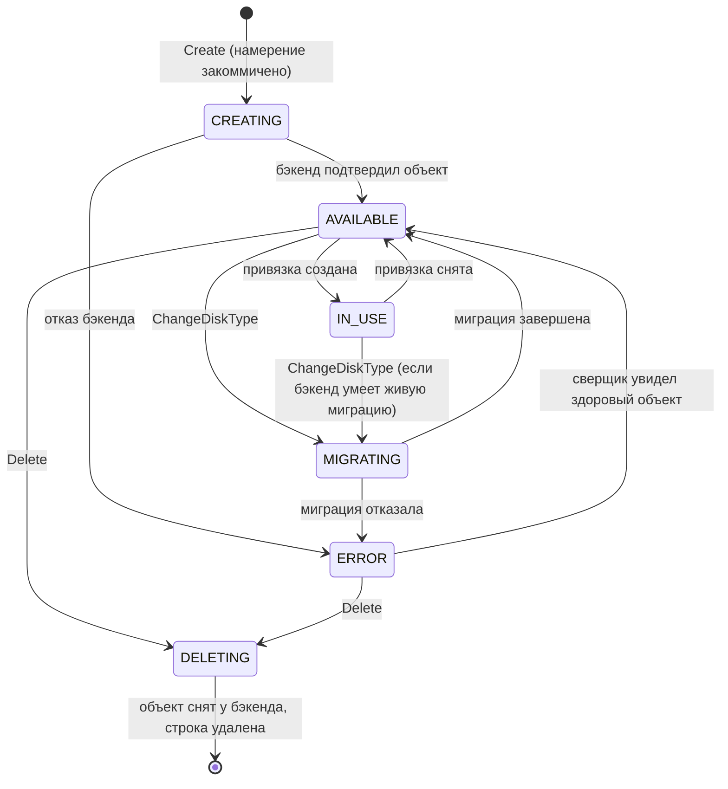

**`AVAILABLE`/`IN_USE` выводятся из наличия привязки** — отдельной колонкой не хранятся.
`CREATING`/`MIGRATING`/`DELETING`/`ERROR` — из пары «желаемое ≠ наблюдённое».

> **Что означает `IN_USE` — решение, которое надо принять до кода.** Сегодня контракт
> утверждает, что статус «не может разойтись с состоянием привязки». С появлением узлового
> агента появляются два разных факта: «привязка объявлена в control plane» и «устройство
> отображено на узле». `IN_USE` означает **первое**; утверждение о невозможности дрейфа
> относится к нему же и остаётся верным. Второе — предмет compute, не наш.

## 6.2. Полоса авторизации — одна на всех путях

Ниже она показана **развёрнуто один раз**; в сценариях §6.3–6.8 она присутствует
сжатым блоком `authN+authZ`. Пропуск этого блока в диаграмме означал бы, что проверки
нет, — поэтому он есть в каждом сценарии без исключения.

### Публичная поверхность (`:9090` через край)

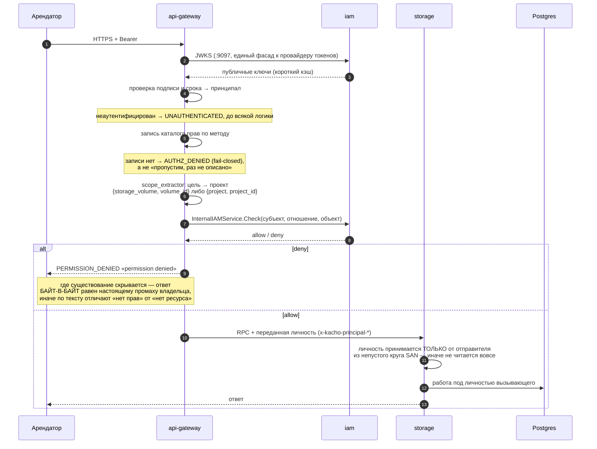

**Почему круг отправителей обязателен и непуст.** Проверенный сертификат доказывает, что
пир предъявил сертификат нашего центра, и **ничего** не говорит о том, за кого ему
позволено говорить. Пустой круг означает «не сужаем», а не «запрещаем»: переданную личность
примет любой проверенный пир. Боевой страж старта отказывает в старте при пустом круге.

### Список — сужение по данным, а не одним вопросом

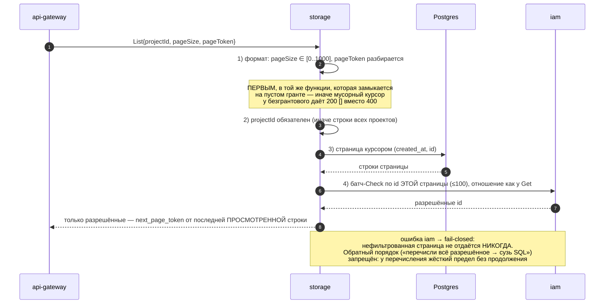

### Внутренний листенер (`:9091`)

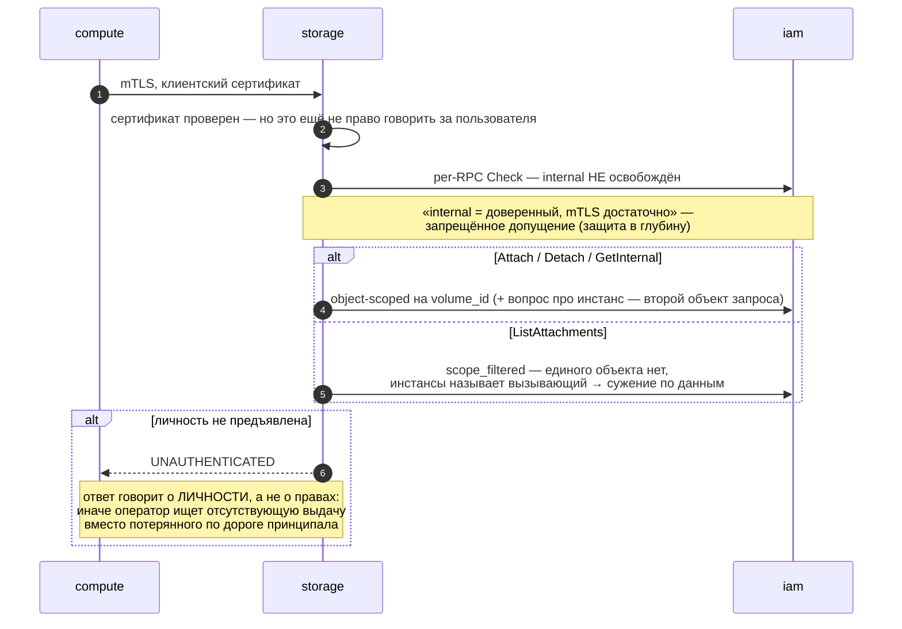

### Фоновые исполнители

Сверщик и исполнитель операций **не принимают решения о доступе** — они исполняют уже
авторизованное намерение. Отсюда три правила:

| Правило | Почему |
|---|---|
| К бэкенду фоновый исполнитель ходит под **личностью сервиса** | Бэкенд про наших принципалов не знает и знать не должен |
| Инициатор берётся из строки операции (`principalType`/`principalId`) | Асинхронное продолжение несёт личность **инициатора**, захваченную в момент запроса |
| Аудит пишет **обоих** — актора и того, от чьего имени | Иначе теряется ответственность: «сервис удалил том» не отвечает на вопрос, кто это заказал |

Повышения прав в фоне не происходит: намерение уже прошло проверку на пути запроса, и
сверщик не может создать то, чего арендатор не заказывал.

## 6.3. Создание тома

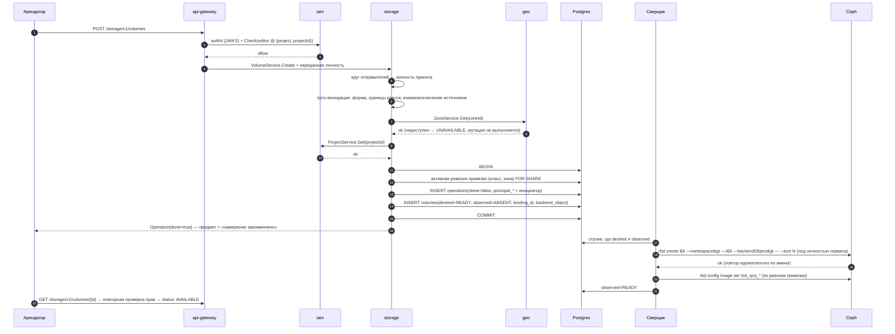

**Почему операция завершается до похода в Ceph.** Функция операции исполняется под потолком
в 4 минуты, а разрешитель осиротевших операций через 5 минут признаёт строку завершённой,
читая **нашу** БД. Если бы провижининг шёл внутри функции, толстое выделение дольше четырёх
минут дало бы арендатору **ложное «готово»** при отсутствующем объекте. Поэтому предмет
операции — намерение, а исход провижининга несёт `status` ресурса.

## 6.4. Создание тома из образа (клон)

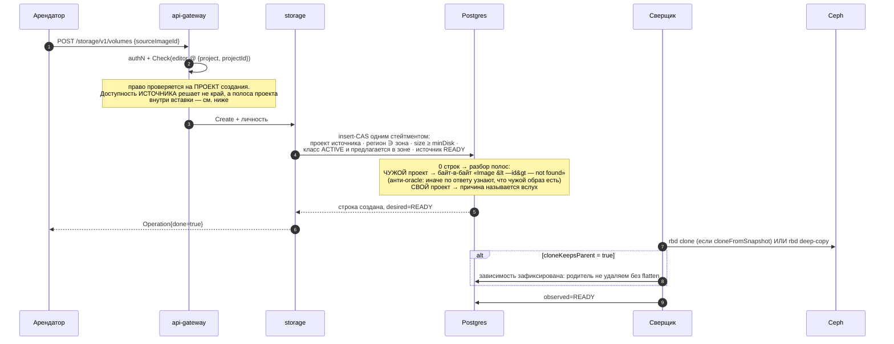

## 6.5. Удаление тома

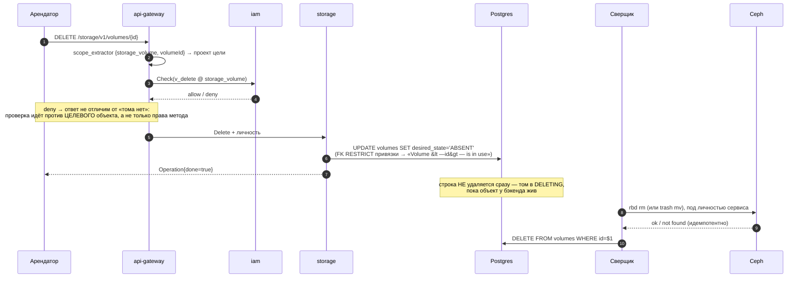

**Почему строка живёт до подтверждения.** Крах между снятием строки и снятием объекта
оставил бы **ёмкость, о которой в системе не осталось записи**, — а отвечает за неё чужая
команда, и найти утечку нечем.

## 6.6. Смена класса

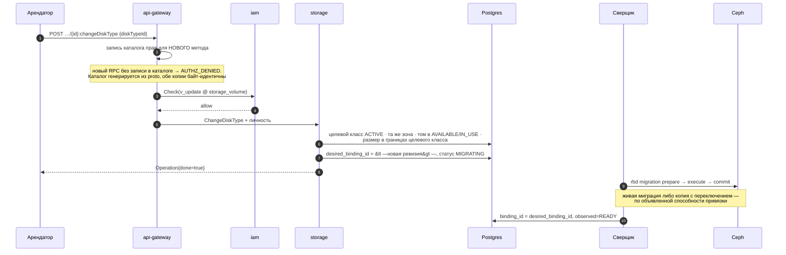

## 6.7. Привязка тома к машине (внутренний путь)

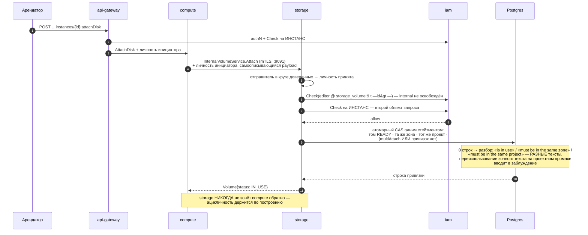

## 6.8. Сверка дрейфа — обе оси

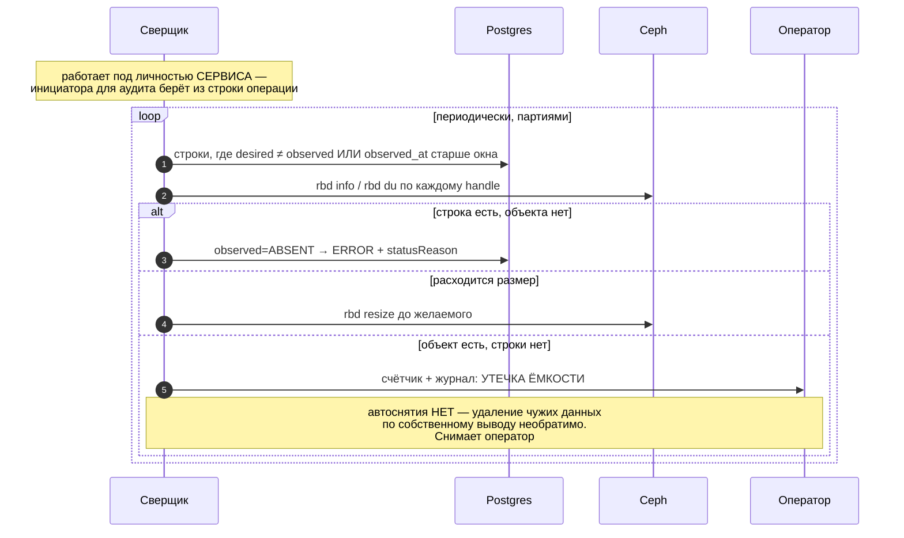

## 6.9. Правила, действующие на всех путях

| Правило | Формулировка |
|---|---|
| **AuthN и authZ — на каждом RPC обоих листенеров** | Внутренний периметр не доверенный. Отсутствие записи в каталоге прав — отказ, а не пропуск |
| **Личность принимается только от доверенного отправителя** | Непустой круг SAN + боевой страж старта, отказывающий при пустом |
| **Отказ не раскрывает существование** | Там, где существование скрывается, текст **байт-в-байт** равен настоящему промаху владельца |
| **Безымянный вызывающий → `UNAUTHENTICATED`** | Ответ о личности, а не о правах |
| **Список сужается по данным** | Страница курсором → батч-вопрос про её id; ошибка модели прав → fail-closed |
| **Порядок проверок** | форма → пагинация → права → БД → бэкенд. Формат проверяется **в той же функции**, которая замыкается на пустом гранте |
| **Идемпотентность** | Имя объекта детерминировано (`<installPrefix>-<id>`); адаптер имя **выводит**, никогда не принимает из запроса |
| **Fail-closed** | Недоступность geo / iam / бэкенда на мутации → `UNAVAILABLE`, мутация не выполняется |
| **Отказ в правах не временный** | Повтор идентичного запроса не пройдёт; трактовать как transient значит вечно держать голову очереди |
| **Неклассифицированный ответ бэкенда** | Состояние «не смог классифицировать», терминально, наружу фиксированный `INTERNAL` |
| **Фон не решает о доступе** | Исполняет уже авторизованное намерение; аудит пишет актора и инициатора |
| **Сроки** | Каждый вызов несёт свой срок; сумма срока и повторов **строго внутри** бюджета операции |


# 7. Контракт интеграции с бэкендом

## 7.1. Порт адаптера

Один интерфейс в слое use-case, одна реализация в `internal/clients/`, провязка в
композиционном корне — тем же порядком, каким уже сделаны `GeoClient` и `IAMClient`. Ни
реестра, ни протокола загрузки, ни конфигурируемой диспетчеризации: пока адаптеров мало,
`switch` по виду бэкенда в одном месте честнее механизма.

| Глагол | Вход | Семантика | Идемпотентность |
|---|---|---|---|
| `CreateVolume` | handle, размер, локатор, QoS | создать объект | по имени: существует с тем же размером → успех |
| `DeleteVolume` | handle | снять объект | отсутствует → успех |
| `ResizeVolume` | handle, новый размер | увеличить | размер уже ≥ → успех |
| `CreateSnapshot` | handle тома, handle снимка | снять снимок | существует → успех |
| `DeleteSnapshot` | handle | снять снимок | отсутствует → успех |
| `CloneVolume` | handle источника, handle цели, режим | клон либо полная копия — **по способности** | цель существует → успех |
| `CopySnapshot` | handle источника, целевой локатор | перенос между локаторами | цель существует → успех |
| `MigrateVolume` | handle, целевой локатор | смена локатора | по фазам, каждая идемпотентна |
| `Observe` | handle | `{exists, sizeBytes, usedBytes, state, parent}` | чтение |
| `ListObjects` | локатор, курсор | перечисление для сверки | чтение |

`Capabilities()` — **константы адаптера**, не протокол.

**Чего в порту нет намеренно:** привязки тома к машине. Отображение устройства — работа
узлового агента, у которого своя граница доверия и свои учётные данные к бэкенду. Втащив
её в адаптер, control plane отрастил бы ногу в плоскость данных.

## 7.2. Отображение понятий на Ceph

| Kachō | Ceph RBD |
|---|---|
| `Volume` | образ RBD в пуле/namespace |
| `backendObject` | `<installPrefix>-<volumeId>` |
| namespace | RBD namespace = функция `projectId` — **единица изоляции арендатора** |
| `DiskTypeBinding.locator.pool` | пул (для EC — плюс data-pool) |
| `Snapshot` | снимок RBD |
| `Image` | образ RBD в пуле образов, родитель клонов |
| Volume из Image/Snapshot | `rbd clone` (v2) либо `rbd deep-copy` — по способности |
| `sizeBytes` ↔ `usedBytes` | `rbd info` ↔ `rbd du` |
| Resize | `rbd resize` |
| `ChangeDiskType` | `rbd migration prepare/execute/commit` |
| Delete | `rbd rm` либо `rbd trash mv` |
| QoS | `rbd config image set rbd_qos_*` |
| `cloneKeepsParent` | clone v2: родитель уходит в trash и освобождается после flatten детей |

## 7.3. Классификация отказов бэкенда

Закрытый набор, **без корзины «прочее»**; нулевое значение — состояние «не
классифицировано», терминальное, наружу фиксированный `INTERNAL`.

| Исход | Наш код | Повторяем? | `statusReason` |
|---|---|---|---|
| недоступен / таймаут | `UNAVAILABLE` | да | `BACKEND_UNAVAILABLE` |
| нет места | `RESOURCE_EXHAUSTED` | нет | `BACKEND_CAPACITY_EXHAUSTED` |
| отказано в правах | `INTERNAL` (наружу), журнал — громко | **нет** | `BACKEND_REJECTED` |
| объект отсутствует (при удалении) | успех | — | — |
| объект уже существует (при создании) | успех, если параметры совпали | — | — |
| ответ не того формата / не тот эндпоинт | `INTERNAL`, **громко** | нет | `BACKEND_REJECTED` |
| не классифицирован | `INTERNAL` | нет | `INTERNAL` |

«Не тот эндпоинт» — это **настройка**, а не сбой: мягкий проход по ней превратил бы
постоянную неправильную конфигурацию в штатный режим, при котором контроль присутствует и
не отказал ни разу за всю жизнь.

## 7.4. Способности и их следствия

| Способность | Если `false` |
|---|---|
| `snapshots` | `Snapshot.Create` → `FAILED_PRECONDITION "DiskType <id> does not support snapshots"` |
| `cloneFromSnapshot` / `cloneFromImage` | засев тома из источника отвергается тем же тоном |
| `onlineGrow` | `Update{sizeBytes}` требует отсутствия привязок |
| `multiAttach` | вторая привязка → `Volume <id> is in use` |
| `encryptionAtRest` | класс не публикует шифрование |
| `cloneKeepsParent` = `true` | удаление источника с живыми детьми → `Volume <id> has dependent clones` |
| `trashTtlSeconds` > 0 | ёмкость освобождается отложенно — учитывается в потреблении проекта |

## 7.5. Что просим у команды Ceph — до кода

Ответы на эти вопросы **блокируют** решения выше и не выводятся нами.

| Вопрос | Что от него зависит |
|---|---|
| Идемпотентен ли create/delete по нашему имени объекта | вся дисциплина повторов |
| Зависим ли клон от родителя (clone v2 / flatten) | семантика удаления источника, §7.4 |
| Как сообщается исчерпание места | `RESOURCE_EXHAUSTED` против `INTERNAL` |
| Есть ли trash и с каким TTL | учёт ёмкости, окно реклейма |
| Единица изоляции арендатора (namespace/пул) и кто её создаёт | §7.2, §9.3 |
| Пределы: размер, число объектов, скорость создания | границы класса |
| SLA на длительность создания | бюджет срока вызова |
| Область и ротация учётных данных | §9.4 |
| Сигнал деградации — есть или опрашиваем сами | наблюдаемость |

---

# 8. Структура БД

Схема `kacho_storage`. Ниже — **целевое** состояние; изменения относительно приземлённого
помечены.

## 8.1. Таблицы

```sql
-- storage_backends  (+)  — зарегистрированный бэкенд
CREATE TABLE storage_backends (
    id              text PRIMARY KEY,                      -- 'sb-<crockford>'
    name            text NOT NULL,
    kind            text NOT NULL,                         -- CEPH_RBD | …
    zone_ids        jsonb NOT NULL DEFAULT '[]'::jsonb,
    endpoint        text NOT NULL,                         -- непрозрачная координата
    credentials_ref text NOT NULL,                         -- ССЫЛКА, не секрет
    status          text NOT NULL DEFAULT 'ACTIVE',
    created_at      timestamptz NOT NULL DEFAULT now(),
    updated_at      timestamptz NOT NULL DEFAULT now(),
    CONSTRAINT storage_backends_kind_check   CHECK (kind IN ('CEPH_RBD')),
    CONSTRAINT storage_backends_status_check CHECK (status IN ('ACTIVE','DRAINING','DISABLED')),
    CONSTRAINT storage_backends_zone_ids_arr CHECK (jsonb_typeof(zone_ids) = 'array')
);
CREATE UNIQUE INDEX storage_backends_name_uniq ON storage_backends (name);

-- disk_type_bindings  (+)  — НЕИЗМЕНЯЕМАЯ ревизия политики
CREATE TABLE disk_type_bindings (
    id            text PRIMARY KEY,                        -- 'dtb-<crockford>'
    disk_type_id  text NOT NULL REFERENCES disk_types(id)      ON DELETE RESTRICT,
    zone_id       text NOT NULL,
    backend_id    text NOT NULL REFERENCES storage_backends(id) ON DELETE RESTRICT,
    revision      int  NOT NULL,
    locator       jsonb NOT NULL,                          -- пул, шаблон namespace
    capabilities  jsonb NOT NULL,
    qos           jsonb NOT NULL DEFAULT '{}'::jsonb,
    status        text NOT NULL DEFAULT 'ACTIVE',
    created_at    timestamptz NOT NULL DEFAULT now(),
    CONSTRAINT dtb_status_check CHECK (status IN ('ACTIVE','SUPERSEDED')),
    CONSTRAINT dtb_revision_pos CHECK (revision > 0)
);
-- ровно одна действующая ревизия на (класс, зона)
CREATE UNIQUE INDEX dtb_active_uniq ON disk_type_bindings (disk_type_id, zone_id)
    WHERE status = 'ACTIVE';
CREATE UNIQUE INDEX dtb_revision_uniq ON disk_type_bindings (disk_type_id, zone_id, revision);
```

**Ревизии не редактируются и не удаляются.** Отсюда: ссылка тома на ревизию эквивалентна
копии политики, но нормализована — джойн не может «уехать», потому что цель неизменяема.

```sql
-- disk_types  (~)
ALTER TABLE disk_types ADD COLUMN lifecycle       text NOT NULL DEFAULT 'ACTIVE';
ALTER TABLE disk_types ADD COLUMN min_size_bytes  bigint NOT NULL DEFAULT 0;
ALTER TABLE disk_types ADD COLUMN max_size_bytes  bigint NOT NULL DEFAULT 0;
ALTER TABLE disk_types ADD COLUMN size_step_bytes bigint NOT NULL DEFAULT 0;
ALTER TABLE disk_types ADD CONSTRAINT disk_types_lifecycle_check
    CHECK (lifecycle IN ('ACTIVE','DEPRECATED','RETIRED'));
ALTER TABLE disk_types ADD CONSTRAINT disk_types_tier_check
    CHECK (performance_tier IN ('','CAPACITY','BALANCED','FAST','SINGLE','IO_MAX'));

-- volumes  (~)
ALTER TABLE volumes ADD COLUMN binding_id          text REFERENCES disk_type_bindings(id) ON DELETE RESTRICT;
ALTER TABLE volumes ADD COLUMN desired_binding_id  text REFERENCES disk_type_bindings(id) ON DELETE RESTRICT;
ALTER TABLE volumes ADD COLUMN backend_object      text;
ALTER TABLE volumes ADD COLUMN backend_namespace   text;
ALTER TABLE volumes ADD COLUMN observed_state      text NOT NULL DEFAULT 'ABSENT';
ALTER TABLE volumes ADD COLUMN observed_at         timestamptz;
ALTER TABLE volumes ADD COLUMN observed_size_bytes bigint;
ALTER TABLE volumes ADD COLUMN used_bytes          bigint;
ALTER TABLE volumes ADD COLUMN status_reason       text NOT NULL DEFAULT '';
ALTER TABLE volumes RENAME COLUMN state TO desired_state;   -- смысл колонки называется вслух
-- Переименование идёт expand→contract: сначала новая колонка + двойная запись,
-- затем переключение читателей, затем снятие старой. Одношаговый RENAME даёт окно,
-- в котором прежние поды читают колонку, которой уже нет.
ALTER TABLE volumes ADD CONSTRAINT volumes_observed_check
    CHECK (observed_state IN ('ABSENT','READY','ERROR','UNKNOWN'));
CREATE UNIQUE INDEX volumes_backend_object_uniq ON volumes (backend_object) WHERE backend_object IS NOT NULL;
-- рабочий список сверщика: не очередь, а частичный индекс по расхождению
CREATE INDEX volumes_drift_idx ON volumes (updated_at) WHERE desired_state <> observed_state;

-- snapshots  (~)
ALTER TABLE snapshots ADD COLUMN zone_id        text NOT NULL DEFAULT '';   -- (+) собственный якорь
ALTER TABLE snapshots ADD COLUMN binding_id     text REFERENCES disk_type_bindings(id) ON DELETE RESTRICT;
ALTER TABLE snapshots ADD COLUMN backend_object text;
ALTER TABLE snapshots ADD COLUMN observed_state text NOT NULL DEFAULT 'ABSENT';
ALTER TABLE snapshots ADD COLUMN observed_at    timestamptz;
ALTER TABLE snapshots ADD COLUMN status_reason  text NOT NULL DEFAULT '';

-- images  (~)   — те же наблюдаемые поля + digest (по решению владельца)
ALTER TABLE images ADD COLUMN binding_id     text REFERENCES disk_type_bindings(id) ON DELETE RESTRICT;
ALTER TABLE images ADD COLUMN backend_object text;
ALTER TABLE images ADD COLUMN observed_state text NOT NULL DEFAULT 'ABSENT';
ALTER TABLE images ADD COLUMN observed_at    timestamptz;
ALTER TABLE images ADD COLUMN status_reason  text NOT NULL DEFAULT '';

-- volume_attachments  (~)  — PK меняется, инвариант переезжает в предикат CAS
ALTER TABLE volume_attachments DROP CONSTRAINT volume_attachments_pkey;
ALTER TABLE volume_attachments ADD PRIMARY KEY (volume_id, instance_id);
-- сохраняются: UNIQUE(instance_id, device_name); EXCLUDE (instance_id WITH =) WHERE is_boot
```

## 8.2. Что остаётся без изменений

`operations` (corelib), `fga_register_outbox` + его дренаж, partial `UNIQUE(project_id,
name) WHERE name<>''` на трёх ресурсах, FK-набор происхождения, курсорные индексы
`(created_at, id)`.

**Очередь намерений не заводится.** Её роль исполняет таблица `operations` (строка
коммитится до работы) плюс частичный индекс расхождения. Отдельный outbox уже
существовал, не имел потребителя и был снят — и урок оттуда прямой: очередь вводится в
той же миграции, что и её потребитель.

## 8.3. План миграций

| № | Содержание | Может ли упасть на живом стенде |
|---|---|---|
| 0014 | `snapshots.zone_id` + backfill из `source_volume_id` | нет |
| 0015 | `storage_backends`, `disk_type_bindings` | нет |
| 0016 | `binding_id`/`backend_object`/наблюдаемые колонки на трёх ресурсах | нет |
| 0017 | `disk_types`: `lifecycle`, границы, словарь яруса | **да**, если приземлённый `performance_tier` вне словаря → нормализующий UPDATE в той же миграции |
| 0018 | снятие посева каталога — **условно**: `AND NOT EXISTS (… volumes …)` | безусловный `DELETE` упрётся в FK RESTRICT и уронит старт |
| 0019 | PK `volume_attachments` → `(volume_id, instance_id)` | нет |
| 0020 | `status_reason`, `used_bytes` | нет |

Применённые миграции не редактируются: снятие посева и переименование колонки идут
**новыми** миграциями.

---

# 9. Безопасность

## 9.1. Правила, одинаковые для обоих листенеров

AuthN — mTLS (service→service) либо TLS+JWT (user→край). AuthZ — per-RPC `Check` на
**каждом** RPC обоих листенеров. «Internal = доверенный, mTLS достаточно» — запрещённое
допущение.

## 9.2. Что никогда не выходит на публичную поверхность

Координата бэкенда · пул · namespace · имя объекта · ревизия привязки · родитель клона ·
любые числа инфраструктуры. Держится гейтом проекции — и гейт **расширяется со значений**:
сегодня он читает имена полей, поэтому свободный `performance_tier` со значением
`"nvme-fast"` проходит насквозь.

Словарь `statusReason` — часть той же границы: значения называют **наши полосы**, а не
физику.

## 9.3. Изоляция арендаторов

Единица изоляции — **namespace, выводимый из `projectId`**. Без неё все арендаторы класса
делят одно пространство имён у бэкенда, и любая ошибка в правах на стороне провайдера
становится межарендной. Шаблон namespace живёт в `locator` привязки — то есть в
internal-проекции.

Имя объекта **вычислимо** арендатором (он видит `id` тома). Следствия: авторизация нигде не
опирается на неугадываемость имени; адаптер имя **выводит**, не принимает; префикс
установки обязателен, иначе два развёртывания на одном кластере усыновят объекты друг
друга.

## 9.4. Учётные данные и отказ старта

Адрес бэкенда и учётные данные — **свои ручки**, `default:""`, адрес **не выводится** из
чужого адреса. В боевом режиме `Config.Validate()` **отказывает в старте**, если: бэкенд
объявлен, а адрес или учётные данные пусты; отображение «зона → координата» неполно;
пообъектный сужатель списка выключен. Перечень измерений стража обязан оставаться полным —
измерение, которое композиционный корень настраивает, а страж не проверяет, и есть тот
класс, которым в него попадали дыры раньше.

Секрет проходит **ссылкой** (`credentialsRef`), в БД и в API не попадает.

## 9.5. Аудит

Провайдер про наши принципалы не знает — значит «кто заказал операцию» способны записать
только мы. Аудит пишет актора и того, от чьего имени действие совершено.

---

# 10. Фазы и гейты

| Фаза | Содержание | Гейт выхода |
|---|---|---|
| **Ф0. Контракт и модель данных, без бэкенда** | Всё, что не требует Ceph: снятие посева · `zoneId` снимка · наблюдаемые колонки · `binding`/`backend_object` · `statusReason` · предикаты готовности источника и состояния при ресайзе · паритет снимка · снятие `blockSize` · `lifecycle` и `update_mask` класса · словарь яруса · `capabilities` · PK привязок · расширение гейта проекции на значения · **фейковый адаптер в памяти + контрактная суита** | Пустой каталог — законное состояние в старте, гейте посадки и e2e. Вся Ф0 проверяется без Ceph |
| **Ф1. Ceph** | Порт + адаптер · ручки и страж старта · классификатор отказов · namespace по проекту · `Image.Register` · сверщик обеих осей · e2e на живом кластере | `values.prod` реально поднимается; сверщик находит внесённый вручную дрейф в обе стороны; ни одна операция не держит исполнителя дольше секунд |
| **Ф2. Второй бэкенд** | Второй адаптер за тем же портом | Публичный контракт не изменился ни на байт |
| **Ф3. Исполнители объявленной формы** | per-volume производительность · множественная привязка · шифрование · `ChangeDiskType` живой миграцией · `Copy` | каждый пункт входит, когда бэкенд объявил способность |

**Гейт, отличающий целевой вид от MVP:** ни один пункт Ф1–Ф3 не требует **ломающего**
изменения публичного контракта. Требует — значит это не рост, а недоделанная форма, и его
место в Ф0.

---

# 11. Открытые вопросы владельцу

| № | Вопрос | Почему нельзя решить без вас |
|---|---|---|
| 1 | **`digest` у Image** — добавить у storage или снять обещание у compute? | Два места об одном предмете: `BootSource` публично обещает `img-…@sha256:…` и `resolvedDigest`, storage не публикует ничего. У RBD-образа естественного контентного дайджеста нет — придумать его, чтобы закрыть чужой комментарий, значит завести факт без источника |
| 2 | **Владелец квот** | Лимиты нужны каждому сервису. Заведём здесь — заведут все и разойдутся. Предлагаю: лимит — платформенный домен, storage энфорсит и отдаёт потребление чтением |
| 3 | **Семантика `IN_USE`** | «привязка объявлена» против «устройство отображено на узле». Предлагаю первое; второе — предмет compute |
| 4 | **Владелец узлового агента** | Компонента нет ни в дереве, ни в перечне. Без него том создаётся, но в гостевой ОС не появляется — сквозной сценарий не закрывается этим планом |
| 5 | **Публиковать ли `performance` до энфорсмента** | Предлагаю нет: число, которого никто не держит, — обещание без исполнителя |
