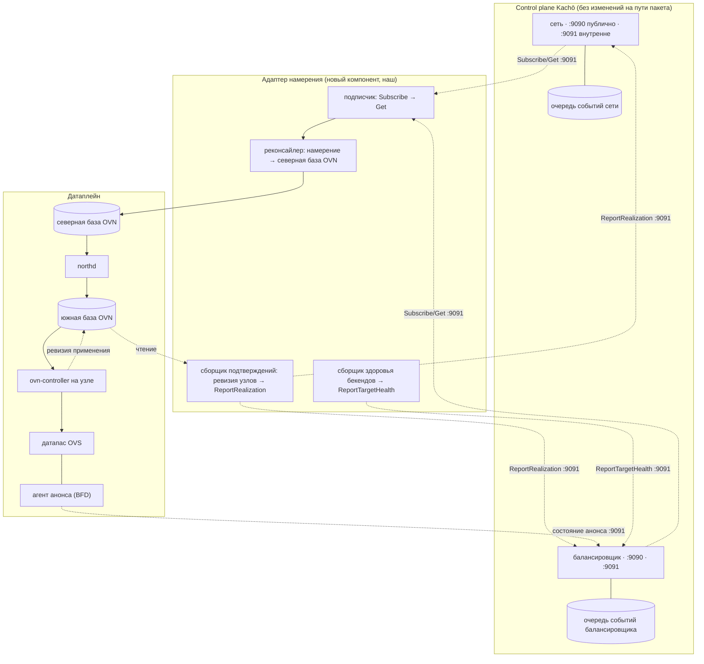
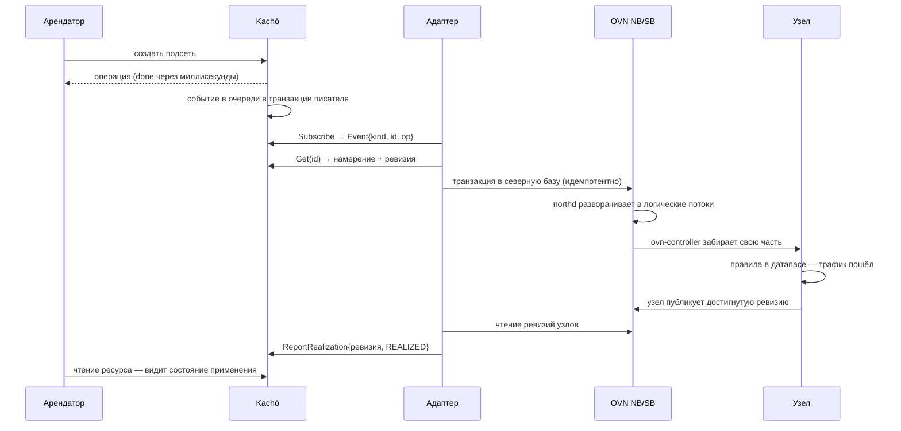
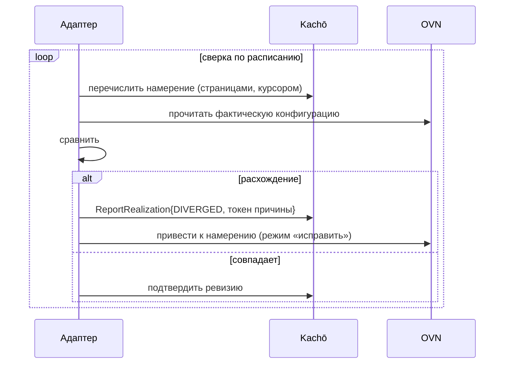
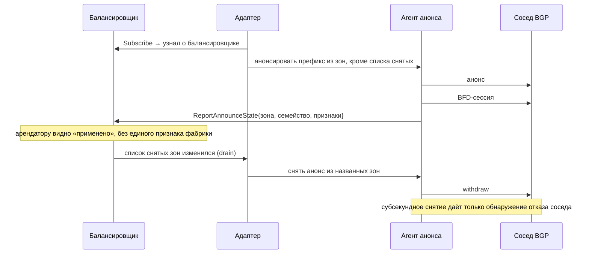

# Архитектура датаплейна для сети и балансировщика: промежуточное решение и путь на DPU

> **Пин ревизий.** Продукт — `PRO-Robotech/kacho@aa6fa15f`, воркспейс — `@94f1f2c`.
> Внешние факты датированы и снабжены источником в месте употребления; версии сторонних
> компонентов названы, потому что «поддерживается» без версии — не факт.
> Парный документ: `vpc-nlb-production-module-plan.md` (контракт control plane).

## §0. Решение одной строкой и его основание

**Промежуточный датаплейн — OVN + OVS. Продолжение — разгрузка того же OVN на BlueField.**

Выбор сделан **не** суммой баллов, а одним решающим ограничением и одним решающим свойством
миграции.

**Решающее ограничение.** Наш контракт разрешает двум арендаторам иметь одинаковые адреса: ключ
ограничения непересечения содержит идентификатор сети (`services/vpc/internal/migrations/
0010_subnet_cidr_blocks.sql:40`), и это записанное решение (`0010:20-22`). Значит датаплейн обязан
нести overlap-safe тенантность.

- **Cilium upstream это не закрывает** — ни в GA, ни в beta, ни экспериментально. Дословно из
  документации 1.20.0 (Multi-Pool IPAM, отметка обновления 2026-07-29): *«IPAM pools with
  overlapping CIDRs are not supported. Each pod IP must be unique in the cluster due the way
  Cilium determines the security identity of endpoints by way of the IPCache»*. Адрес — **ключ**
  карты идентичности; это архитектура, а не пробел. Предложение снять зависимость
  (CFP-25243 High-Scale IPcache, начато 2023-04-26) — в статусе **Dormant**. Пересечение
  адресов, VRF и SRv6-L3VPN существуют только в коммерческом продукте.
- **Katran, IPVS, XDP-балансировка и балансировка Cilium понятия арендатора не имеют вовсе** —
  они работают в одном домене маршрутизации.
- **DASH — спецификация, а не стек.**
- **Тенантным датаплейном из рассмотренных является только OVN.**

**Решающее свойство миграции.** eBPF/XDP на BlueField **не разгружается**: в перечне ускорителей
BlueField-3 выгрузки eBPF нет — там движки инкапсуляции VXLAN/NVGRE, крипто, RDMA/RoCE, NVMe-oF.
Инфраструктура аппаратной выгрузки XDP в ядре существует, но её единственной реализацией был
Netronome NFP. Перенос XDP-датаплейна на DPU — не разгрузка, а **переезд с серверного x86 на
8–16 ядер Arm**. Выигрыш на DPU даёт только датаплейн, **выражённый как match-action правила**,
потому что именно правила исполняет eSwitch в кремнии.

> [!note] Здесь стояло «Arm даёт ≈половину x86 на ядро» — опровергнуто замером 2026-08-13
> Утверждение было ложным **как записано**, и заменять его надо не другим числом, а **«неизвестно»**.
> Сравнение при прочих равных (та же карта ConnectX-7, тот же драйвер, тот же тест `ip4base`, 64
> байта, та же метрика NDR): **NVIDIA Grace (Neoverse V2) — 22,47 Mpps одним потоком** против
> **Xeon Platinum 8462Y+ — 22,47 Mpps двумя гиперпотоками**. Это паритет на физическое ядро, а не
> половина; проверено против разброса между сборками (22,14–22,47 и 22,25–22,47 на четырёх сборках
> каждая). «Вдвое» приблизительно верно только для более старого ядра Neoverse N1, где вдобавок
> смешаны разные карты, — то есть как сравнение архитектур негодно.
>
> **Правильный ответ — «не измерено никем»:** стендов BlueField в CSIT **ноль** (`bluefield`, `bf3` —
> ноль совпадений; единственный DPU — Marvell OCTEON 10 на Neoverse N2). Производительность на ядрах
> BF3 (Cortex-A78AE) неизвестна.
>
> **Довод против eBPF/XDP от этого не рушится** — он держится на том, что XDP **не разгружается
> вовсе**, а не на арифметике ядер. Но парентеза в прежнем виде была числом, украшающим верную
> находку, и со ссылкой на замер, которого не существует.

**И этот путь не надо изобретать — он поставляется вендором.** В DPF есть **DOCA VPC OVN
Service**: «built on top of OVN, this service enables network isolation, virtualization, and
advanced SDN capabilities directly on NVIDIA DPUs»; есть референсный дизайн для BlueField-3 на
DPF 26.4.0 (2026-06-29). Северный интерфейс OVN остаётся **тем же** до и после: `ovn-controller`
и `ovs` переезжают с хоста на Arm, а ASAP²/DOCA переносят датапас в eSwitch «while maintaining OVS
control-plane unmodified».

> [!warning] Звено проверено 2026-08-13 — статус хуже неизвестного, сроки планировать нельзя
> Здесь стояло «агент подтвердить не смог, считать неизвестным». Предмет у этой оговорки
> **исчерпан**: статус установлен, и он не «неизвестен», а **предварительный просмотр**.
> Сервис существует, построен на OVN, поставляется в GA-релизе DPF v26.4.0 под BlueField-3,
> северный интерфейс остаётся OVN — фактическая часть §0 не ошиблась. Но вендор помечает его
> **не рекомендованным к промышленному применению**, и метка не двигалась три релиза подряд.
>
> **Следствие, названное прямо: переезд на DPU — направление без даты.** Дату назначает снятие
> метки, предикат снятия принадлежит вендору и за девять месяцев не сработал. Планировать сроки
> по нему — планировать по чужому намерению.
>
> Решение §0 от этого **не меняется**: разгрузка OVS через ASAP²/tc-flower — поставляемый
> продукт и она от сервиса не зависит. Меняется только то, что переезд перестаёт быть этапом
> с датой и становится свойством, которое мы получим, когда его отдадут в производство.
>
> Оговорку не удаляю, а заменяю: утверждение, пережившее свой предмет, опаснее отсутствующего —
> оно продолжает предписывать «проверить отдельно» там, где проверка уже сделана.

**Величина выигрыша измерена.** ConnectX-5 100G, кадр 114 байт, overlay UDP, многоарендный
трафик (NVIDIA, 2020-09-24): OVS-DPDK — 6.6 Mpps и 33.2 Гбит/с при **12 занятых ядрах**; ASAP² —
**67 Mpps**, 87.84% линейной скорости, **ноль занятых ядер**. Дословно: *«up to 10X the packet
rate and 2.5X the throughput compared to OvS-DPDK for overlay UDP traffic, without consuming any
CPU cores»*.

**Зрелость по датам.** OVN `v26.03.0` (тег 2026-03-20, патч `v26.03.2`): EVPN объявлен стабильным
дословно — *«The EVPN support is now considered stable. Its "experimental" tag has been removed»*;
динамическая маршрутизация — с `v25.03.0`. `ovn-kubernetes` `v1.3.0` (2026-05-06): пользовательские
сети — GA, объявление маршрутов — GA, работа без оверлея по BGP — GA, EVPN — GA.

### VPP/DPDK — пробел закрыт 2026-08-13, решение не изменилось

Прежняя редакция объявляла здесь незакрытый пробел: агент не выполнился по лимиту. Пробел закрыт,
пометка снята, **вывод тот же — OVN остаётся**, и решающее основание перестало быть догадкой.

**Разгрузки в eSwitch у VPP нет, и это чистое отрицание по всему дереву** (`v26.06`, тег
`29c51fb8`, 2026-06-24; обход 5515 путей, не выборка). Весь словарь действий флоу-инфраструктуры —
`COUNT, MARK, BUFFER_ADVANCE, REDIRECT_TO_NODE, REDIRECT_TO_QUEUE, RSS, DROP`; в железе завершает
пакет **только `DROP`**, остальные шесть доставляют пакет в очередь процессорного воркера. Нет ни
инкапсуляции, ни трансляции, ни вывода в порт. Признаки механизма, которым это делает OVS, —
`switchdev`, `eswitch`, `tc-flower`, `rte_flow_transfer`, `port_representor`, `transfer = 1` — по
**нулю** вхождений каждый; атрибут правила всегда один: `{.ingress = 1}`. Со стороны вендора то же:
индекс DOCA 3.4.0 называет разгружаемым коммутатором **OVS-DOCA**, VPP/FD.io не упомянут.

**Три отдельных основания, каждое самостоятельно достаточное:**
1. **Тенантность есть, но не там, где нужна.** Домены маршрутизации (VRF) — производственная часть
   ядра, пересечение адресов держат. Но stateful-пересечение даёт только SFDP, а SFDP — **техническое
   превью по дословному определению VPP** (раздел «In-progress API messages»: *«unsuitable for other
   use than the technology preview»*), `version = "0.0.1"`, `FEATURE.yaml` нет вовсе → состояние не
   объявлено, компоненту около полугода. Ключ производственного stateful-пути (ACL-плагин) тенантности
   **не несёт** — только интерфейс. Тенантный фильтр существует как **образец кода**
   (`acl_sample.c`, один индекс ACL на арендатора). NAT в SFDP — **только IPv4**, то есть решение о
   симметрии семейств здесь невыразимо.
2. **Балансировщик живёт в единственном домене.** Консистентное хеширование и привязка по источнику
   есть, но в API **ни одного поля VRF/арендатора**, а в коде `fib_index = 0` жёстко. Это ровно то
   ограничение, за которое §0 отвергает Katran, IPVS и балансировку Cilium. Проверок здоровья
   бекендов — **ноль**. Своя же документация зовёт плагин **бетой** («*APIs are subject to heavy
   changes*») при `state: production` в `FEATURE.yaml` — два места об одном предмете.
3. **Операционная модель отбирает уже обещанное.** Обновления без разрыва соединений **нет вовсе**
   (`graceful restart`, `ISSU`, `warm restart`, `hitless` — по нулю). Предела соединений на
   арендатора нет: пул общий, а единственный клапан давления аргумент **выбрасывает**. Один процесс
   на всех арендаторов, и при его смерти трафик не подхватывает никто — сетевое устройство отобрано у
   ядра. Плагин общей судьбы устроен **наоборот**: смерть датаплейна рассылает завершение дочерним.

**Правило со ссылкой на группу интерфейсов невыразимо:** `port_group` и `interface_group` — по нулю.
Есть именованные **наборы адресов** (плагин `npol`, `state: development`, причём среди действий стоит
`NPOL_LOG, // Ignored for now` — принято и не исполняется, что у нас прямо запрещено). Наша группа
правил с целью-группой в OVN выражается нативно `Port_Group`; на VPP адаптеру пришлось бы держать
**второй источник истины о членстве** — то, чего он по §2 делать не должен.

**Граница доверия двигается в противоположную нашему решению сторону.** vhost-user/memif — кольцо в
разделяемой памяти между концом арендатора и привилегированным **однопроцессным** датаплейном,
коммутирующим за всех; память соседа отображена в адресное пространство VPP. Собственная политика
безопасности VPP объявляет бинарный API **доверенным интерфейсом** и прямо не считает уязвимостью
падение через него — то есть класс «злонамеренный сосед по разделяемой памяти» её областью действия
**не покрыт**. §7а.2 берёт режим DPU с изоляцией от хоста ровно затем, чтобы датаплейн перестал быть
соседом арендатора; «VPP на хосте» отменяет причину брать DPU.

**Что взято у VPP как урок, а не как отказ.** Числа stateful при прочих равных (Xeon 8580, E810+AVF,
одно ядро, 4,1 млн сессий): отслеживание состояния стоит **30–60 крат** stateless-пути
(30,55 Mpps stateless против 0,5–2,6 Mpps соединений/с). Это цена нашего решения §8.5 (stateful-IPv6
на процессоре), и она измерена, а не предположена.

> [!note] Поправка к прежнему числу этого же абзаца
> Стояло «22 Mpps на ядро при 64 байтах на Xeon SPR». Верно **только для пути ConnectX-7/mlx5**: тот
> же процессор с E810+AVF даёт **35,50 Mpps** NDR — на 58% больше. Это потолок пары «карта+драйвер»,
> а не потолок процессора, поэтому число обязано нести имя карты. Отдельно: «stateful-часть
> экспериментальная» **подтвердилось** и источник сильнее, чем был, — но фраза «частично покрыт
> числами CSIT» неверна: CSIT покрывает SFDP отдельными суитами, где SFDP **обгоняет** NAT44-ED в
> 2,4–3,3 раза по соединениям в секунду, при разрыве NDR/PDR в 4–6 крат и одной суите, упавшей
> 2026-08-01 после прохода 2026-07-18.

**Провенанс чисел, без него их читать нельзя.** `csit.fd.io` — приложение на JS, статические выгрузки
заморожены на 2023 годе, `rls2606/report/` отдаёт **404**. Числа взяты из **сырого JSON каждого
прогона** в бакете логов CI и относятся к **26.02-release** (март 2026) и **26.10-rc0** (июль–август
2026), **не** к 26.06. Все величины — нижние границы MLRsearch (NDR/PDR), агрегат в обе стороны.

**Что осталось неизвестным — названо, а не додумано:** числа именно для 26.06 недостижимы; VPP на
BlueField не измерен никем; SFDP на Arm — суиты запланированы, исполненного прогона найти не удалось;
MRR, 1518 байт и IMIX не собирались. И **прежний** пробел §0 остаётся открытым: статус DOCA VPC OVN
Service (GA против технического превью) — эта работа его не касалась.

---

## §1. Соответствие моделей: наш ресурс → объект OVN → объект DASH

Это главная таблица документа. Она показывает, что промежуточный выбор и целевая платформа
описывают **одну** модель, поэтому миграция меняет носитель, а не контракт.

| Наш ресурс | Объект OVN | Объект DASH | Что это значит |
|---|---|---|---|
| Сеть | `Logical_Switch` (+ `Logical_Router` для маршрутизации) | VNET | домен маршрутизации на сеть; пересечение адресов законно by construction |
| Числовой идентификатор тенант-домена | `tunnel_key` | VNI | **прямое** соответствие; сегодня выдаётся нашей последовательностью — распорядителя надо назначить (§5) |
| Подсеть | адресный набор на логическом коммутаторе | префикс VNET | зона/регион остаются нашим якорем; датаплейн о них не знает |
| Интерфейс | `Logical_Switch_Port` | **ENI** | first-class порт со своим MAC, живущий отдельно от машины |
| MAC интерфейса | `addresses` у порта | **ключ идентификации ENI** | DASH идентифицирует ENI **по MAC** — наше решение чеканить MAC попадает в целевую модель |
| Группа правил | `Port_Group` | группа ACL | «правило ссылается на группу как на цель» выражается нативно |
| Правило | `ACL` (stateful, через conntrack) | правило ACL | отслеживание состояния соединения — свойство датаплейна, не наше |
| Таблица маршрутов | `Logical_Router_Static_Route` | routing table | набор заменяется целиком (у маршрута нет идентичности — см. парный документ) |
| Адрес | адрес порта / NAT-запись | mapping | выдача и уникальность остаются нашими |
| Шлюз выхода и трансляция | `NAT` на логическом маршрутизаторе | **объекта нет**: выход выражается типом маршрутизации плюс корзиной учёта | у нас ресурс есть и его форма верна, но варианты не заполнены. Асимметрия важна: в целевой модели трансляция — **не объект**, поэтому наш публичный ресурс останется нашим и в неё не отобразится один-к-одному |
| Балансировщик | `Load_Balancer` (+ `options:distributed`, health-check) | — | L4, affinity, проверки здоровья |
| Подтверждение применения | `nb_cfg` / `sb_cfg` / `Chassis_Private.nb_cfg` / `hv_cfg` | — | **механизм «намерение → подтверждение с ревизией» существует и описан в схеме**, а не строится нами |

**Следствие, которое стоит назвать отдельно.** Я предлагал ввести собственную ревизию намерения и
собственное подтверждение. В OVN это **first-class**: северная база несёт счётчик конфигурации,
а каждый узел публикует, до какой конфигурации он доехал. Наша задача сводится к тому, чтобы
**прочитать** это и перевести в наш внутренний контракт, а не изобрести.

---

## §2. Компоненты и где они исполняются

**Адаптер намерения — единственный новый компонент, и он наш.** Он существует ровно потому, что
две вещи не должны смешиваться: наш контракт не знает слов «логический коммутатор», а северная
база OVN не знает слов «проект» и «право». Адаптер переводит одно в другое и больше ничего не
делает.

**Чего адаптер НЕ делает, и это его определение:**

- не принимает решений о правах — он читает уже авторизованное намерение;
- не хранит состояния, кроме курсора подписки: пересборка намерения из нашего API дешевле, чем
  второй источник истины, который разойдётся;
- не является путём пакета — его недоступность не рвёт связность, потому что правила уже в
  датапасе;
- не показывает арендатору ничего: весь его обмен идёт по `:9091`.

**Граница доверия.** Адаптер владеет доступом к северной базе OVN и служебной учётной записью с
отношением записи в нашей модели прав. Он **не** получает доступа к нашей БД — только методы
`:9091`. Причина названа в парном документе: в очереди событий лежит снимок целой доменной
структуры, включая инфра-поля, поэтому событие уходит через **проекционный слой с белым списком**.

---

## §3. Процесс: от намерения арендатора до пакета

### §3.1. Штатный путь

**Идемпотентность по построению.** Северная база OVN — **желаемая** конфигурация; повторная запись
того же намерения не производит эффекта. Поэтому повтор после таймаута безопасен, и очередь может
быть at-least-once без дедупликации на нашей стороне.

**Порядок не требуется.** Адаптер собирает намерение целиком по `Get`, а не накладывает дельты.
Событие, пришедшее дважды или не в порядке, приводит к тому же результату.

### §3.2. Расхождение и восстановление

**Два режима обязательны, и это не удобство.** Сверка, умеющая только исправлять, не даёт
отличить «ноль расхождений» от «ноль прочитанного». Поэтому режим «только сообщить» —
первоклассный, и у него есть метрика: возраст самого старого неприменённого намерения.

**Инициатор восстановления — мы**, потому что намерение хранится у нас. После потери состояния
датаплейн обязан быть приводимым к намерению **целиком**, а не досогласовываться по частям.

**Сборка мусора идёт по авторитетному списку живых привязок, который передаём мы.** Датаплейн не
вправе выводить его из своих наблюдений: он не знает, что удалено, а что ещё не доехало. Снятие
и сборка мусора — **разные** механизмы, второй не заменяет первый.

### §3.2а. Выход наружу и трансляция — во что отображаются варианты шлюза

Ресурс шлюза выхода остаётся публичным (разбор — `vpc-module-delta.md`, задача 11), и адаптер
переводит каждый его вариант в конструкцию датаплейна. Соответствие прямое, поэтому переезд на DPU
эту часть не затрагивает.

| Вариант нашего шлюза | Конструкция OVN | Что даёт арендатору | Разгружается на DPU |
|---|---|---|---|
| **публичная трансляция** | `NAT` типа `snat` на логическом маршрутизаторе, внешний адрес — из пула | выход в интернет со стабильного адреса | да — трансляция в перечне разгружаемых функций |
| **приватная трансляция** | `NAT` без маршрута в интернет: трансляция есть, выхода нет | доступ к сервисам платформы без внешней достижимости | да, той же конструкцией |
| **только исход, IPv6** | маршрут по умолчанию наружу **без** обратного пути к префиксу | IPv6-адрес, с которого можно выйти, но нельзя войти | да |
| **ссылка из статического маршуа** (`gateway_id`) | следующий переход на логическом маршрутизаторе | «этот трафик идёт через этот выход» | да |

**Три следствия, которые надо знать до реализации.**

1. **Приватная трансляция — не «публичная минус адрес».** Отсутствие маршрута наружу выражается
   отдельно от наличия трансляции; если выразить одним признаком, «трансляция без интернета»
   станет невыразима, а это ровно тот сценарий, ради которого вариант вводится.
2. **«Только исход» для IPv6 — вопрос безопасности, а не удобства.** Без варианта IPv6-адрес
   означает входящую доступность автоматически, потому что в IPv6 нет трансляции, которая её
   случайно закрывала бы. Поэтому вариант идёт в первом этапе, а не «когда попросят».
3. **Порты — исчерпаемый ресурс, и предел публикуется.** У трансляции есть потолок портов на
   интерфейс; без опубликованного числа арендатор ломается молча под нагрузкой. Рядом с заданным
   значением — поле **действующего**, иначе вопрос «применилось ли» задаётся человеку.

**Чего в целевой модели нет.** В DASH трансляция **не является объектом** — выход выражается типом
маршрутизации плюс корзиной учёта. Значит наш публичный ресурс останется нашим и один-к-одному в
целевую модель не отобразится: адаптер будет собирать из него тип маршрутизации, а не передавать
объект. Это надо знать заранее, потому что соблазн «отдать шлюз как есть» появится в момент переезда.

### §3.3. Анонс адреса балансировщика и снятие по зоне

**Время снятия оговаривается числом, а не подразумевается.** Наш контракт обещает список зон
для снятия; сколько времени занимает фактическое снятие — свойство датаплейна, и оно входит в
контракт потребления.

---

## §4. Изоляция и безопасность

**Изоляция арендаторов держится структурой, а не проверкой в правилах.** Каждая сеть — отдельный
логический коммутатор со своим идентификатором тенант-домена; пакет арендатора A физически не
имеет пути в домен B, потому что домены различны, а не потому что правило это запретило. Это
сильнее фильтрации: ошибка в правиле не открывает соседа.

**Отслеживание состояния соединения — в датапасе.** Наш контракт обещает арендатору
stateful-фильтрацию, и это обещание записано в зафиксированном дизайне, а не только на странице.
OVN исполняет его через conntrack; **если бы датаплейн был stateless, обещание стало бы ложью**, и
это причина, по которой stateful-способность входит в предусловия, а не в пожелания.

**Что видит атакующий при компрометации компонента:**

| Компонент | Что даёт компрометация | Чем ограничено |
|---|---|---|
| адаптер намерения | запись в северную базу OVN, чтение намерения по `:9091` | доступа к нашей БД нет; отношение прав узкое (только запись состояния); mTLS |
| северная база OVN | конфигурация всех арендаторов | отдельный контур, mTLS, не выставлена ни на один арендаторский путь |
| `ovn-controller` / датапас на узле | трафик узла, домены арендаторов **этого** узла | ядро узла; при разгрузке на DPU граница уезжает с хоста (§5) |
| агент анонса | анонс и снятие префиксов | круг соседей BGP пинится; аутентификация сессии обязательна |

**Свежий класс, который надо знать до выбора версий ядра.** Ядерный датапас OVS несёт класс
локального повышения привилегий (CVE-2026-64531, публичный PoC 2026-07-28; исправления в
5.15.212 · 6.1.178 · 6.6.145 · 6.12.97 · 6.18.40 · 7.1.5). Это не довод против OVN — это
требование к минимальной версии ядра стенда, которое обязано попасть в профиль развёртывания и в
гейт посадки.

**Ни один признак датаплейна не выходит на публичную поверхность.** Идентификатор тенант-домена,
идентификатор маршрута, состояние сессии соседа, факт программирования в ядре — всё живёт на
`:9091` и в отдельной таблице. В дереве это уже сделано верно для балансировщика; для сети то же
делается отдельной таблицей состояния применения, а не колонкой в таблице сетей.

---

## §4а. Как оставаться близко к BlueField, используя только Linux

Требование владельца: промежуточное решение исполняется **средствами Linux**, но строится так,
чтобы переезд на BlueField был заменой носителя. Ниже — правила изоморфности. Каждое опирается на
названный факт целевой платформы, а не на общее соображение.

**Правило 0. Единственный развиваемый путь разгрузки — OVS-DOCA.** Дословно из DOCA 3.4.0:
*«The DPDK and Kernel DPIFs are maintained in their current form primarily for backward
compatibility and are not planned to be updated with new features»*. Ядерный датапас на Linux
сегодня годится, но новых функций не получит, и всё, что мы напишем, обязано выражаться формой,
которую примет OVS-DOCA.

**Правило 1. Пользоваться только тем, что разгружается в железо.** Разгружается: VXLAN (включая
GBP), Geneve, GRE — инкапсуляция и снятие; **отслеживание соединений**; **трансляция адресов**;
метры OpenFlow; sFlow; зеркалирование; hairpin; DP-HASH. Инкапсуляцию выбираем из VXLAN или
Geneve и больше ничего не вводим.

**Правило 2. Один режим ядерного датапаса запрещён к использованию прямо сейчас.** Двухстадийный
`ct-ct-nat` настраивается в стандартном ядерном датапасе OVS и **не поддержан** OVS-DOCA. Если
мы применим его на Linux, миграция станет переписыванием этой части. Не применять.

**Правило 3. Бюджет соединений проектируется сегодня, а не при переезде.** Потолки OVS-DOCA:
по умолчанию **250 000** записей отслеживания, максимум **2 млн**, и прямая рекомендация *«do not
exceed CT size of 1M for best performance»*; предел megaflow по умолчанию **200 000**. Наш
контракт предела соединений не несёт вовсе — значит появляется **опубликованный предел на
интерфейс**, и он входит в контракт потребления. Заодно это ответ на вопрос «зачем арендатору
журнал соединений»: предел объясняет отказ лучше, чем журнал.

**Правило 4. IPv6 со отслеживанием состояния — главный риск изоморфности, и он обязан быть
назван.** Разгрузка отслеживания соединений для IPv6 в OVS-DOCA — **опция, выключенная по
умолчанию**. Наш контракт обещает арендатору stateful-фильтрацию **симметрично для обоих
семейств**. Значит либо IPv6-отслеживание остаётся на процессоре (и тогда бюджет ядер считается
отдельно), либо обещание сужается. Это решение владельца, и оно принимается **до** D3, потому что
задним числом сужать обещание нельзя.

**Правило 5. Порт с самого начала — VF с representor, а не veth.** Разгрузка живёт на SR-IOV с
режимом коммутации на карте; если промежуточное решение поставит veth, переезд станет сменой
модели порта, а не настройки. Потолок документирован: **до 126** VF на порт, дальше — масштабируемые
функции. Значит плотность интерфейсов на узел планируется от этого числа, а не от памяти.

**Правило 6. Группа правил, привязанная к интерфейсу, правится подменой, а не мутацией — и так
надо делать уже на Linux.** DASH запрещает это дословно: *«It is not permitted to modify rules
within a group that is currently bound to an ENI. For such scenario, a new group shall be created
by application with the modified set of rules which can be swapped»*. Наш публичный контракт при
этом позволяет арендатору править правила привязанной группы (`UpdateRules`, `UpdateRule`).
Вывод: **публичный контракт остаётся как есть**, а адаптер намерения реализует подмену — создать
новую группу, переключить привязку атомарно, снять старую. Если сделать это только при переезде,
поведение под арендатором изменится в момент миграции; если сделать сразу — не изменится никогда.

**Правило 7. Привязка набора маршрутов — атомарная замена целиком.** В целевой модели привязка
набора к интерфейсу перезаписывает прежнюю, а приоритет правила перенесён **в ключ** (поле
приоритета объявлено устаревшим). Наш контракт уже правит набор маршрутов полной заменой — здесь
совпадение полное, и его надо сохранить, не вводя гранулярную правку.

**Правило 8. Тенант-домен — это номер оверлея, и он назначается автоматически.** У логического
датапаса OVN есть ключ туннеля (24-битный), который назначается сам; в целевой модели это VNI
домена, а ключ отображения адреса — пара «домен + адрес», поэтому одинаковые адреса в разных
доменах сосуществуют **по построению**. Наш числовой идентификатор тенант-домена становится этим
номером — но распорядителя пространства надо назначить (§7 №2), потому что 24 бита делятся с
фабрикой.

**Правило 9. Балансировщик в целевую модель НЕ переезжает — и это надо знать заранее.**
В объектной модели DASH балансировщика **нет вовсе**: каталог службы балансировки содержит README
с **пустым** разделом требований и один документ о взаимодействии, а не о самой балансировке.
Трансляции адресов как объекта там тоже нет — выход наружу выражается типом маршрутизации плюс
корзиной учёта. Следствие: балансировщик остаётся **нашим** предметом на OVN и после переезда, и
планировать его разгрузку в DASH-модель нельзя.

**Правило 10. Анонс префикса — обычный BGP в обоих мирах.** В целевой модели это не объект: узел
поднимает сессию с соседом и анонсирует префикс. Значит конструкция агента анонса устойчива к
переезду, и субсекундное снятие достигается обнаружением отказа соседа — одинаково там и здесь.

**Правило 11. На собственную VPC-абстракцию вендора не планировать.** `DPUVPC` /
`DPUVirtualNetwork` объявлены **tech preview и не рекомендованы в прод**, а модель беднее нашей:
у вида сети единственное значение, адресация только IPv4 (полей IPv6 нет), из политик — два
булевых признака, ни групп правил, ни балансировщика. Наш южный интерфейс — **северная база OVN**,
и он останется им после переезда.

**Правило 12. Подтверждение применения читается, а не приходит пушем — и адаптер обязан уметь
оба способа.** У OVN это счётчик ревизии и его отражение узлами; в целевой модели подтверждение
**не привязано к ревизии намерения** и **читается** из отдельной базы состояния. Наш внутренний
контракт от этого не зависит, потому что отчитывается **адаптер**: сегодня он читает ревизии, потом
будет читать состояние. Это и есть причина, по которой отчёт отдаёт адаптер, а не датаплейн
напрямую.

**Потолки узла, от которых считается плотность** (масштаб целевой платформы, per-node): домены
маршрутизации — **20**, L2-номера оверлея — **20**, L3-номера — **20/10/8** в зависимости от числа
точек туннелирования, соседи — 16K, маршруты — 128K, следующих переходов в группе — **64**. Число
сетей на узел планируется от **20**, а не от объёма памяти, и это меняет раскладку размещения.

---

## §5. Что переедет на BlueField без изменений и что придётся переделать

### §5.1. Переедет без изменений

- **Вся модель ресурсов**: сеть → логический коммутатор, интерфейс → логический порт, группа
  правил → группа портов и ACL, маршруты, NAT, балансировка.
- **Числовой идентификатор тенант-домена** → `tunnel_key` → VNI.
- **Механизм подтверждения по ревизии** — тот же.
- **Северный интерфейс**: адаптер пишет в ту же северную базу. Наш код не меняется.
- **Двойной стек, IPv6, проверки здоровья, affinity.**

### §5.2. Придётся переделать, по убыванию цены

1. **Топология оркестрации: два кластера** — хостовый и DPU-шный. Это не переключатель, а вторая
   платформа со своим жизненным циклом, сертификатами и стендом.
2. **Модель порта**: разгрузка живёт на SR-IOV VF с representor'ами; интерфейс перестаёт быть
   veth. Нужны device-plugin, Multus, вложения сети.
3. **Новый класс отказа с готовым контрактом**: аренда здоровья DPU (обновление 10 с, срок 40 с);
   по истечении подключение отклоняется, узел помечается неготовым. **Наши приёмки обязаны знать
   это состояние заранее** — иначе оно проявится как необъяснимый отказ размещения.
4. **Агент анонса переезжает на DPU**, вместе с ним — снятие метрик с Arm-стороны.
5. **Профили развёртывания и контуры mTLS** — новый набор.

### §5.3. Что решает, будет ли миграция дешёвой

Единственный критерий: **выражено ли намерение как match-action правила**. Если да — переезд есть
разгрузка. Если бы мы выбрали eBPF, миграция была бы **переписыванием модели изоляции**: уцелели
бы контрол-плейн, контракт и модель анонса, а датаплейн и модель тенантности пришлось бы делать
заново.

---

## §6. Этапы

| Этап | Что делается | Признак завершения |
|---|---|---|
| **D0** | предусловия: overlap-safe тенантность подтверждена; распорядитель тенант-домена и MAC назначен; минимальная версия ядра зафиксирована; профиль возможностей датаплейна объявлен конфигурацией с отказом в старте при расхождении | отказ в старте воспроизведён инъекцией: объявленный профиль не сходится с обещанным контрактом → стенд не поднимается |
| **D1** | внутренние методы: `Subscribe` для сети с проекционным слоем; `ReportRealization` для обоих домов; `ReportTargetHealth` | проба: инъекция инфра-поля в событие роняет; отчёт о чужой ревизии отвергается; здоровье без отчётов не становится «здоров» |
| **D2** | адаптер намерения: подписка, реконсайлер в северную базу, сборщик подтверждений; режим «только сообщить» + метрика возраста | сверка на подготовленном расхождении: режим «сообщить» находит и не правит; режим «исправить» приводит; обе метрики ненулевые |
| **D3** | сеть в датапасе: логические коммутаторы, порты, ACL, маршруты, NAT; два арендатора с одинаковым `10.0.0.0/16` изолированы | проба изоляции: одинаковые адреса у двух арендаторов, трафик не пересекается; снятие правила наблюдаемо |
| **D4** | балансировщик: L4, affinity, проверки здоровья, анонс с per-zone снятием | проба: снятие зоны из списка приводит к withdraw за оговорённое число; здоровье приходит измеренным |
| **D5** | сборка мусора по авторитетному списку; восстановление после потери состояния целиком | проба: потеря состояния датаплейна → приведение к намерению без участия человека |
| **E→DPU** | разгрузка: второй кластер, VF-порты, аренда здоровья DPU, агент анонса на DPU | проба: та же модель, ноль изменений в адаптере; занятые ядра хоста снизились |

---

## §7. Решения по контракту потребления

Открытых вопросов здесь нет: каждое решение принято и обосновано четырьмя критериями —
**конкурентоспособность · перспективность 2026 · производительность · безопасность**. У каждого
названо, что мы **требуем** от сетевой команды, и **предикат смены решения**: факт, при котором
решение пересматривается. Требование без предиката — догма, а не решение.

### 7.1. Изоляция арендаторов — структурная, не фильтрацией

**Решение.** Изоляция обеспечивается **отдельным домомен маршрутизации на сеть с собственным
номером оверлея**, а не правилами фильтрации.

**Почему.** Безопасность: ошибка в правиле не открывает соседа, потому что домены различны —
пакет арендатора A физически не имеет пути в домен B. Фильтрация даёт то же свойство только
пока все правила верны. Перспективность: и промежуточный выбор, и целевая платформа выражают это
одинаково — ключ туннеля логического датапаса и номер оверлея домена.

**Требуем:** подтверждение, что фабрика несёт домены и не сводит их к правилам.

**Предикат смены:** фабрика доменов не несёт → мы обязаны запретить пересечение адресов между
арендаторами **сами**, и тогда это отказ от формы, которую рынок считает правильной. Решение
меняется только так, и цена названа заранее.

### 7.2. Пространство номеров домена — делегированный диапазон

**Решение.** Сетевая команда выдаёт **диапазон**, аллокацию внутри него делаем мы. Не «весь
диапазон наш» и не «номер запрашивается на каждую сеть».

**Почему.** Производительность: запрос номера у соседа на пути создания сети добавил бы
синхронный вызов и внешнюю зависимость fail-closed к самой частой мутации. Безопасность: «весь
диапазон наш» столкнётся с фабрикой в день, когда она пронумерует что-либо сама, и обнаружится это
как перепутанный трафик, а не как ошибка. Делегированный диапазон снимает и то, и другое.

**Требуем:** нижнюю и верхнюю границу диапазона, письменно.

**Предикат смены:** фабрика объявляет, что нумерует домены сама → мы переходим на резолв у
владельца и принимаем синхронный вызов на пути создания.

### 7.3. Распорядитель MAC — мы

**Решение.** MAC интерфейса чеканим **мы**, с уникальностью на всё облако; у сетевой команды
запрашиваем **делегированный префикс**.

**Почему.** Перспективность: целевая модель разгрузки идентифицирует интерфейс **по MAC** — значит
адрес обязан существовать и быть стабильным **до** размещения, а это может обеспечить только тот,
кто создаёт интерфейс. Безопасность: MAC, назначенный нами, проверяется против нашей строки;
назначенный фабрикой — только по её отчёту, то есть требует доверия там, где его можно не
требовать. Конкурентоспособность: арендатору обещана неизменяемость MAC на всю жизнь интерфейса, и
это обещание держится только при одном распорядителе.

**Требуем:** делегированный префикс адресов канального уровня.

**Предикат смены:** фабрика требует назначать MAC сама → поле становится входным на её стороне, а
у нас превращается в наблюдаемое; обещание неизменяемости придётся снять.

### 7.4. Отслеживание состояния соединения — обязательно, не опция

**Решение.** Фабрика **обязана** вести состояние соединения. Это не предмет торга.

**Почему.** Публичный контракт уже обещает арендатору stateful-фильтрацию, и обещание записано в
зафиксированном дизайне, а не только на странице. Безопасность: без состояния арендатору
пришлось бы писать зеркальное правило на обратный трафик — то есть открывать входящее направление
ради исходящего соединения. Конкурентоспособность: stateless-фильтрация в 2026 — не «проще», а
хуже, и ни один сопоставимый продукт её не предлагает.

**Требуем:** подтверждение способности и её потолков.

**Предикат смены:** нет. Если фабрика stateless — меняется не решение, а **фабрика**.

### 7.5. Время снятия анонса по зоне — субсекундное

**Решение.** Требуем **обнаружение отказа соседа** на стороне фабрики и число в контракте:
**не более 1 с** от снятия зоны из списка до прекращения приёма трафика этой зоной.

**Почему.** Без обнаружения отказа снятие занимает время удержания сессии — десятки секунд, и тогда
вывод зоны из-под трафика **не является выводом**. Безопасность: список снятых зон — инструмент
реакции на инцидент; инструмент с задержкой в десятки секунд для этого не годится.
Производительность: то же число определяет, за сколько уходит трафик с деградировавшей зоны.

**Требуем:** поддержку обнаружения отказа соседа и подтверждение числа.

**Предикат смены:** фабрика не умеет — тогда наш контракт обязан **назвать** фактическое время
вместо обещанного, а не умолчать о нём.

### 7.6. Гарантированный полезный размер кадра — 1400 байт

**Решение.** Публикуем **одно постоянное число: 1400**. Одинаковое для всех сетей и зон. Измеренное
значение не публикуем никогда.

**Почему именно 1400.** Инкапсуляция поверх кадра 1500 даёт около 1450; вторая инкапсуляция,
шифрование или список сегментов уменьшают дальше. 1400 оставляет запас, при котором обещание **не
придётся менять** при смене инкапсуляции — а менять опубликованное обещание дороже, чем отдать
50 байт. Безопасность: точное значение — **отпечаток инкапсуляции**, девять значений однозначно
указывают на её тип. Конкурентоспособность: рынок размер кадра в API вообще не показывает (шесть
площадок из семи), поэтому пол-обязательство — **лучше** нормы, а не хуже.

**Требуем:** подтверждение, что 1400 достижимо на всех путях, включая межзональные.

**Предикат смены:** фабрика не держит 1400 → меняется число, но **не форма**: одно постоянное
опубликованное значение остаётся.

### 7.7. Классификация отказов — закрытый перечень, и составляем его мы

**Решение.** Перечень терминальных отказов **закрыт** и короток: отказ в правах · неверная
конфигурация (адрес или эндпоинт не тот) · исчерпание делегированного диапазона · несовместимая
возможность. **Всё остальное — состояние, а не повод прекратить попытки.**

**Почему.** Это выведено из нашего собственного инцидента: отказ в правах был классифицирован как
временный, и очередь не доставила **ни одной** строки за всю свою жизнь, при том что наблюдаемое
поведение выглядело исправным. Безопасность: неверно классифицированный отказ в правах означает,
что **отзыв доступа не доезжает** — и это невидимо, потому что «работает» и «не отозвано» выглядят
одинаково.

**Требуем:** согласие на этот перечень и отсутствие корзины «прочее».

**Предикат смены:** появление отказа, который не укладывается ни в одну из четырёх категорий →
категория добавляется явно, перечень остаётся закрытым.

### 7.8. Зарезервированные префиксы — список, и пустой список запрещён

**Решение.** Перечень префиксов платформы и фабрики задаётся конфигурацией, и **пустой список
означает отказ в старте**, а не «ограничений нет».

**Почему.** Пустой список — это «не сужаем», а не «запрещаем»: тот же класс, что пустой круг
законных отправителей. Безопасность: пересечение супернета арендатора со служебным или underlay-
префиксом даёт трафик, который уходит не туда, и обнаруживается это по последствиям.

**Требуем:** список, включая служебный, underlay, метаданные, link-local и общий диапазон
операторского назначения.

**Предикат смены:** нет. Список может меняться, требование непустоты — нет.

### 7.9. Судьба установленных соединений при снятии правила — обрыв

**Решение.** Снятие правила **обрывает** соединения, которые им были разрешены. Записываем это в
арендаторский контракт.

**Почему.** Безопасность: если установленные соединения переживают снятие правила, то **отзыв не
является отзывом** — а именно за отзывом к правилам и обращаются в инциденте. Практическое
следствие для реализации: применение снятия обязано включать сброс соответствующих записей
состояния, иначе обрыва не будет.

**Требуем:** подтверждение, что сброс записей состояния входит в применение.

**Предикат смены:** нет. Отзыв, который не отзывает, не является предметом торга.

### 7.10. Недоступность управления — fail-secure, тремя утверждениями

**Решение.**
1. Существующая связность арендатора **не зависит** от доступности нашего control plane.
2. Мутации при недоступности фабрики отвергаются `UNAVAILABLE`, fail-closed.
3. Узел, потерявший управление, **не допускает новых потоков** и продолжает существующие —
   fail-secure, не fail-open.

**Почему.** Первое: иначе мы продаём доступность, которой не управляем. Третье — выбор в пользу
безопасности против доступности, и он осознан: узел без управления не может знать, что политика
изменилась, поэтому новый поток он разрешать не вправе.

**Требуем:** подтверждение поведения по каждому из трёх пунктов **отдельно** — они независимы, и
«всё нормально» ответом не является.

**Предикат смены:** нет для первого и третьего. Второй может смягчиться до частичного приёма
мутаций, если фабрика научится принимать намерение в буфер с подтверждением.

### 7.11. Обрамление PROXY-протокола — снять с контракта

**Решение.** Поле снимаем с контракта слушателя.

**Почему.** По спецификации заголовок отправляется **до любых данных** соединения, то есть его
вставляет только элемент, владеющий байтовым потоком к бекенду. Выбранный датапас потоком не
владеет — он его пересылает. Значит поле сегодня **принято и не исполняется**, а это запрещено
прямо. Конкурентоспособность: балансировщики, которые обрамление дают, владеют соединением, то
есть не являются чистыми L4 — это другой продукт, и вводить его надо явно.

**Что вместо:** если потребность реальна, обрамление приходит **свойством слушателя нового вида**,
владеющего соединением, со своей приёмкой и своей ценой по задержке. Не булевым полем на L4.

**Предикат смены:** появление такого вида слушателя.

### 7.12. Северный интерфейс — северная база OVN, и только она

**Решение.** На собственную VPC-абстракцию вендора **не планируем**. Наш южный контракт — северная
база OVN.

**Почему.** Абстракция вендора объявлена tech preview и не рекомендована в прод, а её модель
**беднее нашей**: у вида сети единственное значение, адресация только IPv4, из политик два булевых
признака, ни групп правил, ни балансировщика. Перспективность: северная база — тот же интерфейс до
и после переезда на DPU, поэтому решение снимает вопрос миграции целиком.

**Предикат смены:** абстракция вендора выходит из tech preview **и** её модель покрывает наши
группы правил, балансировку и IPv6 — тогда сравнение проводится заново.

---

## §7а. Четыре решения, которых в списке вопросов не было

Их требуют те же четыре критерия, и без них выбор неполон.

### 7а.1. Инкапсуляция — Geneve

**Решение.** Geneve, не VXLAN.

**Почему.** Перспективность: Geneve несёт поле опций, то есть расширяем метаданными без смены
формата — а метаданные логического порта нужны выбранному датапасу по построению, и Geneve является
его умолчанием. Производительность: обе инкапсуляции разгружаются в железо целевой платформы, то
есть выбор ничего не стоит. Наименьшее трение: не спорим с умолчанием стека.

**Предикат смены:** оборудование фабрики разгружает VXLAN и **не** разгружает Geneve — тогда
выбираем VXLAN и теряем расширяемость метаданных.

### 7а.2. Режим DPU при переезде — с изоляцией от хоста

**Решение.** Переезжаем в режим, где администратор хоста **не имеет** доступа к DPU со стороны
хоста; управление — только по выделенному каналу.

**Почему.** Максимальная безопасность: это то, ради чего DPU и берут. Датаплейн перестаёт быть
соседом арендатора по хосту — компрометация хоста больше не даёт доступа к плоскости данных всех
его арендаторов. В режиме, где хост управляет DPU, этот выигрыш теряется целиком, и остаётся только
разгрузка.

**Цена, названная сразу:** вторая платформа управления со своим жизненным циклом и своими
сертификатами; диагностика DPU идёт не с хоста.

**Предикат смены:** операционная модель не выдерживает второго контура управления — тогда решение
пересматривается **вместе с** ответом на вопрос, зачем брали DPU.

### 7а.3. Бюджет соединений — 1 млн на узел, предел на интерфейс публикуется

**Решение.** Рабочий потолок — **1 млн** записей состояния на узел (не 2 млн, хотя максимум выше).
Из него выводится и **публикуется** предел соединений на интерфейс.

**Числа выведены 2026-08-13, и их единственный дом — §8.6 плана продакшн-модуля.** Здесь они не
дублируются, чтобы два места об одном предмете не разошлись: плотность **64** интерфейса на узел →
**10 000** одновременных соединений на интерфейс и **2 000/с** новых, всплеск 8 000. Прежняя редакция
этого пункта решала **форму** («предел публикуется») и величину **не называла** — то есть решение было
принято, а исполнить его было нечем.

**Почему.** Производительность: у целевой платформы прямая рекомендация не превышать 1 млн для
лучшей производительности, а по умолчанию стоит 250 тыс. Конкурентоспособность: опубликованный
предел объясняет отказ лучше, чем журнал соединений, и стоит на порядок дешевле.

**Предикат смены:** замер на нашей нагрузке показывает, что предел достигается раньше расчётного →
меняется число, но не форма.

### 7а.4. IPv6 со отслеживанием состояния — включаем и платим процессором

**Решение.** Включаем отслеживание состояния для IPv6, хотя у целевой платформы оно **выключено по
умолчанию**, и закладываем отдельный бюджет ядер. Обещание симметрии семейств **не сужаем**.

**Почему.** Конкурентоспособность и перспективность: платный IPv4 сделал IPv6-only не экзотикой, а
нормой, и продукт без stateful-IPv6 будет выбирать не арендатор, а его отсутствие. Безопасность:
асимметрия семейств — это скрытая дыра, при которой правило защищает одно семейство и не защищает
другое, а арендатор об этом не знает. Отозвать обещание симметрии позже нельзя: на нём построят.

**Цена, названная сразу:** отслеживание IPv6 идёт на процессоре, а не в железе, значит бюджет ядер
считается отдельно, и предел соединений на интерфейс применяется к **обоим** семействам.

**Предикат смены:** разгрузка IPv6 включается в железе целевой платформы → цена исчезает, решение
остаётся.

---

## §7б. Величины: полоса, темп, обратное давление — требования к исполнителю

Заведено 2026-08-13 после переписи величин: двенадцать осей аудита спрашивали про **поверхность**, и
класс «сколько можно, как быстро, что на пределе» не спросил никто. Ниже — то, что **мы требуем от
исполнителя**; сами числа живут в §8.6 плана продакшн-модуля и правятся только там.

### 7б.1. Гарантированная полоса на интерфейс — пол, а не измерение

**Требование.** Исполнитель обеспечивает **не менее** опубликованного пола полосы на интерфейс,
одинакового для всех сетей, зон и семейств адресов.

**Почему полом.** Измеренная пропускная способность — **отпечаток инкапсуляции и железа**: по ней
опознаётся и вид оверлея, и класс карты. Тот же запрет, что у размера кадра (§7.6): публикуется
обещание, а не замер.

**Почему одинаковой везде.** Полоса, производная от зоны или от типа машины, превращает одну и ту же
сеть в разные обещания — и обещание перестаёт быть обещанием. Разница по железу поглощается **полом**,
а не выносится арендатору.

### 7б.2. Ограничение полосы арендатором — только при признаке в профиле

**Требование.** Умеет ограничивать полосу на порт — **объявляет это в профиле возможностей**; только
тогда у нас появляется поле. Пока признака нет — поля **нет вовсе**.

**Почему так, а не «примем и передадим».** Поле, принятое без исполнителя, — обещание возможности,
которой нет, и это прямо запрещено конвенцией. Проверяется признак, а не вера: без объявления поле
отсутствует **в дескрипторе**, а не «игнорируется».

**Что делает требование выполнимым на обоих этапах.** Ограничение полосы на логический порт есть в
северной базе выбранного датапаса, ограничение виртуальной функции — в коммутаторе целевой платформы.
Требование не придётся отзывать при переезде (правило изоморфизма, §4а).

### 7б.3. Темп установления соединений — отдельная величина, не то же, что потолок

**Требование.** Два предела на интерфейс: размер таблицы состояний и **темп** её пополнения, каждый
со своим счётчиком отвергнутых.

**Почему одного мало.** Потолок одновременных защищает **память**; темп — **стоимость вставки**.
Заполнить потолок за миллисекунды и повторять — вектор, который потолок не закрывает: узел платит
вставкой, а не занятой памятью. Поток полуоткрытых соединений закрывается именно темпом.

**Наблюдаемое.** Оба превышения различимы **арендатору** и **между собой**: упёршийся в размер ведёт
себя иначе, чем упёршийся в темп, и один счётчик на оба сделал бы диагностику невозможной.

### 7б.4. Обратное давление на потоке намерения — закрывать, а не копить

**Требование.** Очередь отправки потока событий **ограничена**. При переполнении поток
**закрывается**, исполнитель возобновляется **со своего курсора** — тот уже часть контракта шва (§3),
поэтому решение доопределяет выбранный механизм, а не заводит новый.

**Почему не буферизовать.** Неограниченный буфер превращает шумного арендатора в отказ **нашего**
процесса, сразу для всех остальных. Давление гасится повторным чтением, а не памятью сервера.

**Что обязана доказать проба.** Не «поток закрылся» — это зеленеет и на потере событий, — а
**полноту**: после возобновления с курсора не потеряно ни одного события.
