# План продакшн-модуля: сеть (vpc) и балансировщик (nlb)

> **Пин ревизий.** Продукт — `PRO-Robotech/kacho@aa6fa15f` (голова `origin/release/2026-08-12`,
> 2026-08-12). Воркспейс — `PRO-Robotech/kacho-workspace@94f1f2c`. Все числа и координаты ниже
> относятся **к этим** ревизиям. Проверять их надо `git show <rev>:<путь>`, а не по рабочей копии:
> в момент составления документа checkout продукта стоял на `main`, который отстаёт от
> `aa6fa15f` на **106** коммитов, и то же самое число, померенное по checkout, даёт другой ответ.
> Утверждение о дереве без координаты в этом документе — дефект документа.

## Как читать этот документ

Он написан под четыре роли, и каждая может читать только свою часть.

| Роль | Читать | Что роль отсюда получает |
|---|---|---|
| **Владелец** | §0, §7, §8 | что решено, что осталось решить, цена каждого решения |
| **Заказчик услуги** (арендатор) | §1.1, §2, §3, §4 | какие ручки есть, что в них можно послать, что вернётся, что запрещено |
| **Администратор услуги** | §1.2, §3.5, §6 | операторские ручки, пределы, что видно только ему |
| **Интегратор с датаплейном** | §1.3, §4.4, §5, §6.3 | какие внутренние методы он вызывает и обязан реализовать, в каком порядке, что хранится |

Обозначения: `°` — поле только для чтения (сервер его заполняет, вход отвергается);
**Op** — метод возвращает долгоживущую операцию, а не ресурс; `:9091` — cluster-internal
слушатель, на внешнюю поверхность не выходит.

---

## §0. Что этот модуль есть и чего он не делает

**Сеть и балансировщик — только control plane.** Они хранят *намерение и состояние*, отвечают за
адресное пространство, права, идемпотентность и долгоживущие операции, и **не программируют
сетевой стек**. Это не отсрочка, а свойство контракта: утверждение «что должно быть верно про
сеть» остаётся осмысленным независимо от того, чем оно исполняется.

**Кода, программирующего сеть передачи данных, в дереве нет.** Замер на пине: предикат с
границами слова по 22 именам подсистем (`vxlan`, `geneve`, `vni`, `netlink`, `ebpf`, `ovs`,
`ovn`, `bgp`, `frr`, `evpn`, `dpdk`, `sriov`, `conntrack`, `veth`, `netns`, `iptables`,
`nftables` и др.) по 275 не-тестовым файлам сервиса → **0 файлов**. Ненулевой остаток разобран
по референту: `vrf` — поле внутренней проекции, `bgp`/`kernel_programmed` — внутренняя проекция
балансировщика, `bpf`/`ovn`/`frr` — подстроки внутри идентификаторов. Живого предмета нет ни
одного.

**Следствие для интегратора, названное прямо:** ресурс сети сегодня — объявленное намерение и
его состояние. Кто превращает подсеть в реальный сегмент — **никто в составе платформы**.

### §0.1. Три асимметрии, которые определяют объём работ

Измерено на пине; каждая — отдельная строка плана.

| Что | Сеть (vpc) | Балансировщик (nlb) |
|---|---|---|
| **доставка намерения наружу** | эмиттер есть, шва нет: `kacho_vpc.vpc_outbox` несёт **42** точки эмиссии в use-case-слое плюс SQL-триггер, читателей — **0** | шов есть и реализован: `InternalResourceLifecycleService.Subscribe` (стрим, `resume_from_event_id`), поверх `nlb_outbox` с `LISTEN/NOTIFY`; клиентов — **0** |
| **подтверждение применения** | **нет** ни одного метода | есть для анонса адреса: `ReportAnnounceState`; клиентов — **0** |
| **здоровье бекендов** | — | **вычисляется из возраста**, а не измеряется: `GetTargetStates` отдаёт `Healthy`, если `age ≥ interval × healthy_threshold` (`services/nlb/internal/apps/kacho/api/loadbalancer/get_target_states.go:16-22`, честно помечено «control-plane-only фаза, без реальных healthcheck probes») |

Первая строка читается так: **канал уже эмитит всё нужное транзакционно и никогда не
потреблялся**. Нет ни очистки, ни срока хранения, ни наблюдаемости — метрики семейства
`kacho_vpc_outbox_*` относятся к очереди регистрации прав (колонка `sent_at`), а здесь колонка
`processed_at`, которую никто не выставляет.

Вторая: у балансировщика форма контракта интеграции **уже выбрана и приземлена** — пара
внутренних методов «тянуть намерение» + «отчитаться о применении», только на `:9091`, намеренно
вне списка публикуемых методов. Сети предстоит получить ту же форму.

---

## §1. Полный перечень методов

### §1.1. Публичная поверхность — арендатор (`:9090`, REST через край)

**Сеть — 57 методов в 7 сервисах.** Единица счёта: ключ метода в списке публикуемых
(`gateway/internal/allowlist/list.go`); `Internal*` в этом списке — **0**.

| Сервис | Методы | REST |
|---|---|---|
| `NetworkService` (11) | `Get` · `List` · `Create`**Op** · `Update`**Op** · `Delete`**Op** · `AddCidrBlocks`**Op** · `RemoveCidrBlocks`**Op** · `ListSubnets` · `ListSecurityGroups` · `ListRouteTables` · `ListOperations` | `/vpc/v1/networks`, `…/{id}:add-cidr-blocks`, `…/{id}:remove-cidr-blocks`, `…/{id}/subnets`, `…/{id}/security_groups`, `…/{id}/route_tables` |
| `SubnetService` (9) | `Get` · `List` · `Create`**Op** · `Update`**Op** · `Delete`**Op** · `AddCidrBlocks`**Op** · `RemoveCidrBlocks`**Op** · `ListOperations` · `ListUsedAddresses` | `/vpc/v1/subnets`, `…/{id}:add-cidr-blocks`, `…/{id}/addresses` |
| `AddressService` (8) | `Get` · `GetByValue` · `List` · `ListBySubnet` · `Create`**Op** · `Update`**Op** · `Delete`**Op** · `ListOperations` | `/vpc/v1/addresses`, `…:byValue`, `…:bySubnet` |
| `NetworkInterfaceService` (6) | `Get` · `List` · `Create`**Op** · `Update`**Op** · `Delete`**Op** · `ListOperations` | `/vpc/v1/networkInterfaces` |
| `SecurityGroupService` (8) | `Get` · `List` · `Create`**Op** · `Update`**Op** · `UpdateRules`**Op** · `UpdateRule`**Op** · `Delete`**Op** · `ListOperations` | `/vpc/v1/securityGroups`, `…/{id}/rules`, `…/{id}/rules/{ruleId}` |
| `RouteTableService` (9) | `Get` · `List` · `Create`**Op** · `Update`**Op** · `Delete`**Op** · `ListOperations` · `AddRoutes`✗ · `RemoveRoutes`✗ · `UpdateRoute`✗ | `/vpc/v1/routeTables`, `…/{id}:add-routes` |
| `GatewayService` (6) | `Get` · `List` · `Create`**Op** · `Update`**Op** · `Delete`**Op** · `ListOperations` | `/vpc/v1/gateways` |

✗ — метод существует **только чтобы отказать**: отвечает `UNIMPLEMENTED` с названной причиной и
указанием рабочего пути (`services/vpc/internal/apps/kacho/api/routetable/handler.go:219-229`).
Успеха не производит ни при каком входе. Решение записано; снятие с контракта санкционировано
владельцем и приурочивается к следующему объявленному ломающему изменению домена.

**Балансировщик — 23 метода в 3 сервисах.**

| Сервис | Методы | REST |
|---|---|---|
| `NetworkLoadBalancerService` (8) | `Get` · `List` · `Create`**Op** · `Update`**Op** · `Delete`**Op** · `Move`**Op** · `GetTargetStates` · `ListOperations` | `/nlb/v1/networkLoadBalancers`, `…/{id}:move`, `…/{id}/targetStates` |
| `ListenerService` (6) | `Get` · `List` · `Create`**Op** · `Update`**Op** · `Delete`**Op** · `ListOperations` | `/nlb/v1/listeners` |
| `TargetGroupService` (9) | `Get` · `List` · `Create`**Op** · `Update`**Op** · `Delete`**Op** · `Move`**Op** · `AddTargets`**Op** · `RemoveTargets`**Op** · `ListOperations` | `/nlb/v1/targetGroups`, `…/{id}:addTargets`, `…/{id}:removeTargets` |

### §1.2. Операторская поверхность (`:9091`, только внутренний слушатель)

**Сеть — 25 методов в 4 сервисах.** Ни один не попадает в публичный список.

| Сервис | Методы | Предмет |
|---|---|---|
| `InternalAddressPoolService` (11) | `Create` · `Get` · `List` · `Update` · `Delete` · `AddCidrBlocks` · `RemoveCidrBlocks` · `BindAsNetworkDefault` · `UnbindNetworkDefault` · `ListAddresses` · `GetUtilization` | инвентарь внешних префиксов и книга учёта занятости |
| `InternalAddressService` (9) | `AllocateInternalIP` · `AllocateInternalIPv6` · `AllocateExternalIP` · `AllocateExternalIPv6` · `SetAddressReference` · `ClearAddressReference` · `GetAddressReference` · `MarkAddressEphemeralInUse` · `CreateOwnedAddress` | выдача адреса и владение им от имени другого домена |
| `InternalNetworkInterfaceService` (3) | `Attach` · `Detach` · `ListByInstance` | привязка интерфейса к машине (инициатор — домен вычислений) |
| `InternalNetworkService` (2) | `SetDefaultSecurityGroupId` · `GetNetwork` | выставление вычисляемого поля; чтение сети вместе с инфра-полем |

**Балансировщик — 3 метода в 2 сервисах:** `InternalLoadBalancerAnnounceService.GetAnnounceState`,
`.ReportAnnounceState`, `InternalResourceLifecycleService.Subscribe`.

**Пределы, видимые только оператору:** 87 различных строк переменных окружения `KACHO_VPC_*`
(единица счёта неоднозначна — часть из них префиксы, собираемые конкатенацией; сам факт
неоднозначности переписи — находка). Каталог прав домена сети — **79** токенов, из них **20**
машинно-искажённых (`vpc.gatewaies.get` и `vpc.gatewayses.list` называют один и тот же ресурс);
токены несущие — вшиты как ключи в обе встроенные копии каталога.

### §1.3. Методы, которых НЕТ и которые нужны для интеграции с датаплейном

Это единственный раздел, добавляющий поверхность. Все три метода — **только `:9091`**, ни один
не выходит на публичную поверхность, ни один не называет оснастку исполнителя.

| Новый метод | Домен | Зачем | Образец в дереве |
|---|---|---|---|
| `InternalResourceLifecycleService.Subscribe(kinds, resume_from_event_id) → stream Event` | сеть | доставка намерения: исполнитель узнаёт, что ресурс появился, изменился или удалён | `proto/kacho/cloud/loadbalancer/v1/internal_resource_lifecycle_service.proto` — форма уже приземлена у балансировщика |
| `InternalRealizationService.ReportRealization(resource_kind, resource_id, revision, state, reason, observed_at)` | сеть **и** балансировщик | подтверждение применения, привязанное к **ревизии намерения** | `ReportAnnounceState` — та же форма, но только для анонса адреса |
| `InternalTargetHealthService.ReportTargetHealth(target_group_id, target_id, state, reason, observed_at)` | балансировщик | здоровье бекенда **измеренное**, а не выведенное из возраста | нет; сегодня здоровье вычисляется из времени |

> [!important] Почему `vpc_outbox` не является каналом доставки наружу
> Соблазн «у сети уже есть очередь, пусть исполнитель её и читает» надо отвергнуть, и причина не
> вкусовая. Очередь — **внутренняя таблица**: у неё нет ни авторизации, ни отношения модели прав,
> ни курсора для внешнего подписчика, ни контракта на состав события. Дать исполнителю доступ к
> таблице значит отдать ему право читать всё, что в неё пишется, включая поля, которых на его
> поверхности быть не должно. Форма, выбранная у балансировщика, — **метод**, а не таблица: она
> несёт своё отношение модели прав, свой курсор возобновления и закрытый состав события.
> Очередь остаётся тем, чем является: источником, из которого метод читает.

---

## §2. Структура методов и примеры

Форма одинакова у всех ресурсов и обоих домов, поэтому она описывается один раз, а дальше даются
только отличия. Читать §2.1 обязательно — без неё примеры ниже неполны.

### §2.1. Форма, общая для всех ресурсов

- **Чтение — синхронно.** `Get` возвращает ресурс, `List` — страницу.
- **Мутация — асинхронно.** `Create`/`Update`/`Delete` и все действия-глаголы возвращают
  **операцию**, а не ресурс. Клиент опрашивает её до `done: true`. `done` означает «предмет
  мутации закоммичен» и **только** это: видимости побочных эффектов у соседей он не ждёт.
- **Адресация — по неизменяемому `id`.** Имя — косметическая метка, уникальная в проекте,
  меняется свободно и **никогда** не участвует в адресации.
- **Страница — курсором.** Порядок `(created_at, id)` возрастающий; `pageToken` — непрозрачная
  строка. `pageSize`: не задан → **50**, допустимо `1..1000`, вне диапазона — **отказ**, а не
  усечение.
- **Частичное обновление — маской.** `updateMask` с неизвестным путём → отказ; с неизменяемым
  полем → отказ конвенционным текстом `"<поле> is immutable after <Ресурс>.Create"`; **пустая
  маска** = обновление всех изменяемых полей, неизменяемые из тела молча игнорируются.
- **Время в ответе усечено до секунд.** В хранилище микросекунды, на провод они не выходят.

**Операция** (одинаковая у всех домов):

```json
{
  "id": "opr-7f3k2m9qx8vb4nzc1",
  "description": "Create subnet",
  "createdAt": "2026-08-12T09:14:03Z",
  "done": false,
  "metadata": { "@type": "kacho.cloud.vpc.v1.CreateSubnetMetadata", "subnetId": "sub-4h8n2p6rt9wk3mxz7" }
}
```

> [!warning] Идентификатор в `metadata` появляется ДО того, как станет известен исход
> Он выдаётся при заведении операции, поэтому на `done: true` **с ошибкой** он тоже присутствует.
> Порядок для интегратора и для фикстуры один: дождаться `done` → **проверить отсутствие
> ошибки** → и только потом брать идентификатор. Обратный порядок даёт фантомный ресурс,
> который выглядит как задержка материализации.

Ошибка — `{code, message, details[]}`; отображение кода на статус HTTP механическое.
`FAILED_PRECONDITION` — это **400**, а не 412; 412 краем не производится ни для одного кода.

### §2.2. Сеть

`POST /vpc/v1/networks` — **создать сеть**:

```json
{
  "projectId": "prj-2k9m4x7bn3vz8qwr1",
  "name": "prod",
  "description": "Продовый контур",
  "labels": { "env": "prod", "owner": "platform" },
  "ipv4CidrBlocks": ["10.0.0.0/8"],
  "ipv6CidrBlocks": ["2001:db8::/32"]
}
```

Ответ — операция; готовый ресурс (`GET /vpc/v1/networks/{id}`):

```json
{
  "id": "net-9x2k7m4bn8vz3qwr5",
  "projectId": "prj-2k9m4x7bn3vz8qwr1",
  "createdAt": "2026-08-12T09:14:03Z",
  "name": "prod",
  "description": "Продовый контур",
  "labels": { "env": "prod", "owner": "platform" },
  "ipv4CidrBlocks": ["10.0.0.0/8"],
  "ipv6CidrBlocks": ["2001:db8::/32"],
  "defaultSecurityGroupId": "sgr-5m8k2x9bn4vz7qwr3",
  "defaultRouteTableId": "rtb-3n7k9m2bx5vz8qwr4"
}
```

Оба поля с суффиксом «по умолчанию» — **только для чтения**: сервер заводит группу и таблицу
сам при создании сети. Набор супернетов правится **не** через `Update`, а парой действий
`:add-cidr-blocks` / `:remove-cidr-blocks`.

### §2.3. Подсеть

`POST /vpc/v1/subnets` — **зональная**:

```json
{
  "projectId": "prj-2k9m4x7bn3vz8qwr1",
  "networkId": "net-9x2k7m4bn8vz3qwr5",
  "name": "app-a",
  "zoneId": "ru-central-a",
  "ipv4CidrPrimary": "10.0.1.0/24",
  "ipv6CidrPrimary": "2001:db8:1::/64",
  "routeTableId": "rtb-3n7k9m2bx5vz8qwr4"
}
```

**Региональная (anycast)** — та же форма, но вместо `zoneId` стоит `regionId`:

```json
{
  "projectId": "prj-2k9m4x7bn3vz8qwr1",
  "networkId": "net-9x2k7m4bn8vz3qwr5",
  "name": "edge",
  "regionId": "ru-central",
  "ipv4CidrPrimary": "10.0.250.0/24"
}
```

> [!important] `placementType` в запрос НЕ передаётся — и это самое частое место ошибки клиента
> Вид размещения **выводит сервер** из того, какое из двух полей заполнено. Клиентское значение
> отвергается синхронно: `INVALID_ARGUMENT`, текст `placement_type is server-derived; set
> zone_id or region_id instead`. Ровно одно из `zoneId`/`regionId` обязано быть непустым: оба или
> ни одного → `exactly one of zone_id, region_id must be set`.
>
> **Контракт и документация об этом сегодня говорят обратное** — что дискриминатор обязателен на
> входе (пять мест: `subnet.proto:12`, `:61`, `subnet_service.proto:260`, `domain/subnet.go:24`,
> страница подсети). Радиус расхождения взят по имени механизма, а не по файлам: в дереве таких
> мест **не менее девяти**. Верна сторона кода — это подтверждено приёмкой VPC-1 (APPROVED).
> Правка контракта и страниц — строка плана §7.

### §2.4. Группа правил

`POST /vpc/v1/securityGroups`:

```json
{
  "projectId": "prj-2k9m4x7bn3vz8qwr1",
  "networkId": "net-9x2k7m4bn8vz3qwr5",
  "name": "app",
  "ruleSpecs": [
    { "direction": "INGRESS", "protocolName": "tcp", "ports": { "fromPort": 443, "toPort": 443 },
      "cidrBlocks": { "v4CidrBlocks": ["0.0.0.0/0"] } },
    { "direction": "INGRESS", "protocolName": "tcp", "ports": { "fromPort": 5432, "toPort": 5432 },
      "securityGroupId": "sgr-8k3m9x2bn7vz4qwr6" },
    { "direction": "EGRESS", "cidrBlocks": { "v4CidrBlocks": ["0.0.0.0/0"] } }
  ]
}
```

Второе правило — **ссылка на другую группу как на цель**: «принимать 5432 от того, кто в группе
`sgr-8k3…`». Такая ссылка допустима **только внутри одной сети**; ссылка на группу другой сети и
ссылка на несуществующую группу дают **один и тот же** отказ — намеренно, чтобы по тексту нельзя
было установить существование чужого объекта.

Третье правило — без протокола и без портов: это «любой протокол, любой порт наружу».

### §2.5. Интерфейс

`POST /vpc/v1/networkInterfaces`:

```json
{
  "projectId": "prj-2k9m4x7bn3vz8qwr1",
  "name": "app-a-0",
  "subnetId": "sub-4h8n2p6rt9wk3mxz7",
  "securityGroupIds": ["sgr-8k3m9x2bn7vz4qwr6"],
  "v4AddressIds": ["adr-6m2k8x4bn9vz3qwr7"]
}
```

Ответ (`GET`) добавляет три поля только для чтения: `macAddress` (назначается сервером, стабилен
на всю жизнь интерфейса), `status`, `usedBy` (кто интерфейс использует — зеркало домена
вычислений). Сам адрес — **ссылка**: чтобы получить значение IP, надо пройти по `adr-…`.

### §2.6. Балансировщик, слушатель, группа бекендов

`POST /nlb/v1/networkLoadBalancers`:

```json
{
  "projectId": "prj-2k9m4x7bn3vz8qwr1",
  "name": "edge",
  "regionId": "ru-central",
  "placement": "EXTERNAL_REGIONAL",
  "sessionAffinity": "FIVE_TUPLE",
  "adminState": "ENABLED"
}
```

`placement` — **единственный** авторитетный вход режима; `type°` и `placementType°` — выводимые
проекции, вход по ним отвергается. Пара «внешний + зональный» невыразима **по построению**:
такого значения в перечислении нет.

`POST /nlb/v1/targetGroups` — группа бекендов с проверкой здоровья и четырьмя формами адресации
бекенда:

```json
{
  "projectId": "prj-2k9m4x7bn3vz8qwr1",
  "name": "app",
  "regionId": "ru-central",
  "port": 8080,
  "deregistrationDelay": "30s",
  "healthCheck": {
    "interval": "5s", "timeout": "2s", "healthyThreshold": 2, "unhealthyThreshold": 3,
    "http": { "port": 8081, "path": "/healthz", "expectedCodes": "200-299", "host": "app.internal" }
  },
  "targets": [
    { "instanceId": "ins-5k9m2x7bn4vz8qwr1", "weight": 100 },
    { "nicId": "nic-7m3k9x2bn8vz4qwr6", "weight": 100 },
    { "ipRef": { "subnetId": "sub-4h8n2p6rt9wk3mxz7", "address": "10.0.1.42" }, "weight": 50 },
    { "externalIp": { "address": "203.0.113.10", "zoneId": "ru-central-a" }, "weight": 0 }
  ]
}
```

`weight: 0` — вывод бекенда из-под трафика **без удаления строки**. Удаление двухфазное: бекенд
сначала помечается `DRAINING`, и только по истечении `deregistrationDelay` строка исчезает — без
этого поля вызывающий не отличил бы «выводится» от «уже нет».

`POST /nlb/v1/listeners`:

```json
{
  "projectId": "prj-2k9m4x7bn3vz8qwr1",
  "loadBalancerId": "nlb-2k8m9x4bn7vz3qwr5",
  "name": "https",
  "protocol": "TCP",
  "port": 443,
  "targetPort": 8080,
  "proxyProtocolV2": true,
  "targetGroupId": "tgr-9m4k2x8bn3vz7qwr1"
}
```

### §2.7. Внутренние методы интеграции (`:9091`)

**Доставка намерения** — исполнитель подписывается и получает поток событий; тело ресурса он
читает обычным `Get`. Событие намеренно **тонкое**: оно сообщает, что смотреть, а не что
именно изменилось, — иначе состав события начал бы расходиться с ресурсом.

```json
// запрос
{ "kinds": ["vpc_network", "vpc_subnet", "vpc_network_interface", "vpc_security_group", "vpc_route_table"],
  "resumeFromEventId": "evt-000000000001842" }

// элемент потока
{ "eventId": "evt-000000000001843", "kind": "vpc_subnet", "resourceId": "sub-4h8n2p6rt9wk3mxz7",
  "op": "Create", "projectId": "prj-2k9m4x7bn3vz8qwr1",
  "parentResourceId": "net-9x2k7m4bn8vz3qwr5", "createdAt": "2026-08-12T09:14:04Z" }
```

**Подтверждение применения** — привязано к **ревизии намерения**, иначе «применено» окажется
верным утверждением о неверной версии:

```json
{ "resourceKind": "vpc_subnet", "resourceId": "sub-4h8n2p6rt9wk3mxz7",
  "observedRevision": 7, "state": "REALIZED",
  "reason": "", "observedAt": "2026-08-12T09:14:19Z" }
```

Состояния — **закрытый** набор: `PENDING` · `REALIZING` · `REALIZED` · `DIVERGED` · `FAILED`.
Причина — **машинный токен**, не проза; набор токенов закрыт и согласуется с сетевой командой.
У `PENDING` есть **срок**: по его истечении состояние переходит в терминальное с токеном
`APPLY_DEADLINE_EXCEEDED`. Без срока «ожидает применения» неотличимо от «применяется сейчас», и
это молчание не поймает ни один мониторинг.

**Здоровье бекенда** — измеренное исполнителем, а не выведенное из времени:

```json
{ "targetGroupId": "tgr-9m4k2x8bn3vz7qwr1", "targetId": "tgt-4k8m2x9bn7vz3qwr6",
  "state": "UNHEALTHY", "reason": "PROBE_TIMEOUT", "observedAt": "2026-08-12T09:14:22Z" }
```

---

## §3. Границы, валидация, пределы

### §3.1. Общее для всех ресурсов

| Предмет | Значение | Отказ при нарушении |
|---|---|---|
| длина имени | ≤ **63** | `INVALID_ARGUMENT`, имя поля в деталях |
| шаблон имени | `\|[a-zA-Z]([-_a-zA-Z0-9]{0,61}[a-zA-Z0-9])?` (у шлюза — строчные) | то же |
| уникальность имени | в границах проекта, на уровне БД | `ALREADY_EXISTS` |
| длина описания | ≤ **256** | `INVALID_ARGUMENT` |
| метки | ≤ **64** пар; ключ 1–63, значение ≤ 63; ключ `[a-z][-_0-9a-z]*` | `INVALID_ARGUMENT` |
| длина ссылки-идентификатора | ≤ **50** | `INVALID_ARGUMENT` |
| формат идентификатора | префикс типа + тело; проверка **первым** оператором метода | `INVALID_ARGUMENT`, `invalid <res> id '<X>'` |
| существующий, но чужой идентификатор | — | `NOT_FOUND` тем же текстом, что настоящий промах |
| `pageSize` | не задан → 50; `1..1000`; вне — **отказ** | `INVALID_ARGUMENT` |
| `pageToken` | непрозрачный; мусор — отказ **до** проверки прав | `INVALID_ARGUMENT` |

### §3.2. Сеть и подсеть

| Предмет | Значение | Примечание |
|---|---|---|
| блоков супернета сети | ≤ **64** на семейство | DB-CHECK как атомарный дублёр |
| блоков подсети | ≤ **64** на семейство | сужение набора потолком намеренно не гейтится |
| размер префикса подсети IPv4 | **не длиннее /28** (`/29`–`/32` отвергаются) | ⚠ контракт обещает ещё и «не короче /16», **код этого не проверяет**: `/8` принимается |
| канонический вид префикса | host-биты = 0 | текст называет правильный адрес сети |
| вложенность в супернет | подсеть ⊆ один из блоков сети | проверяет **прикладной слой**, не БД |
| непересечение | в границах **одной сети**, ограничение исключения по `(network_id, block)` | между сетями и арендаторами пересечение **разрешено намеренно** |
| размещение | ровно одно из `zoneId`/`regionId`; вид **выводится** | два DB-CHECK закрепляют биусловность |
| существование зоны/региона | резолв у домена `geo` на пути запроса, fail-closed | недоступен → `UNAVAILABLE` |
| ⚠ «хотя бы один префикс» | **не проверяется**: подсеть с двумя пустыми якорями принимается | отказ приходит позже, при создании адреса: `subnet <id> has no IPv4 CIDR`. Реестр решений при этом заявляет «пустым может быть **один** из двух» — свойство объявлено, проверки нет |

### §3.3. Группа правил

| Предмет | Значение |
|---|---|
| правил в группе | ≤ **256**, проверяется **итоговый** набор, DB-CHECK дублирует |
| групп на интерфейсе | ≤ **16** |
| направление | обязательно, `INGRESS` \| `EGRESS` |
| протокол | имя из реестра **или** номер; номер `0` отвергается (неотличим от «не задан»), для протокола 0 — имя `hopopt` |
| порты | `0..65535`; не заданы = любой порт; полудиапазон отвергается |
| ⚠ цель правила | **не требуется**: правило с направлением и без цели принимается и сохраняется. Аннотация «ровно одна цель» в контракте есть, но **энфорсера у неё нет ни в одном месте дерева** |
| ⚠ `predefinedTarget` | свободная строка без закрытого словаря и без потребителя; адрес, по которому контракт отправляет за словарём, на сайте документации отсутствует |
| ссылка на группу | только внутри своей сети; несуществующая и чужая — **один** отказ |
| удаление группы по умолчанию | запрещено: `FAILED_PRECONDITION`, `default security group cannot be deleted` |

### §3.4. Балансировщик

| Предмет | Значение |
|---|---|
| режим | `placement` обязателен; `EXTERNAL_REGIONAL` \| `INTERNAL_REGIONAL` \| `INTERNAL_ZONAL` |
| привязка | ровно один адрес на семейство; закрепляется атомарным обменом |
| порт слушателя | `1..65535`; порт бекенда — свой |
| вес бекенда | `0..1000`; `0` = вывести из трафика, не удаляя |
| пороги проверки | `2..10` каждый |
| виды проверки | TCP · HTTP · HTTPS · gRPC — ровно один |
| снятие анонса | список зон, изменяемый, **только** для регионального режима |
| ⚠ здоровье бекенда | вычисляется из возраста, а не измеряется |

### §3.5. Пределы, которых НЕТ — и кто их теперь закрывает

Названы отдельно, чтобы «не нашли» не читалось как «нет проблемы».

> [!important] Здесь был долг, названный и НЕ заведённый в работу — это отдельный дефект процесса
> Строка «ограничения полосы… 0 полей» стояла в этой таблице с первой редакции, то есть пробел был
> **измерен и записан**, а в список доработок не попал ни одной задачей: двенадцать осей аудита
> спрашивали про поверхность, и конвертировать замер в работу было некому. Найдено владельцем
> 2026-08-13. Поэтому у каждой строки теперь **есть колонка исполнителя**: таблица «чего нет» без
> неё — перечень, который переживает своё закрытие и не роняет ничего.

| Чего нет | Замер (единица названа) | Кто закрывает |
|---|---|---|
| квоты на **число ресурсов** арендатора | по коду продукта (`*.go` `*.sql` `*.proto`) — **3** файла, и **все три ложные** (`quotation marks`, `quotations, not inventions`, синтетическая папка фикстуры гейта); `MaxPerProject` · `PerProjectLimit` · `ResourceLimit` · `max_resources` — по **0**. Положительный контроль: `project_id` — 422 файла. **Потолка у арендатора не существует ни в одном виде**, при том что все шесть наборов ВНУТРИ строки ограничены (пять — конструкцией БД) | **строка 44** — долг домена квот; самодельный потолок в vpc запрещён |
| потолка числа статических маршрутов | единственный накопительный набор из тела запроса без потолка; шапка миграции перечисляет «три набора», не заметив четвёртого | **строка 32** |
| ограничения полосы и приоритизации | `bandwidth` · `qos` · `pps` · `mbps` · `throughput` · `polic` — по **0** в контрактах vpc и nlb; у типа машины compute полосы **тоже нет**, то есть понятия нет в платформе вовсе. Ложные совпадения, снятые классификацией: `meter`→`parameter` (20), `shap`→`shape` (6) | **строки 40 и 41** |
| гарантированного размера кадра | 0 полей | **строка 33** |
| **темпа установления соединений** | 0; потолок одновременных задан отдельно и его не заменяет | **строка 42** |
| **ограничения темпа запросов к API** | в непробном коде края — **0**; `MaxConcurrentStreams`/`MaxRecvMsgSize`/`MaxSendMsgSize`/`InTapHandle` — **0 файлов во всём дереве**. Единственный настоящий ограничитель в дереве — `DenyRateLimitPerSec: 100` (2 вхождения в конфигурации vpc), и он про **наш журнал отказов**, а не про арендатора | **строка 43** |
| журнала соединений, проверки достижимости, счётчиков трафика | 0 методов; у оператора 15 метрик и **ни одной о сети** | вне объёма E1, названо в конце §7 |
| разрешения имён | снято с контракта с резервированием номера **и** имени — это исход, а не отсрочка | — |

---

## §4. Бизнес-логика методов

### §4.1. Общий скелет мутации

Любая мутация проходит один и тот же путь. Синхронная часть отвечает вызывающему **до**
заведения операции; всё остальное делает воркер.

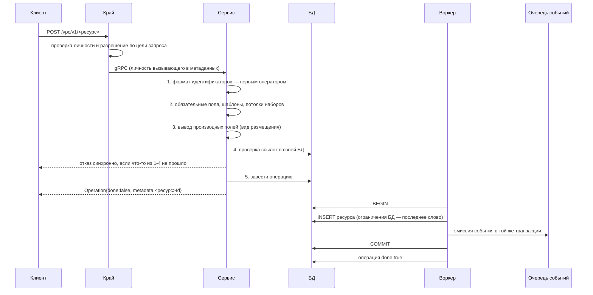

**Что здесь несущее и почему именно так:**

- **Формат идентификатора проверяется первым оператором.** Иначе некорректный идентификатор
  доедет до чтения и вернёт «не найдено» вместо «неверный формат» — два разных ответа на два
  разных вопроса.
- **Ограничение БД — последнее слово, а не дублирование.** Непересечение диапазонов,
  уникальность имени в проекте, взаимоисключающая пара «зона/регион» выражены ограничениями
  исключения, частичной уникальностью и проверками. Программная проверка перед ними существует
  ради **внятного текста ошибки**, а не ради корректности: под гонкой выигрывает БД.
- **Событие эмитится в транзакции писателя.** Не после коммита: иначе ресурс существовал бы, а
  события о нём не было.
- **`done: true` означает «строка закоммичена» и только это.** Ни видимости прав у соседей, ни
  применения в сети он не ждёт. Гейтить его на чужую видимость запрещено: это рождает ресурс,
  который существует, но объявлен неудавшимся.

### §4.2. Создать сеть — три записи в одной транзакции

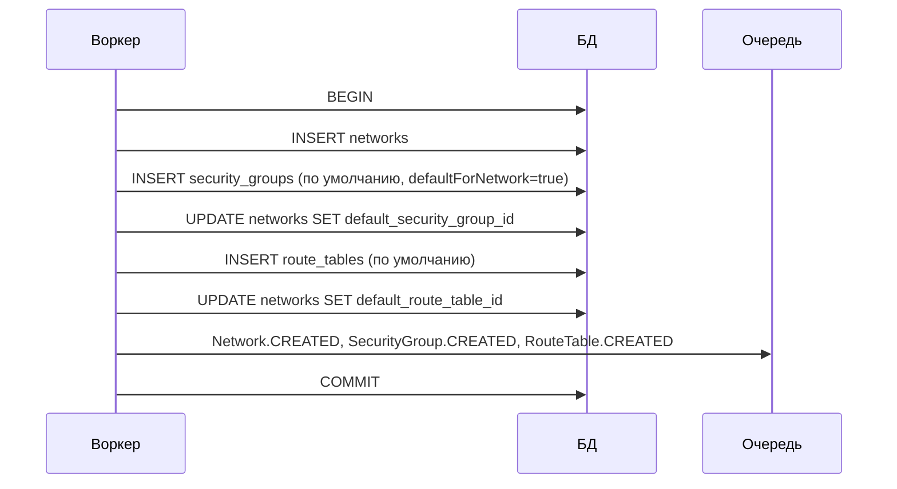

Группа и таблица по умолчанию создаются **в той же транзакции**: сеть без них не может принять
ни одну подсеть, поэтому раздельная фиксация давала бы наблюдаемое промежуточное состояние.

> [!important] Удаление каскадом не идёт — ни при каком дочернем ресурсе (решение владельца 2026-08-13)
> **Создание собирает контур одной транзакцией, удаление — не разбирает.** Асимметрия намеренная и
> вот её причина: у создания предмет один и он известен целиком, у удаления предмет — то, что
> арендатор накопил за время жизни сети, и это знание есть только у него. Каскад по чужому
> накопленному снимает больше, чем просили, и узнать об этом можно только по последствиям.
>
> **Правило:** удаление сети удаляет **только сеть**. Порядок задаёт арендатор — сначала дочерние,
> потом родитель. Непустая сеть отвергается синхронно, и отказ **называет**, что именно мешает, —
> иначе правило превращается в угадывание.
>
> **Сегодня это не так, и одной правкой не закрывается.** Асинхронная часть удаления снимает
> таблицу и группу по умолчанию, а затем сеть. Просто убрать эти два шага нельзя: группа по
> умолчанию арендатору **не отдаётся вовсе** (`default security group cannot be deleted`), и сеть
> стала бы неудаляемой. Значит правки две, и они идут одним изменением: снять каскад **и** сузить
> защиту группы по умолчанию с «нельзя никогда» до «нельзя, пока она привязана хоть к одному
> интерфейсу». Строка плана — §7.2 №36.
>
> **Чем это проверяется** (три пробы, третья — несущая): сеть с дочерними отвергается с их
> перечислением; удаление дочерних по одному проходит; после них удаление сети проходит и **не
> затрагивает ничего постороннего** — число строк соседних таблиц до и после равно. Без третьей
> пробы «каскада нет» остаётся заявлением, а не свойством.

> [!warning] Умолчание безопасности расходится с документацией в двух направлениях сразу
> Два утверждения об одной области, и **оба неверны, в противоположные стороны**.
>
> Первое: контракт интерфейса и **четыре места** публичной документации обещают, что новый
> интерфейс наследует группу по умолчанию своей сети. В коде подстановок **0** (широкий предикат
> по путям интерфейса; контроль: поле читается в 19 местах, значит предикат не слеп) — интерфейс
> без явного набора получает **пустой** набор.
>
> Второе: содержимое группы по умолчанию не описано **ни на одной** странице, и фактическое её
> содержимое не совпадает с тем, что читатель выводит из слова «allow-only».
>
> Следствие для исполнителя названо прямо: он реализует наследование, которого нет, и умолчание,
> которого нет, — и оба раза разойдётся с нами. Исходов два, оба надо выбрать явно: реализовать
> наследование (и тогда пустой набор перестаёт означать «ни одной группы») либо снять обещание из
> четырёх мест; и **отдельно** — привести содержимое группы по умолчанию к решению владельца,
> записав его словом на странице. Строки плана — §7 №14 и №15, решение — §8 №1.

### §4.3. Создать подсеть — вывод размещения, вложенность, непересечение

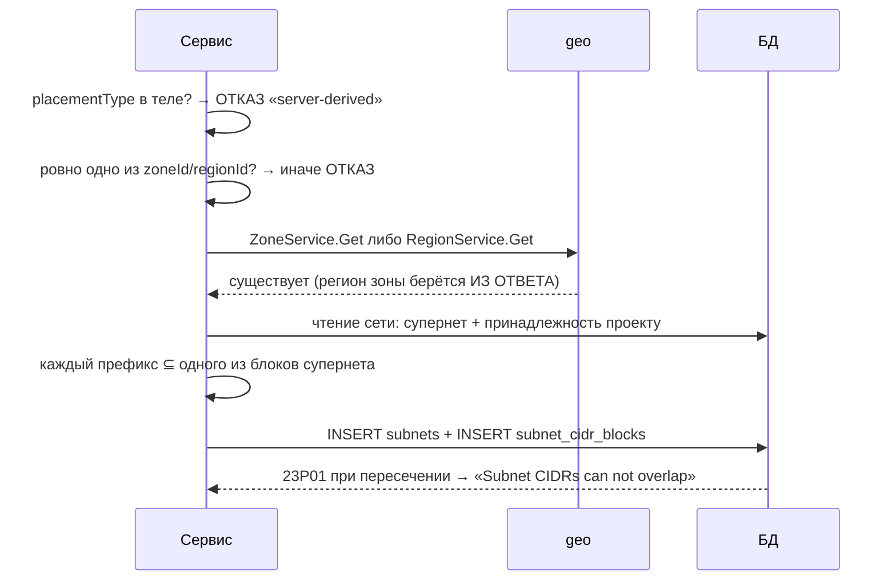

**Регион зоны берётся из ответа владельца и никогда не выводится разбором строки.** Имена зоны и
региона — произвольные строки, между ними нет гарантированного отношения. Строковый вывод
молча возвращает пустое значение на ресурсе без зоны, и проверка когерентности превращается в
тождественно истинную. Проверено по всему сервису: таких выводов **0** в трёх независимых формах
приёма, и запрет зафиксирован тремя комментариями, которым код соответствует.

**Непересечение действует в границах одной сети.** Два арендатора с одинаковым `10.0.0.0/16`
законны **по построению** — ключ ограничения исключения содержит идентификатор сети. Развязку
несёт исполнитель, и это **предусловие интеграции**, а не пожелание (§7).

### §4.4. Интеграция с датаплейном — полный цикл

Единственный сценарий, ради которого вводятся новые внутренние методы.

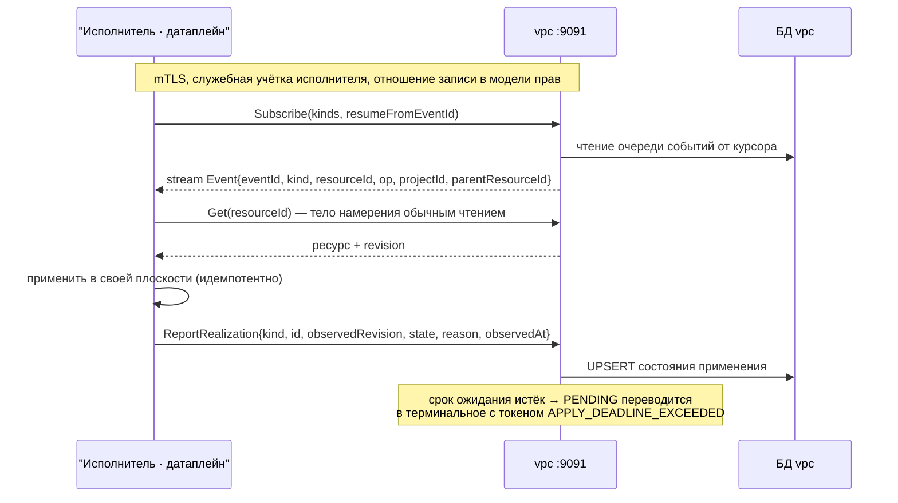

**Событие тонкое намеренно.** Оно сообщает, *что смотреть*, а не *что изменилось*: иначе состав
события начал бы расходиться с ресурсом, и у нас появилось бы два описания одного предмета.

**Подтверждение привязано к ревизии.** Без неё `REALIZED` может относиться к предыдущей версии
намерения — верное утверждение о неверном предмете.

**Срок принадлежит нашим часам.** Молчание исполнителя не должно продлевать наше намерение
бесконечно: «ожидает применения» без срока неотличимо от «применяется сейчас», и это молчание не
поймает ни один мониторинг.

**Очередь событий не отдаётся исполнителю как таблица.** Её содержимое — снимок целой доменной
структуры, включая инфра-поля; у таблицы нет ни авторизации, ни отношения модели прав, ни
курсора для внешнего подписчика. Метод несёт всё это и, кроме того, **проекционный слой с белым
списком полей**: событие содержит только идентификаторы и вид операции.

### §4.5. Привязка интерфейса к машине — атомарный обмен, а не «прочитал → записал»

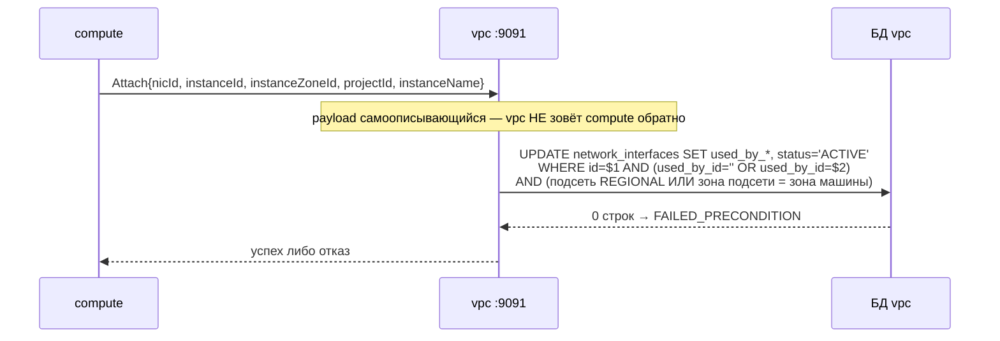

Один оператор, защищённый блокировкой строки. Параллельный писатель ждёт фиксацию, видит
обновлённую строку, условие не совпадает — ноль строк. Программной проверки «свободен ли
интерфейс» перед записью **нет** намеренно: она была бы гонкой.

Зональная когерентность проверяется **в том же условии**, и предикат составлен так, что пустой
регион не делает его тождественно истинным.

### §4.6. Балансировщик — привязка адреса и анонс

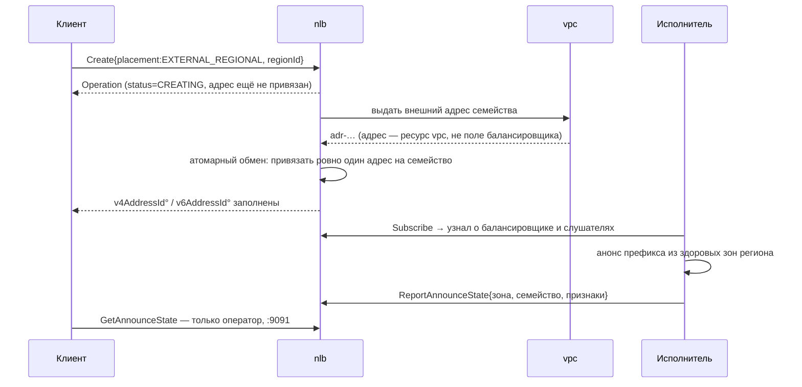

`disabledAnnounceZones` — **намерение** снять анонс из перечисленных зон; фактическое снятие
делает исполнитель, и время снятия оговаривается контрактом потребления, а не подразумевается.
Субсекундное снятие достигается только средствами обнаружения отказа соседа на стороне
исполнителя.

### §4.7. Удаление — возврат в пул в той же транзакции

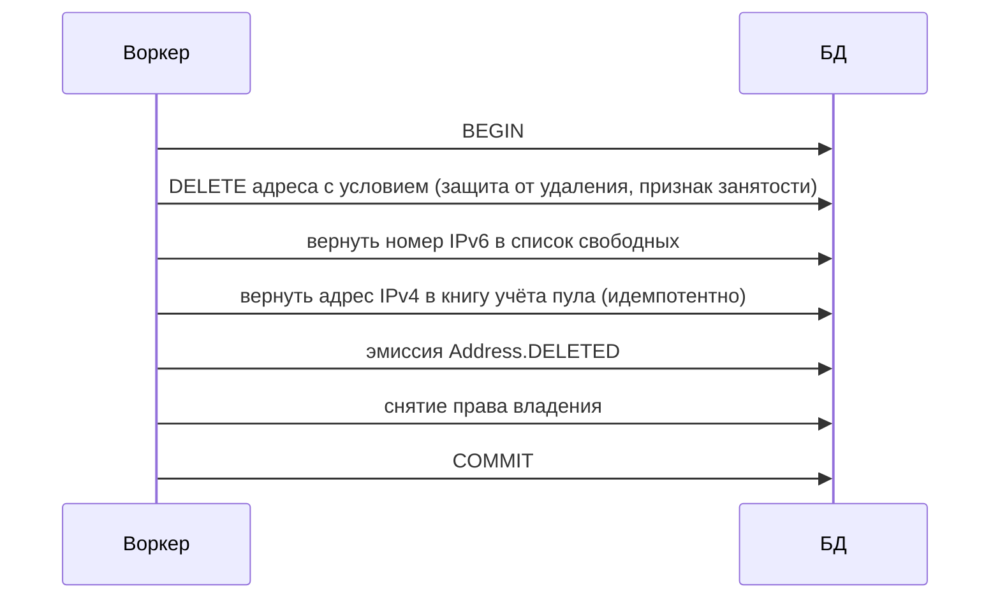

Возврат в пул — **часть контракта удаления**, а не уборка «потом». Без него пул исчерпывается
под параллельной нагрузкой, и исчерпание выглядит как дефект выдачи.

---

## §6. Структура БД

Схема на сервис, общих баз нет, внешних ключей через границу сервиса нет. Ниже — инвентарь и те
ограничения, которые несут инварианты; полное DDL читается по ревизии из каталога миграций.

### §6.1. Схема `kacho_vpc` — 20 таблиц, 27 миграций

| Таблица | Предмет | Несущие ограничения |
|---|---|---|
| `networks` | сеть | уникальность `(project_id, name)` без условия; проверки шаблона имени и описания; ⚠ **две** колонки под тенант-домен: `route_distinguisher` (текст, из базовой миграции, читателей **0**) и `vrf_id` (последовательность, уникален, один читатель) |
| `subnets` | подсеть | два ограничения-проверки закрепляют взаимоисключающую пару «вид размещения ↔ полезная нагрузка»; ограничения исключения на **первичный** блок каждого семейства (остались избыточным дублёром); генерируемые колонки первичных префиксов |
| `subnet_cidr_blocks` | нормализованный набор блоков | `EXCLUDE USING gist (network_id WITH =, block inet_ops WITH &&)` — **непересечение полного набора** в границах сети; каскад при удалении подсети |
| `network_interfaces` | интерфейс | безусловная уникальность `mac_address` **на всё облако**; проверка формата MAC; условие обмена при привязке |
| `security_groups` | группа правил | правила в колонке JSONB; проверка кардинальности набора (256) |
| `route_tables` | таблица маршрутов | маршруты в колонке JSONB; ⚠ потолка числа маршрутов **нет** |
| `addresses` | адрес | глобальная уникальность внешнего адреса **обоих** семейств (частичные индексы по выражению JSONB); генерируемые колонки дискриминаторов |
| `address_pools`, `address_pool_cidrs`, `address_pool_free_ips`, `address_pool_network_default` | инвентарь внешних префиксов и книга учёта | `EXCLUDE USING gist (kind WITH =, block inet_ops WITH &&)` — непересечение **глобально по виду пула**; арендаторского измерения у пула нет вовсе; проверка «адрес в книге хранится в host-форме» |
| `ipv6_pool_cursors`, `ipv6_allocated_ips`, `ipv6_released_offsets` | разрежённая выдача IPv6 | уникальность смещения в пуле |
| `address_references` | кто занимает адрес | снимок имени занимающего на момент записи |
| `operations` | долгоживущие операции | общая таблица из фундамента |
| `fga_register_outbox` | очередь регистрации прав | claim по голове партиции; дренаж есть |
| `vpc_outbox` | очередь доменных событий | ⚠ **42** точки эмиссии, читателей **0**, `processed_at` никто не выставляет, срока хранения нет, наблюдаемости нет |
| `vpc_watch_cursors` | курсоры подписчиков | ⚠ в коде **не упомянута** |

### §6.2. Схема `kacho_nlb` — 10 таблиц, 29 миграций

| Таблица | Предмет | Несущие ограничения |
|---|---|---|
| `load_balancers` | балансировщик | уникальность имени в проекте; кардинальность «один адрес на семейство»; условие обмена при привязке |
| `listeners` | слушатель | внешний ключ на балансировщик; уникальность `(балансировщик, порт, протокол)` |
| `target_groups` | группа бекендов | проверка здоровья в колонке JSONB; задержка снятия с регистрации |
| `targets` | бекенд | проверка «ровно одна из четырёх форм адресации»; вес `0..1000`; метка начала вывода |
| `load_balancer_announce_state` | наблюдаемое состояние анонса | ключ `(балансировщик, зона, семейство)`; **все** инфра-признаки живут здесь и **только** здесь |
| `nlb_outbox`, `nlb_watch_cursors` | очередь и курсоры | реализованы, читателей **0** |
| `operations`, `attached_target_groups`, `fga_register_outbox` | служебные | — |

### §6.3. Что интегратору важно знать о хранении

1. **Инфра-признаки уже отделены таблицей**, а не полем: у балансировщика они в
   `load_balancer_announce_state`, и публичная проекция их не читает. Тот же приём применяется к
   состоянию применения сети — отдельная таблица, а не колонка в `networks`.
2. **Доступ к БД исполнителю не выдаётся.** Ни на чтение: связь идёт методами `:9091`. Причина не
   формальная — в очереди событий лежит снимок целой доменной структуры, включая инфра-поля.
3. **Идемпотентность выражена в SQL, а не в коде**: возврат в книгу учёта — вставка с игнорированием
   конфликта; привязка — обмен по условию; выдача из пула — единственный оператор с блокировкой и
   пропуском занятых.

---

## §5. Связи ресурсов

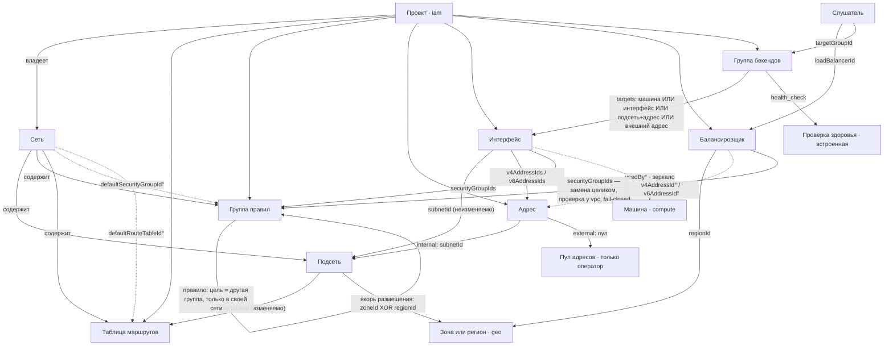

**Правила связей, которые держатся не соглашением, а конструкцией:**

1. **Один владелец на тип ресурса.** Зона и регион — домен `geo`; проект — `iam`; машина —
   `compute`; том — `storage`. Сеть не держит зеркальных строк чужих ресурсов: таблиц, чей
   предмет — чужой ресурс, в её схеме **0**, межсервисных внешних ключей **0**.
2. **Ссылка через границу сервиса — по неизменяемому `id`, без внешнего ключа**, с проверкой у
   владельца на пути запроса и отказом `UNAVAILABLE`, если владелец недоступен.
3. **Денормализованных зеркал чужих данных ровно два**, и оба — снимок имени на момент записи в
   строке о **своём** ресурсе (`address_references.referrer_name`,
   `network_interfaces.used_by_name`), а не строка о чужом ресурсе.
4. **Регион по зоне берётся только резолвом у владельца.** Проверено предикатом по всему
   сервису: строкового вывода региона из имени зоны — **0 мест** в трёх независимых формах
   приёма. Запрет зафиксирован в трёх комментариях кода, и код им соответствует.
5. **Размещение наследуется, а не дублируется.** Якорь один — подсеть; интерфейс и адрес зону не
   несут, они получают её через `subnetId`. У региональной (anycast) подсети зоны нет вовсе, и
   она исключена из зональной проверки **по построению**, а не оговоркой.

---

## §7. План работ

Порядок колонок: предмет · что сейчас в дереве · что нужно · публичность · кто исполняет ·
приоритет · этап · чем держится. Строка без последней колонки — пожелание, а не план, и в
таблицу не попадает.

> [!important] Нумерация строк здесь — **своя, плана**, и она НЕ совпадает с номерами задач в
> `vpc-module-delta.md`
> Два документа нумеровались независимо, поэтому «задача N» в списке и «строка N» здесь — **разные
> предметы**: строка 9 плана = задача 26 списка, строка 14 плана = задача 3 списка, и так далее.
> Соответствие — приложением в конце §7. Исполняемый порядок работ (волны, состав ломающего окна,
> запреты на порядок) живёт **в списке**; здесь — инвентарь предметов с координатами.

### §7.1. Снятие поверхности (обязательный раздел — план только из добавлений для этого домена подозрителен)

| # | Предмет | Сейчас (координата) | Нужно | Публичность | Исполняет | П | Этап | Чем держится |
|---|---|---|---|---|---|---|---|---|
| 1 | три метода гранулярной правки маршрутов | `api/routetable/handler.go:214-229` — отвечают отказом всегда | снять с контракта, зарезервировать номера и имена. Реестр решений снятие **не санкционирует** — он оставляет его владельцу и советует приурочить к объявленному ломающему окну. Уйдут три **записи** каталога; токен `vpc.route_tables.update` остаётся у `Update` | public :9090 | kacho | P1 | E1 | проба края: путь отсутствует → 404; проба `buf breaking` объявляет ломающее изменение осознанно |
| 2 | ресурс шлюза выхода — **заполнить, не снимать** | `gateway.proto:45-46` — пустая разновидность; единственная ссылка (`StaticRoute.gateway_id`) отвергается синхронно | наполнить `oneof` вариантами: трансляция публичная и приватная, «только исход» для IPv6; реализовать ссылку из статического маршрута; минимум ручек распределения портов с полем действующего значения. **Шаг 0, до наполнения:** известный набор маски `Update` содержит `gateway_type` — **имя столбца БД** (`0001_initial.sql:435`), а не поля контракта, поэтому законное имя отвергается как неизвестное, а имя столбца принимается; починить до того, как в маску добавится вариант. **Ресурс нужен** — им выражается отключаемость выхода, полем в подсети это невыразимо | public :9090 | kacho | P1 | E1 | маршрут со ссылкой на шлюз работает; приватная трансляция даёт трансляцию без внешней достижимости; IPv6 за «только исход» не достижим извне; отсоединение наблюдаемо в состоянии |
| 3 | `AddressService.GetByValue` | внешняя ветвь **неавторизуема по построению**: область берётся из подсети, у внешнего адреса подсети нет | снять; сценарий закрывает `List` с сужением | public :9090 | kacho | P1 | E1 | проба: у каждого публичного метода область запроса резолвится для **всех** ветвей входа |
| 4 | `AddressService.ListBySubnet` | строгое подмножество `List`, который уже несёт сужение по подсети | снять | public :9090 | kacho | P2 | E1 | та же проба единственности пути к ответу |
| 5 | `NetworkInterface.status` | чистая функция публичного `usedBy`: два производимых значения переключаются ровно там, где меняется привязка; три значения без производителя | **отдельной задачей не снимать.** Судьба решается внутри строки 27 (подтверждение применения): именно она даёт полю производителя. `reserved "status"` выжег бы имя, которое строке 27 нужно, а снятие поля сломало бы `Attach`/`Detach` | public :9090 | kacho | P1 | E1 | проба строки 27: после отчёта исполнителя значение производится, до отчёта — не производится само по себе |
| 6 | `predefinedTarget` у правила | свободная строка без словаря; **потребители есть** — поле объявляют провайдер и три страницы документации, поэтому снятие несёт их правку; адрес, куда контракт отправляет за словарём, отсутствует | ввести закрытый словарь **или** снять с контракта; молча принимать нельзя | public :9090 | kacho | P1 | E1 | проба: каждое значение ветви цели либо меняет поведение, либо отвергается по имени поля |
| 7 | `create_default_security_group` + переменная оператора | непоставленный пункт APPROVED-приёмки VPC-1 (строки 781-784) при поставленных соседних | снять поле и переменную; группа по умолчанию — безусловно | public + конфиг | kacho | P1 | E1 | декларативная проба профилей: переменной нет ни в одном файле значений |
| 8 | `instance_id` / `index` в спеке провайдера для интерфейса | сервер отвергает безусловно; в ствол ещё не влито | снять из спеки, пока это не ломающее изменение | провайдер | kacho | P1 | E1 | проба паритета: каждое поле спеки провайдера принимается сервером |
| 9 | искажённые имена идентификаторов права: **27 записей** из 82 (единица — запись `fqn → permission`; уникальных токенов 79, различных искажённых сегментов 22) | написаны **рукой в аннотациях контракта** (`gateway_service.proto:24`, `:36`); генератор токен не синтезирует, а читает. Обе встроенные копии каталога побайтово равны | править **аннотации proto**, затем регенерировать стабы и обе копии; согласовать со вторым словарём — закрытая таблица iam знает ресурс в **единственном** числе | конфиг оператора | kacho | P1 | **до E1** | гейт побайтового совпадения копий + проба «имя ресурса в множественном числе ровно один раз» |
| 10 | `domain.DhcpOptions` | 17 не-тестовых вхождений; в JSONB пишется **одной вставкой и одним обновлением** (не «на каждой»), снят с контракта | снять тип и колонку новой миграцией | внутреннее | kacho | P2 | E2 | гейт мёртвого типа: нет прод-импортёров |
| 11 | `networks.route_distinguisher` | текстовая колонка из базовой миграции, читателей **0** | снять новой миграцией **или** назначить предметом; двух идентификаторов тенант-домена быть не должно | внутреннее | kacho | P1 | E1 | проба: у колонки схемы есть читатель либо она отсутствует |

### §7.2. Исправление контракта и документации

| # | Предмет | Сейчас | Нужно | Публичность | Исполняет | П | Этап | Чем держится |
|---|---|---|---|---|---|---|---|---|
| 12 | `placementType` объявлен входом | **106 строк в 25 файлах** в границах vpc против одного энфорсящего (прежнее «не менее девяти» было счётом по другой единице) | привести все места к поведению кода: поле выводится, вход отвергается | public + документация | kacho | P0 | E1 | проба: пример запроса из документации исполняется краем успешно |
| 13 | страница подсети описывает снятый контракт | 17 вхождений снятых имён; действующих имён во всей документации **0**; пример `Create` отвергается краем целиком | переписать страницу; примеры сделать исполняемыми | документация | kacho | P0 | E1 | гейт: каждый пример запроса из документации прогоняется против края |
| 14 | наследование группы по умолчанию | обещано в 4 местах, подстановок 0 | либо реализовать, либо снять обещание | public + документация | kacho | **P0** | E1 | проба: интерфейс без явных групп получает ровно то, что обещает контракт |
| 15 | семантика пустого набора правил и состав группы по умолчанию | не записаны нигде; фактически умолчание **открыто** на весь IPv4-вход, IPv6 закрыт | записать словом; привести умолчание к решению владельца (§8) | public + документация | kacho | **P0** | E1 | проба посадки: новый интерфейс в новой сети получает объявленную посадку, обе семьи |
| 16 | правило без цели | принимается и сохраняется; аннотация «ровно одна цель» энфорсера не имеет | отвергать синхронно по имени поля | public :9090 | kacho | **P0** | E1 | проба инъекцией: правило без цели отвергается; законное правило проходит |
| 17 | подсеть без обоих префиксов | принимается; реестр решений заявляет, что так нельзя | отвергать синхронно | public :9090 | kacho | P1 | E1 | проба: обе семьи пусты → отказ; одна семья → проходит |
| 18 | верхняя граница размера подсети | контракт обещает «не короче /16» (`subnet.proto:78`), код проверяет только `Bits() > 28` | **решение 1.2 списка: обещание остаётся, код начинает исполнять** — префикс короче `/16` отвергается синхронно по имени поля | public + документация | kacho | P1 | E1 | `/16` проходит, `/15` отвергается; плюс гейт паритета границы контракта и константы валидатора |
| 19 | текст исчерпания подсети | называет 429 при ограниченном переборе — текст лжёт о состоянии | различить «пробы исчерпаны» и «свободных нет»; текст привести к состоянию | public :9090 | kacho | P1 | E1 | проба: на заполненной подсети приходит один исход, на переборе — другой |
| 20 | сообщения об отказе на двух путях подставляют исходную ошибку целиком | подстановка через `%v`; в асинхронной части создания адреса — **два** класса (`create.go:529`, `:559`/`:565`), при более широком предикате — **6 мест и 3 класса** (добавляется `alloc_shared.go:178`) | фиксированный непрозрачный текст; диагностика — в лог | public :9090 | kacho | **P0** | E1 | проба уровня сообщения на обоих путях: сообщение не содержит подстроки исходной ошибки |
| 21 | различимость исходов при ссылке на объект чужого проекта | три пути ссылок отвечают текстами, по которым исходы отличимы друг от друга; сверки проекта на части путей нет | свести исходы к одному тексту, тождественному настоящему промаху; добавить сверку проекта — **но не первым шагом**: первой остаётся проверка формата идентификатора, иначе мусорный вход получит контракт-тон отсутствия объекта. Порядок: формат → проект → существование → состояние | public :9090 | kacho | **P0** | E1 | проба побайтового совпадения текста отказа и текста настоящего промаха, по каждому из трёх путей |
| 22 | проверка «цель в своей сети» опциональна | `reader == nil → nil` на двух путях из четырёх | сделать порт обязательным позиционно на всех четырёх | внутреннее | kacho | P1 | E1 | проба композиционного корня: конструктор без порта не компилируется |
| 23 | `Address.reserved` записывается арендатором, но ничего не решает | записанное решение с предикатом снятия | оставить как есть; предикат снятия — появление энфорсера | public :9090 | kacho | P3 | — | запись в реестре решений; снятие по предикату |
| 24 | ложный комментарий у гарда аварийной ручки фильтра | ручка `authz.list-filter.breakglass` в производственном режиме **инертна по построению** — прежняя формулировка «открывает авторизацию» была неверна. Дефект в другом: `cmd/vpc/main.go:145-146` утверждает, что `Config.Validate()` отвергает такой конфиг, — этого условия там нет вовсе | добавить условие в валидацию **или** снять ручку; ложный комментарий убрать в том же изменении | конфиг оператора | kacho | **P0** | **до E1** | проба инъекцией в обе стороны: с включённой ручкой старт запрещён |
| 25 | ссылки контракта в отсутствующий каталог документации | битых **8 из 8** (каталога `concepts/` нет вовсе); 6 — число различных URL, а не число живых | привести к существующим адресам | public | kacho | P2 | E1 | гейт сборки документации: ноль битых ссылок |
| 36 | удаление сети и два системных дочерних | `api/network/delete.go` — асинхронная часть удаляет таблицу и группу по умолчанию, затем сеть; сеть с **арендаторскими** дочерними отвергается синхронно уже сегодня | **каскад ОСТАЁТСЯ** (решение 1.1 списка, 2026-08-13 — отменяет директиву того же дня): снятие само создаёт окно, в котором сеть жива без группы по умолчанию, и роняет утверждённый **VPC-1-19**. Осталась одна правка: отказ на непустой сети **перечисляет** мешающее по видам и числам, без идентификаторов | public :9090 | kacho | P1 | E1 | две пробы: сеть с двумя подсетями и не-дефолтной группой → отказ называет оба вида и оба числа; сеть только с системными дочерними → **успех** (положительный контроль, иначе проба зеленеет на запрете удаления вообще) |

### §7.3. Интеграция с датаплейном

| # | Предмет | Сейчас | Нужно | Публичность | Исполняет | П | Этап | Чем держится |
|---|---|---|---|---|---|---|---|---|
| 26 | доставка намерения для сети | эмиттер есть (42 точки), шва нет | `InternalResourceLifecycleService.Subscribe` по образцу балансировщика: курсор возобновления, отношение записи, **проекционный слой с белым списком полей** | **internal :9091** | намерение у нас — исполняет фабрика | P0 | E1 | проба: в событии отсутствует любое поле, которого нет в белом списке (инъекция инфра-поля роняет) |
| 27 | подтверждение применения | нет ни одного метода | `ReportRealization` с привязкой к ревизии; закрытый набор состояний; **срок** по нашим часам | **internal :9091** | фабрика сообщает | P0 | E1 | проба: истечение срока переводит состояние в терминальное; отчёт о чужой ревизии отвергается |
| 28 | здоровье бекендов | вычисляется из возраста (`get_target_states.go:16-22`) | `ReportTargetHealth`; публичное чтение отдаёт измеренное | **internal :9091** | фабрика измеряет | P0 | E1 | проба: без отчётов состояние не становится «здоров» само по себе |
| 29 | профиль возможностей исполнителя + предусловие пересечения адресов | не зафиксировано нигде | **два предмета одной строкой.** (1) Исполнитель объявляет профиль возможностей (пересечение адресов · отслеживание состояния по семействам · ссылка на группу · гарантированный размер кадра · предел соединений), профиль читается при старте, и наш контракт **обещает только пересечение профиля с контрактом**. (2) Пересечение адресов между арендаторами не включается, пока признак профиля не выполнен | конфиг оператора | требование к фабрике | P0 | E1 | декларативная проба профиля: признак объявлен, иначе развёртывание отказывает |
| 30 | перечень префиксов платформы и фабрики | нет | таблица зарезервированных префиксов + синхронный отказ при пересечении супернета арендатора с ней | конфиг + public отказ | kacho | P1 | E1 | проба: супернет, пересекающий зарезервированный префикс, отвергается по имени поля |
| 31 | распорядитель тенант-домена | локальная последовательность утверждает, что всё пространство наше | **заморозить**: снять с поля роль работающей тенантности в документации; распорядителя назначить вместе с фабрикой | внутреннее | решение владельца | P1 | E1 | запись решения с предикатом: делегированный диапазон объявлен → поле получает источник |
| 32 | потолок числа статических маршрутов | отсутствует | ввести потолок + проверку БД, как у четырёх соседних наборов | public :9090 | kacho | P1 | E1 | проба границы + проверка БД как атомарный дублёр |
| 33 | пол-обязательство по размеру кадра | нет; публиковать измеренное значение **нельзя** (отпечаток инкапсуляции) | одно постоянное число «гарантированный полезный размер не менее N», одинаковое для всех сетей и зон | public, константа | обязательство к фабрике | P2 | E2 | проба: значение постоянно и не зависит от сети/зоны |
| 34 | `proxyProtocolV2` | поле есть, ни один L4-датаплейн исполнить не может (заголовок вставляет только владелец байтового потока) | **решение принято** (§7.11 документа датаплейна): **снять с контракта**, зарезервировать номер и имя. Подтверждено независимо: у VPP обрамления PROXY нет вовсе — то есть исполнителя не существует ни в одном из рассмотренных датаплейнов | public :9090 | kacho | P1 | E1 | проба: путь отсутствует; поле в теле запроса отвергается по имени |

| 37 | предел одновременных соединений на интерфейс | отсутствует; плотность интерфейсов на узел не зафиксирована ни в одном документе | **10 000** (решение 1.4 списка). Получено: потолок таблицы состояний узла ≈1 000 000 записей ÷ **64** интерфейса на узел ≈15 600, округлено вниз с запасом на трафик самого узла и на IPv6 на процессоре (§8.5). Одно число для всех сетей, зон и семейств; публикуется постоянной и исполняется как предел | public, константа | предел держит исполнитель | P1 | E1 | превышение обязано быть наблюдаемым арендатору (счётчик отвергнутых, не тишина). Производителя счётчика у нас нет → идёт в conformance исполнителя **открытым долгом**, а не пробой в наборе |
| 38 | снятие правила обрывает установленные соединения | не записано нигде | записать в контракт прямо: снятие или правка правила **обрывает** соединения, которые им разрешались. Причина — свойство отслеживания состояния, а не наша реализация; арендатор обязан знать это до, а не после | public, документация | kacho | P1 | E1 | проба документации: утверждение присутствует на странице правил; проба поведения принадлежит conformance исполнителя |
| 39 | три метода под-перечисления сети (`ListSubnets`, `ListSecurityGroups`, `ListRouteTables`) | второй путь к ответу, который уже даёт список ресурса с сужением, и объект проверки прав у них **другой** (сеть, а не ресурс) — дословно критерий строк 3 и 4 | снять, зарезервировать номера и имена (решение 1.5 списка). **Нельзя раньше расширения белого списка фильтра таблиц маршрутизации**: там только `name`, поэтому снятие до расширения отняло бы возможность, не дав замены. У подсети и группы правил `network_id` в белом списке уже есть | public :9090 | kacho | P1 | E1 | единственность пути к ответу + проба края: путь отсутствует → 404, **и** список с сужением по сети возвращает то же множество (положительный контроль обязателен, иначе «404» зеленеет и на потерянной возможности) |

| 40 | гарантированная полоса на интерфейс | понятия полосы нет **нигде**: 0 вхождений в контрактах vpc и nlb, 0 у типа машины compute | **не менее 1 Гбит/с**, постоянная для всех сетей, зон и семейств; публикуется полом, измеренное не публикуется. Выведено из плотности 64 интерфейса на узел: 64 × 1 = 64 Гбит/с под 100-гигабитной картой | public, константа | обязательство к исполнителю | **P0** | E1 | значение постоянно и не зависит от сети/зоны/семейства (положительный контроль — другая зона даёт то же число); наблюдаемое — conformance исполнителя |
| 41 | ограничение полосы, задаваемое арендатором | отсутствует | вводится **только** при признаке в профиле возможностей (строка 29); без признака поля **нет вовсе**, а не «принимается и игнорируется». Выполнимо на обоих этапах: ограничение на логический порт сегодня, на виртуальную функцию в коммутаторе потом | public :9090 | kacho | P1 | E2 | пара: при признаке поле меняет наблюдаемое; без признака **отсутствует в дескрипторе** |
| 42 | темп установления соединений | отсутствует; строка 37 задаёт только **размер** таблицы состояний | **2 000/с** на интерфейс, всплеск **8 000**. Из той же плотности: бюджет узла на вставку ≈128 000/с ÷ 64. Совместимо с 10 000 одновременных (набираются за 5 с при постоянном темпе) | public, константа | предел держит исполнитель | **P0** | E1 | счётчик отвергнутых наблюдаем арендатору → conformance исполнителя; наша сторона публикует число и не расходится с ним |
| 43 | ограничение темпа запросов к API + опции gRPC-сервера | **ничего нет**: терминов темпа в непробном коде края — 0; `MaxConcurrentStreams`/`MaxRecvMsgSize`/`MaxSendMsgSize`/`InTapHandle` — 0 файлов во всём дереве. Умолчания `grpc v1.83.0` по исходнику: одновременных вызовов `math.MaxUint32` и предел клиенту **не объявляется**, отправка не ограничена, приём 4 МиБ | публичный листенер на принципала: чтение ≥100/с, мутации ≥20/с, всплеск ×5, в полёте 16. Оба листенера: одновременных вызовов **250**, отправка **16 МиБ**, приём — умолчанием **и это записать решением**. Внутренний — по личности сертификата и заведомо выше рабочего, чтобы не задушить свой же дренаж. Отказ `RESOURCE_EXHAUSTED` (→429) с `RetryInfo` | оба листенера + край | kacho | **P0** | **до E1** | пара «код + HTTP-статус»; законный темп проходит; со снятым ограничителем краснеет; декларативная проба профилей + отказ в старте, если включён без величин; гейт: `NewServer` без объявленного предела одновременных вызовов — находка |
| 44 | квоты на число ресурсов | нет **нигде** в дереве (0 настоящих вхождений при положительном контроле 422) — потолка у арендатора не существует; **семь** счётчиков не ведётся ни один, при том что каждый набор внутри строки ограничен | записать **открытым долгом с владельцем**: домен квот владеет ЗНАЧЕНИЕМ и выдачей, владелец типа — УЧЁТОМ и отказом. vpc отдаёт три вещи: (1) форма — атомарное списание одним оператором в writer-TX, **никогда** `count(*)` + вставка (check-then-act, запрет №10); (2) момент — создание · удаление **включая системных детей** · компенсация сорванного создания · идемпотентность повтора; (3) на пределе — синхронный `RESOURCE_EXHAUSTED` (→429), называющий предмет и **свой** предел, но не ёмкость платформы. Величины здесь **не назначаются** (см. §8.6). Самодельный потолок в vpc — находка | — | домен квот | P1 | E1 (запись) | пробы на потолок нет и быть не может — потолка нет; это сказано прямо. Проверяемо сейчас: (а) **отсутствие** самодельного потолка, доказано инъекцией с законным близнецом (потолок набора внутри строки молчит); (б) **самоистечение** — гейт краснеет, когда контракт домена квот в дереве появился, а vpc предел не читает. Предикат снятия — три условия, все проверяемые (задача 50 списка) |
| 45 | `ddos_protection_provider` | словарь общего фундамента называет **конкретного внешнего поставщика** (`pkg/validate/validate.go:267-271`); поле валидируется, кладётся в домен и возвращается в ответе, но **ни одна ветвь на нём не ветвится** | снять с контракта (`reserved` номер и имя), словарь удалить из общего фундамента. Целая подсистема заводится отдельным доменом, а не полем в чужом сообщении. В том же окне — `outgoing_smtp_capability`: у него нет ни одного законного непустого входа | public :9090 | kacho | **P0** | E1 | гейт «поле публичного запроса имеет читателя, меняющего поведение» + **отдельная** проба: имя внешнего поставщика в общем фундаменте — находка независимо от читателей |
| 46 | обратное давление на потоке событий | поток строки 26 темпа не имеет | очередь отправки **ограничена**; при переполнении поток закрывается, исполнитель возобновляется со своего курсора. Буферизация в памяти запрещена — она превращает шумного арендатора в отказ нашего процесса для всех | **internal :9091** | kacho | P1 | E1 | производитель быстрее потребителя → поток закрыт **и** возобновление с курсора не теряет ни одного события (положительный контроль обязателен) |

**Вне объёма E1, названо явно:** соединение сетей, транзит, связь с чужой инфраструктурой,
приватный доступ к сервисам платформы, разрешение имён, журнал соединений, проверка достижимости,
счётчики трафика, ограничение полосы, приоритизация, квоты на число ресурсов (отдельный домен
политики с исполнением у владельца ресурса), проекция «что действует» (у неё нет наполнения,
одновременно нового и допустимого), правила уровня организации.

---


### §7.5. Приложение: соответствие нумерации плана и списка доработок

Два документа нумеровались независимо. Таблица нужна, чтобы «задача N» и «строка N» не резолвились
друг в друга по ошибке; предмет — единственный надёжный ключ.

| Строка плана | Задача списка | Предмет |
|---:|---:|---|
| 1 | 10 | три метода правки маршрутов |
| 2 | 11 | ресурс шлюза выхода |
| 3 | 12 | `AddressService.GetByValue` |
| 4 | 13 | `AddressService.ListBySubnet` |
| 5 | 14 | `NetworkInterface.status` (снята, решается внутри 29 списка) |
| 6 | 15 | `predefinedTarget` |
| 7 | 16 | `create_default_security_group` |
| 8 | 19 | спека провайдера: `instance_id` / `index` |
| 9 | 26 | имена идентификаторов права |
| 10 | 17 | `domain.DhcpOptions` |
| 11 | 18 | колонка `route_distinguisher` |
| 12 | 1 | `placementType` объявлен входом |
| 13 | 2 | страница подсети описывает снятый контракт |
| 14 | 3 | наследование группы по умолчанию |
| 15 | 4 | состав группы по умолчанию |
| 16 | 5 | правило без цели |
| 17 | 20 | подсеть без обоих префиксов |
| 18 | 21 | верхняя граница размера подсети |
| 19 | 22 | текст исчерпания подсети |
| 20 | 6 | подстановка исходной ошибки в отказ |
| 21 | 7 | различимость исходов по текстам |
| 22 | 23 | обязательный порт проверки цели |
| 23 | — | `Address.reserved` (решение, работы нет) |
| 24 | 8 | ложный комментарий у гарда ручки фильтра |
| 25 | 27 | ссылки контракта в документацию |
| 26 | 28 | доставка намерения — подписка |
| 27 | 29 | подтверждение применения |
| 28 | — | здоровье бекендов (домен nlb) |
| 29 | 42 | профиль возможностей + предусловие пересечения |
| 30 | 30 | перечень зарезервированных префиксов |
| 31 | 31 | распорядитель тенант-домена |
| 32 | 24 | потолок числа статических маршрутов |
| 33 | 44 | пол-обязательство по размеру кадра |
| 34 | 34 | `proxyProtocolV2` (снять) |
| 36 | 9 | удаление сети: отказ с перечислением |
| 37 | 32 | предел соединений на интерфейс |
| 40 | 46 | гарантированная полоса на интерфейс |
| 41 | 47 | ограничение полосы арендатором |
| 42 | 48 | темп установления соединений |
| 43 | 49 | темп запросов к API + опции сервера |
| 44 | 50 | квоты (долг домена квот) |
| 45 | 51 | `ddos_protection_provider` — снять |
| 46 | 52 | обратное давление на потоке событий |
| 38 | 43 | снятие правила обрывает соединения |
| 39 | 45 | три метода под-перечисления сети |

**Чего нет в плане и живёт только в списке:** равенство проектов адреса и подсети (задача 25),
белый список фильтра (41), именованная группа адресов (33), обратные ссылки (40), задачи 35–39.
Строка 35 в плане отсутствует — нумерация плана не непрерывна, и это не пропуск, а её история.

## §8. Решения владельца — приняты

Открытых вопросов не осталось. Каждое решение обосновано четырьмя критериями:
**конкурентоспособность · перспективность 2026 · производительность · безопасность**. У каждого
названа цена и предикат пересмотра.

### 8.1. Умолчание безопасности — модель закрыта в обе стороны, группа по умолчанию разрешает исходящее явно

**Решение — три части, вводятся одним изменением:**
1. **Модель** — fail-closed в **обе** стороны: нет правила, значит не разрешено.
2. **Засеянная группа по умолчанию** — несёт **явное** разрешение исходящего и **ни одного**
   входящего правила. То есть послабление видно в ресурсе, а не спрятано в умолчании.
3. **Интерфейс наследует** группу по умолчанию своей сети, и это записано в контракте.

**Почему так, а не «закрыто всё».** Безопасность требует закрытой модели; работоспособность требует
исходящего доступа — арендатор, чья машина не может дойти до репозитория пакетов, заводит обращение
в первый час. Разница между «модель открыта» и «модель закрыта, а послабление объявлено ресурсом» —
в том, что второе **видно и правится**, а первое обнаруживается по последствиям. Входящее закрыто у
**всех** сопоставимых продуктов; открытое входящее сделало бы нас исключением и обузой.

**Почему не «оставить как сейчас».** Сейчас арендатор читает «allow-only» и выводит закрытое
умолчание, а получает другое; при этом наследование не работает, и интерфейс остаётся вообще без
групп. Два расхождения в противоположные стороны — худшее из состояний: неверен любой вывод
читателя.

**Цена.** Изменение поведения для существующих арендаторов. **Она равна нулю, если сделать сейчас**:
по вашей же записанной директиве облако не в проде, поэтому переносить нечего. Через полгода эта же
правка станет ломающей — значит она не «важная», а **срочная**.

**Предикат пересмотра:** появление арендатора, которому закрытая модель ломает сценарий, который
нельзя закрыть явным правилом. Такого сценария я не нашёл.

### 8.2. Распорядитель MAC — мы

**Решение.** Адрес канального уровня чеканим мы, уникальность держим на всё облако, у сетевой
команды запрашиваем делегированный префикс. Поле **остаётся** на публичной поверхности.

**Почему.** Целевая модель разгрузки идентифицирует интерфейс **по MAC** — значит адрес обязан
существовать и быть стабильным до размещения, а это может обеспечить только тот, кто создаёт
интерфейс. Безопасность: свой MAC проверяется против своей строки, чужой — только по отчёту.
Арендатору обещана неизменяемость на всю жизнь интерфейса, и обещание держится лишь при одном
распорядителе.

**Отменяет** прежнее предложение снять поле: оно было ошибкой, поле несущее.

**Предикат пересмотра:** фабрика требует назначать MAC сама → поле становится наблюдаемым, обещание
неизменяемости снимается.

### 8.3. Шлюз выхода — оставить и заполнить, варианты по этапам

**Решение.** Ресурс остаётся. Варианты вводятся по мере появления потребителя:
- **E1**: публичная трансляция адресов + **«только исход» для IPv6**;
- **E3**: приватная трансляция — **вместе** с приватным доступом к сервисам платформы.

**Почему остаётся.** Ресурсом выражается **отключаемость** выхода: у неявного шлюза нет ни
жизненного цикла, ни прав, ни признака «отсоединён», поэтому «выход отключён» невыразимо. По этому
измерению наша форма сильнее двух из трёх сравниваемых поставщиков. И неявный выход — единственная
форма, которую поставщик сворачивает **по объявленным датам**.

**Почему «только исход» для IPv6 — в E1, а не потом.** Без этого варианта IPv6-адрес **автоматически
означает входящую доступность**. Это дефект безопасности, а не отсутствие удобства.

**Почему приватная трансляция — в E3.** Её потребитель — приватный доступ к сервисам, и он в E3.
Ввести вариант раньше значит завести скелет без предмета.

**Предикат пересмотра:** появление потребителя приватной трансляции раньше E3 переносит её вперёд.

### 8.4. Три метода правки маршрутов — снять в этом же ломающем изменении

**Решение.** Снять с контракта, зарезервировав номера и имена.

**Почему сейчас.** Реестр решений оставляет снятие вам и советует приурочить его к **объявленному
ломающему изменению**. Это изменение уже объявляется — но **не тем составом, что стоял здесь
раньше**: варианты шлюза **аддитивны** (наполнение пустого сообщения и снятие отказа у уже
существующего поля — расширение входа, `buf breaking` его не покажет), а поле статуса интерфейса
отдельно **не снимается** (строка 5). Окно держат: снятие ветви предопределённой цели, снятие поля
создания группы по умолчанию, снятие двух методов адреса, снятие трёх методов правки маршрутов,
снятие трёх методов под-перечисления сети (решение 1.5 списка) и снятие поля защиты от распределённых
атак вместе с пустым полем возможности исходной почты (§6а списка) — **восемь** задач. Следующего такого окна может не быть год, а метод,
который отказывает при любом входе, хуже отсутствующего: он занимает место в справочнике, в
клиентских библиотеках и в каталоге прав, и каждый новый читатель тратит время, чтобы выяснить, что
им нельзя пользоваться.

**Предикат пересмотра:** появление идентичности маршрута — тогда методы возвращаются уже с
предметом.

### 8.6. Публикуемые величины — ЕДИНСТВЕННЫЙ дом, и все выведены из одной плотности

**Это место — авторитет по числам.** Величины называются и в решениях списка доработок (там у
каждой цена и предикат пересмотра), но **правятся здесь**: расхождение таблицы ниже с любым другим
документом или с константой в коде — **дефект**, а не разночтение. Отдельная проба обязана сверять
константы прод-кода с этой таблицей, иначе два места об одном предмете разойдутся молча.

**Плотность — корень всего набора:** **64 интерфейса на узел**. Она зафиксирована здесь потому, что
без неё ни одну величину не вывести, а назначать их по отдельности значит получить набор, в котором
первое же измерение найдёт противоречие.

| Величина | Значение | Форма | Откуда выведена |
|---|---|---|---|
| плотность интерфейсов на узел | **64** | плановая, не публикуется арендатору | корень набора; меняется только вместе со всеми числами ниже |
| бюджет записей состояния на узел | **1 000 000** | плановая | рекомендация целевой платформы (не 2 млн, хотя максимум выше); ≈300 байт на запись ≈300 МБ |
| одновременных соединений на интерфейс | **10 000** | публикуется, исполняется как предел | 1 000 000 ÷ 64 ≈ 15 600, вниз с запасом на трафик узла и на IPv6 на процессоре |
| новых соединений в секунду на интерфейс | **2 000**, всплеск **8 000** | публикуется, исполняется как предел | бюджет узла на вставку ≈128 000/с ÷ 64. При постоянном темпе 10 000 набираются за 5 с |
| гарантированная полоса на интерфейс | **не менее 1 Гбит/с** | публикуется **полом** | 64 × 1 = 64 Гбит/с под 100-гигабитной картой с запасом на оверлей |
| гарантированный полезный размер кадра | **не менее 1400 байт** | публикуется **полом** | §7.6 документа датаплейна; измеренное значение не публикуется — отпечаток инкапсуляции |
| темп чтений к API на принципала | **не менее 100/с**, всплеск ×5 | публикуется **полом** | ведро в процессе; при N репликах эффективный предел N × числа, поэтому «не менее» остаётся правдой при любом N |
| темп мутаций к API на принципала | **не менее 20/с**, всплеск ×5 | публикуется **полом** | стоимость мутации — три строки в БД (ресурс, очередь, операция) |
| запросов в полёте на принципала | **16** | публикуется | ограничивает стоимость независимо от `page_size`, чего темп сам не делает |
| одновременных вызовов на соединение | **250** | опция сервера, оба листенера | умолчание библиотеки — `math.MaxUint32`, и предел клиенту **не объявляется** вовсе |
| предельный размер ответа | **16 МиБ** | опция сервера | законная страница из 1000 объектов ≈2 МиБ; умолчание библиотеки не ограничено |
| предельный размер запроса | **4 МиБ** (умолчание библиотеки) | решение — **оставить**, и это записано | ограничено умолчанием; молчание об этом читалось бы как забывчивость |

**Три правила чтения таблицы, без которых она станет ложью:**
1. **«Не менее» и «не более» — разные обещания, и форма выбрана не для красоты.** Пол можно
   превысить безнаказанно, поэтому реплики, запас железа и всплески его не ломают. Потолок,
   объявленный как «не более», становится ложью при первой же второй реплике.
2. **Опубликованное число не уменьшается никогда.** Уменьшение ломает того, кто на нём построил;
   если замер покажет, что величина недостижима, растёт **бюджет узла или плотность**, а не падает
   обещание.
3. **Наблюдаемое на пределе производит исполнитель.** Счётчик отвергнутых по полосе, по темпу
   соединений и по темпу вставки — не наш; поэтому у соответствующих строк проба лежит в
   conformance исполнителя и держится **открытым долгом**, а не пробой в нашем наборе. Наша сторона
   отвечает за то, чтобы число было опубликовано и **нигде не расходилось**.

> [!important] Величин КВОТ в этой таблице нет — и это не пропуск, а граница дома
> Таблица выше объявляет себя единственным домом величин, поэтому отсутствие строки «не более N
> сетей на проект» обязано быть объяснено, иначе следующий читатель припишет её сюда «для полноты»
> и получит число, назначенное не тем, кем положено.
>
> **Все величины выше выведены из одной плотности — свойства нашего железа и нашего датапаса.**
> Квота — величина **другого рода**: она выражает не «сколько выдерживает узел», а «сколько этому
> арендатору продано». Её назначает **домен квот** (строка 44 · задача 50 списка) вместе с выдачей,
> изменением и обжалованием; вывести её из плотности нельзя, а назначить здесь значило бы построить
> половину чужого домена в таблице величин датаплейна.
>
> **Что из этого следует практически:** появление домена квот **не добавляет строк в эту таблицу**.
> Правило «расхождение с таблицей — дефект» на квоты не распространяется by construction — у них
> здесь нет строки, с которой можно разойтись. Их авторитет — приёмка домена квот, и предикат снятия
> долга это условие называет первым.

### 8.5. IPv6 со отслеживанием состояния — включаем и платим процессором

**Решение.** Отслеживание состояния для IPv6 включаем, обещание симметрии семейств **не сужаем**,
бюджет ядер считаем отдельно.

**Почему.** Платный IPv4 сделал IPv6-only нормой, и продукт без stateful-IPv6 выбирать не будут.
Безопасность: асимметрия семейств — скрытая дыра, при которой правило защищает одно семейство и не
защищает другое, а арендатор об этом не знает. И обещание симметрии нельзя отозвать позже: на нём
построят.

**Цена.** У целевой платформы разгрузка отслеживания для IPv6 выключена по умолчанию, поэтому
IPv6 идёт на процессоре. Предел соединений на интерфейс применяется к **обоим** семействам.

**Предикат пересмотра:** разгрузка IPv6 включается в железе → цена исчезает, решение остаётся.

---

## §9. Новые методы: полная спецификация

Шесть аспектов по каждому методу: контракт · форма JSON · схема БД · границы валидации ·
диаграмма процесса с проверками личности и прав · пометки интеграции с датаплейном.

**Основание собрано веером из пяти линз по дереву на `aa6fa15f`** и рынку. Первое, что он сделал, —
**опроверг три координаты, которые я называл в прежних редакциях**; они выписаны в §9.7, потому что
диаграмма, нарисованная по неверной координате, была бы изображением того, чего в дереве нет.

### §9.0. Периметр: одиннадцать методов, а не три

| № | Метод | Дом | Класс | Задача |
|---|---|---|---|---|
| 1 | `CidrGroupService.Get` | public `:9090` | чтение | 33 |
| 2 | `CidrGroupService.List` | public `:9090` | чтение | 33 |
| 3 | `CidrGroupService.Create` | public `:9090` | создать (async) | 33 |
| 4 | `CidrGroupService.Update` | public `:9090` | изменить (async) — **только косметика** | 33 |
| 5 | `CidrGroupService.AddCidrBlocks` | public `:9090` | изменить (async) | 33 |
| 6 | `CidrGroupService.RemoveCidrBlocks` | public `:9090` | изменить (async) | 33 |
| 7 | `CidrGroupService.Delete` | public `:9090` | удалить (async) | 33 |
| 8 | `CidrGroupService.ListOperations` | public `:9090` | чтение | 33 |
| 9 | `InternalResourceLifecycleService.Subscribe` | **internal `:9091`** | чтение (поток) | 28 |
| 10 | `InternalRealizationService.ReportRealization` | **internal `:9091`** | изменить | 29 |
| 11 | `InternalTargetHealthService.ReportTargetHealth` | **internal `:9091`**, домен nlb | изменить | строка 28 |

**Прежний счёт «+3 internal, 0 public» был неполон**: он учитывал только шов датаплейна, а задача 33
заводит **ресурс**, то есть восемь публичных методов. Счёт матрицы: `+8` публичных, `+3` internal;
итог после снятия восьми — **80 − 8 + 8 = 80** публичных, **28 + 3 = 31** internal, **111** всего.

**Что в §9 НЕ входит, названо явно.** Задачи 11 (варианты шлюза), 41 (белый список фильтра), 47
(ограничение полосы) вводят **поля и значения**, а не методы. Задача 30 (зарезервированные префиксы) —
таблица из конфигурации. Задачи 43, 44, 46, 48, 49 — константы контракта и опции сервера; их
единственный дом — §8.6.

---

### §9.1. Ресурс `CidrGroup` — именованный набор префиксов

#### 9.1.0. Почему имя такое, а не «группа адресов»

Список доработок называл предмет «именованной группой адресов». Три первых имени сняты **замером**,
а не вкусом:

- **`AddressGroup`** — `AddressPool` уже существует и он **админский, internal-only**
  (`internal_address_pool_service.proto:87`). Два похоже названных ресурса по разные стороны границы
  публичного и внутреннего — путаница, за которую платят в правах, журналах и документации. Плюс
  префикс `grp` **занят** группой iam (`services/iam/internal/domain/constants.go:21`).
- **`AddressSet`** — это **имя объекта датаплейна** в северной базе. Публичное имя, по которому
  опознаётся конкретная фабрика, — запрет самого жёсткого класса; наше имя обязано переживать смену
  исполнителя.
- **`PrefixList`** — в дереве **26 вхождений** `PrefixList`, и **все до единого** это
  `PrefixListener`/`PrefixLoadBalancer` — семейство Go-констант **префиксов идентификаторов**
  (`pkg/ids/ids.go:94`, `:261`). Тип с таким именем читался бы как ещё одна константа того же
  семейства. Ложное совпадение подстроки, видимое только классификацией по референту.

**`CidrGroup`, префикс идентификатора `cdg-`** (свободен, проверено). Основание сильнее, чем
«свободно»: `Cidr` — **уже слово этого продукта** (`v4_cidr_blocks`/`v6_cidr_blocks` — существующие
имена полей; `AddCidrBlocks`/`RemoveCidrBlocks` — существующие вербы, по 3 вхождения). Ресурс не
проектируется с нуля, а **применяет приземлённую форму** к новому владельцу: те же имена полей, те же
вербы, та же валидация, тот же тон отказов. Форма идентификатора — дефисная (`cdg-<крокфорд>`),
по канону новых ресурсов.

#### 9.1.1. Контракт

```protobuf
// proto/kacho/cloud/vpc/v1/cidr_group.proto
message CidrGroup {
  string id = 1;                                  // cdg-<crockford>, immutable
  string project_id = 2;                          // immutable после Create
  google.protobuf.Timestamp created_at = 3;
  string name = 4;                                // косметический label, UNIQUE(project,name)
  string description = 5;
  map<string, string> labels = 6;
  repeated string v4_cidr_blocks = 7;             // output: текущий состав
  repeated string v6_cidr_blocks = 8;             // output: текущий состав
  int32 cidr_block_count = 9;                     // output: сумма обоих семейств
  repeated reference.Reference used_by = 10;      // output-only, best-effort
}
```

**Два поля состава, а не одно с выведенным семейством** — и это решение, а не оформление. Смешивание
семейств запрещено у трёх поставщиков из четырёх явно, но решающий довод — из **кода датаплейна**:
набор в северной базе **не валидируется на записи**, а отказ наступает позже, при разборе выражения
у контроллера на узле, и **убивает весь логический поток целиком**, а не отбрасывает плохого члена.
Следствие: один адрес чужого семейства в наборе, сравниваемом с адресом источника, **снимает правило
целиком** — `allow` исчезает (трафик запрещён), `drop` исчезает (**трафик разрешён**). Обратный
случай хуже: 32-битная константа проходит проверку ширины против 128-битного поля, отказа не
возникает **вовсе**, и получается сравнение с бессмысленным значением. Два поля делают это состояние
невыразимым **на входе**, до записи.

Служба — ровно по форме сети: чтение синхронно, мутации через операцию.

```protobuf
service CidrGroupService {
  rpc Get(GetCidrGroupRequest) returns (CidrGroup);
  rpc List(ListCidrGroupsRequest) returns (ListCidrGroupsResponse);
  rpc ListOperations(ListCidrGroupOperationsRequest) returns (ListCidrGroupOperationsResponse);
  rpc Create(CreateCidrGroupRequest) returns (operation.Operation);
  rpc Update(UpdateCidrGroupRequest) returns (operation.Operation);
  rpc AddCidrBlocks(AddCidrGroupCidrBlocksRequest) returns (operation.Operation);
  rpc RemoveCidrBlocks(RemoveCidrGroupCidrBlocksRequest) returns (operation.Operation);
  rpc Delete(DeleteCidrGroupRequest) returns (operation.Operation);
}
```

**`Update` состава НЕ меняет** — только `name`/`description`/`labels`. Три основания:
1. **полная замена набора — затирание.** Два редактора, читающие набор и записывающие целиком, дают
   «победил последний» — то самое, что правило #10 запрещает решать в коде;
2. **согласованность с соседями**: у сети и подсети накопительный набор уже правится вербами; третья
   форма для того же класса завела бы вторую идиому в дереве;
3. **потолок проверяется на дельте**: «добавить 5 к 62» отвергается, называя и потолок, и текущий
   размер, а не разницу двух наборов.

Метода «заменить набор целиком» **нет**. Нужна замена — это два верба и наблюдаемое промежуточное
состояние; скрывать его одной операцией нельзя, у них разные предметы и отказ стал бы
неатрибутируемым.

**Дельта-вербы идемпотентны** (в отличие от прецедента, где повторное добавление даёт отказ):
добавление уже присутствующего блока и удаление отсутствующего — **успех без изменения**. Причина:
эти вербы асинхронны, значит клиент обязан уметь повторить операцию после неопределённого исхода, а
неидемпотентный верб превращает штатный повтор в ложный отказ.

#### 9.1.2. Форма JSON

Соответствует замеренной конвенции края: camelCase, перечисления строками, время — RFC3339 **без
дробной части** (усечение до секунд выполняется в коде, поэтому доли исчезают целиком).

`POST /vpc/v1/cidrGroups`

```json
{
  "projectId": "prj-01HQZX9K2M4N6P8R",
  "name": "office-egress",
  "description": "Диапазоны офисов, которым разрешён вход по SSH",
  "labels": { "env": "prod", "owner": "netops" },
  "v4CidrBlocks": ["203.0.113.0/24", "198.51.100.16/28"]
}
```

Ответ — **операция**, не ресурс:

```json
{
  "id": "vpc_9f2c1e77-4a3b-4d90-8f21-6c5e0b7a1d34",
  "description": "Create CidrGroup",
  "createdAt": "2026-08-13T09:14:22Z",
  "done": false,
  "metadata": {
    "@type": "type.googleapis.com/kacho.cloud.vpc.v1.CreateCidrGroupMetadata",
    "cidrGroupId": "cdg-01HQZX9K2M4N6P8R"
  }
}
```

**Идентификатор в метаданных выдаётся ДО того, как стало известно об успехе** — это свойство модели
операций, а не особенность этого метода. Клиент обязан: дождаться `done` → проверить `error` →
**только потом** брать идентификатор. Иначе в окружение уезжает фантом несозданного ресурса.

`GET /vpc/v1/cidrGroups/cdg-01HQZX9K2M4N6P8R`

```json
{
  "id": "cdg-01HQZX9K2M4N6P8R",
  "projectId": "prj-01HQZX9K2M4N6P8R",
  "createdAt": "2026-08-13T09:14:22Z",
  "name": "office-egress",
  "description": "Диапазоны офисов, которым разрешён вход по SSH",
  "labels": { "env": "prod", "owner": "netops" },
  "v4CidrBlocks": ["198.51.100.16/28", "203.0.113.0/24"],
  "v6CidrBlocks": [],
  "cidrBlockCount": 2,
  "usedBy": [
    { "referrer": { "type": "vpc.securityGroup", "id": "sgr01HQZX9K2M4N6P8S", "name": "web" },
      "type": "USED_BY", "owned": false }
  ]
}
```

`POST /vpc/v1/cidrGroups/{id}:add-cidr-blocks`

```json
{ "v4CidrBlocks": ["192.0.2.0/24"] }
```

Отказ — форма края, дословно по конвенции: пара «HTTP-статус + код», плюс машинный токен в деталях.

```json
{
  "code": 9,
  "message": "cidr group cdr block limit exceeded: 62 present, 5 requested, limit 64",
  "details": [
    { "@type": "type.googleapis.com/google.rpc.ErrorInfo",
      "reason": "RESOURCE_LIMIT_EXCEEDED",
      "domain": "vpc.kacho.cloud",
      "metadata": { "resource_type": "vpc.cidrGroup", "resource_id": "cdg-01HQZX9K2M4N6P8R" } }
  ]
}
```

`code: 9` — `FAILED_PRECONDITION`, а на крае это **400**, не 412: край не несёт своего отображения
ошибок, статус выбирает библиотека, и 412 не производится **ни для одного** кода.

#### 9.1.3. Схема БД

Стиль дерева: инструмент миграций тот же, схема указывается первой строкой, ограничения inline,
время — `timestamptz NOT NULL DEFAULT now()`, идемпотентность. Последний номер миграции на пине —
**0027**, значит новые получают следующие свободные.

```sql
-- +goose Up
-- +goose StatementBegin
SET search_path TO kacho_vpc, public;

CREATE TABLE IF NOT EXISTS kacho_vpc.cidr_groups (
    id          text        PRIMARY KEY,
    project_id  text        NOT NULL,                  -- cross-service: FK невозможен
    name        text        NOT NULL DEFAULT '',
    description text        NOT NULL DEFAULT '',
    labels      jsonb       NOT NULL DEFAULT '{}'::jsonb,
    v4_count    integer     NOT NULL DEFAULT 0,
    v6_count    integer     NOT NULL DEFAULT 0,
    created_at  timestamptz NOT NULL DEFAULT now(),

    CONSTRAINT cidr_groups_name_check
        CHECK (name ~ '^([a-zA-Z]([-_a-zA-Z0-9]{0,61}[a-zA-Z0-9])?)?$'),
    CONSTRAINT cidr_groups_description_check CHECK (length(description) <= 256),
    CONSTRAINT cidr_groups_labels_valid CHECK (kacho_vpc.kacho_labels_valid(labels)),
    -- Потолок НА СЕМЕЙСТВО, как у сети и подсети. Backstop к синхронной проверке.
    CONSTRAINT cidr_groups_cidr_cardinality
        CHECK (v4_count BETWEEN 0 AND 64 AND v6_count BETWEEN 0 AND 64)
);

CREATE UNIQUE INDEX IF NOT EXISTS cidr_groups_project_id_name_key
    ON kacho_vpc.cidr_groups (project_id, name) WHERE name <> '';
CREATE INDEX IF NOT EXISTS cidr_groups_project_idx     ON kacho_vpc.cidr_groups (project_id);
CREATE INDEX IF NOT EXISTS cidr_groups_created_at_idx  ON kacho_vpc.cidr_groups (created_at, id);

-- Состав — нормализованная child-таблица, НЕ два массива text[]: по массиву
-- «этот блок уже в группе» не выражается вообще ничем. Приём тот же, что у
-- диапазонов подсети (0010) и блоков пула (0004).
CREATE TABLE IF NOT EXISTS kacho_vpc.cidr_group_blocks (
    group_id text NOT NULL
        REFERENCES kacho_vpc.cidr_groups(id) ON DELETE CASCADE,
    block    cidr NOT NULL,

    CONSTRAINT cidr_group_blocks_pkey PRIMARY KEY (group_id, block)
);
CREATE INDEX IF NOT EXISTS cidr_group_blocks_group_id_idx
    ON kacho_vpc.cidr_group_blocks (group_id);

-- Ссылка правила на группу — same-DB, значит инвариант держит FK, а не проверка
-- в коде. RESTRICT: группу с живой ссылкой не удалить (см. §9.1.4, отказ).
ALTER TABLE kacho_vpc.security_group_rules
    ADD COLUMN IF NOT EXISTS target_cidr_group_id text
        REFERENCES kacho_vpc.cidr_groups(id) ON DELETE RESTRICT;
CREATE INDEX IF NOT EXISTS security_group_rules_target_cidr_group_idx
    ON kacho_vpc.security_group_rules (target_cidr_group_id)
 WHERE target_cidr_group_id IS NOT NULL;
-- +goose StatementEnd
```

**Каждый инвариант — конструкцией БД, и по каждому названо, чем он был бы в коде:**

| Инвариант | Конструкция | Чем это было бы в коде |
|---|---|---|
| имя уникально в проекте; пустое имя дублей не образует | частичный `UNIQUE (project_id, name) WHERE name <> ''` | «прочитал по имени → нет → вставил»: два параллельных `Create` с одним именем проходят проверку **оба**. Контракт `ALREADY_EXISTS` перестаёт выполняться именно под конкуренцией, то есть когда он нужен |
| блок не задваивается в группе | `PRIMARY KEY (group_id, block)` | «прочитал массив → блока нет → дописал»: два параллельных `AddCidrBlocks` перезаписывают массив целиком, второй теряет вставку первого — дословно инцидент привязки интерфейса 2026-05-14 |
| состав снимается вместе с группой | FK `ON DELETE CASCADE` (та же база) | «удалил группу → удаляю блоки вторым стейтментом»: падение между ними оставляет блоки без группы, и следующая группа с тем же идентификатором наследует чужой состав |
| потолок на семейство | счётчик на родителе + `CHECK`; инкремент — условным `UPDATE … SET v4_count = v4_count + $n WHERE id=$1 AND v4_count + $n <= 64 RETURNING` в **той же** транзакции, что вставка блоков | «посчитал → 62 → вставил»: N параллельных вставок читают одно «62» и вставляют N блоков. Строка-счётчик под row-lock сериализует их **по построению**: второй писатель ждёт коммита, видит новое значение и упирается в предикат |
| потолок отвечает **каждому** писателю | `CHECK`, а не только синхронная проверка | синхронная проверка ограничивает **один запрос**; накопленное между вызовами остаётся непроверенным — ровно довод, записанный в шапке приземлённого потолка подсети |
| группу с живой ссылкой не удалить | FK `ON DELETE RESTRICT` на колонке правила | «спросил, есть ли ссылки → нет → удалил»: правило, созданное между вопросом и удалением, остаётся с висячей ссылкой. FK отвечает **в момент** удаления |

**`EXCLUDE USING gist` на пересечение блоков осознанно НЕ ставится.** У именованного набора
пересечение — не дефект: набор перечисляет то, что перечисляет вызывающий, и область непересечения не
определена. Исключающее ограничение у пула и у подсети стоит там, где из диапазона **выделяется**
адрес, и пересечение выдавало бы один адрес дважды. Поставить его здесь значило бы **придумать
инвариант**.

**Таблица очередного характера обязана нести свои параметры автоочистки** — иначе последний сбор
статистики почти всегда снят на пустой таблице, и планировщик входит во всплеск с оценкой в одну
строку. К `cidr_group_blocks` это относится в полной мере: она перекладывается целиком на каждое
изменение.

#### 9.1.4. Границы валидации и тон отказов

| Вход | Граница | Исход |
|---|---|---|
| `name` | 1–63, `^[a-zA-Z]([-_a-zA-Z0-9]{0,61}[a-zA-Z0-9])?$`, пустое допустимо | `INVALID_ARGUMENT` с именем поля |
| `name` занято в проекте | частичный UNIQUE | `ALREADY_EXISTS` |
| `description` | ≤256 | `INVALID_ARGUMENT` |
| `labels` | ≤64 пар, ключ и значение ≤63 | `INVALID_ARGUMENT` |
| `v4CidrBlocks[i]` | корректный IPv4-префикс; **v6 в v4-поле отвергается** | `INVALID_ARGUMENT`, имя поля с индексом |
| `v6CidrBlocks[i]` | корректный IPv6-префикс; **v4 в v6-поле отвергается** | `INVALID_ARGUMENT` |
| размер набора | **64 на семейство** | `FAILED_PRECONDITION`, текст называет текущий размер, запрошенное и потолок |
| `id` в пути | формат первым стейтментом | `INVALID_ARGUMENT` `invalid cidr group id '<X>'` |
| `id` корректен, группы нет | `repo.Get` | `NOT_FOUND` `CidrGroup <id> not found` |
| `projectId` | существование — peer-вызовом владельцу | нет → `FAILED_PRECONDITION`, недоступен → `UNAVAILABLE` |
| `update_mask` содержит `v4_cidr_blocks` | состав правится вербами | `INVALID_ARGUMENT` `v4_cidr_blocks is not updatable via Update; use AddCidrBlocks/RemoveCidrBlocks` |
| `update_mask` содержит `project_id`/`id`/`created_at` | неизменяемые | `INVALID_ARGUMENT` `<field> is immutable after CidrGroup.Create` — **проверка неизменяемости ДО проверки маски**, иначе поле отвергнется как «неизвестное» вместо конвенционного текста |
| `Delete`, на группу ссылается правило | FK RESTRICT | `FAILED_PRECONDITION`; отказ **перечисляет** ссылающиеся группы правил и общее число, **без идентификаторов правил** |
| `pageSize` | `[0..1000]`, 0 → 50 | `INVALID_ARGUMENT`, **отвергается, не подрезается** |
| `pageToken` | opaque base64 `(created_at, id)` | мусор → `INVALID_ARGUMENT` |
| `filter` | белый список `name`, `project_id` | неизвестное поле → `INVALID_ARGUMENT` |

**Проверка формата и пагинации стоит в ТОЙ ЖЕ функции, которая замыкает пустой грант** — иначе
вызывающий без грантов получает пустую страницу на мусорный курсор вместо отказа, и ответ на один и
тот же некорректный ввод зависит от того, что ему выдано. Держит это обходчик дерева, а не проба на
этом объекте.

**Ссылка правила на группу — три границы, каждая своя:**
1. группа **того же проекта**; чужая — `FAILED_PRECONDITION` (не `NOT_FOUND`: это предусловие на
   чужой объект, а не промах по своему);
2. группа **непуста** в семействе правила. Пустая группа в ссылке — отказ, **а не молчаливое
   расширение**. Это осознанное отличие от двух сопоставимых поставщиков: у одного опустошение
   группы заставляет правило **выпадать целиком**, у другого несуществующая группа приводит к тому,
   что фильтр **молча исчезает из правила** (`allow` становится шире, `deny` — уже). Оба поведения —
   форма без содержания на защите; мы отвергаем на входе;
3. **последний блок нельзя снять**, пока на группу ссылаются: `RemoveCidrBlocks`, опустошающий
   семейство, на которое есть ссылка, → `FAILED_PRECONDITION`. Иначе п.2 обходится с другой стороны.

#### 9.1.5. Личность и права

Каждый публичный метод несёт запись каталога прав; **метод без записи получает отказ в рантайме**
(fail-closed), поэтому запись — часть поставки, а не документация.

| Метод | Отношение | Область (`scope_extractor`) |
|---|---|---|
| `Get` | `v_get` | `vpc_cidr_group` ← `cidr_group_id` |
| `List` | `scope_filtered` | по данным: страница курсором → проверка прав на её идентификаторы партиями ≤100 |
| `ListOperations` | `v_get` | `vpc_cidr_group` ← `cidr_group_id` |
| `Create` | `editor` | `project` ← `project_id` |
| `Update` · `AddCidrBlocks` · `RemoveCidrBlocks` | `v_update` | `vpc_cidr_group` ← `cidr_group_id` |
| `Delete` | `v_delete` | `vpc_cidr_group` ← `cidr_group_id` |

**Три обязательных сопутствующих шага — каждый в дереве уже ломался:**
1. **Новый тип объекта обязан существовать в модели прав ДО того, как каталог его потребует.** Иначе
   владелец прав отвергает проверку как ошибку валидации модели, и метод отказан **каждому** —
   сломанный по построению гейт, а не least-priv по умолчанию. Прецедент в модели зафиксирован
   поимённо, вместе с двумя однотипными предшественниками.
2. **Тип добавляется в потиповую таблицу набора глаголов** (`services/iam/internal/authzmap/fga_types.go:281`),
   иначе владелец получает отказ на **своём же** ресурсе — исход, описанный там же для другого домена.
3. **Обе вшитые копии каталога перегенерируются** целью сборки; правка JSON руками исходом не
   является, и это держит проба побайтового совпадения.

**`List` гейтится по данным, а не «одним вопросом».** Метод отвечает про объекты с индивидуальными
владельцами, а вход называет вызывающий — значит единого объекта, про который можно задать один
вопрос, у него нет **по построению**. Отношение, выполнимое подстановочным знаком, здесь было бы
проверкой, отвечающей «да» каждому аутентифицированному.

#### 9.1.6. Процесс: `Create` — синхронная часть, операция, материализация прав

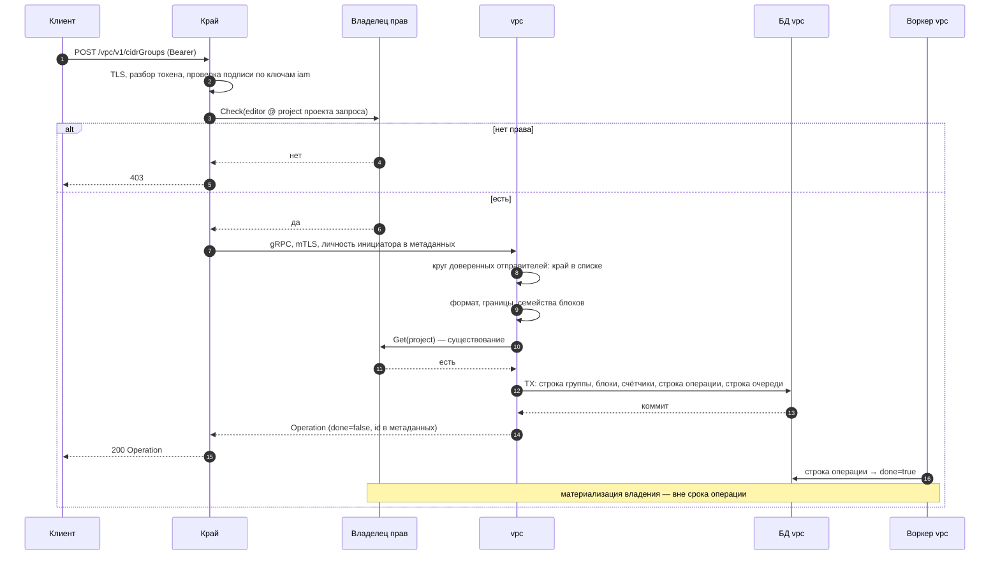

**`done=true` означает «строка закоммичена» и только это.** Гейтить его на видимость права —
запрещено: это переопределяет контракт операции и на отказе рождает фантом (строка есть, имя занято,
операция в ошибке). Первое обращение к своему свежему ресурсу может кратко получить отказ — лечится
ограниченным повтором **на клиенте**, не барьером на сервере.

#### 9.1.7. Процесс: `AddCidrBlocks` — потолок и отсутствие затирания

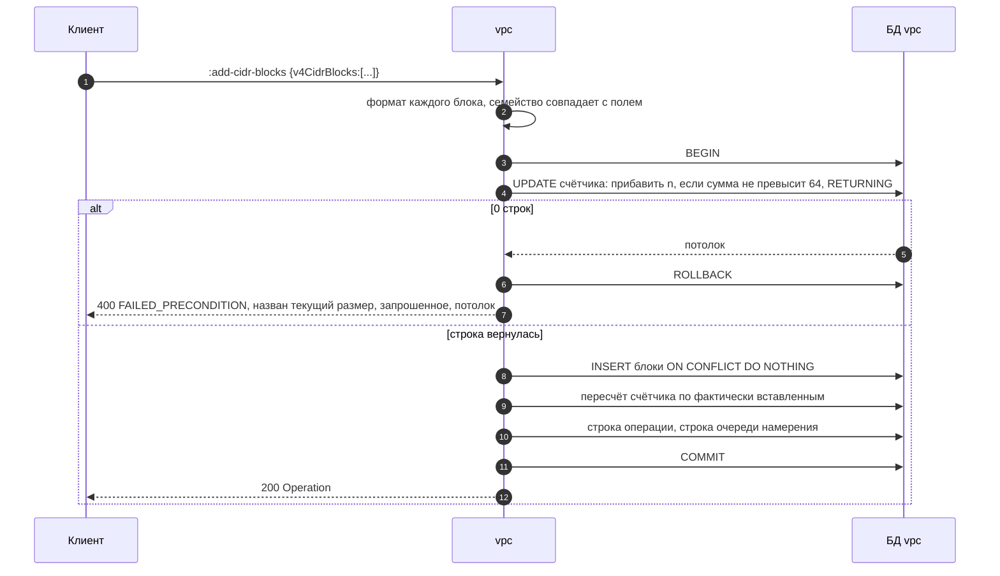

**Счётчик инкрементируется ДО вставки и условным обновлением** — параллельный писатель ждёт
блокировки строки, видит новое значение и упирается в предикат. Повторная вставка уже присутствующего
блока не увеличивает счётчик: он приводится к фактически вставленному в той же транзакции, иначе
идемпотентный повтор «съедал» бы потолок.

#### 9.1.8. Пометки интеграции с датаплейном

**Соответствие объекту северной базы — «набор адресов», и оно почти прямое.** Но у объекта есть
четыре свойства, каждое из которых требует работы адаптера, а не проброса:

1. **Имя объекта уникально на всю базу, арендаторов и пространств имён там нет.** Значит имя набора
   **обязано выводиться из нашего неизменяемого идентификатора**, а не из тенантского `name` — иначе
   две группы двух арендаторов с именем `office` схлопнутся в один объект. Это не гигиена, это
   пересечение арендаторов.
2. **Алфавит имени не допускает дефис** (`[a-zA-Z_.][a-zA-Z_.0-9]*`) и не разрешает начинать с цифры.
   Наша дефисная форма идентификатора (`cdg-…`) в имя объекта **не переносится дословно** — адаптер
   обязан подставить разделитель. Прецедент известен: сторонний интегратор делает ровно эту замену и
   объясняет её тем же ограничением.
3. **По одному объекту на семейство.** Наши два поля отображаются в два набора — и это ещё один довод
   за два поля вместо одного: отображение становится тождественным, без разбора состава.
4. **Ссылка на набор экономит место в плоскости управления, а НЕ в железе.** Разворачивает набор
   контроллер на узле при трансляции в правила коммутатора: одна множественная клауза даёт **по
   правилу на члена**, две и больше — сопряжённое совпадение. В аппаратный конвейер попадает обычный
   поток с **конкретным** адресом, который реально совпал, поэтому число аппаратных правил
   масштабируется числом **наблюдаемых потоков**, а не числом написанных. **Обещать «одно правило
   вместо шестидесяти четырёх в железе» нельзя.** Разгрузку ломает не ссылка на набор, а остальная
   часть конвейера — отслеживание состояния и рециркуляция.

**Открытый долг, названный прямо:** проверка выше получена **чтением кода** датапаса по закреплённым
ревизиям, а не замером на железе. Предикат, который закрывает это одной командой: на стенде с
включённой разгрузкой поднять правило с двумя множественными клаузами (группа портов + набор
адресов), прогнать трафик и сравнить дампы потоков разгруженных против программных, подняв уровень
журнала провайдера разгрузки. **Контроль в обратную сторону обязателен**: то же правило **без** второй
множественной клаузы — если разгрузка не идёт и там, дело не в наборе.

**Что исполнитель обязан объявить в профиле возможностей, чтобы ресурс включился:** поддержку
именованных наборов и **потолок членов**. Если объявленный потолок ниже нашего — действует меньший, и
он публикуется; ресурс, чей потолок мы обещали, а исполнитель не держит, — обещание без исполнителя.

**Потолок 64 на семейство — приземлённое число этого продукта, и это его единственное обоснование.**
У сети и подсети наборы блоков ограничены **тем же** числом и **тем же** доводом: набор
тенант-управляемый и аддитивный, парсится заново на горячем пути и целиком уезжает в каждый ответ.
Сопоставимые поставщики публикуют **1000** и **5000** — то есть по этой оси мы **позади**, и я говорю
это прямо, вместо того чтобы объявлять 64 достаточным. Поднять опубликованный потолок **не ломает
никого**, понизить — ломает; поэтому начинаем с приземлённого числа. **Предикат подъёма:** замер
разворачивания правил на узле при наборе в N членов, показавший, что 256 или 1000 не бьёт по
плоскости управления.

---

### §9.2. `InternalResourceLifecycleService.Subscribe` — доставка намерения (vpc)

**Это будет ПЕРВЫЙ серверный поток в vpc.** Замер: `returns (stream` в 19 файлах контрактов домена —
**ноль**. Поэтому образец берётся у балансировщика, где такой поток **приземлён**, а не изобретается.

#### 9.2.1. Контракт

```protobuf
service InternalResourceLifecycleService {
  rpc Subscribe(SubscribeRequest) returns (stream ResourceLifecycleEvent) {
    option (kacho.iam.authz.v1.permission) = "vpc.resourceLifecycle.subscribe";
    option (kacho.iam.authz.v1.required_relation) = "system_viewer";
    option (kacho.iam.authz.v1.scope_extractor) = {
      object_type: "cluster"
      from_request_field: "*"
    };
    option (kacho.iam.authz.v1.required_acr_min) = "1";
  }
}

message SubscribeRequest {
  repeated string kinds = 1;            // белый список видов; пусто = все
  string resume_from_event_id = 2;      // десятичный номер последовательности; пусто = с начала
}

message ResourceLifecycleEvent {
  string event_id = 1;                  // десятичный sequence_no, монотонный в пределах ресурса
  string kind = 2;
  string resource_id = 3;
  string op = 4;                        // ЗАКРЫТЫЙ набор: CREATE | UPDATE | DELETE | MOVE
  string project_id = 5;
  string parent_resource_id = 6;
  string old_project_id = 7;            // непусто только при MOVE
  google.protobuf.Timestamp created_at = 8;
}
```

**Событие несёт только идентификаторы и вид операции.** Проекционный слой с **белым списком** —
обязателен, и вот почему это не осторожность: существующий помощник превращения домена в отображение
(`repo/helpers/outbox.go:37-47`) — это сериализация **целой** структуры, а `domain.Network.VRFID`
(`domain/network.go:36`) **экспортировано и документировано как инфра-поле**. Дамп полезной нагрузки
очереди в поток вынес бы идентификатор тенант-домена наружу.

**Набор `op` закрыт, и корзины «прочее» у него нет.** У приземлённого образца маппер производит
**пять** значений плюс `default: return action` — неизвестное проходит насквозь, — а комментарий поля
объявляет **три**. Мы берём закрытый набор из четырёх и **отвергаем** неизвестное на стороне эмиттера:
значение вне набора — дефект нашего кода, и пропускать его исполнителю значит просить его завести
корзину «прочее» у себя.

#### 9.2.2. Личность и права — почему это настоящий гейт, а не его форма

`required_relation: "system_viewer"` @ `cluster` — **не** выполнимо подстановочным знаком:
`fga_model.fga:171` объявляет `system_viewer: [user, service_account]`. Сравните с соседним `viewer`
(`:183`): `[user, user:*, service_account] or …`, и бутстрап кластера **намеренно** пишет кортеж
`cluster:<singleton>#viewer@user:*` — то есть `viewer` @ `cluster` означает «аутентифицирован», а не
«авторизован». Разница между двумя строками модели здесь и есть разница между гейтом и его формой.

Держит это **существующий** обходчик (`gateway/internal/middleware/permission_catalog_wildcard_relation_test.go`):
множество выполнимых подстановкой отношений он **вычисляет из модели**, а не перечисляет, и требует
поимённого обоснования на каждую запись каталога, стоящую на таком отношении. Разрешённых там четыре,
все — глобальные справочники.

**Известная цена, которую называю прямо:** `cluster#system_viewer` — **общеплатформенное** чтение, а не
«только vpc». Узкого отношения «читать поток vpc» в модели **нет ни одного** (замер: 244 объявления,
ни одно не адресует поток). Заводить его ради одного метода я не предлагаю: у исполнителя датаплейна
предмет и есть платформа целиком — он применяет намерение **всех** арендаторов, и узкая область была бы
театром. Но запись «система читает всё» обязана быть **осознанной**, а не побочной.

**Записи в круге доверенных отправителей исполнителю НЕ нужно, и это не смягчение.** Круг сужает право
**передавать чужую личность** в метаданных. Исполнитель действует **от своего имени**: подписывается и
отчитывается под собственной служебной учётной записью, метаданных личности не отправляет, а его
личность приезжает из клиентского сертификата — этого достаточно и для аутентификации, и для того,
чтобы проверка спросила модель про его учётку. Зеркальный контроль: у трёх записей боевого круга vpc
есть **фактическая** причина передавать чужую личность (резолв подсети и привязка интерфейса под
личностью инициатора); у исполнителя такой причины нет ни одной.

#### 9.2.3. Схема БД: очередь уже есть, курсорной таблицы быть не должно

Очередь **существует** и полностью заполняется: `kacho_vpc.vpc_outbox` с `sequence_no bigint` (значение
по умолчанию из последовательности, первичный ключ), `resource_kind`, `resource_id`, `event_type`,
`payload jsonb`, `created_at`, `processed_at`. Уведомление тоже есть: триггер на каждую вставку
выполняет оповещение по каналу `vpc_outbox` номером последовательности. **Читателей — ноль.**

**Таблица курсоров `vpc_watch_cursors` (`0001_initial.sql:624`) — дропается.** Читателей ноль,
инженерный документ сервиса называет её остатком, а приземлённый образец у балансировщика **своей
таблицей курсоров не пользуется вовсе**: курсор присылает клиент. Оставить её значило бы держать два
адреса одного предмета, из которых один мёртв.

**Отдельная находка, которую надо починить в том же изменении:** комментарий у триггера
(`0001_initial.sql:84`) утверждает, что уведомление «используется `InternalWatchService` для realtime
event push». В vpc такого сервиса **нет** — он принадлежит домену compute. Комментарий называет
потребителя, которого в этом сервисе не существует, и следующий читатель пойдёт его искать.

#### 9.2.4. Границы и механика чтения — три места, где наивная реализация теряет события

| Граница | Решение |
|---|---|
| `kinds` вне белого списка видов | `INVALID_ARGUMENT` — **до** захвата слота |
| `resume_from_event_id` не десятичное / отрицательное | `INVALID_ARGUMENT` — **до** захвата слота |
| число одновременных потоков | неблокирующий захват семафора → `RESOURCE_EXHAUSTED`; ёмкость из конфигурации, **отказ в старте** при значении ≤0 |
| фид недоступен | `UNAVAILABLE` с **фиксированным** текстом — текст драйвера БД наружу не течёт |
| отмена вызывающим | завершение без ошибки |
| пропущенное уведомление | периодический перепрос по сроку простоя (30 с у образца) |

**Окно чтения — `(курсор, водяной знак]`, и это несущая деталь, без которой поток теряет события
навсегда.** Верхняя граница — **не** максимальный номер в таблице, а водяной знак устоявшегося:
значение последовательности выдаётся **до** вставки строки и до назначения идентификатора транзакции,
поэтому горизонт по транзакциям слеп. Без водяного знака строка, закоммиченная **позже** строки с
бо́льшим номером, навсегда уходит под условие «больше курсора» и не воспроизводится **ни** повторной
подпиской с курсора, **ни** периодическим перепросом. Удержание горизонта чужим незавершённым
писателем обязано **логироваться**, иначе застрявший горизонт тих.

**Фид обязан жить на том же узле, что писатели** — оповещение не реплицируется. Соединение для
ожидания — **выделенное, вне пула**.

**Обратное давление (задача 52):** очередь отправки ограничена; при переполнении поток **закрывается**,
исполнитель возобновляется со своего курсора. Буферизация в памяти запрещена — она превращает шумного
арендатора в отказ нашего процесса для всех.

#### 9.2.5. Процесс

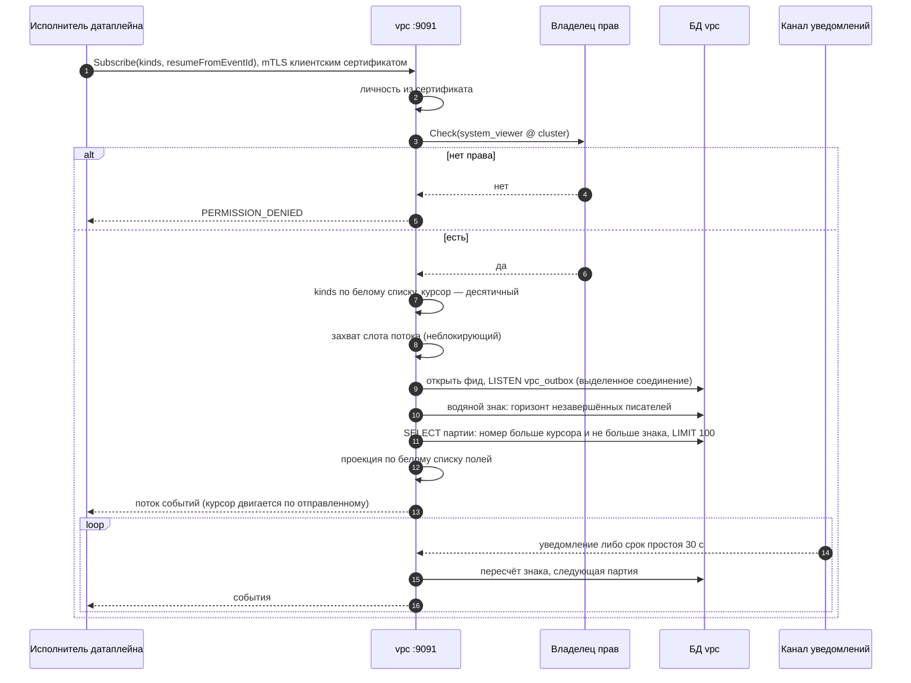

#### 9.2.6. Пометки датаплейна

Это **и есть** шов: наша сторона объявляет намерение, исполнитель его читает. Профиль возможностей
исполнителя объявляется **в том же рукопожатии** — отдельного метода он не заводит. Регистрация —
**только** на внутреннем мультиплексоре; в список публикуемых методов края поток не добавляется.
У приземлённого образца поток при этом **виден и по REST внутреннего мультиплексора** — при заданном
адресе внутреннего дома; форма та же.

---

### §9.3. `InternalRealizationService.ReportRealization` — подтверждение применения (vpc)

#### 9.3.1. Контракт

```protobuf
service InternalRealizationService {
  rpc ReportRealization(ReportRealizationRequest) returns (ReportRealizationResponse) {
    option (kacho.iam.authz.v1.permission) = "vpc.realization.report";
    option (kacho.iam.authz.v1.required_relation) = "realization_writer";
    option (kacho.iam.authz.v1.scope_extractor) = {
      object_type: "cluster"
      from_request_field: "*"
    };
  }
}

message ReportRealizationRequest {
  string kind = 1;
  string resource_id = 2;
  string revision = 3;                  // event_id доставки, десятичный
  RealizationState state = 4;           // закрытое перечисление
  string reason = 5;                    // МАШИННЫЙ токен; наружу не выводится
  google.protobuf.Timestamp observed_at = 6;
}

enum RealizationState {
  REALIZATION_STATE_UNSPECIFIED = 0;
  REALIZATION_STATE_APPLIED = 1;
  REALIZATION_STATE_REJECTED = 2;
}
```

**`PENDING` и `EXPIRED` в контракт НЕ входят** — их производим мы, не исполнитель: `PENDING` заводится
доставкой события, `EXPIRED` — истечением нашего срока. Принимать их от исполнителя значило бы дать
ему объявлять состояние, которого он не наблюдает.

#### 9.3.2. Права: новое отношение, только для машин

```
define realization_writer: [service_account]
```

Прецедент в дереве **точный и единственный** — `announce_writer` (`fga_model.fga:561`) на типе
балансировщика, и его обоснование в самой модели (`:536-560`) называет **четыре** свойства, каждое из
которых обязано повториться здесь:

1. **`[service_account]` и только** — ни `user`, ни членство в группе, ни подстановочный знак:
   человеческий принципал нельзя **даже записать** субъектом такого кортежа, владелец прав отвергнет
   запись. Отношение нельзя раздать ни ролью, ни группой;
2. **никакого `or admin|editor|viewer`** — редактор проекта не подделывает отчёт о применении;
3. **из него ничего не выводится** — писатель отчёта не получает CRUD;
4. **отношение вне закрытого набора**, который реконсайлер материализует из прав роли
   (`services/iam/internal/authzmap/fga_types.go:238`) — следствие: **ни одна выдача такое отношение
   произвести не может**, единственный путь — явный кортеж, записанный при развёртывании датаплейна.

**Область — `cluster`, а не отчётный ресурс, и это отличие от прецедента осознанное.** У прецедента
объект известен из запроса (`network_load_balancer_id`), поэтому пообъектная область работает. Здесь
вид ресурса приходит **полем запроса** и меняется от вызова к вызову, а запись каталога статична —
пообъектная область потребовала бы либо метода на каждый вид, либо динамического типа, которого запись
не выражает. Пообъектная область здесь была бы **театром**: исполнитель легитимно отчитывается о
**каждом** ресурсе платформы. Ограничение несёт **вид субъекта** (только машина, неразадаваемо), а не
сужение области.

**Три обязательных сопутствующих шага** — те же, что у нового типа объекта (§9.1.5), и первый из них
уже ломался: **отношение обязано существовать в модели ДО того, как каталог его потребует**, иначе
проверка отвергается как ошибка валидации модели и метод отказан **каждому** — сломанный по построению
гейт, а не least-priv по умолчанию.

#### 9.3.3. Схема БД

```sql
-- +goose Up
-- +goose StatementBegin
SET search_path TO kacho_vpc, public;

-- Что ДОЕХАЛО до датаплейна. Отдельная таблица, а не колонка в таблице сетей:
-- предмет здесь — не ресурс, а состояние применения намерения о нём, и он
-- существует для ресурсов всех видов, включая те, у которых своей таблицы
-- состояния нет.
CREATE TABLE IF NOT EXISTS kacho_vpc.realization_state (
    resource_kind text        NOT NULL,
    resource_id   text        NOT NULL,
    revision      bigint      NOT NULL,
    state         text        NOT NULL,
    reason        text        NOT NULL DEFAULT '',
    observed_at   timestamptz NOT NULL DEFAULT now(),
    deadline_at   timestamptz NOT NULL,
    created_at    timestamptz NOT NULL DEFAULT now(),

    CONSTRAINT realization_state_pkey PRIMARY KEY (resource_kind, resource_id),
    CONSTRAINT realization_state_kind_nonempty CHECK (resource_kind <> ''),
    CONSTRAINT realization_state_id_nonempty   CHECK (resource_id   <> ''),
    CONSTRAINT realization_state_revision_positive CHECK (revision > 0),
    CONSTRAINT realization_state_state_chk
        CHECK (state IN ('PENDING', 'APPLIED', 'REJECTED', 'EXPIRED')),
    -- Причина обязательна ровно там, где без неё состояния неразличимы, и
    -- запрещена там, где она была бы ложью о наличии причины.
    CONSTRAINT realization_state_reason_pairing_chk
        CHECK ((state IN ('REJECTED','EXPIRED') AND reason <> '')
            OR (state IN ('PENDING','APPLIED')  AND reason =  '')),
    -- Машинный токен, а не проза: клиент ключуется на него, а не парсит текст.
    CONSTRAINT realization_state_reason_token_chk
        CHECK (reason = '' OR reason ~ '^[A-Z][A-Z0-9_]{2,62}$'),
    CONSTRAINT realization_state_deadline_after_observed_chk
        CHECK (deadline_at > observed_at)
);

-- Обход просроченных: только незакрытые строки. Полный индекс рос бы вместе с
-- завершёнными, и обход начал бы читать очередь, которую дренит.
CREATE INDEX IF NOT EXISTS realization_state_deadline_idx
    ON kacho_vpc.realization_state (deadline_at) WHERE state = 'PENDING';
-- +goose StatementEnd
```

| Инвариант | Конструкция | Чем это было бы в коде |
|---|---|---|
| ровно одна строка на ресурс | `PRIMARY KEY (kind, id)` | «прочитал → нет строки → вставил»: две реплики применителя вставят две строки одного ресурса, и какая верна — решал бы порядок чтения |
| устаревшая доставка не переписывает свежую | **CAS на самой ревизии**: `UPDATE … WHERE kind=$1 AND id=$2 AND revision < $3`; 0 строк = устаревший отчёт → терминальный no-op | «прочитал ревизию → меньше → обновил»: между чтением и записью проходит реплика с ревизией выше, и безусловное обновление **откатывает** состояние на старое |
| состояние из закрытого набора | `CHECK (state IN …)` | проверка в use-case отвечает **одному** пути; писатель мимо него (реконсайлер, восстановление, ручной SQL) заведёт пятое значение, и читатель на `switch` без корзины отнесёт его к любой ветке |
| причина названа там и только там, где она есть | парный `CHECK` | вторая ветка кода запишет отказ без причины, и «почему не доехало» перестанет существовать именно на тех строках, ради которых таблица заведена |
| срок позже наблюдения | `CHECK (deadline_at > observed_at)` | срок из **наших** часов при наблюдении из часов БД: рассинхрон даёт уже истёкший срок в момент записи |

#### 9.3.4. Публичная проекция: одно поле, нейтральными словами

На публичной поверхности появляется **одно** поле — «намерение записано» против «оно действует».
**Машинный токен причины от исполнителя наружу не выводится**: по набору токенов опознаётся
реализация, а действующая таблица токенов описывает линии резолва **нашего** запроса, не чужого
применения.

**Здесь же решается судьба поля состояния интерфейса** (`NetworkInterface.status`). Снятие отдельной
задачей отменено: `reserved "status"` **навсегда** выжег бы имя, которое нужно этому предмету; поле
пишут ровно два оператора — привязка и снятие привязки (`pg/network_interface.go:323`, `:423`), — и
применённое как было написано снятие ломало бы оба верба. Диагноз «два живых значения дублируют
обратные ссылки» верен и лечится **уточнением семантики**, а не резервированием имени.

#### 9.3.5. Процесс

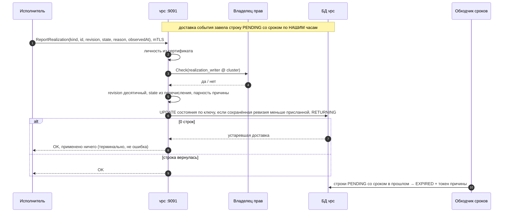

**Отчёт о ревизии МЕНЬШЕ сохранённой — не ошибка, а гонка доставки**: терминальный no-op. Отчёт о
**неизвестной** ревизии — отвергается: он утверждает применение того, чего мы не доставляли.

---

### §9.4. `InternalTargetHealthService.ReportTargetHealth` — измеренное здоровье (nlb)

Форма зеркальна §9.3 с **одним существенным отличием: область здесь пообъектная и это осмысленно** —
отчёт называет одну целевую группу, значит объект известен из запроса.

```protobuf
service InternalTargetHealthService {
  rpc ReportTargetHealth(ReportTargetHealthRequest) returns (ReportTargetHealthResponse) {
    option (kacho.iam.authz.v1.permission) = "loadbalancer.targetHealth.report";
    option (kacho.iam.authz.v1.required_relation) = "target_health_writer";
    option (kacho.iam.authz.v1.scope_extractor) = {
      object_type: "nlb_target_group"
      from_request_field: "target_group_id"
    };
  }
}

message ReportTargetHealthRequest {
  string target_group_id = 1;
  repeated TargetHealthObservation observations = 2;   // партия, потолок 100
  google.protobuf.Timestamp observed_at = 3;
}

message TargetHealthObservation {
  string target_ref = 1;          // идентификатор цели в терминах контракта, не адрес узла
  TargetHealth health = 2;        // закрытое перечисление
  string reason = 3;              // машинный токен, наружу не выводится
}
```

**`define target_health_writer: [service_account]`** — те же четыре свойства, что у §9.3.2.

**Что этим закрывается.** Сегодня здоровье цели **вычисляется из возраста записи**
(`get_target_states.go:16-22`), то есть публичное чтение отдаёт не измеренное, а выведенное из времени.
Проба обязана утверждать именно это: **без отчётов состояние не становится «здоров» само по себе** —
отрицание, у которого есть положительный контроль (после отчёта становится).

**Граница, которую легко пропустить:** `target_ref` — идентификатор цели **в терминах контракта**, не
адрес узла и не имя интерфейса на хосте. Отчёт исполнителя — законный путь, по которому инфра-данные
могли бы просочиться в публичное чтение; проекция обязана быть **белым списком**, как у потока.

---

### §9.5. Что каждый новый метод наследует, не объявляя заново

- **Цепочка проверок на обоих листенерах**: mTLS → личность из сертификата → доверенные отправители
  (только для тех, кто передаёт чужую личность) → проверка прав по каталогу → восстановление после
  паники. Internal **не освобождён** ни от одного звена.
- **Свой срок на каждом внешнем вызове** — включая вызов владельца прав; без него неотвечающий сосед
  вешает горутину навсегда.
- **Мутации возвращают операцию**, чтения синхронны; `done` = «строка закоммичена» и только это.
- **Тон отказов — часть контракта**: `"<Resource> %s not found"`, `"<field> is immutable after
  <Resource>.Create"`; неотображённая ошибка → **фиксированный** непрозрачный текст, никогда
  `err.Error()`.
- **Машинный токен в деталях** (`reason`), потому что тон сообщения стабилен, но не парсибелен.
- **Время усечено до секунд** — на ресурсе и на **каждой** вложенной записи.
- **Пагинация**: курсор `(created_at, id)`, `page_size` `[0..1000]`, вне диапазона — отказ, не подрезка.

### §9.6. Что это меняет в счёте матрицы

| | публичные | internal | всего |
|---|---|---|---|
| сейчас | 80 | 28 | 108 |
| к снятию | −8 | 0 | −8 |
| к заведению | **+8** | **+3** | **+11** |
| после | **80** | **31** | **111** |

Прежняя редакция матрицы объявляла «к заведению 0 / +3 / +3»: она учитывала шов датаплейна и **не
учитывала, что задача 33 заводит ресурс**. Единица счёта — **метод контракта**.

### §9.7. Поправки, которые внёс веер — и они о МОИХ прежних утверждениях

| Что я говорил | Что верно |
|---|---|
| образец потока лежит в `proto/kacho/cloud/nlb/v1/internal_resource_lifecycle_service.proto` | каталога `nlb/v1` в контрактах **нет вовсе**: домен называется `loadbalancer`, файл — `proto/kacho/cloud/loadbalancer/v1/internal_resource_lifecycle_service.proto`, пакет `kacho.cloud.loadbalancer.v1` |
| у vpc уже есть ось потока (подразумевалось) | серверных потоков в vpc **ноль** из 19 файлов домена; `InternalWatchService` принадлежит **compute**. Subscribe будет первым |
| потолок группы адресов ≈1000 (по рынку) | приземлённый потолок этого продукта для той же формы — **64 на семейство** (сеть и подсеть), с тем же доводом. Рынок публикует 1000 и 5000 — по этой оси мы позади, и это сказано прямо |
| область отчёта — пообъектная, как у прецедента | для **отчёта о применении** вид ресурса приходит полем запроса, а запись каталога статична → область `cluster`, ограничение несёт **вид субъекта**. Для **здоровья цели** пообъектная область осмысленна (объект известен) |

**И четыре находки в дереве, которых не искали** — каждая мелкая, все одного класса «утверждение
пережило свой предмет»:

1. `services/vpc/internal/apps/kacho/config/config.go:109-116` утверждает «у vpc законных отправителей
   **ЧЕТЫРЕ**» и перечисляет **три**. Число пережило снятие четвёртой записи, зафиксированное в чарте.
2. `services/vpc/internal/migrations/0001_initial.sql:84` объявляет потребителем уведомления
   `InternalWatchService`, которого **в vpc нет** (домен compute).
3. Комментарий поля `op` у приземлённого потока объявляет **три** значения, маппер производит **пять**
   плюс проброс неизвестного.
4. Комментарий в обходчике подстановочных отношений
   (`gateway/internal/middleware/permission_catalog_wildcard_relation_test.go:61-63`) объясняет записи
   каталога инвентарём диска **у compute**, тогда как таких строк в каталоге **ноль**: раскол блочного
   хранения объявлен завершённым, комментарий пережил предмет.
5. Комментарий приземлённого потока ссылается на `vpc/v1/internal_resource_lifecycle_service.proto` —
   файла на пине **нет**. Висячая перекрёстная ссылка; вероятный источник ошибки в моей координате.

Все пять — не блокеры этой работы, но каждый попадает в задачу 26 или в отдельную строку гигиены: они
ровно того класса, который двенадцать осей аудита ищут.
