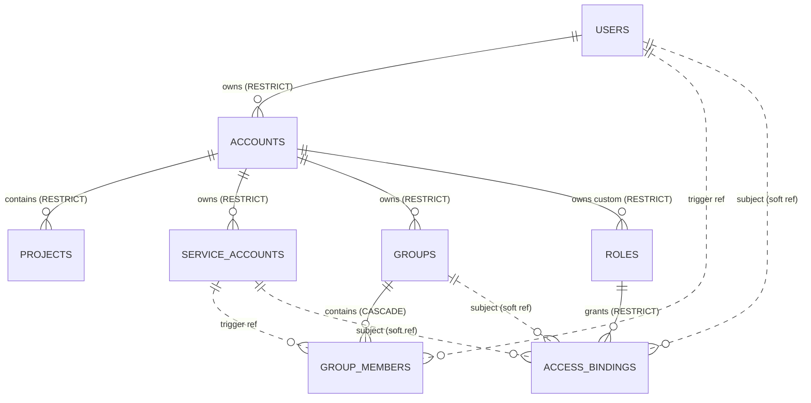

# Sub-phase 2.0 — IAM E0: kacho-iam skeleton + Account/Project/User/SA/Group/Role CRUD — Acceptance

> **Status**: DRAFT v2 — awaiting `acceptance-reviewer` APPROVED.
> **Date**: 2026-05-17 (v2 — same day rev)
> **YouTrack**: [KAC-105](https://prorobotech.youtrack.cloud/issue/KAC-105) — child of epic [KAC-104](https://prorobotech.youtrack.cloud/issue/KAC-104) (IAM rewrite на Account/Project/Group/Role).
> **Author agent**: `acceptance-author`
> **Reviewer agent**: `acceptance-reviewer` (gate per запрет #1, workspace `CLAUDE.md`).
> **Target repo**: `PRO-Robotech/kacho-iam` (новый; физ путь `kacho-workspace/project/kacho-iam`).
> **Target DB**: `kacho_iam` (схема `kacho_iam`, отдельный Postgres logical DB на shared dev cluster).

---

## 0. Преамбула — что эта sub-итерация

E0 — **первый код-производительный кусок эпика IAM**. Здесь рождается отдельный
сервис `kacho-iam`: domain-ресурсы для tenant-модели Account/Project + identity-mirror
User/ServiceAccount + Group + Role + AccessBinding, флат-CRUD + LRO Operations, отдельный
бинарь migrator, gRPC-сервер на двух listener'ах (public 9090 / internal 9091), helm-stub в
`kacho-deploy`, default-roles seed-миграция, ER-диаграмма.

**E0 НЕ включает**:
- Реальную интеграцию с Zitadel (E2) — User-mirror заполняется stub'ом через
  `InternalUserService.UpsertFromIdentity`, который E2 переключит на OIDC-callback.
- OpenFGA-tuples writes (E3) — AccessBinding пока **только хранится** в БД, реального
  authz-check'а нет ни на одном сервисе.
- auth-interceptor (E2) — operations principal записывается stub'ом `system`/`anonymous`.
- Signup-flow / UI (E4).
- Миграция `folder_id → project_id` в kacho-vpc / kacho-compute / kacho-loadbalancer (E1).
- Deprecate `kacho-resource-manager` (E5).

E0 — это **скелет-плюс-CRUD**, чтобы:
1. Зафиксировать **доменную модель** новой IAM (новые таблицы, новые id-префиксы, новые
   gRPC-сервисы) — base для всех последующих эпиков.
2. Дать E1 готовые `Project`-ресурсы, на которые можно переключить foreign-key-ссылки в
   vpc / compute / loadbalancer (через peer-API, см. §«Кросс-доменные ссылки» workspace
   `CLAUDE.md`).
3. Дать E2 готовый mirror `User` / `ServiceAccount`, в который OIDC-callback будет писать
   и из которого auth-interceptor будет резолвить principal.
4. Дать E3 готовую `AccessBinding`-таблицу, синхронизируемую с OpenFGA.

---

## 1. Связь с регламентом и запретами (нормативно)

| Регламент | Где соблюдаем |
|---|---|
| **Запрет #1** (workspace) — кодирование только после `acceptance-reviewer` APPROVED | данный документ — gate; статус выше `DRAFT` |
| **Запрет #2** — НЕ упоминать "yandex" | в коде / схеме / proto / комментариях не упоминается; стилистически следуем YC по форме error-text (см. §6.x), но **structurally** Account/Project — наш дизайн, не YC-Cloud/Folder |
| **Запрет #3** — НЕ ORM | только sqlc + handwritten pgx; евгений §6 CQRS Reader/Writer |
| **Запрет #4** — НЕ каскад через границу сервиса | Account/Project FK — ON DELETE RESTRICT, cross-service ссылки (`AccessBinding.resource_id` ссылается на ресурсы других сервисов) — software-validation (см. §16) |
| **Запрет #5** — НЕ редактировать применённую миграцию | в E0 будет ровно один файл `0001_initial.sql` (squashed-baseline-стиль как kacho-vpc), новый файл — `0002_*` |
| **Запрет #6** — Internal.* НЕ на external TLS endpoint | `InternalIAMService` / `InternalUserService` — только internal-port 9091 + проброс через api-gateway internal mux; advertised TLS endpoint их не показывает |
| **Запрет #8** — DB-per-service | новая БД `kacho_iam`, схема `kacho_iam`, никаких cross-DB FK |
| **Запрет #9** — async-only мутации | все CRUD-мутации возвращают `operation.Operation` (LRO), sync — только Get/List |
| **Запрет #10** — within-service refs на DB-уровне | FK / partial-UNIQUE / CHECK / атомарные `UPDATE … WHERE` — см. §4 (DB schema) + §13 (CAS-патерны), software refcheck запрещён |
| **Запрет #11** — тесты в том же PR | каждый E0-PR содержит integration-test (testcontainers) + минимум 1 newman happy + 1 newman negative; формулировки «tests follow-up» **запрещены** без явного `Tests-followup: KAC-N` |
| **evgeniy skill §1 (структура проекта)** | `cmd/kacho-iam/`, `cmd/migrator/` — отдельные binary; `internal/apps/kacho/api/<resource>/` use-case-per-file; `internal/repo/kacho/pg/` + `dto/`; `internal/apps/kacho/config/` viper |
| **evgeniy skill §2 (UseCases vs Services)** | каждый use-case — отдельный файл (`create.go`/`get.go`/`list.go`/`update.go`/`delete.go`); тонкий handler.go; никакого `IAMService` со всеми методами в одном файле |
| **evgeniy skill §3 (DTO table-driven)** | `internal/dto/type2pb/<resource>.go` + `init()`-регистрация трансферов; никаких ручных `protoconv.Account` |
| **evgeniy skill §4 (self-validating domain)** | newtypes `RcName`, `RcDescription`, `Permission`, `ExternalSubject`, `SubjectType`, `ResourceType` — каждый с `Validate()`; domain.Account.Validate() через `multierr.Combine` |
| **evgeniy skill §5 (DB-уровень валидации)** | каждое regex/length/enum-ограничение из domain дублируется CHECK constraint; FK/UNIQUE/EXCLUDE — inline в `0001_initial.sql` |
| **evgeniy skill §6 (CQRS Reader/Writer)** | `internal/repo/kacho/iface.go` с `Repository { Reader(ctx); Writer(ctx) }`; каждый use-case явно `repo.Writer(ctx)` |
| **evgeniy skill §7 (CreatedAt не в domain)** | `domain.Account` без `CreatedAt`; `repo.Account = struct { domain.Account; CreatedAt time.Time }` |
| **evgeniy skill §8 (viper YAML config)** | `internal/apps/kacho/config/{config,defaults,validate,load}.go`; YAML mounted из ConfigMap; ENV через `KACHO_IAM_REPOSITORY__POSTGRES__URL` |
| **evgeniy skill §9 (отдельный cmd/migrator)** | `cmd/migrator/main.go` (cobra); основной `cmd/kacho-iam/main.go` — только `serve` |

---

## 2. Глоссарий / доменная модель (нормативно)

### 2.1 Сущности E0

- **Account** — top-level tenant («организация» как товар продукта IAM). Замещает связку
  `Organization+Cloud` из `kacho-resource-manager`. Уникальное имя глобально. Имеет
  `owner_user_id` — User, который создал Account. Удаление RESTRICT при наличии Project'ов
  или ServiceAccount'ов.
- **Project** — child Account-а («folder» в YC-стилистике, но без промежуточного Cloud).
  Уникальное имя per-Account. Имеет операцию **Move** — пересадить Project в другой Account
  (атомарный UPDATE с CAS).
- **User** — mirror identity из Zitadel. На E0 — `InternalUserService.UpsertFromIdentity`
  заглушка, в E2 заменяется на OIDC-callback. Поля: `external_id` (Zitadel `sub`), `email`,
  `display_name`. Удаление RESTRICT при наличии созданных Account'ов / GroupMember'ов /
  AccessBinding'ов на user (нужно сначала почистить ссылки).
- **ServiceAccount** — Account-scoped (`account_id` FK). Key-credentials НЕ в E0 (E2 добавит
  через Zitadel client_credentials grant). На E0 — только CRUD по metadata.
- **Group** — Account-scoped, имеет members (User или ServiceAccount). Используется в
  AccessBinding для упрощения раздачи прав. Member по-разному ссылается:
  `group_members(group_id, member_type, member_id)`.
- **Role** — либо Account-scoped (custom; `account_id` NOT NULL), либо system-scoped
  (default; `account_id` IS NULL, `is_system=true`). Permissions — JSONB-массив строк формата
  `<module>.<resource>.<verb>` (wildcard `*` на месте элемента: `vpc.networks.*`,
  `*.networks.read`, `*.*.*`). System-роли — seed-ятся миграцией.
- **AccessBinding** — связь `(subject_type, subject_id) ↔ role_id ↔ (resource_type, resource_id)`.
  E0 хранит, **не** проверяет authz. E3 будет синхронизировать с OpenFGA tuples и подключит
  Check-interceptor.

### 2.2 Resource id prefixes

Зарегистрировать в `kacho-corelib/ids/ids.go` (на E0 — отдельным PR в corelib, до E0-кодовых
PR; зависимость через replace `../kacho-corelib`):

| Ресурс           | Prefix const                | Значение | Длина id |
|------------------|-----------------------------|----------|----------|
| Account          | `ids.PrefixAccount`         | `acc`    | 20       |
| Project          | `ids.PrefixProject`         | `prj`    | 20       |
| User             | `ids.PrefixUser`            | `usr`    | 20       |
| ServiceAccount   | `ids.PrefixServiceAccount`  | `sva`    | 20       |
| Group            | `ids.PrefixGroup`           | `grp`    | 20       |
| Role             | `ids.PrefixRole`            | `rol`    | 20       |
| AccessBinding    | `ids.PrefixAccessBinding`   | `acb`    | 20       |
| Operation (IAM)  | `ids.PrefixOperationIAM`    | `iop` (IAM Operation — отдельный prefix; api-gateway маршрутизирует `OperationService.Get(id)` по первым 3 символам id, поэтому prefix Operation **не должен** совпадать с prefix ресурса — иначе `acc<…>` (Account) и operation на Account конфликтуют, и `OperationService.Get` на operation-id уйдёт в AccountService) | 20       |

**Acceptance check**: после squashed-baseline миграции и старта `kacho-iam`, любой ресурс,
возвращённый из Create-RPC, имеет соответствующий префикс — newman-кейсы проверяют
`startsWith` на response.id.

### 2.3 Permission string format (нормативно)

Pattern: `<module>.<resource>.<verb>` либо c wildcard на месте отдельных элементов.

- `module` ∈ {`iam`, `vpc`, `compute`, `loadbalancer`, `*`}
- `resource` ∈ свободный slug `[a-z][a-z0-9_]*` (например `networks`, `subnets`,
  `instances`, `accounts`, `roles`) либо `*`.
- `verb` ∈ {`create`, `read`, `update`, `delete`, `list`, `attach`, `detach`, `move`,
  `bindRole`, `unbindRole`, `*`}.

Wildcards разрешены **только на месте целого элемента** — `vpc.*.read` валидно;
`vpc.netwo*.read` — невалидно (regex pattern enforce'ит).

**Wildcard семантика (нормативно)**:
- `*` на месте `<module>` — «любой модуль» (включая будущие модули, которые появятся после E0).
- `*` на месте `<resource>` — «любой resource в указанном модуле».
- `*` на месте `<verb>` — «любой verb на указанном resource в указанном модуле».
- Permission **матчится**, если **каждый** из трёх элементов либо точно равен запрашиваемому,
  либо равен `*`. Например, `iam.*.bindRole` даёт **только** verb `bindRole` (и НЕ `unbindRole`)
  на любом resource модуля `iam`; `iam.*.*` даёт **все** verb'ы модуля `iam`;
  `*.*.*` — admin-роль («всё везде»).
- Wildcard **не** разворачивается в конкретные permissions при INSERT — хранится буквально, и
  E0 `InternalIAMService.ListPermissions` возвращает массив `["iam.*.bindRole"]` as-is;
  Check-логика на E3 (OpenFGA) интерпретирует wildcards при match'е.

Regex для одного permission:
```
^([a-z][a-z0-9]*|\*)\.([a-z][a-z0-9_]*|\*)\.([a-zA-Z][a-zA-Z0-9]*|\*)$
```

DB CHECK constraint `roles_permissions_valid` дублирует regex через PL/pgSQL функцию
`kacho_iam.iam_permissions_valid(jsonb)` (миграция `0001_initial.sql`):

```sql
CREATE OR REPLACE FUNCTION kacho_iam.iam_permissions_valid(perms jsonb) RETURNS boolean
LANGUAGE plpgsql IMMUTABLE AS $fn$
DECLARE
    v text;
BEGIN
    IF perms IS NULL THEN RETURN false; END IF;          -- NOT NULL обязательно
    IF jsonb_typeof(perms) <> 'array' THEN RETURN false; END IF;
    IF jsonb_array_length(perms) = 0 THEN RETURN false; END IF;   -- пустые роли запрещены
    IF jsonb_array_length(perms) > 256 THEN RETURN false; END IF; -- soft cap
    FOR v IN SELECT value::text FROM jsonb_array_elements_text(perms) LOOP
        IF v !~ '^([a-z][a-z0-9]*|\*)\.([a-z][a-z0-9_]*|\*)\.([a-zA-Z][a-zA-Z0-9]*|\*)$' THEN
            RETURN false;
        END IF;
    END LOOP;
    RETURN true;
END;
$fn$;
```

### 2.4 Operations principal-поле (stub в E0, реальный в E2)

В `kacho-corelib/operations` расширить `Operation` (и таблицу `operations` per-service):

| Колонка                       | Тип       | E0 значение по умолчанию           | E2 значение                                                          |
|-------------------------------|-----------|------------------------------------|----------------------------------------------------------------------|
| `principal_type`              | `text`    | `'system'`                         | `'user'` / `'service_account'` (из JWT claim)                        |
| `principal_id`                | `text`    | `'bootstrap'`                      | `usr<id>` / `sva<id>`                                                |
| `principal_display_name`      | `text`    | `'kacho-iam-bootstrap'`            | `email` / `service_account.name`                                     |

`created_by` (`anonymous` сейчас) — остаётся для backward compat, но проставляется
`principal_display_name` стартуя с E0. Stub'ы вписываются в любом сервисе, который пишет
operations.

Acceptance проверяет: на E0 каждая `Operation`, возвращаемая kacho-iam, имеет
`principal_type='system'` (для admin-create через CLI/curl) или `'anonymous'` (если запрос
прилетел без principal-headers — E2 это запретит). Тестом фиксируем именно эту инвариантность
для E0; E2 acceptance отдельно проверит реальное заполнение.

### 2.5 Domain-types (newtypes per evgeniy §4)

Файл `internal/domain/types.go`:

```go
type (
    AccountName        string
    ProjectName        string
    GroupName          string
    RoleName           string
    SvcAccountName     string
    DisplayName        string
    Email              string
    ExternalSubject    string           // Zitadel sub
    Description        string
    LabelKey           string
    LabelVal           string
    Labels             = dict.HDict[LabelKey, LabelVal]
    Permission         string
    Permissions        []Permission
    SubjectType        string           // enum: user|service_account|group
    ResourceType       string           // enum: account|project|vpc_network|...|*
)
```

Каждый — с `Validate() error`. Regex/limits:

| Newtype          | Validate                                                                                  |
|------------------|-------------------------------------------------------------------------------------------|
| `AccountName`    | `^[a-z][-a-z0-9]{2,62}$` (3-63 chars, lowercase + digit + dash, должен начинаться с буквы) |
| `ProjectName`    | `^[a-z][-a-z0-9]{2,62}$`                                                                  |
| `GroupName`      | `^[a-z][-a-z0-9]{2,62}$`                                                                  |
| `RoleName`       | `^([a-z][a-z0-9_]{0,40})$` для custom либо `^roles/[a-z]+\.[a-z]+$` для system            |
| `SvcAccountName` | `^[a-z][-a-z0-9]{2,62}$`                                                                  |
| `DisplayName`    | length 1-128, no control chars                                                            |
| `Email`          | RFC 5321 lite (basic regex `^[^\s@]+@[^\s@]+\.[^\s@]+$`), length ≤254                     |
| `ExternalSubject`| length ≤256, opaque                                                                       |
| `Description`    | length ≤256                                                                               |
| `LabelKey`       | `^[a-z][-_./@a-z0-9]{0,62}$`                                                              |
| `LabelVal`       | length ≤63                                                                                |
| `Labels`         | cardinality ≤64, каждая пара → key.Validate + val.Validate                                |
| `Permission`     | regex §2.3                                                                                |
| `Permissions`    | cardinality 1-256, каждый → permission.Validate                                           |
| `SubjectType`    | `IN ('user','service_account','group')`                                                   |
| `ResourceType`   | `IN ('account','project','vpc_network','vpc_subnet','vpc_address','vpc_route_table','vpc_security_group','vpc_gateway','vpc_private_endpoint','vpc_network_interface','compute_instance','compute_disk','compute_image','compute_snapshot','loadbalancer_nlb','loadbalancer_target_group','iam_account','iam_project','iam_user','iam_service_account','iam_group','iam_role','*')` (вайтлист, расширяется через миграции; на E0 — fixed enum) |

Domain тип `Account.Validate()` — `multierr.Combine(name.Validate(), description.Validate(),
labels.Validate(), ...)`. Service-слой вызывает `obj.Validate()` ПЕРЕД `repo.Insert/Update`;
если падает — `InvalidArgument`. Никаких `corevalidate.NameXxx` в use-case.

---

## 3. Структура репо `kacho-iam` (нормативно)

```
kacho-iam/
├── CLAUDE.md                                # service-specific (по образцу kacho-vpc/CLAUDE.md)
├── Makefile                                 # build/test/lint/migrate/sync-migrations
├── Dockerfile                               # multi-stage; собирает kacho-iam + migrator
├── go.mod                                   # replace ../kacho-corelib + ../kacho-proto
├── docs/
│   └── architecture/
│       ├── er-diagram.md                    # mermaid ER (evgeniy §5 E.6)
│       └── 01-overview.md                   # короткий обзор (1 страница)
├── cmd/
│   ├── kacho-iam/main.go                    # serve only (viper config + grpcsrv)
│   └── migrator/main.go                     # cobra: up/down/status/create --dsn --dialect
├── internal/
│   ├── apps/
│   │   ├── kacho/
│   │   │   ├── api/
│   │   │   │   ├── account/                 # use-cases (create/get/list/update/delete) + handler
│   │   │   │   ├── project/                 # +move.go
│   │   │   │   ├── user/                    # mirror: get/list + internal upsert
│   │   │   │   ├── service_account/
│   │   │   │   ├── group/                   # +add_member/remove_member/list_members
│   │   │   │   ├── role/                    # custom + system listing
│   │   │   │   ├── access_binding/          # create/delete/list_by_resource/list_by_subject
│   │   │   │   └── internal_iam/            # LookupSubject, ListPermissions
│   │   │   ├── config/
│   │   │   │   ├── config.go
│   │   │   │   ├── defaults.go
│   │   │   │   ├── validate.go
│   │   │   │   └── load.go
│   │   │   └── jobs/                        # пусто на E0 (operations worker — через corelib)
│   │   └── migrator/
│   │       └── runner.go                    # обёртка goose
│   ├── domain/
│   │   ├── types.go                         # newtypes §2.5
│   │   ├── account.go
│   │   ├── project.go
│   │   ├── user.go
│   │   ├── service_account.go
│   │   ├── group.go
│   │   ├── role.go
│   │   ├── access_binding.go
│   │   ├── builders.go                      # default-role builders, system-role definitions
│   │   ├── constants.go                     # status/enum/magic-numbers
│   │   └── status.go                        # (минимум — нет deletion state в E0)
│   ├── dto/
│   │   ├── base.go                          # generic Interface + RegTransfer (evgeniy §3)
│   │   └── type2pb/
│   │       ├── account.go
│   │       ├── project.go
│   │       ├── user.go
│   │       ├── service_account.go
│   │       ├── group.go
│   │       ├── role.go
│   │       ├── access_binding.go
│   │       └── time.go                      # timestamp truncate to seconds
│   ├── repo/
│   │   └── kacho/
│   │       ├── iface.go                     # Repository / Reader / Writer (CQRS)
│   │       ├── account/iface.go             # AccountReaderIface / AccountWriterIface
│   │       ├── project/iface.go
│   │       ├── user/iface.go
│   │       ├── service_account/iface.go
│   │       ├── group/iface.go
│   │       ├── role/iface.go
│   │       ├── access_binding/iface.go
│   │       ├── pg/                          # pgxpool реализация
│   │       │   ├── account.go
│   │       │   ├── project.go
│   │       │   ├── user.go
│   │       │   ├── service_account.go
│   │       │   ├── group.go
│   │       │   ├── group_member.go
│   │       │   ├── role.go
│   │       │   ├── access_binding.go
│   │       │   ├── operations.go            # operations table — pgxpool repo
│   │       │   ├── tx.go                    # Repository.Reader/Writer impl
│   │       │   ├── maperr.go                # SQLSTATE → service.Err* (запрет #10)
│   │       │   ├── dto/                     # pgmodel ↔ domain transfers
│   │       │   └── pg_integration_test.go   # testcontainers tests (per resource)
│   │       └── repomock/                    # mocks для unit-тестов use-case'ов
│   ├── migrations/
│   │   ├── 0001_initial.sql                 # squashed baseline (см. §4)
│   │   └── migrations.go                    # embed.FS
│   └── clients/                             # пусто на E0 (E1 добавит compute/vpc для cross-ref)
├── tests/
│   ├── newman/
│   │   ├── cases/
│   │   │   ├── iam-account.py
│   │   │   ├── iam-project.py
│   │   │   ├── iam-user.py
│   │   │   ├── iam-service-account.py
│   │   │   ├── iam-group.py
│   │   │   ├── iam-role.py
│   │   │   ├── iam-access-binding.py
│   │   │   ├── iam-default-roles.py
│   │   │   ├── iam-operations.py
│   │   │   └── internal-iam.py
│   │   ├── collections/
│   │   ├── environments/{local,yc}.postman_environment.json
│   │   └── scripts/{gen.py,run.sh,run-incremental.sh}
│   └── k6/                                  # пусто на E0 (load — E1+)
└── .github/workflows/ci.yaml
```

Соблюдение evgeniy §1: `cmd/<binary>/` отдельные точки сборки; `internal/apps/kacho/api/<resource>/`
— use-cases per file; `internal/repo/kacho/` — CQRS; `internal/dto/type2pb/` — table-driven.

---

## 4. DB schema — `0001_initial.sql` (нормативно)

Все таблицы / CHECK / FK / UNIQUE / EXCLUDE / индексы / триггеры — **inline в одном файле**
(squashed-baseline-стиль из kacho-vpc; evgeniy §5 E.5). Schema = `kacho_iam`. Helper-функции —
`kacho_iam.kacho_labels_valid(jsonb)`, `kacho_iam.iam_permissions_valid(jsonb)`,
`kacho_iam.iam_outbox_notify()` (на E0 outbox не используется в коде, но скелет таблицы
закладываем под E3 «invalidate authz cache» — pg_notify работает с дня 1, чтобы E3 не
ломать миграцию-историю; см. §17.x).

### 4.1 Tables

#### `operations` (LRO; corelib pattern + principal-поля §2.4)

```sql
CREATE TABLE kacho_iam.operations (
    id                      text         PRIMARY KEY,
    description             text         NOT NULL,
    created_at              timestamptz  NOT NULL DEFAULT now(),
    created_by              text         NOT NULL DEFAULT 'anonymous',
    principal_type          text         NOT NULL DEFAULT 'system'
        CHECK (principal_type IN ('system','anonymous','user','service_account')),
    principal_id            text         NOT NULL DEFAULT 'bootstrap',
    principal_display_name  text         NOT NULL DEFAULT 'kacho-iam-bootstrap',
    modified_at             timestamptz  NOT NULL DEFAULT now(),
    done                    boolean      NOT NULL DEFAULT false,
    metadata_type           text,
    metadata_data           bytea,
    resource_id             text,
    error_code              integer,
    error_message           text,
    error_details           bytea,
    response_type           text,
    response_data           bytea
);

CREATE INDEX operations_resource_idx   ON kacho_iam.operations (resource_id);
CREATE INDEX operations_done_idx       ON kacho_iam.operations (done);
CREATE INDEX operations_created_at_idx ON kacho_iam.operations (created_at);
CREATE INDEX operations_principal_idx  ON kacho_iam.operations (principal_type, principal_id);
```

#### `users` (mirror Zitadel identity)

```sql
CREATE TABLE kacho_iam.users (
    id            text         PRIMARY KEY,
    external_id   text         NOT NULL,                       -- Zitadel sub (или пустой на E0 admin-create)
    email         text         NOT NULL,
    display_name  text         NOT NULL DEFAULT '',
    created_at    timestamptz  NOT NULL DEFAULT now(),

    CONSTRAINT users_external_id_unique UNIQUE (external_id),
    CONSTRAINT users_email_check        CHECK (length(email) BETWEEN 3 AND 254 AND email ~ '^[^[:space:]@]+@[^[:space:]@]+\.[^[:space:]@]+$'),
    CONSTRAINT users_display_name_check CHECK (length(display_name) <= 128),
    CONSTRAINT users_external_id_check  CHECK (length(external_id) BETWEEN 1 AND 256)
);

CREATE INDEX users_email_idx ON kacho_iam.users (lower(email));
```

> На E0 `InternalUserService.UpsertFromIdentity` принимает `external_id`, `email`,
> `display_name`. `external_id` уникален: UPSERT-семантика — если внешний id уже привязан
> к локальной row → UPDATE `email`/`display_name`. (E2 переключит на OIDC callback —
> тот же RPC, но звать его будет gateway после первого успешного login.)

#### `accounts`

```sql
CREATE TABLE kacho_iam.accounts (
    id              text         PRIMARY KEY,
    name            text         NOT NULL,
    description     text         NOT NULL DEFAULT '',
    labels          jsonb        NOT NULL DEFAULT '{}'::jsonb,
    owner_user_id   text         NOT NULL,
    created_at      timestamptz  NOT NULL DEFAULT now(),

    CONSTRAINT accounts_name_unique         UNIQUE (name),                                        -- глобально, не per-Org
    CONSTRAINT accounts_name_check          CHECK (name ~ '^[a-z][-a-z0-9]{2,62}$'),
    CONSTRAINT accounts_description_check   CHECK (length(description) <= 256),
    CONSTRAINT accounts_labels_valid        CHECK (kacho_iam.kacho_labels_valid(labels)),
    CONSTRAINT accounts_owner_fk            FOREIGN KEY (owner_user_id) REFERENCES kacho_iam.users(id) ON DELETE RESTRICT
);

CREATE INDEX accounts_owner_idx ON kacho_iam.accounts (owner_user_id);
```

> Удаление User'а, у которого есть Account'ы, → SQLSTATE 23503 → `FailedPrecondition` "user
> owns accounts and cannot be deleted". На E0 удаление User — отдельный RPC
> `UserService.Delete` (см. §6.7); сценарии — §7.3.

#### `projects`

```sql
CREATE TABLE kacho_iam.projects (
    id            text         PRIMARY KEY,
    account_id    text         NOT NULL,
    name          text         NOT NULL,
    description   text         NOT NULL DEFAULT '',
    labels        jsonb        NOT NULL DEFAULT '{}'::jsonb,
    created_at    timestamptz  NOT NULL DEFAULT now(),

    CONSTRAINT projects_account_fk          FOREIGN KEY (account_id) REFERENCES kacho_iam.accounts(id) ON DELETE RESTRICT,
    CONSTRAINT projects_account_name_unique UNIQUE (account_id, name),
    CONSTRAINT projects_name_check          CHECK (name ~ '^[a-z][-a-z0-9]{2,62}$'),
    CONSTRAINT projects_description_check   CHECK (length(description) <= 256),
    CONSTRAINT projects_labels_valid        CHECK (kacho_iam.kacho_labels_valid(labels))
);

CREATE INDEX projects_account_idx ON kacho_iam.projects (account_id);
```

#### `service_accounts`

```sql
CREATE TABLE kacho_iam.service_accounts (
    id            text         PRIMARY KEY,
    account_id    text         NOT NULL,
    name          text         NOT NULL,
    description   text         NOT NULL DEFAULT '',
    created_at    timestamptz  NOT NULL DEFAULT now(),

    CONSTRAINT service_accounts_account_fk          FOREIGN KEY (account_id) REFERENCES kacho_iam.accounts(id) ON DELETE RESTRICT,
    CONSTRAINT service_accounts_account_name_unique UNIQUE (account_id, name),
    CONSTRAINT service_accounts_name_check          CHECK (name ~ '^[a-z][-a-z0-9]{2,62}$'),
    CONSTRAINT service_accounts_description_check   CHECK (length(description) <= 256)
);

CREATE INDEX service_accounts_account_idx ON kacho_iam.service_accounts (account_id);
```

#### `groups` + `group_members`

```sql
CREATE TABLE kacho_iam.groups (
    id            text         PRIMARY KEY,
    account_id    text         NOT NULL,
    name          text         NOT NULL,
    description   text         NOT NULL DEFAULT '',
    labels        jsonb        NOT NULL DEFAULT '{}'::jsonb,
    created_at    timestamptz  NOT NULL DEFAULT now(),

    CONSTRAINT groups_account_fk          FOREIGN KEY (account_id) REFERENCES kacho_iam.accounts(id) ON DELETE RESTRICT,
    CONSTRAINT groups_account_name_unique UNIQUE (account_id, name),
    CONSTRAINT groups_name_check          CHECK (name ~ '^[a-z][-a-z0-9]{2,62}$'),
    CONSTRAINT groups_description_check   CHECK (length(description) <= 256),
    CONSTRAINT groups_labels_valid        CHECK (kacho_iam.kacho_labels_valid(labels))
);

CREATE INDEX groups_account_idx ON kacho_iam.groups (account_id);

CREATE TABLE kacho_iam.group_members (
    group_id      text         NOT NULL,
    member_type   text         NOT NULL,
    member_id     text         NOT NULL,
    added_at      timestamptz  NOT NULL DEFAULT now(),

    PRIMARY KEY (group_id, member_type, member_id),

    CONSTRAINT group_members_group_fk    FOREIGN KEY (group_id) REFERENCES kacho_iam.groups(id) ON DELETE CASCADE,
    CONSTRAINT group_members_type_check  CHECK (member_type IN ('user','service_account'))
);

CREATE INDEX group_members_member_idx ON kacho_iam.group_members (member_type, member_id);
```

> `group_members.member_id` — **без FK** на `users.id`/`service_accounts.id`, потому что
> Postgres FK не поддерживает альтернативную ссылку (member_id указывает либо в users, либо в
> service_accounts). Целостность обеспечивается **триггером BEFORE INSERT/UPDATE**
> `group_members_member_exists()`, который SELECT-ом проверяет существование row в соответствующей
> таблице. Cascade delete user/sa — отдельная задача (§7.5 сценарий 33), на E0 — RESTRICT на
> уровне сервиса (`UserService.Delete` запрещает удалять user'а пока он в группе).

```sql
CREATE OR REPLACE FUNCTION kacho_iam.group_members_member_exists() RETURNS trigger
LANGUAGE plpgsql AS $fn$
DECLARE
    found bool;
BEGIN
    IF NEW.member_type = 'user' THEN
        SELECT EXISTS(SELECT 1 FROM kacho_iam.users WHERE id = NEW.member_id) INTO found;
    ELSIF NEW.member_type = 'service_account' THEN
        SELECT EXISTS(SELECT 1 FROM kacho_iam.service_accounts WHERE id = NEW.member_id) INTO found;
    ELSE
        RAISE EXCEPTION USING ERRCODE = '23514',
            MESSAGE = format('Illegal argument member_type %s', NEW.member_type);
    END IF;
    IF NOT found THEN
        RAISE EXCEPTION USING ERRCODE = '23503',
            MESSAGE = format('%s %s not found', NEW.member_type, NEW.member_id);
    END IF;
    RETURN NEW;
END;
$fn$;

CREATE TRIGGER group_members_member_exists_trg
BEFORE INSERT OR UPDATE ON kacho_iam.group_members
FOR EACH ROW EXECUTE FUNCTION kacho_iam.group_members_member_exists();
```

#### `roles` + `access_bindings`

```sql
CREATE TABLE kacho_iam.roles (
    id            text         PRIMARY KEY,
    account_id    text,                                       -- NULL для system-role
    name          text         NOT NULL,
    description   text         NOT NULL DEFAULT '',
    permissions   jsonb        NOT NULL,
    is_system     boolean      NOT NULL DEFAULT false,
    created_at    timestamptz  NOT NULL DEFAULT now(),

    CONSTRAINT roles_account_fk            FOREIGN KEY (account_id) REFERENCES kacho_iam.accounts(id) ON DELETE RESTRICT,
    CONSTRAINT roles_system_xor_account    CHECK ((is_system = true AND account_id IS NULL)
                                              OR (is_system = false AND account_id IS NOT NULL)),
    CONSTRAINT roles_description_check     CHECK (length(description) <= 256),
    CONSTRAINT roles_permissions_valid     CHECK (kacho_iam.iam_permissions_valid(permissions)),
    CONSTRAINT roles_custom_name_check     CHECK (is_system OR name ~ '^[a-z][a-z0-9_]{0,40}$'),
    CONSTRAINT roles_system_name_check     CHECK (NOT is_system OR name ~ '^roles/[a-z]+\.[a-z]+$')
);

CREATE UNIQUE INDEX roles_custom_unique ON kacho_iam.roles (account_id, name) WHERE is_system = false;
CREATE UNIQUE INDEX roles_system_unique ON kacho_iam.roles (name) WHERE is_system = true;
CREATE INDEX        roles_account_idx   ON kacho_iam.roles (account_id) WHERE account_id IS NOT NULL;
```

> Два partial UNIQUE: (1) `(account_id, name)` для custom-role (внутри Account имя уникально);
> (2) `(name)` для system-role (глобально уникально, account_id IS NULL). Это исключает
> коллизии вида «custom-role в Account с именем `roles/iam.admin`» (custom regex запрещает
> начало с `roles/`).

```sql
CREATE TABLE kacho_iam.access_bindings (
    id              text         PRIMARY KEY,
    subject_type    text         NOT NULL,
    subject_id      text         NOT NULL,
    role_id         text         NOT NULL,
    resource_type   text         NOT NULL,
    resource_id     text         NOT NULL,
    created_at      timestamptz  NOT NULL DEFAULT now(),

    CONSTRAINT access_bindings_role_fk     FOREIGN KEY (role_id) REFERENCES kacho_iam.roles(id) ON DELETE RESTRICT,
    CONSTRAINT access_bindings_subject_ck  CHECK (subject_type IN ('user','service_account','group')),
    CONSTRAINT access_bindings_resource_ck CHECK (resource_type ~ '^[a-z][a-z0-9_]*$' OR resource_type = '*'),
    CONSTRAINT access_bindings_unique      UNIQUE (subject_type, subject_id, role_id, resource_type, resource_id)
);

CREATE INDEX access_bindings_subject_idx  ON kacho_iam.access_bindings (subject_type, subject_id);
CREATE INDEX access_bindings_resource_idx ON kacho_iam.access_bindings (resource_type, resource_id);
CREATE INDEX access_bindings_role_idx     ON kacho_iam.access_bindings (role_id);
```

> `subject_id` (как и `resource_id`) **не имеет FK** — subject может ссылаться на
> User/SA/Group (полиморфно), resource может ссылаться на ресурс другого сервиса (cross-DB,
> запрет #8). E0 хранит as-is; E3 будет валидировать через peer-сервисы или OpenFGA schema.
> UNIQUE constraint обеспечивает идемпотентность `Create` (см. сценарий 38).

### 4.2 Default-roles seed (часть `0001_initial.sql`)

Один SQL-блок в конце миграции — 12 INSERT'ов:

```sql
INSERT INTO kacho_iam.roles (id, account_id, name, description, permissions, is_system) VALUES
  ('rol00000000000000iamad', NULL, 'roles/iam.admin',      'Full IAM admin (manage Accounts, Projects, Users, SAs, Groups, Roles, AccessBindings)', '["iam.*.*"]'::jsonb,                                                       true),
  ('rol00000000000000iamed', NULL, 'roles/iam.editor',     'Edit IAM (no role/account delete)',                                                       '["iam.accounts.read","iam.projects.*","iam.users.read","iam.service_accounts.*","iam.groups.*","iam.roles.read","iam.access_bindings.*"]'::jsonb, true),
  ('rol00000000000000iamvw', NULL, 'roles/iam.viewer',     'Read-only IAM',                                                                            '["iam.*.read","iam.*.list"]'::jsonb,                                                                                                   true),
  ('rol00000000000000vpcad', NULL, 'roles/vpc.admin',      'Full VPC admin',                                                                           '["vpc.*.*"]'::jsonb,                                                                                                                  true),
  ('rol00000000000000vpced', NULL, 'roles/vpc.editor',     'VPC create/update/delete',                                                                 '["vpc.networks.*","vpc.subnets.*","vpc.addresses.*","vpc.route_tables.*","vpc.security_groups.*","vpc.gateways.*","vpc.private_endpoints.*","vpc.network_interfaces.*"]'::jsonb, true),
  ('rol00000000000000vpcvw', NULL, 'roles/vpc.viewer',     'Read-only VPC',                                                                            '["vpc.*.read","vpc.*.list"]'::jsonb,                                                                                                   true),
  ('rol00000000000000cmpad', NULL, 'roles/compute.admin',  'Full Compute admin',                                                                       '["compute.*.*"]'::jsonb,                                                                                                              true),
  ('rol00000000000000cmped', NULL, 'roles/compute.editor', 'Compute editor',                                                                           '["compute.instances.*","compute.disks.*","compute.images.read","compute.snapshots.*"]'::jsonb,                                       true),
  ('rol00000000000000cmpvw', NULL, 'roles/compute.viewer', 'Read-only Compute',                                                                        '["compute.*.read","compute.*.list"]'::jsonb,                                                                                          true),
  ('rol00000000000000lbsad', NULL, 'roles/loadbalancer.admin',  'Full LB admin',                                                                       '["loadbalancer.*.*"]'::jsonb,                                                                                                          true),
  ('rol00000000000000lbsed', NULL, 'roles/loadbalancer.editor', 'LB editor',                                                                           '["loadbalancer.nlbs.*","loadbalancer.target_groups.*"]'::jsonb,                                                                       true),
  ('rol00000000000000lbsvw', NULL, 'roles/loadbalancer.viewer', 'Read-only LB',                                                                        '["loadbalancer.*.read","loadbalancer.*.list"]'::jsonb,                                                                                true);
```

> Id'шники system-role — детерминированные строки длины 20 (формат `<prefix><17-char body>`),
> где body — статический «хвост» вида `00000000000000iamad`. Это **исключение из ids.NewID**
> (рандомные id) — нужно, чтобы клиенты могли ссылаться на роль по id без list-lookup'а после
> повторных перенакатов миграции. (Имя `roles/iam.admin` тоже уникально через partial UNIQUE
> `roles_system_unique` — но id-стабильность даёт `id`-based ссылки, что полезно для
> OpenFGA-tuples в E3.)
>
> Сценарий 41 проверяет, что `ListRoles(filter=is_system=true)` возвращает ровно эти 12 row,
> в одном и том же порядке (lex-sorted по name).

### 4.3 ER-diagram

`docs/architecture/er-diagram.md` — mermaid:



Помещается в репо `kacho-iam` под `docs/architecture/er-diagram.md` — DoD пункт 8.

---

## 5. gRPC-сервисы и protos (нормативно)

Новый пакет `kacho.cloud.iam.v1` в `kacho-proto`:
`kacho-proto/proto/kacho/cloud/iam/v1/{account_service,project_service,user_service,service_account_service,group_service,role_service,access_binding_service,internal_iam_service}.proto`.

Расширение `kacho.cloud.access.v1` — **НЕ E0** (на E0 используется существующий
`access.proto` только если попадёт в OpenFGA-flow, что отложено в E3). Но новый
`AccessBinding`-сервис в `kacho-iam` — это **наш** новый сервис, не расширение
существующего `access.proto`.

### 5.1 AccountService

```proto
service AccountService {
  rpc Get    (GetAccountRequest)    returns (Account);
  rpc List   (ListAccountsRequest)  returns (ListAccountsResponse);
  rpc Create (CreateAccountRequest) returns (operation.Operation);
  rpc Update (UpdateAccountRequest) returns (operation.Operation);
  rpc Delete (DeleteAccountRequest) returns (operation.Operation);
  rpc ListOperations (ListAccountOperationsRequest) returns (ListAccountOperationsResponse);
}

message Account {
  string id              = 1;
  string name            = 2;
  string description     = 3;
  map<string,string> labels = 4;
  string owner_user_id   = 5;
  google.protobuf.Timestamp created_at = 6;
}

message CreateAccountRequest {
  string name              = 1 [(required) = true, (length) = "3-63"];
  string description       = 2 [(length) = "<=256"];
  map<string,string> labels = 3 [(size) = "<=64"];
  string owner_user_id     = 4 [(required) = true, (length) = "<=20"];
}

message UpdateAccountRequest {
  string id = 1 [(required) = true];
  google.protobuf.FieldMask update_mask = 2;
  string name              = 3;
  string description       = 4;
  map<string,string> labels = 5;
}

message DeleteAccountRequest { string id = 1 [(required) = true]; }

message GetAccountRequest    { string id = 1 [(required) = true]; }

message ListAccountsRequest {
  int64  page_size  = 1 [(value) = "0-1000"];
  string page_token = 2 [(length) = "<=100"];
  string filter     = 3 [(length) = "<=1000"];   // YC-syntax: name="x"
}

message ListAccountsResponse {
  repeated Account accounts = 1;
  string next_page_token    = 2;
}

message CreateAccountMetadata { string account_id = 1; }
message UpdateAccountMetadata { string account_id = 1; }
message DeleteAccountMetadata { string account_id = 1; }
```

### 5.2 ProjectService

```proto
service ProjectService {
  rpc Get    (GetProjectRequest)    returns (Project);
  rpc List   (ListProjectsRequest)  returns (ListProjectsResponse);
  rpc Create (CreateProjectRequest) returns (operation.Operation);
  rpc Update (UpdateProjectRequest) returns (operation.Operation);
  rpc Delete (DeleteProjectRequest) returns (operation.Operation);
  rpc Move   (MoveProjectRequest)   returns (operation.Operation);
  rpc ListOperations (ListProjectOperationsRequest) returns (ListProjectOperationsResponse);
}

message Project {
  string id            = 1;
  string account_id    = 2;
  string name          = 3;
  string description   = 4;
  map<string,string> labels = 5;
  google.protobuf.Timestamp created_at = 6;
}

message CreateProjectRequest {
  string account_id       = 1 [(required) = true, (length) = "<=20"];
  string name             = 2 [(required) = true, (length) = "3-63"];
  string description      = 3 [(length) = "<=256"];
  map<string,string> labels = 4 [(size) = "<=64"];
}

message MoveProjectRequest {
  string id                  = 1 [(required) = true];
  string destination_account_id = 2 [(required) = true];
}

message MoveProjectMetadata {
  string project_id              = 1;
  string source_account_id       = 2;
  string destination_account_id  = 3;
}
```

(Остальные ProjectXxxRequest/Response/Metadata — по тому же шаблону, что Account.)

### 5.3 UserService (mirror — read-only публично; write — через InternalUserService)

```proto
service UserService {
  rpc Get    (GetUserRequest)    returns (User);
  rpc List   (ListUsersRequest)  returns (ListUsersResponse);
  rpc Delete (DeleteUserRequest) returns (operation.Operation);    // E0: только admin может; E2: self-delete тоже
  // НЕТ Create — User создаётся только через OIDC-callback (InternalUserService.UpsertFromIdentity).
  // НЕТ Update — email/displayName синхронизируется только из Zitadel; локально editable не предусмотрено в E0.
}

message User {
  string id            = 1;
  string external_id   = 2;  // Zitadel sub
  string email         = 3;
  string display_name  = 4;
  google.protobuf.Timestamp created_at = 5;
}
```

### 5.4 ServiceAccountService

```proto
service ServiceAccountService {
  rpc Get    (GetServiceAccountRequest)    returns (ServiceAccount);
  rpc List   (ListServiceAccountsRequest)  returns (ListServiceAccountsResponse);   // фильтр account_id обязателен
  rpc Create (CreateServiceAccountRequest) returns (operation.Operation);
  rpc Update (UpdateServiceAccountRequest) returns (operation.Operation);
  rpc Delete (DeleteServiceAccountRequest) returns (operation.Operation);
  rpc ListOperations (ListServiceAccountOperationsRequest) returns (ListServiceAccountOperationsResponse);
  // НЕТ key-credentials RPC на E0 (E2 добавит CreateKey/ListKeys через Zitadel)
}

message ServiceAccount {
  string id          = 1;
  string account_id  = 2;
  string name        = 3;
  string description = 4;
  google.protobuf.Timestamp created_at = 5;
}
```

### 5.5 GroupService

```proto
service GroupService {
  rpc Get    (GetGroupRequest)    returns (Group);
  rpc List   (ListGroupsRequest)  returns (ListGroupsResponse);
  rpc Create (CreateGroupRequest) returns (operation.Operation);
  rpc Update (UpdateGroupRequest) returns (operation.Operation);
  rpc Delete (DeleteGroupRequest) returns (operation.Operation);
  rpc AddMember     (AddGroupMemberRequest)    returns (operation.Operation);
  rpc RemoveMember  (RemoveGroupMemberRequest) returns (operation.Operation);
  rpc ListMembers   (ListGroupMembersRequest)  returns (ListGroupMembersResponse);
  rpc ListOperations (ListGroupOperationsRequest) returns (ListGroupOperationsResponse);
}

message Group {
  string id          = 1;
  string account_id  = 2;
  string name        = 3;
  string description = 4;
  map<string,string> labels = 5;
  google.protobuf.Timestamp created_at = 6;
}

message GroupMember {
  string member_type = 1;   // user | service_account
  string member_id   = 2;
  google.protobuf.Timestamp added_at = 3;
}

message AddGroupMemberRequest {
  string group_id    = 1 [(required) = true];
  string member_type = 2 [(required) = true];
  string member_id   = 3 [(required) = true];
}
```

### 5.6 RoleService

```proto
service RoleService {
  rpc Get    (GetRoleRequest)    returns (Role);
  rpc List   (ListRolesRequest)  returns (ListRolesResponse);  // filter: is_system=true|false, account_id="..."
  rpc Create (CreateRoleRequest) returns (operation.Operation);     // только custom
  rpc Update (UpdateRoleRequest) returns (operation.Operation);     // только custom; system → FailedPrecondition
  rpc Delete (DeleteRoleRequest) returns (operation.Operation);     // только custom
  rpc ListOperations (ListRoleOperationsRequest) returns (ListRoleOperationsResponse);
}

message Role {
  string id          = 1;
  string account_id  = 2;   // пустой для system-роли
  string name        = 3;
  string description = 4;
  repeated string permissions = 5;
  bool   is_system   = 6;
  google.protobuf.Timestamp created_at = 7;
}

message CreateRoleRequest {
  string account_id  = 1 [(required) = true, (length) = "<=20"];
  string name        = 2 [(required) = true, (length) = "1-41"];
  string description = 3 [(length) = "<=256"];
  repeated string permissions = 4 [(size) = "1-256"];
}
```

### 5.7 AccessBindingService

```proto
service AccessBindingService {
  rpc Create   (CreateAccessBindingRequest)    returns (operation.Operation);
  rpc Delete   (DeleteAccessBindingRequest)    returns (operation.Operation);
  rpc Get      (GetAccessBindingRequest)       returns (AccessBinding);
  rpc ListByResource (ListAccessBindingsByResourceRequest) returns (ListAccessBindingsResponse);
  rpc ListBySubject  (ListAccessBindingsBySubjectRequest)  returns (ListAccessBindingsResponse);
}

message AccessBinding {
  string id            = 1;
  string subject_type  = 2;
  string subject_id    = 3;
  string role_id       = 4;
  string resource_type = 5;
  string resource_id   = 6;
  google.protobuf.Timestamp created_at = 7;
}

message CreateAccessBindingRequest {
  string subject_type  = 1 [(required) = true];
  string subject_id    = 2 [(required) = true];
  string role_id       = 3 [(required) = true];
  string resource_type = 4 [(required) = true];
  string resource_id   = 5 [(required) = true];
}
```

### 5.8 InternalIAMService (cluster-internal, port 9091; запрет #6)

```proto
service InternalIAMService {
  // Резолв subject для auth-interceptor api-gateway (E2 будет звать этот RPC из interceptor'а).
  // На E0 — вызывается только из admin-tooling.
  rpc LookupSubject (LookupSubjectRequest) returns (LookupSubjectResponse);

  // Возвращает агрегированный список permissions, которые получает subject через все его прямые
  // и group-AccessBinding'и на указанный resource. На E0 — простая агрегация по AccessBinding'ам
  // (без OpenFGA cascade). E3 переключит на OpenFGA Check.
  rpc ListPermissions (ListPermissionsRequest) returns (ListPermissionsResponse);
}

message LookupSubjectRequest {
  oneof key {
    string external_id = 1;   // Zitadel sub
    string id          = 2;   // локальный usr/sva id
    string email       = 3;   // case-insensitive
  }
}

message LookupSubjectResponse {
  oneof subject {
    User           user            = 1;
    ServiceAccount service_account = 2;
  }
}

message ListPermissionsRequest {
  string subject_type = 1 [(required) = true];
  string subject_id   = 2 [(required) = true];
  string resource_type = 3 [(required) = true];
  string resource_id   = 4 [(required) = true];
}

message ListPermissionsResponse { repeated string permissions = 1; }
```

### 5.9 InternalUserService (cluster-internal; запрет #6)

```proto
service InternalUserService {
  rpc UpsertFromIdentity (UpsertFromIdentityRequest) returns (operation.Operation);   // E0: вызывается admin через gRPC direct (grpcurl); E2 — из OIDC-callback в api-gateway
  rpc Get (GetUserRequest) returns (User);                                            // internal Get без auth (для interceptor)
}

message UpsertFromIdentityRequest {
  string external_id   = 1 [(required) = true];
  string email         = 2 [(required) = true];
  string display_name  = 3;
}
```

> **Transport на E0**: `UpsertFromIdentity` вызывается **только через gRPC direct**
> (`grpcurl -plaintext kacho-iam:9091 kacho.cloud.iam.v1.InternalUserService/UpsertFromIdentity ...`)
> из admin-tooling / kubectl exec / port-forward. **REST-endpoint появляется только в E2**
> (api-gateway internal mux), когда OIDC-callback handler начнёт его вызывать как часть
> login-flow. На E0 в api-gateway internal mux зарегистрирован **только** `InternalUserService.Get`
> (нужен interceptor'у E2, но регистрируем сразу) — `UpsertFromIdentity` через REST на E0 не
> доступен. Это согласуется с §5.10 (см. ниже — `UpsertFromIdentity` REST mapping помечен «E2»).

### 5.10 api-gateway registration

| RPC                                                  | Listener                        | REST path                                                 |
|------------------------------------------------------|---------------------------------|-----------------------------------------------------------|
| `AccountService.*` (Get/List/Create/...)             | public + internal               | `/iam/v1/accounts[/{id}][:verb]`                          |
| `ProjectService.*`                                    | public + internal               | `/iam/v1/projects[/{id}][:verb]`                          |
| `UserService.*` (Get/List/Delete)                    | public + internal               | `/iam/v1/users[/{id}]`                                    |
| `ServiceAccountService.*`                             | public + internal               | `/iam/v1/serviceAccounts[/{id}]`                          |
| `GroupService.*` (включая AddMember/RemoveMember/ListMembers) | public + internal       | `/iam/v1/groups[/{id}][:addMember\|:removeMember\|:listMembers]` |
| `RoleService.*`                                       | public + internal               | `/iam/v1/roles[/{id}]`                                    |
| `AccessBindingService.*`                              | public + internal               | `/iam/v1/accessBindings[/{id}][:listByResource\|:listBySubject]` |
| `OperationService.Get` (kacho-iam ops)                | public + internal               | `/iam/v1/operations/{id}` (alias `/operations/{id}` маршрутизируется по prefix `iop` → kacho-iam) |
| **`InternalIAMService.*`**                            | **internal only**               | `/iam/v1/internal/subjects:lookup`, `/iam/v1/internal/permissions:list` |
| **`InternalUserService.Get`**                         | **internal only**               | `/iam/v1/internal/users/{id}` (registers on E0; used by E2 auth-interceptor) |
| **`InternalUserService.UpsertFromIdentity`**          | **internal only, gRPC direct E0** | **REST не зарегистрирован на E0** — вызывается admin через `grpcurl -plaintext kacho-iam:9091 ...`. REST `/iam/v1/internal/users:upsertFromIdentity` появится в **E2** (когда OIDC-callback handler начнёт его вызывать). |

DoD пункт 6 (каждый публичный RPC зарегистрирован) + DoD пункт 7 (Internal — НЕ на external TLS):
api-gateway-registrar агент после E0-кода прогоняет проверку, что external TLS listener
не отвечает на `/iam/v1/internal/*` — newman-кейс `iam-internal-only-check` (см. §10).

---

## 6. Mapping SQLSTATE → gRPC code (нормативно)

Файл `internal/repo/kacho/pg/maperr.go` (по образцу kacho-vpc). Каждый возврат из pgx
оборачивается:

| SQLSTATE | Pg-name                                      | gRPC code              | Текст ошибки клиенту                              |
|----------|----------------------------------------------|------------------------|---------------------------------------------------|
| `23502`  | `not_null_violation`                          | `InvalidArgument`      | `"field <col> is required"`                       |
| `23503`  | `foreign_key_violation`                       | `FailedPrecondition`   | парсится `constraint_name` → текст ниже           |
| `23505`  | `unique_violation`                            | `AlreadyExists` / `FailedPrecondition` (по контексту) | парсится `constraint_name` → текст ниже |
| `23514`  | `check_violation`                             | `InvalidArgument`      | `constraint_name`-aware текст ниже                |
| `23P01`  | `exclusion_violation`                         | `FailedPrecondition`   | `"<resource> conflicts with existing"`            |
| `40001`  | `serialization_failure`                       | `Aborted`              | `"transaction serialization failure, retry"`      |
| `08000`+ | connection_* family                           | `Unavailable`          | `"database unavailable"`                          |

Парсинг constraint_name → текст:

| Constraint                                          | gRPC + текст                                                                             |
|-----------------------------------------------------|------------------------------------------------------------------------------------------|
| `accounts_name_unique`                              | `AlreadyExists` `"Account with name <name> already exists"`                              |
| `projects_account_name_unique`                      | `AlreadyExists` `"Project with name <name> already exists in account <account_id>"`      |
| `service_accounts_account_name_unique`              | `AlreadyExists` `"ServiceAccount with name <name> already exists in account <account_id>"` |
| `groups_account_name_unique`                        | `AlreadyExists` `"Group with name <name> already exists in account <account_id>"`        |
| `roles_custom_unique`                               | `AlreadyExists` `"Role with name <name> already exists in account <account_id>"`         |
| `roles_system_unique`                               | `AlreadyExists` `"System role with name <name> already exists"`                          |
| `users_external_id_unique`                          | `AlreadyExists` `"User with external id <ext> already exists"` (только Internal upsert) |
| `access_bindings_unique`                            | **special**: при INSERT через `Create` → not error, идемпотентный `SELECT existing` (см. §13.4) |
| `accounts_owner_fk` (на user delete)                | `FailedPrecondition` `"User <id> owns accounts and cannot be deleted"`                   |
| `projects_account_fk` (на account delete)           | `FailedPrecondition` `"Account <id> contains projects and cannot be deleted"`            |
| `service_accounts_account_fk` (на account delete)   | `FailedPrecondition` `"Account <id> contains service accounts and cannot be deleted"`    |
| `groups_account_fk` (на account delete)             | `FailedPrecondition` `"Account <id> contains groups and cannot be deleted"`              |
| `roles_account_fk` (на account delete)              | `FailedPrecondition` `"Account <id> contains custom roles and cannot be deleted"`        |
| `access_bindings_role_fk` (на role delete)          | `FailedPrecondition` `"Role <id> is in use by access bindings and cannot be deleted"`    |
| `accounts_name_check`                               | `InvalidArgument` `"Illegal argument name: must match ^[a-z][-a-z0-9]{2,62}$"`           |
| `projects_name_check` / `groups_name_check` / `service_accounts_name_check` | `InvalidArgument` `"Illegal argument name: must match ^[a-z][-a-z0-9]{2,62}$"` |
| `accounts_description_check` etc.                   | `InvalidArgument` `"Illegal argument description: length must be <=256"`                 |
| `accounts_labels_valid` (через `kacho_labels_valid`)| `InvalidArgument` `"Illegal argument labels: invalid format"`                            |
| `roles_permissions_valid`                           | `InvalidArgument` `"Illegal argument permissions: invalid format"`                       |
| `roles_system_xor_account`                          | `InvalidArgument` `"Illegal argument: system role must have account_id IS NULL"`         |
| `roles_custom_name_check`                           | `InvalidArgument` `"Illegal argument name: custom role name must match ^[a-z][a-z0-9_]{0,40}$"` |
| `roles_system_name_check`                           | `InvalidArgument` `"Illegal argument name: system role name must match ^roles/[a-z]+\\.[a-z]+$"` |
| `users_email_check`                                 | `InvalidArgument` `"Illegal argument email: invalid format"`                             |
| `group_members_member_exists_trg` (SQLSTATE 23503/23514 из триггера) | `FailedPrecondition` `"<member_type> <member_id> not found"` |

**stripSentinel** + единая точка `mapRepoErr` (как kacho-vpc). Все use-case'ы делают:

```go
created, err := w.Accounts().Insert(ctx, acc)
if err != nil { return nil, mapRepoErr(err) }
```

---

## 7. GWT-сценарии (40 сценариев, не менее)

Шаблон: каждый сценарий — отдельный `## Сценарий NN: <название>` с `ID: 2.0-E0-<NN>`.

> Все RPC ниже — через api-gateway `:18080` (port-forward). gRPC-coordinate указывается
> для отладки.

---

### 7.1 Account CRUD (сценарии 1-8)

#### Сценарий 01: Create Account — happy path

**ID:** 2.0-E0-01

**Given** БД `kacho_iam` свежая после `bin/migrator up`
**And** в `kacho_iam.users` есть row `(id=usr<x>, email='bootstrap@kacho.local')`,
созданная через `InternalUserService.UpsertFromIdentity` (см. сценарий 17)

**When** клиент вызывает `POST /iam/v1/accounts` с payload:
```json
{ "name": "acme", "description": "Test tenant", "labels": {"env":"prod"}, "ownerUserId": "usr<x>" }
```

**Then** ответ HTTP 200 / gRPC OK, тело — `operation.Operation`:
  - `id` начинается с `iop` (PrefixOperationIAM), длина 20
  - `description = "Create account acme"`
  - `metadata.@type = "type.googleapis.com/kacho.cloud.iam.v1.CreateAccountMetadata"`
  - `metadata.accountId` начинается с `acc` (PrefixAccount), длина 20
  - `done = false` в первом ответе
  - `createdBy = "kacho-iam-bootstrap"` (stub E0; E2 заменит)

**And** в течение 5 секунд polling `GET /iam/v1/operations/{operation.id}` возвращает
  `done=true`, `response.@type = "type.googleapis.com/kacho.cloud.iam.v1.Account"`,
  `response.id = metadata.accountId`, `response.name = "acme"`, `response.ownerUserId = "usr<x>"`

**And** `SELECT * FROM kacho_iam.accounts WHERE id = $account_id`:
  - row существует
  - `created_at` ≥ время вызова - 10s
  - `labels::text = '{"env":"prod"}'`

**And** `SELECT principal_type, principal_id, principal_display_name FROM kacho_iam.operations WHERE id = $operation.id`
  возвращает `('system', 'bootstrap', 'kacho-iam-bootstrap')` — E0 stub

---

#### Сценарий 02: Create Account — дубль имени → AlreadyExists

**ID:** 2.0-E0-02

**Given** Account `acme` создан (сценарий 01)

**When** клиент вызывает `POST /iam/v1/accounts` с `name=acme`, `ownerUserId=usr<x>`

**Then** Operation возвращается клиенту (sync-ok), но в течение 5 сек polling показывает:
  - `done = true`
  - `error.code = 6` (ALREADY_EXISTS)
  - `error.message = "Account with name acme already exists"`

**And** новой row в БД нет — счётчик `SELECT count(*) FROM accounts WHERE name='acme'` = 1

**Rationale**: согласно §6 mapping `accounts_name_unique` → `AlreadyExists` через `mapRepoErr`
в worker'е; sync prefligh (`repo.Exists`) не делаем — запрет I.4 evgeniy + workspace запрет
#10 (race-prone). UNIQUE на DB-уровне — атомарный backstop.

> **Note**: ошибка от UNIQUE-нарушения возникает **внутри worker-TX** (внутри
> `operations.Run(...)`), не sync. Sync-ответ клиенту — это `Operation{done=false}` (HTTP 200
> с operation-id); worker'у нужно ~100ms на attempt + commit, после чего он записывает
> `error.code=ALREADY_EXISTS` в `operations.error_code/error_message`. Поэтому клиент видит
> ошибку **только** через polling `OperationService.Get(id)` (5-секундный timeout в acceptance
> сценариях достаточен с большим запасом).

---

#### Сценарий 03: Create Account — invalid name → InvalidArgument (sync)

**ID:** 2.0-E0-03

**Given** свежая БД, owner-user существует

**When** клиент вызывает `POST /iam/v1/accounts` с `name="A"`, `ownerUserId=usr<x>`

**Then** **sync** gRPC `InvalidArgument` (HTTP 400) — `domain.Account.Validate()` падает в use-case
ДО Operation, status.message содержит `"Illegal argument name: must match ^[a-z][-a-z0-9]{2,62}$"`

**And** Operation **не создаётся** — `SELECT count(*) FROM operations WHERE description LIKE 'Create account A'` = 0

**And** Account не создан

**Test вариации** (одной таблицей в одном newman case):

| `name` value                       | Why invalid                                  |
|------------------------------------|----------------------------------------------|
| `""`                                | empty                                        |
| `"A"`                               | length<3                                     |
| `"Acme"`                            | uppercase                                    |
| `"-acme"`                           | leading dash                                 |
| `"acme_test"`                       | underscore not allowed (regex)               |
| `"acme.test"`                       | dot not allowed                              |
| `(string длиной 64)`                | length>63                                    |

Все должны → `InvalidArgument` sync, единый текст regex.

---

#### Сценарий 04: Create Account — несуществующий owner_user_id → FailedPrecondition (async)

**ID:** 2.0-E0-04

**Given** свежая БД, нет users

**When** клиент вызывает `POST /iam/v1/accounts` с `ownerUserId="usr00000000000000ghost"`

**Then** Operation возвращается sync; polling показывает `done=true`,
  `error.code = 9` (FAILED_PRECONDITION), `message = "User usr00000000000000ghost not found"`

**And** в БД row нет (FK `accounts_owner_fk` SQLSTATE 23503 в worker'е, mapped по §6)

---

#### Сценарий 05: Get Account — not found

**ID:** 2.0-E0-05

**Given** свежая БД

**When** клиент вызывает `GET /iam/v1/accounts/acc00000000000000ghost`

**Then** sync gRPC `NotFound` (HTTP 404), `message = "Account acc00000000000000ghost not found"`

**Variation: malformed id** (например `xyz123`):
  → sync `InvalidArgument`, `message = "invalid account id 'xyz123'"` (как kacho-vpc, gotcha §15.1)

---

#### Сценарий 06: Update Account — rename + immutable owner_user_id

**ID:** 2.0-E0-06

**Given** Account `acme` (`id=accA`, `owner_user_id=usrA`) создан

**When** клиент вызывает `PATCH /iam/v1/accounts/accA` с payload:
```json
{ "updateMask": "name,description", "name": "acme-renamed", "description": "v2" }
```

**Then** Operation → polling → `done=true`, response.Account имеет `name="acme-renamed"`,
  `description="v2"`, `ownerUserId="usrA"` (не менялся)

**And** `SELECT name FROM accounts WHERE id = 'accA'` = `'acme-renamed'`

---

#### Сценарий 07: Update Account — попытка изменить owner_user_id через update_mask → InvalidArgument

**ID:** 2.0-E0-07

**Given** Account `accA` существует

**When** клиент вызывает `PATCH /iam/v1/accounts/accA` с `updateMask="owner_user_id"`,
  `ownerUserId="usrB"`

**Then** sync `InvalidArgument`, `message = "owner_user_id is immutable after Account.Create"`

**And** Operation не создана

**Rationale**: `owner_user_id` — hard-immutable (по образцу kacho-vpc subnet.network_id), его
смена должна идти через отдельный RPC `AccountService.TransferOwnership` — **НЕ в E0**.

---

#### Сценарий 08: Delete Account — с детьми → FailedPrecondition

**ID:** 2.0-E0-08

**Given** Account `accA`, в нём Project `prjA` (создан сценарием 09)

**When** клиент вызывает `DELETE /iam/v1/accounts/accA`

**Then** Operation → polling → `done=true`, `error.code=9` (FAILED_PRECONDITION),
  `message = "Account accA contains projects and cannot be deleted"`

**And** `SELECT count(*) FROM accounts WHERE id='accA'` = 1

**And** также проверить аналогичные precondition при наличии:
  - ServiceAccount в Account (`"Account accA contains service accounts and cannot be deleted"`)
  - Group в Account
  - custom Role в Account

(Все 4 варианта проверяются в одном newman case через sequence: create child → try delete account
→ assert error → delete child → retry delete account → assert ok.)

---

### 7.2 Project CRUD + Move (сценарии 9-14)

#### Сценарий 09: Create Project — happy path

**ID:** 2.0-E0-09

**Given** Account `accA` существует (сценарий 01)

**When** клиент вызывает `POST /iam/v1/projects` с payload:
```json
{ "accountId": "accA", "name": "default", "description": "Default project", "labels": {} }
```

**Then** Operation → polling → `done=true`, response.Project имеет:
  - `id` начинается с `prj`, длина 20
  - `accountId = "accA"`
  - `name = "default"`

**And** `SELECT id, account_id FROM projects WHERE name='default'` returns 1 row, matching

---

#### Сценарий 10: Create Project — дубль (account_id, name) → AlreadyExists

**ID:** 2.0-E0-10

**Given** Project `(accA, "default")` создан

**When** клиент вызывает `POST /iam/v1/projects` с `accountId=accA`, `name=default`

**Then** Operation → done=true, `error.code=6` (ALREADY_EXISTS),
  `message = "Project with name default already exists in account accA"`

**Variation**: в другом Account `accB` создать Project `default` → должно быть ok
  (`(accB, default)` уникально), как проверка партиционирования UNIQUE.

---

#### Сценарий 11: Create Project — несуществующий account_id → FailedPrecondition

**ID:** 2.0-E0-11

**Given** свежая БД

**When** клиент вызывает `POST /iam/v1/projects` с `accountId="acc00000000000000ghost"`

**Then** Operation → done=true, `error.code=9`, `message = "Account acc00000000000000ghost not found"`
  (FK `projects_account_fk` 23503; mapped по §6 как «not found-как-precondition» — но текст из
  парсера constraint-name'а специальный)

**Note**: parse `constraint_name='projects_account_fk'` + parse `Detail` (`Key (account_id)=(X) is not present in table "accounts"`) → форматируем human-readable. В тестах сверяем только текст.

---

#### Сценарий 12: Move Project — happy path

**ID:** 2.0-E0-12

**Given** Account `accA` с Project `prjA` (account_id=accA), Account `accB`

**When** клиент вызывает `POST /iam/v1/projects/prjA:move` с payload:
```json
{ "destinationAccountId": "accB" }
```

**Then** Operation → done=true, response.Project имеет `accountId = "accB"`

**And** `SELECT account_id FROM projects WHERE id='prjA'` = `'accB'`

**And** `metadata.@type = "...MoveProjectMetadata"`, `metadata.projectId="prjA"`,
  `metadata.sourceAccountId="accA"`, `metadata.destinationAccountId="accB"`

**Implementation note (для rpc-implementer)**: атомарный CAS-UPDATE
```sql
UPDATE kacho_iam.projects
   SET account_id = $new
 WHERE id = $id
   AND account_id = $expected_old
RETURNING ...;
```
RETURNING-кардинальность 0 → race detected → `FailedPrecondition "project moved concurrently"`.

---

#### Сценарий 13: Move Project — в тот же Account → InvalidArgument

**ID:** 2.0-E0-13

**Given** Project `prjA` в Account `accA`

**When** клиент вызывает `POST /iam/v1/projects/prjA:move` с `destinationAccountId="accA"`

**Then** sync `InvalidArgument`, `message = "Illegal argument destination account is the same as the source"`
  (verbatim YC style; вариация от kacho-vpc move-folder сценария)

**And** Operation не создаётся

---

#### Сценарий 14: Move Project — в несуществующий Account → FailedPrecondition

**ID:** 2.0-E0-14

**Given** Project `prjA` в Account `accA`

**When** клиент вызывает `POST /iam/v1/projects/prjA:move` с `destinationAccountId="acc00000000000000ghost"`

**Then** Operation → done=true, `error.code=9`, `message = "Account acc00000000000000ghost not found"`

**And** `SELECT account_id FROM projects WHERE id='prjA'` = `'accA'` (не изменилось)

---

### 7.3 User mirror (сценарии 15-17)

#### Сценарий 15: InternalUserService.UpsertFromIdentity — create new

**ID:** 2.0-E0-15

**Given** свежая БД, нет users

**When** admin вызывает через **gRPC direct** (E0 — REST для `UpsertFromIdentity` не зарегистрирован,
см. §5.9 / §5.10):
```bash
grpcurl -plaintext kacho-iam:9091 \
  -d '{"externalId":"zitadel-sub-abc123","email":"alice@kacho.local","displayName":"Alice"}' \
  kacho.cloud.iam.v1.InternalUserService/UpsertFromIdentity
```

**Then** Operation → done=true, response.User:
  - `id` начинается с `usr`, длина 20
  - `externalId = "zitadel-sub-abc123"`
  - `email = "alice@kacho.local"`
  - `displayName = "Alice"`

**And** `SELECT * FROM users WHERE external_id='zitadel-sub-abc123'` returns 1 row

---

#### Сценарий 16: InternalUserService.UpsertFromIdentity — update existing

**ID:** 2.0-E0-16

**Given** user `(usrA, external_id='ext1', email='old@x', display_name='Old')` существует

**When** admin снова вызывает UpsertFromIdentity через **gRPC direct** (см. §5.9):
```bash
grpcurl -plaintext kacho-iam:9091 \
  -d '{"externalId":"ext1","email":"new@x","displayName":"New"}' \
  kacho.cloud.iam.v1.InternalUserService/UpsertFromIdentity
```

**Then** Operation → done=true, response.User:
  - `id = "usrA"` (тот же id; идемпотентность по `external_id`)
  - `email = "new@x"`, `displayName = "New"`

**And** `SELECT count(*) FROM users WHERE external_id='ext1'` = 1 (не дубль)

**Implementation note**: `INSERT ... ON CONFLICT (external_id) DO UPDATE SET email=$2, display_name=$3 RETURNING *`

---

#### Сценарий 17: InternalIAMService.LookupSubject — by external_id / by id / by email

**ID:** 2.0-E0-17

**Given** user `(usrA, ext_id='ext1', email='alice@x')` существует

**When** internal клиент вызывает `POST /iam/v1/internal/subjects:lookup` поочерёдно:
```json
{ "externalId": "ext1" }     → response.user.id = "usrA"
{ "id": "usrA" }              → response.user.id = "usrA"
{ "email": "Alice@X" }        → response.user.id = "usrA"  (lookup case-insensitive по lower(email))
{ "externalId": "ghost" }     → gRPC NotFound "subject with external_id 'ghost' not found"
```

**And** для ServiceAccount `(svaA)` — `{ "id": "svaA" }` → `response.serviceAccount.id = "svaA"`

**And** для несуществующего id с prefix `usr` (`usr00000000000000xyz`) → `NotFound`

**And** для malformed id `("xyz")` → `InvalidArgument "invalid subject id 'xyz'"`

**And** этот RPC **НЕ доступен на external TLS endpoint** — отдельный newman кейс
`iam-internal-only-check` (см. §10) проверяет 404 / `Unimplemented`.

---

### 7.4 ServiceAccount CRUD (сценарии 18-20)

#### Сценарий 18: Create ServiceAccount — happy path

**ID:** 2.0-E0-18

**Given** Account `accA` существует

**When** клиент вызывает `POST /iam/v1/serviceAccounts` с:
```json
{ "accountId": "accA", "name": "ci-bot", "description": "CI deploy bot" }
```

**Then** Operation → done=true, response.ServiceAccount:
  - `id` начинается с `sva`, длина 20
  - `accountId = "accA"`, `name = "ci-bot"`

**And** `SELECT * FROM service_accounts WHERE id=$x` returns 1 row

---

#### Сценарий 19: Delete ServiceAccount — с висящим AccessBinding → FailedPrecondition

**ID:** 2.0-E0-19

**Given**:
- ServiceAccount `svaA` в `accA`
- AccessBinding `(subject_type='service_account', subject_id='svaA', role_id='rol...iam.viewer', resource_type='iam_account', resource_id='accA')` создан

**When** клиент вызывает `DELETE /iam/v1/serviceAccounts/svaA`

**Then** Operation → done=true, `error.code=9` (FAILED_PRECONDITION),
  `message = "service account has access bindings"` (YC-style, см. §16)

**And** после `DeleteAccessBinding` повторный `DeleteServiceAccount svaA` → done=true, success

**And** если SA не существует вовсе (`svaGhost`) → Operation → done=true,
  `error.code=5` (NOT_FOUND), `message = "ServiceAccount svaGhost not found"`

**Implementation note** (нормативно для rpc-implementer; **запрет #10** — никаких sync
  pre-check'ов TOCTOU-вида `SELECT count(*) ... → if > 0 → fail → else DELETE`):

Atomic single-statement CAS внутри worker'а Operation:
```sql
DELETE FROM kacho_iam.service_accounts
 WHERE id = $1
   AND NOT EXISTS (
     SELECT 1 FROM kacho_iam.access_bindings
      WHERE subject_type = 'service_account' AND subject_id = $1
   )
RETURNING id;
```
Логика repo-метода `ServiceAccountWriter.Delete`:
1. Выполнить DELETE-with-NOT-EXISTS выше.
2. Если RETURNING вернул row → success.
3. Если RETURNING вернул **0 rows** → выполнить дополнительный probe
   `SELECT 1 FROM kacho_iam.service_accounts WHERE id = $1`:
   - row не существует → `service.ErrNotFound` (`"ServiceAccount %s not found"`).
   - row существует (значит блокировал NOT EXISTS на bindings) → `service.ErrFailedPrecondition`
     (`"service account has access bindings"`).

**Race-семантика** (запрет #10): single-statement DELETE даже с NOT EXISTS subquery в Postgres
выполняется под row-level lock'ом на target row + читает access_bindings под snapshot isolation
текущей транзакции. Конкурентный INSERT в access_bindings либо commit'ится **до** этого DELETE
(NOT EXISTS видит binding → 0 rows → FailedPrecondition), либо **после** (DELETE прошёл → SA
больше нет; binding останется dangling на subject_id, который потом auth-check резолвит в
"subject not found" — не нарушение целостности). Запрещённый паттерн (Get → check → Delete)
не используется.

**Integration test** (см. §11): `concurrency_delete_sa_with_concurrent_binding_integration_test.go` —
два goroutine: thread A `DELETE` SA, thread B `INSERT` AccessBinding на тот же subject_id.
Assertion: ровно одна транзакция успешна; если B commit'ится первым — A получает
`FailedPrecondition`; если A первым — B получает успешный INSERT, но binding ссылается на
dangling subject_id (фиксируется тестом отдельным assert'ом).

---

#### Сценарий 20: ListServiceAccounts — by account_id

**ID:** 2.0-E0-20

**Given** Account `accA` с 3 SA, Account `accB` с 1 SA

**When** клиент вызывает `GET /iam/v1/serviceAccounts?filter=accountId="accA"`

**Then** response.serviceAccounts.length = 3, все имеют `accountId="accA"`

**And** `accountId` — required в фильтре: запрос без него (`GET /iam/v1/serviceAccounts`)
  → sync `InvalidArgument "filter must include accountId"`

**Rationale**: глобальный list SA пересекает tenant-boundaries; на E0 запрещаем,
  чтобы случайный admin не сделал global-scan.

---

### 7.5 Group + Members (сценарии 21-25)

#### Сценарий 21: Create Group + add user member

**ID:** 2.0-E0-21

**Given** Account `accA`, user `usrA`, ServiceAccount `svaA` (все в `accA`)

**When** клиент:
1. `POST /iam/v1/groups` с `{ "accountId": "accA", "name": "admins" }` → group `grpA`
2. `POST /iam/v1/groups/grpA:addMember` с `{ "memberType": "user", "memberId": "usrA" }`

**Then** оба Operation done=true, success

**And** `SELECT * FROM group_members WHERE group_id='grpA'` returns:
  `(grpA, 'user', 'usrA', <added_at>)`

---

#### Сценарий 22: AddMember — ServiceAccount

**ID:** 2.0-E0-22

**Given** group `grpA`, SA `svaA`

**When** `POST /iam/v1/groups/grpA:addMember` с `{ "memberType": "service_account", "memberId": "svaA" }`

**Then** done=true; `group_members` содержит обе row

---

#### Сценарий 23: AddMember — несуществующий member → FailedPrecondition

**ID:** 2.0-E0-23

**Given** group `grpA`

**When** `POST /iam/v1/groups/grpA:addMember` с `{ "memberType": "user", "memberId": "usr00000000000000xyz" }`

**Then** Operation → done=true, `error.code=9`,
  `message = "user usr00000000000000xyz not found"`

**Rationale**: trigger `group_members_member_exists_trg` raise'ит 23503 →
  `mapRepoErr` → `FailedPrecondition`

**Variation**: `memberType = "invalid"` → sync `InvalidArgument`
  (`domain.MemberType.Validate()` + DB CHECK constraint `group_members_type_check`)

---

#### Сценарий 24: RemoveMember — happy + idempotent

**ID:** 2.0-E0-24

**Given** group `grpA`, member `(user, usrA)` уже добавлен

**When** `POST /iam/v1/groups/grpA:removeMember` с `{ "memberType": "user", "memberId": "usrA" }`

**Then** done=true, `group_members` пуст

**And** повторный вызов того же RemoveMember → done=true (идемпотентно, DELETE на пустой row
  возвращает 0 rows, use-case интерпретирует как ok). Текст response — `{ }` (Empty), как для
  Delete-операций.

---

#### Сценарий 25: ListMembers — пустая группа + после AddMember

**ID:** 2.0-E0-25

**Given** group `grpA` без members

**When** `POST /iam/v1/groups/grpA:listMembers` (или `GET`)

**Then** response.members = `[]`

**When** добавили 2 user + 1 SA, снова `ListMembers`

**Then** response.members.length = 3, у каждого корректные `memberType`, `memberId`, `addedAt`

---

### 7.6 Role CRUD (сценарии 26-30)

#### Сценарий 26: Create custom Role — happy path

**ID:** 2.0-E0-26

**Given** Account `accA`

**When** `POST /iam/v1/roles` с:
```json
{
  "accountId": "accA",
  "name": "vpc_readonly_custom",
  "description": "Custom: read VPC only",
  "permissions": ["vpc.networks.read","vpc.networks.list","vpc.subnets.read","vpc.subnets.list"]
}
```

**Then** Operation → done=true, response.Role:
  - `id` начинается с `rol`, длина 20
  - `isSystem = false`
  - `accountId = "accA"`
  - `permissions = [...4 items...]`

**And** `SELECT * FROM roles WHERE id=$x` — row есть, `is_system=false`, `account_id='accA'`

---

#### Сценарий 27: Create custom Role — с именем system-role → AlreadyExists

**ID:** 2.0-E0-27

**Given** seed default-roles прокатан (12 system-ролей в БД)

**When** `POST /iam/v1/roles` с `accountId=accA, name="roles/iam.admin", permissions=["*.*.*"]`

**Then** sync `InvalidArgument "Illegal argument name: custom role name must match ^[a-z][a-z0-9_]{0,40}$"`
  (regex отвергает `/` и `.`; запрос даже не доходит до DB)

**Note**: проверка делается в `domain.RoleName.Validate()` — custom branch (E0 не позволяет
  кастомным ролям использовать namespace `roles/`).

**Variation**: если bypass'ить сервис-валидацию через SQL-инъекцию (не возможно через API,
проверяется только integration-тестом) — DB CHECK `roles_custom_name_check` отбивает.

---

#### Сценарий 28: List system-default roles

**ID:** 2.0-E0-28

**Given** свежая БД после `migrator up`

**When** клиент вызывает `GET /iam/v1/roles?filter=isSystem=true`

**Then** response.roles.length = **12** (см. §4.2 seed)

**And** список имён:
  ```
  roles/compute.admin, roles/compute.editor, roles/compute.viewer,
  roles/iam.admin, roles/iam.editor, roles/iam.viewer,
  roles/loadbalancer.admin, roles/loadbalancer.editor, roles/loadbalancer.viewer,
  roles/vpc.admin, roles/vpc.editor, roles/vpc.viewer
  ```
  (lex-sorted)

**And** для `roles/iam.admin`: `permissions = ["iam.*.*"]`, `isSystem=true`, `accountId=""`

**And** для `roles/vpc.viewer`: `permissions = ["vpc.*.read","vpc.*.list"]`

(Точный набор permissions по каждой роли — §4.2.)

---

#### Сценарий 29: List custom roles — by account_id

**ID:** 2.0-E0-29

**Given** Account `accA` с 2 custom-role, Account `accB` с 1 custom-role

**When** `GET /iam/v1/roles?filter=accountId="accA"`

**Then** response.roles.length = 2, все имеют `accountId="accA"`, `isSystem=false`

**And** запрос без `accountId` и без `isSystem=true` → sync `InvalidArgument "filter must
  include accountId (for custom) or isSystem=true (for system)"`

---

#### Сценарий 30: Delete Role — system-role / custom с bindings / not found

**ID:** 2.0-E0-30

**Given** seed загружен; роль `rol00000000000000iamad` (roles/iam.admin) в БД

**When** `DELETE /iam/v1/roles/rol00000000000000iamad`

**Then** Operation → done=true, `error.code=9` (FAILED_PRECONDITION),
  `message = "system role cannot be deleted"` (YC-style, §16)

**And** `SELECT count(*) FROM roles WHERE id='rol00000000000000iamad'` = 1

**Variation A — custom role в use (с access_binding'ами)**:
**Given** custom role `rolCustom` в `accA`, AccessBinding `(usrA, rolCustom, iam_account, accA)`
**When** `DELETE /iam/v1/roles/rolCustom`
**Then** Operation → done=true, `error.code=9`,
  `message = "role is in use by access bindings"`
**And** `SELECT count(*) FROM roles WHERE id='rolCustom'` = 1

**Variation B — несуществующая role**:
**When** `DELETE /iam/v1/roles/rol00000000000000ghost`
**Then** Operation → done=true, `error.code=5` (NOT_FOUND),
  `message = "Role rol00000000000000ghost not found"`

**Variation C — happy path (custom без bindings)**:
**Given** custom role `rolFree` без AccessBinding'ов
**When** `DELETE /iam/v1/roles/rolFree`
**Then** Operation → done=true, success; row удалена

**Implementation note** (нормативно для rpc-implementer; **запрет #10** — никаких
sync `Get → check is_system → fail` TOCTOU-паттернов):

Atomic single-statement CAS внутри worker'а Operation:
```sql
DELETE FROM kacho_iam.roles
 WHERE id = $1
   AND is_system = false
   AND NOT EXISTS (
     SELECT 1 FROM kacho_iam.access_bindings WHERE role_id = $1
   )
RETURNING id;
```
Логика repo-метода `RoleWriter.Delete`:
1. Выполнить DELETE-with-CAS выше.
2. Если RETURNING вернул row → success.
3. Если RETURNING вернул **0 rows** → выполнить дополнительный probe
   `SELECT is_system FROM kacho_iam.roles WHERE id = $1`:
   - row не существует → `service.ErrNotFound` (`"Role %s not found"`).
   - `is_system = true` → `service.ErrFailedPrecondition` (`"system role cannot be deleted"`).
   - `is_system = false` (значит блокировал NOT EXISTS на bindings) →
     `service.ErrFailedPrecondition` (`"role is in use by access bindings"`).

**Race-семантика** (запрет #10): single-statement DELETE с двумя guard'ами (is_system + NOT
EXISTS) атомарен под row-level lock'ом target row. Конкурентные INSERT в access_bindings или
UPDATE is_system (которого мы и так не разрешаем) не могут «проскользнуть» между check и
delete — оба условия evaluate в одной транзакции под snapshot. Запрещённый паттерн
(`Get → if is_system → fail; else DELETE`) исключён.

**Integration test** (см. §11): `concurrency_delete_role_with_concurrent_binding_integration_test.go` —
два goroutine: thread A `DELETE` custom role, thread B `INSERT` access_binding `(role_id=...)`.
Assertion: ровно одна транзакция успешна; race-window отсутствует (атомарный DELETE).

---

### 7.7 AccessBinding (сценарии 31-35)

#### Сценарий 31: Create AccessBinding — user на Project с system-role

**ID:** 2.0-E0-31

**Given**:
- Account `accA`, Project `prjA`, user `usrA`
- System-role `rol00000000000000iamvw` (roles/iam.viewer)

**When** `POST /iam/v1/accessBindings` с:
```json
{
  "subjectType": "user",
  "subjectId": "usrA",
  "roleId": "rol00000000000000iamvw",
  "resourceType": "iam_project",
  "resourceId": "prjA"
}
```

**Then** Operation → done=true, response.AccessBinding:
  - `id` начинается с `acb`, длина 20
  - все поля как в запросе

**And** `SELECT * FROM access_bindings WHERE id=$x` — row есть

---

#### Сценарий 32: Create AccessBinding — Group на Account с custom-role

**ID:** 2.0-E0-32

**Given** group `grpA` в Account `accA`, custom-role `rolCustom` (создан сценарием 26)

**When** `POST /iam/v1/accessBindings` с:
```json
{
  "subjectType": "group",
  "subjectId": "grpA",
  "roleId": "rolCustom",
  "resourceType": "iam_account",
  "resourceId": "accA"
}
```

**Then** Operation → done=true, AccessBinding создан

---

#### Сценарий 33: Create AccessBinding — идемпотентность (дубль возвращает existing)

**ID:** 2.0-E0-33

**Given** AccessBinding `acbA` существует (subject=usrA, role=rolIamView, resource=prjA)

**When** клиент снова вызывает `POST /iam/v1/accessBindings` с теми же 5 ключевыми полями

**Then** Operation → done=true, response.AccessBinding.id = "acbA" **(тот же id)**

**And** `SELECT count(*) FROM access_bindings WHERE subject_type='user' AND subject_id='usrA' AND role_id='rolIamView' AND resource_type='iam_project' AND resource_id='prjA'` = 1

**Implementation note**: use-case `CreateAccessBinding`:
```sql
INSERT INTO access_bindings (id, subject_type, subject_id, role_id, resource_type, resource_id)
VALUES ($1,$2,$3,$4,$5,$6)
ON CONFLICT ON CONSTRAINT access_bindings_unique
DO UPDATE SET subject_type = EXCLUDED.subject_type   -- no-op-update, чтобы RETURNING вернул row
RETURNING *;
```
Если RETURNING-row.id != generated $1 (т.е. row уже была) — клиент получает existing-row;
created_at не меняется.

**Альтернативная стратегия** (если решим, что Create-дубль → AlreadyExists):
не делать `ON CONFLICT DO UPDATE`, а просто INSERT → 23505 → `mapRepoErr` → AlreadyExists.

**Decision (нормативно для E0)**: использовать идемпотентный вариант (`ON CONFLICT DO UPDATE`),
потому что клиент-сценарий «add binding» гораздо чаще встречается, чем «detect existing»;
если клиенту нужна differentiation — он сделает `Get` сам. Это соответствует YC behaviour
для `SetAccessBindings` (там вообще batch + diff).

---

#### Сценарий 34: Delete AccessBinding

**ID:** 2.0-E0-34

**Given** AccessBinding `acbA` существует

**When** `DELETE /iam/v1/accessBindings/acbA`

**Then** Operation → done=true, response.@type = `google.protobuf.Empty`

**And** `SELECT count(*) FROM access_bindings WHERE id='acbA'` = 0

**And** Delete несуществующего `acbGhost` → done=true, response=Empty (идемпотентно;
  как kacho-vpc Delete для отсутствующего ресурса — verbatim YC).

---

#### Сценарий 35: ListByResource / ListBySubject

**ID:** 2.0-E0-35

**Given**:
- usrA связан с prjA (binding acb1) и accA (binding acb2)
- usrB связан с prjA (binding acb3)
- grpA связана с prjA (binding acb4)

**When** `POST /iam/v1/accessBindings:listByResource` с `{ "resourceType": "iam_project", "resourceId": "prjA" }`

**Then** response.accessBindings.length = 3, ids = `{acb1, acb3, acb4}` (любой порядок, тест
  сортирует)

**When** `POST /iam/v1/accessBindings:listBySubject` с `{ "subjectType": "user", "subjectId": "usrA" }`

**Then** response.accessBindings.length = 2, ids = `{acb1, acb2}`

---

### 7.8 Default-roles seed (сценарии 36-37)

#### Сценарий 36: После migrator up — все 12 system-ролей видны и валидны

**ID:** 2.0-E0-36

**Given** свежая БД, `bin/migrator up` отработал

**When** `SELECT id, name, permissions, is_system FROM kacho_iam.roles WHERE is_system=true ORDER BY name`

**Then** возвращается 12 row:

| id (детерминированный)        | name                          | permissions (JSONB)                                                  | is_system |
|-------------------------------|-------------------------------|----------------------------------------------------------------------|-----------|
| `rol00000000000000cmpad`      | `roles/compute.admin`         | `["compute.*.*"]`                                                    | true      |
| `rol00000000000000cmped`      | `roles/compute.editor`        | `["compute.instances.*","compute.disks.*","compute.images.read","compute.snapshots.*"]` | true |
| `rol00000000000000cmpvw`      | `roles/compute.viewer`        | `["compute.*.read","compute.*.list"]`                                | true      |
| `rol00000000000000iamad`      | `roles/iam.admin`             | `["iam.*.*"]`                                                        | true      |
| `rol00000000000000iamed`      | `roles/iam.editor`            | 7 строк (см. §4.2)                                                    | true      |
| `rol00000000000000iamvw`      | `roles/iam.viewer`            | `["iam.*.read","iam.*.list"]`                                        | true      |
| `rol00000000000000lbsad`      | `roles/loadbalancer.admin`    | `["loadbalancer.*.*"]`                                               | true      |
| `rol00000000000000lbsed`      | `roles/loadbalancer.editor`   | `["loadbalancer.nlbs.*","loadbalancer.target_groups.*"]`             | true      |
| `rol00000000000000lbsvw`      | `roles/loadbalancer.viewer`   | `["loadbalancer.*.read","loadbalancer.*.list"]`                      | true      |
| `rol00000000000000vpcad`      | `roles/vpc.admin`             | `["vpc.*.*"]`                                                        | true      |
| `rol00000000000000vpced`      | `roles/vpc.editor`            | 8 строк (см. §4.2)                                                    | true      |
| `rol00000000000000vpcvw`      | `roles/vpc.viewer`            | `["vpc.*.read","vpc.*.list"]`                                        | true      |

**And** все permissions проходят `iam_permissions_valid()` CHECK (миграция не уронила бы row
  иначе — но проверяем явно через `SELECT iam_permissions_valid(permissions) FROM roles WHERE is_system=true`)

---

#### Сценарий 37: ListPermissions через InternalIAMService — агрегация по AccessBinding'ам

**ID:** 2.0-E0-37

**Given**:
- user `usrA` имеет AccessBinding `(usrA, roles/iam.viewer, iam_account, accA)` →
  permissions `["iam.*.read","iam.*.list"]`
- usrA член group `grpA`, у которой AccessBinding `(grpA, roles/vpc.viewer, iam_project, prjA)` →
  permissions `["vpc.*.read","vpc.*.list"]`

**When** internal `POST /iam/v1/internal/permissions:list` с:
```json
{
  "subjectType": "user", "subjectId": "usrA",
  "resourceType": "iam_account", "resourceId": "accA"
}
```

**Then** response.permissions ⊇ `["iam.*.read","iam.*.list"]`
  (для resource=iam_account binding на iam_account даёт прямой match;
  binding на iam_project=prjA не match'ится с resource_type=iam_account — иной resource)

**When** тот же RPC с `resourceType=iam_project, resourceId=prjA`

**Then** response.permissions ⊇ `["vpc.*.read","vpc.*.list"]`
  (group-binding на prjA добавляет user'у через group-membership)

**Implementation note**: реализация на E0 — простая SQL-агрегация:
```sql
SELECT DISTINCT jsonb_array_elements_text(r.permissions) AS perm
FROM access_bindings ab
JOIN roles r ON r.id = ab.role_id
WHERE ab.resource_type = $1 AND ab.resource_id = $2
  AND (
    (ab.subject_type = $3 AND ab.subject_id = $4)
    OR (ab.subject_type = 'group' AND ab.subject_id IN (
        SELECT group_id FROM group_members WHERE member_type=$3 AND member_id=$4))
  );
```
**НЕТ inheritance** между resource'ами (iam_account → iam_project) — добавление этого
поведения откладывается в E3 (через OpenFGA REBAC). E0 явно так и пишет в комментарии RPC.

---

### 7.9 Operations + principal-stub (сценарии 38-40)

#### Сценарий 38: Create-Account возвращает Operation с principal-type=system (E0 stub)

**ID:** 2.0-E0-38

**Given** свежая БД

**When** клиент создаёт Account (сценарий 01)

**Then** `SELECT principal_type, principal_id, principal_display_name FROM kacho_iam.operations
  WHERE id=$op_id`:
  - `principal_type = 'system'`
  - `principal_id = 'bootstrap'`
  - `principal_display_name = 'kacho-iam-bootstrap'`

**And** REST response `operation.createdBy = "kacho-iam-bootstrap"`

**Acceptance for E2**: после E2 этот сценарий будет переписан — `principal_type='user'`,
  `principal_id=<extracted from JWT>`, `principal_display_name=<user.email>`.
  На E0 это **только stub**.

---

#### Сценарий 39: Operation.Get показывает principal в payload

**ID:** 2.0-E0-39

**Given** Operation `opA` от сценария 38

**When** `GET /iam/v1/operations/opA`

**Then** response.Operation:
  - содержит поля `principalType`, `principalId`, `principalDisplayName`
    (новые поля; добавляются в proto `kacho.cloud.operation.v1.Operation`)
  - значения `system`, `bootstrap`, `kacho-iam-bootstrap`

**Cross-service note**: эти три поля добавляются в **общую** proto-схему `Operation` в
  `kacho-proto/proto/kacho/cloud/operation/v1/operation.proto` (append-only, поля 10/11/12 —
  не breaking по proto wire-формату). Однако они идут в **общую** таблицу `operations`
  каждого сервиса (через `kacho-corelib/migrations/common/`), что требует строгой
  последовательности merge'а во всех существующих сервисах (`kacho-vpc`, `kacho-resource-manager`,
  `kacho-compute`, `kacho-loadbalancer`) **до** merge'а E0 kacho-iam.

**Нормативный PR-chain — см. §14.1 «Migration sequencing для Principal-полей»**.

E0 merge **блокируется** до завершения всех 5 PR'ов §14.1, иначе стартующий сервис
без обновлённой `operations`-таблицы упадёт на INSERT (отсутствуют колонки `principal_*`).

---

#### Сценарий 40: List Operations с фильтром по principal_id

**ID:** 2.0-E0-40

**Given** 5 Operation'ов в `kacho_iam.operations`:
  - 3 с `(principal_type='system', principal_id='bootstrap')`
  - 1 с `(principal_type='user', principal_id='usrA')` (тестовый INSERT mimic'ает E2)
  - 1 с `(principal_type='service_account', principal_id='svaA')`

**When** клиент вызывает `GET /iam/v1/operations?filter=principalType="user"`

**Then** response.operations.length = 1, `principalId = 'usrA'`

**When** `filter=principalId="bootstrap"`

**Then** response.operations.length = 3

**Implementation note**: ListOperations resource-агрегирующий RPC — на E0 минимально
  поддерживает фильтры `principalType`, `principalId`, `resourceId`. Pagination —
  `(created_at, id)` cursor (как kacho-vpc).

---

### 7.10 User.Delete / Group.Delete с висящими ссылками (сценарии 41-42)

#### Сценарий 41: Delete User — с AccessBinding на subject_id / с owned Account / happy

**ID:** 2.0-E0-41

**Given** user `usrA` существует

**Variation A — user с AccessBinding на subject_id**:
**Given** AccessBinding `(subject_type='user', subject_id='usrA', role_id='rol...iam.viewer',
  resource_type='iam_account', resource_id='accA')` существует
**When** `DELETE /iam/v1/users/usrA`
**Then** Operation → done=true, `error.code=9` (FAILED_PRECONDITION),
  `message = "user has access bindings"`

**Variation B — user является owner-ом Account'а**:
**Given** Account `accA` с `owner_user_id='usrA'` существует, AccessBinding'ов на usrA нет
**When** `DELETE /iam/v1/users/usrA`
**Then** Operation → done=true, `error.code=9` (FAILED_PRECONDITION),
  `message = "User usrA owns accounts and cannot be deleted"` (FK `accounts_owner_fk` SQLSTATE
  23503 — этот invariant защищён DB-уровнем, см. §4.1)

**Variation C — user является member группы**:
**Given** user `usrA` добавлен в `grpA` как member
**When** `DELETE /iam/v1/users/usrA`
**Then** Operation → done=true, `error.code=9` (FAILED_PRECONDITION),
  `message = "user is member of groups"` (atomic CAS — см. implementation note)

**Variation D — happy (нет ссылок)**:
**Given** user `usrA` без AccessBinding'ов, без owned Account'ов, без group-membership'ов
**When** `DELETE /iam/v1/users/usrA`
**Then** Operation → done=true, success; row удалена

**Variation E — несуществующий user**:
**When** `DELETE /iam/v1/users/usr00000000000000ghost`
**Then** Operation → done=true, `error.code=5` (NOT_FOUND),
  `message = "User usr00000000000000ghost not found"`

**Implementation note** (нормативно для rpc-implementer; **запрет #10** — никаких sync
TOCTOU pre-check'ов вида `SELECT count(*) ... → fail → DELETE`):

Atomic single-statement CAS:
```sql
DELETE FROM kacho_iam.users
 WHERE id = $1
   AND NOT EXISTS (
     SELECT 1 FROM kacho_iam.access_bindings
      WHERE subject_type = 'user' AND subject_id = $1
   )
   AND NOT EXISTS (
     SELECT 1 FROM kacho_iam.group_members
      WHERE member_type = 'user' AND member_id = $1
   )
RETURNING id;
```
Логика repo-метода `UserWriter.Delete`:
1. Выполнить DELETE-with-CAS выше.
2. Если RETURNING вернул row → success.
3. Если 0 rows → probe в порядке:
   - `SELECT 1 FROM users WHERE id = $1` → 0 → `ErrNotFound` (`"User %s not found"`).
   - `SELECT 1 FROM access_bindings WHERE subject_type='user' AND subject_id=$1 LIMIT 1` →
     existsTrue → `ErrFailedPrecondition` (`"user has access bindings"`).
   - `SELECT 1 FROM group_members WHERE member_type='user' AND member_id=$1 LIMIT 1` →
     existsTrue → `ErrFailedPrecondition` (`"user is member of groups"`).
   - Иначе (попали в race с одновременным DELETE) — `ErrNotFound`.
4. Если RETURNING вернул rows, но затем FK `accounts_owner_fk` сработал (race с одновременным
   Account.Create на usrA в момент между NOT EXISTS check и реальным DELETE) — теоретически
   23503 наружу не пройдёт, потому что DELETE row выполняется atomically; но если invariant
   нарушен на стороне Account FK (owner_user_id) — SQLSTATE 23503 от FK будет
   intercepted `mapRepoErr` → `FailedPrecondition` "User %s owns accounts and cannot be deleted".

**Integration test** (см. §11): `concurrency_delete_user_with_concurrent_binding_integration_test.go` —
два goroutine: thread A `DELETE` user, thread B `INSERT` AccessBinding на `subject_id=user_id`.
Assertion: ровно одна транзакция успешна.

---

#### Сценарий 42: Delete Group — с AccessBinding на subject_id / с members / happy

**ID:** 2.0-E0-42

**Given** group `grpA` существует в `accA`

**Variation A — group с AccessBinding на subject_id**:
**Given** AccessBinding `(subject_type='group', subject_id='grpA', ...)` существует
**When** `DELETE /iam/v1/groups/grpA`
**Then** Operation → done=true, `error.code=9` (FAILED_PRECONDITION),
  `message = "group has access bindings"`

**Variation B — group с members (cascade ok)**:
**Given** group `grpA` с 2 members; AccessBinding'ов на subject_id=grpA нет
**When** `DELETE /iam/v1/groups/grpA`
**Then** Operation → done=true, success; `group_members` cascade-удалены
(`group_members.group_id` FK `ON DELETE CASCADE` — см. §4.1)
**And** `SELECT count(*) FROM group_members WHERE group_id='grpA'` = 0

**Variation C — happy без members**:
**Given** group `grpA` без members и без bindings
**When** `DELETE /iam/v1/groups/grpA`
**Then** Operation → done=true, success

**Variation D — несуществующая group**:
**When** `DELETE /iam/v1/groups/grp00000000000000ghost`
**Then** Operation → done=true, `error.code=5` (NOT_FOUND),
  `message = "Group grp00000000000000ghost not found"`

**Implementation note** (запрет #10): atomic CAS:
```sql
DELETE FROM kacho_iam.groups
 WHERE id = $1
   AND NOT EXISTS (
     SELECT 1 FROM kacho_iam.access_bindings
      WHERE subject_type = 'group' AND subject_id = $1
   )
RETURNING id;
```
Логика repo-метода `GroupWriter.Delete`:
1. Atomic DELETE-with-CAS.
2. 0 rows → probe:
   - row не существует → `ErrNotFound`.
   - row существует → `ErrFailedPrecondition` (`"group has access bindings"`).
3. Cascade на `group_members` — DB-уровень (FK `ON DELETE CASCADE`).

**Integration test** (см. §11): `concurrency_delete_group_with_concurrent_binding_integration_test.go`.

---

## 8. DoD (Definition of Done) — нормативно

После завершения E0 (merge всех связанных PR'ов) проверяются:

| # | Критерий                                                                                                              | Способ проверки                                                          |
|---|-----------------------------------------------------------------------------------------------------------------------|--------------------------------------------------------------------------|
| 1 | `cd project/kacho-iam && make build` — зелёный (бинари `kacho-iam`, `migrator`)                                       | CI job `build` в `.github/workflows/ci.yaml` (matrix go 1.23/1.24)        |
| 2 | `make test` — зелёный (unit + integration через testcontainers); race-flag активен                                    | CI job `test` (PostgreSQL 16 container)                                  |
| 3 | `cd ../kacho-deploy && make dev-up` — поднимает `kacho-iam` в kind, healthcheck `/healthz` OK                          | вручную smoke в PR-описании / CI job `e2e` (если есть)                   |
| 4 | `bin/migrator up` создаёт схему `kacho_iam` + 9 таблиц + 12 default-роли                                              | psql `\dt kacho_iam.*` → 9 row; `SELECT count(*) FROM roles WHERE is_system=true` = 12 |
| 5 | Newman-кейсы (`tests/newman/cases/iam-*.py`) зелёные через api-gateway:18080                                          | CI job `newman` (минимум 10 cases-файлов по §7, каждый ≥ 1 happy + 1 negative) |
| 6 | Каждый публичный RPC зарегистрирован в api-gateway (REST + gRPC)                                                       | `api-gateway-registrar` агент verify-step + newman кейс на каждый RPC    |
| 7 | `InternalIAMService.*` и `InternalUserService.*` НЕ доступны на external TLS endpoint (advertised `api.kacho.local:443`) | newman кейс `iam-internal-only-check` (см. §10) + manual review mux        |
| 8 | ER-диаграмма `docs/architecture/er-diagram.md` в репо `kacho-iam`                                                      | git ls-files + visual check (mermaid render)                              |
| 9 | Vault-запись `obsidian/kacho/KAC/KAC-105.md` создана и обновлена                                                       | git ls-files; ссылка на каждый merged PR                                  |
| 10 | corelib `operations.Operation` расширен `principal_*` полями (PR-1 chain выше)                                        | grep на `principal_type` в corelib/operations + тест `worker_baggage_test.go` обновлён |
| 11 | proto-PR на `kacho.cloud.iam.v1.*` смержен в kacho-proto, gen/go обновлён                                              | git ls-files в kacho-proto + `buf lint` зелёный                          |
| 12 | Helm chart-stub в `kacho-deploy/charts/kacho-iam/` смержен                                                            | helm template kacho-iam — без ошибок                                     |
| 13 | **Все existing-сервисы (kacho-vpc, kacho-resource-manager, kacho-compute, kacho-loadbalancer) пропустили `make sync-migrations` и пересобраны до merge'а PR-4 (kacho-iam) в main** — см. §14.1 PR-chain | per-repo `git log -- internal/migrations/common/0002_operations_principal.sql` показывает merged-commit; init-container `migrator` в kacho-deploy dev-up отрабатывает зелёным для каждого сервиса |

**Acceptance gate enforcement (запрет #11)**: каждый PR в E0-chain содержит **либо** тесты
  на свой scope (integration + newman), **либо** trailer `Tests-followup: KAC-N` со ссылкой
  на уже **открытый** KAC-тикет, заведённый под этот test-debt. Формулировки «tests TBD /
  out-of-scope / follow-up» **без** trakable тикета — запрещены.

---

## 9. Принципиальные решения (Decision Log)

| # | Решение                                                                                                                                                                                                                                                          | Альтернатива и причина отказа                                                                                                                          |
|---|------------------------------------------------------------------------------------------------------------------------------------------------------------------------------------------------------------------------------------------------------------------|--------------------------------------------------------------------------------------------------------------------------------------------------------|
| D1 | **Resource ID prefixes**: `acc`/`prj`/`usr`/`sva`/`grp`/`rol`/`acb` (crockford-base32, как kacho-vpc). **Operation prefix = `iop`** (IAM Operation; отдельный prefix, не пересекается с prefix ресурсов — иначе api-gateway маршрутизирует `OperationService.Get(acc...)` в AccountService вместо OperationService). | UUID — отвергнут (запрет #3 спирит — TEXT prefix-id даёт routing on prefix; kacho-vpc CLAUDE.md §3 это явно фиксирует). Использовать `acc` для Operation — отвергнуто из-за routing-collision с Account-prefix. |
| D2 | **Permission format**: `<module>.<resource>.<verb>` с `*`-wildcards только на месте элемента; regex enforce'ит и на domain-, и на DB-уровне (CHECK).                                                                                                              | Hierarchical regex-permissions — отвергнуты (сложно лексически валидировать, плохо мапится в OpenFGA tuples в E3).                                     |
| D3 | **Subject = mirror в Account-scoped БД**, identity-факты — только в Zitadel. На E0 mirror заполняется stub'ом через `InternalUserService.UpsertFromIdentity`, в E2 переключится на OIDC-callback.                                                                | Не держать `users` локально (звать Zitadel каждый раз) — отвергнуто: hot-path latency, потребность в локальных FK от AccessBinding на User.            |
| D4 | **System-roles в БД** (через seed-миграцию), а не hardcoded в Go.                                                                                                                                                                                                  | Hardcoded — отвергнуто: UI/admin не сможет перечислить через RoleService.List; client-side кэш будет рассинхронизирован при смене permissions в default-roli. |
| D5 | **Custom permission validation** на E0 — лексическая (regex). На E3 OpenFGA — будет валидация через DSL-схему (permission existsexists в module).                                                                                                                | Сразу OpenFGA validation на E0 — отвергнуто: OpenFGA ставится в E3, на E0 его нет; лексической достаточно для shape-check.                              |
| D6 | **Account → Project — без промежуточного Cloud** (упрощение vs YC Cloud→Folder).                                                                                                                                                                                | Сохранить Cloud — отвергнуто: продукт делает 1 Account = 1 Cloud по факту, лишний слой добавляет clicks в UI и зеркальные таблицы.                     |
| D7 | **FK ON DELETE RESTRICT** для всех parent→child связей; ServiceAccount/User/Group/Role.Delete (где subject_id/role_id полиморфен и FK невозможен) — atomic single-statement `DELETE … WHERE id=$1 AND NOT EXISTS (SELECT 1 FROM access_bindings …) RETURNING id` + probe для not-found/precondition discriminate. **Никаких** sync-pre-check'ов `Get → check → fail` (запрет #10). | CASCADE — отвергнут (запрет #4 spirit). TOCTOU sync-pre-check (`SELECT count(*) → if > 0 → fail → DELETE`) — отвергнут (запрет #10, race-prone, как NIC-attach 2026-05-14). |
| D8 | **Move-Project — атомарный UPDATE с CAS** на `account_id = $expected` (запрет #10 workspace).                                                                                                                                                                    | TOCTOU (Get → check → Update) — отвергнут (race-prone, как kacho-vpc NIC-attach 2026-05-14).                                                          |
| D9 | **AccessBinding идемпотентность** через `INSERT ... ON CONFLICT (subject_type, subject_id, role_id, resource_type, resource_id) DO UPDATE ... RETURNING *`: Create-дубль возвращает existing-row (тот же id, тот же created_at).                                 | Возвращать `AlreadyExists` на дубль — отвергнуто (admin-UI чаще add-or-update, чем detect-existing; идемпотентность упрощает retry-логику clients).    |
| D10 | **Internal vs Public RPC разделение**: `InternalIAMService.LookupSubject` / `InternalIAMService.ListPermissions` / `InternalUserService.UpsertFromIdentity` / `InternalUserService.Get` — internal-only (запрет #6, port 9091, проброс только через api-gateway internal mux). | Один сервис с auth-only-фильтром — отвергнуто: запрет #6 явно требует разделения по listener'у; "одного admin-method" нет такого, который не утечёт через misconfig. |
| D11 | **Operations principal-поля** в общей proto `operation.v1.Operation` (а не per-service) — единый shape для всех сервисов. Propagation в kacho-vpc/rm/compute/lb — **часть E0 PR-chain (PR-2 batch в §14.1)**, не follow-up; блокирует E0 merge. Создаётся отдельный trackable subtask эпика KAC-104 (parent agent заведёт в YT). | Per-service Operation message — отвергнуто (нарушает single LRO contract; api-gateway opsproxy не сможет универсально показать principal в UI). Propagation как «follow-up» — отвергнуто: existing-сервисы упадут на INSERT после регенерации proto; propagation должна быть **до** merge'а E0. |
| D12 | **Outbox-таблица закладывается с дня 1** (skeleton, без code-usage в E0). E3 включит pg_notify-based authz-cache invalidate.                                                                                                                                    | Добавить outbox позже отдельной миграцией — отвергнуто (E3 уже не сможет менять `0001_initial.sql` после prod-rollout per запрет #5).                  |
| D13 | **Группа `group_members.member_id` без полиморфного FK + trigger**: `BEFORE INSERT/UPDATE` проверяет существование в `users`/`service_accounts` в зависимости от `member_type`.                                                                                  | Software refcheck в use-case — отвергнут (запрет #10: TOCTOU между check и insert).                                                                    |
| D14 | **ListServiceAccounts / ListGroups / ListRoles (custom) — requires `accountId` в filter**.                                                                                                                                                                       | Глобальный list — отвергнут: пересекает tenant boundaries, может случайно засветить sensitive data в админ-UI.                                          |
| D15 | **ListAccounts — без обязательного фильтра** (это admin-операция: видеть весь tenant-инвентарь нужно). На E2/E3 будет фильтр по auth-subject — но это в E2 acceptance.                                                                                              | Требовать `ownerUserId` — отвергнуто (admin platform-engineer должен видеть всех).                                                                     |
| D16 | **System-role IDs — детерминированные строки** (например `rol00000000000000iamad`), а не `ids.NewID(PrefixRole)`. Гарантирует стабильность ссылок (для OpenFGA tuples в E3, для кросс-environment скриптов).                                                       | Рандомные id для system-role — отвергнуто (повторный `migrator up` не должен создавать новые row; повторяемая ссылка нужна для declarative IaC).      |
| D17 | **Subject_id / resource_id в AccessBinding — без FK** (полиморфизм; resource_id ссылается через границу сервиса).                                                                                                                                                | Per-type FK — отвергнут (запрет #8: cross-DB FK невозможны; полиморфия на subject — Postgres не поддерживает alternative FK).                          |
| D18 | **`ListPermissions` E0 — простая агрегация, без resource-inheritance**. E3 OpenFGA даст REBAC-cascade (Project ⊆ Account; folder permission cascade'ит).                                                                                                            | Сразу cascade на E0 — отвергнуто: cascade без OpenFGA — это hardcoded if-then в Go, который потом придётся выкидывать.                                  |

---

## 10. Newman-cases mapping (минимальный список)

| Файл                                          | Покрытые сценарии   | Минимум кейсов |
|-----------------------------------------------|---------------------|----------------|
| `tests/newman/cases/iam-account.py`           | 01, 02, 03, 04, 05, 06, 07, 08 | 8        |
| `tests/newman/cases/iam-project.py`           | 09, 10, 11, 12, 13, 14         | 6        |
| `tests/newman/cases/iam-user.py`              | 17 (public Get/List), **41 (Delete с variations)** | 5        |
| `tests/newman/cases/iam-service-account.py`   | 18, 19, 20                     | 3        |
| `tests/newman/cases/iam-group.py`             | 21, 22, 23, 24, 25, **42 (Delete с variations)** | 6        |
| `tests/newman/cases/iam-role.py`              | 26, 27, 28, 29, 30 (с variations A/B/C) | 6 |
| `tests/newman/cases/iam-access-binding.py`    | 31, 32, 33, 34, 35             | 5        |
| `tests/newman/cases/iam-default-roles.py`     | 36                             | 1        |
| `tests/newman/cases/iam-operations.py`        | 38, 39, 40                     | 3        |
| `tests/newman/cases/internal-iam.py`          | 15, 16, 17, 37, `iam-internal-only-check` (через gRPC direct для `UpsertFromIdentity`, см. §5.9/§5.10) | 5 |

Итого минимум **48 newman-кейсов** (с учётом negative variations и сценариев 41/42). Каждый use-case в Go-коде
покрыт **минимум одним** newman-кейсом (DoD пункт 5). Internal RPC проверяются через
direct-grpc-client (нет publish'а на api-gateway external — но есть на internal-mux).

**`iam-internal-only-check`** (DoD пункт 7): ходит на advertised external TLS endpoint
(`https://api.kacho.local:443/iam/v1/internal/subjects:lookup` + `:upsertFromIdentity` +
`:list`) и ожидает 404 / `Unimplemented` (не зарегистрирован на external mux). Запрашивает
по internal endpoint — ожидает success. Это явный security-test.

---

## 11. Integration-тесты (testcontainers; внутри `internal/repo/kacho/pg/`)

Минимум — один integration-тест файл per resource + cross-cutting:

| Файл                                                          | Покрывает                                                                 |
|---------------------------------------------------------------|---------------------------------------------------------------------------|
| `account_integration_test.go`                                 | CRUD, UNIQUE(name), CHECK constraints, FK owner_user_id                   |
| `project_integration_test.go`                                 | CRUD, UNIQUE(account_id,name), FK account_id, Move (CAS+race)             |
| `user_integration_test.go`                                    | Upsert by external_id (idempotent), UNIQUE(external_id), Delete (CAS happy/precondition/not-found) |
| `service_account_integration_test.go`                         | CRUD, UNIQUE(account_id,name), FK, Delete (CAS happy/precondition/not-found) |
| `group_integration_test.go`                                   | CRUD, GroupMember trigger (existence check; bad member_type → 23514), Delete (CAS + cascade на group_members) |
| `role_integration_test.go`                                    | Custom CRUD, system-name regex CHECK, partial UNIQUE, Delete (CAS happy/system-precondition/in-use-precondition/not-found) |
| `access_binding_integration_test.go`                          | Create-idempotent (ON CONFLICT), Delete, List(by_resource), List(by_subject) |
| `seed_default_roles_integration_test.go`                      | После `migrator up` — 12 row, ids детерминированы, permissions валидны    |
| `operations_principal_integration_test.go`                    | Insert с principal-stub, ListByPrincipal фильтрация                        |
| `concurrency_move_project_integration_test.go`                | 2 goroutine MoveProject в разные accounts → ровно одна выигрывает         |
| `concurrency_delete_sa_with_concurrent_binding_integration_test.go` | 2 goroutine: DELETE SA vs INSERT AccessBinding на subject_id=sva_id → ровно одна успешна (запрет #10, см. сценарий 19) |
| `concurrency_delete_role_with_concurrent_binding_integration_test.go` | 2 goroutine: DELETE custom role vs INSERT AccessBinding на role_id → ровно одна успешна (запрет #10, см. сценарий 30) |
| `concurrency_delete_user_with_concurrent_binding_integration_test.go` | 2 goroutine: DELETE user vs INSERT AccessBinding на subject_id=user_id → ровно одна успешна (запрет #10, см. сценарий 41) |
| `concurrency_delete_group_with_concurrent_binding_integration_test.go` | 2 goroutine: DELETE group vs INSERT AccessBinding на subject_id=group_id → ровно одна успешна (запрет #10, см. сценарий 42) |

**Concurrency-тесты обязательны** (запрет #10): фиксируют, что атомарные CAS-DELETE / CAS-UPDATE
  отбивают race. Без этих тестов в PR (или без trackable `Tests-followup: KAC-N`) PR не мерж'им.

---

## 12. Out of scope (явно — нормативно)

E0 **не делает** (это будет в E1+):

1. **Zitadel OIDC интеграция** — E2 (`sub-phase-2.2-iam-zitadel-acceptance.md`).
2. **OpenFGA REBAC модель + Check-interceptor** — E3 (`sub-phase-2.3-iam-openfga-acceptance.md`).
3. **Signup-flow** (создание Account+OwnerUser+default Project transactionally) — E4.
4. **UI IAM section** — E4.
5. **Migration `folder_id → project_id`** в kacho-vpc/compute/loadbalancer — E1
   (`sub-phase-2.1-iam-folder-to-project-acceptance.md`).
6. **Deprecate `kacho-resource-manager`** — E5.
7. **ServiceAccount key-credentials** (`access_keys`/`oauth_tokens`) — E2 через Zitadel client-credentials grant.
8. **`AccountService.TransferOwnership`** (смена owner_user_id) — E2 (потребует audit + email-confirmation flow).
9. **`UserService.Update`** (локальный edit email/display_name) — отвергнут навсегда;
    единственный источник identity — Zitadel.
10. **Outbox-events / kacho.cloud.iam.v1.InternalWatchService** — E3 (для authz-cache invalidate).
11. **Cross-service RPC `kacho-vpc → kacho-iam.AccessBindingService.Get`** — E3 (через Check-interceptor).
12. **Propagation `principal_*` колонок в kacho-vpc/rm/compute/loadbalancer operations** —
    **НЕ follow-up**, а часть E0 PR-chain (PR-2 batch в §14 / §14.1); создаётся
    отдельный trackable subtask эпика KAC-104 (parent agent заведёт в YT), блокирующий E0
    merge. Без propagation существующие сервисы упадут на INSERT при старте на новой версии
    corelib.
13. **Per-resource-type system-role seed** (`roles/vpc.networks.admin`, `roles/compute.instances.editor`
    и т.п. с DOT в path-сегментах после `roles/`). На E0 seed'ятся только **per-module**
    system-роли (`roles/iam.admin`, `roles/vpc.admin`, `roles/compute.admin`,
    `roles/loadbalancer.admin` + соответствующие `editor/viewer`). Regex `roles_system_name_check`
    (`^roles/[a-z]+\.[a-z]+$`) **отвергает** per-resource-type pattern — это by-design для E0.
    Per-resource-type system-roles появятся в E3 (с OpenFGA), и тогда regex будет расширен новой
    миграцией. До E3 admin может создавать **custom** per-resource roles внутри Account
    (custom regex `^[a-z][a-z0-9_]{0,40}$` это допускает через подчёркивания: `vpc_networks_admin`).
14. **Auth-interceptor + per-RPC authorization check** — E2 (Zitadel JWT) + E3 (OpenFGA Check).
    **Security gap на E0 (явно зафиксировано)**: `ListAccounts` (`GET /iam/v1/accounts`) и все
    другие `List*` / `Get*` RPC на E0 **доступны через api-gateway external endpoint без auth**
    — любой клиент может перечислить весь tenant-инвентарь. Это **осознанная дыра E0**: закрывается
    в E2 (auth-interceptor отвергнет запросы без валидного JWT) + E3 (OpenFGA Check на
    `account#viewer` отфильтрует accounts, на которые у subject нет permission). До тех пор
    E0 не выставлен в untrusted-сети; dev-стенд и kind-cluster — trusted by design.
    См. §9 D15.

---

## 13. Implementation notes для rpc-implementer (нормативно для E0-кода)

### 13.1 Use-case шаблон (evgeniy §2)

`internal/apps/kacho/api/account/create.go`:

```go
package account

import (
    "context"
    "fmt"

    "github.com/PRO-Robotech/kacho-corelib/ids"
    "github.com/PRO-Robotech/kacho-corelib/operations"
    iamv1 "github.com/PRO-Robotech/kacho-proto/gen/go/kacho/cloud/iam/v1"
    "google.golang.org/protobuf/types/known/anypb"

    "github.com/PRO-Robotech/kacho-iam/internal/domain"
    "github.com/PRO-Robotech/kacho-iam/internal/dto"
    repoiface "github.com/PRO-Robotech/kacho-iam/internal/repo/kacho"
)

type CreateUseCase struct {
    repo repoiface.Repository
    ops  operations.Repo
}

func NewCreateUseCase(repo repoiface.Repository, ops operations.Repo) CreateUseCase {
    return CreateUseCase{repo: repo, ops: ops}
}

func (u CreateUseCase) Execute(ctx context.Context, acc domain.Account) (*operations.Operation, error) {
    if err := acc.Validate(); err != nil {
        return nil, invalidArg(err)
    }
    accID := ids.NewID(ids.PrefixAccount)
    acc.ID = accID

    op, err := operations.New(
        ids.PrefixOperationIAM,
        fmt.Sprintf("Create account %s", acc.Name),
        &iamv1.CreateAccountMetadata{AccountId: accID},
    )
    if err != nil { return nil, err }
    op.PrincipalType = operations.PrincipalSystem            // E0 stub
    op.PrincipalID = "bootstrap"
    op.PrincipalDisplayName = "kacho-iam-bootstrap"
    if err := u.ops.Create(ctx, op); err != nil { return nil, err }

    operations.Run(ctx, u.ops, op.ID, func(ctx context.Context) (*anypb.Any, error) {
        w := u.repo.Writer(ctx)
        defer w.Abort()
        created, err := w.Accounts().Insert(ctx, acc)
        if err != nil { return nil, mapRepoErr(err) }
        if err := w.Commit(); err != nil { return nil, mapRepoErr(err) }
        var pb *iamv1.Account
        if err := dto.Transfer(dto.FromTo(created, &pb)); err != nil { return nil, err }
        return anypb.New(pb)
    })

    return &op, nil
}
```

### 13.2 Атомарный Move-Project (запрет #10)

`internal/repo/kacho/pg/project.go`:

```go
func (r ProjectWriter) Move(ctx context.Context, id, expectedAccountID, newAccountID string) (Project, error) {
    const q = `
        UPDATE kacho_iam.projects
           SET account_id = $1
         WHERE id = $2 AND account_id = $3
        RETURNING id, account_id, name, description, labels, created_at`
    var p pgmodel.Project
    err := r.q.QueryRow(ctx, q, newAccountID, id, expectedAccountID).Scan(
        &p.ID, &p.AccountID, &p.Name, &p.Description, &p.Labels, &p.CreatedAt)
    if errors.Is(err, pgx.ErrNoRows) { return Project{}, service.ErrFailedPrecondition }
    if err != nil { return Project{}, wrapPgErr(err) }
    return toRepoProject(p), nil
}
```

Use-case `MoveUseCase.Execute`:
1. Sync-validate destination_account_id format.
2. Repo.GetCurrent(id) → expectedAccountID.
3. Если `expectedAccountID == newAccountID` → `InvalidArgument "destination account is the same as the source"`.
4. Operation create + worker:
   - Внутри worker'а — `Move(ctx, id, expectedAccountID, newAccountID)`.
   - Если `FailedPrecondition` (rows=0) — кто-то параллельно сдвинул; вернуть `FailedPrecondition
     "project moved concurrently, retry"`.
   - Если FK 23503 (newAccountID не существует) — `mapRepoErr` → `FailedPrecondition "Account X not found"`.

### 13.3 Operation `Run` worker — preserved baggage (evgeniy I.3)

Использовать `kacho-corelib/operations.Run` — должен сохранять trace/request-id из caller-ctx;
если на момент E0 corelib ещё не зафиксил оторванный context (фаза 10 evgeniy migration) — это
**не блокер для E0** (corelib-фикс — отдельный KAC-тикет; E0 принимает текущее поведение).
В acceptance не проверяется (есть отдельный тест в corelib).

### 13.4 AccessBinding идемпотентный INSERT

`internal/repo/kacho/pg/access_binding.go`:

```go
const insertQ = `
INSERT INTO kacho_iam.access_bindings (id, subject_type, subject_id, role_id, resource_type, resource_id)
VALUES ($1, $2, $3, $4, $5, $6)
ON CONFLICT ON CONSTRAINT access_bindings_unique
DO UPDATE SET created_at = access_bindings.created_at  -- explicit no-op (preserves original created_at, forces RETURNING)
RETURNING id, subject_type, subject_id, role_id, resource_type, resource_id, created_at`
```

Явный no-op (`created_at = access_bindings.created_at`) понятнее чем
`subject_type = EXCLUDED.subject_type`: оба эквивалентны на DB-уровне (нет реальной mutation),
но первый прямо документирует «not changing anything, just trigger RETURNING». При
pre-existing row RETURNING вернёт её оригинальные `id` и `created_at` (не сгенерированный $1
и не now()). Service-слой это видит и не считает ошибкой — idempotent Create.

---

## 14. Cross-repo PR-chain (нормативно для маршрутизации задач)

В порядке merge (см. workspace `CLAUDE.md` §«Кросс-репо зависимости»):

| # | Repo                     | Branch / PR title                                    | Содержание                                                                              |
|---|--------------------------|------------------------------------------------------|-----------------------------------------------------------------------------------------|
| 1 | `kacho-corelib`          | `KAC-105-corelib-principal`                          | Миграция `migrations/common/0002_operations_principal.sql` (новые колонки `principal_type/id/display_name` с DEFAULT'ами `'system'/'bootstrap'/'System'`) + `operations.Operation` domain-тип + `operations.Repo.CreateWithPrincipal(ctx, op, principal)` (новый метод; legacy `Create(ctx, op)` сохраняется) + `operations.SystemBootstrapPrincipal()` helper + `PrefixAccount/PrefixProject/PrefixUser/PrefixServiceAccount/PrefixGroup/PrefixRole/PrefixAccessBinding/PrefixOperationIAM` в `ids/ids.go` |
| 2 | **sync-migrations rollout (kacho-vpc / kacho-resource-manager / kacho-compute / kacho-loadbalancer)** | per-repo: `KAC-105-sync-principal-migration` | В каждом сервисе: `make sync-migrations` копирует новый `0002_operations_principal.sql` из corelib в `internal/migrations/common/`; deploy через kacho-deploy с init-container'ом `migrator up`; сервис продолжает использовать legacy `operations.Repo.Create` — новые колонки заполняются DEFAULT'ами на DB-уровне. Это **блокирующий шаг для всего chain'а** (без него existing-сервисы упадут при INSERT после регенерации proto). |
| 3 | `kacho-proto`            | `KAC-105-iam-v1`                                     | Новый пакет `kacho/cloud/iam/v1/*.proto` + **append** полей 10/11/12 (`principal_type`, `principal_id`, `principal_display_name`) в `kacho/cloud/operation/v1/operation.proto` (proto append-only, **не** breaking по wire-формату; `buf breaking` зелёный) + gen/go regenerated |
| 4 | `kacho-iam` (new repo)   | `KAC-105-bootstrap`                                  | Скелет репо + `0001_initial.sql` (с колонками `principal_*` сразу, новый сервис — squashed baseline) + cmd/kacho-iam + cmd/migrator + use-cases (используют `operations.Repo.CreateWithPrincipal` с stub'ом `SystemBootstrapPrincipal()` на E0) + integration-tests + Dockerfile + Makefile + ER-diagram |
| 5 | `kacho-api-gateway`      | `KAC-105-iam-register`                               | Регистрация всех `iam.v1.*Service` в public mux; `Internal*Service` — только internal mux; admin-only TLS-filter обновлён (список запрещённых paths). Перегенерация stubs `kacho-proto` — автоматически подхватывает новые `principal_*` поля в Operation-payload через grpc-gateway. |
| 6 | `kacho-deploy`           | `KAC-105-iam-chart`                                  | Helm chart-stub `kacho-iam` + Postgres logical DB `kacho_iam` + init-container `migrator` + dev-up workflow |
| 7 | `kacho-workspace`        | `KAC-105-docs`                                       | Этот acceptance + vault-запись `KAC/KAC-105.md` + обновление `04-roadmap-and-phasing.md` (E0 stage)             |

PR'ы должны ссылаться на KAC-105 в title (`[KAC-105]`) и body (`Closes KAC-105 (E0 part)`).
Между ними — `Blocked by PRO-Robotech/<prev>#<n>`. Step 2 — несколько per-repo PR'ов (по одному
на каждый existing service), которые должны быть merged **до** step 3.

**Принцип**: corelib (PR-1) → propagation в legacy-сервисы (PR-2 batch) → proto (PR-3) → kacho-iam
(PR-4) → gateway (PR-5) → deploy (PR-6) → docs (PR-7). Между PR-1 и PR-2 — legacy-сервисы
имеют миграционный файл, но ещё не используют новые поля (DEFAULT-зависимы). После PR-3 — все
сервисы стартуют со схемой, которая уже умеет принимать principal-payload (через DEFAULT'ы либо
через `CreateWithPrincipal`).

### 14.1 Migration sequencing для Principal-полей (нормативно)

Расширение `kacho.cloud.operation.v1.Operation` тремя полями (10/11/12: `principal_type`,
`principal_id`, `principal_display_name`) и соответствующих колонок в общей таблице
`operations` каждого сервиса (через `kacho-corelib/migrations/common/`) — **breaking-change
на уровне БД** (existing-сервис без миграции упадёт на INSERT после регенерации proto-stubs,
поскольку corelib `operations.Repo.Create` начнёт INSERT'ить эти колонки). Поэтому:

**Единственный допустимый ordering merge'а (нормативно)**:

**PR-1 — `kacho-corelib`** (`KAC-105-corelib-principal`):
- Новый миграционный файл `kacho-corelib/migrations/common/0002_operations_principal.sql`:
  ```sql
  ALTER TABLE operations
    ADD COLUMN principal_type         text NOT NULL DEFAULT 'system',
    ADD COLUMN principal_id           text NOT NULL DEFAULT 'bootstrap',
    ADD COLUMN principal_display_name text NOT NULL DEFAULT 'System';
  ALTER TABLE operations
    ADD CONSTRAINT operations_principal_type_check
      CHECK (principal_type IN ('system','anonymous','user','service_account'));
  CREATE INDEX operations_principal_idx ON operations (principal_type, principal_id);
  ```
- Расширение `operations.Operation` domain-типа полями `PrincipalType / PrincipalID / PrincipalDisplayName`.
- Helper `operations.SystemBootstrapPrincipal() Principal` — возвращает stub `(system, bootstrap, System)`.
- Новый repo-метод `operations.Repo.CreateWithPrincipal(ctx, op, principal)` — устанавливает
  `principal_*` поля перед INSERT.
- Legacy метод `operations.Repo.Create(ctx, op)` **сохраняется** (backward compat): он либо
  внутренне зовёт `CreateWithPrincipal(ctx, op, SystemBootstrapPrincipal())`, либо опирается
  на DB-уровень DEFAULT'ы — поведение неотличимо для caller'а. Существующие сервисы
  (kacho-vpc / kacho-rm / kacho-compute / kacho-loadbalancer) продолжают компилироваться
  и работать без code-изменений.
- Регистрация новых ids: `PrefixAccount/PrefixProject/PrefixUser/PrefixServiceAccount/
  PrefixGroup/PrefixRole/PrefixAccessBinding/PrefixOperationIAM` в `ids/ids.go`.

**PR-2 — sync-migrations rollout** (несколько per-repo PR'ов, параллельно после PR-1 merge):
- В каждом existing-сервисе (`kacho-vpc`, `kacho-resource-manager`, `kacho-compute`,
  `kacho-loadbalancer`) запустить `make sync-migrations` (Makefile-target копирует
  `migrations/common/*.sql` из corelib в `internal/migrations/common/`).
- Per-repo PR: `KAC-105-sync-principal-migration` — содержит **только** новый файл миграции
  + bumped `go.mod` version на corelib.
- Deploy через `kacho-deploy` с init-container'ом `migrator up` (новый файл применяется
  автоматически перед стартом сервиса).
- Сервис продолжает использовать `operations.Repo.Create` — новые колонки заполняются
  DEFAULT'ами на DB-уровне, нарушений нет.
- Этот шаг **блокирует** PR-3 (proto). Без него regen stubs в существующих сервисах + рестарт
  приведёт к ошибкам, если corelib repo начнёт явно INSERT'ить новые колонки. (С backward-compat
  legacy-`Create` через DEFAULT'ы — теоретически без PR-2 тоже работает; но мы фиксируем PR-2
  как hard prerequisite, чтобы не зависеть от тонкостей реализации `Create` в corelib.)

**PR-3 — `kacho-proto`** (`KAC-105-iam-v1`):
- Новый пакет `kacho.cloud.iam.v1` со всеми сервисами из §5.
- **Append** полей 10/11/12 в `kacho/cloud/operation/v1/operation.proto`:
  ```proto
  string principal_type         = 10;
  string principal_id           = 11;
  string principal_display_name = 12;
  ```
- `buf breaking` остаётся зелёным — append-only (не reuse номеров, не rename, не change-type).
- Regen `gen/go/...`.

**PR-4 — `kacho-iam`** (`KAC-105-bootstrap`):
- Использует `operations.Repo.CreateWithPrincipal(ctx, op, operations.SystemBootstrapPrincipal())`
  во всех use-case'ах (E0 stub; E2 заменит на принципал из JWT через interceptor).
- `0001_initial.sql` уже содержит колонки `principal_*` сразу (новый сервис, squashed
  baseline — не нужна `0002_*`-миграция).

**PR-5 — `kacho-api-gateway`** (`KAC-105-iam-register`):
- Регистрация `iam.v1.*Service` в muxах.
- Regen stubs автоматически подхватывает principal-поля в Operation-payload через grpc-gateway
  (REST JSON-вывод появится автоматически).

**Backward-compat в corelib (нормативно)**: legacy `operations.Repo.Create(ctx, op)` **не
удаляется** в PR-1. Сервисы могут мигрировать на `CreateWithPrincipal` постепенно (когда у них
появится auth-interceptor в E2). До тех пор Create-через-default — корректное поведение,
тест corelib `operations_create_legacy_with_defaults_test.go` проверяет, что INSERT через
legacy-метод оставляет `principal_*` = DEFAULT.

**DoD-следствие для E0 (см. §8 пункт 13 ниже)**: все existing-сервисы (kacho-vpc, kacho-rm,
kacho-compute, kacho-loadbalancer) **обязаны** пропустить `make sync-migrations` и быть
пересобраны и задеплоены **до** merge'а PR-4 (kacho-iam) в main. Без этого новый kacho-iam
запустится корректно (его squashed baseline уже содержит колонки), но любой existing-сервис
после рестарта на новой версии corelib упадёт на INSERT, если не прокатил миграцию.

**Trackable subtask на propagation** (создаётся parent agent в YT): **KAC-N** (новый subtask
эпика KAC-104, имя — `KAC-105 propagation: principal-полей в legacy services`),
блокирующий E0 merge. KAC-106 — **не** используется как «follow-up principal propagation»
(propagation — часть E0 chain'а, не follow-up; KAC-106 переназначается на другую работу
или закрывается как «merged into KAC-105 chain»).

---

## 15. Артефакты после E0 (для трассировки)

1. **Репозиторий**: `git@github.com:PRO-Robotech/kacho-iam.git` (новый).
2. **Acceptance документ**: этот файл — `kacho-workspace/docs/specs/sub-phase-2.0-iam-E0-skeleton-acceptance.md`.
3. **Vault-карточка**: `kacho-workspace/obsidian/kacho/KAC/KAC-105.md` (создаётся в начале работы,
   обновляется при каждом merge'е PR; см. workspace `CLAUDE.md` §«Obsidian vault»).
4. **Vault-resources**: `obsidian/kacho/resources/iam-account.md`, `iam-project.md`,
   `iam-user.md`, `iam-service-account.md`, `iam-group.md`, `iam-role.md`,
   `iam-access-binding.md` (узкие 1-3KB записки).
5. **Vault-rpc**: `obsidian/kacho/rpc/iam-account-service.md`, `iam-project-service.md`,
   `iam-user-service.md`, `iam-service-account-service.md`, `iam-group-service.md`,
   `iam-role-service.md`, `iam-access-binding-service.md`, `iam-internal-iam-service.md`,
   `iam-internal-user-service.md`.
6. **Vault-packages**: `obsidian/kacho/packages/iam-internal-domain.md`,
   `iam-internal-repo-pg.md`, `iam-internal-apps-kacho-api-*.md` (по одному на каждый
   use-case-пакет).
7. **Vault-edges**: `obsidian/kacho/edges/iam-to-corelib-operations.md` (использование LRO);
   `obsidian/kacho/edges/api-gateway-to-iam-public.md` + `api-gateway-to-iam-internal.md`.
8. **Integration tests**: `kacho-iam/internal/repo/kacho/pg/*_integration_test.go` (10 файлов
   минимум, см. §11).
9. **Newman tests**: `kacho-iam/tests/newman/cases/*.py` (10 файлов, см. §10).
10. **Helm chart**: `kacho-deploy/charts/kacho-iam/` (deployment + service + configmap +
    init-container migrator + Postgres logical DB bootstrap).
11. **ER-diagram**: `kacho-iam/docs/architecture/er-diagram.md` (mermaid; см. §4.3).

---

## 16. Стилистическое соответствие YC (verbatim YC style без structural parity)

Workspace CLAUDE.md §«Что это за проект» — **«стилистика YC да, структура — по делу»**:

- **Error-text формулировки** — YC-style:
  - `"<Resource> %s not found"` (Account/Project/User/...)
  - `"<Resource> with name %s already exists"`
  - `"Illegal argument <field>: <reason>"`
  - `"<field> is immutable after <Resource>.Create"`
  - `"destination account is the same as the source"` (Move-в-себя)
- **gRPC codes** строго по таблице workspace `02-data-model-and-conventions.md §14`
  (NOT_FOUND / ALREADY_EXISTS / INVALID_ARGUMENT / FAILED_PRECONDITION / UNAVAILABLE).
- **JSON camelCase в REST** — `accountId`, `ownerUserId`, `subjectType`.
- **Timestamps** truncate до секунд в proto-ответе:
  `timestamppb.New(t.Truncate(time.Second))`.
- **`update_mask` discipline** (§4.4 kacho-vpc CLAUDE.md):
  - mask содержит unknown field → InvalidArgument
  - mask содержит immutable field → InvalidArgument
  - mask пустой → full-PATCH с silent-ignore immutable
- **Pagination** — cursor (`created_at, id` ASC), `page_size` ≤1000, default 50.

**Структура методов / ресурсов** — отличается от YC по делу:
- Account/Project (не Organization/Cloud/Folder)
- Группы members polymorph (user|service_account)
- AccessBinding собственный сервис (а не часть resource-manager.SetAccessBindings batch)
- InternalIAMService / InternalUserService — наши, kacho-only.

---

## 17. Acceptance checklist для `acceptance-reviewer`

Reviewer перед `✅ APPROVED` проверяет:

- [ ] **Coverage**: каждый RPC из §5 покрыт минимум одним happy-path сценарием в §7.
- [ ] **Negative cases**: каждый RPC имеет минимум один negative-сценарий
      (InvalidArgument / NotFound / AlreadyExists / FailedPrecondition).
- [ ] **Concurrency**: запрет #10 покрыт MoveProject атомарным CAS (сценарий 12 + integration test §11).
- [ ] **Internal-vs-external**: запрет #6 покрыт сценарием 17 + DoD пункт 7 + newman `iam-internal-only-check` (§10).
- [ ] **DB-level invariants**: каждое regex/length/enum-ограничение в §2.5 имеет соответствующий CHECK в §4 + миграция в `0001_initial.sql`.
- [ ] **Cross-service refs**: AccessBinding.resource_id / subject_id (полиморфные) — software,
      не FK (запрет #8); обоснование в §9 D17.
- [ ] **Operations principal-stub**: явно зафиксировано, что E0 пишет `system/bootstrap`,
      а E2 заменит на реальный (сценарий 38).
- [ ] **DoD пункты 1-12** все измеримые и testable (а не «работает в проде»).
- [ ] **Out of scope** §12 явно перечислен — никто не доделает Zitadel в E0 «заодно».
- [ ] **Cross-repo PR-chain** §14 + §14.1 имеет нормативный порядок merge'а: corelib → sync-migrations
      rollout в legacy services → proto → kacho-iam → gateway → deploy → docs. Propagation
      `principal_*` в legacy operations-таблицы — часть E0 chain'а (PR-2 batch), **не** follow-up.
- [ ] **Стилистика YC** §16 — error-text шаблоны явно проверяются в newman-кейсах
      (`pm.expect(response.message).to.equal("Account acc... not found")` и т.п.).
- [ ] **evgeniy skill** — структура `internal/apps/kacho/api/<resource>/use-case-per-file/`
      зафиксирована в §3; newtypes + Validate() в §2.5; CQRS Reader/Writer в §3 + §13.1.
- [ ] **Запрет #11** (тесты в том же PR) — DoD пункты 5 + 6 + 7 обязательны; §10 + §11 описывают
      минимум; reviewer проверяет, что нет формулировок «follow-up tests» без trackable KAC.

---

## Changelog

### v2 — 2026-05-17

Применены blockers 1-3 + IMP-4..8 + nits per acceptance-review 2026-05-17.

**Blockers (нарушения запрета #10 + cross-repo sequencing)**:

- **BLOCKER 1** (сценарий 19 — DeleteServiceAccount): убран sync-precheck
  `SELECT count(*) FROM access_bindings ... → if > 0 → fail` (TOCTOU, прямое нарушение запрета
  #10). Заменён на atomic single-statement `DELETE ... WHERE NOT EXISTS (...) RETURNING id` +
  probe `SELECT 1 FROM service_accounts ...` для discriminate'а not-found / precondition.
  Добавлен integration-test `concurrency_delete_sa_with_concurrent_binding_integration_test.go`.
  Текст ошибки — YC-style `"service account has access bindings"`.
- **BLOCKER 2** (сценарий 30 — Delete system Role): убран sync precheck `repo.Get → if is_system
  → fail`. Заменён на atomic `DELETE ... WHERE id=$1 AND is_system=false AND NOT EXISTS (SELECT
  1 FROM access_bindings WHERE role_id=$1) RETURNING id` + probe. Добавлены variations B (custom
  role с bindings → `"role is in use by access bindings"`), C (happy custom), D (not-found).
  Удалён комментарий про «будущая защита — BEFORE DELETE trigger в E3» — защита в E0, не E3.
  Добавлен integration-test `concurrency_delete_role_with_concurrent_binding_integration_test.go`.
- **BLOCKER 3** (Operation principal-fields cross-repo sequencing): добавлен §14.1
  «Migration sequencing для Principal-полей» — нормативный путь PR-1..5 в порядке: corelib
  (миграция `0002_operations_principal.sql` + новый repo-метод `CreateWithPrincipal` +
  legacy `Create` сохранён для backward compat) → sync-migrations rollout в kacho-vpc /
  kacho-rm / kacho-compute / kacho-loadbalancer (PR-2 batch) → kacho-proto → kacho-iam →
  api-gateway. Propagation в legacy services — **часть E0 chain'а** (PR-2 batch), **не**
  follow-up. DoD дополнен пунктом 13 (все existing-сервисы прокатили миграцию до merge'а
  kacho-iam). Decision D11 обновлён.

**IMP (рекомендованные)**:

- **IMP-4** (§5.10 InternalUserService transport на E0): уточнено, что
  `UpsertFromIdentity` на E0 вызывается **только через gRPC direct** (`grpcurl -plaintext
  kacho-iam:9091 ...`); REST-mapping `/iam/v1/internal/users:upsertFromIdentity` появится
  только в E2 (для OIDC-callback). На E0 в api-gateway internal mux зарегистрирован только
  `InternalUserService.Get` (нужен interceptor'у E2). Сценарии 15, 16 обновлены — используют
  `grpcurl`-payload вместо HTTP POST.
- **IMP-5** (§2.2 Operation prefix): заменено `PrefixOperationIAM = "acc"` (коллизия с
  Account prefix — api-gateway маршрутизировал бы `OperationService.Get(acc...)` в
  AccountService) на **`iop`** (IAM Operation, отдельный prefix). Обновлены §2.2, §5.10 alias,
  сценарий 01, Decision D1.
- **IMP-6** (User.Delete + Group.Delete): добавлены **сценарии 41 и 42** (User.Delete с
  AccessBinding / owned Account / group-membership / happy / not-found; Group.Delete с
  AccessBinding / cascade members / happy / not-found). Оба используют atomic CAS-DELETE
  (запрет #10), добавлены integration-тесты `concurrency_delete_user_*` и
  `concurrency_delete_group_*`.
- **IMP-7** (§2.3 Permission wildcard семантика): добавлен раздел с явной семантикой
  match'а — `*` на месте элемента = «любой такой элемент»; `iam.*.bindRole` даёт
  **только** verb `bindRole` на любом resource модуля iam (НЕ `unbindRole`); `iam.*.*` =
  всё модуля iam; `*.*.*` = admin-роль. Wildcards хранятся буквально, не разворачиваются.
- **IMP-8** (§12 Out of scope — security gap на E0): добавлен пункт 14 — явно зафиксировано,
  что `ListAccounts` и все `List*`/`Get*` RPC на E0 открыты через api-gateway external без
  auth; закрывается E2 (auth-interceptor) + E3 (OpenFGA Check на `account#viewer`). E0 не
  выставлен в untrusted-сети; dev-стенд / kind-cluster — trusted by design.

**Nits**:

- §13.4: заменено `DO UPDATE SET subject_type = EXCLUDED.subject_type` на
  `DO UPDATE SET created_at = access_bindings.created_at` — явный no-op, понятнее намерение.
- §7.1 сценарий 02: добавлена врезка про worker-TX (ошибка от UNIQUE-нарушения возникает
  внутри worker'а, не sync; клиент видит через polling Operation.Get).
- §12 пункт 13: per-resource-type system-role seed (`roles/vpc.networks.admin` и т.п.) —
  явно out-of-scope E0, regex `roles_system_name_check` (`^roles/[a-z]+\.[a-z]+$`)
  отвергает их by-design; пройдёт E3.
- §10 / §11: обновлены newman + integration-test mapping под новые сценарии 41/42 и новые
  concurrency-тесты (4 файла).

**Файлы**: только `kacho-workspace/docs/specs/sub-phase-2.0-iam-E0-skeleton-acceptance.md`.

---

**Конец документа.**

> Reviewer: после `✅ APPROVED` — статус документа в frontmatter меняется на `APPROVED`, PR с
> этим изменением мержится первым в цепочке. Только после этого `superpowers:writing-plans` →
> `integration-tester` (TDD red) → `rpc-implementer` (TDD green) → `api-gateway-registrar`
> могут стартовать. Заказчик подключается только к финальной smoke-верификации
> (`make e2e-test` через api-gateway по §7 сценариям).
