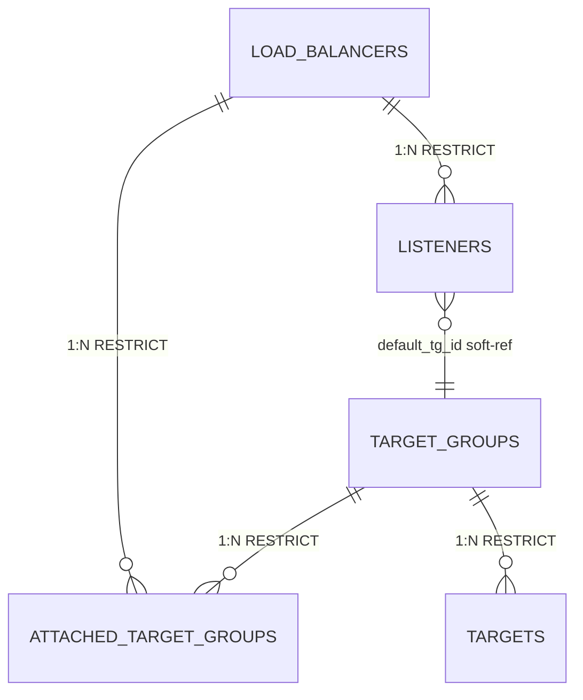

# kacho-nlb — L4 Network Load Balancer control-plane design

**Status**: DRAFT (post-brainstorming, pre-implementation)
**Date**: 2026-05-23
**Scope**: production-ready control-plane, no data-plane sibling, no tech debt
**Single TODO**: `GlobalLoadBalancer` (cross-region) — reserved slot only
**Compliance**: workspace CLAUDE.md, evgeniy skill §1-§13, KAC-108 FGA model

---

## §1. Architecture overview

### Repo & layering (evgeniy §1.A)

- **Repo**: new `PRO-Robotech/kacho-nlb` (cloned into `kacho-workspace/project/kacho-nlb/`)
- **Go import root**: `github.com/PRO-Robotech/kacho-nlb`
- **DB**: `kacho_nlb` (database) / `kacho_nlb` (schema)
- **REST**: `/nlb/v1/*`
- **FGA object types**: `nlb_load_balancer`, `nlb_listener`, `nlb_target_group`
- **Outbox table**: `nlb_outbox`, channel `nlb_outbox`
- **ENV prefix**: `KACHO_NLB_*` (viper paths via delimiter `__`)
- **Operation prefix**: `nlb` (also serves as `kacho-corelib/ids.PrefixLoadBalancer`)
- **k8s namespace/release**: `kacho-nlb`
- **Newman case-id prefixes**: `NLB-*` / `LST-*` / `TGR-*` / `TGT-*` / `AZD-*`
- **Permission strings module**: `loadbalancer.*` (per existing iam `roles/loadbalancer.*` seed)
- **Proto package**: `kacho.cloud.loadbalancer.v1` (already vendored — NOT renamed)

### Layout

```
kacho-nlb/
├── cmd/
│   ├── kacho-loadbalancer/main.go     # API server only (cobra root)
│   └── migrator/main.go               # separate binary; cobra; --dialect/--dsn
├── pkg/                               # public SDK (future)
├── internal/
│   ├── apps/
│   │   ├── kacho/
│   │   │   ├── api/
│   │   │   │   ├── loadbalancer/      # per-resource UseCases (evgeniy §2.B)
│   │   │   │   │   ├── handler.go
│   │   │   │   │   ├── create.go / update.go / delete.go / start.go / stop.go / move.go
│   │   │   │   │   ├── attach_target_group.go / detach_target_group.go
│   │   │   │   │   ├── get_target_states.go / list_operations.go
│   │   │   │   ├── listener/
│   │   │   │   ├── targetgroup/
│   │   │   │   ├── operation/
│   │   │   │   ├── internal_lifecycle/
│   │   │   │   └── shared/
│   │   │   ├── jobs/                  # workers: outbox-drainer, fga-tuple-writer, target_drain_runner
│   │   │   ├── config/                # viper + YAML (evgeniy §8.J)
│   │   │   └── utils/
│   │   └── migrator/
│   ├── domain/                        # self-validating (evgeniy §4.D)
│   │   ├── types.go / loadbalancer.go / listener.go / target_group.go / target.go
│   │   ├── health_check.go / status.go / constants.go / builders.go / errors.go
│   ├── repo/
│   │   └── kacho/
│   │       ├── iface.go               # Repository / Reader / Writer (CQRS, evgeniy §6.G)
│   │       ├── loadbalancer/iface.go / listener/iface.go / targetgroup/iface.go
│   │       ├── outbox/iface.go
│   │       └── pg/                    # pgx impl + dto/
│   ├── dto/
│   │   ├── base.go                    # generic DTO Interface (evgeniy §3.C)
│   │   └── type2pb/                   # init()-registered transfers
│   ├── clients/                       # vpc/compute/iam gRPC clients (corlib client-builder)
│   ├── check/                         # FGA Check interceptor wire
│   │   ├── permission_map.go / check_client.go
│   ├── fgawrite/                      # HierarchyTupleWriter helpers
│   └── migrations/0001_initial.sql    # embed.FS goose
├── tests/newman/                      # E2E regression (cases/*.py → gen.py)
├── tests/k6/                          # load scenarios
├── deploy/                            # Helm
├── docs/architecture/                 # ER diagram + 14 docs
├── Dockerfile / Makefile / go.mod (replace ../kacho-corelib ../kacho-proto)
└── .github/workflows/{ci,docker-build,security-scan,newman-e2e,continuous-fuzz}.yml
```

### Storage / Operations / Outbox

- **Operations LRO**: common `operations` table from `kacho-corelib/migrations/common/`, inline в baseline `0001_initial.sql` (per kacho-vpc convention). Prefix `nlb`.
- **Outbox + LISTEN/NOTIFY**: `nlb_outbox` table, `nlb_outbox_notify_trg → pg_notify('nlb_outbox', sequence_no::text)`. Emit per mutation в той же TX (через `RepositoryWriter.Outbox().Emit(...)`).
- **NO data-plane sibling** repo. Никаких `kacho-nlb-implement` / `kacho-nlb-controllers`.

### Cross-service edges (runtime)

| Edge | Purpose |
|---|---|
| `nlb → vpc.InternalAddressService` | Auto-allocate VIP (External / Internal) |
| `nlb → vpc.AddressService.Get + SetReference` | BYO `address_id` validation + mark `used_by=nlb_listener:<id>` |
| `nlb → vpc.SubnetService.Get` | Listener INTERNAL subnet validation + Target in-cloud ip_ref |
| `nlb → vpc.NetworkInterfaceService.Get` | Target `nic_id` resolve → primary IP |
| `nlb → compute.InstanceService.Get` | Target `instance_id` resolve → primary NIC IP |
| `nlb → compute.RegionService.Get` | `region_id` validation |
| `nlb → iam.ProjectService.Get` | `project_id` validation |
| `nlb → iam.InternalIAMService.Check` | per-RPC FGA Check (interceptor) |
| `nlb → iam.InternalIAMService.WriteCreatorTuple` | D-11 sync hierarchy tuple |
| `iam → nlb.InternalResourceLifecycleService.Subscribe` | D-13 lifecycle event stream |

Cycles запрещены — все направления `nlb → *`, обратно только iam-driven subscribe.

### Build graph

```
kacho-proto → kacho-corelib → kacho-nlb ─┐
                                         ├─→ kacho-api-gateway (/nlb/v1/*)
                                         └─→ kacho-deploy (Helm)
```

---

## §2. Resource model (newtypes / statuses / builders / FK / cross-refs / DB-CHECK)

### 2.1 Domain newtypes (`internal/domain/types.go`)

Все поля с семантикой — newtypes с `Validate() error`. Голый `string` запрещён (evgeniy §D.2).

```go
type (
    ResourceID    string                       // 3-char prefix + 17 base32
    ProjectID     string                       // "prj" + 17
    RegionID      string                       // "ru-central1"-style
    ZoneID        string                       // "ru-central1-a"
    SubnetID      = ResourceID                 // soft-ref vpc
    NetworkID     = ResourceID
    AddressID     = ResourceID
    NicID         = ResourceID
    InstanceID    = ResourceID

    LbLabelKey    string
    LbLabelVal    string
    LbLabels      = dict.HDict[LbLabelKey, LbLabelVal]   // max 64 pairs
    LbName        string                       // 3-63 chars regex
    LbDescription string                       // ≤256
    LbNameOpt     = option.ValueOf[LbName]

    LbPort        int32                        // 1-65535
    LbProto       string                       // "TCP" | "UDP"
    IPVersion     string                       // "IPV4" | "IPV6"
    IPAddress     string                       // valid netip.Addr
    LbWeight      int32                        // 0-1000
    LbDuration    time.Duration
)
```

Все имеют `Validate() error`.

### 2.2 Resources

```go
type LoadBalancer struct {
    ID                   ResourceID
    ProjectID            ProjectID
    RegionID             RegionID
    Name                 LbName
    Description          LbDescription
    Labels               LbLabels
    Type                 LBType                // EXTERNAL | INTERNAL
    Status               LBStatus              // CREATING/STARTING/ACTIVE/STOPPING/STOPPED/DELETING/INACTIVE
    SessionAffinity      SessionAffinity       // FIVE_TUPLE | CLIENT_IP_ONLY
    CrossZoneEnabled     bool                  // default true
    DeletionProtection   bool
}

type Listener struct {
    ID                    ResourceID
    ProjectID             ProjectID
    LoadBalancerID        ResourceID           // FK
    RegionID              RegionID             // denorm from LB
    Name                  LbName
    Description           LbDescription
    Labels                LbLabels
    Protocol              LbProto
    Port                  LbPort
    TargetPort            LbPort
    IPVersion             IPVersion
    AddressID             option.ValueOf[AddressID]   // BYO опционально
    AllocatedAddress      IPAddress
    SubnetID              option.ValueOf[SubnetID]    // required для INTERNAL
    ProxyProtocolV2       bool
    DefaultTargetGroupID  option.ValueOf[ResourceID]
    Status                ListenerStatus
}

type TargetGroup struct {
    ID                          ResourceID
    ProjectID                   ProjectID
    RegionID                    RegionID
    Name                        LbName
    Description                 LbDescription
    Labels                      LbLabels
    Targets                     []Target            // embedded (child table targets)
    HealthCheck                 HealthCheck         // embedded JSONB
    DeregistrationDelaySeconds  int32               // 0-3600, default 300
    SlowStartSeconds            int32               // 0-900, default 0
    Status                      TargetGroupStatus   // ACTIVE | DELETING
}

// 4-way oneof identity (Section 2.5)
type Target struct {
    InstanceID  option.ValueOf[InstanceID]   // (1) in-cloud via compute
    NicID       option.ValueOf[NicID]        // (2) in-cloud via vpc.NIC
    IPRef       *TargetIPRef                 // (3) in-cloud raw IP в subnet
    ExternalIP  *TargetExternalIP            // (4) out-of-cloud raw IP
    Weight      LbWeight
}
type TargetIPRef      struct { SubnetID SubnetID; Address IPAddress }
type TargetExternalIP struct { Address IPAddress; ZoneID option.ValueOf[ZoneID] }

type HealthCheck struct {
    Name               LbName
    Interval           LbDuration         // default 2s
    Timeout            LbDuration         // default 1s
    UnhealthyThreshold int32              // 2-10
    HealthyThreshold   int32              // 2-10
    TCP   *HealthCheckTCP                 // exactly one of
    HTTP  *HealthCheckHTTP
    HTTPS *HealthCheckHTTPS
    GRPC  *HealthCheckGRPC
}
```

### 2.3 Statuses (`internal/domain/status.go`)

```go
const (
    LBTypeExternal LBType = "EXTERNAL"
    LBTypeInternal LBType = "INTERNAL"

    LBStatusCreating LBStatus = "CREATING"
    LBStatusStarting LBStatus = "STARTING"
    LBStatusActive   LBStatus = "ACTIVE"
    LBStatusStopping LBStatus = "STOPPING"
    LBStatusStopped  LBStatus = "STOPPED"
    LBStatusDeleting LBStatus = "DELETING"
    LBStatusInactive LBStatus = "INACTIVE"

    SessionAffinity5Tuple       SessionAffinity = "FIVE_TUPLE"
    SessionAffinityClientIPOnly SessionAffinity = "CLIENT_IP_ONLY"

    ListenerStatusCreating ListenerStatus = "CREATING"
    ListenerStatusActive   ListenerStatus = "ACTIVE"
    ListenerStatusUpdating ListenerStatus = "UPDATING"
    ListenerStatusDeleting ListenerStatus = "DELETING"

    TargetGroupStatusActive   TargetGroupStatus = "ACTIVE"
    TargetGroupStatusDeleting TargetGroupStatus = "DELETING"

    TargetHealthInitial   TargetHealthStatus = "INITIAL"
    TargetHealthHealthy   TargetHealthStatus = "HEALTHY"
    TargetHealthUnhealthy TargetHealthStatus = "UNHEALTHY"
    TargetHealthDraining  TargetHealthStatus = "DRAINING"
    TargetHealthInactive  TargetHealthStatus = "INACTIVE"
)
```

### 2.4 Resource ID prefixes (added to `kacho-corelib/ids`)

| Resource | Const | Prefix |
|---|---|---|
| LoadBalancer | `ids.PrefixLoadBalancer` | `nlb` |
| Listener | `ids.PrefixListener` | `lst` |
| TargetGroup | `ids.PrefixTargetGroup` | `tgr` |
| Operation (NLB) | `ids.PrefixOperationNLB = ids.PrefixLoadBalancer` | `nlb` |
| **GlobalLoadBalancer (reserved, not implemented)** | `ids.PrefixGlobalLoadBalancer` | `glb` |

### 2.5 FK contract (within `kacho_nlb` schema)

Все `ON DELETE RESTRICT` (как в kacho-vpc). Удаляем снизу вверх. Sync precheck в Delete UseCase даёт UX-friendly error.

| Constraint | ON DELETE |
|---|---|
| `listeners.load_balancer_id → load_balancers(id)` | **RESTRICT** |
| `attached_target_groups.load_balancer_id → load_balancers(id)` | **RESTRICT** |
| `attached_target_groups.target_group_id → target_groups(id)` | **RESTRICT** |
| `targets.target_group_id → target_groups(id)` | **RESTRICT** |

Delete order: `Target (RemoveTargets) → AttachedTG (Detach) → Listener (Delete) → TargetGroup (Delete) → LoadBalancer (Delete)`.

### 2.6 Cross-service refs (not FK; workspace CLAUDE.md §«Кросс-доменные»)

| Field | Owner | When validated |
|---|---|---|
| `LoadBalancer.region_id` | `kacho-compute` | sync via `RegionService.Get` |
| `LoadBalancer.project_id` | `kacho-iam` | sync via `ProjectService.Get` |
| `Listener.address_id` (BYO) | `kacho-vpc` | sync via `AddressService.Get` + `InternalAddressService.SetReference` |
| `Listener.subnet_id` (INTERNAL) | `kacho-vpc` | sync via `SubnetService.Get` |
| `Target.instance_id` | `kacho-compute` | async via `InstanceService.Get` (resolve primary NIC IP) |
| `Target.nic_id` | `kacho-vpc` | async via `NetworkInterfaceService.Get` |
| `Target.ip_ref.subnet_id` | `kacho-vpc` | async via `SubnetService.Get` + IP ∈ CIDR check |
| `Target.external_ip` | NONE | sync bogon-check only (loopback/link-local/multicast/unspecified denied) |

### 2.7 DB-CHECK parity (evgeniy §E.2) — see §5

---

## §3. RPC contract

### 3.1 Services

| Service | Port | Visibility | Methods |
|---|---|---|---|
| `NetworkLoadBalancerService` | 9090 | public | 12 |
| `ListenerService` | 9090 | public | 6 |
| `TargetGroupService` | 9090 | public | 9 |
| `OperationService` | 9090 | public | 3 |
| `InternalResourceLifecycleService` | 9091 | cluster-internal | 1 server-stream |

Все мутации returned `operation.Operation` (async). Reads sync.

### 3.2 NetworkLoadBalancerService

| Method | S/A | Notes |
|---|---|---|
| `Get` | sync | NotFound → 404 |
| `List` | sync | filter `name=`, page_token, page_size |
| `Create` | async | metadata `CreateNetworkLoadBalancerMetadata` |
| `Update` | async | UpdateMask, immutable: type/region_id/project_id |
| `Delete` | async | sync precheck: deletion_protection, has listeners, has attached TG |
| `Start` | async | precondition: status ∈ {STOPPED, INACTIVE} |
| `Stop` | async | precondition: status ∈ {ACTIVE, INACTIVE} |
| `Move` | async | cross-project, same-region; blocked if attached TG present |
| `AttachTargetGroup` | async | same-region check; M:N pivot insert ON CONFLICT idempotent |
| `DetachTargetGroup` | async | respects deregistration_delay_seconds на attached targets |
| `GetTargetStates` | sync | computed runtime (deterministic ramp) |
| `ListOperations` | sync | per-resource history |

REST:
```
GET    /nlb/v1/networkLoadBalancers/{network_load_balancer_id}
GET    /nlb/v1/networkLoadBalancers
POST   /nlb/v1/networkLoadBalancers
PATCH  /nlb/v1/networkLoadBalancers/{network_load_balancer_id}
DELETE /nlb/v1/networkLoadBalancers/{network_load_balancer_id}
POST   /nlb/v1/networkLoadBalancers/{id}:start
POST   /nlb/v1/networkLoadBalancers/{id}:stop
POST   /nlb/v1/networkLoadBalancers/{id}:move
POST   /nlb/v1/networkLoadBalancers/{id}:attachTargetGroup
POST   /nlb/v1/networkLoadBalancers/{id}:detachTargetGroup
GET    /nlb/v1/networkLoadBalancers/{id}/targetStates
GET    /nlb/v1/networkLoadBalancers/{id}/operations
```

### 3.3 ListenerService

| Method | S/A | Notes |
|---|---|---|
| `Get` / `List` | sync | |
| `Create` | async | VIP alloc: BYO `address_id` ИЛИ auto via `vpc.InternalAddressService.AllocateExternalIP/AllocateInternalIP` |
| `Update` | async | mutable: name/desc/labels/default_target_group_id/proxy_protocol_v2. Immutable: lb_id, protocol, port, ip_version, address_id |
| `Delete` | async | free VIP back to pool / clear BYO Address.used_by |
| `ListOperations` | sync | |

REST: `/nlb/v1/listeners[/{listener_id}[:verb \| /operations]]`

### 3.4 TargetGroupService

| Method | S/A | Notes |
|---|---|---|
| `Get` / `List` | sync | |
| `Create` | async | inline `targets[]`, `health_check`, `deregistration_delay_seconds`, `slow_start_seconds` allowed |
| `Update` | async | mutable: name/desc/labels/HC/dereg/slow_start. Immutable: project_id/region_id. Targets — separate Add/Remove |
| `Delete` | async | sync precheck: no attached LB, no targets remaining |
| `Move` | async | cross-project; blocked if attached |
| `AddTargets` | async | idempotent via partial UNIQUE ON CONFLICT DO NOTHING. Per-target peer-validate в worker |
| `RemoveTargets` | async | 2-phase: Phase A mark DRAINING (ops.MarkDone), Phase B drain-runner DELETE after delay |
| `ListOperations` | sync | |

REST: `/nlb/v1/targetGroups[/{tg_id}[:verb \| /operations]]`

### 3.5 OperationService / InternalResourceLifecycleService

OperationService — обёртка над `kacho-corelib/operations`. `/nlb/v1/operations/{id}[:cancel]`, `/nlb/v1/operations`.

InternalResourceLifecycleService.Subscribe — server-stream LifecycleEvent {sequence_no, resource_type, resource_id, project_id, action, emitted_at}. Per-stream semaphore `KACHO_NLB_LIFECYCLE_MAX_STREAMS=32`. LISTEN nlb_outbox on dedicated pgx-conn.

### 3.6 Permission map / outbox events / api-gateway

См. §6 (FGA) и §3.9 (outbox) ниже.

### 3.7 Handlers (evgeniy §2.B)

Per-resource в `internal/apps/kacho/api/<resource>/handler.go`. Тонкий transport — parse-req → call UseCase → `dto.Transfer(...)` → format-resp. No business logic.

### 3.9 Outbox events per mutation

| RPC | Event(s) emitted in same TX |
|---|---|
| NLB.Create | `nlb_load_balancer:<id> CREATED` |
| NLB.Update / Start / Stop / Move / AttachTG | `nlb_load_balancer:<id> UPDATED` |
| NLB.Delete | `nlb_load_balancer:<id> DELETED` |
| Listener.Create | `nlb_listener:<id> CREATED` + `nlb_load_balancer:<lb_id> UPDATED` |
| Listener.Update / Delete | `nlb_listener:<id> UPDATED/DELETED` |
| TG.Create / Update / Delete | `nlb_target_group:<id> CREATED/UPDATED/DELETED` |
| TG.AddTargets / RemoveTargets | `nlb_target_group:<id> UPDATED` |

### 3.10 api-gateway registration

```go
// public TLS mux:
lbv1.RegisterNetworkLoadBalancerServiceHandler(...)
lbv1.RegisterListenerServiceHandler(...)
lbv1.RegisterTargetGroupServiceHandler(...)

// internal mux (cluster-only):
lbv1.RegisterInternalResourceLifecycleServiceHandler(...)

// opsproxy: prefix "nlb" → nlbAddr
```

---

## §4. Data flow

### 4.1 LoadBalancer.Create

Sync: FGA editor on project → build domain.LoadBalancer + Validate() → soft peer-prechecks (Project/Region Get) → repo.Writer (ops.Insert + outbox.Emit CREATING) → Commit → spawn worker → return Operation.

Worker: repo.Writer (loadbalancers.Insert + outbox.Emit CREATED + ops.MarkDone(response=LB)) → Commit → fgawrite.Emit("nlb_load_balancer:<id>#project@project:<project_id>") → trigger `lb_status_recompute` (DB-side) транзитит INACTIVE.

### 4.2 Listener.Create (VIP alloc)

Sync: FGA editor on LB → Validate() → repo.Reader LB.Get (same project, status != DELETING) → ops.Insert → spawn worker.

Worker:
- **BYO**: `vpc.AddressService.Get(address_id)` → verify same project + used_by пустой OR already == ours → `vpc.InternalAddressService.SetReference(used_by=nlb_listener:<id>)` atomic CAS.
- **Auto**: `vpc.InternalAddressService.AllocateExternalIP/AllocateInternalIP(owner=nlb_listener:<id>)`.

Затем `listeners.Insert(allocated_address, address_id)` + outbox.Emit (CREATED + LB UPDATED) + ops.MarkDone → fgawrite.Emit 2 tuples (project + load_balancer).

Compensation: defer worker — если ошибка после allocate → `vpc.InternalAddressService.FreeIP` best-effort.

### 4.3 TG.AddTargets

Sync: FGA editor on TG → per-target.Validate() (oneof, weight, bogon-check для external_ip) → ops.Insert.

Worker: per-target peer-validate (instance/nic/subnet resolve) → repo.Writer `INSERT ... ON CONFLICT (target_group_id, <identity-key>) DO NOTHING` per target (idempotent) → outbox.Emit (UPDATED) → ops.MarkDone.

### 4.4 TG.RemoveTargets (2-phase drain)

Worker Phase A (immediate): `UPDATE targets SET status='DRAINING', drain_started_at=now() WHERE target_group_id=$1 AND identity-key IN (...)` → ops.MarkDone (client gets done=true fast).

Phase B (jobs/target_drain_runner.go, periodic): `DELETE FROM targets WHERE status='DRAINING' AND drain_started_at < now() - $delay::interval` → outbox.Emit (UPDATED).

### 4.5 NLB.AttachTargetGroup

Sync: FGA editor on LB + viewer on TG → repo.Reader LB.Get / TG.Get → same-region check → ops.Insert.

Worker: `INSERT INTO attached_target_groups ON CONFLICT (lb_id, tg_id) DO NOTHING` → outbox.Emit (LB UPDATED) → trigger `lb_status_recompute` (INACTIVE → ACTIVE if has_listener && has_attached_tg).

### 4.6 GetTargetStates (sync, computed)

`viewer on LB` → repo.Reader (LB + attached + TG + targets) → compute per-target health:
- DRAINING если status='DRAINING'
- INACTIVE если LB.status='STOPPED'
- INITIAL если age < interval × healthy_threshold
- HEALTHY иначе

Return `repeated TargetState`.

### 4.7 NLB.Move (cross-project)

Sync: FGA scope-conditional (editor on src+dst project) → check has_attached_tg (block если есть) → ops.Insert.

Worker: `UPDATE loadbalancers SET project_id=$dst WHERE id=$lb_id` + sync `UPDATE listeners SET project_id=$dst WHERE load_balancer_id=$lb_id` (denorm sync в той же TX) → outbox.Emit (MOVED) → fgawrite rewrite project tuples → ops.MarkDone.

### 4.8 InternalResourceLifecycleService.Subscribe (D-13)

Acquire semaphore → dedicated pgx.Connect → `LISTEN nlb_outbox` → catchup batch 100 → `WaitForNotification` loop (30s timeout) → stream `LifecycleEvent` к client (kacho-iam).

### 4.9 Compensation / saga

Best-effort, не 2PC:
- Listener.Create VIP allocated → repo.Insert failed → defer `vpc.FreeIP`
- Listener.Delete vpc.FreeIP failed → outbox marks `nlb_listener:<id> FAILED` + admin alert + retry jobs/free_ip_runner.go
- AddTargets per-target peer fail → ops.error InvalidArgument с per-target reason
- RemoveTargets Phase B DELETE failed → retry next drain-runner tick

---

## §5. Storage / migrations

### 5.1 Schema

Database `kacho_nlb`, schema `kacho_nlb`. Search path libpq `options=-c search_path=kacho_nlb,public`. Extension `btree_gist` в `public`. Goose `kacho_nlb.goose_db_version`.

### 5.2 `0001_initial.sql` — squashed baseline

Сводно (полный SQL см. соответствующий subtask):

- Helper functions: `kacho_labels_valid(jsonb)`, `nlb_outbox_notify()`, `lb_status_recompute()`
- `operations` table (per kacho-corelib/migrations/common, inline)
- `load_balancers` (PK id, FK none, partial UNIQUE `(project_id, name) WHERE name<>''`, CHECK на type/status/affinity, labels GIN)
- `listeners` (PK id, FK load_balancer_id RESTRICT, partial UNIQUE name per LB, UNIQUE (lb_id, port, protocol), UNIQUE (region_id, allocated_address, port, protocol) WHERE status!='DELETING'; CHECK port/protocol/ipver/status; labels GIN; trigger `listeners_lb_status_recompute`)
- `target_groups` (PK id, FK none, partial UNIQUE `(project_id, name)`, CHECK на dereg/slow_start/status; labels GIN; health_check JSONB)
- `targets` (composite — child of TG, FK target_group_id RESTRICT, 4-way identity oneof CHECK, partial UNIQUE NULLS NOT DISTINCT per identity-type, drain consistency CHECK, status enum CHECK, weight CHECK, draining index)
- `attached_target_groups` (PK composite, FK both RESTRICT, priority 0-1000 CHECK, trigger `attached_tg_lb_status_recompute`)
- `nlb_outbox` (BIGSERIAL seq, resource_type/action enum CHECK, trigger NOTIFY)
- `nlb_watch_cursors` (subscriber tracking)

### 5.3 Denormalized columns

| Column | Why |
|---|---|
| `listeners.region_id` | UNIQUE constraint `listeners_region_vip_uniq` |
| `listeners.project_id` | keyset pagination |
| `target_groups.region_id` | same-region check at attach |
| `nlb_outbox.project_id` | Subscribe project filter без JOIN |

Sync в той же TX через single UPDATE на parent (Move LB → UPDATE listeners в same TX).

### 5.4 Triggers

| Trigger | When | Action |
|---|---|---|
| `nlb_outbox_notify_trg` | AFTER INSERT nlb_outbox | `pg_notify('nlb_outbox', sequence_no::text)` |
| `listeners_lb_status_recompute` | AFTER INSERT/UPDATE-status/DELETE listeners | LB.status INACTIVE ↔ ACTIVE |
| `attached_tg_lb_status_recompute` | AFTER INSERT/DELETE attached_target_groups | Same |

Trigger НЕ перебивает явные транзишены `CREATING/STARTING/STOPPING/STOPPED/DELETING` (only `INACTIVE ↔ ACTIVE`).

### 5.5 ER diagram



### 5.6 Sync prechecks в Delete UseCases

```go
// DeleteLoadBalancerUseCase
if lb.DeletionProtection { → FailedPrecondition "deletion_protection enabled" }
if has_listeners > 0    { → FailedPrecondition "has N listener(s); delete first" }
if has_attached_tg > 0  { → FailedPrecondition "has attached TG; detach first" }
// + final fallback: FK 23503 в worker → mapRepoErr → FailedPrecondition (TOCTOU)
```

Аналогично для TG.Delete (precheck attached + targets) и Listener.Delete (нет children).

### 5.7 Forbidden

- ❌ Cross-service FK
- ❌ Soft-delete / `deleted_at`
- ❌ `resource_version`/`generation`/`spec`/`status` JSONB envelope columns
- ❌ Application-level refcheck для within-DB ссылок

### 5.8 Migrator

Отдельный binary `cmd/migrator/` (cobra `up/down/status/create --dialect=postgres --dsn=...`). НЕ subcommand main API binary (evgeniy §K.1).

Init-container в Helm pod: `kacho-migrator up`. Main container: `kacho-loadbalancer serve`.

---

## §6. FGA model + custom roles + permission catalog

### 6.1 FGA DSL — 3 object types

```dsl
type nlb_load_balancer
  relations
    define project: [project]
    define owner: [user, service_account] or owner from project
    define editor: [user, service_account, group#member] or editor from project or owner
    define viewer: [user, service_account, group#member] or viewer from project or editor

type nlb_listener
  relations
    define load_balancer: [nlb_load_balancer]
    define project: [project] or project from load_balancer
    define owner: [user, service_account] or owner from load_balancer
    define editor: [user, service_account, group#member] or editor from load_balancer or owner
    define viewer: [user, service_account, group#member] or viewer from load_balancer or editor

type nlb_target_group
  relations
    define project: [project]
    define owner: [user, service_account] or owner from project
    define editor: [user, service_account, group#member] or editor from project or owner
    define viewer: [user, service_account, group#member] or viewer from project or editor
```

### 6.2 Permission catalog (`loadbalancer.*` namespace; aligns with existing `roles/loadbalancer.*` seed)

```
loadbalancer.networkLoadBalancers.{get,list,create,update,delete,start,stop,move,attachTargetGroup,detachTargetGroup,getTargetStates,listOperations}
loadbalancer.listeners.{get,list,create,update,delete,listOperations}
loadbalancer.targetGroups.{get,list,create,update,delete,move,addTargets,removeTargets,listOperations}
loadbalancer.operations.{get,cancel,list}
```

Total: **30 permissions**. Published в `docs/architecture/14-permission-catalog.md` + registered in `kacho-iam/internal/authzmap/permission_catalog.go`.

### 6.3 Predefined system-roles (already seeded + новые)

| Role | Permissions | FGA relation |
|---|---|---|
| `roles/loadbalancer.admin` | `loadbalancer.*.*` | `owner` |
| `roles/loadbalancer.editor` | большинство кроме admin-only | `editor` |
| `roles/loadbalancer.viewer` | `*.get`/`*.list`/`*.listOperations`/`*.getTargetStates` | `viewer` |
| `roles/loadbalancer.operator` *(новый seed)* | `start,stop,getTargetStates,listOperations` + viewer на TG | `editor` |
| `roles/loadbalancer.targetManager` *(новый seed)* | `targetGroups.{addTargets,removeTargets,getTargetStates}` + viewer | `editor` |

### 6.4 Custom roles

Tenant создаёт `iam.Role` с subset `permissions[]`. iam validates каждый permission против catalog (`InvalidArgument` если unknown). При AccessBinding kacho-iam expands в FGA tuple (`viewer`/`editor`/`owner` — narrowest covering).

Fine-grained custom permissions (точная партициация `start`+`stop` only) — **резолвится через 3 FGA relations**. Подход Step B (`CheckPermission` fine-grained, отдельные FGA relations per permission или upgrade-to-relation) — **остаётся за iam team** (KAC-108 follow-up). Не блокирует NLB MVP.

### 6.5 Permission map (`internal/check/permission_map.go`)

Каждый RPCEntry содержит **оба** поля:
- `Relation: "viewer"|"editor"|"owner"` — для текущего E3 Check
- `Permission: "loadbalancer.X.Y"` — для future fine-grained (drop-in)

```go
"/kacho.cloud.loadbalancer.v1.NetworkLoadBalancerService/Start": {
    Relation:   relationEditor,
    Permission: "loadbalancer.networkLoadBalancers.start",
    Extract:    authz.StaticExtractor(objectTypeLoadBalancer, lbIDFromStart),
},
```

Scope-conditional extractors для:
- `Move` (src+dst project — interceptor делает 2 Check)
- `AttachTargetGroup` (editor on LB + viewer on TG)

### 6.6 D-11 sync creator-tuple write

В worker Create перед `repo.Commit()`:
- `nlb_load_balancer:<id>#owner@<subj>` (для creator)
- `nlb_<resource>:<id>#project@project:<project_id>` (hierarchy)
- `nlb_listener:<id>#load_balancer@nlb_load_balancer:<lb_id>` (graph link для Listener)

Если WriteCreatorTuple падает → worker abort → ops.MarkFailed (fail-closed).

### 6.7 D-13 lifecycle subscribe

Server-side в kacho-nlb (`InternalResourceLifecycleService.Subscribe`). Client-side в kacho-iam.

### 6.8 Cleanup on Delete

`LifecycleEvent{action=DELETED}` → iam D-13 subscriber → `openfga.DeleteByObject(nlb_X:<id>)` cleanup orphan tuples.

`Move(dst_project)` — sync rewrite в worker через `iam.InternalIAMService.RewriteProjectTuple` (delete old + write new). Аналогично для child Listener'ов.

### 6.9 Cache invalidation (≤10s, NFR KAC-108)

`kacho-corelib/authz.Cache` TTL=5s positive-only + LISTEN-invalidate (`pg_notify('kacho_iam_subjects', subject_id)`).

### 6.10 Fail modes

- FGA unavailable → fail-closed `PermissionDenied`
- RPC не в PermissionMap → fail-closed (drift-test ловит в CI)
- `KACHO_NLB_AUTHZ__BREAKGLASS=true` → bypass + WARN (dev only, config validation rejects в production mode)
- `ErrNoPath` → DecisionNoPath passthrough → 404 от БД (KAC-133 паттерн)

### 6.11 Drift-test

`permission_map_drift_test.go`:
1. Каждый RPC в map (или Public)
2. Каждый RPCEntry имеет non-empty Permission (за исключением Public)
3. Все Permission strings уникальные
4. Все strings соответствуют `^loadbalancer\.[a-z]+\.[a-z][A-Za-z]+$`

---

## §7. Testing strategy (100% RPC × class coverage)

### 7.1 Pyramid

- **Unit** (service+handler): ≥80% (domain ≥85%) coverage; portmock CQRS Repository
- **Integration** (TestContainers Postgres 16): repo CRUD / FK / UNIQUE / CHECK / triggers / LISTEN/NOTIFY / concurrent races
- **Newman E2E** (api-gateway:18080): 100% RPC × class matrix
- **k6** (load): baseline/stress/soak/spike scenarios

### 7.2 Newman matrix

Минимум **~290 cases** + ~30 authz-deny = ~320 (реально 350-450 с helper-блоками).

Per-RPC class coverage matrix — см. brainstorming §7.4.2. Domains:
- `NLB-*` (NetworkLoadBalancer)
- `LST-*` (Listener)
- `TGR-*` (TargetGroup)
- `TGT-*` (Target operations)
- `OP-*` (Operation)
- `AZD-*` (Authz deny — KAC-122 cross-domain pattern)

Classes: CRUD / VAL / NEG / BVA / CONF / STATE / IDEM / LSG / AZD.

### 7.3 Test-first дисциплина

Workspace CLAUDE.md «строгий TDD»: RED → GREEN pair обязательна в PR-description. Newman cases пишутся incrementally **рядом** с use-case'ами в PR#3-#5, не финальным dump'ом.

### 7.4 k6 scenarios

| Scenario | Цель | SLO |
|---|---|---|
| smoke | post-deploy sanity | 100 RPS / 30s, error < 1% |
| baseline | steady-state | 500 RPS / 5min, p95 ≤ 100ms, p99 ≤ 300ms |
| stress | break-point | ramp 100→2000 RPS |
| soak | leaks | 200 RPS × 60min |
| spike | burst | 100→1500→100 / 30s |

### 7.5 CI workflows

`.github/workflows/`: `ci.yaml` (build/vet/test/lint/govuln/integration/authz-deny-suite), `docker-build.yml` (multi-arch DockerHub), `security-scan.yml` (govulncheck SARIF + gitleaks + trivy), `newman-e2e.yml` (kind+helm umbrella + full newman), `continuous-fuzz.yml` (cron daily Go fuzz на newtypes validators).

---

## §8. Acceptance / KAC epic decomposition / PR-chain

### 8.1 Acceptance-doc

`docs/specs/sub-phase-X.Y-nlb-acceptance.md` — Given-When-Then ~50-80 scenarios (acceptance-author генерирует).

### 8.2 KAC epic subtasks (21)

См. brainstorming §8.2 — 21 subtask в топологическом порядке.

### 8.3 Cross-repo PR-chain (snapped to dependency graph)

1. `kacho-proto` — reserved fields + check vendored OK
2. `kacho-corelib` — ids prefixes (nlb/lst/tgr/glb) + RPCEntry.Permission + scope-conditional extractor
3. `kacho-iam` — seed `loadbalancer.{operator,targetManager}` system roles
4. `kacho-nlb` PRs #1..#5 (Foundation / Repo+Ops / LB+Listener / TG+Targets+Attach / Authz+Lifecycle+CI)
5. `kacho-api-gateway` — register `/nlb/v1/*` + opsproxy `nlb` prefix
6. `kacho-deploy` — pg-nlb + helm + ci-up seed
7. `kacho-workspace` — vault trail (post-merge) + epic doc

### 8.4 Definition of Done

- Acceptance APPROVED (acceptance-reviewer)
- Все 21 subtask merged
- CI green: unit + lint + integration + security-scan + newman-e2e
- Newman 100% matrix (≥320 cases) + ≥30 AZD + 0 failures
- k6 baseline pass SLO
- Coverage ≥80% (domain ≥85%)
- Vault ~28 notes updated
- api-gateway + opsproxy wired
- Helm deployable
- Drift-test green
- GlobalLoadBalancer TODO задокументирован (proto reserved fields + id-prefix `glb` + `docs/architecture/12-future-cross-region.md`)

### 8.5 Estimate

~32-40 рабочих дней (~6-8 недель) для одного исполнителя. С 2 разработчиками + параллельной newman/k6 работой — 4-5 недель.

### 8.6 Vault notes (~28)

KAC/KAC-NLB.md trail + resources/* (4) + rpc/* (4) + edges/* (8) + packages/* (~12).

---

## Future TODO (out of MVP)

### GlobalLoadBalancer (AWS-style composition layer)

- **Reserved**:
  - Proto field-numbers `NetworkLoadBalancer.30-39`, `Target.10-19`
  - id prefix `glb` в `kacho-corelib/ids.PrefixGlobalLoadBalancer`
  - Architecture doc `docs/architecture/12-future-cross-region.md` (план без кода)
- **Types** (когда implement): `DNS_GEO` / `DNS_FAILOVER` / `DNS_WEIGHTED` / `ANYCAST`
- **DNS_*** варианты требуют `kacho-dns` (blocked:kacho-dns)
- **ANYCAST** требует real BGP data-plane (enhancement:anycast-bgp-data-plane)
- **NO** in-place `Target.region_override` (отвергнут — нет industry precedent)

---

**End of design doc.**
