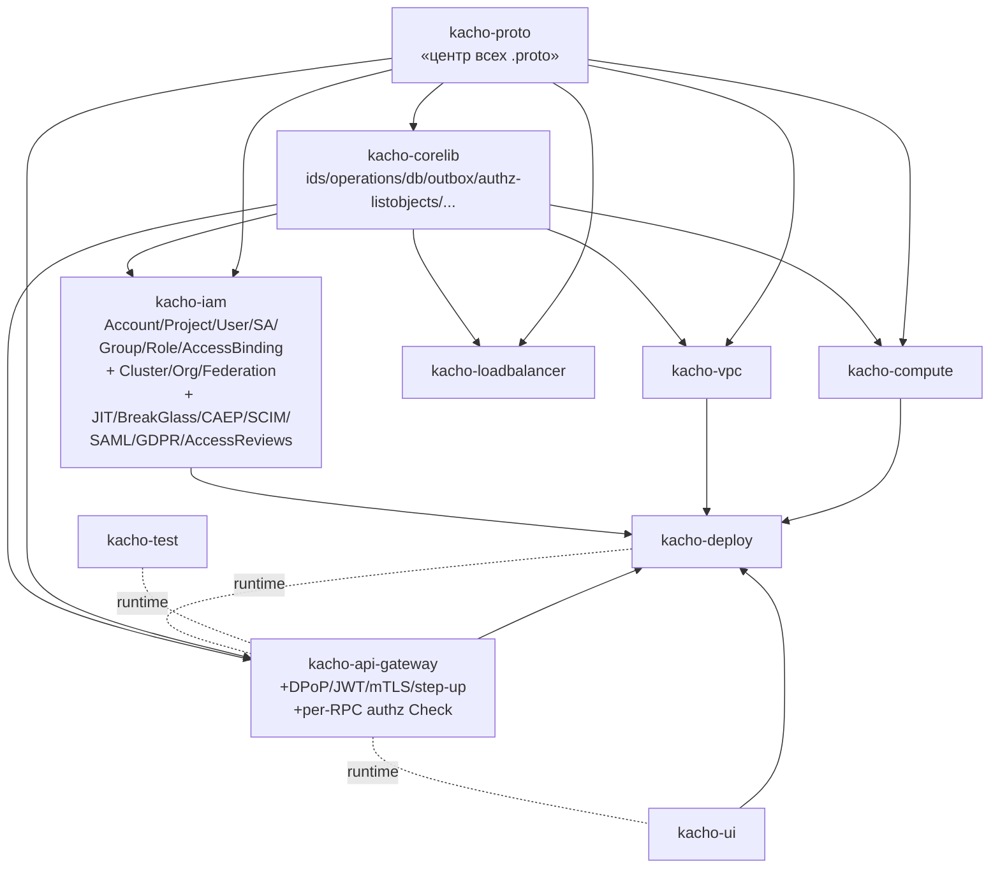
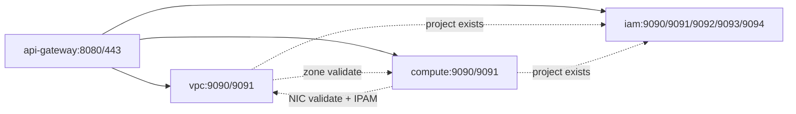
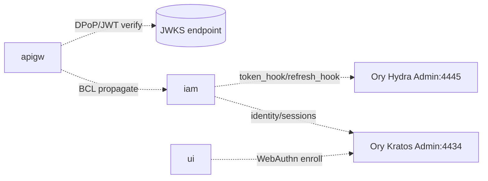
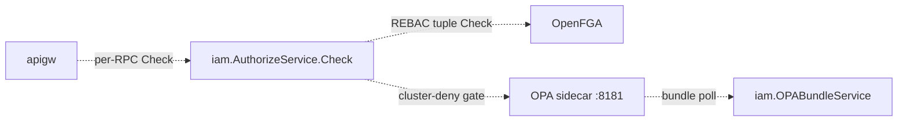
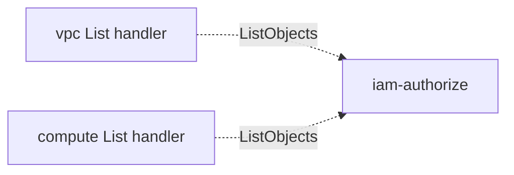
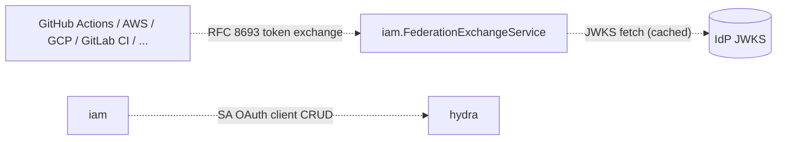
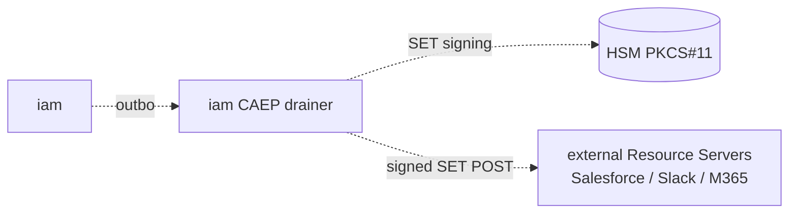
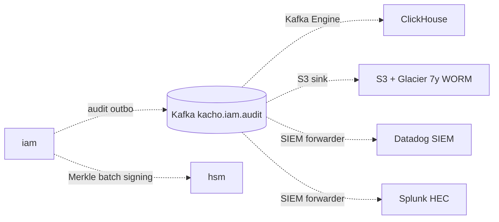
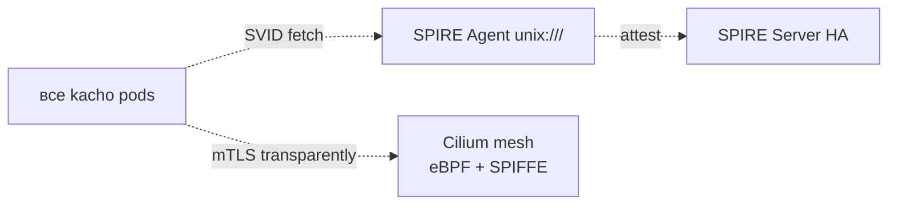

# Архитектура — cross-repo граф

## Build-зависимости (Go-replace + Dockerfile COPY)



Источник истины — `replace github.com/PRO-Robotech/...` в `*/go.mod` + `COPY ../kacho-*` в `*/Dockerfile`.

> [!note] KAC-124
> `kacho-resource-manager` упразднён в KAC-124 (E5 sub-phase 2.0). Organization/Cloud/Folder заменены Account/Project в `kacho-iam`.

## Runtime cross-domain edges (gRPC service → service)

### Backbone — Phase 1-2 (KAC-104, KAC-127 Phase 1-2)



### Phase 2 added (AuthN core, KAC-127 Phase 2 implemented)



### Phase 3 added (AuthZ core)



### Phase 4 added (List filtering)



### Phase 5 added (Workload Identity Federation)



### Phase 6 added (Enterprise SSO)

```mermaid
graph LR
    okta[Okta / Entra / Google] -.SCIM 2.0.-> iam-scim[iam.SCIM endpoints :9093]
    iam-scim -.identity sync.-> kratos
    saml-idp[SAML 2.0 IdP] -.SP-init/IdP-init.-> iam-saml[iam.SAML endpoints :9094]
    iam-saml -.bridge.-> jackson[Boxyhq Jackson]
    jackson -.session.-> kratos
```

### Phase 8 added (CAEP push)



### Phase 9 added (Audit pipeline)



### Phase 10 added (SPIFFE + Cilium)



Циклы запрещены (workspace `CLAUDE.md` §«Кросс-доменные ссылки на ресурсы»).
`kacho-iam` — leaf-owner (Account/Project): в него только звонят.

## Порядок merge'а для cross-repo фичи

Топологическая сортировка build-графа:
1. `kacho-proto` — proto changes + регенерация Go-stubs (commit `gen/`).
2. `kacho-corelib` — общие пакеты (если меняются).
3. Сервисы (`kacho-iam` / `kacho-vpc` / `kacho-compute` / `kacho-loadbalancer`) — в любом порядке между собой (DB-per-service).
4. `kacho-api-gateway` — регистрация новых RPC.
5. `kacho-deploy` — helm/compose tweaks.
6. `kacho-workspace` — docs/specs.

Пока вышестоящие изменения не в `main` — нижестоящий CI **временно пиннит siblings** к feature-веткам (`ref:`-строки в `.github/workflows/ci.yaml`).

## Tracking кросс-репо эпика

Через [[../docs/specs/|spec docs]] + tracking-issue в `PRO-Robotech/kacho-workspace` (метка `epic`). Per-repo issue/PR помечает `Blocked by PRO-Robotech/<repo>#<n>`.

KAC-127 — производный эпик 13 фаз, ссылается на [[KAC/KAC-127]].

## См. также

- [[README|hub]]
- [[KAC/KAC-127|KAC-127 — Production IAM (epic, 13 phases)]]
- [[kacho-vpc/README]] — most active service
- [[kacho-deploy/README]] — orchestration
- [[runbooks/README]] — operational runbooks

#architecture #dependencies #polyrepo
