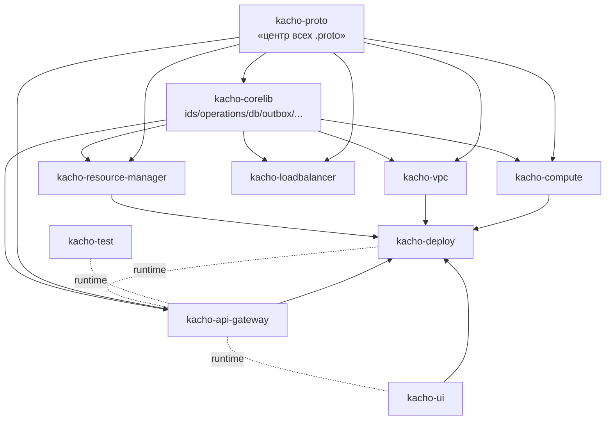
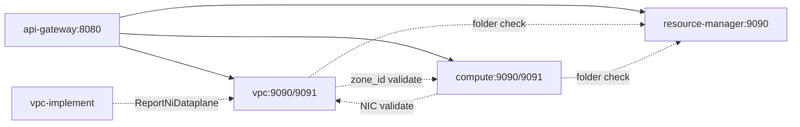

# Архитектура — cross-repo граф

## Build-зависимости (Go-replace + Dockerfile COPY)

Источник истины — `replace github.com/PRO-Robotech/...` в `*/go.mod` + `COPY ../kacho-*` в `*/Dockerfile`.

## Runtime cross-domain edges (gRPC service → service)

Циклы запрещены (workspace `CLAUDE.md` §«Кросс-доменные ссылки на ресурсы»).

## Порядок merge'а для cross-repo фичи

Топологическая сортировка build-графа:
1. `kacho-proto` — proto changes + регенерация Go-stubs (commit `gen/`).
2. `kacho-corelib` — общие пакеты (если меняются).
3. Сервисы (`kacho-vpc` / `kacho-rm` / `kacho-compute` / `kacho-nlb`) — в любом порядке между собой (DB-per-service).
4. `kacho-api-gateway` — регистрация новых RPC.
5. `kacho-deploy` — helm/compose tweaks.

Пока вышестоящие изменения не в `main` — нижестоящий CI **временно пиннит siblings** к feature-веткам (`ref:`-строки в `.github/workflows/ci.yaml`).

## Tracking кросс-репо эпика

Через [[../docs/specs/|spec docs]] + tracking-issue в `PRO-Robotech/kacho-workspace` (метка `epic`). Per-repo issue/PR помечает `Blocked by PRO-Robotech/<repo>#<n>`.

## См. также

- [[README|hub]]
- [[kacho-vpc/README]] — most active service
- [[kacho-deploy/README]] — orchestration

#architecture #dependencies #polyrepo
