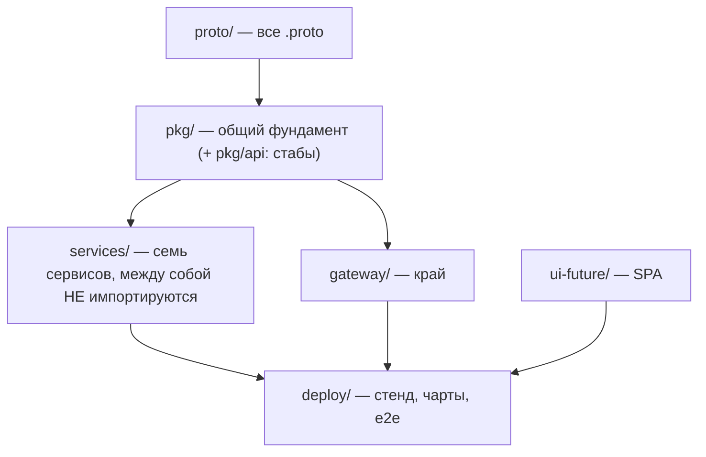
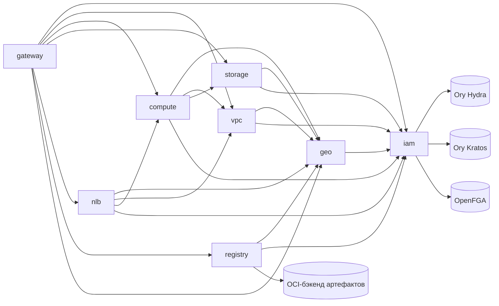

# Архитектура

> [!important] Что здесь описано и с какой ревизии
> Замер: продукт `PRO-Robotech/kacho@96b2879a` (ветка `agent/ci-github-hosted-runners`;
> ствол редизайна `redesign/integration` — её предок). Единица счёта названа у каждого
> числа. Записка описывает **топологию и рёбра**; нормативный источник —
> `.claude/rules/polyrepo.md`, и при расхождении верно оно, а не эта страница.

## Топология: ОДНО репозиторий продукта, а не пятнадцать

Разработка ведётся в монорепо `PRO-Robotech/kacho`. Прежние полирепо (`kacho-proto`,
`kacho-corelib`, `kacho-vpc`, `kacho-api-gateway`, `kacho-deploy`, …) на GitHub существуют
и **не заархивированы**, но последний push в каждый — середина июля 2026; клонируются
только по `KACHO_CLONE_LEGACY_POLYREPOS=1`. Второе живое репо — воркспейс
`PRO-Robotech/kacho-workspace` (правила, спеки, приёмки, этот vault). **Оба публичны.**

| Каталог монорепо | Роль | Прежний репозиторий |
|---|---|---|
| `proto/` | единственный дом всех `.proto` + `buf.yaml` | `kacho-proto` |
| `pkg/` | общий фундамент: `api/` (стабы, руками не править), `ids/`, `db/`, `authz/`, `outbox/`, `operations/`, … | `kacho-corelib` |
| `gateway/` | край: gRPC-proxy + REST через grpc-gateway | `kacho-api-gateway` |
| `services/iam/` | Account / Project / User / ServiceAccount / Group / Role / AccessBinding | `kacho-iam` |
| `services/vpc/` | Network / Subnet / SecurityGroup / RouteTable / Address / Gateway / NetworkInterface | `kacho-vpc` |
| `services/compute/` | Instance / MachineType (+ живой дубль блочного хранения) | `kacho-compute` |
| `services/storage/` | Volume / Snapshot / Image / DiskType; владелец привязок томов | — |
| `services/nlb/` | LoadBalancer / Listener / TargetGroup / Target | `kacho-nlb` |
| `services/registry/` | Registry / Repository / Tag (OCI) | — |
| `services/geo/` | Region / Zone — leaf-owner оси размещения | `kacho-geo` |
| `deploy/` | стенд (kind, Helm) + e2e | `kacho-deploy` |
| `ui-future/` | SPA панели управления | `kacho-ui` |

**Сервисов семь** (единица счёта — каталог в `services/`): compute, geo, iam, nlb, registry,
storage, vpc.

## Граф сборки: один модуль, ноль `replace`

`go.mod` в дереве **2** (продукт `github.com/PRO-Robotech/kacho` и Terraform-провайдер
`…/terraform`, который модуль продукта не импортирует); `replace` на внутренний
модуль — **0**. Порядок `proto/` → `pkg/` → `services/*` / `gateway/` — это порядок
**импортов**, а не пинов версий.

```mermaid
graph TD
    proto["proto/ — все .proto"]
    pkg["pkg/ — общий фундамент (+ pkg/api: стабы)"]
    svc["services/ — семь сервисов, между собой НЕ импортируются"]
    gw["gateway/ — край"]
    deploy["deploy/ — стенд, чарты, e2e"]
    ui["ui-future/ — SPA"]

    proto --> pkg
    pkg --> svc
    pkg --> gw
    svc --> deploy
    gw --> deploy
    ui --> deploy
```

> [!warning] Прежняя редакция описывала другой граф — и он был неверен дважды
> Стояло: «Источник истины — `replace github.com/PRO-Robotech/...` в `*/go.mod` +
> `COPY ../kacho-*` в `*/Dockerfile`». Во-первых, такого источника нет: модуль один.
> Во-вторых, `replace` на внутренний модуль **прямо запрещён** правилом `polyrepo.md`
> (выведено из реального инцидента: локальный `replace ../` не резолвится при клоне одного
> репозитория ⇒ образ края не собирался). То есть страница называла источником истины
> конструкцию, которую регламент запрещает. Само правило сохранено в `polyrepo.md` как
> норма **на случай обратного раскола** и сегодня неприменимо по построению — но именно
> как норма, а не как описание действительности.

## Рёбра рантайма (gRPC сервис → сервис)

Проверено по каталогам `services/<svc>/internal/clients/` на `kacho@96b2879a`.
Направления однонаправленные, **циклы запрещены**.

```mermaid
graph LR
    gw[gateway] --> iam
    gw --> vpc
    gw --> compute
    gw --> storage
    gw --> nlb
    gw --> registry
    gw --> geo

    vpc --> geo
    compute --> geo
    nlb --> geo
    registry --> geo
    storage --> geo

    compute --> vpc
    compute --> storage
    nlb --> vpc
    nlb --> compute

    vpc --> iam
    compute --> iam
    storage --> iam
    nlb --> iam
    registry --> iam
    geo --> iam

    iam --> hydra[(Ory Hydra)]
    iam --> kratos[(Ory Kratos)]
    iam --> fga[(OpenFGA)]
    registry --> oci[(OCI-бэкенд артефактов)]
```

- **`geo` — лист.** Зовёт только `iam` (authz-Check), обратно его не зовут. Валидация
  `zone_id`/`region_id` идёт **к нему** — прежние «ради географии» рёбра `vpc → compute`
  и `nlb → compute` удалены как ложные.
- **`iam` — лист-владелец** Account/Project и **единственный фасад к Hydra**. Прямой звонок
  в Hydra в обход iam — нарушение унификации (`security.md`).
- **`compute → storage`** — несущее ребро раскола блочного хранения; storage **никогда** не
  зовёт compute обратно, поэтому ацикличность держится.
- **`* → iam`** — `ProjectService.Get` (существование + аккаунт) и `InternalIAMService.Check`
  (authz-гейт на **каждом** RPC обоих листенеров), плюс регистрация и снятие owner-tuple
  через fgaproxy на внутреннем порту.
- **`registry → OCI-бэкенд`** — ребро к хранилищу артефактов
  (`services/registry/internal/clients/`). В перечне `polyrepo.md` его нет: там перечислены
  рёбра **между доменами Kachō**, а это ребро к внешней системе.

Поимённый регламент каждого ребра (протокол, срок, поведение при отказе, история) —
`.claude/rules/polyrepo.md` §«Runtime cross-domain edges» и категория `edges/` этого vault.

## Чего в дереве НЕТ, а прежняя редакция рисовала диаграммами

Предикат: `git grep -il <имя>` по `services/**`, `proto/**`, `pkg/**` на `kacho@96b2879a`.
У каждого пункта — доказательство, а не впечатление.

- **SCIM 2.0 и SAML** — сняты. В цепочке миграций iam есть отдельная миграция, физически
  дропающая таблицы обеих подсистем; контрактов в `proto/kacho/cloud/iam/v1/` нет. Мост к
  внешнему SAML-провайдеру (`jackson`) — **ноль** файлов.
- **Конвейер push-событий безопасности (CAEP)** — снят отдельной миграцией; «не осталось ни
  одного вызывающего» сказано в её же шапке.
- **Break-glass** — снят той же миграцией, что SCIM/SAML, как часть упрощения модели прав.
- **Организация как ресурс** — снята отдельной миграцией. Иерархия сегодня двухуровневая:
  аккаунт → проект.
- **Kafka → ClickHouse → S3/SIEM как конвейер аудита** — `clickhouse` **ноль** файлов;
  `kafka` — **один**, и это доменный тип записи исходящей очереди аудита, а не развёрнутый
  конвейер. Диаграмма из пяти узлов описывала намерение.
- **HSM / PKCS#11** — `pkcs11` **ноль** файлов.
- **Отдельный сводный стенд `kacho-test`** — в дереве не представлен; e2e живут в
  `deploy/e2e` и `services/<svc>/tests/`.
- **`kacho-vpc-operator`** — не резолвится на GitHub (404), в дереве ноль файлов. Рёбра к
  нему в `polyrepo.md` помечены как контракт **на случай появления**, а не как действующие.

Идентичности рабочих нагрузок (SPIFFE) и сетевые политики в дереве **есть** — в `deploy/`
и в целях его Makefile; здесь они не разворачиваются, это предмет стенда.

## Порядок работы для кросс-доменной фичи

Порядок — про **зависимости**, а не про репозитории: в монорепо это порядок каталогов
внутри одного PR (или серии зелёных коммитов).

1. `proto/` — новый `.proto` + регенерация в `pkg/api/`, `buf lint`/`breaking` зелёные;
2. `pkg/` — если меняется общий фундамент;
3. `services/<svc>/` — между собой в любом порядке; листья `iam`/`geo` обычно первыми;
4. `gateway/` — регистрация RPC (публичный mux / внутренний mux);
5. `deploy/` — чарты, стенд;
6. **воркспейс** — спека, приёмка, vault-trail: отдельный репозиторий, отдельный коммит.

Единственная оставшаяся кросс-**репозиторная** граница — между монорепо и воркспейсом;
связь по URL коммита/PR, не по пину модуля. Прежний абзац про временный пин sibling-репо к
feature-ветке снят: пиннить нечего.

## См. также

- [[README|vault hub]] · [[INDEX|алфавитный индекс]] · [[architecture.canvas|полотно]]
- `.claude/rules/polyrepo.md` — нормативная топология, рёбра, порядок работы
- `.claude/rules/data-integrity.md` — кросс-доменные ссылки, компенсация саг, размещение

#architecture #dependencies #polyrepo
