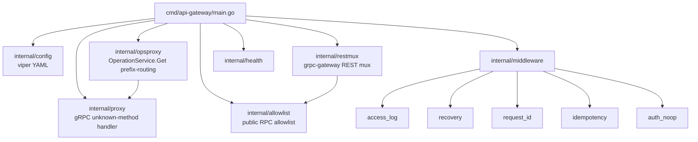

# kacho-api-gateway — package graph



## Listener split (KAC-50)

```mermaid
graph LR
    client[client]
    plain[plain :8080<br/>cluster + UI + admin]
    tls[TLS :443<br/>yc CLI compat]
    backend_vpc[vpc:9090/9091]
    backend_compute[compute:9090/9091]
    backend_rm[rm:9090]

    client --> plain
    client --> tls
    plain -.full RPC set incl. Internal.-> backend_vpc
    plain --> backend_compute
    plain --> backend_rm
    tls -.public RPC только<br/>allowlist filter.-> backend_vpc
    tls --> backend_compute
    tls --> backend_rm
```

Internal RPC (admin, IPAM, infra-data) фильтруются на TLS listener middleware'ом (через `allowlist` package).

## RPC registration

`restmux/mux.go` регистрирует все backend gRPC-services через grpc-gateway:

```go
// public
vpcv1.RegisterNetworkServiceHandler(...)
vpcv1.RegisterSubnetServiceHandler(...)
// ... (all 8 vpc resources, all compute resources, rm)

// internal (only if vpcInternalAddr != "")
vpcv1.RegisterInternalAddressPoolServiceHandler(...)
vpcv1.RegisterInternalNetworkServiceHandler(...)
// ...
```

## OperationService routing

`opsproxy/` — кастомный handler для `OperationService.Get(id)`. По первым 3 chars `id`'а (prefix-based) маршрутизирует в правильный backend:
- `enp...` → vpc (Network/RT/SG/Gateway/PE + Operations of VPC)
- `e9b...` → vpc (Subnet/Address/NIC)
- ~~`bpf...` / `b1g...` → resource-manager (Organization/Cloud/Folder)~~ — removed в KAC-124 (resource-manager retire; Account/Project → iam)
- `fd8...` → compute (Instance)
- `epd...` → compute (Disk)
- ... (см. `kacho-corelib/ids` для полного prefix map).

## Cross-repo runtime edges

```
client → api-gateway:8080
  → vpc:9090 (public)
  → vpc:9091 (internal — only via cluster-internal listener)
  → compute:9090 / 9091
  → iam:9090 / 9091     (Account/Project; resource-manager removed в KAC-124)
```

См. [[../architecture]] для полного графа.

## Build-зависимости

- [[../kacho-proto/README|kacho-proto]] — все proto-stubs которые проксирует.
- [[../kacho-corelib/README|kacho-corelib]] — `grpcsrv`, `observability`, `errors`, `retry`, `shutdown`.

См. [[README]] для overview.

#kacho-apigw #packages #grpc #routing
