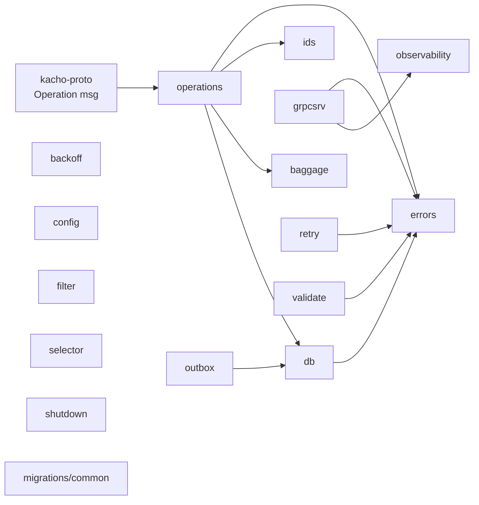

# kacho-corelib — package graph

Все 15 пакетов независимы между собой (за исключением узких зависимостей выше) — это **строго горизонтальная** общая библиотека.

## Кто что использует

| Consumer | Used packages |
|---|---|
| [[../kacho-vpc/README\|kacho-vpc]] | `ids`, `operations`, `db`, `validate`, `filter`, `outbox`, `baggage`, `grpcsrv`, `observability`, `errors`, `retry`, `shutdown`, `migrations/common` |
| [[../kacho-resource-manager/README\|kacho-resource-manager]] | `ids`, `operations`, `db`, `validate`, `grpcsrv`, `observability`, `errors` |
| [[../kacho-api-gateway/README\|kacho-api-gateway]] | `grpcsrv`, `observability`, `errors`, `retry`, `shutdown` |
| kacho-compute | (аналогично vpc — все 15) |
| kacho-loadbalancer | (frozen — минимум `ids`, `db`, `grpcsrv`) |

## Зависимости

- **Внутрь**: `kacho-proto/gen/go/kacho/cloud/operation/v1` (для Operation message в `operations/`).
- **Из вне**: все 5 Go-сервисов Kachō.

См. [[README]] для overview.

#kacho-corelib #packages #shared
