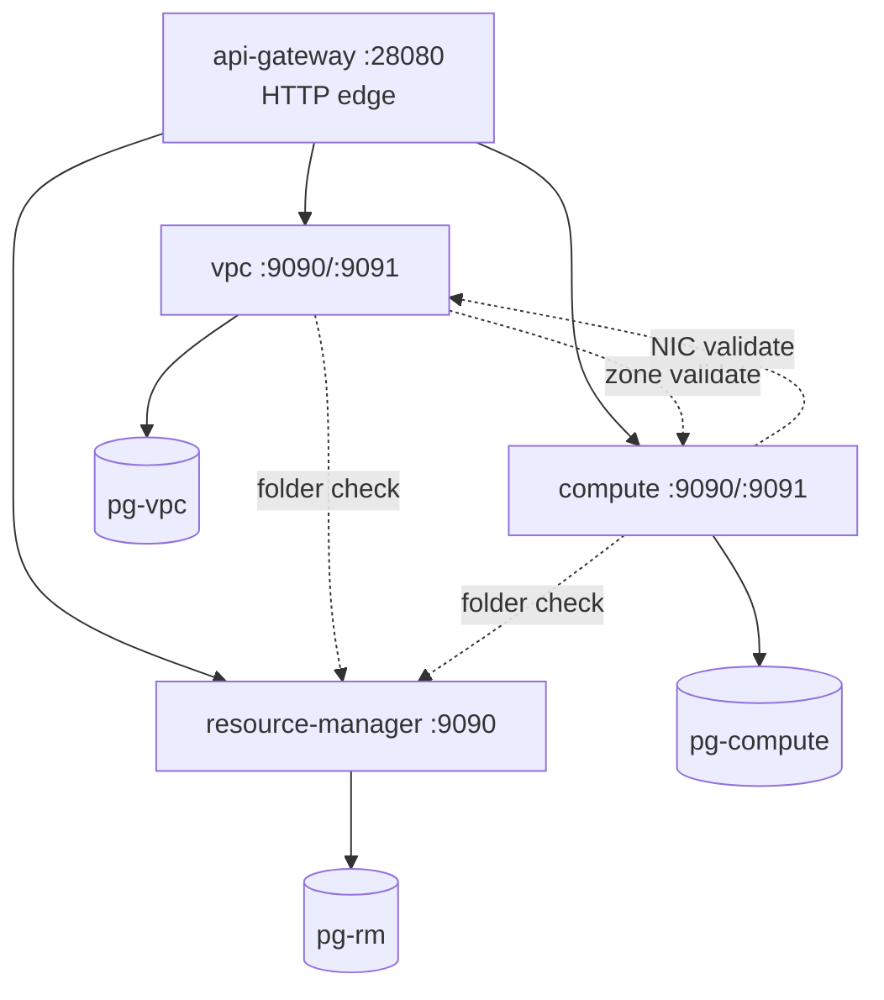
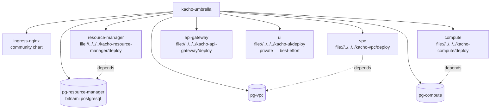

# kacho-deploy — stack схема

## docker-compose CI stack (ci/docker-compose.yml)

Bring-up order: pg's first (depends_on with health check) → rm/vpc/compute → api-gateway.

## Helm umbrella chart (helm/umbrella/)

Each service-chart содержит:
- `Deployment` — main app container + **init container `migrate`** (`kacho-migrator up`).
- `Service` (ClusterIP).
- `ConfigMap` (viper YAML mounted at `/etc/<svc>/config.yaml`).
- `Secret` (DB credentials).

## E2E tests (e2e/)

| Test | Что проверяет |
|---|---|
| `0.1/E1-dev-up-under-10min.sh` | `make dev-down && make dev-up` < 600s. |
| `0.1/E5-secrets.sh` | 3 pg-credential secrets exist. |
| `0.1/E6-ingress-ready.sh` | ingress отвечает 200/301/302/404/503 (gateway up). |
| `0.1/E7-no-service-pods.sh` | no Service pods up (только Deployment + StatefulSet). |
| `0.1/E8-dev-down-clean.sh` | `make dev-down` — namespace deleted. |
| `0.1/E9-emptydir-regression.sh` | persistence: false → emptyDir mount. |
| `0.1/F1-port80-busy.sh` | Negative: если порт 80 занят, dev-up должен fail с понятным error. |
| `0.1/F2-missing-tools.sh` | Negative: preflight ловит отсутствие docker/kind/kubectl/helm. |
| `geography-move.sh` | Cross-service: kacho-vpc validates zone_id через kacho-compute. |

## CI workflows (.github/workflows/ci.yaml)

- **`helm-lint`** (on push/PR) — `helm dep update && helm lint .` umbrella.
- **`e2e-on-kind`** (only on schedule/dispatch, `continue-on-error: true`) — full kind cluster + e2e suite. kind-infra-bound.

См. [[README]] для overview.

#kacho-deploy #helm #docker-compose #e2e #kind
