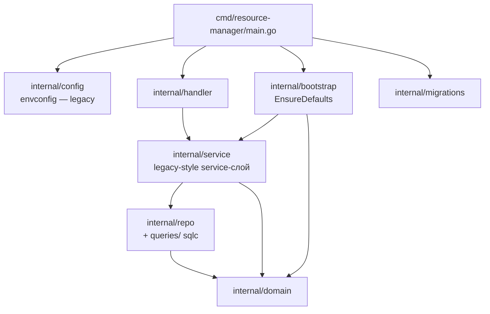

# kacho-resource-manager — package graph

## Известные структурные расхождения от skill evgeniy

- НЕ на CQRS Reader/Writer pattern (legacy `*Repo` interface).
- НЕ на use-case structure (`internal/apps/kacho/api/<X>/`) — всё в `internal/service/`.
- НЕ на viper YAML config (envconfig).
- domain типы используют голые `string` для name/description (нет newtypes).
- Не разделён `domain.X` / `repo.XRecord` (CreatedAt в domain).

**Replicate skill evgeniy на kacho-resource-manager — отложен** (per user decision Wave 5).

## RPC list

### OrganizationManager (proto: `organizationmanager.v1`)

- `OrganizationService.{Get, List, Create, Update, Delete, ListAccessBindings, SetAccessBindings, UpdateAccessBindings, ListOperations, Move}`
- `UserAccountService.{Get, List}`

### ResourceManager (proto: `resourcemanager.v1`)

- `CloudService.{Get, List, Create, Update, Delete, ListAccessBindings, SetAccessBindings, UpdateAccessBindings, ListOperations}`
- `FolderService.{Get, List, Create, Update, Delete, ListAccessBindings, SetAccessBindings, UpdateAccessBindings, ListOperations, Exists}`

## Bootstrap behaviour

`internal/bootstrap.EnsureDefaults` создаёт **default** Organization + Cloud + Folder при первом старте если их нет в БД (поиск по name = `"default"` через `OrganizationService.List`). Это нужно для tests/dev без manual setup.

ID'ы рандомные — newman/integration tests discover их через `treq GET /organization-manager/v1/organizations`.

## Cross-repo runtime edges

- **In-bound**: vpc/compute/api-gateway/ui → `FolderService.Get` / `Exists` (validation peers).
- **Out-bound**: никого не зовёт (leaf-owner).

## Build-зависимости

- [[../kacho-proto/README|kacho-proto]] — Organization/Cloud/Folder stubs.
- [[../kacho-corelib/README|kacho-corelib]] — ids, operations, db, validate, grpcsrv, observability, errors.

См. [[README]] для overview, [[../architecture]] для cross-repo графа.

#kacho-rm #packages #organization #folder
