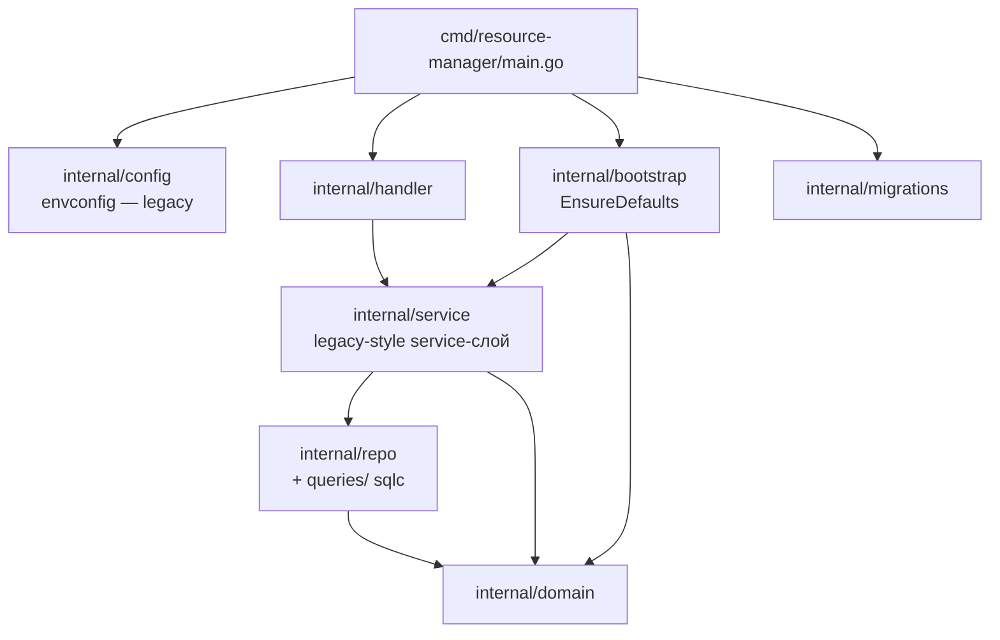

> [!warning] Репозиторий снят целиком (KAC-124) — исторический след
> Всё ниже описывает **бывший** сервис: его в дереве продукта нет. Схема пакетов,
> перечень методов и поведение начального посева оставлены как след, а не как
> описание действующего. Организация, облако и папка заменены аккаунтом и
> проектом в iam. Обзор — [[README]], тикет — [[../KAC/KAC-124]].

# kacho-resource-manager — package graph (снят, KAC-124)

```mermaid
graph TD
    cmd[cmd/resource-manager/main.go]

    domain[internal/domain]
    config_pkg[internal/config<br/>envconfig — legacy]
    repo_pkg[internal/repo<br/>+ queries/ sqlc]
    service[internal/service<br/>legacy-style service-слой]
    handler[internal/handler]
    bootstrap[internal/bootstrap<br/>EnsureDefaults]
    migrations[internal/migrations]

    repo_pkg --> domain
    service --> domain
    service --> repo_pkg
    handler --> service
    bootstrap --> service
    bootstrap --> domain

    cmd --> handler
    cmd --> bootstrap
    cmd --> config_pkg
    cmd --> migrations
```

## Известные структурные расхождения от skill evgeniy

- НЕ на CQRS Reader/Writer pattern (legacy `*Repo` interface).
- НЕ на use-case structure (`internal/apps/kacho/api/<X>/`) — всё в `internal/service/`.
- НЕ на viper YAML config (envconfig).
- domain типы используют голые `string` для name/description (нет newtypes).
- Не разделён `domain.X` / `repo.XRecord` (CreatedAt в domain).

**Replicate skill evgeniy на kacho-resource-manager — отложен** (per user decision Wave 5).

## RPC list

### OrganizationManager (proto: `organizationmanager.v1`)

- `OrganizationService.{Get, List, Create, Update, Delete, ListAccessBindings, SetAccessBindings, UpdateAccessBindings, ListOperations, Move}`
- `UserAccountService.{Get, List}`

### ResourceManager (proto: `resourcemanager.v1`)

- `CloudService.{Get, List, Create, Update, Delete, ListAccessBindings, SetAccessBindings, UpdateAccessBindings, ListOperations}`
- `FolderService.{Get, List, Create, Update, Delete, ListAccessBindings, SetAccessBindings, UpdateAccessBindings, ListOperations, Exists}`

## Bootstrap behaviour (историческое)

Начальный посев создавал организацию, облако и папку по умолчанию при первом
старте, если их не было в базе; идентификаторы были случайные, и чёрный ящик
находил их списком. Ни посева, ни маршрута, которым он находился, в дереве нет —
имена файла, функции и маршрута сняты, чтобы не читаться как координаты.

## Cross-repo runtime edges (исторические)

- **In-bound**: сеть, вычисления, шлюз и интерфейс звали сервис папок для
  проверки владельца.
- **Out-bound**: не звал никого — был листом графа обращений.

Обе роли перешли к iam: проверка владельца идёт на проект
([[../edges/vpc-to-iam-project-exists]]).

## Build-зависимости

- [[../kacho-proto/README|kacho-proto]] — Organization/Cloud/Folder stubs.
- [[../kacho-corelib/README|kacho-corelib]] — ids, operations, db, validate, grpcsrv, observability, errors.

См. [[README]] для overview, [[../architecture]] для cross-repo графа.

#kacho-rm #packages #organization #folder
