# kacho-vpc — граф пакетов

## Internal package import-graph

```mermaid
graph TD
    cmd_vpc[cmd/vpc/main.go<br/>composition root]
    cmd_mig[cmd/migrator/main.go<br/>cobra CLI]

    domain[internal/domain<br/>types/constants/builders/equal]
    dto[internal/dto<br/>generic Transferrable + RegTransfer]
    dto_toproto[internal/dto/toproto<br/>per-resource toPb + init]
    helpers[internal/repo/helpers<br/>SQL cols/scan/payload/errors]
    kacho_iface[internal/repo/kacho<br/>Repository / Reader / Writer]
    kacho_pg[internal/repo/kacho/pg<br/>pgxpool impl]
    kacho_mock[internal/repo/kacho/kachomock<br/>in-memory mock]
    repomock[internal/repo/repomock<br/>narrow mocks]

    api_network[apps/kacho/api/network]
    api_subnet[apps/kacho/api/subnet]
    api_address[apps/kacho/api/address]
    api_rt[apps/kacho/api/routetable]
    api_sg[apps/kacho/api/securitygroup]
    api_gw[apps/kacho/api/gateway]
    api_pe[apps/kacho/api/privateendpoint]
    api_nic[apps/kacho/api/networkinterface]
    api_ap[apps/kacho/api/addresspool]

    svc_addressref[apps/kacho/services/addressref]
    svc_networkinternal[apps/kacho/services/networkinternal]

    config[apps/kacho/config<br/>viper + Mode enum]
    clients[internal/clients<br/>folder + compute gRPC clients]
    handler[internal/handler<br/>InternalWatch + etc.]

    apps_migrator[apps/migrator<br/>Dialect interface + postgres/cockroach impls]
    migrations[internal/migrations<br/>goose .sql files]

    dto_toproto --> dto
    dto_toproto --> kacho_iface

    kacho_pg --> kacho_iface
    kacho_pg --> helpers
    kacho_mock --> kacho_iface

    api_network --> kacho_iface
    api_network --> dto
    api_network --> domain
    api_network --> clients
    api_subnet --> kacho_iface
    api_subnet --> dto
    api_subnet --> domain
    api_subnet --> clients
    api_address --> kacho_iface
    api_address --> dto
    api_address --> domain
    api_address --> clients
    api_rt --> kacho_iface
    api_rt --> dto
    api_rt --> domain
    api_sg --> kacho_iface
    api_sg --> dto
    api_sg --> domain
    api_gw --> kacho_iface
    api_gw --> dto
    api_gw --> domain
    api_pe --> kacho_iface
    api_pe --> dto
    api_pe --> domain
    api_nic --> kacho_iface
    api_nic --> dto
    api_nic --> domain
    api_ap --> kacho_iface
    api_ap --> dto
    api_ap --> domain

    svc_addressref --> kacho_iface
    svc_networkinternal --> kacho_iface

    handler --> kacho_iface
    handler --> domain

    cmd_vpc --> kacho_pg
    cmd_vpc --> kacho_mock
    cmd_vpc --> api_network
    cmd_vpc --> api_subnet
    cmd_vpc --> api_address
    cmd_vpc --> api_rt
    cmd_vpc --> api_sg
    cmd_vpc --> api_gw
    cmd_vpc --> api_pe
    cmd_vpc --> api_nic
    cmd_vpc --> api_ap
    cmd_vpc --> svc_addressref
    cmd_vpc --> svc_networkinternal
    cmd_vpc --> handler
    cmd_vpc --> clients
    cmd_vpc --> config

    cmd_mig --> apps_migrator
    cmd_mig --> migrations
    cmd_mig --> config
```

## Dependency rule (Clean Architecture)

- `domain/` импортирует только stdlib + corlib (newtypes/option/dict). **Нет** pgx/proto/grpc.
- `repo/kacho/` импортирует только `domain/` + pgx (для pg-impl).
- `dto/` мост `repo.Record → proto.Message` через DTO-реестр.
- `apps/kacho/api/<X>/` импортирует `domain/` + `repo/kacho` + `dto/` + `clients/` (peer-ports).
- `cmd/vpc/main.go` — единственное место wiring (composition root).
- `handler/` — тонкий transport-слой.

## Repo-external dependencies

- `kacho-proto/gen/go/kacho/cloud/{vpc,operation}/v1` — protobuf-stubs.
- `kacho-corelib/{ids,operations,db,validate,filter,baggage,outbox,grpcsrv}`.
- `H-BF/corlib/{dict,option,parallel,client/grpc}`.

См. [[README]] для overview, [[../architecture]] для cross-repo.

#kacho-vpc #dependencies #imports
